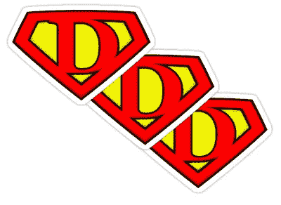
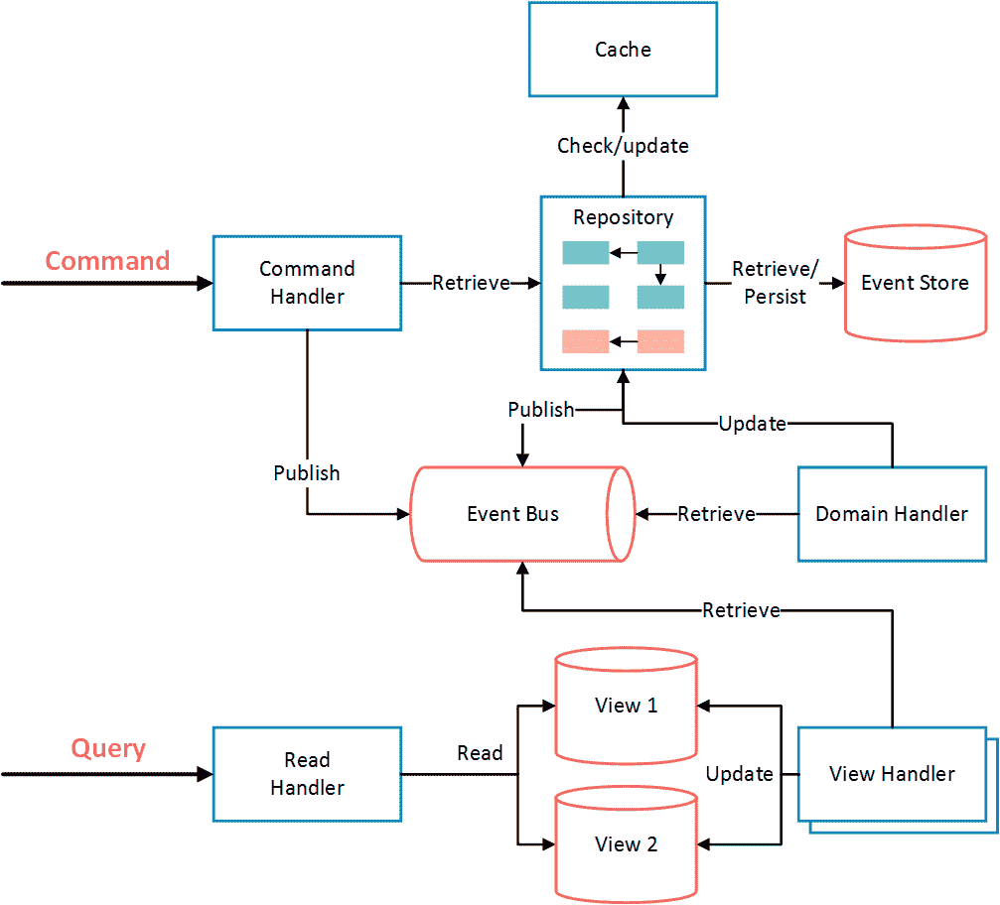
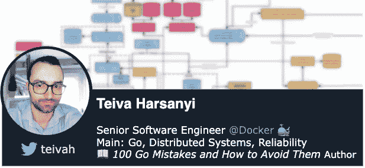

# 1 年的活动采购和 CQRS

> 原文：<https://itnext.io/1-year-of-event-sourcing-and-cqrs-fb9033ccd1c6?source=collection_archive---------0----------------------->


大约一年来，我一直致力于实现一个基于 CQRS 和事件源原则的应用程序。

这个帖子是我描述我的旅程的一种方式。我不想假装自己是格雷格·杨，但我相信分享我所面临的挑战和问题可能对一些人有用。尤其是如果你要开始自己的旅程。

# 商业背景

该项目的背景与空中交通管理(ATM)领域有关。我们为 ANSP 设计了一个解决方案，这是一个负责控制特定地理区域的空中导航服务提供商。该应用程序的目标很简单:计算和持久存储飞行数据。过程大致如下。

在飞机飞越其领空前几个小时，ANSP 会收到来自欧洲空中交通管制组织的信息。该信息包含计划数据，如飞机类型、出发、目的地、请求的路线等。一旦飞机到达 ANSP 的 AOR(责任区，ANSP 负责控制和监控飞行的区域)，我们可以从各种来源接收输入:轨迹更新(航班的当前位置)、修改当前路线的请求、轨迹预测系统触发的事件、来自冲突检测系统的警报等。


演职员表:[wtvr.com](http://wtvr.com)

尽管我们不得不同时处理潜在的几个并发请求，但在吞吐量方面，它无法与 Paypal 或网飞相比。

尽管如此，该应用程序是安全关键环境的一部分。万一出现严重故障，我们不会损失金钱或客户。我们可能会失去生命。因此，实施一个可靠、响应迅速且有弹性的系统来保证数据一致性/完整性显然是当务之急。

# CQRS，活动采购

这两种模式实际上都很容易理解。

## CQRS

CQRS(命令查询责任分离)是一种分离写(命令)和读(查询)的方法。这意味着我们可以用一个数据库来管理写入部分。而读取部分(也称为视图或投影)来自写入部分，可以由一个或多个数据库管理(取决于我们的用例)。大多数情况下，读取部分是异步计算的，这意味着两部分并不严格一致。我们稍后将回到这一点上。

CQRS 背后的一个想法是，数据库很难高效地管理读写。这可能取决于软件供应商做出的选择、应用的数据库调优等。例如，众所周知 Apache Cassandra 在持久化数据方面效率很高，而 Elasticsearch 非常适合搜索。使用 CQRS 确实是一种利用解决方案优势的方式。

此外，我们还可以决定处理不同的数据模型。再次，视要求而定。例如，管理一个在报告视图的上下文中使用的模型，另一个在写入部分的持久化期间有效的非规范化模型，等等。

关于视图，我们可能决定实现一些消费者不可知的视图(例如公开一个特定的业务对象)或者一些特定于消费者的视图。

## 活动采购

根据 Martin Fowler 的活动来源:

> 确保对应用程序状态的所有更改都存储为一系列事件

这意味着我们不存储对象的状态。相反，我们存储所有影响其状态的事件。然后，为了检索对象状态，我们必须读取与该对象相关的不同事件，并逐个应用它们。

## CQRS +活动采购

这两种模式经常被归为一类。在 CQRS 之上应用事件源意味着在应用程序的编写部分持久化每个事件。然后，从事件序列中导出读取部分。

在我看来，当我们实施 CQRS 时，不需要事件源。然而，相反的不一定是真的。

事实上，对于大多数用例，当我们实现事件源时，CQRS 是必需的，因为我们可能想要在 O(1)中检索状态，而不必计算 *n* 个不同的事件。一个例外是简单审计日志的用例。这里，我们不需要管理视图(也不需要管理状态),因为我们只对检索日志序列感兴趣。

# 领域驱动设计



演职员表:【ouarzy.com 

领域驱动设计(DDD)是一种解决与领域模型相关的软件复杂性的方法。它是 2004 年由 Eric Evans 在[领域驱动设计:解决软件核心的复杂性](https://www.amazon.com/Domain-Driven-Design-Tackling-Complexity-Software/dp/0321125215/)一书中介绍的。

我们不会介绍所有不同的概念，但如果您不熟悉，我强烈建议您看一看。然而，我们只是要介绍在 CQRS/事件源应用程序的上下文中有用的概念。

DDD 提出的第一个概念是集合。聚合是一组域对象，这些域对象在数据更改时被视为一个单元。聚合中的事务必须保持原子性。

同时，聚合使用不变量来加强它自己的数据一致性/完整性。不变量仅仅是一条规则，不管发生什么变化，它都必须保持不变。例如，STAR(标准终端到达航线，基本上是着陆前预定义的航线)总是与一个给定的机场相关联。一个不变量必须强制一个目的地机场在没有改变星的情况下不能被修改，并且这个星对于这个机场是有效的。

此外，充当聚合外观(处理输入并将业务逻辑委托给子对象)的对象称为聚合根。

关于组成集合的对象，我们需要区分实体和值对象。实体是具有身份的对象，它不是由其属性定义的。随着时间的推移，一个人会有不同的年龄，但他/她仍然是同一个人。另一方面，值对象完全由其属性定义。不同城市的地址是不同的地址。前者是可变的，而后者是不可变的。此外，一个实体可以有自己的生命周期。例如，一个航班首先准备起飞，空中(飞行)然后已经着陆。

在模型定义中，实体应该尽可能简单，并关注其身份和生命周期。在 CQRS/事件采购应用程序的上下文中，实体是一个关键元素，因为大多数情况下，在一个集合中所做的更改都取决于它们的生命周期。例如，确保每个实体实现一个函数来确定它是否与另一个实体实例相等是至关重要的。这可以通过比较标识符或一组保证身份的相关属性来完成。

现在我们知道了实体的概念，让我们回到不变量上来。为了定义它们，我们使用了一种受 BDD(行为驱动开发)格式启发的语言:

```
Given [entity] at state [state]
When [event] occurs
We shall [rules]
```

我真的觉得这是一件非常有效的事情。主要是因为这很容易被商业人士理解。

最后但并非最不重要的，DDD 还带来了有界语境的概念。基本上，我们不需要管理一个大型复杂的模型，而是可以将它划分到不同的上下文中，并有明确的边界。我已经在我的帖子[中提到过这个概念，为什么规范数据模型是反模式](https://medium.com/@teivah/why-is-a-canonical-data-model-an-anti-pattern-441b5c4cbff8)。

当我们必须设计一个视图时，我们可以应用有界上下文的概念。如前所述，一个视图可以是特定于一个消费者的(因为我们需要实现低延迟或者因为其他原因),也可以是几个消费者共有的。

在后一种情况下，我们必须考虑暴露的数据模型。它是整个公司的全球共享模型，还是在特定的上下文中制作的东西，比如一个给定的功能域？

如果这是一个共享模型，我们需要记住在变化的情况下对消费者的影响。这可以通过在视图之上应用服务层来缓解，但是我个人更喜欢直接将视图上下文化。例如，在模型变更的情况下，我们可以保留原始视图来展示先前的模型，并创建另一个视图来展示新的模型。

# 命令与事件

在事件源架构中，区分命令和事件非常重要。一个命令代表一个意图(用像 *CreateCustomer* 这样的现在时态建模)，而一个事件代表一个事实，一些已经发生的事情(用像 *CustomerUpdated* 这样的过去式建模)。

作为我的项目中的一个具体例子，一个事件可能是接收到指示当前飞机位置的雷达轨迹。系统几乎不能拒绝这样的事件，因为这是已经发生的已知事实(它具体何时发生可能取决于各种因素，如等待时间等。).

另一方面，想要修改飞行轨迹的飞行控制员是一个命令。这是用户的意图，在被认为是事实之前，它必须被我们的应用程序验证。

大多数情况下，命令被设计为同步交互，而事件被设计为异步交互。但并非在所有情况下都是如此。

记住数据所有权的概念也很重要。让我们想象两个系统 A 和 B 之间交换客户数据的简单交互。如果 A 产生一个异步的 *CustomerUpdated* 消息，被 B 捕获，并且 B 被认为是客户对象的所有者(在客户生命周期的当前阶段),它可能有权拒绝变更。尽管该消息看起来像一个域事件，但最终它只是 B 系统的一个普通的旧命令。

# 履行

该设计基于 [Axon 框架](http://www.axonframework.org/)。我不会再提这个框架了，因为这个帖子是技术不可知的。然而，如果您正在 Java 环境中实现一个应用程序，我强烈建议您看一看它。在我看来，Axon Framework 非常适合实现 CQRS/事件源应用程序。

让我们看看内部应用程序设计:



应用设计

简而言之，应用程序接收命令并发布内部事件。这些事件保存在事件存储中，并发布给负责更新视图的处理程序。我们也可以决定在视图之上实现一个服务层(称为读处理器)。

现在，让我们详细看看不同的场景。

## 聚合创建

命令处理器接收一个 *CreateFlight* 命令，并在域存储库中检查一个实例是否存在。该域存储库管理聚合实例。它首先在缓存中检查，如果对象不存在，它将在事件存储中检查。事件存储是保存事件序列的数据库。在我看来，我们稍后会看到什么是好的事件存储。在这种情况下，事件存储仍然为空，因此存储库不会返回任何内容。

命令处理器负责触发不变量。在失败的情况下，我们可以同步抛出一个指示业务问题的异常。否则，命令处理程序将向事件总线发布一个或多个事件。事件的数量取决于内部数据模型粒度的用例。在我们的场景中，我们将假设发布单个 *FlightCreated* 事件。

此事件触发的第一个组件是域处理程序。该组件负责根据实现的逻辑更新域集合。通常，逻辑被委托给聚合根(充当门面，但也可以将底层逻辑委托给子域对象)。请记住，聚合必须始终保持一致，还必须通过验证不变量来加强数据完整性。

如果处理程序成功(没有引发业务错误)，事件将被保存在事件存储中，缓存将使用最新的聚合实例进行更新。

然后，触发视图处理程序来更新它们对应的视图。就像普通的发布-订阅模式一样，视图只能订阅它感兴趣的事件。也许在我们的例子中，视图 2 是唯一对 *FlightCreated* 事件感兴趣的视图。

## 汇总更新

第二个场景是现有聚合的更新。在接收到 *UpdateFlight* 命令后，命令处理器要求存储库返回最新的聚合实例(如果有的话)。

如果实例被缓存，它不需要与事件存储进行交互。否则，储存库将触发所谓的再水化过程。

该过程是根据存储的事件序列计算聚合实例的当前状态的一种方式。事件存储中检索到的每个事件(假设 *FlightCreated* 、 *DepartureUpdated* 和 *ArrivalUpdated* )都在事件总线中发布。由 *FlightCreated* 触发的第一个域处理程序实例化一个新的聚合(基于来自事件本身的信息在内存中创建一个新的对象实例)。然后，其他域处理程序(由 *DepartureUpdated* 和 *ArrivalUpdated* 事件触发)将更新新创建的聚合实例。最后，我们能够根据存储的事件计算状态。

一旦计算出状态，对象实例就被放入缓存并返回给命令处理程序。然后，该过程的其余部分与聚合创建场景中的相同。

关于补液过程还有一点需要补充。如果一个聚合没有被缓存，并且我们为一个特定的聚合实例存储了 1000 个事件，那该怎么办？显然，计算它的状态需要很长时间。有一种已知的缓解方法叫做快照。

我们可以决定每隔 *n* 个事件将集合的当前状态保存为快照。该快照还将包含事件存储中的位置。然后，再水合过程将简单地从最新的快照开始，并从指示的位置继续。还可以基于其他策略类型创建快照(如果再水合时间超过某个阈值等。).

## 如何处理事件？


演职员表:【nofenergy.co.uk 

我想回到我们对命令和事件的区分上来。首先，区分内部和外部事件是值得的。外部事件由另一个应用程序产生，而内部事件由我们的应用程序产生(基于外部命令)。

我们就如何从技术上管理应用程序中的外部事件进行了一场有趣的辩论。我指的是过去已经发生的真实事件(比如雷达轨迹)。

实际上有两种可能的方法:

*   第一种方法是将事件视为命令。这意味着我们必须首先通过一个命令处理程序，验证不变量，然后产生一个内部事件。
*   第二种方法是绕过命令处理程序，直接将它作为事件保存在事件存储中。毕竟，如果我们谈论一个真实的事件，验证不变量等实际上是没有用的。然而，检查事件语法仍然很重要，以确保我们不会污染事件存储。

如果我们选择第二个选项，在聚合再水合过程中执行规则可能会很有趣。

让我们举一个雷达跟踪器公布飞行位置的例子。如果生产者不能保证消息的顺序，我们也可以保存一个时间戳(由生产者生成)并以这种方式计算状态:

```
if event.date > latestEventDate { // Compute the state
  latestEventDate = event.date} else { // Discard the event}
```

该规则将确保状态仅基于最近产生的事件。这意味着持续事件不一定意味着影响当前状态。

在第一种方法中，这种规则将在持久化事件之前实现。

## 事件模型

有必要为事件存储中持久化的事件创建一个单一的模型吗？在我看来，答案是否定的(至少在大多数情况下)。

首先，因为我们可能希望在一段时间内保持不同的模型版本。在这种情况下，我们必须实现一个策略来将一个事件从一个模型版本映射到另一个模型版本。

我想用一个具体的例子来说明另一个好处。让我们考虑一个从系统 A 和系统 b 接收事件的应用程序。这两个系统都基于自己的数据模型发布航班事件。如果我们创建一个公共数据模型 C，我们需要在持久化事件之前将 A 转换成 C，将 B 转换成 C。然而，在项目的某些时候，我们只对来自 A 和 b 的一些信息感兴趣。这意味着 C 只是 A 和 b 的子集。

但是如果以后，我们需要对我们的应用程序进行一些改进，并管理来自 A 和 B 的额外元素呢？因为事件是使用 C 格式持久化的，所以这些元素会丢失。另一方面，如果我们决定坚持 A 和 B 格式，我们可以简单地对命令处理程序进行一些改进来管理这些元素。

# 最终一致性


演职员表:[extraordinaryroutines.com](http://extraordinaryroutines.com)

## 理论

最终一致性是 CQRS(大多数时候)提出的一个概念。理解后果和影响是很重要的。

首先，值得一提的是有不同的一致性级别。

最终一致性是一种模型，在这种模型中，我们可以确保数据将被复制(从 CQRS 应用程序的写入到读取部分)。问题是我们不能确切保证什么时候。它将受到各种因素的影响，如总吞吐量、网络延迟等。这是最弱的一致性形式，但它提供了最低的延迟。

在 CQRS 应用程序上应用最终一致性意味着在某个时候，写入部分可能会与读取部分不同步。

相反，我们发现了强一致性模型。除非我们使用同一个数据库来管理读和写，或者我们通过使用两阶段提交把灵魂卖给了魔鬼，否则我们在分布式系统中不可能达到这种一致性水平。

如果我们有两个不同的数据库，最接近的实现是在一个线程中管理所有的东西。该线程将负责在写数据库和读数据库上持久化数据。一个线程也可以专用于一个聚合实例，并按顺序管理传入的命令。然而，如果在同步视图时出现暂时性错误，会有什么影响呢？我们需要补偿 CQRS 应用程序的其他视图和编写部分吗？我们需要实现出错重试循环吗？我们是否需要通过暂停命令处理程序来应用断路器模式，以阻止新的输入事件？重要的是解决明显会发生的短暂错误(任何可能出错的事情都会出错)。

在两种一致性模型(最终一致性和强一致性)之间，我们可以找到许多不同的模型:因果一致性、顺序一致性等。例如，客户端单调一致性模型仅保证每个会话(应用程序或服务实例)的强一致性。因此，实现 CQRS 应用程序不仅仅是在最终一致性和强一致性之间进行选择。

我的意见如下。因为我们很难保证有很强的一致性，所以让我们尽可能地拥抱最终的一致性。然而，先决条件是准确理解对系统其余部分的影响。

## 例子

让我们看一个我在项目中遇到的具体例子。

挑战之一是管理每个航班的唯一标识符。我们必须处理来自外部系统(公司外部)的事件，这些事件的标识符是不共享的。对于一个信道，标识符是复合的(出发机场+出发时间+飞机标识符+到达机场)，而另一个信道发送每个航班的唯一标识符(但第一信道不知道)。目标是管理我们自己的唯一标识符(全球唯一航班标识符的 GUFI ),并确保每个事件对应正确的 GUFI。

最简单的解决方案是确保每个传入事件都在应用程序的特定视图中进行了查找，以关联相应的 GUFI。但是如果这个观点最终是一致的呢？在最坏的情况下，我们可能有与同一航班相关的事件，但存储在不同的 GUFIs 中(相信我这是一个问题)。

一个解决方案可能是将这个 GUFI 的管理委托给另一个服务，这是非常一致的。

Greg Young 在问答环节提供了另一个解决方案。我们可以实现一种缓冲区，只包含应用程序处理的最后 *n* 个事件。如果视图不包含我们正在寻找的数据，我们必须检查这个缓冲区，以确保它不是刚刚收到的。 *n* 越大，减轻写入和读取站点之间不一致窗口的机会就越大。

该缓冲区可以使用诸如 Hazelcast、Redis 等解决方案进行分发。或者它也可以位于应用程序实例的本地。在后一种情况下，我们可能需要实现一种分片机制，使用哈希函数(最好是一个[一致性哈希](https://en.wikipedia.org/wiki/Consistent_hashing)函数，以便轻松地向外扩展)将与同一对象相关的事件总是分发给同一应用程序实例。

# 并发管理

几个月前我已经创建了一个[帖子](https://medium.com/@teivah/event-sourcing-and-concurrent-updates-32354ec26a4c)来描述使用事件源管理并发更新的好处。

简而言之，与悲观或乐观的解决方案相比，拥有一个事件存储可以帮助我们拥有一个智能的解决方案来处理并发更新。

此外，在数据模型中应用正确的粒度级别也是项目成功的关键。

# 选择事件存储


演职员表:[techcrunch.com](http://techcrunch.com)

我们可以决定使用任何种类的数据库来保存一系列事件。然而，最佳解决方案通常是为事件采购而构建的解决方案。

例如，隔离一个聚合实例是必须考虑的事情。让我们想象所有的事件都保存在一个表中。该表将随着时间的推移而不断增长，在聚合重新组合期间，我们必须过滤出与某个特定聚合实例相关的事件。恢复聚合的时间将取决于持久事件的总数，即使其中一些事件与我们感兴趣的实例无关。一个好的解决方案可能是让每个聚合实例有一个表/桶**来隔离事件。我们将把这个概念称为流。一个流总是链接到一个聚合实例(在大多数用例中)。**

以下是我们在选择事件存储时考虑的要求:

**写:**

*   恒定的写入延迟:不管流的大小如何，持久化事件的延迟必须保持恒定
*   原子性:在一个事务中可以追加多个事件
*   TTL 管理:根据事件的创建日期自动丢弃事件
*   无模式:存储多种事件类型和版本的能力

**阅读:**

*   按照书面顺序回读事件
*   从特定序列号读取(由于快照)
*   给定流中的恒定读取性能，不考虑其他流
*   皇家督学
*   缓存管理

**并发:**

*   乐观并发模型
*   幂等管理

**产品监控**

**解决方案支持**

**安全性:**

*   加密(传输)
*   证明
*   授权管理

**缩放**

**备份**

由于每个环境都是独一无二的，我很确定你会有自己的需求，但至少这可能是一个起点。

[](https://twitter.com/teivah)

❤️喜欢我的工作吗？你可以考虑成为 GitHub 赞助商:[https://github.com/sponsors/teivah](https://github.com/sponsors/teivah)。

# 结论

CQRS 和活动采购背后没有魔法。在开始您的旅程之前，理解这两种模式的许多影响是至关重要的。否则，很容易在技术和功能层面上造成一片混乱。

然而，一旦你对制约因素和缺点有了一个精确的概念，CQRS 和/或活动采购可以成为许多问题的一个很好的解决方案。

# 进一步阅读

*   [探索 CQRS，从微软](https://www.amazon.com/Exploring-Sourcing-Microsoft-patterns-practices-ebook/dp/B00EUGIRQY)采购活动
*   [丹尼尔·惠特克博客](http://danielwhittaker.me/)
*   [澄清 CQRS](http://udidahan.com/2009/12/09/clarified-cqrs/) 来自达汗 Udi
*   来自 Greg Young 的事件源系统中的版本控制
*   [马丁·福勒的活动采购](https://martinfowler.com/eaaDev/EventSourcing.html)
*   [最终一致——从沃纳·威格尔再访](https://www.allthingsdistributed.com/2008/12/eventually_consistent.html)
*   [Azure Cosmos DB 一致性级别](https://github.com/MicrosoftDocs/azure-docs/blob/master/articles/cosmos-db/consistency-levels.md)