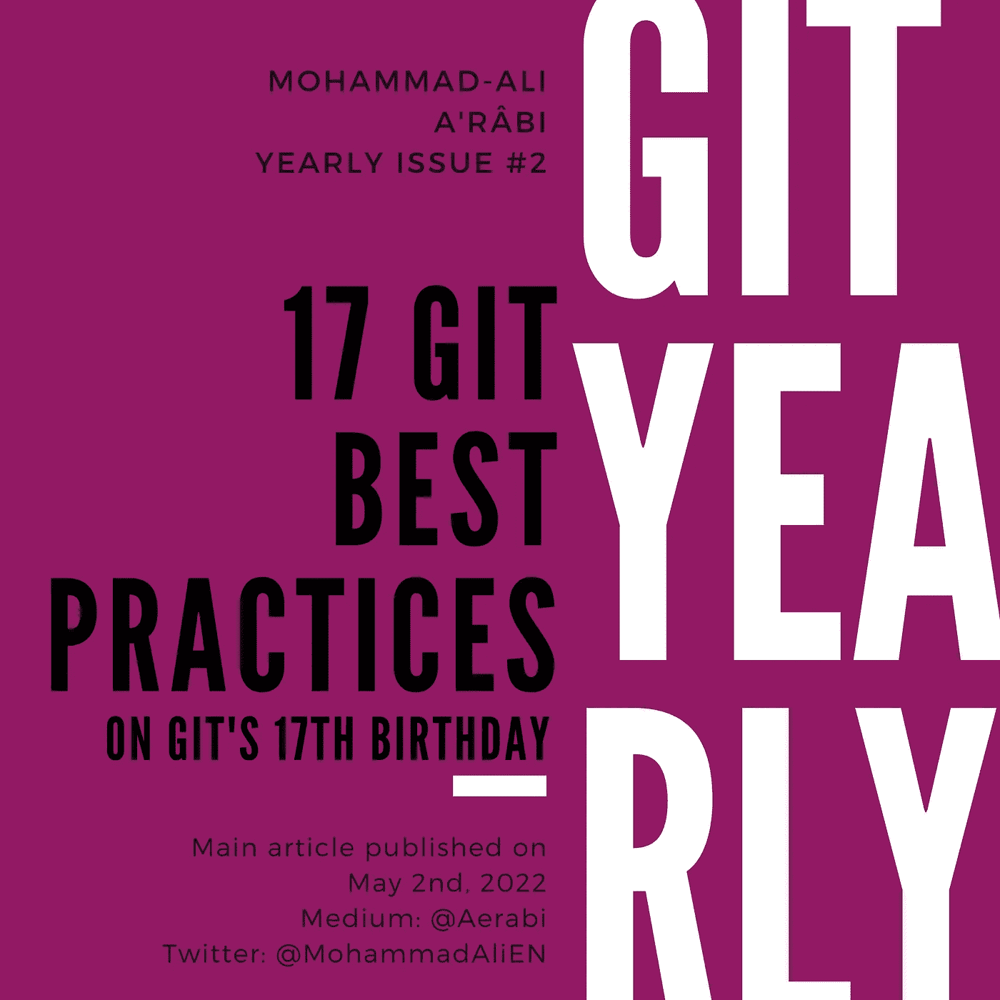

# 17 个 Git 最佳实践

> 原文：<https://itnext.io/17-git-best-practices-1988c7306e6b?source=collection_archive---------1----------------------->

## Git 17 岁生日的时候

去年 Git 16 岁生日的时候，我做了一个[“16 个 Git 技巧和窍门”](/16-git-tips-and-tricks-bf08d0602d3b)。今年，我将列出一个对初学者更友好的最佳实践列表。



# 0.输入您的个人信息

这通常是人们会做的第一件事，因为 git 不允许您提交:

```
git config --global user.name "Mohammad-Ali A'râbi"
git config --global user.email "mohammad-ali@aerabi.com"
```

另一件要记住的事情是，还有回购专用的个人信息。有时，我在同一台机器上提交我的工作回购和个人回购，但我必须用我的工作电子邮件处理前者，用我的个人电子邮件处理后者。很容易忘记和混淆电子邮件地址。

这就是为什么我建议在克隆回购的最开始更改回购级别的个人信息:

```
git config user.email "mohammad@my-employer.com"
```

# 1.忽略东西

当你犯了不该犯的错误时，把它从 git 的历史中删除会很痛苦。如果你已经提交了 GitHub 或 GitLab，你可能不能。

这就是为什么有些文件一存在就忽略比较好。最好的例子是编译后的文件。当然还有秘密、数据集、数据库等等。

创建一个`.gitignore`文件，并添加您希望 git 忽略的所有路径、扩展名和文件，例如:

```
# extensions
*.pyc# paths
/node_modules# files
application.exe
```

# 2.手动暂存文件

我见过很多人在提交时暂存所有已更改的文件。那是一个坏习惯。我见过很多不需要的文件都是因为同一个习惯而提交的。

当您想要提交时，首先检查哪些文件发生了更改:

```
git status
```

然后手动登台您想要的，一个接一个:

```
git add README.md
```

这是我用 GUI 工具做的唯一一件事，通常是用我的 IDE 提供的工具，因为我想在提交之前查看更改并检查它们。

用户还可以使用以下命令查看转移文件的更改:

```
git diff --staged
```

# 3.经常提交

提交是廉价的，尽管它的名字听起来可能不是这样。经常承诺跟踪你的变化。这将使维护更加容易:

*   如果您的整个工作没有通过一些测试，您可以一次一个提交地回到历史中去寻找根本原因，
*   如果您所做的更改被破坏，您可以恢复对它所做的提交，
*   此外，这也让其他人更容易检查你的工作。

# 4.提交权限

下一件重要的事情是要有一个相关的、信息丰富的提交消息。“修复 bug”是没有信息的。你希望你的提交有一个说明*什么*的标题，还有一个说明*为什么*的主体。一个好的提交消息如下所示:

```
Chore: Remove comments from tsconfig.jsonSnyk cannot import project if the tsconfig.json has comments in it,
it will complain about JSON validity.Fixes #12
```

要描述提交消息:

*   第一行是标题。通常，这是打印提交列表时唯一显示的内容。并且不能超过 72 个字符，否则 GitHub(或 GitLab)在显示时会将其截断。
*   提交主体通过一个空行与标头分开，并包含进行此更改的原因。
*   最后一行是页脚。人们可以利用这一点将提交与现有问题联系起来。这里的`#12`是这个提交正在解决的问题，当提交合并到 master 中时，它将自动关闭。

要了解更多关于提交消息的信息，请参考[“Git 提交消息的十诫”](/ten-commandments-of-git-commit-messages-94bd6dcf6e0e)。

# 5.创建分支

推送给师傅很方便。我当时在场。但是你可能想保持你的主枝干净并一直工作。创建一个分支，将您的代码推入其中，检查它，测试它，确保它可以工作，然后将它合并回 master。

最好创建 CI 作业来检查代码的语法错误，运行测试，检查格式，甚至可能检查提交消息。使用 GitHub 操作或 GitLab-CI。

# 6.每个拉取请求做一件事

特性分支被称为特性分支是有原因的:它们增加了一个特性。不要在一个拉取请求中包含 12 个功能:

*   这使得测试更加困难，
*   这使得复习变得更加困难，
*   这使得找出问题变得更加困难。

尽量保持拉取请求尽可能小。

> 让一个程序员检查 10 行代码，他会发现 10 个问题。让他做 500 行，他会说好看。

我记得有一次，我的同事在一个单一的拉请求中对一个特性分支做了六个变更。失败了，他不知道为什么，痛苦地尖叫了整整一周。最终，我介入并为他更改的 7 件事创建了 7 个不同的拉请求。将它们一个一个地合并，并找出导致失败的变化。我花了半天时间。

如果你为了节省时间而同时做多件事，那你就没有做到。

# 7.每个拉请求合并一个提交

如果您的拉请求只添加一个特性，那么为每个主分支添加一个提交是有意义的。这就是我所做的:

*   开发时经常提交，
*   [接受变更后，将提交压缩成一个](/git-commit-squash-64c5b23b188a)，
*   重新基于母版，
*   做一个快进合并。

要在母版上重设基础:

```
git pull --rebase origin master
```

对于快进合并，提交具有您编写的消息。如果你仔细地写了它，它会有一个链接指向你用它解决的问题。在该问题中，有一个指向拉请求的链接。因此，如果在 10 年后，一个开发人员偶然发现了你的变更并查看了你的提交，她可以找到她需要的所有上下文。

这就是我喜欢 squash-rebase-ff 胜过 squash merge 或创建合并提交的普通合并的主要原因。

要了解有关不同合并方式的更多信息，请参考以下文章:

*   [“Git 合并 vs Rebase:合并的三种类型”](/git-merge-vs-rebase-938950fb218)
*   [“Git Merge vs Rebase 以及在哪里使用它们”](/git-merge-vs-rebase-and-where-to-use-them-2a0a6e88769d)

# 8.正确命名你的分支

或许，这里最好的规则就是拥有一个。保持一致。拥有 10 个不同的名为`bug-fix`的分支并不能帮你找到路。

我是这样命名我的分支的:

```
aerabi/32-upgrade-to-angular-12
```

所以，它有三个部分:

*   作者句柄。这是我的 GitHub ID，后面是一条斜线。
*   问题 ID。您正在修复的问题的 ID。
*   简短的描述。通常与问题标题相同。

GitLab 和 GitHub 有从问题中创建分支的功能，我通常只是在它们前面添加我的句柄。

# 9.合并后清理您的分支

合并您的拉请求后，删除源分支。GitHub 和 GitLab 的 UI 中有一个按钮可以做到这一点。唯一剩下的问题是从您的本地回购中删除该分支。您可以通过设置 git 配置来实现这一点:

```
git config fetch.prune true
```

下次提取时，在远程存储库中删除的所有分支也将从本地存储库中删除。

# 10.拉动时重设基底

这可能发生在您身上:您在 master 上创建了一个新的 commit。您希望从远程 repo 获取更新，在获取时，git 会创建一个合并提交。如果发生这种情况，您就不能再推送到主服务器，因为您的本地主服务器不是远程主服务器的后代。

为了避免这种情况，请始终进行重置基础拉动:

```
git pull --rebase
```

您甚至可以通过更改配置使其成为默认行为:

```
git config --global pull.rebase true
```

设置好这个配置后，所有的拉取操作都将被提取和重定基础，而不是提取和合并。

# 11.重置基础前挤压

这就是 rebasing 的工作方式:它从另一个分支获取提交，并一次一个提交地应用您的更改。如果您的分支中有 17 个提交，并且有一个冲突，那么您有可能需要解决 17 次冲突。

甚至有可能在第一次提交时引入了冲突，而在第 17 次提交时消除了冲突。在这种情况下，通过挤压，你不再需要解决冲突。

# 12.不要强行推动

本节将两个规则合二为一:

*   从不强行推动，[用武力配合租借代替](/git-force-vs-force-with-lease-9d0e753e8c41)。
*   永远不要强迫推(或强迫租赁推)掌握。

对于第一个命令，该命令如下所示:

```
git push --force-with-lease
```

它基本上检查另一个合作者是否已经推送到您试图在您覆盖它们之前强制更新的分支。

下一点是，主树枝是神圣的，你不应该弄乱它。强行推进会改写历史，而你可能会毁掉它。

# 14.不要提交生成的文件

项目中通常会有大量的生成文件。对其中的一些人来说，很明显你不应该犯这些错误，对另外一些人来说不是:

*   二进制、字节码、机器码或任何其他编译或转换的工件
*   已安装的包，例如整个`node_modules`目录(由 Node.js 包管理器生成)
*   Python、`venv`或类似名称的虚拟环境目录(改为向您的项目添加一个依赖项列表并提交该列表)
*   生成的代码(例如，在 API 规范之外生成的 API 客户端)

确保在你的`.gitignore`文件中忽略它们。一旦一个文件被添加到 git 历史中，取出它是一件痛苦的事情。

# 15.提交前测试

越早修复代码，就越容易。这叫做“左移测试”。确保在提交代码之前运行测试和修复程序(如果有的话)(例如代码样式器和 linters)。

如果您有一些运行测试和代码风格检查的 CI 作业，那么通过在本地运行它们，您可以节省时间和计算。如果没有，您已经确保您没有推送损坏的代码。

我要讲一个故事。过去，我们有一个项目，也有一个运行测试的 CI 工作。但是这项工作稍微有些中断:即使测试中断了，它也会返回一个退出代码 0，所以 CI 工具会认为测试成功了。这项工作中断了 6 个月，我们没有注意到，因为我们从来没有将未测试的代码放入其中。

我会说，这是一个纪律严明的团队的表现。

# 16.添加一个配置项，并向其添加测试色调

这可能不仅仅是 git 实践，而是 GitOps，但是很难再将两者分开。

现在大多数 git 解决方案都有自己的 CI 解决方案，例如 GitLab-CI 或 GitHub Actions。而且有了 GitLab 的 Auto-DevOps 和 GitHub Actions marketplace，现在建立 CI 工作就容易多了。创建配置项检查，并使其成为您的拉取请求(或合并请求)的强制检查。

您可能要添加的检查:

*   编译、转换或编译:你的代码必须在语法上是正确的，并且是可编译的
*   代码格式化器:添加一个工具来格式化你的代码，并检查你推送的代码是否符合该格式，这将有助于 git 的责备和代码的一致性
*   安全检查:有一些工具可以检查你的代码是否有安全缺陷，CodeQL 就是一个很好的例子

# 遗言

如果你有任何其他你认为应该出现在列表中的建议，请在评论中提出来。否则，

*   [订阅](https://medium.com/subscribe/@aerabi)my Medium publishes，以便在新一期 Git 周刊出版时获得通知。
*   在 Twitter 上关注[我](https://twitter.com/MohammadAliEN)获取 git 上的每周文章和每日推文。