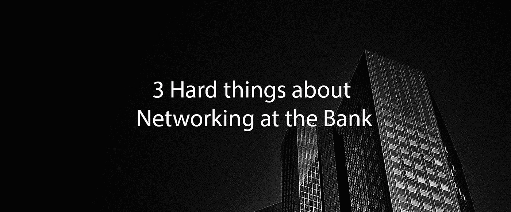

# 在银行建立关系网的 3 件难事

> 原文：<https://itnext.io/3-hard-things-about-networking-at-the-bank-3524dd3922b2?source=collection_archive---------2----------------------->

人脉很难。在受监管的环境中建立关系网更加困难。同时管理数百个以安全为重点的地点的网络听起来几乎是不可能的。

也许这就是为什么零售银行经常完全不做这件事。联网的计算机、机器和物联网设备对于任何现代公司来说都是必不可少的，但这也带来了安全威胁。公司是做什么的？保持安全，还是被遗忘？

**以下是主要的挑战。**

# #1:网络可能不可靠

如果您可以直接连接到所需的服务(打印机、扫描仪)，那么您就永远不会依赖网络。如果您通过网络提供这些服务，您的路由器可能会停机，然后您将无法在分支机构执行这些服务。银行分支机构不能失去他们需要的服务，所以他们不能依赖可能会瘫痪的网络。

# #2:开放的网络是危险的

允许通过网络访问设备和服务为许多新的漏洞打开了方便之门。在网络安全再次受到关注的一年里，这是一个比以往任何时候都更大的问题。如果不良行为者通过错误的设置获得了对分支机构内可信设备的访问权，这将导致各种恶意活动。银行分支机构不能允许恶意活动发生。

# #3:正确的社交很难

实现既可靠又安全的网络是可能的。当绝对需要联网时(如 ATM ),银行会确保有多层冗余以避免停机。他们还配置网络，以便只有受信任的一方才能访问。这需要投入大量的时间和资源。

要建立一个灵活的现代系统，你必须有一个灵活的网络，但银行往往承担不起所涉及的风险。在与[汤姆·帕雷特](https://medium.com/u/f6ddc4c0704a?source=post_page-----3524dd3922b2--------------------------------)的合作中，我们概述了这些问题以及网状 VPN 中的一个潜在解决方案。

Tom 目前是 Mphasis 银行解决方案架构副总裁。Tom 拥有 30 多年的金融服务技术领导经验，擅长核心银行系统、移动/在线银行、柜员和 ATM 渠道。

你可以点击查看[白皮书。](https://bankvpn.gravitl.com/)