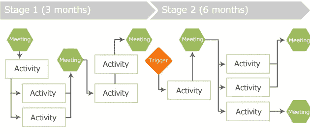
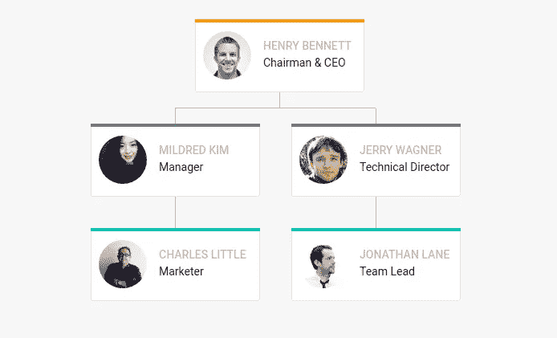
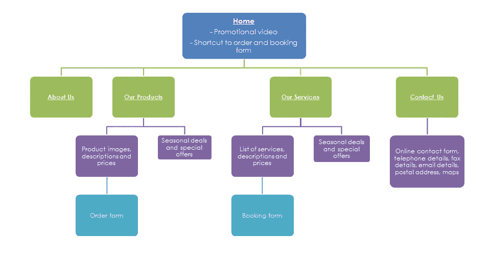

# 在业务应用中实现 JavaScript 图的 3 个用例

> 原文：<https://itnext.io/3-use-cases-of-implementing-javascript-diagrams-in-business-apps-e456d9fede24?source=collection_archive---------1----------------------->

业务数据可视化可以采取多种形式，从表示销售数量的简单图表开始，到允许一次跟踪几十个 KPI 的复杂仪表板结束。可视化工具的重要性不再是一个问题。以易于阅读和分析的形式即时获取重要指标的能力显著提高了生产率，并有助于做出重要的业务决策。

在本文中，我们将考虑在业务应用程序中使用 [JavaScript 图](https://dhtmlx.com/docs/products/dhtmlxDiagram/)的三个用例。这些信息将帮助你更好地理解现代可视化技术的可能性，并确定这些工具是否能给你带来一些好处。

## 业务流程的可视化

正确制作的业务流程的可视化提供了对当前情况进行快速分析的能力，并且在需要一些改变的情况下做出重要的业务决策。牢记特定的业务属性以确保目标导向和知情的沟通至关重要。当您为了进行一些业务优化更改而参加业务会议时，了解与所用业务流程的图形表示相关联的核心 KPI 的概况将非常有用。

如果您正确地使用 JavaScript 图表，您可以在图表上显示所有主要的业务流程属性，这将使利益相关者一目了然。

例如，在成本优化会议期间，业务流程可视化非常有用。有了主要的成本指标，你可以从一开始就确定重点。您将有机会轻松地定义您应该集中精力优化哪些活动，以显著降低成本。

[JavaScript 流程图](https://dhtmlx.com/blog/use-javascript-flowchart-process-visualization/)在面向流程的风险管理中也可能变得非常有用。如果您希望确保您的组织遵守当地的法规和法律，并且不存在某个业务流程可能导致的财务或物理损害的风险，您可以查看流程模型的可视化表示。您可以使用数据可视化工具将风险与特定的业务活动相关联，这将有助于确保流程和风险定义同步，并突出显示所有不可控的风险和潜在的问题点。

## 以直观的方式表示组织的层级

JavaScript 组织结构图允许以一种易于理解的形式表示一个组织的层次结构。组织结构图允许定义每个员工的职责范围，并明确特定公司成员在需要时应向谁报告。在这样的图表中，一个部门的领导通常显示在顶部。

这种商业应用程序为用户提供了可视化检查整个机制的不同齿轮如何相互关联的能力。根据您公司的结构，您可以选择其中一种图表。

**层级/自上而下的组织结构图**自上而下展示了特定组织的结构。这种组织结构图通常从董事长、首席执行官、企业主或部门主管开始。向下面出现的那个人报告的所有员工。该图表中显示的所有角色由一条代表所有雇员之间关系的线连接起来。所描述的图表类型适用于小公司，因为它并不意味着任何复杂的关系，并且比现有的选项更简单。因此，这种解决方案将满足一个公司的要求，该公司有几个向一个人报告的职员。如果需要在图表中添加管理人员和部门主管，事情会变得更加复杂。

另一个可能的选择是**矩阵式/跨职能组织结构图。这种组织结构图通常用于可视化商业组织的复杂结构。在这种情况下，我们处理雇员之间的其他类型的关系，如职能或报告关系。矩阵图显示了监督关系以及团队/项目关系。作为如何使用矩阵图的一个例子，你可以想到一个小公司，其中的员工应该向主管报告，并向他们的项目经理提供重要信息。**

## **导航地图**

在这种情况下，我们讨论的导航图描述了网站不同页面之间的关系(称为站点地图)或应用程序不同屏幕之间的关系(称为应用程序地图):

这样的地图允许回顾整个画面，并且理解用户界面如何流动或者用户将如何与网站交互。每个屏幕或网页都表示为一个带有简短描述的方框。线条连接这些框，显示用户如何在屏幕上导航。

分析这样的图表，你可以评估你的网站或应用程序的可用性。您可以轻松地定义在打开包含重要信息的特定网页之前，用户应该单击多少链接。对于应用程序，您将有机会检查主屏幕之外的应用程序功能是否易于使用。使用这种导航地图，你可以很容易地确定你公司的网站或你要创建的移动应用程序的设计弱点。这将有助于你获得更好的用户体验，使你的产品对用户友好。