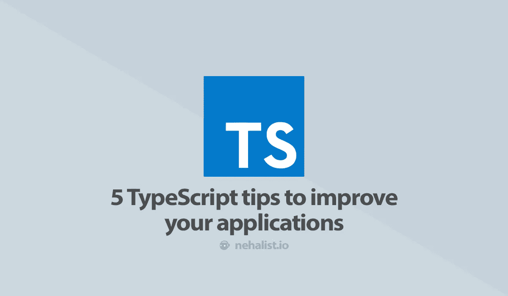

# 改进应用程序的 5 个打字技巧

> 原文：<https://itnext.io/5-typescript-tips-to-improve-your-applications-e882d69592bd?source=collection_archive---------2----------------------->



尽管我几乎每天都用 TypeScript 工作，但我还是经常学到一些新东西。我真的很喜欢用它工作，并且尽可能地充分利用它——有一点是肯定的:TypeScript 可以做很多事情。

这里是我从过去的经历中学到的一些东西，它们帮助我改进了我的应用程序，并最终成为一名更好的 TypeScript 开发人员。

# 实用程序类型

TypeScript 提供了一些现成的有用类型——它们被称为*实用类型*并且可以在[这里](https://www.typescriptlang.org/docs/handbook/utility-types.html)找到。

我个人最喜欢的类型之一是`Readonly<T>`类型使得`T`的所有属性都是只读的，这使得帮助你维护[的不变性](https://en.wikipedia.org/wiki/Immutable_object)变得很容易。

另一个方便的类型是`Required<T>`,它提供所有必需的属性。

还有更多类似于`Pick<T, K>`的东西，它创建一种从另一种类型中选取属性的*类型，`NonNullable<T>`从属性中移除`null`和`undefined`，`Exclude<T, U>`从一种类型中移除属性，还有更多——去[看看](https://www.typescriptlang.org/docs/handbook/utility-types.html)吧，它们真的很有用。*

# 用 unknown 代替 any

很多时候，如果您没有确切的类型信息，您可能会选择`any`。这实际上完全没问题——直到 TypeScript 3.0 引入了新的`unknown`类型，即*“类型安全对应的*`*any*`*”(正如 TypeScript 所描述的[)。](https://www.typescriptlang.org/docs/handbook/release-notes/typescript-3-0.html#new-unknown-top-type)*

*就像`any`类型一样，你可以给`unknown`类型分配任何你想要的东西——但是你不能像`any`类型那样用它做*任何*事情:*

```
*const imUnknown: unknown = "hello there";
const imAny: any = "hello there";imUnknown.toUpperCase(); // error: object is of type "unknown"
imAny.toUpperCase(); // totally fine*
```

*因此`unknown`由于其*未知的*性质而阻止对其调用任何方法。另外将`unknown`类型分配给其他类型也是不可能的:*

```
*let a: unknown = "hello world";
let b: string;b = a; // error: a is unknown hence it's not possible to assign it to `string`*
```

*通常情况下，你刚刚声明的变量`any`实际上是`unknown`——这可以防止错误的赋值或者在不知道它提供了什么方法的情况下调用它的方法。*

*关于`unknown`类型的更多信息，请参见此处的。*

# *查找类型*

*查找类型是帮助您找到所需内容的一种简洁的方式。让我们假设您有一个具有动态数量属性的对象，并希望从中获得一个特定的属性，很有可能通过以下方式实现:*

```
*const persons = {
  john: { surname: 'Doe' },
  bob: { surname: 'The builder' }
};persons.john; // equals { surname: 'Doe' }*
```

*但是有一个问题:如果`john`属性不存在怎么办？您的应用程序很可能悲惨地死亡——但这可以通过 TypeScript 来避免！*

*通过实现一个非常小的助手，我们能够防止这种情况:*

```
*function getProperty<T, K extends keyof T>(obj: T, key: K) {
    return obj[key];  // Inferred type is T[K]
}*
```

*通过使用这个助手，我们可以确保在使用它时属性存在:*

```
*function getProperty<T, K extends keyof T>(obj: T, key: K) {
    return obj[key];  // Inferred type is T[K]
}const persons = {
    john: { surname: 'Doe' },
    bob: { surname: 'The builder' }
};getProperty(persons, 'bob');
getProperty(persons, 'john');
getProperty(persons, 'someoneelse'); // Error: Argument of type "someonelse" is not assignable to parameter of type "bob" | "john"*
```

*在类中使用这种方法可能很常见，这使得`obj`参数过时了。它可能被实现为一个 getter，用于获取我们想要知道哪些元素可用的特定项目。在这种情况下，我们将使用一种相当不常见的语法:*

```
*class PersonList {
  persons = {
    john: { surname: 'Doe' },
    bob: { surname: 'The Builder' }
  }

  getPerson(name: keyof PersonList['persons']) {
    return this.persons[name];
  }
}*
```

*`keyof PersonList['persons']`可能不是你每天都能看到的。*

*这会导致调用`personList.getPerson('john')`完全正常，而`personList.getPerson('jane')`会失败，因为没有可用的`jane`键。*

# *扩展第三方库*

*如果你曾经想要扩展一个第三方库，但是受到那个库的公共 API 的限制，那么模块扩充就是你正在寻找的。但是你什么时候想要那个？*

*假设我们有一个角度应用程序，我们想命名我们的路线。默认情况下，Angular 接口不提供`name`属性——这正是模块扩充派上用场的地方。*

*通过在 Angular 项目的根中创建一个`typings.d.ts`,我们可以简单地告诉 TypeScript 我们想要一个额外的、可选的属性来存储名称:*

```
*import {Route} from '[@angular/router](http://twitter.com/angular/router)';declare module '[@angular/router](http://twitter.com/angular/router)' {
  interface Route {
    name?: string;
  }
}*
```

*重要的是从`@angular/router`导入，以便 TypeScript 注册剩余的属性。*

*现在，我们可以简单地为我们的路线添加一个名称:*

```
*const routes: Routes = [
  {
    path: '',
    name: 'theMightyDashboard',
    component: DashboardComponent
  },
];*
```

*例如，可以通过注入`ActivatedRoute`在我们的组件中使用:*

```
*constructor(private route: ActivatedRoute) {
  console.log(route.routeConfig.name); // logs `theMightyDashboard`!
}*
```

# *ES 类型*

*我经常看到除了本机 es 元素之外，大多数内容都被正确键入的类型脚本代码。想想类似[地图](https://developer.mozilla.org/en-US/docs/Web/JavaScript/Reference/Global_Objects/Map) s、[无极](https://developer.mozilla.org/en-US/docs/Web/JavaScript/Reference/Global_Objects/Promise) s、[阵法](https://developer.mozilla.org/en-US/docs/Web/JavaScript/Reference/Global_Objects/Array) s、[所有那种玩意儿](https://developer.mozilla.org/en-US/docs/Web/JavaScript/Reference/Global_Objects)。但是 TypeScript 为这些对象提供了现成的类型；*

*例如，地图确实提供了泛型来定义地图的内容。所以不要*

```
*const map = new Map(); 
map.set('name', 'John Doe');*
```

*我们可以通过指定映射键*和*值的类型来改进这一点:*

```
*const map: Map<string, string> = new Map(); 
map.set('name', 'John Doe');*
```

*这可以防止我们意外添加不允许的类型:*

```
*const map: Map<string, string> = new Map();
map.set('name', 123); // error: 123 is not a string*
```

*这同样适用于`Set`:*

```
*const set: Set<number> = new Set(); set.add(123); // Ok! set.add('whatever'); // Type error*
```

*或本机数组:*

```
*const elements: Array<{ name: string }> = []; 
elements.push({ name: 'John Doe' }); // Ok! 
elements.push('John Doe'); // Type error*
```

*如果你想看看所有可用的型号，请查看 [ES5](https://github.com/microsoft/TypeScript/blob/master/lib/lib.es5.d.ts) 和 [ES6](https://github.com/microsoft/TypeScript/blob/master/lib/lib.es6.d.ts) 的官方型号(或所有[其他规格](https://github.com/microsoft/TypeScript/tree/master/lib))。*

# *还有别的吗？*

*正如开头所说，TypeScript 可以做很多事情，有时很难保持最新。如果你真的喜欢 TypeScript 的某些东西，但你并不是每天都能看到，请在评论中告诉我！*

*如果你喜欢这篇文章，请留下👏，关注我上 [*推特*](https://twitter.com/nehalist) *并订阅* [*我的快讯*](https://nehalist.io/newsletter/) *。本帖原载于 2019 年 8 月 6 日* [*我的博客*](https://nehalist.io/5-typescript-tips-to-improve-your-architecture) *。**