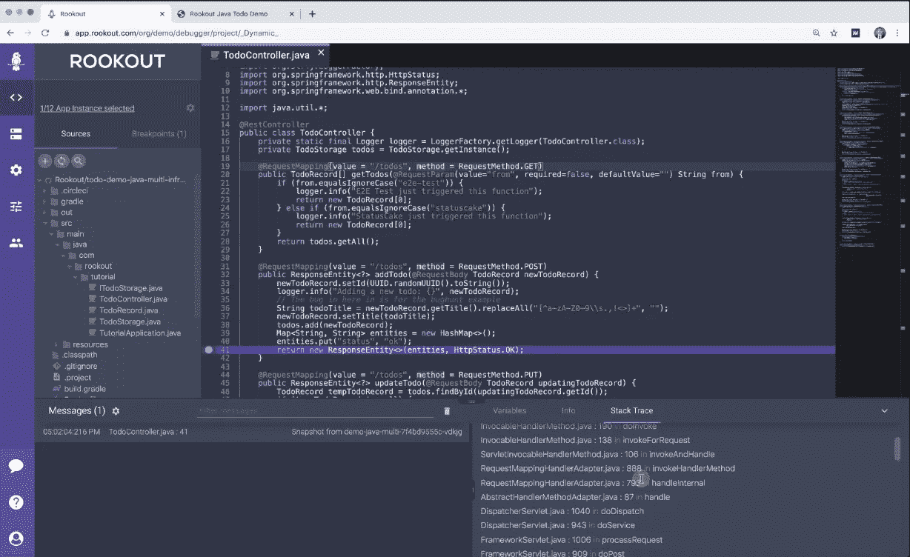

# 提高开发团队代码质量的 5 种方法

> 原文：<https://itnext.io/5-ways-to-improve-your-developer-teams-code-quality-db33f2430abf?source=collection_archive---------1----------------------->


当开发人员从不同的角度组成一个团队时，通常会出现一个问题——代码质量。对于单个开发者来说，这可能不是问题。但是对于一个团队来说，它变成了一个，因为代码质量可以提高开发的速度，也可以降低开发的速度。

在这篇文章中，我们将看看代码质量需要什么，以及在团队中提高代码质量的 5 种方法。

# 什么是代码质量？

编码不仅仅是关于构建的应用程序。虽然这是代码的最终结果，但内部才是最重要的。糟糕的代码导致不令人满意的应用程序，这将对用户和他们背后的团队产生负面影响。

代码质量是一个术语，用来描述一个源代码的**可读**、**可理解**、**有序**和**可维护**(仅举几个例子)。可读性和有序性会影响[的可理解性](https://www.rookout.com/blog/understandability)，它们都会影响可维护性。

代码可理解性在团队中是一个值得注意的因素，因为现在和未来的开发人员都应该能够轻松理解其他开发人员编写的代码。

当增加和减少(通常是改进)可以容易地实现时，代码被称为“可维护的”。如果代码质量很差，维护代码可能需要比正常情况下更多的时间，在代码质量得到保证之前，您会不断地浪费时间。

既然您已经知道了什么是代码质量及其好处，那么让我们来看看几种提高代码质量的方法。

# 提高代码质量的五个策略

**1。代码简明注释**

当开发人员想要注释他们的代码时，有些人通常会做得过火。过度并不总是好看的。然而，注释是代码质量之旅的良好开端。

当一个新的开发人员用简洁的注释来处理代码时，他们会更容易理解正在发生什么，已经发生了什么，或者将要发生什么。

这里有一个不太好的例子:

```
// get all user's posts
const getUsersPosts = () => {
...
}
```

如上所述，注释已经非常类似于函数的名字。如果没有这个函数，我们已经可以推断出文章是从数据库中收集的。

更好的评论:

```
// check DB to confirm if ticket exists
// all the required information for tickets are available
const verifyTicket = id => {
...
}
```

仅仅听到`verifyTicket`并不能真正解释发生了什么。但是通过上面的注释，可以理解代码中发生了什么。

即使文字代码实现可能难以理解，好的注释也可以作为实现的快速解释。

如果你的团队没有采纳或很少使用注释，你应该鼓励他们开始。这似乎与你当前的团队无关(可能是因为他们的经验水平)，但你不会永远与同一批人一起工作，所以养成使用简洁注释的习惯很重要。

**2。使用高效的调试工具**

像 [Postman](https://www.postman.com/) 、 [Visual Studio Code](https://code.visualstudio.com/) 、 [RubyMine](https://www.jetbrains.com/ruby/) 、 [Rookout](https://www.rookout.com/) 等调试工具的存在，让开发者团队的生活变得更加轻松。使用`console.log` s，在 DevTools 中添加断点，以及其他类似的方法都很好，但基于经验是有限的。

Rookout 看起来有点像编辑器。



它不能替代您的 IDE，但是它包含了使调试变得容易的特性(全部在线提供)。你可以将 Rookout 连接到你的实时应用程序，添加断点(不停止你的代码流)，监控和管理你的应用程序，还可以获得分析等等。

有了调试工具，代码的质量就提高了，因为开发环境中的主要焦点是实际的代码，而不是调试代码。此外，这为更多的开发人员创造了一个安全的空间，因为调试是在一个集中的在线空间中进行的。

**3。定义风格指南**

代码的一致性大大有助于它的可读性。不同的开发者有不同的偏好。有些人更喜欢单引号而不是双引号。有些人更喜欢 4 个空格而不是 2 个空格。有些人更喜欢某些规则。由于所有这些开发人员都致力于相同的代码，您经常会发现项目中不同文件的偏好混合在一起。

有了风格指南，作为项目贡献者的每个开发人员都被迫遵循项目的风格规范。

为了提高效率，有一些很棒的工具，比如 ESLint 和 beautiful。

ESLint 可以集成到各种 ide 中。在配置文件中定义了项目的样式规则后，ESLint 将在不符合样式指南的代码行中指出错误。


如上所述，ESLint 指示错误并显示消息。

使用这种方法，您可以确保团队的代码遵循标准。

另一方面，更漂亮的也可以集成到各种 ide 中。与指示错误的 ESLint 不同，Prettier 没有。然而，更漂亮的可以用来格式化一个文件，这将修复每一行代码的风格。

**4。测试你的代码**

好的代码质量最重要的部分是代码确实有效。确定这一点的一个可靠方法是应用测试。

在产品中发现代码错误对用户来说是一种糟糕的体验。如果你的团队还没有采用测试代码实践，现在是时候了。

虽然[编写测试可能很难并且令人沮丧](https://www.quora.com/I-hate-writing-unit-tests-because-it-takes-me-even-more-time-than-actual-implementation-what-should-I-do)，但是它可以在将来帮你省去很多修改。测试是可靠应用的基础。

在将代码提交或推送到存储库之前，可以在本地触发测试(由 [git-hooks](https://githooks.com/) 提供支持)。它们可以在应用程序部署后立即应用，甚至可以在应用程序运行时应用。这些测试将让你快速评估你的应用程序的性能，从而给你信心。

基于所使用的语言和你要测试的内容，有很多测试工具。你可以从[这个文档](https://www.tutorialspoint.com/software_testing_dictionary/test_tools.htm)开始，知道从哪里开始。

**5。正确命名变量**

命名事物是计算机科学中最难的问题之一。然而，[好的命名](https://carlalexander.ca/importance-naming-programming/)提高了你的代码质量。有些时候，命名可能太难了。在这种情况下，您可以依靠注释。

好的命名的好处在于它使开发更容易。在第一眼看到函数名之后，您就可以知道该函数在做什么，而不必在代码中搜索声明该函数的区域。

确保良好的命名极大地有助于代码的可理解性。

**Pro 提示:**创建只做一件事的函数。这有助于创建实际映射到返回值的简洁名称。

# 结论

在本文中，我们研究了代码质量及其与开发团队的相关性。此外，我们还研究了 5 种确保代码质量的有效方法。

除了你的团队能够开发出优秀的应用程序，代码质量是决定你的团队有多优秀的另一个因素。