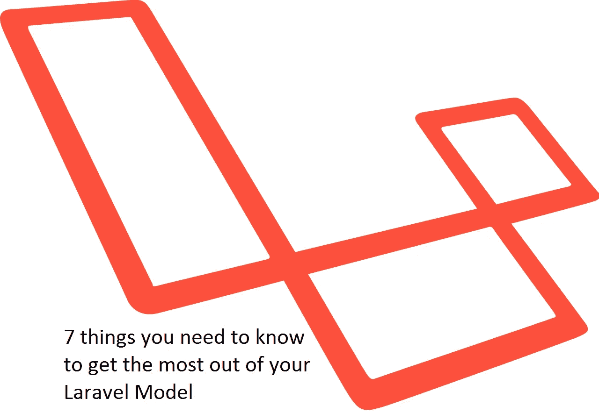

# 从 Laravel 模型中获得最大收益需要知道的 7 件事

> 原文：<https://itnext.io/7-things-you-need-to-know-to-get-the-most-out-of-your-laravel-model-4f915acbb47c?source=collection_archive---------0----------------------->



当我第一次开始在 Laravel 中开发时，我觉得在实现模型时，有很多事情可以用更好的方式来完成。在参加了雄辩的模型课程后，我发现了一些有趣的事情，你可以用你的模型做这些事情，让你的生活变得轻松许多。

在这篇文章中，我会给你七个建议，每个使用 Laravel 的人都应该知道，以充分利用你的模型。

## #1 首先，让我们从创建一个模型开始

通过命令行创建模型时，您可以指定应该在其中创建模型的文件夹。您只需在模型名称前键入文件夹的名称。当您的模型没有存储在默认的 *app* 文件夹中时，这很有帮助。

```
php artisan make:model Models/Product
```

这将在 *app/Models* 文件夹中创建一个*产品*模型，节省您手动将模型移动到正确文件夹的时间。

## #2 铸造属性

*$casts* 属性提供了一种将属性转换为特定数据类型的方法。

```
protected $casts = [
    'is_published' => 'boolean'
];
```

当您访问 *is_publish* 属性时，它现在将总是被转换为一个*布尔值*，即使它在您的数据库中被存储为一个*整数*。您可以将属性转换成许多类型，比如 *date* 和 *datetime* 。

我经常看到的一个错误是*日期*和*日期时间*属性在刀片模板中被格式化，就像这样:

```
{{ $blog->created_at->format('Y-m-d') }}
```

在一些 Blade 模板中，您会看到格式化在同一个变量上出现多次。这可以通过 *$casts* 属性更有效地完成。

对于*日期*和*日期时间*转换，您可以指定格式:

```
protected $casts = [
    'published_at' => 'datetime:Y-m-d',
];
```

这将总是以 *Y-m-d* 格式返回 *published_at* 属性，因此您不必在刀片模板中进行任何格式化。

## #3 可见性

有些属性不应该包含在模型的数组和 JSON 表示中，例如一个*密码*属性。这时， *$hidden* 属性开始发挥作用。

```
protected $hidden = [
    'password'
];
```

属性 *$hidden* 相当于属性的黑名单。或者，您可以使用 *$visible* 属性将属性列入白名单。

```
protected $visible = [
    'first_name',
    'last_name'
];
```

当在模型上设置了 *$visible* 属性时，其余的属性将自动隐藏。这就像*$可填充*和*$保护*属性一样。

## #4 访问者

有时您想将多个属性合并成一个属性，或者您只想格式化一个属性。这可以通过 Laravel 中的访问器来完成。

假设您有一个用户模型，它有一个*名字*和*姓氏*。如果你想显示全名，你可以这样做:

```
$this->first_name . ' ' . $this->last_name
```

这是一种非常幼稚的方法。解决这个问题的最简单的方法是使用访问器。访问器是在模型中使用以下语法定义的方法:

*获取【NameOfAttribute】属性*

全名的访问器如下所示:

```
public function getFullNameAttribute() {
    **return** "{$this->first_name} {$this->last_name}";
}
```

要访问访问者的全名值，您必须像这样调用它:

```
$user->full_name
```

## #5 变异体

赋值函数允许您操作值，并在雄辩模型的 *$attributes* 属性上设置操作值。赋值函数和访问函数有相同的语法。

```
public function setLastNameAttribute($value) {
    $this->attributes['last_name'] = ucfirst($value);
}
```

这个赋值函数将对姓氏应用 *ucfirst* 函数，并将结果存储在 *$attributes* 属性中。

```
$user->last_name = 'jones'; // Will result in `Jones`
```

## #6 追加值

当一个模型有访问器和关系时，默认情况下它们不会被添加到模型的数组和 JSON 表示中。为此，您必须将访问器或关系添加到模型的 *$appends* 属性中。现在让我们继续使用 *getFullNameAttribute* 访问器的例子:

```
$appends = [
    'full_name'
];
```

*注意:
添加到$appends 属性的访问器在 snake case 中被引用，即使该访问器是在 camel case 中定义的。*

让我们假设用户模型与博客模型有一对多的关系。

```
public function blogs() {
    return $this->hasMany(App\Blog::class);
}
```

要将博客添加到模型中，只需将它们添加到 *$appends* 属性中:

```
$appends = [
    'full_name',
    'blogs'
];
```

也可以指定应该附加的属性。例如，如果您只想将博客 id*和标题*追加到模型中。**

```
$appends = [
    'full_name',
    'blogs:id,title'
];
```

## #7 触摸

当一个模型与另一个模型有*隶属于*或*隶属于任何*关系时，在这种情况下，一个属于博客的评论，在某些情况下，当子模型被更新时，更新父模型的时间戳是有帮助的。这可以通过将关系添加到 *$touches* 属性来完成。

```
class Comment extends Model
{
    protected $touches = ['blog'];

    public function blog()
    {
        return $this->belongsTo(App\Blog::class);
    }
}
```

当评论模型得到更新时，这也将自动更新博客的 *updated_at* 属性。

这是我想与你分享的七件事，以充分利用你的模型。如果这些建议对你有所帮助，请务必看看我的其他帖子。如果您有任何反馈、问题或希望我写另一个与 Laravel 相关的主题，请随时留下您的评论。