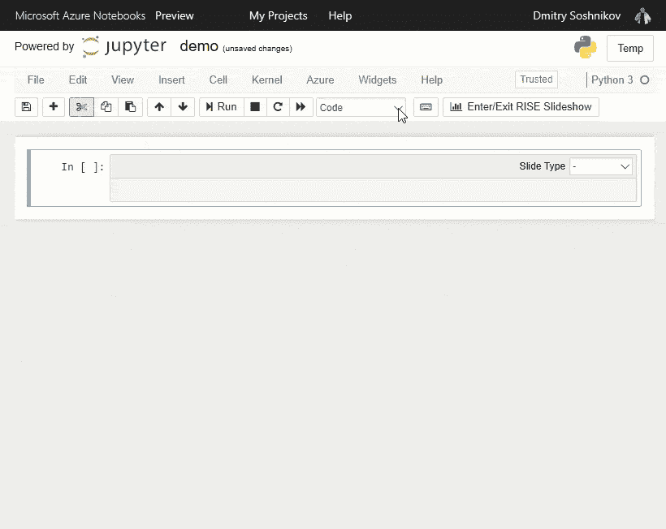
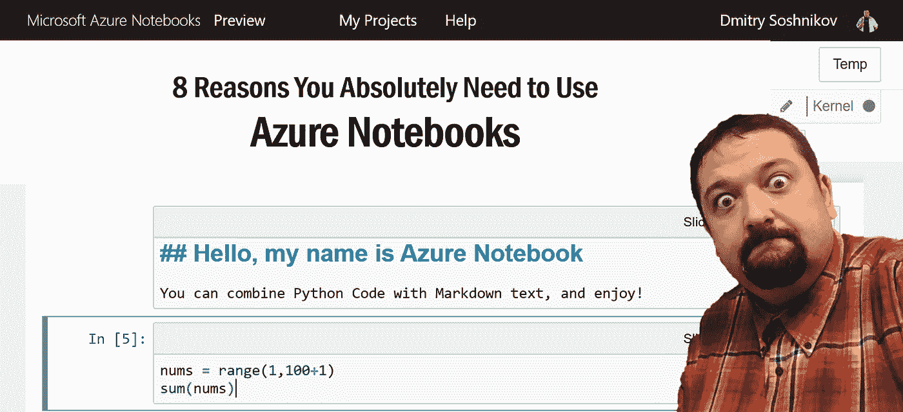
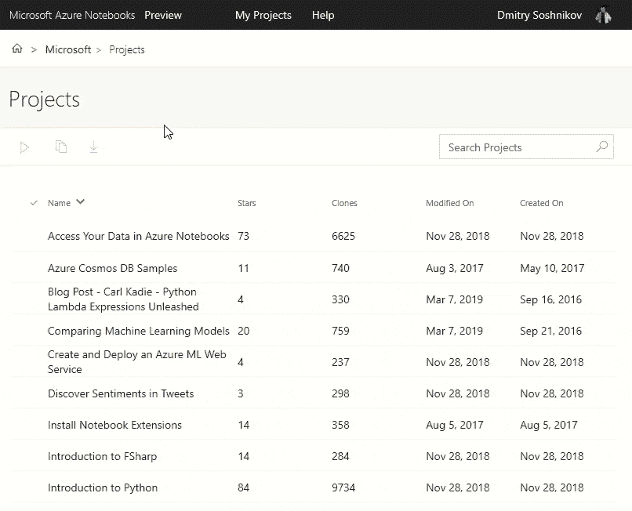
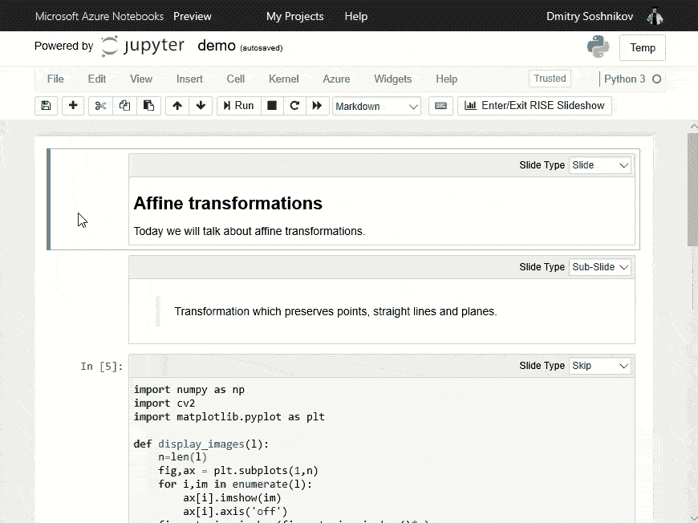
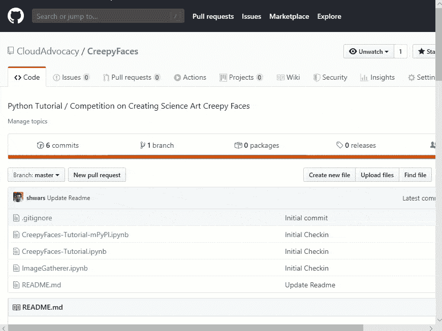
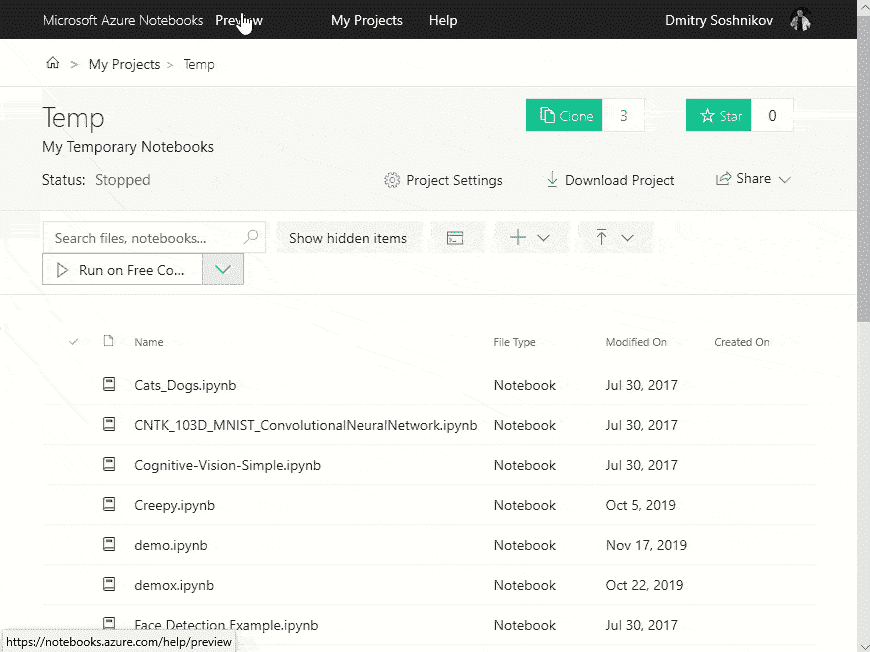

# 你绝对需要使用 Azure 笔记本的 8 个理由

> 原文：<https://itnext.io/8-reasons-you-absolutely-need-to-use-azure-notebooks-1c7a66c121c4?source=collection_archive---------6----------------------->

如果你像我一样是一名数据科学家或机器学习软件工程师，你可能会在 Jupyter 笔记本上编写大部分代码。对于那些不了解的人来说——Jupyter 是一个很棒的系统，它允许你将基于 markdown 的文本和可执行代码合并到一个基于网络的可编辑文档中，这个文档叫做 **notebook** 。

大多数数据科学家的工作方式是在自己的电脑上安装自己的 Python 开发环境副本(比如 [Anaconda](https://anaconda.org/) 或者更好的 [Miniconda](https://docs.conda.io/en/latest/miniconda.html) )，启动 Jupyter 服务器，然后在自己的 PC/Mac 上编辑/运行代码。在要求更高的情况下，您的开发环境可以托管在一些高性能计算服务器上，并通过 web 访问。然而，**使用云资源作为笔记本开发环境听起来是更好的选择**。这正是 [**Azure Notebooks**](http://notebooks.azure.com/?WT.mc_id=pers-blog-dmitryso) 的作用——托管在 Azure cloud 中的公共 Jupyter 服务器，你可以在任何地方通过浏览器使用它来编写你的代码。

使用 [Azure 笔记本](http://notebooks.azure.com/?WT.mc_id=pers-blog-dmitryso)代替本地 Jupyter 安装有很多好处，我在这里尽量涵盖。

你绝对需要使用 Azure 笔记本的 8 个理由

# 1.立即开始编码

无论你是想学习 Python，还是想用 F#做一些实验——你通常需要安装你的开发环境，可以是 Visual Studio 或者 Anaconda。这需要一些时间和磁盘空间，虽然如果您是认真的开发人员，这可能会有所回报——在环境设置上花费时间不是您想做的事情，只是为了尝试一段代码，或者如果您顺便去参加朋友家的聚会，并想向他们展示您最新的数据分析结果。在这种情况下，你只需登录在线笔记本环境，立即开始用任何支持的语言进行编码: **Python** 2 和 3、 **R** 或 **F#** 。

# 2.从任何地方访问您的代码

回到拜访朋友家的话题，你可能希望能够立即访问你的代码，而不需要携带 u 盘或从 OneDrive 下载。Azure 笔记本允许您在线保存所有项目。笔记本被组织成**项目**，类似于 GitHub 库，但是没有版本控制，任何项目都可以成为**私有**，或者**公共**。

# 3.轻松共享代码

Azure 笔记本是与其他人分享代码的好方法。每个项目都有一个唯一的链接，如果您想要共享它，只需使用此链接(同时确保项目被标记为公共)。通过该链接，其他人将能够:

*   查看您的代码
*   [**将**](https://docs.microsoft.com/en-us/azure/notebooks/quickstart-clone-jupyter-notebook/?WT.mc_id=pers-blog-dmitryso) 克隆到自己的项目副本中，并开始在线播放和编辑笔记本

因为，不像在 Google Colab 中，您是基于每个项目进行共享的，您可以通过一个链接共享几个笔记本，并且您还可以将数据、自述文件和其他有用的信息包含到项目中。

如果你需要以某种方式配置你的 Python 环境或者[安装特定的包](https://docs.microsoft.com/azure/notebooks/install-packages-jupyter-notebook/?WT.mc_id=pers-blog-dmitryso)——你也可以通过[配置文件](https://docs.microsoft.com/azure/notebooks/quickstart-create-jupyter-notebook-project-environment/?WT.mc_id=pers-blog-dmitryso)或者在笔记本中包含`pip install`命令来完成。在 F#笔记本上安装软件包是通过`Paket`管理器完成的，并且在这里[被记录](https://docs.microsoft.com/azure/notebooks/install-packages-jupyter-notebook/?WT.mc_id=pers-blog-dmitryso)。

# 4.撰写记录在案的代码/数据驱动的新闻

Notebook 是一个很好的方法，可以将完整的指令添加到代码中，或者将可执行代码添加到文本中。它在很多场景中都有用:

*   写指令或者解释一些和算法有关的概念。比如你想解释什么是仿射变换，可以先提供解释(也可以包括公式，因为 Azure 笔记本支持 **LaTeX** )，然后再包括一些对一张样图应用仿射变换的可执行例子。读者不仅可以看到代码是如何工作的，还可以修改代码并进一步使用它
*   用一些有数据支持的论点写一篇文字，比如在 [**数据驱动新闻学**](https://en.wikipedia.org/wiki/Data-driven_journalism) 或者 [**计算新闻学**](https://en.wikipedia.org/wiki/Computational_journalism) 。你可以以 Azure 笔记本的形式写一篇文章，它将自动从公共来源收集数据，生成一些实时图表，并计算得出的数字，这些数字将用于推动读者得出结论。

# 5.做演示

Azure 笔记本区别于所有其他类似服务的一个伟大特性是预装的 [RISE 扩展](https://rise.readthedocs.io/)，它允许你进行演示。您可以将单元格标记为单独的幻灯片，或前一张幻灯片的延续，这样在演示模式下，它看起来就像动画一样。

虽然你不能在设计方面做出花哨的演示，但在很多情况下，内容和简单很重要。Azure 笔记本特别适合学术风格的演示，尤其是因为你可以在任何文本中使用 **LaTeX** 公式。

# 6.克隆并运行任何 GitHub Repo

如果您是 GitHub 托管的 Python 项目的所有者，您可能希望给人们一个简单的机会来尝试您的项目。最简单的方法之一是提供一组笔记本，然后你就可以在 Azure 笔记本中直接克隆它们。Azure 笔记本支持从任何 GitHub 库直接克隆——所以你需要做的就是把一段代码放到你的 repo 的`Readme.md`文件中:

# 7.在不同的计算机上运行代码

在大多数数据科学任务中，您首先花一些时间编写代码并使其在小规模数据上工作，然后使用更强大的计算选项运行它。例如，如果你需要 GPU 进行神经网络训练，那么在非 GPU 机器上开始开发可能是明智的，一旦你的代码准备好了，就切换到 GPU。

Azure 笔记本可以让你无缝地做到这一点。当启动/打开一个库时，你可以选择在**免费计算**上运行它，或者你可以从与你的帐户相关联的 Azure 订阅中选择任何兼容的虚拟机(我说的兼容是指 Ubuntu 下的数据科学虚拟机)。因此，在我的大多数任务中，我将从免费计算选项开始，开发我的大部分代码，然后切换到 VM。Azure 笔记本将确保相同的项目环境(包括笔记本和其他项目文件)被转移(或者，更准确地说，*挂载*)到目标虚拟机，并在那里无缝使用。

我不得不提到，你得到的免费计算选项也很好，有 4 Gb 的内存和 1 Gb 的磁盘空间。

# 8.教

我个人在大学教过几门课程，我发现 Azure 笔记本在教学中非常有用。作为一名云倡导者，我还必须进行大量的演示、实验室和研讨会。以下是笔记本的使用方法:

*   **使用演示功能讲课**。我发现 Azure 笔记本幻灯片更容易维护和编写，因为你不需要专注于设计，而是专注于内容，内容保持降价格式。通常操作纯文本要容易得多，在 **TeX** 中插入数学公式要比使用 Word 公式容易得多。不利的一面是，插入图表和图片更痛苦，所以不要用笔记本做营销演示。
*   **用示例编写教科书**如果您在笔记本上编写幻灯片，您还可以添加一些幻灯片中没有的附加文本，这些文本对主题进行了更详细的阐述。因此*同一个笔记本既可以用作幻灯片，也可以用作教科书*。此外，这样的教科书将包括可执行的例子，作为演示，或学生自己工作的起点。
*   **进行实验/检查**。将您的实验室/考试的所有材料和初始代码准备到一个 Azure 笔记本项目中，然后通过一个链接立即与所有学生共享。然后，您的学生将克隆代码，并开始工作。为了收集结果，您可以从学生那里获得他们的个人项目链接(如果工作没有严格的时间限制)，或者要求他们向您发送或上传`.ipynb`-文件(如果您想确保学生按时完成代码)。

我也使用更高级的东西，如 Azure Functions，从实验室收集结果，但这是另一个故事，我可能有一天也会分享它…

# 一些缺点

虽然 Azure 笔记本是一个很好的工具，但在使用它们时，您需要记住一些事情:

*   网络接入不知何故受到限制。因为有了 Azure 笔记本，你可以获得一些免费的计算，让你在互联网上为所欲为，比如发送垃圾邮件，这不是很明智的做法。出于这个原因，Azure 笔记本内部的网络访问被限制在特定的资源集，包括所有 Azure 资源、GitHub、Kaggle、OneDrive 等等。所以，如果你想让你的笔记本从外部获取一些数据，你可能想把数据放在 GitHub/OneDrive 上，或者通过 web 界面手动上传到一个笔记本的项目目录中。
*   **在文本中插入图片**/图表。因为您以纯文本的形式输入所有文本，所以您缺少复制粘贴图像和绘制图表的简单 PowerPoint/Word 功能。所以，如果你想插入一张图片或者图表，你需要把它导出为 JPEG/PNG，上传到网上的某个地方(我大部分时间使用 GitHub)，使用 Markdown 语法插入到文本中。因此，如果你正在创建一个营销/激励演示文稿，使用 PowerPoint，对于科学/学术演示或大学课程，使用笔记本。
*   **GPU 访问**目前不包括在 Azure 笔记本的免费计算选项中。

# 例子

了解 Azure 笔记本具体特性的一个好方法，比如安装包、获取外部数据和绘制图表，就是看一下[示例笔记本](https://notebooks.azure.com/#sample-redirect)。这里可以找到一个很棒的 Jupyter 样本集合[这里](https://github.com/jupyter/jupyter/wiki/A-gallery-of-interesting-Jupyter-Notebooks)，记住——你可以通过上传`.ipynb`文件到一个项目中，在 Azure 中运行任何 Jypyter 笔记本。

# 结论

Azure 笔记本是一个很棒的工具，在我试图在这里介绍的许多场景中都很有用。如果你有更多的使用案例，请在评论中分享，我会非常感兴趣的！

虽然还有其他一些在云中运行笔记本的选项，包括 Google Colab 和 Binder，但是对比表明 Azure Notebooks 是一个拥有最有用功能的伟大工具。

我希望你和我一样喜欢在日常生活中使用 Azure 笔记本！

附注:一些更有用的文档可以在这里找到:[http://aka.ms/aznb](http://aka.ms/aznb)

*原载于 2019 年 11 月 17 日*[*【https://soshnikov.com】*](https://soshnikov.com/azure/8-reasons-why-you-absolutely-need-azure-notebooks/)*。*