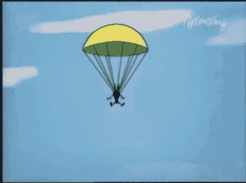

# 最重要的 Docker 概念及其命令的速成课程

> 原文：<https://itnext.io/a-crash-course-to-the-most-important-docker-concepts-and-their-commands-3cc09fd78953?source=collection_archive---------3----------------------->

在 [Twitter](https://twitter.com/chris_noring) 上关注我，很乐意接受您对主题或改进的建议/Chris

> *我为你写了这篇文章，你刚刚空降到一个周一开始的项目中，现在是周五下午，你有两个小时的空闲时间，你就像*废物*。我感觉你，我去过无数次了。不要担心，当你读完这篇文章的时候，你会对代码和 Docker 有更多的了解，尤其是他们在会议上谈论的内容。*

TLDR；这篇文章是 Docker 上的这个 [5 部分系列的基础。这个想法是为了传达错误的心态是如何阻止你正确地学习 Docker 的。我通过讲述我如何学习 Docker 的故事来传达这一点。如果您在这里学习了大量的 Docker，但对听这个故事不感兴趣，其中确实包含一些有用的命令，那么请点击进入 5 部分系列，因为这可能是您所想的。](https://dev.to/softchris/5-part-docker-series-beginner-to-master-3m1b?wt.mc_id=medium-blog-chnoring)

还在吗？太好了，故事时间。

本文已移至[https://softchris.github.io/pages/docker-concepts.html](https://softchris.github.io/pages/docker-concepts.html)