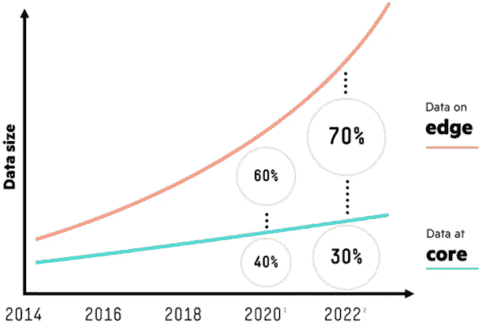
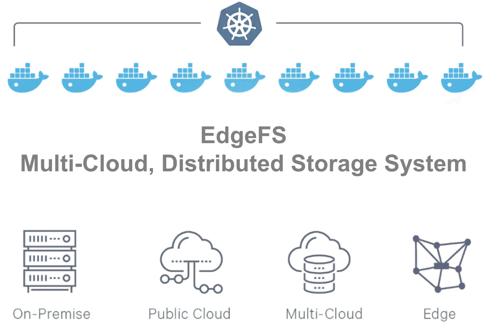

# 面向边缘/物联网和雾计算的数据层

> 原文：<https://itnext.io/a-data-layer-for-edge-iot-and-fog-computing-f3d162821fb5?source=collection_archive---------2----------------------->

# 引入现代的云时代集群数据层“EdgeFS ”,以解决边缘和雾计算的复杂问题

我们最近谈论了很多关于从速度和效率方面转变云数据密集型工作负载的方法。只要数据集离应用程序相当近，就可以实现这一点。我说的相当接近是指网络延迟。

这是一种遗留的集中式设计，我们将在本文中讨论现代云时代的问题。这种遗留设计假设所有数据都是“云生成的”，并神奇地出现在应用程序硬编码位置的云中。

当应用程序每天处理几千兆字节的数据和/或几百万条记录时，这种方法是可行的。为了进一步优化，我们采用异步数据复制或一些现成的持久消息队列技术。

当云连接网络“相当快”时，这是可行的，因此应用程序可以在几秒钟内上传几兆字节。我们将对其进行批处理，然后根据来复制它，以克服延迟问题。虽然并不总是可能的，但有时我们甚至可以使用多线程并行上传来修改我们的应用程序并批量发送数据。

所以，我们完成了，一切都很好，是吗？

差远了。这让我想起了 FIDO-Net 通过 ADSL 调制解调器批量发送数据包的奇迹，以及 Neo 打电话给 Trinity 让他离开 Matrix……那是多么令人印象深刻和复杂啊！:-)

我们来对比一下。虽然传输速度提高了 10-100 倍，但 WAN(广域网)网络 RTT(往返时间)延迟并未发生显著变化，仍然取决于连接站点之间的距离。即***20 多年来，广域网延迟并没有明显改善*** ，即使是从东海岸到西海岸的直接光纤连接也不会好于 40 毫秒-100 毫秒，具体取决于供应商和价格。

这不仅仅是一个延迟问题。人类在收集数据方面取得进展。我们现在将一切数字化，我们将全程无纸化，由于新兴的 5G 标准，我们现在将以 10Gbps 的速度收集数据！我在这里想说的是，我们对云边缘数据增长的一些预测可能被低估了。

考虑到这一点，我们的公共云处理中心根本无法跟上。将数据放在中心位置的经济学将被打破。这就是为什么新的雾计算模式正在出现。

现在回到数据层和连接站点。让我们重新评估。

**带宽或广域网 I/O 问题慢。**使用当前的模型来存储太字节或太字节的数据将会有问题，现在我们可以在计算边缘轻松收集这些数据。传感器和 5G 技术的爆炸现在能够产生数以亿计的记录，这是非常不可能的。

**延迟或慢速 WAN I/O 问题。**即使是最先进的光纤主干也无法提供比物理定律更好的网络延迟。随着所有 WAN 连接位置的距离增加，延迟也会增加。就目前的技术水平而言，对于能够利用批处理和多线程技术的应用程序来说，它可能会工作得更好一些，但这会带来总体上更大的复杂性以及处理最终一致性的必要性。

**数据复制问题。**数据拷贝后，肯定要保存在目的地的某个地方，以便分析，并在一段时间内重新分析。入口、云功能、CPU 或实例云成本与在云中存储数百 TB 数据(即使是暂时的)相比，仍然微不足道。

**数据管理问题。**不仅复制的数据不再能有效地进行重复数据删除或压缩，而且还会产生额外的费用，即管理不断增长的原始或后处理数据阵列时的拥有成本。

**数据“孤岛”问题。**如果由于业务需求、法规或其他原因，您有两个以上的区域需要保存数据，该怎么办？不可控的数字数据聚合会产生“孤岛”。随着时间的推移，数据孤岛将更加难以管理、移动、备份和分析。

**多云问题。**即使在相对较小的组织中，我们最终也会使用多个云。仅仅因为我们可以，而且由于 it 的经济性，我们成为了许多云产品的用户。而不仅仅是这里的另一个数据“筒仓”。我们现在面对的是一套不同的技术、协议和流程。即使只有几 TB 的数据到处都有副本，也是一个管理难题。因此，低估了对数据层复杂性的影响，从一开始就抹杀了实现云计算的好处。

# 我们需要一个新的数据层。

世界需要新的创新机制来轻松收集、分发、观察和消费数据。

该解决方案可以跨地理区域扩展，就像在本地扩展一样，避免了过多副本的重复，极大地简化了备份和灾难恢复策略设置，通过标准文件、数据块、对象和 NoSQL 接口提供多协议访问。

一个核心开源的解决方案，由社区驱动设计和开发。

与现有云原生生态系统完美集成的解决方案。

一种支持新型雾计算应用的架构。

# 介绍 EdgeFS —一种多云可扩展分布式存储系统

EdgeFS 是在 C/Go 中开发的 [Apache License v2.0 下发布的高性能低延迟对象存储系统。它提供 Kubernetes 集成的多头横向扩展文件访问(符合 NFS 标准，对文件的分布式读写访问)、具有](https://github.com/Nexenta/edgefs) [AI/ML S3X 增强功能的亚马逊 S3 兼容对象 API](https://edgex.docs.apiary.io/)、iSCSI 和 NBD 数据块接口、具有文件级粒度无限快照的高级全局版本控制、全局重复数据删除以及对来自本地、私有/公共云或小型边缘(IoT)设备的数据的地理透明访问。

EdgeFS 能够跨越无限数量的地理分布式站点(Geo-site)，连接为一个运行在 Kubernetes 或 Docker 平台之上的全球命名空间数据结构，为有状态 Edge/IoT 和雾计算应用提供持久、容错、高性能和兼容的存储协议，如 S3 对象 API、文件和数据块 [CSI 卷](https://github.com/Nexenta/edgefs-csi)。

在每个地理站点，EdgeFS 段节点作为容器(Kubernetes StatefulSet 或 Docker Compose)部署在物理或虚拟节点上，汇集可用的存储容量，并通过兼容的 S3/NFS/iSCSI/etc 存储模拟协议提供给在相同或专用服务器上运行的云原生应用程序。

# 简而言之，它是如何工作的？

如果你熟悉“git ”,所有的修改都是完全版本化和全局不可变的，很可能你已经知道它的核心是如何工作的。可以把它看作是一种世界级的写时复制技术。现在，如果我可以做一个比较，让您更好地理解它 EdgeFS 所做的，它将“git”范式扩展到对象存储，并使 Kubernetes 持久性卷可通过模拟存储标准协议(如 S3、NFS，甚至 iSCSI 等块设备)进行访问。通过完全版本化的修改、完全不可变的元数据和数据，用户数据可以跨许多地理站点透明地复制、分发和动态预取。

# EdgeFS 如何解决问题？

当我们设计 EdgeFS 时，我们从整体上考虑了不断升级的问题。我们不仅希望创建一个能够更好地连接站点的解决方案，还希望解决与传统方法(如基于策略或基于事件的数据拷贝)相关的本地性能和数据管理问题。我们意识到，如果我们将与核心数据层架构分开解决连接性和数据流定向问题，事情将不会更容易，我们将很快回到起点。因此，EdgeFS 为上述问题提供了一个独特的、功能完整的整体解决方案。

在边缘/物联网计算的效率以及如何使用 EdgeFS 解决这一问题的背景下，有两个最重要的问题需要讨论:

*   **缓慢的 WAN I/O。**当 I/O 是本地的时，即使在史前存储系统上，一切都可以平稳快速地运行。本地存储 I/O 现在与本地网络 I/O 一样快，延迟以几十微秒计。EdgeFS 支持“尽可能多的本地 I/O”策略，在大多数用例中，读取和写入都在本地进行。EdgeFS 通过写入时复制数据路径设计实现了这一点。在 EdgeFS 系统中，所有的构造都是不可变的。实际上与 Git 中的相同，只是我们将这个范例扩展到了一个真实的存储系统，它能够提供本地 IOPS 性能，同时保留所有修改的全球分布的历史更改。也就是说，用 EdgeFS 的术语来说,“版本更新”操作不仅仅是快，而是超快的！EdgeFS 总是在本地写入，版本协调以事务一致性的方式进行。EdgeFS 几乎在本地读取，其行为取决于支持动态获取缺失数据块以及地理透明缓存的配置。由于全局(即跨地理站点)版本控制和元数据不变性，我们现在可以保证读取的一致性，并支持中间元数据或数据聚合(在此考虑雾计算数据聚合器用例)，以使 I/O 尽可能地本地化。
*   **成本高。**归根结底，这是数据拷贝过多、拥有成本较高以及数据管理开销增加的结果。在传统系统中，数据移动器(例如 rsync、cloudsync 等)、数据流控制器(iRODS、Robinhood 等)和数据存储(GPFS、Luster、Ceph、Gluster 等)是单独设计的层，整体解决方案会遇到上述问题。EdgeFS 设计在移动器、流控制器和存储数据层之间保持一致。例如，传统上，本地站点的优势(如重复数据消除、缓存、快照)现在可以跨地理站点进行全球扩展。如果 EdgeFS 检测到数据块重复，则不会传输数据块。它降低了网络带宽和存储的成本。EdgeFS 快照跨扩展的命名空间“浮动”,从而轻松提供写入一致性。EdgeFS 命名空间数据流是预先构建的，不需要由事件或策略驱动。有了地理透明复制(数据始终在线，甚至在复制时也是如此)，就不需要设置过多的策略、日志记录等。全局名称空间的管理是完全自动的。此外，它还可以配置一个选项，只复制元数据，从而只预取当前需要的数据块。反之亦然，即 EdgeFS 能够通过从相邻地理站点获取“丢失”的数据块进行自我修复，从而简化灾难恢复策略并提高可用性。

# 有状态无服务器雾计算

EdgeFS 现已正式面向所有 Edge/IoT 和雾计算爱好者开放。作为一个伟大的 Kubernetes CNCF 鲁克社区的一部分，EdgeFS 承担了无法用现有解决方案轻松解决的实际问题。雾计算是一个相对较新的范例。在我的印象中，雾计算承担了大量数据的处理，计算能力类似或超过今天的云计算能力。通过如上所述的地理透明性，EdgeFS 为全新类别的应用提供了机会:**有状态无服务器雾计算(SSFC)。** SSFC 应用能够移动计算工作负载，而无需担心有状态数据集的可用性。铭记 SSFC 设计编写的无服务器云函数做出了数据集始终可用的安全假设，从而实现了有状态函数移动性。

了解更多关于 [EdgeFS](https://github.com/Nexenta/edgefs) 和 [Rook](https://rook.io/docs/rook/master/edgefs-storage.html) 成长社区的信息。 [**今天加入我们吧！**](http://edgefs.io/)