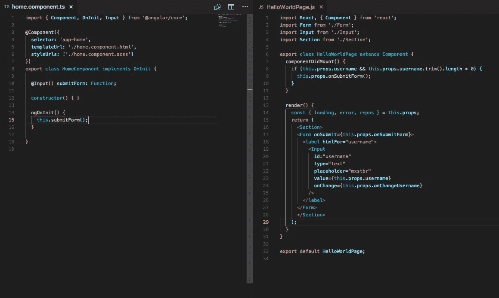
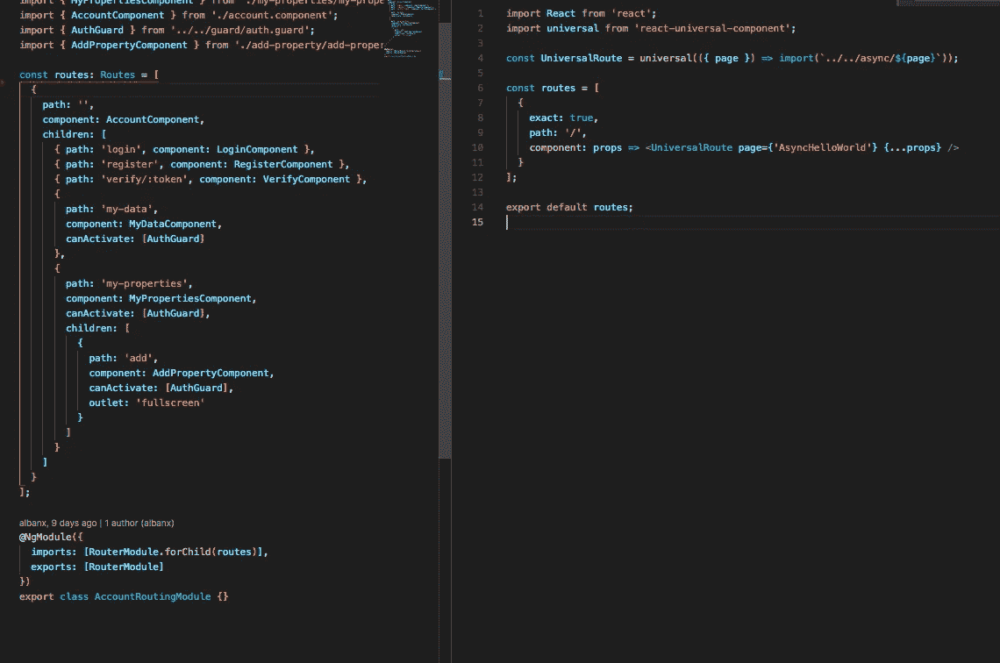
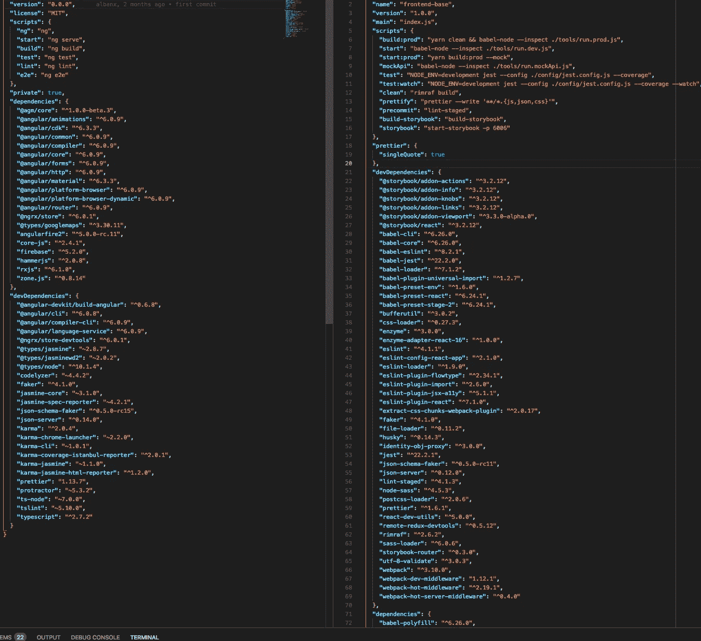

# 深视角 6 vs React & Co

> 原文：<https://itnext.io/a-deep-signt-angular-6-vs-reactjs-co-8c856807d8bf?source=collection_archive---------0----------------------->

选择正确的 JavaScript 框架来开发 Web 应用程序是前端开发人员的无限故事。网上很多文章声称 ReactJs 比 Angular 好，但事实是，写这些文章的人只是热情的开发人员，他们挥舞着宣传标语，玩着两个框架的 hello world 应用程序，开始比较他们对代码的第一印象，看着更简单的 ReactJs 的样板混乱世界。他们试图比较他们知道的和他们不知道的，就像试图比较物质和暗物质…

考虑到 Angular 是一个相对较新的框架，引入了许多新的术语和概念，这可能是很容易理解的。此外，典型的中型前端开发人员没有使用面向对象设计模式进行后端开发的经验。

我在 react 中看到过类似“*我可以使用我在普通 javascript 中学到的东西”或“ReactJS 更好，因为组件可以与 Redux 通信”等短语。*

每次我说新的 Angular 对 ReactJs 开发人员来说有多酷，我总是得到相同的反应:

如果我建议他们试一试:

ReactJs 和 Angular (6+)都是很棒的*框架(libs 称之为 as you wish)* ，我和他们在不同的项目上合作过，没有特别的问题。我的体验 Angular 6 感觉更好，给了应用程序更多的结构。

我将尝试解释从我使用这些框架的经验中得出的全球客观和主观比较的差异。最后的选择在我看来是个人喜好。

# Angular 6 VS ReactJs 公司

## 成分

**Angular** :用 *@Component* 元数据修饰的 TypeScript 类，用来标识组件。有生命周期、构造函数，可以有专用的样式文件、模板文件、动画，可以是原子的或容器的。模板语法是 HTML + Angular 指令语法。可以进行单向/双向数据绑定。

*   逻辑、标记、样式之间的良好分离
*   接近 web 组件，使用影子 DOM
*   支持超棒的异步管道(看看这个)

**react js**:JSX 文件，Javascript 的语法扩展，里面既有标记又有逻辑，有生命周期方法，还有数据绑定的道具。

*   可以在标记中使用 JS
*   多合一，样式，逻辑，html
*   在大规模复杂和模糊的结构中，没有分离关注点、属性类型、连接器，在 JS 中导入 CSS，

左边是角度分量，右边是反应分量

## **模块**

**Angular** :引入 NgModules，耦合器，有组件，有自己的走线，独立于主模块，可以重复使用和共享。有助于组织应用程序的架构。类似于构建器设计模式的概念，您希望隔离和隐藏复杂的实现来构建整个应用程序。

**ReactJs** :没有模块的概念(不要和 Js 模块混淆)，最接近的是容器组件。

## HTTP 客户端

**角度** : HttpClient 角度模块。支持自定义头，请求类型，自动解析 JSON，可以流式传输，管道传输，去抖，重试，响应可以类型化，返回一个可观察的，可以拦截(请求和响应)，链接，转换，有缓存策略和事件。功能强大，适合任何类型的需求。

**ReactJS** :很多社区图书馆。这是我认为 React 开始缺乏的地方。有很多像 Fetch，Redux-Saga，Redux-Thunk，Axios，Request 这样的库。选择的悖论，不容易从一个改变到另一个(除非我们有一个好的抽象和接口架构)。许多样板文件仅仅是为了发出一个 Http 请求，而且有些库与另一个库配合得更好。

## 路线和导航

**角度**:角度路由器模块。易于配置，支持通配符、嵌套、路由守卫、http 请求解析器、延迟加载，可以从代码中调用运行时，也可以用作链接，最重要的是支持多个出口(在那里呈现路由器提供的内容)。可以加载单个组件和模块。路由有一个状态，可以存储和观察，参数可以以不同的格式传递和读取，并支持事件(导航/开始/结束/取消/错误)。

React js:React js 最常用的库是 React-Router。配置非常有角度的路由器。可以从 link 调用 runtime，渲染发生在放置< Route >元素的地方。延迟加载并不容易，需要动态导入和 webpack 插件集成。路线守卫和事件丢失。还要提到 Redux-First-Route，它同步状态…

角度和反应路由配置示例

## 状态管理

**Angular** : NGRX 基于性能可观测的状态管理库。支持状态合成，组合选择器，订阅状态变化和副作用，所有这些都在 1 中。可以直接注入(类似于 connect)到组件中，或者通过服务使用。

**ReactJs** : Redux 是最著名的状态管理库。基于动作和减少器，需要在每个需要状态的组件中用 connect 手动连接(相当于 DI)。重新选择库用于选择器

## 依赖注入

**Angular** 自带 DI 模式，功能强大，有助于编写可测试和可维护的代码，封装，隐藏对象创建和分离责任。一个字:干净。

ReactJs 没有这种模式，大多数时候也不可能使用单例。Props 用于向其他组件注入数据。这导致(在我看来)混乱，允许开发人员“自由地”在任何地方创建对象和复制代码，导致代码结构很容易腐烂，除非你真的遵守纪律。

## 动画片

**Angular** : Angular 动画模块，允许用代码指令(使用组件元标签动画属性)制作几乎所有东西的动画，非常灵活，抽象了 css 和 web 动画的所有样板文件。易于结合动画，监视器状态，事件，关键帧都抽象，使其易于使用。

*   可以存储在单独的文件中并重复使用。
*   学习曲线高
*   可能与自定义 CSS 动画集成

**react js**:react transition group，允许基本转换，基于 css。不容易用程序组合。

## 服务器端渲染

Angular 提供了平台服务器，只需对入口点根模块做最小的改动，你就可以在节点服务器上运行你的 Angular 应用。角页中提供了完整的指南。唯一的条件是不要在你的应用程序中使用直接 DOM 访问。

**ReactJs** :需要 react-universal-component 等额外的包集成，并谨慎地选择了 http 客户端库(例如同构提取)，这应该由节点支持。此外，路由配置需要使用服务器入口点中的 StaticRouter 进行更改。节点服务器的概念和 Angular 是一样的。如果不是从开发的一开始就引入的话，会显得冗长而困难。NextJS 可以用来实现 SSR，但根据我的经验，最好是使用通用路由和自定义节点服务器手动完成。尽管这需要对 webpack 编译过程有深入的了解和理解。

## 句法和语言

**Angular** :标准 HTML，(S)CSS 和 TypeScript。TypeScript 很棒，有助于编写代码，通过使用类、接口、模型，提高代码的可读性。HTLM 和 CSS 保持分离，避免与 TS 代码混合。代码(在我看来)更好，可读性更强。

CSS 和 JSX 语法 HTML(但不是真正的 HTML)和 Javascript 的混合。简单并使用 JS。组件是逻辑、视图和样式的混合。

## NPM 套餐

**Angular** :所有必需的包都附带了框架、SASS 支持、路由、Http 客户端、SSR、动画、RxJs、表单...与 ReactJs 相比, *packages.json* 的依赖列表确实很小。这是一个很大的优势，因为这些包由 Angular team 保持更新，它们是同步的，并且发布了一个更改日志，对未来的更新表示反对，它们经过了 Google 产品的测试，bug 比社区项目修复得更快，并且您不必担心库的不兼容性。

**ReactJs** : ReactJs 只附带了视图部分，其余的，像路由、http 客户端都是由用户来选择社区项目。大多数时候，你有选择适当库的矛盾，更新彼此不同步，解决 bug 修复非常慢，测试只是社区驱动的，而不是在真正的企业产品上。

Packages.json 在左边 Angular，在右边 ReactJs

## 工具和助手

**Angular** :使用 Angular CLI，您可以在几秒钟内启动一个新项目，它为您设置了一切，包装并隐藏了所有的 Webpack 配置，并为我们可能需要的所有必要的自定义配置公开了一个 *anguar.json* 文件。棱角分明的材料也有助于用小工具和可定制的元素建立一个良好的用户界面。

reactJs :基于社区工具，像 create-react-app(现在在脸书下)，React 的材料设计是可用的，webpack 配置完全是手动的(在我上一个 React 项目中，我有 4 个 web pack 配置)，对于非专业用户来说可能很难。虽然允许你改进和欺骗建筑系统的每一个步骤。

## 代码结构和标准

**Angular** :这里是 Angular 胜出的地方。有指导原则，但并不严格。关注点、组件、服务、模块、路由、组件隔离风格、全局风格有很好的分离。Typescript 允许您定义适当的类、接口、模型、类型变量和 http 请求/响应。您可以在前端编写前所未有的可靠代码。你要学一次 Angular，你可以在任何团队，任何公司工作，没有困难。[https://angular.io/guide/styleguide](https://angular.io/guide/styleguide)

**ReactJS** :完全不固执己见，同时又完全灵活。它没有真正的标准或指导方针，有时会在开发者的偏好之间产生摩擦，比如选择什么。没有经验的开发人员倾向于滥用它，将更多的模板放在同一个组件中，或者在原子级别拆分组件。你可以找到模板、服务、样式、库、组件之间没有明显区别的项目(例如[https://github . com/react-boilerplate/react-boilerplate/tree/master/app/containers/home page](https://github.com/react-boilerplate/react-boilerplate/tree/master/app/containers/HomePage))。强大的微调和灵活的结构。

## 表演

**Angular** : Angular 6 通过新的模板引擎和变化检测在渲染方面有很好的表现。编译过程使用 AOT 为浏览器优化代码。hello world 应用程序的最终包大小约为 280kb。随着新编译引擎 Ivy 的引入，最终的包将会进一步减少。欲了解更多信息，请参见谷歌 IO 2018 Angular[https://www.youtube.com/watch?v=jnp_ny4SOQE](https://www.youtube.com/watch?v=jnp_ny4SOQE)

**ReactJS** :正在用 VDOM 进行爆破渲染。总的来说，性能非常好，比 Angular 要好，hello world 应用程序的最终大小约为 300kb。

## 在生产中使用

**Angular**:*Google*在他几乎所有的产品中使用它(比如 Firebase)*微软*，*英特尔，迪士尼工作室，AWS。*

**ReactJS** : *脸书，网飞，Airbnb，AWS。*

# 结论:我该如何选择？

我会在小项目中选择它，在那里规模可以很小，团队非常“受过良好的教育”和训练，能够设计一个干净的可维护的架构。学习曲线很低，但是开发时间可能会更长，因为所有的组件和库都需要手工开发。

对于更大的项目，当规模很重要，团队规模很大，项目由多个团队共享，并且项目的复杂性可能很高时，我会选择它。最初的学习曲线很高，但是开发要快得多，因为您所需要的一切都在框架中，大部分工作都是由它自动完成的。

就我个人而言，我更喜欢它提供的生态系统，标准、软件包、打字稿、反应式编程、工具和谷歌的支持...

正如我所说的，最终的决定更多的是个人/团队的偏好，取决于我们每个人喜欢的编程风格，最重要的是，我强烈建议保持开放的心态并尝试一下

***反应巨魔的注意事项***

我目前在日常工作中使用 React+Redux，我从 2015 年开始使用它，所以我可以向你保证这是一个非常客观中立的比较。另一方面，我一直只在我的个人项目中使用 Angular(在一家初创公司中)。

如果你不能给出一个更好的评论，而不是*“好吧，在看到你如何比较组件代码之后，我就不读了。”或者“你到底认为你是谁？这些都是如此大胆的主张*“没有给文章一个客观有用的见解，框架之间有真正的差异，**请停止评论。**

我的本意并不是为了 flame wars React 用户 VS Angular 用户而邀请，也不是因为无知而指责一个框架而不是另一个框架(就像本文[https://hacker noon . com/why-Angular-made-me-quit-we b-dev-f 63 b 83 a 157 af](https://hackernoon.com/why-angular-made-me-quit-web-dev-f63b83a157af))，这只是我个人开发经验的再现。我不是一个讨厌反动的人。