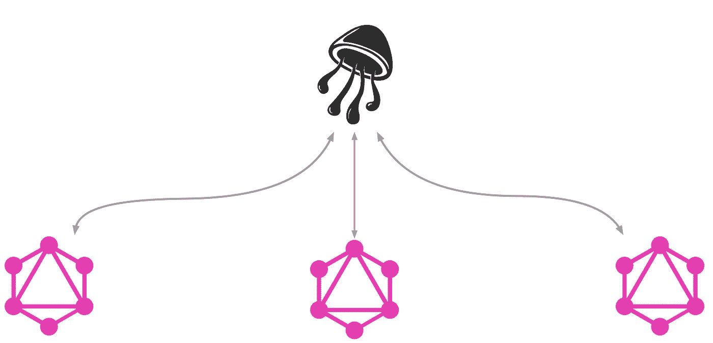
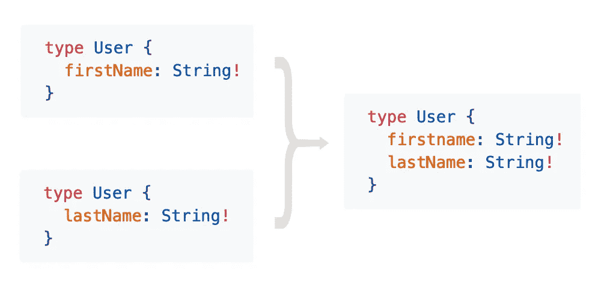
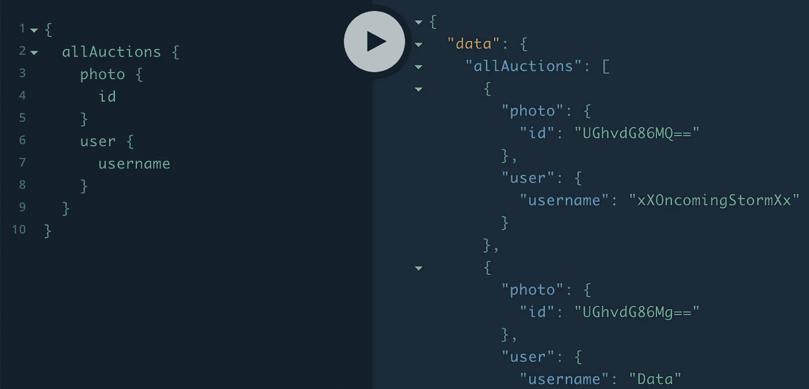

# GraphQL 模式联邦指南，第 1 部分

> 原文：<https://itnext.io/a-guide-to-graphql-schema-federation-part-1-995b639ac035?source=collection_archive---------2----------------------->

## 入门指南



这是模式联合系列指南的第一部分。在这一部分中，我们将介绍模式联合，浏览我们将在以后的文章中使用的一些不同的服务，并查看一些说明系统如何工作的细节。

***注意:*** *本系列中的示例使用了一个* [*包*](https://github.com/nautilus/gateway) *，我目前正在维护这个包，但是它的解释应该能够适用于任何联邦 GraphQL 网关。*

# 什么是模式联合？

模式联合是一种将许多 GraphQL APIs 服务整合为一个服务的方法。这对于拥有多个团队的公司很有帮助，这些团队为单个 API 的不同部分做出贡献，或者通过单独的服务来加强领域边界。

模式联合的定义特征(与其他技术如[模式委托](https://blog.hasura.io/the-ultimate-guide-to-schema-stitching-in-graphql-f30178ac0072/)相比)是我们被允许在有意义的地方跨服务边界传播特定类型的定义。允许以这种方式定义类型不仅给了我们更多的灵活性，还为网关提供了足够的信息来处理跨多个服务的查询，而不必强迫我们手工编写一堆逻辑。我们稍后将对此进行更详细的讨论。

# 我们正在建造的东西

在这个系列中，我们将建立一个平台，允许用户拍卖他们宠物的照片。大致的想法是，我们希望允许`User`为特定的`Photo`创建`Auction`。现在，任何一个`User`都可以在特定的`Auction`上创建一个`Bid`。每个`Photo`属于特定的`Pet`，该`Pet`由特定的`User`拥有。

出于说明的目的，我们将假设我们有一个很好的理由将这个应用程序分布到不同的服务中，并从那里开始。每个服务将维护自己的 GraphQL API，并作为单个领域的事实来源。在这个例子中，我们将应用程序分成两个服务。其中一人将负责宠物数据，另一人将专注于拍卖基础设施。

由于这些服务都是独立的 API，我们还没有一个可以访问所有可用数据的入口点。在我们的分布式设置中实现这一点意味着两个服务需要以一种允许查询从每个服务中检索信息的方式进行合并。这种合并发生在被称为“网关”的第三种服务中。

值得强调的是，每个服务都定义了一个`User`类型。注意，`User`的这两个定义有不同的字段，属于不同的域。正如我前面提到的，这种类型共享是模式联邦工作的基础。那些在服务之间划分的类型被称为“边界类型”，而其他只属于一个服务的类型被称为“域类型”。在我们的例子中，`User`和`Photo`是边界类型，其余的是域类型。

# 让我们运行我们的服务

对于本系列，我们将使用`graphql-tools`模块在 node 中编写我们的服务，因为这是 GraphQL 社区中很大一部分使用的模块。首先，克隆这个 git 存储库，并花点时间检查它的内容。

```
git clone https://github.com/alecaivazis/schema-federation-demo
```

你不应该发现什么太令人惊讶的事情。其中真正重要的是两个脚本: [photoService.js](https://github.com/AlecAivazis/schema-federation-demo/blob/master/photoService.js) 和 [auctionService.js](https://github.com/AlecAivazis/schema-federation-demo/blob/master/auctionService.js) 。运行这些将启动我们将在整个系列中与之交互的服务。如果你仔细观察，你会发现每一个服务都定义了相应的 API，除此之外还有一个小的附加:有一个额外的接口叫做`Node`。

## 节点接口

模式联盟对服务的唯一要求是它必须满足[中继全局对象标识规范](https://facebook.github.io/relay/graphql/objectidentification.htm)。这听起来比实际情况更吓人。基本上每个服务都必须有一个类似这样的`Node`接口:

这个`id`字段必须是全局惟一的，并且可以作为标识符从服务 API 的根字段中检索特定的记录:

出于稍后将变得清楚的原因，每个边界类型必须实现`Node`以使模式联邦工作。

# 我们的第一个问题

在我们继续之前，按照演示的自述文件中的描述启动这两个服务。

我们现在需要的是一个联合网关。对于这个系列，我们将使用 [nautilus/gateway](https://github.com/nautilus/gateway) ，它是一个独立的服务，旨在扮演这个角色。最快的方法是从[发布页面](https://github.com/nautilus/gateway/releases)下载最新的二进制文件，并在您的终端上运行它:

```
./gateway start --services http://localhost:3000,http://localhost:3001
```

您现在应该会看到一条带有网关地址的消息。如果你在你最喜欢的浏览器中导航，你会看到一个界面，在那里你可以使用 API。

让我们从简单的事情开始。将此查询复制到操场，然后单击发送:

如果一切正常，你应该会看到我们的样本数据中的每个拍卖列表和每张照片的 url。如果你看一下我们的 api 是如何分解的，你会注意到`Query.allAuctions`和`Photo.url`是在两个不同的服务中定义的。为了解决这个查询，网关必须首先在拍卖服务中查找每个拍卖，然后在照片服务中查找每张照片的 url。

# 这是如何工作的？

这一节(直到“可能出错的地方”)将更多地介绍网关的内部。使用网关并不需要理解它，但是我觉得理解它是很重要的。如果您对此不感兴趣，请随意跳过。

我们不需要做太多就可以让网关将我们的服务缝合在一起。我们只是将一些类型的定义分散到我们的两个服务中，网关就从那里接管了。让我们探索一下这是如何发生的。

## 合并 API

当网关启动时，它做的第一件事是形成一个单一的模式，表示我们平台的整合 API。它从自省每个服务开始，以理解该服务的 api 中定义了什么。然后，它遍历每个服务的每个定义，并将任何对象类型合并在一起。在此过程中，它会跟踪哪些服务定义了哪些字段。



截至 2019 年 1 月 29 日，nautilus gateway 仅允许跨服务传播对象类型的定义。它允许枚举、标量、接口和指令出现在多个服务中，只要它们的定义是一致的。网关不允许在多个地方定义输入类型或联合。如果你能想到一个合理的方法，请在 GitHub 上开一张票。

## 解析查询

我们现在已经准备好解决问题了！

查询解析过程大致分为两个不同的部分:计划和执行。现在，让我们假设这两个步骤在每个请求中都发生。我们将在后面的文章中看到，我们可以将这两个步骤分开，以提高性能。

对于此讨论，考虑前面查询的稍微复杂一点的版本:

请记住，`Query.allAuctions`、`User.username`和`Auction.photo`都是在拍卖服务中定义的，而`Photo.url`是在照片服务中定义的。

## 规划

当一个模式分布在不同的服务中时，像这样的简单查询可能需要访问多个 API，并请求不同的信息。大多数情况下，这些请求必须按照特定的顺序解决，以查找特定的信息。

例如，这个特定的请求必须分为两个阶段。第一个必须通过向拍卖服务发送以下查询来查找每个拍卖的信息:

如果您仔细观察这个查询，您会注意到我们请求了照片的`id`字段，尽管用户并没有明确要求它。通过添加这个字段，来自服务的响应将包含我们在稍后的执行阶段需要的所有信息。我们必须记住，我们添加了它，并在以后从我们发送给用户的有效载荷中删除它。

我们现在必须为我们的计划增加第二步。下一步必须获取我们从每次拍卖中获得的照片的`id`，并在照片服务中查找该特定记录的信息。这就是我们要求所有边界类型实现`Node`接口的原因。网关必须能够请求一个`id`来跨越服务边界。

为了获得剩余的照片信息，网关必须对我们遇到的每张照片执行额外的查询:

规划过程的最终结果是步骤的集合，这些步骤形成了网络请求的依赖关系图，必须启动这些网络请求来查找客户端请求的信息。

## 执行

一旦生成了计划，留给网关做的唯一事情就是沿着网络请求图走下去并构造响应。为了理解这是如何工作的，如果您在第一步发送查询，请考虑拍卖服务的响应:



如您所见，我们的样本数据中有许多不同的拍卖。为了给用户拼凑出最终的响应，我们必须获取我们在计划阶段添加的`id`,并查找每个拍卖的其余信息。这需要发送我们在计划的第二步中显示的查询的副本，其中设置了`id`变量以匹配我们从服务返回的响应。

一旦我们获得了每个拍卖的必要信息，我们就完成了对查询的评估，并可以将响应发送给用户。

# 什么会出错？

虽然这种方法有很多好处，但像任何技术一样，我们需要注意一些事情。

与任何 GraphQL 网关一样，一个实现不佳的网关所产生的网络请求数量可能会在很小的范围内导致严重的性能瓶颈。一个嵌套很深的查询跨越边界几次会从您的网关产生大量的请求。幸运的是，这个问题已经在 GraphQL 社区中得到了很多关注，并且已经知道了依赖于您正在使用的特定工具的解决方法。

模式联邦在传统的 GraphQL 执行模型之上还有一个额外的步骤。对于大型查询，查询计划的生成可能会很昂贵，不应该像我们之前描述的那样对每个请求都执行。虽然这也有一个已知的解决方法，但它超出了本文的范围，将在后面的指南中介绍。

当合并模式时，还会出现一整类问题，这在集中式的情况下是不存在的。虽然细节可能有所不同，但总体情况是相同的:可能会形成查询或从 API 获得不一致的响应。例如，两个服务可以有相同名称的标量(例如`DateTime`),但是有不同的序列化格式。或者，客户端可以在不理解指令的服务的字段上使用指令。这些问题并不是模式联合所独有的，而是将 api 划分到多个服务中的副产品。

幸运的是，其中大多数都有减轻其影响的变通办法。在决定使用哪一个时，您应该考虑网关如何处理这些问题的细节。

# 结论

在这篇文章中，我们介绍了我们将在这个系列中构建的项目。然后我们一起编写了第一个由联邦模式支持的查询！之后，我们绕了一点弯路，探索了网关如何完成它的工作，并介绍了在评估不同的联合网关时需要注意的一些问题。

虽然这个例子很小，但很明显，这个模型可以扩展到更大的情况。通过跨服务划分我们的类型，schema federation 确保随着后端的发展，网关能够适应域边界的变化，而无需我们的任何干预。

暂时就这样了。感谢阅读！如果你有任何想法，请在评论中告诉我，或者在 twitter 上联系我。

如果你有兴趣继续和我一起探索这个兔子洞，你可以继续阅读系列的下一篇文章[，在那里我们为我们的平台添加了一个简单的授权系统。如果这是我们分手的地方，我希望你今天休息得愉快。](https://medium.com/@aaivazis/a-guide-to-graphql-schema-federation-part-2-872a820510ff)