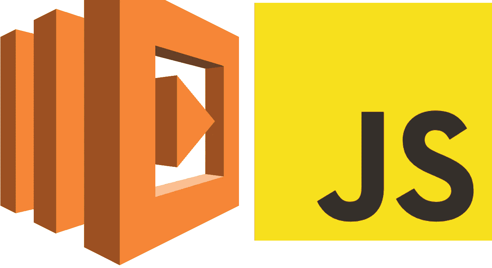

# 一个 JavaScript 用户的第一个 AWS Lambda 函数

> 原文：<https://itnext.io/a-javascript-users-first-aws-lambda-function-ed74c0441d6?source=collection_archive---------6----------------------->



我在工作中大约 80%的编码时间都在使用 JavaScript，主要用于前端。我喜欢这份工作和最近的 JS 生态系统。它不仅增强了前端开发人员的能力，也增强了后端开发人员的能力。此外，最近，无服务器技术是我的许多热门话题之一。因为我听到了很多关于 AWS 的好消息，我开始阅读由[彼得·斯巴斯基](https://twitter.com/sbarski)写的“[AWS 上的无服务器架构](https://www.amazon.ca/Serverless-Architectures-AWS-examples-Lambda/dp/1617293822)”。它解释了如何使用 AWS 和 Firebase 从头开始部署无服务器应用程序。我刚刚完成了“只是阅读”，现在，按照说明，已经进入 AWS 控制台创建示例应用程序。我承认在阅读这本书之前，我在 AWS 控制台上并不舒服，但现在我已经习惯了，❤

到目前为止我真的很喜欢这本书。你也可以在这个[网站](https://www.manning.com/books/serverless-architectures-on-aws?a_aid=serverless-architectures-on-aws&a_bid=145280de)上阅读这本书。在第三章，他们解释了如何创建一个 lambda 函数。你可以在这里看到代码。因为这本书的主要焦点是关于无服务器架构的，所以没有提到其他任何东西。在这篇文章中，我想从 JS 用户的角度添加一些特性来改进这些步骤。

这篇文章的目标读者是那些开始学习现代 JS 开发工具的人，比如 node、npm 和 git。我认为我的 JS 工作经验有限，所以非常感谢专家的反馈。

前提条件是您必须设置一个正确的 IAM 用户和 AWS CLI。如果你还没有，我推荐你阅读[附录 B](https://livebook.manning.com/#!/book/serverless-architectures-on-aws/appendix-b) 。

# 目录

1.  做一些工作(复制代码，运行简单的测试)
2.  负责任——编写单元测试(Jest)
3.  整理—格式代码(ESLint，更漂亮)
4.  提交—让我们自动运行测试(husky，lint-staged)
5.  部署—我们不应上传开发依赖项(npm 修剪)

# 1.做一些工作(复制代码，运行简单的测试)

*注意:如果你已经用 node.js 构建了 lambda 函数，你可以跳过这一步*

我要你从他的资料库下载一些文件。我希望你的工作目录里有`package.json`、`index.js`、`tests/`和`tests/event.json`。让我们先用这个命令安装依赖项:

```
$ npm install
```

我假设您也可以运行测试命令:

```
$ npm run test
```

然后你可以看到来自`console.log()`的“欢迎”作为结果。你看到了吗？厉害！对于这篇博文，我们实际上不打算使用`index.js`。让我们复制该文件并将其命名为`handler.js`。然后打开文件，像下面这样修改，这样我们就可以测试了！

handler.js

# 2.负责任——编写单元测试(Jest)

编写测试的目的是保证模块总是按预期工作。如果你没有进行任何测试，然后有人改变了这个模块，没有人知道这个模块是否像改变之前那样工作。让我们使用进行单元测试。使用以下命令安装 jest:

```
$ npm install -D jest
```

让我们制作一个名为`__tests__`的目录。Jest 会自动检查目录中是否有测试文件。

我们将测试文件命名为`handler.spec.js`，并保存在`__tests__`下。

我写的测试代码看起来像这样:

__tests__/handler.spec.js

这个简单的测试代码根据输入文件(`../tests/event.json`)检查每个键是否正确生成。我们还想在`package.json`的`scripts`中添加`"jest": "jest"`来运行测试命令。

package.json

当您准备好了，让我们用这个命令运行单元测试:

```
$ npm run jest
```

您应该会看到以下消息:

> *生成正确的密钥(4 毫秒)*

恭喜你。您的第一个测试检查所有的键。这样，即使其他人改变了`handler.js`，键值也不会改变，因为测试会检测到其他情况。

# 3.整理—格式代码(ESLint，更漂亮)

ESLint 是一个林挺工具，可以发现一些有问题的模式。它在 JS 社区得到了广泛的应用。[更漂亮](https://prettier.io/)是一个代码格式化程序，让你的代码看起来“更漂亮”。它们都是很好的工具。让我们试试吧！使用以下命令安装它们:

```
$ npm install -D eslint prettier eslint-config-prettier eslint-plugin-prettier
```

首先，我们需要初始化 ESLint:

```
$ npx eslint --init
```

它会问多个问题。让我留下我对以下问题的回答:

> *？您希望如何使用 ESLint？检查语法和发现问题
> ？你的项目使用什么类型的模块？JavaScript 模块(导入/导出)
> ？你的项目使用哪个框架？这些
> 都没有？你的代码在哪里运行？节点
> ？您希望您的配置文件采用什么格式？找不到 JavaScript
> 本地 ESLint 安装。
> 您选择的配置需要以下依赖关系:
> ？您想现在用 npm 安装它们吗？是*

然后，用 ESLint 整合更漂亮。在[beauty 的网站](https://prettier.io/docs/en/integrating-with-linters.html#eslint)上，他们告诉你如何整合。检查 ESLint 部分并尝试设置。

现在，让我们为林挺运行下面这个命令`handler.js`

```
$ npx eslint handler.js
```

它会提到这样的事情:

> *5:59 错误将* `*'·'*` *替换为* `*"·"*` *更漂亮/更漂亮*

不是很方便吗？这个过程建议在哪里修复代码，并规定您的代码应该是什么样子。你也可以通过改变`.eslintrc.json`来自行改变规则。请查看他们的文件以获取更多信息。此外，如果您运行以下命令，它可能会自动修复问题。

```
$ npx eslint --fix handler.js 
```

# 4.提交—让我们自动运行测试(husky，lint-staged)

在前面的步骤中，您学习了如何测试，以及如何整理代码。然而，您可能会忘记运行测试，或者在 git-commit 更改之前运行 ESLint 命令。在这一步，我希望在 git-commit 时自动运行脚本。

git-commit 时有很多方法可以运行命令。使用`.git/hooks/pre-commit.sample`是一种方法。这次我想用[哈士奇](https://github.com/typicode/husky)和[皮棉阶段](https://github.com/okonet/lint-staged)。使用这些工具的好处是你只需要写少量的代码。husky 会为您生成实际的脚本。只有一点需要注意——如果你想在正在进行的项目中使用 husky，你应该小心，因为它会与现有的 git 挂钩冲突。

安装这些工具时，请安装:

```
$ npm install -D lint-staged husky
```

然后在`package.json`中添加这个片段:

package.json

`lint-staged`的配置适用于任何 JavaScript 文件，除了在`__tests__`目录中的文件。当该工具找到一个 JavaScript 文件时，它会检查格式并整理它，就像我们在步骤 3 中所做的那样。然后如果有什么变化，用`git add`加上。最后，运行由`jest`支持的测试，就像我们在步骤 2 中所做的一样。

对于`husky`的配置，我将`lint-staged`设置为在运行 git-commit 时执行。当运行 git-push 时，husky 执行`jest`来检查所有单元测试。

尝试运行 git-commit 并确保您的测试和 linter 都能运行。

# 5.部署—我们不应上传开发依赖项(npm 修剪)

在你的`package.json`里，应该有`scripts`里的`deploy`和`predeploy`。如果没有，[查看一下图书作者的知识库](https://github.com/sbarski/serverless-architectures-aws/blob/master/chapter-3/Listing%203.1%20-%203.4%20-%20Transcode%20Video%20Lambda/package.json#L8)。

package.json

这些脚本将在您运行部署命令时执行。

首先，让我们简单地运行部署命令:

```
$ npm run deploy
```

您应该能够看到在命令完成后创建了一个 zip 文件“Lambda-Deployment.zip”。

现在，请查看日志中的`CodeSize`。这是`aws lambda update-function-code`命令的输出。

标准输出

在我的例子中，代码大小是 26.3 MB (26，312，199 字节)。这太大了！这是因为我们正在上传工作目录中的所有内容。它可能会降低 AWS Lambda 的速度，同时还会花很多时间将 zip 文件上传到 AWS。这很糟糕。

在 AWS Lambda 中我们不需要的是 devDependencies。在前面的步骤中，我们安装了多个模块来编写测试和格式化代码，但是它们不会在 AWS Lambda 中使用。让我们删除 devDependencies。

我们如何从你的工作目录中删除依赖关系正在运行`npm prune --production`。它将删除您的 dev dependencies[[docs](https://docs.npmjs.com/cli/prune.html)]中指定的包。当我们在部署之前运行它时，我们必须能够减小大小。

此外，我们应该取回那些在部署后被删除的包。`npm i --offline`看起来有用。它从缓存安装软件包，因此它不需要任何网络访问。你可以在这里阅读更多关于命令[的信息。](https://github.com/npm/npm/issues/2568#issuecomment-331753223)

让我们在您的`package.json`中使用这些 npm 命令:

package.json

在压缩文件之前，我们将删除“预部署”中 devDependencies 中的所有包，然后在“后部署”中取回这些包。

现在，再次尝试展开！

```
$ npm run deploy
```

然后看看日志中的`CodeSize`。我的如下:

标准输出

在我的例子中，CodeSize 变成了 5.6 MB (5，665，493 字节)，这是我们之前上传的 20%。**牛逼**！

通过这篇文章，我们学习了如何对你的代码负责，以及如何使你的代码可维护/可读，而不会对我们的代码大小产生巨大的影响。我希望你喜欢这本书的帖子。再说一遍，这本书真的很好，我强烈推荐。

感谢您的阅读！编码快乐！

# 参考

*   [与 ESLint 和 Husky 的代码一致性](https://www.orangejellyfish.com/blog/code-consistency-with-eslint-and-husky/)
*   [在每次 Git 提交之前运行 Jest 测试](https://benmccormick.org/2017/02/26/running-jest-tests-before-each-git-commit/)
*   [npm 清理，npm i —离线](https://github.com/apex/up/issues/603#issuecomment-476190913)