# Riverpod 简约指南

> 原文：<https://itnext.io/a-minimalist-guide-to-riverpod-4eb24b3386a1?source=collection_archive---------0----------------------->

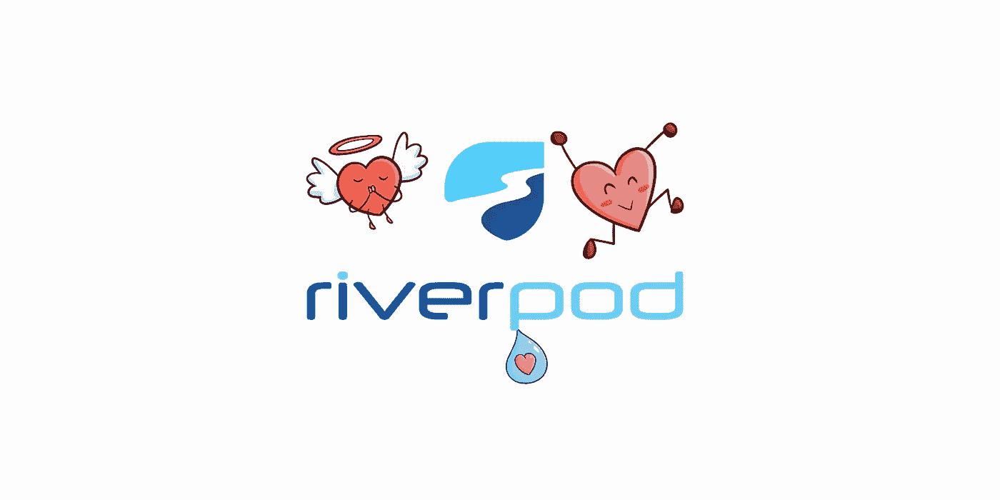

## 颤振中最好的状态管理和依赖注入解决方案之一

这次我试图简化整个 Riverpod 包。希望你喜欢它！

首先

# Riverpod 是什么？

> 一个反应式状态管理和依赖注入框架——Remi rousse let

简而言之，`[Riverpod](https://pub.dev/packages/riverpod)`是`[Provider](https://pub.dev/packages/provider)`的加强版

# 为什么`Provider`很烂？又为什么需要`Riverpod`？

`Provider`依赖于 Flutter/BuildContext，没有内置的 DI/服务定位器解决方案等。

## 还有，Riverpod 给了我们

*   在编译时而不是运行时捕获编程错误
*   移除监听/组合对象的嵌套
*   提高应用程序的可测试性。
*   自动处置支持
*   比较以前和新的状态
*   实现撤销-重做机制
*   调试应用程序状态
*   启用性能优化。
*   轻松集成高级功能，如日志记录或拉式刷新。

如果我们准备好了，那就开始吧！

## Riverpod 的类型

*   `[riverpod](https://pub.dev/packages/riverpod)`->-`riverpod`用于所有 dart 项目
*   `[flutter_riverpod](https://pub.dev/packages/flutter_riverpod)`->-`riverpod`为指定用于颤振
*   `[hooks_riverpod](https://pub.dev/packages/hooks_riverpod)`->-`flutter_riverpod`结合`[flutter_hooks](https://pub.dev/packages/flutter_hooks)`

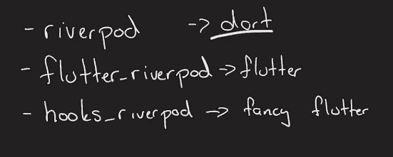

-塔达斯·佩特拉

> 注:如果你对`*flutter_hooks*`感兴趣，你可以先看看我写的一篇文章！

 [## 用抖动钩子去掉所有类型的样板代码

### 难道你不认为，是时候杀死 StatefulWidget 并使用 flutter 钩子去掉样板代码了吗

iisprey.medium.com](https://iisprey.medium.com/get-rid-of-all-kind-of-boilerplate-code-with-flutter-hooks-2e17eea06ca0) 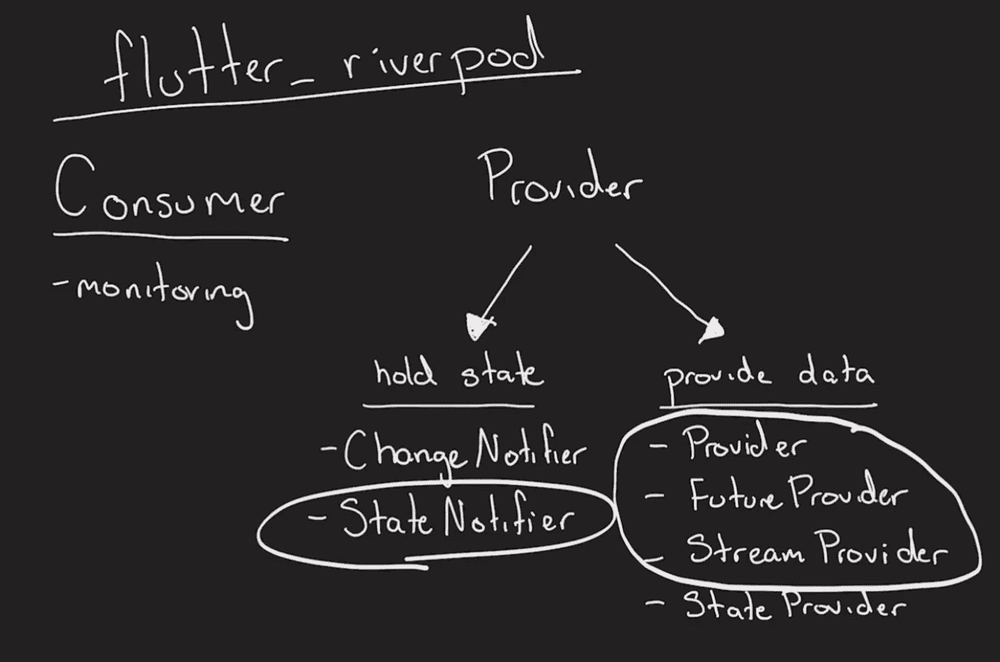

-塔达斯·佩特拉

# 提供者

提供者给我们一个依赖注入的解决方案。先说说他们的类型。

## 供应者

这是最基本的版本。

当我们在任何地方获取不可变数据时，我们使用它。

它适用于类似的服务等。

## 未来供应商

它只是结合了未来建造者和提供者。为用户处理错误或加载状态，并在获取数据时重建用户界面

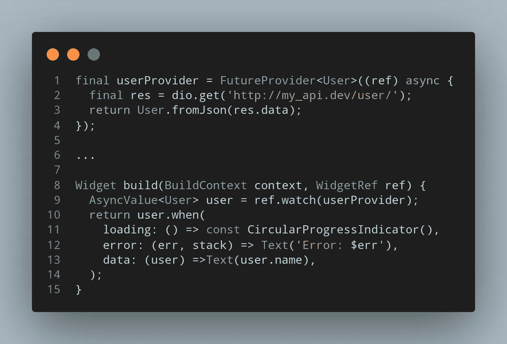

## 流提供者

就像 FutureProvider 一样，但是用于流

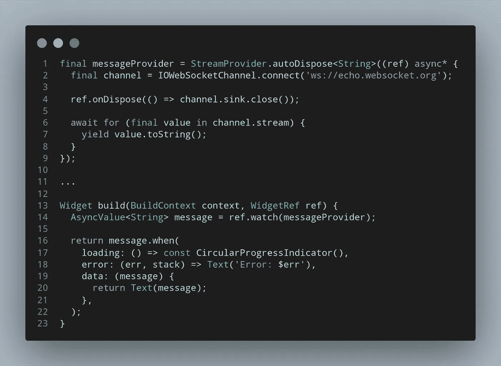

## 州提供者

当我们需要一个基本的全局状态解决方案时。

## 变更通知程序

我们将其用作复杂的状态管理解决方案。

每当调用`notifyListeners()`时，监听更改和重建。

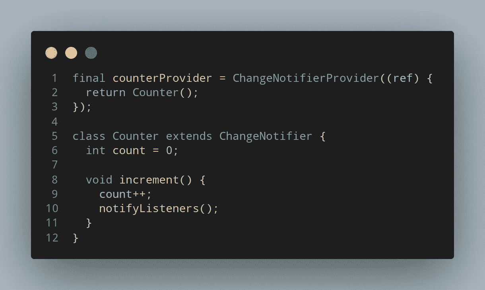

## StateNotifier

这就像是`ChangeNotifier`的不变和被动版本

你不需要打电话给`notifyListeners();`

这个可能看起来更像样板文件，但是它更安全，也更容易编写测试

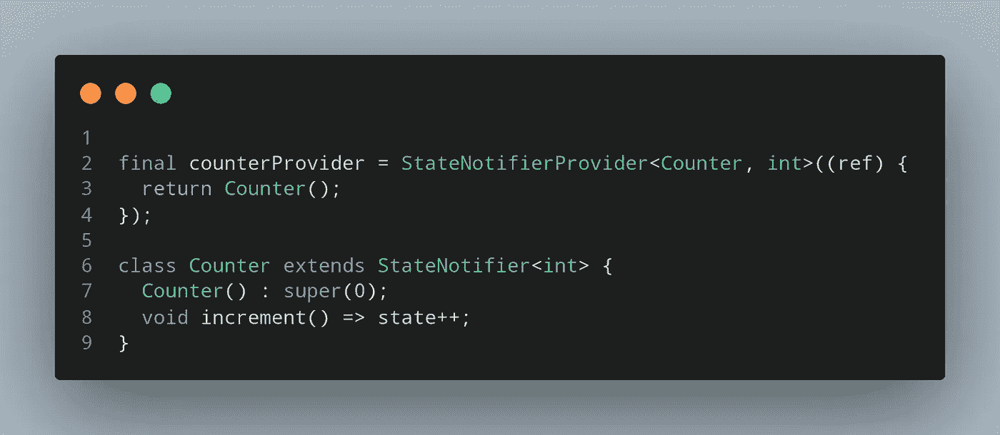

# 提供商修饰符

我们还可以给提供者一些超能力！！

*   `[.autoDispose](https://riverpod.dev/docs/concepts/modifiers/auto_dispose)`，这将使提供者在它不再被监听时自动销毁它的状态。

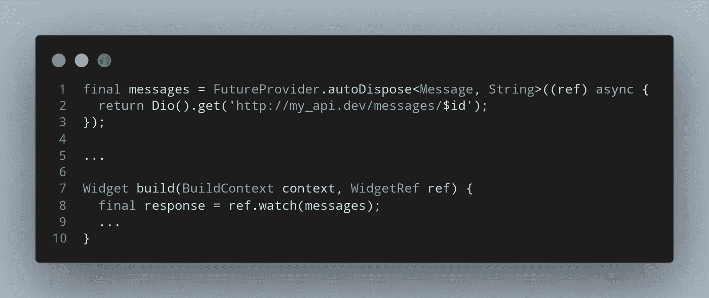

*   `[.family](https://riverpod.dev/docs/concepts/modifiers/family)`，允许从外部参数创建提供者。

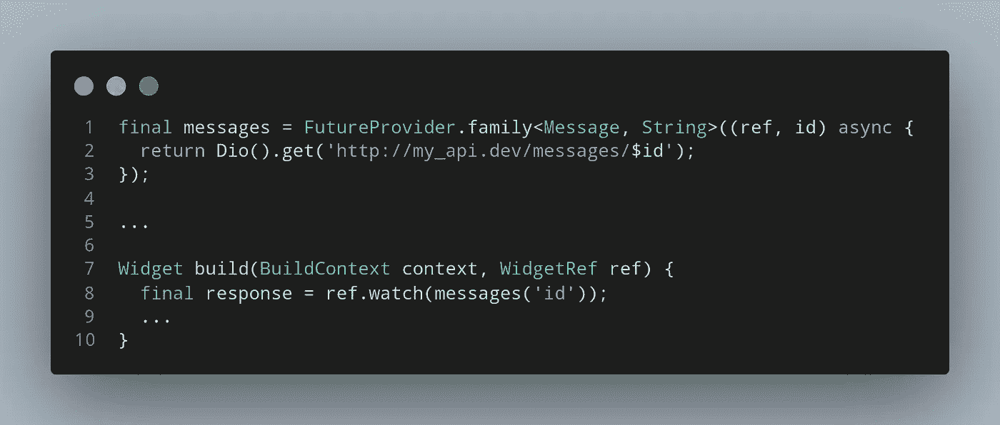

此外，您可以同时使用它们。

# 消费者

我们使用消费者来监控变化。只是为了读取数据

创建消费者有 5 种方式

## 1.消费者获取

无状态小部件+消费者

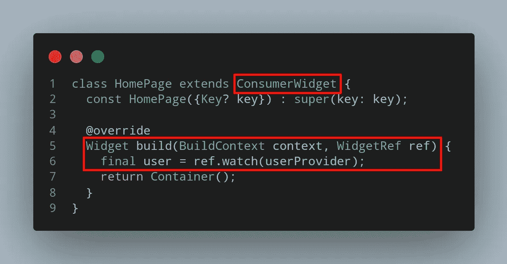

## 2.HookConsumerWidget

StatelessWidget +消费者+扑钩

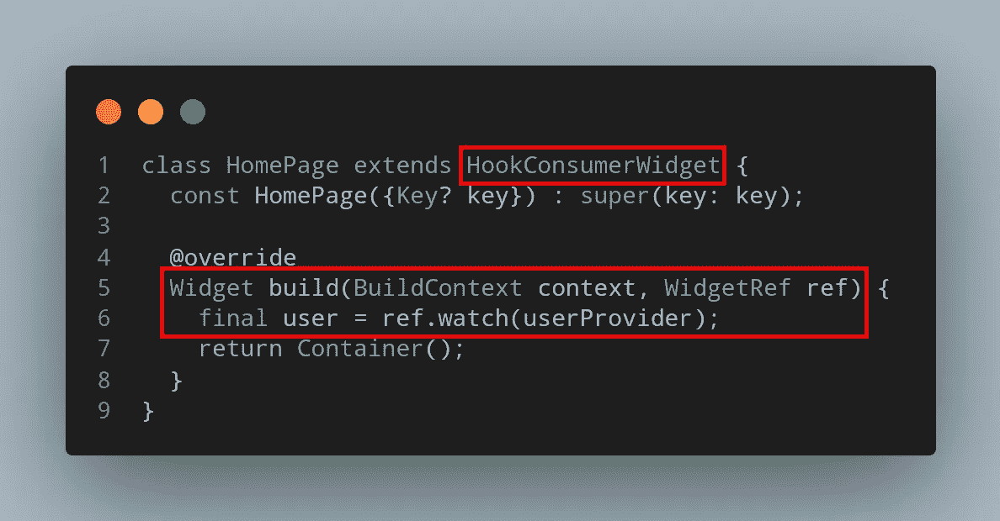

## 3.消费者作为一个部件

无状态小部件和小部件

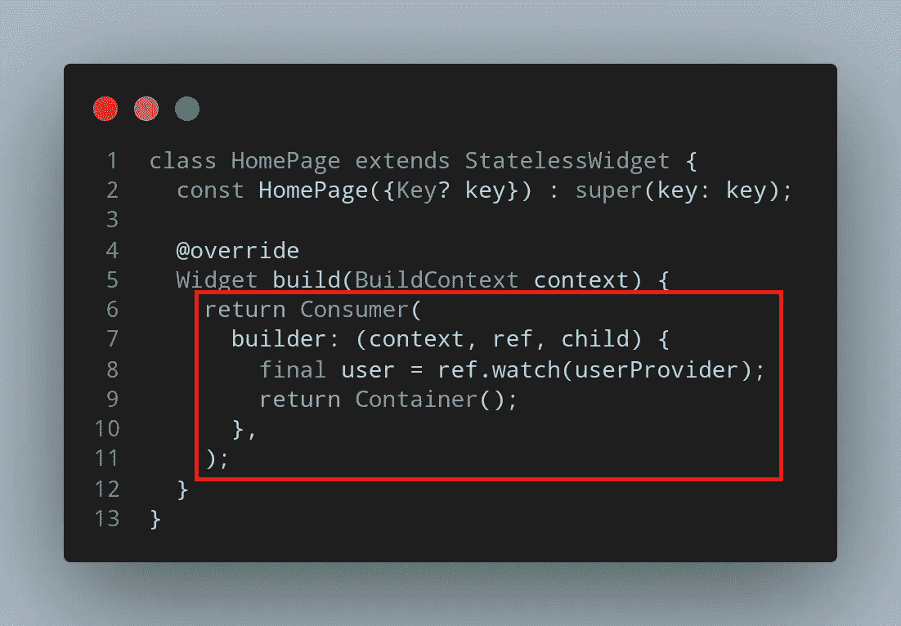

## 4.消费者状态小部件

StatefulWidget +消费者

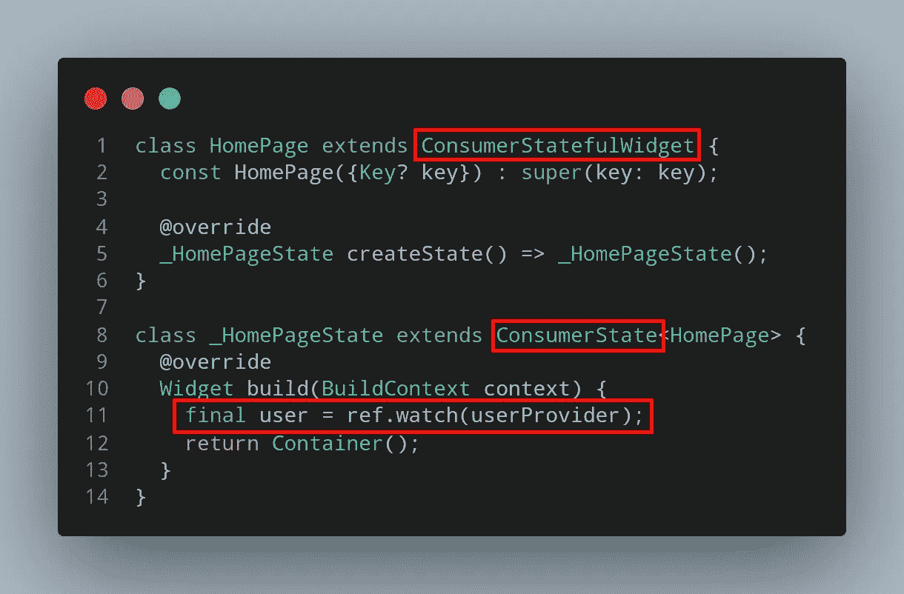

## 5.StatefulHookConsumerWidget

StatefulWidget +消费者+扑钩

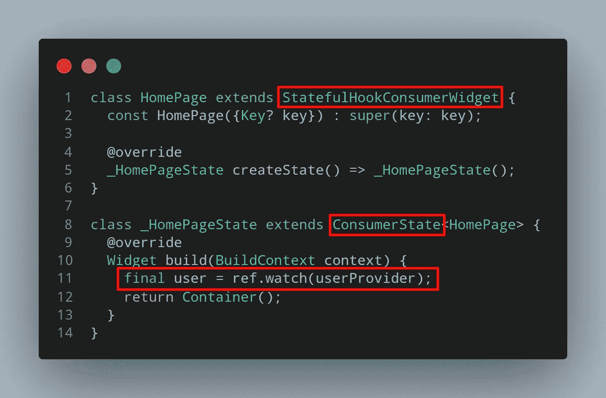

# 裁判能做什么？

你得到了模式，但是等待`ref`是什么，它能做什么？

## [看](https://pub.dev/documentation/riverpod/latest/riverpod/Ref/watch.html) —它是你最好的朋友，永远信任它。

倾听变化并做出反应

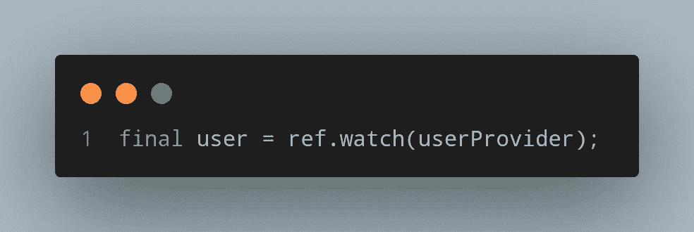

## 听着，我是你的僚机

监听一个提供者，并在它的值改变时调用`listener`。

这对于显示模态或其他命令式逻辑很有用。

> **作者注**
> 
> `*watch*`和`*listen*`方法不应该被异步调用，比如在`*onPressed*`或[提升按钮](https://api.flutter.dev/flutter/material/ElevatedButton-class.html)内部。也不应该在`*initState*`和其他[状态](https://api.flutter.dev/flutter/widgets/State-class.html)生命周期内使用。
> 
> 在这些情况下，考虑使用`*ref.read*`来代替。

## [读](https://pub.dev/documentation/flutter_riverpod/latest/flutter_riverpod/WidgetRef/read.html) —知道但不要用那个

只读取提供者一次，不听更改。

> **作者推荐**
> 
> 这些本身没有被窃听，但是它们是反模式的。它们会在将来导致错误。那是因为作者建议他们

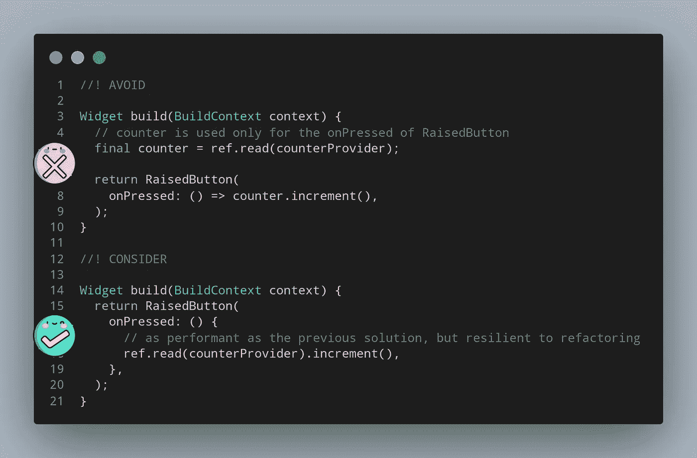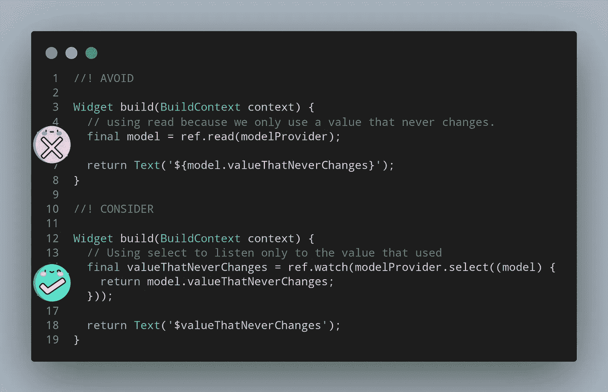

## 最后一件事

我教过你`read`的方法但是…

> 应尽可能避免使用`ref.read`。
> 
> 它的存在是为了解决使用`watch`或`listen`太不方便的情况。
> 如果可以的话，用`watch` / `listen`几乎总是更好，尤其是`watch`。

## 但是为什么呢？

以下链接完美地解释了这种情况。如果你不相信我，就看看解释

 [## 阅读提供者| Riverpod

### 在阅读本指南之前，请务必先阅读关于提供商的内容。在本指南中，我们将了解如何消费…

riverpod.dev](https://riverpod.dev/docs/concepts/reading#dont-use-refread-inside-the-build-method) 

如果你已经被说服了，我们可以继续

## [刷新](https://pub.dev/documentation/flutter_riverpod/latest/flutter_riverpod/WidgetRef/refresh.html)

强制提供程序重新评估其状态，并返回创建的值。

此方法对于“拉至刷新”或“出错时重试”等功能非常有用，可用于重新启动特定的提供程序。

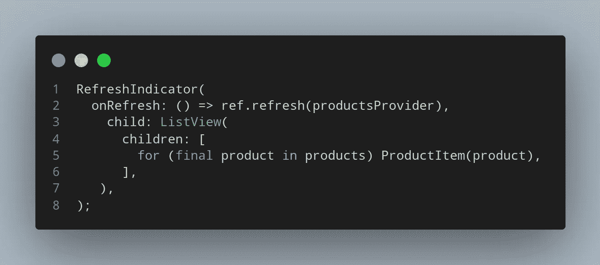

## [onDispose](https://pub.dev/documentation/riverpod/latest/riverpod/Ref/onDispose.html)

正好在提供程序被销毁之前运行。

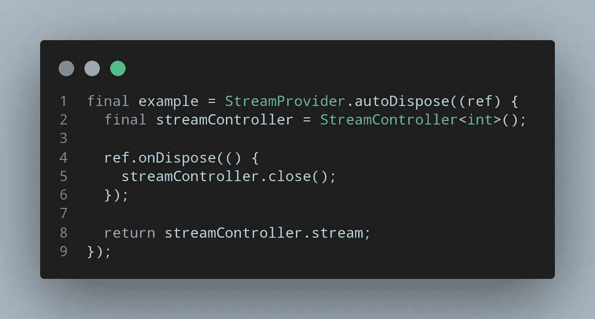

# 过滤提供商

使用`select`方法可以只听对象的特定部分，而不是听整个对象。例如，除非用户名更改。文本小部件不会重建。所以作者强烈推荐使用`watch`而不是 read I

# ProviderObserver

你也可以毫不费力地观察整个过程

*   `[didAddProvider](https://pub.dev/documentation/riverpod/latest/riverpod/ProviderObserver/didAddProvider.html)`每次初始化提供者时调用，公开的值是 value。
*   每次释放提供者时都会调用`[didDisposeProvider](https://pub.dev/documentation/riverpod/latest/riverpod/ProviderObserver/didDisposeProvider.html)`
*   每次我的提供者发出通知时都会被调用。
*   每当 provider 发出一个错误时，`[providerDidFail](https://pub.dev/documentation/riverpod/latest/riverpod/ProviderObserver/providerDidFail.html)`就会被调用，无论是在初始化期间抛出还是让一个[未来](https://api.dart.dev/stable/2.15.1/dart-async/Future-class.html) / [流](https://api.dart.dev/stable/2.15.1/dart-async/Stream-class.html)发出一个错误

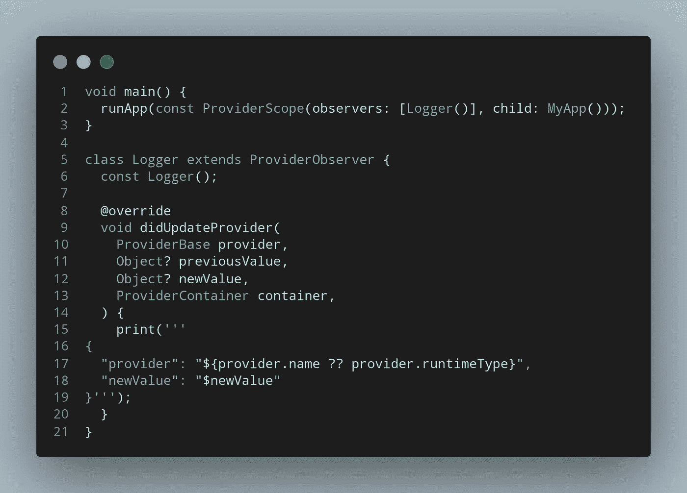

如您所见，我们为消费者和提供商提供了许多解决方案。可以随心所欲的组合！

作为一个有经验的开发人员，我建议作为最终的解决方案

## Riverpod + StateNotifier + [钩子](https://iisprey.medium.com/get-rid-of-all-kind-of-boilerplate-code-with-flutter-hooks-2e17eea06ca0) + [冻结](https://iisprey.medium.com/how-to-handle-complex-json-in-flutter-4982015b4fdf)

你想进一步了解这个组合吗？

就等下周吧！我将用一个真实世界的例子来深刻地谈论它

## 更新——这是我承诺的下一篇文章

 [## 用 Riverpod 进行颤振状态管理

### 一个有点复杂的真实世界 riverpod 例子

itnext.io](/flutter-state-management-with-riverpod-ef8d4ef77392)  [## Riverpod 在颤动时的撤销/重做机制

### 实现撤销-重做机制是多么容易的故事

itnext.io](/undo-redo-mechanism-with-riverpod-in-flutter-6fc15ef87b1a) 

# 参考资料和建议的资源

 [## Riverpod

### 共享状态的无样板文件的安全方式

riverpod.dev](https://riverpod.dev) 

## 感谢您的阅读！

那是一篇很长的文章，而你大老远跑来这里！你太棒了！请不要忘记鼓掌(也可能你不知道鼓掌可以达到 50 次，只是在你走的时候点击)