# Azure DevOps 服务入门

> 原文：<https://itnext.io/a-night-with-azure-devops-services-11861e147962?source=collection_archive---------4----------------------->

Azure DevOps

这个故事将展示通过使用最佳实践将 API 部署到云中的简单性，例如使用 ARM (Azure 资源管理器)将 ***基础设施作为代码*** ， ***监控*** (使用 App Insights)等。我们正在经历整个构建和发布生命周期。

# 什么是 Azure DevOps 服务？

Azure DevOps Services(以前的 VSTS)是 Azure 提供的一套内置服务，它们是:

*   Azure Pipelines :在几分钟内用任何语言部署任何东西。
*   **Azure Repos** :私有仓库。
*   **Azure 工件**:Azure 中的一个存储库，用于上传我们的工件。
*   Azure Boards :它提供了类似看板/Scrum 的敏捷计划板。
*   **Azure 测试计划**:手动&用于测试的探索性工具。

本教程将重点关注自动化，因此将部署 Azure 管道。

你有一个 API，你想现在就在 Azure 中快速部署它吗？

当然，Azure Pipelines 提供了内置特性，允许工程师:

*   从代码库中取出代码
*   通过资源组中的 ARM 调配所需的基础架构
*   具有构建/发布任务的预构建管道已准备就绪
*   通过应用洞察增加监控

您是高级用户吗？您想打造自己的渠道吗？

自己动手制作。

# 天蓝色管道

来自 [Github](https://github.com) 的 Azure 管道

Azure Pipelines 允许在任何地方部署应用服务、Kubernetes、无服务器功能以及任何其他云提供商，如 GCP 或 AWS。

生命周期从构建阶段开始。在执行期间，代码通常会经历:

*   **建造**
*   **运行测试**
*   **上传测试结果**
*   **发布已建构件**

一旦构建完成，我们需要部署一些东西，一个工具。Azure Pipelines 提供了发布工具，当一个新的工件发布时，这个工具就会被触发。释放工具甚至可以通过使用钩子从 Jenkins 或任何其他工具触发。

发布阶段通常会经历:

*   **检查代码**
*   **通过 ARM 部署基础设施**
*   **下载神器**
*   **展开**

# 先决条件

*   Azure 现收现付帐户已启用
*   包含预期要部署的代码的存储库
*   向代码中添加单元测试(可选)
*   如果您希望提供额外的基础结构，请添加自定义资源组项目(可选)

现收现付套餐

# 动手实验

让我们创建一个 Azure DevOps 项目。去现场搜索找到 ***DevOps 项目*** 项目:

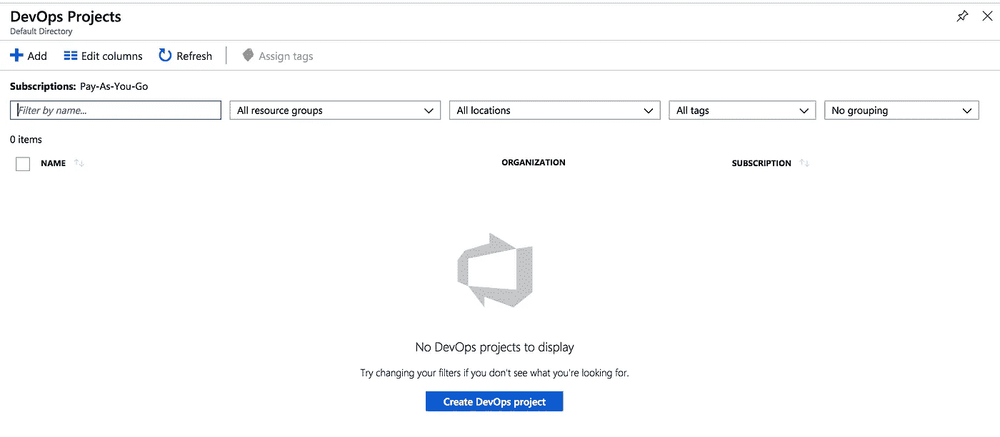

DevOps 项目

点击创建 ***DevOps 项目>。*网**

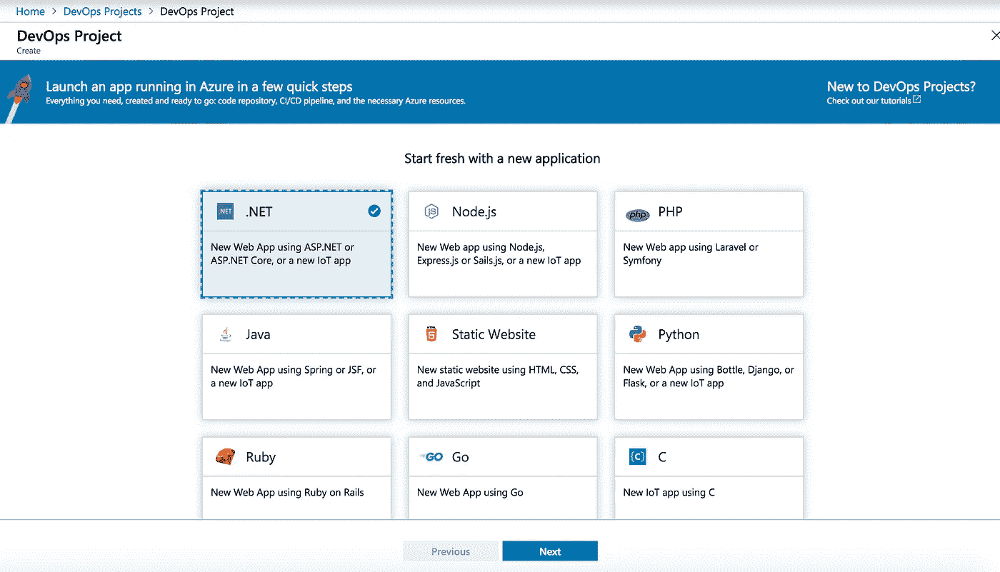

DevOps 项目步骤 1

选择**ASP.NET 内核 因为我创建的应用程序正在运行**ASP.NET 内核**:**

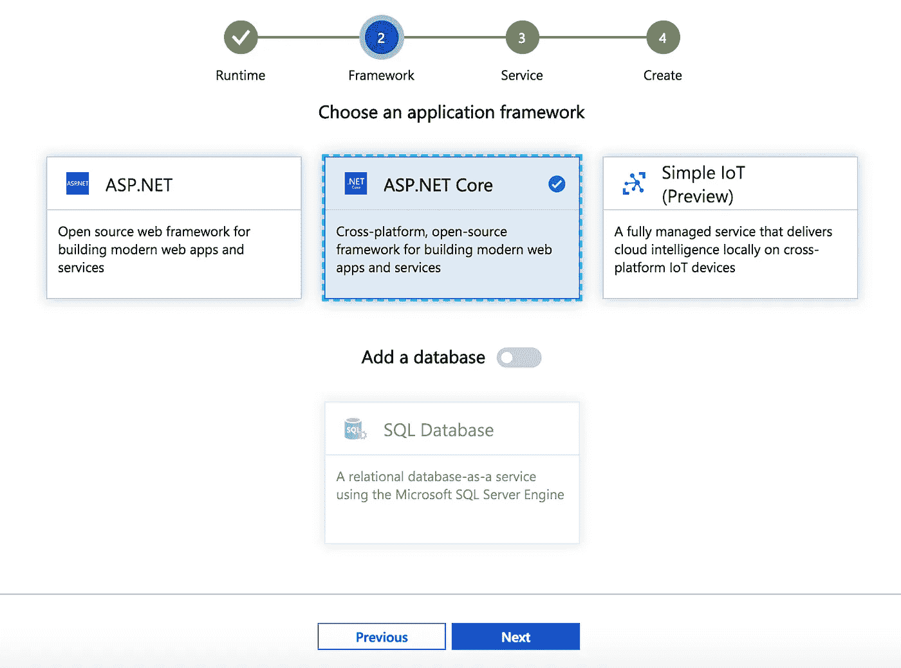

DevOps 项目第 2 步

让我们选择部署基础设施。它可以是:

*   适用于集装箱化应用的 Kubernetes
*   服务结构群集，将其作为微软容器的技术进行部署
*   ***Windows Web App(我们的场景)***
*   Linux Web App(这是 2018 年新增的)
*   用于容器的 Web 应用程序(docker 图片，这是 2018 年新增的)
*   虚拟机

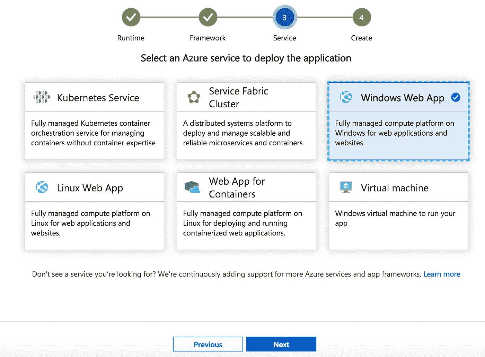

DevOps 项目步骤 3

让我们将项目创建到现有的 ***组织*** 中。如果没有 ***Azure DevOps 组织*** 创建，那就去创建一个新的。

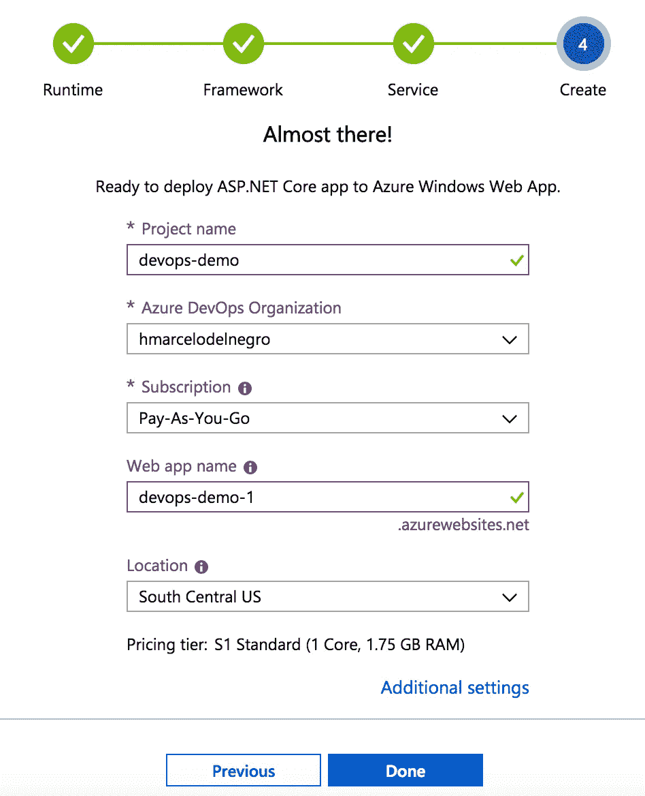

DevOps 项目步骤 4

让我们单击 ***完成*** 开始配置过程。

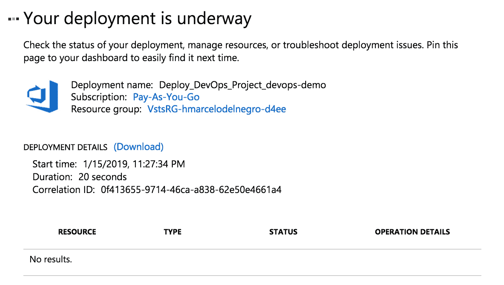

DevOps 项目正在进行

几分钟后，我们会发现两个不同的资源组。

DevOps 项目产出

让我们进入***VstsRG-hmarcelodelnegro-d4ee****，在这里我可以找到我的 ***项目 URL****

**

*DevOps 项目组织产出*

*所以让我们打开我的 ***DevOps 项目。*** 我们会发现 CI/CD 管道已经在运行，从您的存储库中提供 Azure 中所需的基础设施。在顶部菜单上，我们可以找到:*

*   ***项目主页**:打开 VSTS 项目仪表盘页面。*
*   ***仓库** : Git/TFVSTS 仓库。*
*   ***构建管道**:从 Azure 管道构建工具。*
*   ***释放管线**:从天蓝色管线中释放工具。*
*   ***敏捷积压** : Azure 积压工具。*

*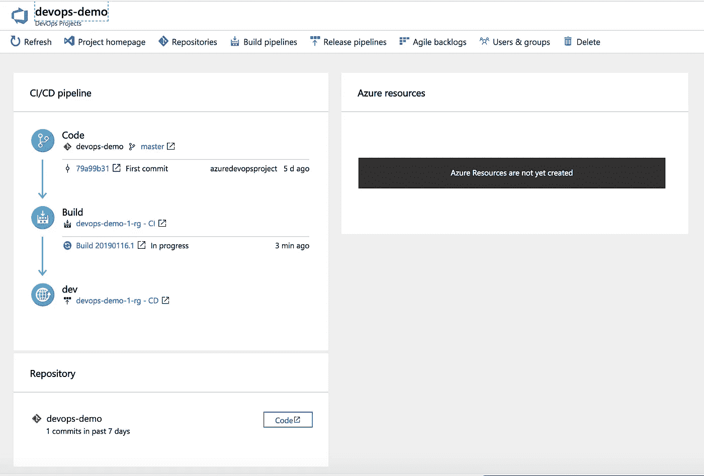*

*配置前的 Azure 管道*

*下面我们可以看到来自 Azure pipelines 的构建/发布工具正在工作:*

****先造****

**

*首次构建执行*

*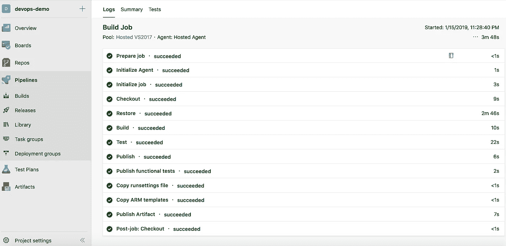*

*首次构建执行结果*

****先发布****

*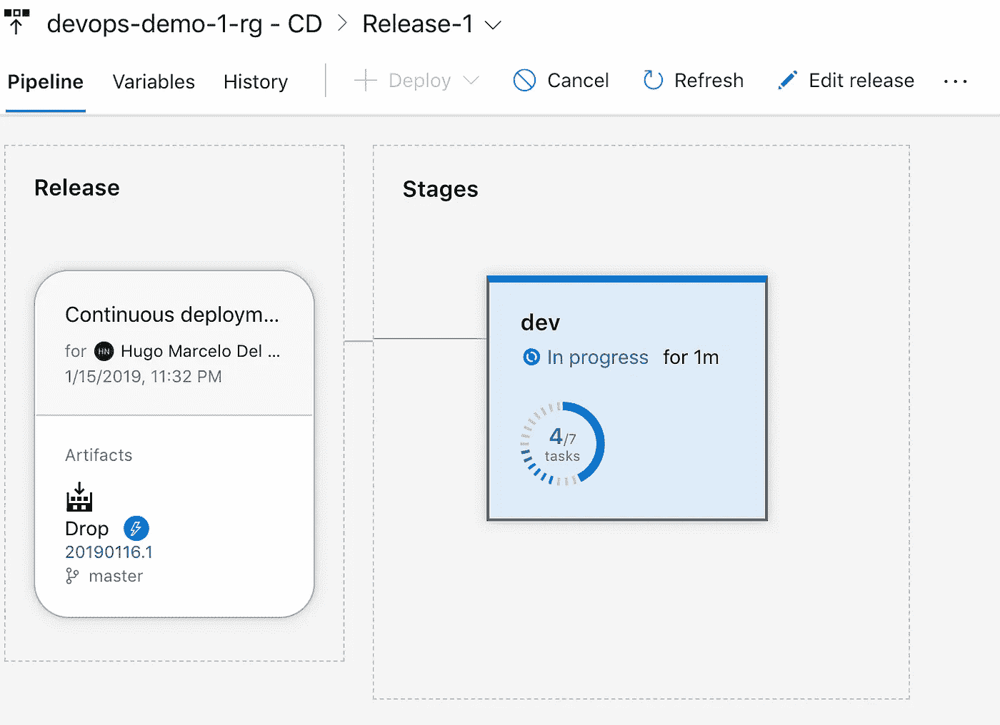*

*首次发布执行*

*几分钟后，我们将发现 Azure 资源组中提供的所有内容:*

*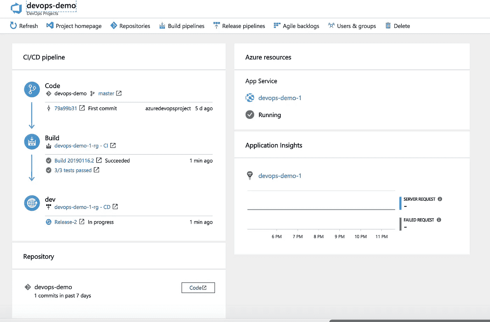*

*配置过程后的 Azure 管道*

**

*资源组输出基础设施*

# *构建/发布任务*

*那么，Azure 是如何提供和部署我的服务和基础设施的呢？Azure DevOps 将创建一组内置的智能步骤。*

## *基础设施作为代码*

*Azure 提供了自己的供应工具，名为 ARM (Azure Resource Manager ),这是一组 Azure 理解的 JSON 文件。默认情况下，Azure DevOps 执行基本配置，但我们可以添加我们的自定义 ARM 模板，以便通过代码构建所需的基础架构。*

*画廊:[https://azure.microsoft.com/en-us/resources/templates/](https://azure.microsoft.com/en-us/resources/templates/)*

*如果图库中的内容不符合我们的需求，我们可以自己编写代码。我强烈建议使用 Visual Studio 来实现这一点，因为它已经为此提供了智能感知。*

*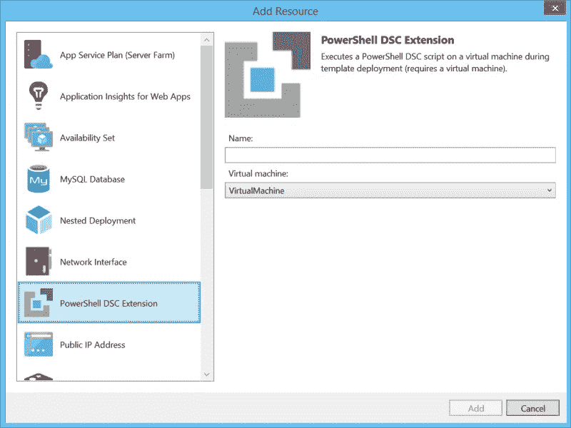*

*Visual Studio ARM 模板工具*

*关于 ARM 的学习资源:我强烈推荐来自詹姆斯·班南[的 Pluralsight 的 ARM 入门课程](https://www.pluralsight.com/courses/microsoft-azure-resource-manager-mastering)*

## ***建造任务***

*Azure pipelines 将创建一个具有通用生命周期的构建序列。如果需要的话，我们可以按预期进行编辑。我们可以找到以下步骤:*

*   ***恢复:**恢复依赖包。*
*   ***构建:**构建程序集。*
*   ***测试:**运行单元测试，并将结果上传到 VSTS。*
*   ***发布:**如果测试运行成功，它将发布应用程序输出。*
*   ***发布功能测试:**发布功能测试，如果它们存在的话。*
*   ***复制 ARM 模板:**移动我们的 ARM JSON 文件，以便在发布阶段提供基础设施。*
*   ***发布工件:**发布发布阶段所需的工件。*

*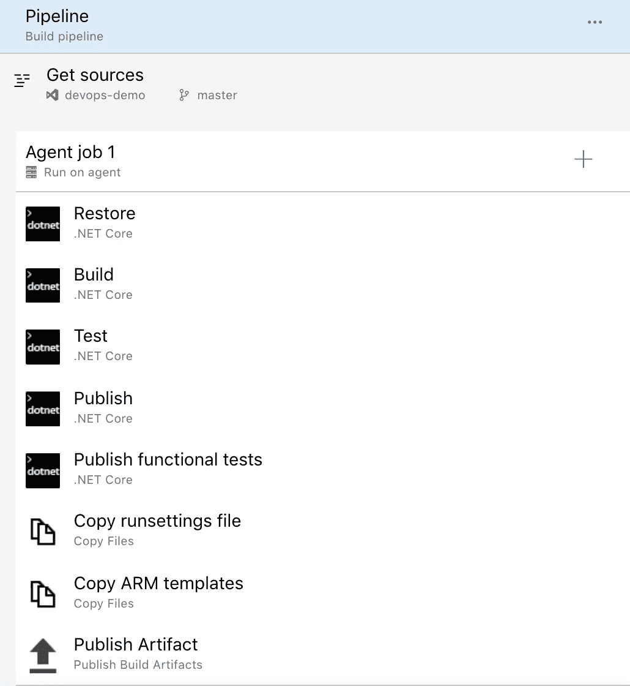*

*自动构建任务*

## ***发布任务***

*作为 Azure pipelines 的 Build，它将添加一个预定义任务的发布序列，可以根据需要进行定制，甚至可以添加更多的环境和工作流。*

*   ***Azure 部署:**运行 ARM 模板以提供所需的基础设施。*
*   ***部署 Azure App 服务:**将工件部署到 Web 应用中。*
*   ***Visual Studio 测试平台安装程序:**安装测试运行程序进行功能测试。*
*   *测试装配:运行测试。*

*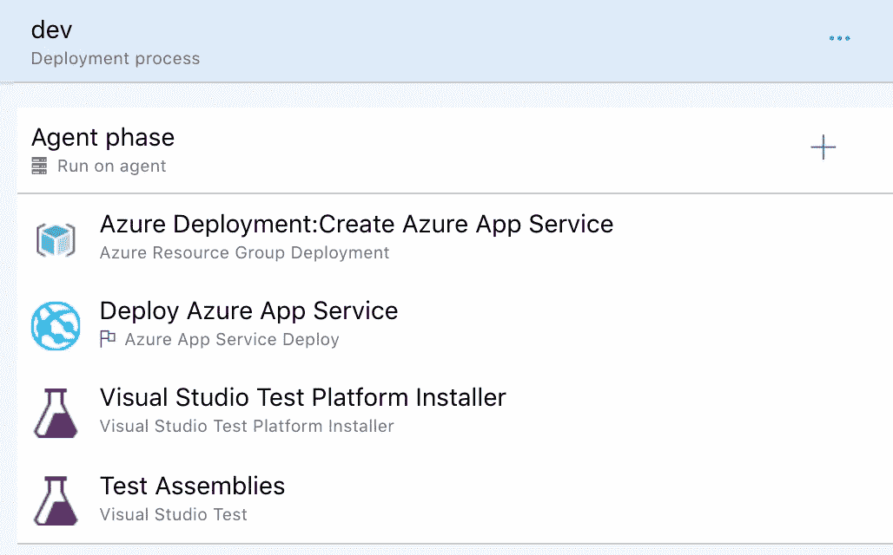*

*自动发布任务*

# *最终结果*

*在以上五分钟的过程之后，我们将有一个完整的 devops 生命周期在 Azure 中运行。我们可以看看下面的图片，我们会发现已经做了大量的工作:*

***CI/CD 管道**:我们可以看到一个从主分支部署的存储库，一个成功的构建和到开发环境的发布成功了。*

***Azure resources** :我们将从 Release-2 中找到应用程序 URL 和提供的基础设施。*

***仓库**:部署的代码仓库。*

***应用洞察**:我们已部署应用的监控工具。*

*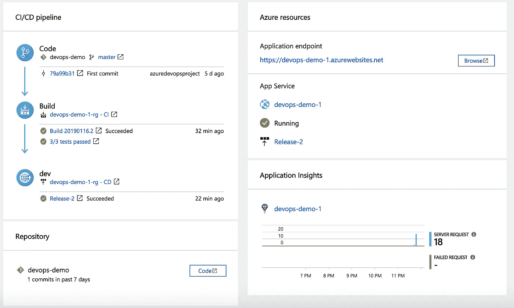*

*决赛成绩*

*让我们浏览一下:*

*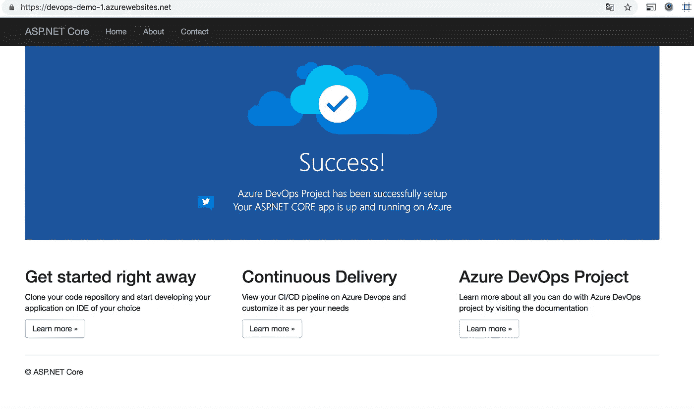*

*部署的应用程序结果*

*显然，这条管道可以完全定制来做不同的事情，所以我们有无限的权力去做我们想做的事情。*

*最终结果视频*

*这很容易，快速和无头。如果你喜欢，请为我的故事鼓掌。*