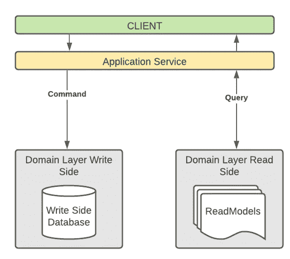
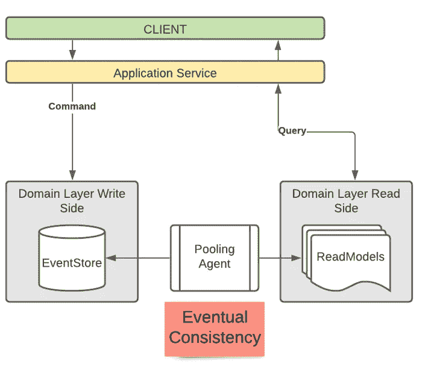
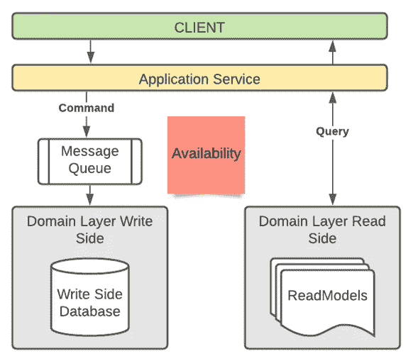

# CQRS 实用指南

> 原文：<https://itnext.io/a-practical-guide-to-cqrs-af4e2d797383?source=collection_archive---------2----------------------->

CQRS(命令查询责任分离)模式是一种简单的模式，但经常被误解。至少对我来说，这种模式在开始时相当可怕，而事实上，它相当简单和有用。

在本指南中，我将解释它是什么，它是如何工作的，并使用 CQRS/DDD 原理实现演示项目。

*为此，我将使用。NET 核心栈，MSSQL 数据库。演示代码可以在我的 github(*【https://github.com/bolicd/practicalcqrs】*)上找到，应该有适当的文档来帮助你开始。*

**什么是 CQRS？**

CQRS 是一种分离读写操作的架构模式。这使得应用程序可以更好地扩展，并在高负载下运行良好。从根本上说，它是应用于*域模型层的单一责任原则(SRP)的实现。*

这有助于解决*阻抗不匹配的问题——数据库模型和域模型的不匹配。*

没有应该使用的框架或工具，CQRS 只是说域写模型和读模型应该分开。

一个简单的图表显示了 CQRS 最重要的方面:

应用程序服务根据写入或读取端处理命令或查询。对于 write，我们使用一个不返回结果的命令。对于 read，我们使用一个没有副作用的查询并返回一个结果:

*   命令(写入端)—用于“告诉”写入端做某事。
    命令执行有副作用且不返回结果的动作。例如:将档案状态更改为活动—这是一个应该作为任务从 UI 调用的命令。因此，我们通常在前端有基于任务的 UI。
    命令可以异步(如队列)和同步处理。
*   查询(读取端)—用于从读取端获取数据。查询总是返回结果，不会改变状态或产生副作用。因此，查询类似于:获取所有活动的档案。
*   写面和读面是分开的。这可以通过单独的表格、数据库等来完成。
*   读取端可以实现非规范化物化视图或 NoSQL 表，写入端可以实现事件存储或简单表，具体取决于扩展需求。

**上限定理和 CQRS 权衡**

CAP 定理指出，对于分布式数据存储，不可能实现以下两个以上的目标:

*   **一致性** —每次读取都会收到最近的写入或错误
*   **可用性** —每个请求都会收到一个(无错误的)响应，但不能保证它包含最近的写入
*   **分区容差** —尽管网络在节点之间丢弃(或延迟)了任意数量的消息，系统仍会继续运行

根据 CQRS 系统中需要扩展的内容，可以牺牲*一致性*或*可用性*来获得更好的可伸缩性。

对于业务用户和开发人员/架构师来说，理解 CQRS 会有影响用户体验的权衡是很重要的。

**缩放 CQRS 的读取端**

扩展读取端意味着引入最终的一致性。实际上，这通常是通过创建从写入端填充的非规范化读取模型来实现的。这可以通过以下方式实现:

*   **池化代理** —是一种服务，用于池化事件存储以进行更改。如果检测到新事件，则更新所有订阅投影(读取模型)。我们认为这是一种拉动模式。
*   **队列** —我们可以使用发布/订阅模式，使用队列(类似于服务总线)，我们的投影订阅某些事件。事件一到达写入模式就被发布。在这种情况下，一切都由队列处理，我们认为这是一个推模型。

联营代理可以给予更多的控制，并保证最多一次交货。然而，它要求它是一次在一台机器上运行的单线程服务(因为它需要按顺序读取和发送事件)。这意味着它的可扩展性较差。

队列通常使用一些现成的队列来实现，但是我们对事件分发的控制较少

**缩放写入端**

如果来自客户端的请求量很大，可以使用消息队列扩展写入端—命令被发送到队列，客户端立即得到响应。在这种情况下，业务用户需要注意几件事情:

*   来自命令**的确认并不意味着命令被处理**，它意味着命令被保存到队列中:这方面的一个例子是当我们在 amazon 上购物时——命令被发布、验证，然后响应被发送回来。该商品被售出，但扣除金额的实际交易是在以后执行的。
*   在将命令放入队列之前，应该尽可能地对其进行验证，以尽量减少以后处理时出错的可能性。

这样，我们以牺牲可用性为代价提高了可伸缩性。

**何时使用 CQRS，何时避免**

一般来说，当我们有丰富/复杂的业务逻辑时，CQRS 是一个很好的模式。

它可以为读取端和写入端提供无限的可伸缩性，但也有一些代价，比如事件一致性，这需要清楚地传达给业务用户。

CQRS 可以在没有事件源、异步消息传递或最终一致性的情况下构建。

**实际 CQRS 样板工程**

我已经创建了一个小项目来演示本文中阐述的大部分基本原则:【https://github.com/bolicd/practicalcqrs】的[是建立在我已经存在的事件商店项目(在这里找到:【https://github.com/bolicd/eventstore】的](https://github.com/bolicd/practicalcqrs))的基础上的，但也添加了更多的 DDD 原则:

*   读写面的 CQRS 分色示例。
*   写端使用简单的事件存储
*   读取端使用投影代理，这些代理根据需要汇集事件存储和填充读取模型。这带来了最终的一致性。

这个项目的目的是*不清楚的架构*，所以它不应该被认为是这样的。这个项目中的大部分内容都是手工实现的，所以源代码很容易理解(例如，相对于使用预先存在的库)。

池代理实现为投影，其中每个投影可以对事件存储中的某些事件做出反应，并填充相应的读取模型。

我真的希望这能帮助人们更好地理解 DDD 并应用它们。