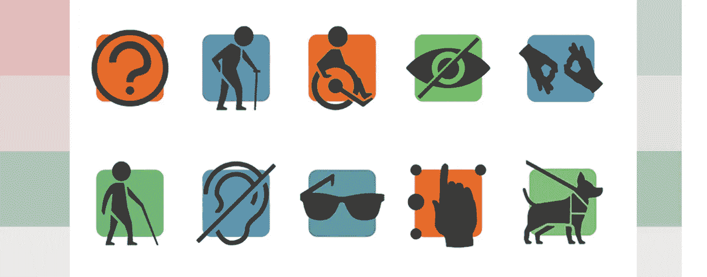

# 作为设计模式的可访问性

> 原文：<https://itnext.io/accessibility-as-a-design-pattern-d58940601cab?source=collection_archive---------2----------------------->



图片来源:[3 播放媒体](https://www.3playmedia.com/blog/whitepaper-solving-web-accessibility-leaving-no-one-behind/)

我们通常认为易访问性是需要额外开发工作的东西，把它作为一个好的特性，针对一小部分有特殊需求的用户。但是这种思路没有抓住要点，我们没有意识到可访问性标准如何改善我们构建前端界面的日常体验，从而产生更健康、更可读的代码、更干净的测试以及更好的应用程序整体架构。更不用说它平等地惠及所有用户。

在过去的几个月里，我一直试图理解，为什么前端开发人员(包括我自己)讨厌编写测试，为什么我们如此坚定地认为“前端测试很难”。我的探索集中在可访问性的主题上，特别是 [ARIA](https://developer.mozilla.org/en-US/docs/Web/Accessibility/ARIA) ，作为一种缺失的成分，它会使我们测试代码的体验更加愉快。

# 暧昧的邪恶

作为开发人员，我们花很多时间考虑命名约定——本质上，我们重视正确命名的变量和函数，因为它们减少了歧义，使我们能够向阅读或使用代码的其他人清楚地传达我们的意图。类型安全是消除歧义的另一个例子——它确保我们的代码被解释为预期的，给假设和误用留下很小的空间。

虽然我们如此关注代码本身，但我们并不经常考虑代码产生的结果。我们编写漂亮的 React 组件，遵循既定的设计模式和严格的命名约定，我们用单元测试覆盖它们，但是我们不太关心这些组件的 HTML 输出有多模糊，尤其是当它们在一个页面上组合在一起时。

部分问题是我们正在使用 CSS，它提供了一定程度的视觉歧义——间距、边框和框阴影允许我们将页面解构为逻辑单元，这些逻辑单元具有隐含的语义意义。使用视觉边界，我们知道元素的开始和结束，我们可以与我们想要交互的元素进行交互，而不会被无意义的文本块所迷惑。

然而，去掉所有的 CSS，你只剩下一堆你自己、屏幕阅读器和测试人员都无法理解的 HTML。

# 可读代码的乐趣

我们喜欢使用自然语言向我们的语音助手发出命令。代码只不过是我们给计算机的一系列命令，所以最可读的代码自然是接近人类语言的代码。

在我对前端测试的思考中，我开始在编写 Cypress 测试和使用 Alexa 导航网站之间进行比较。如果有一种 Alexa 技术可以与网页交互，它会使用一个类似于 Cypress 的引擎，并在其上安装一个测试库。

> — Alexa，找到一个登录表单
> — Alexa，在用户名栏输入 John . doe
> —Alexa，在密码栏输入 secret
> —Alexa，按提交按钮

同样的情况可以用代码来表达:

通过一些语法上的技巧，我们可以让测试读起来像自然语言。

我们可以更进一步，将每个命令映射到一个 Gherkin 关键字(这将需要一些工具来确保一旦“看到”一个地标，就在其边界内执行连续的调用)。

当然，在一个页面上，所有这些都是不可能的，这个页面有一个样式类似表单的表单，但是没有通过 HTML 代码表达相同的语义。它可以看起来像鸭子，像鸭子一样嘎嘎叫，但它可能只是一只风格独特的布谷鸟。

可访问性的基石是用户界面的跨设备互操作性，为了实现这一点，我们必须首先确保我们的界面是机器友好的，而不是仅仅基于理解的主观性，这种理解受到单个用户的物理特征的影响，并且仅仅由应用程序的视觉外观决定(至少在人工“智能”足够智能以从外观推断语义之前是如此)。

# 用 HTML 表达意思

如上所述，CSS 是一个强大的工具，可以帮助我们传达意思，但仅仅依赖 CSS 是错误的。首先，CSS 是特定于媒体的，常识告诉我们，你不应该将 CSS 发送到不能呈现它的设备上。其次，你应该保持 [*关注点分离*](/improving-design-systems-with-solid-principles-part-i-separation-of-concerns-c14088ed09c3)CSS 是为了样式化和主题化——无论你在 BEM 上多么努力，它都不是将你的 HTML 标记上下文化的正确方式(除了如果你使用 CSS 模块的话，所有的一切都不在窗口中)。属性是强大的，可以帮助填补某些用例，但我们已经有大量的工具可供使用，包括 HTML 本身和 ARIA 指南，它们是由一群聪明的人设计的，他们看到了更大的图景。标准是确定性和断言性的，因此它们可以很容易地表达为测试命令。例如，ARIA 指南:

> *所需的上下文角色定义了允许此* [*角色*](https://www.w3.org/TR/wai-aria/#dfn-role) *的所属容器。如果某个角色有所需的上下文，作者*必须*确保具有该角色的元素包含在具有所需上下文角色的元素内(或*[](https://www.w3.org/TR/wai-aria/#dfn-owned-element)**拥有的】)。例如，角色为* `*listitem*` *的元素只有包含在角色为* `*list*` *的元素内部(或为其所有)时才有意义。**

*可以用伪代码表示为:*

```
*expect(listItem).toBeOwnedBy(list);
expect(list).toOwn(listItem);*
```

*测试驱动开发是一种很好的方法，但是如果没有一个确定的方法和一个命令框架，这并不容易。测试驱动的思维可能应该在 TDD 之前——在你写测试之前设计你的测试。首先确定您希望您的测试如何阅读，创建实用程序来实现这一点，并以满足可测试性标准的方式编写您的组件。我们经常回溯性地编写集成和 e2e 测试，结果读起来就像是在测试我们的 CSS 选择器命名约定。还要记住，对于复杂的用例，您可以从组件库中导出 Cypress 命令，并将它们作为插件导入到您的应用程序中(就像测试库一样)。*

*测试是与用户的合同，而不是与用户的屏幕，重要的是用户可以与应用程序进行有意义的交互，不管他们在给定的一天喜欢使用什么设备。如果有一个命令行工具来与网站交互，岂不是很棒？*

```
*hj list forms [http://mysite.com](http://mysite.com)
1\. Login
2\. Register
3\. Newsletter Signuphj fill Login
Username: 
Password:
Submit?*
```

*我们上面看到的测试用例在 HTML 标记方面非常简单。*

*但是问题是我们不知道这个特殊的表单是一个登录表单。如果我们在同一个页面上添加一个注册表单，我们会遇到一个模糊的问题——我们不再能够区分这两个表单，因为它们有一组相似的字段。我们可以给表单和表单元素添加 id，或者使用 CSS 选择器，但是这并不能解决模糊性的问题——屏幕阅读器上的人仍然不知道其中的区别。*

## *标记的地标*

*我们可以通过为所有标志性角色提供有意义的标签来消除界面的歧义，比如`form`、`list`、`region`、`dialog`等。HTML 和 ARIA 标准允许我们使用`<label>`、`aria-label`、`aria-labelledby`来实现这一点。*

*让我们来澄清一个臭名昭著的待办事项列表:*

*我们现在可以毫无问题地与我们的列表进行交互，这使得任何人都可以轻松地对测试进行代码审查(而不必知道组件的实现细节)。我们不需要难以阅读的 id、数据属性、CSS 选择器、第 n 个子选择器等等。一个额外的好处是，没有屏幕的设备也可以像您的测试运行人员一样与界面进行交互。*

## *关系标记*

*HTML 本身很大程度上依赖于层次来表达元素之间的关系。使用 ARIA，我们可以在元素之间建立更复杂的语义关系。*

*作为一个例子，让我们看看上下文错误，因为这是一个足够常见的用例，导致测试中复杂的选择器杂耍。*

*让我们构建一个文件上传组件，它将文件堆叠到一个列表中，验证文件类型，并在验证失败时显示一个错误。*

*使用 ARIA，我们可以在元素之间建立关系，然后可以用它来抽象重复查询，以及对不是直接后代的元素的复杂查询。在上面的例子中，我们指出输入和行项目都是由与第二个上传的项目相关的相同错误描述的，因此处理测试中的断言变得更加容易。*

*结合 ARIA 角色、语义 HTML 标签和定义元素之间的关系，我们可以开始赋予我们的标记以意义，使我们更容易在测试中定位元素，同时增强我们用户的体验。*

*没有 CSS，你的微调器有什么意义吗？如果用户看不到屏幕，他们知道页面上发生了什么吗？他们是否知道他们犯了一个错误，或者现在可以安全地提交带有所有上传文件的表单了？*

## *状态和准备*

*Cypress 中的可重试性是一个非常有用的特性，但是它也让我们忘记了去想，用户如何知道在他们的操作之后，一些事情已经发生了，而另一些事情已经准备好进行交互了呢？例如，如果用户看不到屏幕，他们如何知道下拉菜单已经出现，他们应该做出选择？*

*我们现在可以确保弹出窗口的可见性被正确地传达给用户(不假设如果 Cypress 可以重试，那么用户也可以)。*

# *结论*

*我留给你们两个术语来思考:**测试驱动的可访问性**和**可访问性驱动的测试**。*

*将 ARIA 作为可测试性标准是一个很好的机会，可以提高我们应用程序的可访问性，同时改善我们自己的测试体验。当然，除了标签和关系之外，易访问性还有更多损失，但是我们必须从某个地方开始。*

*ARIA 规范的设计考虑到了辅助技术，但事实仍然是测试运行程序与屏幕阅读器并没有太大的不同——两者都依赖标记来完成工作，加上一点语义，两者都能在这方面表现出色。*

*远离 CSS 选择器和自定义数据属性，更多地依赖已建立的 ARIA 准则，这为消除 HTML 标记的歧义提供了一个很好的机会，提高了代码库及其最终结果的可用性，并为不同的用户组提供了大量的体验。*