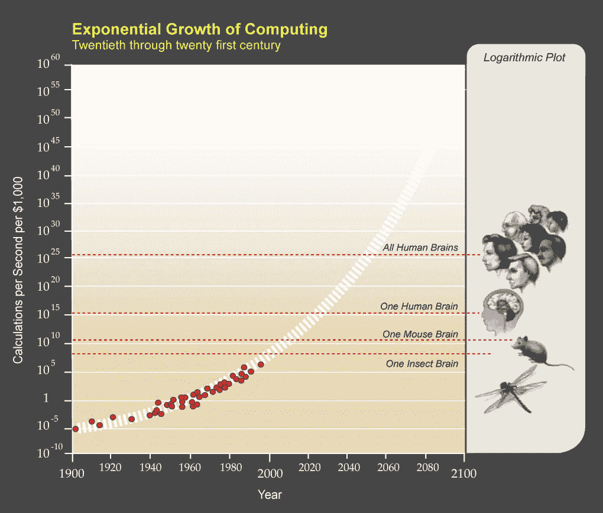

# 人工智能和人类，一种亲密的合作

> 原文：<https://itnext.io/ai-and-humans-an-intimate-collaboration-edb4cb1fde38?source=collection_archive---------0----------------------->

为什么 AI 是我们最重要的技术突破之一，为什么它不会偷走你的工作。

> [点击这里在 LinkedIn 上分享这篇文章](https://www.linkedin.com/cws/share?url=https%3A%2F%2Fitnext.io%2Fai-and-humans-an-intimate-collaboration-edb4cb1fde38)

本文基于我以前发表的一篇文章:

*   T [他的人工智能状态](/dont-fear-artificial-intelligence-783a3fdb216a)

不久前，我写了[人工智能的状态](/dont-fear-artificial-intelligence-783a3fdb216a)，描述了人工智能的不同类别，包括人工智能、AGI 和人工智能。我还讨论了人工智能如何增强而不是危及你的工作。为了补充那篇文章，我将给出更多实际例子，以及人工智能公司如何利用深度学习来模拟类似人类的智能来解决复杂问题。

我相信人工智能和人类会在那里互相协助，我不认为人工智能会很快接管任何新的工作(不包括体力劳动)。但该领域的专家对人工智能及其未来有什么看法？我与最近被高通收购的阿姆斯特丹大学附属公司 [Scyfer](http://scyfer.nl/) 的首席技术官 tij men Blankevoort 坐在一起，谈论他对人工智能实际应用的愿景和经验。

**关于 AI 状态的专家意见**

我问了提门对那些怀疑人工智能的人的看法。他用一个例子回答了我的问题:

> 怀疑有两个方面；你可能认为 AI 永远不会变得像它说的那么大，但它会。相信我，当互联网被引入时，没有人想到它会成为对我们今天的生活如此重要的交流和共享信息的突破性技术。人工智能将通过为每个人提供专业知识来产生同样的影响。你在工作中执行的每一项重复性任务都可以由 AI 来完成。
> 
> 相反，你可能对人工智能持怀疑态度，认为它将接管世界。别担心，不是迫在眉睫。到目前为止，没有证据表明人工智能在不久的将来有任何智能的机会。如果你测试人工智能的智力，它的得分是 0。

他关于人工智能的评论指的是人工狭义智能或 ANI，我之前在另一篇文章中描述过。目前，我们只在日常生活中使用简单的 ANI。ANI 在有限的预定义范围内运行。ANI 是为一个特定的目的而建造的，比如下棋，并且非常擅长模式识别。在 ANI 的反应性记忆和有限记忆之间还有一个[的区别](http://theconversation.com/understanding-the-four-types-of-ai-from-reactive-robots-to-self-aware-beings-67616)。重要的是要明白，所有正在使用的人工智能仍然属于人工智能范畴。

**人工智能的现状如何，它将如何影响事物？**

> 现在，我们还没有技术和算法来达到人脑的计算能力。我们现有的神经网络还不足以创造一个真正的人工智能。至少需要 15 年才能让我们的计算能力达到人脑的水平。
> 
> 有了人工智能，就像它在你的大脑中一样，有可能将某些功能划分到某些算法中。我感兴趣的事情之一是[门控](https://en.wikipedia.org/wiki/Synaptic_gating)，这是激活或抑制某些突触活动。这允许你只在需要的时候使用人工智能的某些功能，节省处理能力并排除其他功能。

15 年了吧…这与库兹韦尔的信息技术发展速度图表中的预测非常接近！该图显示了对数标度上的指数增长。就我个人而言，我喜欢这张照片，它和[水滴](/dont-fear-artificial-intelligence-783a3fdb216a)照片一起展示了计算能力增长的速度。

规模是 1000 美元，因为这个价格在商业上似乎是可行的。改编自 Peter J. Denning 和 Ted G. Lewis 的《计算增长的指数定律》。[美国计算机学会通讯](https://cacm.acm.org/magazines/2017/1/211094-exponential-laws-of-computing-growth/fulltext)，第 60 卷第 1 期，第 54-65 页

但是人工智能的速度和计算能力并不是一切。让人类能够登月的不是计算量，而是智力上的素质。我们大脑的结构和我们的认知模块使我们能够进行复杂的推理或语言交流。想象一下，如果我们可以为人工智能建造这个，这将导致 AGI 或人工智能系统。

**人工智能辅助决策的两个例子**

> [人在回路](https://www.forbes.com/sites/adrianbridgwater/2016/03/07/machine-learning-needs-a-human-in-the-loop/2/)系统，是当人工智能不是静态确定时，使人类能够标记输出的系统。其实有些事情人类比机器更擅长，比如评价内容。通过两个例子，让我们看看 Scyfer 如何在工业和医疗领域应用主动学习。
> 
> “**最成功的机器学习发生在有人类判断、创造力和想象力参与的过程中。Scyfer 将人工智能应用于钢铁生产质量检测的方式就是一个很好的例子。**
> 
> 为了确保钢材的最高质量，检测算法会查看数百万张钢板图片来检测缺陷。传统上，他们使用训练集来训练算法，以正确识别故障。创建这些训练集既耗时又困难。通过主动学习，在钢铁生产过程中工作的专家可以主动与算法进行交互。通过一个接口，它们指示哪些故障标识是正确的，哪些是错误的。
> 
> 另一个例子是当专家和人工智能在诊断组织样本中的癌细胞的过程中互相帮助。不能完全依赖该算法，并且专家不能以与该算法相同的速度扫描组织样本。把这两者结合起来，你就有了速度和经验；专家可以通过交互主动训练算法，帮助识别过程变得更高效。

要给出人工智能如何帮助我们的其他例子，请看看特斯拉自动驾驶的这两个短片。该系统持续扫描环境，寻找与危险情况相关的东西。它对它们的作用比人类更快。这就是辅助驾驶，人工智能接管控制权来辅助人类。当你分心时，它会运行以防止事故发生。

这些例子是我相信未来人工智能和人类将互补而不是相互竞争的原因。人工智能可以接管我们不擅长的平凡、无聊和重复的任务，而我们可以在我们擅长的领域应用我们的经验和创造力。我们也可以把更多的时间放在我们喜欢做的事情上。

然而，总有一天我们会足够先进，AGI 或阿西将成为可能；这意味着人工智能可以在没有人类指导和限制的情况下运行。然而，如果我们采取错误的方法，它可能成为竞争而不是合作。为了引导这个未来成为一个合作的未来，我们必须提出基本的规则，比如 ASI 意大利空间局能做什么和不能做什么，我们能创造和发展什么。

像艾萨克·阿西莫夫的机器人三定律这样的规则:

1.  *机器人不得伤害人类，或者，通过不作为，允许人类受到伤害。*
2.  *机器人不得伤害人类，也不得坐视人类受到伤害。*
3.  机器人必须服从人类给它的命令，除非这些命令与第一定律相冲突。
4.  机器人必须保护自己的存在，只要这种保护不违反第一或第二定律。

这些哲学问题最好留在以后的文章中讨论。敬请关注，让我知道你的想法！