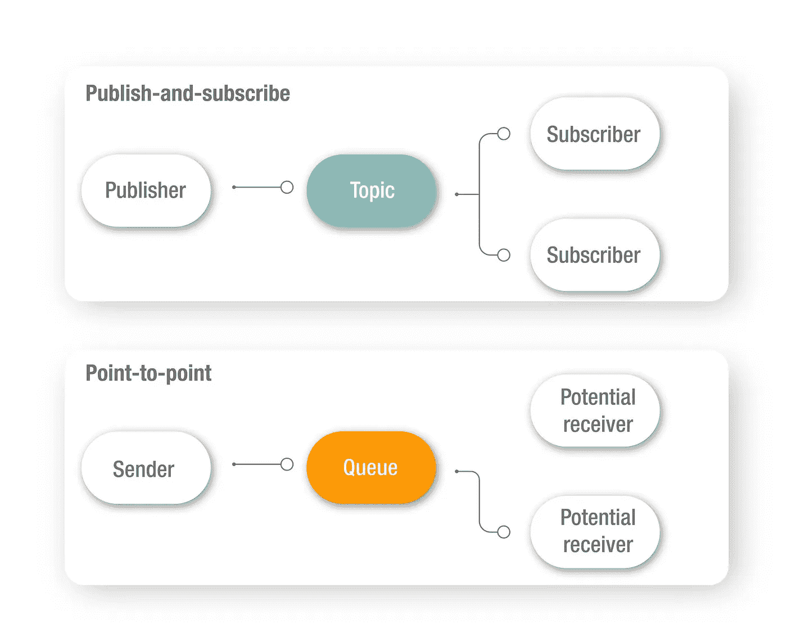
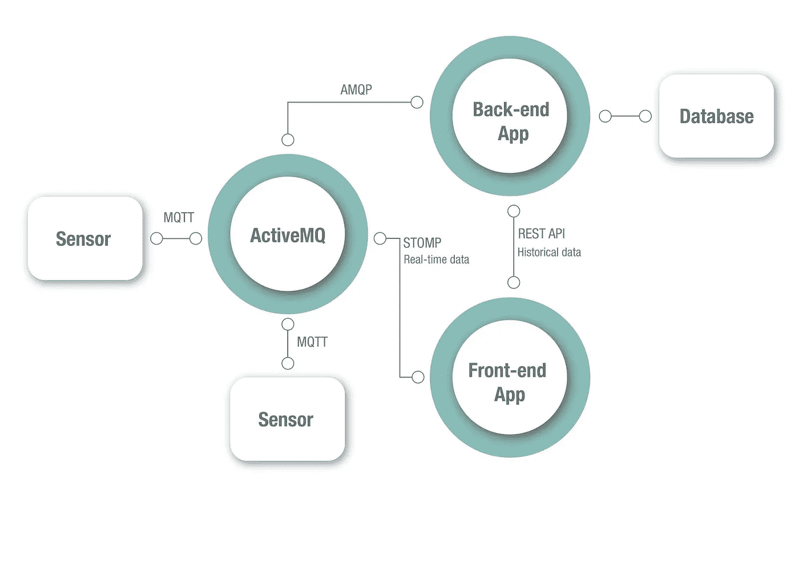

# 关于 ActiveMQ 您需要知道的一切

> 原文：<https://itnext.io/all-you-need-to-know-about-activemq-76edb977e6a?source=collection_archive---------2----------------------->

# 什么是消息代理，如何使用它？

我们生活在一个万物相连的世界。发送和接收数据的需求比以往任何时候都大。这种密集的通信需要一个强大的基础架构，该架构在消息完整性方面以稳定可靠的方式促进这些消息交换。

ActiveMQ 是一个建立在 Java 消息服务 JMS 之上的消息代理。

MQ 代表消息队列，这个应用程序的目的就是为了解决上面提到的问题。

这种应用程序被用作两个或多个其他应用程序之间的通信桥梁，这与它们通过不同协议编写的编程语言有关。

以下场景是如何使用消息代理的示例。

假设您有一个使用 SMS 进行双因素身份验证的 web 应用程序(这在银行应用程序中尤其流行)。

一种常见的方法是使用 web 服务。用户输入他们的凭证，然后一个请求被发送到服务器，通知它(服务器)必须发送一个带有他们的验证码的 SMS 给那个用户。

但是，web 服务可能会关闭并变得不可用。即使只是很短的一段时间，也足以错过来自 web 应用程序的用户请求。

在这种情况下，用户将永远不会收到他们的身份验证代码，必须再次经历整个过程。对于时间敏感的情况，如银行转账，这可能会成为一个大问题。

使用消息代理并将消息放在消息队列中可以解决这个问题。该消息不会立即传递，但会在服务的另一端重新联机时出现。

在这种情况下，用户会稍微延迟一会儿收到验证码，但重要的是他们仍然会收到验证码。

# ActiveMQ 是如何工作的？

JMS 消息代理的基本概念是**主题**和**队列。**

队列基于 FIFO(先进先出)工作，它们代表一个消息管道。

作为生产者的应用程序将创建一条消息，并将其推入队列。然后，这个消息将被另一个作为消费者的应用程序轮询。就像一个系统将任务分配给多个工作人员。

这些消息一次提取一条，并且可以定制接收它们的策略。

**主题**作为基于订阅的消息渠道，用于创建一个**一对多**的通信系统。

场景如下。一方面，我们有一个作为编辑器工作的应用程序。在我们的上下文中，这个应用程序将发送带有一些可选数据的个性化消息。

另一方面，我们有多个订阅特定消息的应用程序，当消息到达时，每个应用程序都会执行特定的操作。

当我们的**发布者**发送消息时，**订阅了该主题的**的接收者将会收到消息的广播。

# 谁可以使用 ActiveMQ？

像 ActiveMQ 这样的工具的最佳用例是当您有一个多应用程序体系结构，并且您需要将任务发送给其中的几个应用程序，但是想要避免直接使用它们的 API 时，或者当您需要以定义的顺序完成一个过程时，例如一个事务系统。

Apache ActiveMQ 是一个支持多种协议的消息传递代理，最流行的是:

*   [AMQP](https://activemq.apache.org/amqp)
*   [MQTT](https://activemq.apache.org/mqtt)
*   [休息](https://activemq.apache.org/rest)
*   [跺脚](https://activemq.apache.org/stomp)

如果您的设备可以利用这些协议中的一个，那么您可以将这个工具集成到您的体系结构中。消息代理的另一个关键优势是应用程序甚至不必都使用相同的协议。

您可以在家中安装一些智能传感器，通过 MQTT 发送数据，MQTT 是一个后端服务器，通过 AMQP 从消息代理接收信息。然后，它将传感器测得的数据存储在一个数据库和一个 web 仪表板中，该仪表板通过 Stomp 连接到同一个消息代理，并实时显示这些值。

如果你是一家开发通过移动或网络应用程序连接的智能设备的企业，这种架构不仅有利，而且会使整个系统变得可靠。这样，无论用户身在何处，他们都能够监控自己的数据，并且知道不会丢失任何信息。

# ActiveMQ 的成本是多少？

鉴于目前我们正在经历的危机以及有多少公司受到影响，尽可能降低成本是我们许多人不得不面对的现实。

Apache ActiveMQ 是一个免费的开源软件，可以在 [Apache 2.0 ASF 许可](https://www.apache.org/licenses/LICENSE-2.0)下使用。如今，开源社区和开源软件可以为许多公司提供一艘救生艇。

企业解决方案可以给你一种舒适和方便，因为你知道你总是被提供使用付费软件的帮助，从而防止你的团队被阻塞。

有些公司提供了解决方案，如 OpenLogic、T2、萨沃科技或 T4 的 Tomitribe，它们为 ActiveMQ 和其他开源技术提供企业级支持。

然而，除了提供给你的支持之外，企业和开源之间没有什么大的区别。企业解决方案是由员工支持的，而开源是由积极参与维护和更新软件的社区支持的。

# 结论

一个好的消息传递代理可以是复杂体系结构的主干，其中有几个相互连接的应用程序，它们相互通信，并且需要良好的管理和任务划分。

ActiveMQ 附带的多功能性及其支持的协议套件，以及企业风格和就绪性，可以使该工具在为您的基础设施选择正确的消息传递代理时处于首要位置。