# 亚马逊 EKS 发行版(EKS-D):亚马逊 EKS 使用的 Kubernetes 发行版

> 原文：<https://itnext.io/amazon-eks-distro-eks-d-the-kubernetes-distribution-used-by-amazon-eks-fa23b54025fb?source=collection_archive---------0----------------------->

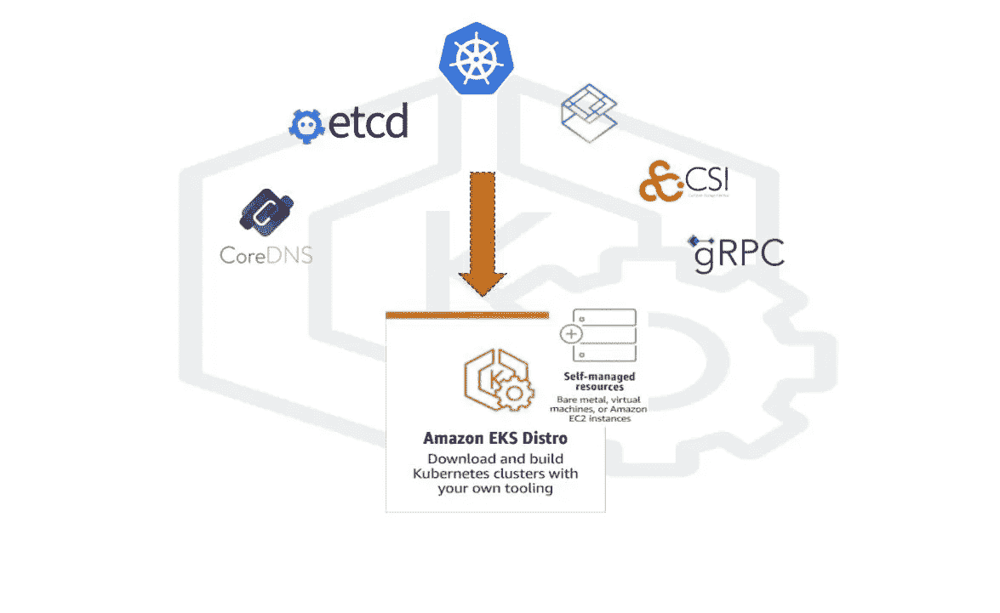

Kubernetes 分销为全球弹性 Kubernetes 服务(EKS)提供支持

亚马逊在 re:Invent 2020 虚拟活动上发布了与容器服务相关的战略公告，公告包括 EKS-A (EKS Anywhere)、EKS-C (EKS 控制台)、ECS-A (ECS Anywhere)和 EKS-D (EKS Distro)。虽然 EKS-A、EKS-C、ECS-A 预计将于 2021 年上市，但 AWS 开源了 EKS-D-Kubernetes 发行版，为其弹性 Kubernetes 服务(EKS)提供支持。

Kubernetes 发行版是具有选定配置和选定插件集的 Kubernetes。有多个 Kubernetes 发行版，如 Rancher Kubernetes、VMware Tanzu Kubernetes Grid、Canonical 的 Charmed Kubernetes、Red Hat OpenShift 等。上游可用。Kubernetes 在默认情况下并不安全，其本身也不安全，一个注重安全的 Kubernetes 发行版将为 Kubernetes 配置限制性的安全策略，这些策略对于生产环境来说是至关重要的。

EKS 发行版(EKS-D)结合了开源(上游)Kubernetes 组件— Kubernetes 控制平面组件(如 kube-controller-manager、etcd 和 CoreDNS)、Kubernetes 工作节点组件(kubelet、Kubernetes CSI 和 CNI)、命令行客户端(kubectl 和 etcdctl)、安全补丁和第三方工具，包括集群创建所需的配置数据库、网络和存储组件。它还将包括亚马逊 EKS 使用的所有上游补丁，包括亚马逊对社区做出的修复。此外，它还将包括 AWS 认为对操作稳定性和安全修复非常重要的补丁。

通过 EKS-D，AWS 建立了一个通向其托管的 Kubernetes 平台的开源桥梁和一个推动其云平台采用的媒介。通过 EKS-D，用户可以依赖部署在亚马逊 EKS 和其他云平台(公共/私有)上的相同版本的 Kubernetes 及其依赖项。

EKS-D 通过使用与亚马逊 EKS 全球部署的 Kubernetes 及其依赖项相同的经验证版本和配置，减少了在本地和基于云的环境中使用不同的 Kubernetes 发行版之间的摩擦。由于它是免费的，客户更有可能在考虑其他 Kubernetes 发行版之前评估它，并使 AWS 能够有效地与 VMware、Red Hat、Rancher 等独立软件供应商竞争。利用 Amazon EC2 来运行他们的托管 Kubernetes 产品。

# EKS 队对 EKS 队

EKS —在亚马逊 EKS 的亚马逊 EC2 上设置托管控制平面—控制平面在由 AWS 管理的帐户中运行，Kubernetes API 通过与您的集群关联的亚马逊 EKS 端点公开。每个亚马逊 EKS 集群控制平面都是单租户和唯一的，运行在自己的一组亚马逊 EC2 实例上。用户可以使用受管节点组选择自我管理的数据平面或 AWS 管理的数据平面。

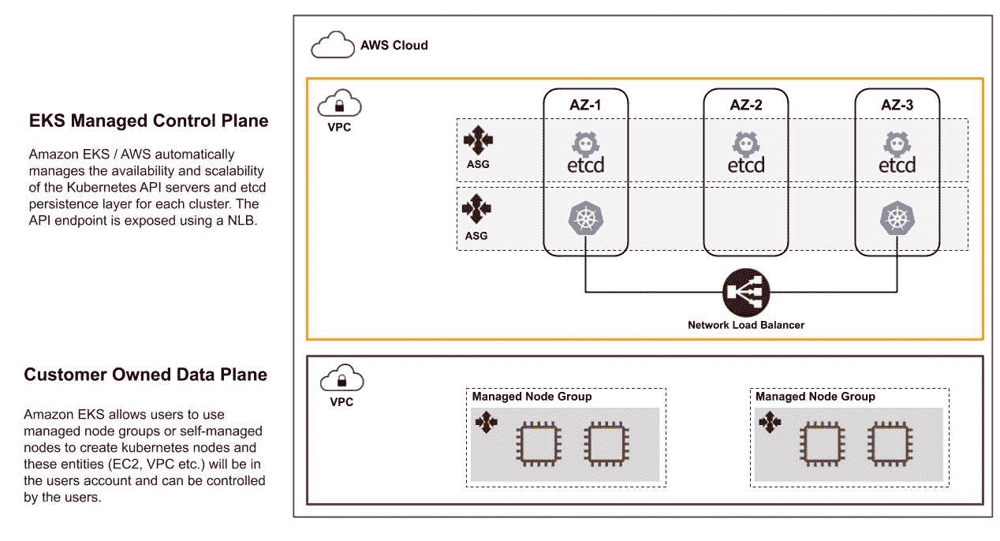

EKS 集群

亚马逊 EKS 节点在用户 AWS 帐户中运行，并通过 API 服务器端点和为集群创建的证书文件连接到集群的控制平面。集群创建(引导)是无缝的，由 AWS CloudFormation 堆栈创建的多个实体组成。用户可以选择任何受支持的版本来创建集群。

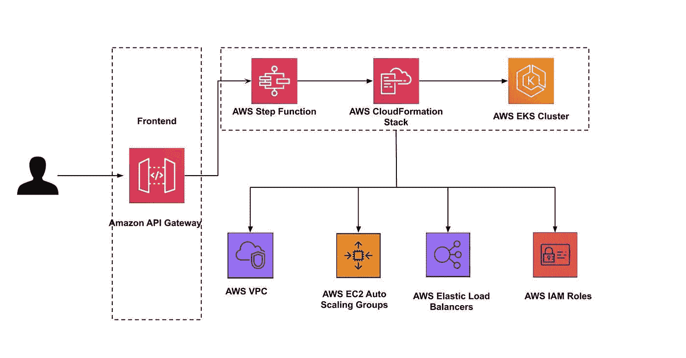

EKS 集群创建

用户只能访问工作负载组件、部署在节点上的守护设备，而不能访问所有控制平面组件。

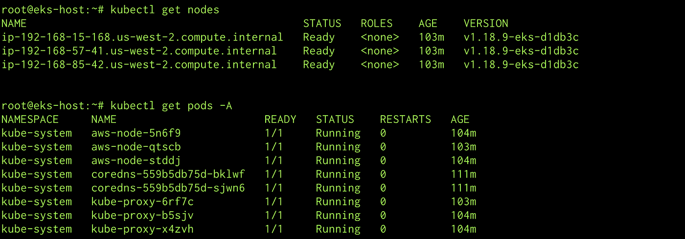

EKS 管理的控制平面

EKS-D —所有组件都由客户管理。可以使用任何受支持的安装方法来完成群集的引导。许多合作伙伴已经在提供安装方法以及与 EKS 发行版的集成。生命周期管理和其他方面(如供应节点、HA 控制平面、故障转移等)所需的工具。应由用户小心使用。

EKS D

EKS-D 可以被希望标准化和使用完全相同的 Kubernetes 发行版的组织使用，就像他们在非 AWS 环境中使用亚马逊 EKS 一样。

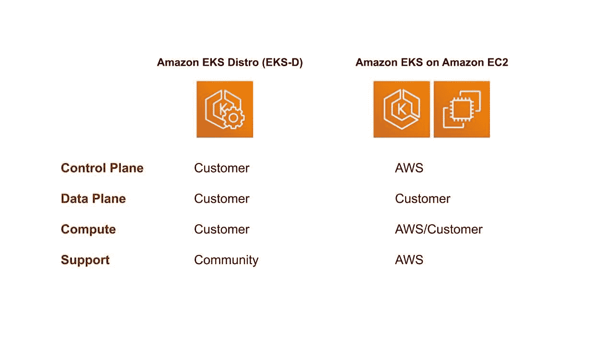

EKS 对 EKS

用户可以访问所有组件(控制平面和其他工作负载)，这使用户能够控制核心控制平面组件。

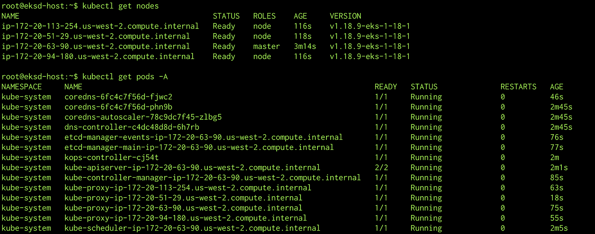

EKS D

# 发布渠道和发布

每个亚马逊 EKS 发行版都遵循 [EKS 流程](https://docs.aws.amazon.com/eks/latest/userguide/kubernetes-versions.html#kubernetes-release-calendar)(在任何给定时间支持至少四个生产就绪的 Kubernetes 版本)，验证新 Kubernetes 版本的兼容性。亚马逊 EKS 发行版的源代码、开源工具、二进制文件和容器映像以及配置都是通过公共 Git 和 S3 存储位置为可复制的构建提供的。

EKS 发行版发布 Kubernetes 版本的速度与 EKS 相同，更新在发布渠道中作为发布发布。一个发布通道跟踪次要版本( *v <主要版本>)。<小调>。点<>*)，并且当 EKS 停止支持 Kubernetes 的特定次要版本时，频道将被停用。

新版本和发布渠道将在发布时通过 SNS 主题宣布。发行版和发行渠道的结构是 Kubernetes 定制资源定义(CRD ),模式可以在[eks-distro-build-tooling](https://github.com/aws/eks-distro-build-tooling/tree/main/release)GitHub 存储库中找到。

发布渠道和发布-自定义资源定义(CRD)

EKS-D-发布和发布渠道 CRD 的

用 snsTopicARN (Amazon 资源名称)发布通道规范

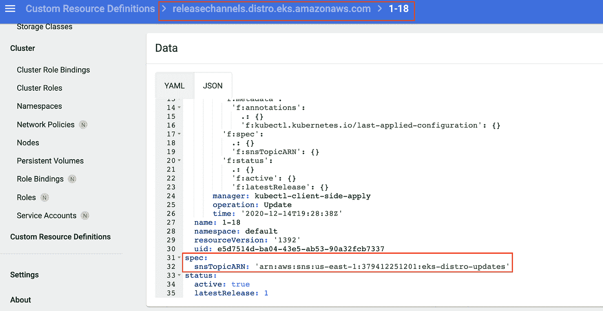

发布频道 CRD-EKS-D

EKS 发行版的版本与各个组件(CNI 插件、核心域名等)的版本同步。)由 Amazon EKS 使用或推荐与 Kubernetes v1.18.9 一起使用。发布清单中提供了组成发布的所有组件和资产的列表，包括 URIs 到所有压缩归档文件、二进制文件和容器映像。

包含单个组件和相应映像版本列表的发布规范:

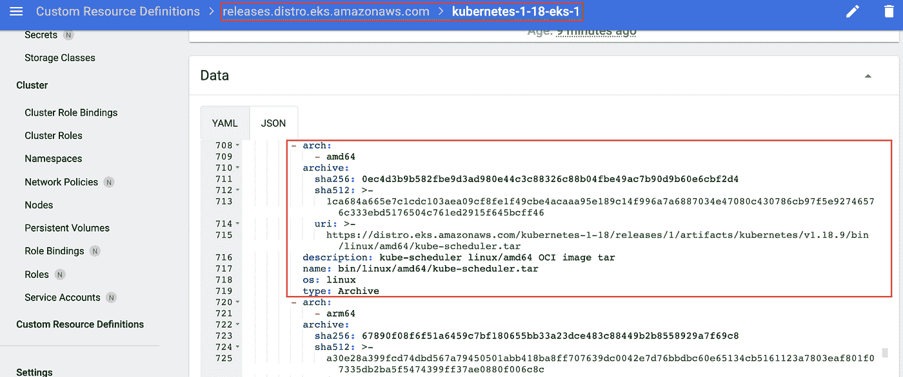

发布 CRD-EKS-D

这些组件的所有容器映像都基于 Amazon Linux 2，用户可以在用于 amd64 和 arm64 架构的 ECR 公共注册表上获得，或者用户可以使用提供的工具从头开始构建映像。当有更新的组件版本时，将创建新的版本。

EKS 发行版是使用 Kubernetes CI/CD 系统 [Prow](https://prow.eks.amazonaws.com/) 构建的。EKS 操作一个 Prow 装置，它管理所有的建造操作。

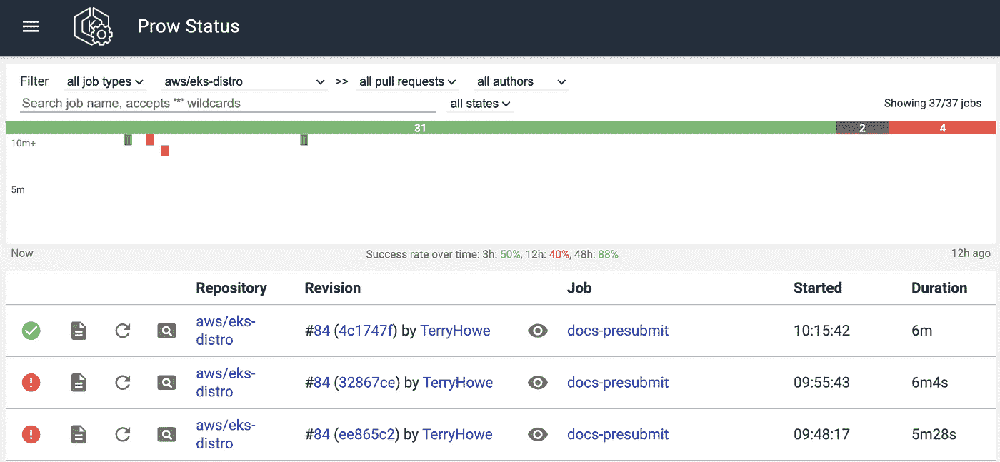

EKS 号船头

# 容器图像

用户可以使用[亚马逊的公共 ECR 库](https://gallery.ecr.aws/?searchTerm=eks-distro&verified=verified)来拉具体发布的图片。该存储库包括所有核心控制平面组件和其他附加组件。

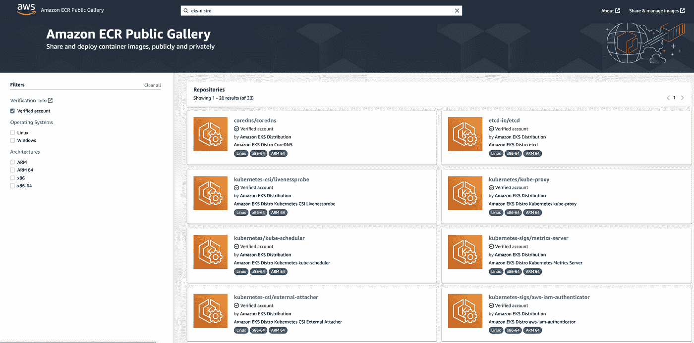

EKS——图片来自 ECR Public

所有图像都标有组件个人版本和 Kubernetes 发布版本，如下所示:

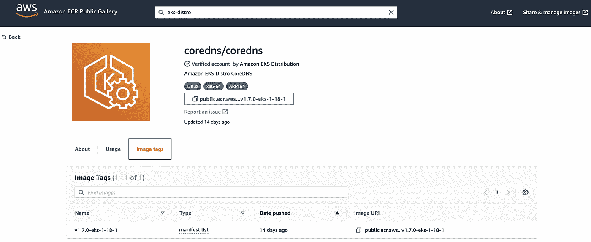

EKS——图片来自 ECR Public

用户可以使用 [EKS 发行版构建工具库](https://github.com/aws/eks-distro-build-tooling) (amazonlinux:2)中提供的基础映像从头构建所有映像，使用 [EKS 发行版](https://github.com/aws/eks-distro)库构建所有容器映像。make files 的默认目标使用 buildkit 来构建容器。替代方法是用 Docker 构建和推送容器。

可以使用工具 repo 创建最新的 Amazon Linux 2 基本映像，并将其推送到 ECR。每当基础映像中包含的 rpm 有任何安全更新时，都会更新此基础。

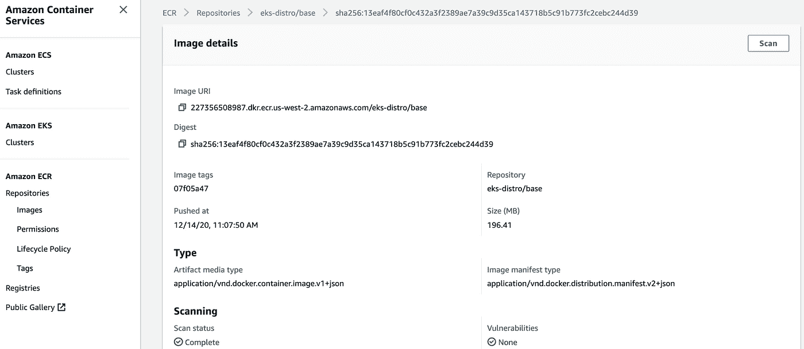

EKS-D-用于构建容器图像的基本图像

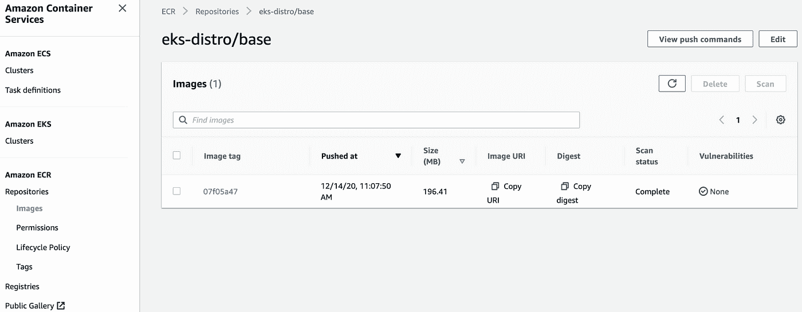

EKS-D-用于构建容器图像的基本图像

所有构建的映像都可以被推送到私有 ECR 存储库，并且可以通过使用 [ECR 凭证助手](https://github.com/awslabs/amazon-ecr-credential-helper)与 docker 一起使用。

ECR 中的个人私有存储库(示例):

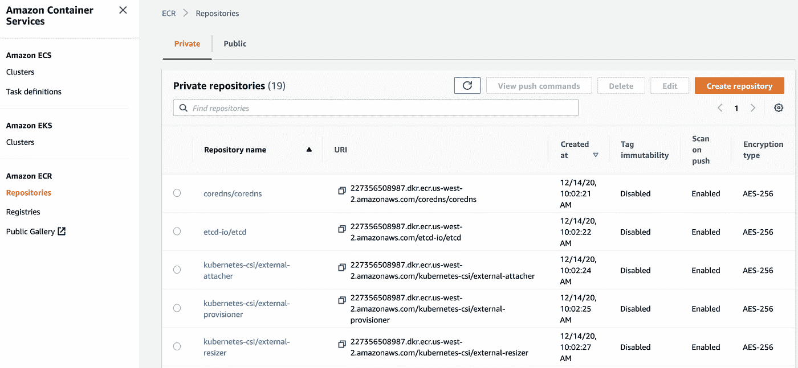

ECR —私有存储库

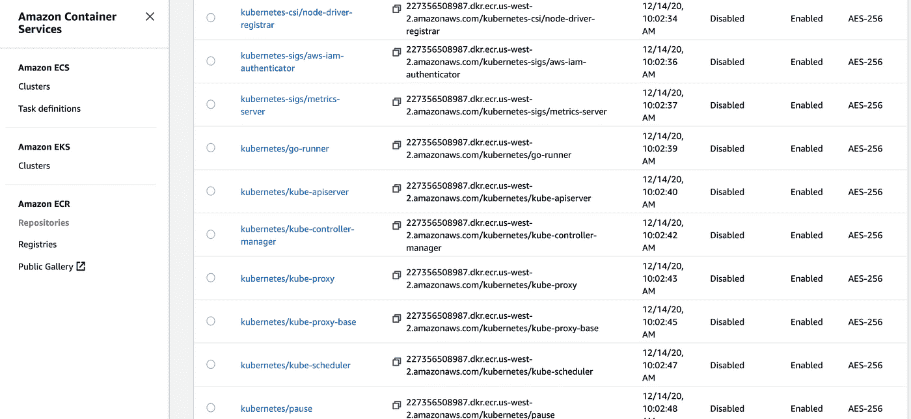

ECR —私有存储库

该工具标记了发布版本和组件版本:

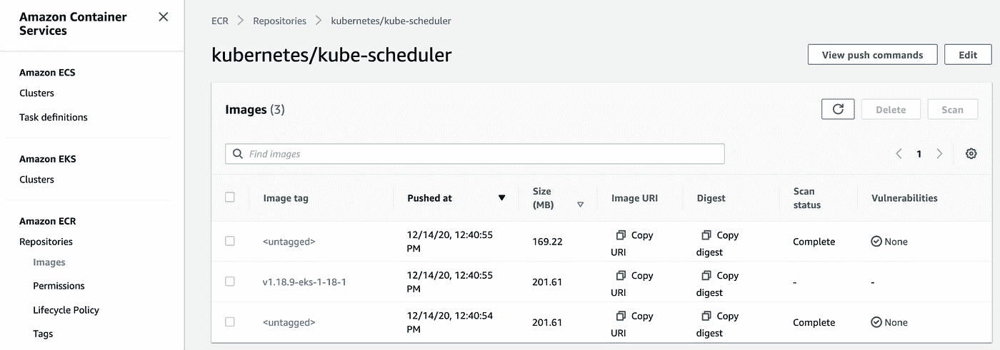

ECR —私有存储库

ECR 自动扫描(配置)所有推送的映像，查找容器映像中的任何软件漏洞。

ECR —漏洞扫描

所有的映像都是使用 amazon-linux 作为基础构建的，包括 AWS 认为对操作稳定性和安全修复很重要的所有补丁，与官方的基于 ubuntu 的上游 Kubernetes 映像相比，大多数漏洞都在 EKS-D 中得到修复。

为了进行测试，下面使用 Snyk 对来自上游(k8s.gcr.io/kube-proxy)和 EKS-D(public . ECR . AWS/eks-distro/kubernetes/kube-proxy)的 kube-proxy 映像进行了漏洞扫描。

以下扫描显示，基于 EKS-D 的 kube-proxy 映像中的大多数漏洞都已修复:

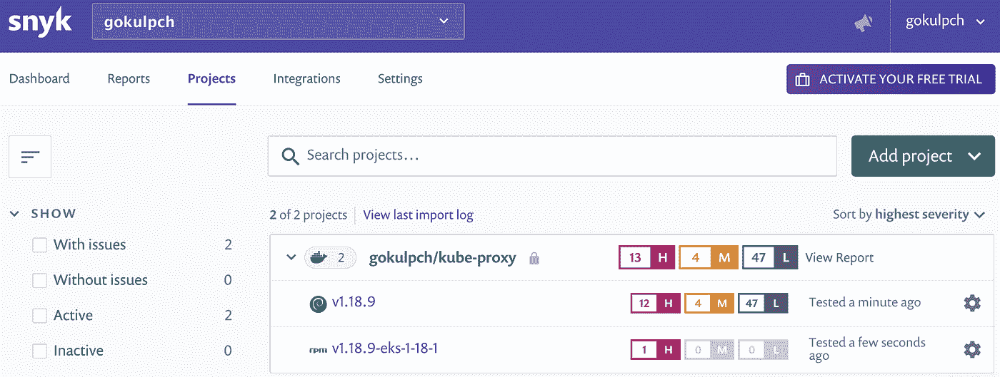

容器漏洞扫描

*k8s.gcr.io/kube-proxy:v1.18.9:*

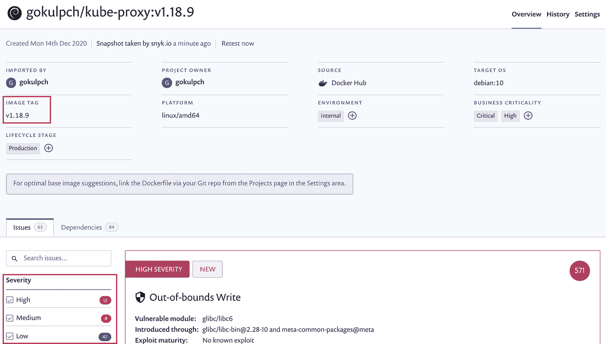

容器漏洞扫描—上游

*public . ECR . AWS/eks-distro/kubernetes/kube-proxy:v 1 . 18 . 9-eks-1–18–1:*

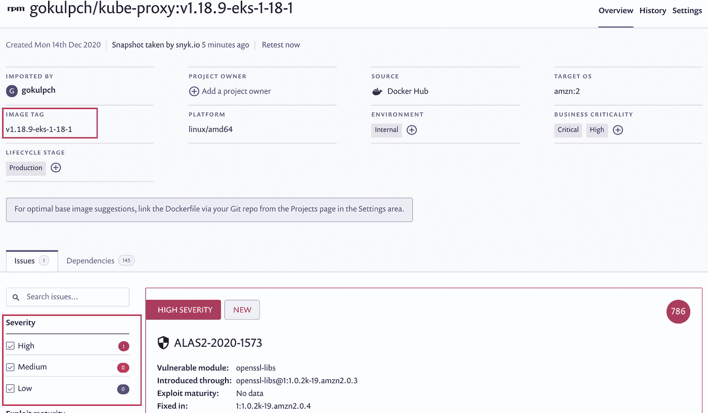

容器漏洞扫描— ECR

# 试用—用 EKS 发行版引导集群

EKS 发行版可以使用任何一种[支持的安装方法](https://distro.eks.amazonaws.com/community/partners/)来安装，比如 Rancher、Kubeone、Canonical、Kubestack 等等。，合作伙伴还提供监控(datadog，instana)、安全(alicide，aqua security)、GitOps (weaveworks)等服务。

来自 eks-distro 库的官方开发指南使用 kop 来引导集群。从技术上讲，EKS-D 可以使用 Kubeadm 之类的工具进行安装，因为这仅涉及修改所使用的图像(使用来自公共 ECR 的基于 EKS-D 的图像)以及在源自上游的清单中添加特定的标志/参数。还有像 EKS Snap 这样更简单的方法来快速了解 EKS-D。Rancher 等其他合作伙伴已经在 RKE-2 (RKE 政府)和其他许多提供安装方法、监控和安全的公司支持生产级 EKS-D。

# EKS 快照— Ubuntu

有了 [EKS 快照](https://snapcraft.io/eks)，一个完整的 EKS 体验现在可以在一个单一的、不可变的包中自动更新，维护成本低，安全性更高。

eks snap 打包了亚马逊 eks 发行版(EKS-D)的所有 Kubernetes 二进制文件，并将它们与类似 MicroK8s 的体验相结合，以便在任何地方都能获得自以为是、自我修复、高度可用的 EKS 兼容的 Kubernetes。

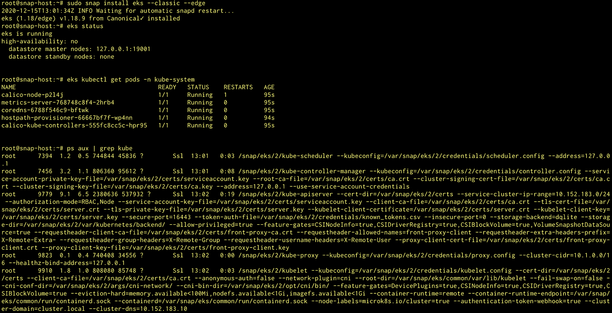

EKS-D 快照— Ubuntu

这个 EKS 发行版是基于 MicroK8s 的。所有控制平面组件都作为 systemd 服务运行。

EKS 快照— EKS-D

安装方法提供了多个命令来管理节点的添加和删除、管理证书、管理数据库等。如下所示，快照安装会自动安装和初始化多个服务。

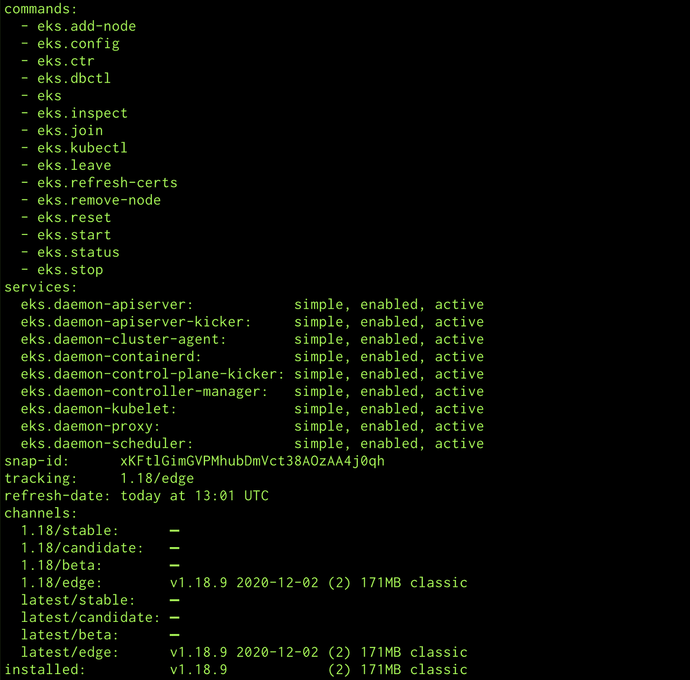

EKS-D Snap — Ubuntu — CLI

# 科普斯

Kops 是 Kubernetes Operations 的缩写，是一套在云中安装、操作和删除 Kubernetes 集群的工具。到今天为止，Kops 提供了启动 EKS-D 集群的官方开发指南。在 [eks-distro](https://github.com/aws/eks-distro/tree/main/development/kops) 仓库中提供的 Kops 框架使用 EKS-D 来引导集群。

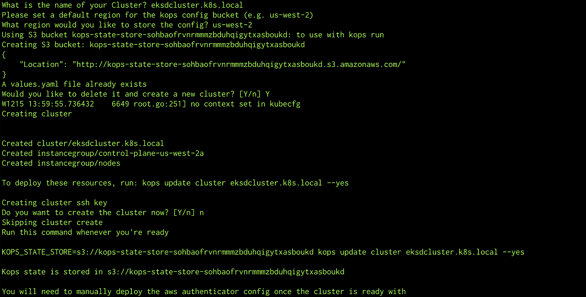

科普斯-EKS-D

Kops 创建所需的 EC2 实例，并使用 EKS-D 引导 Kubernetes 集群

Kops — EC2 实例(主实例和节点实例)

如下所示，用户可以访问所有控制面板组件。

科普斯-EKS-D

所有图像都来自 eks 发行版:

科普斯-EKS-D

Kops 需要一个“状态存储”来存储集群的配置信息，Kops 使用 S3 作为状态存储。在这种情况下，它存储所有信息，如集群规范、清单、pki 等。，状态在初始集群创建期间存储。对群集的任何后续更改也将保存到该存储中。

Kops —国家仓库— S3

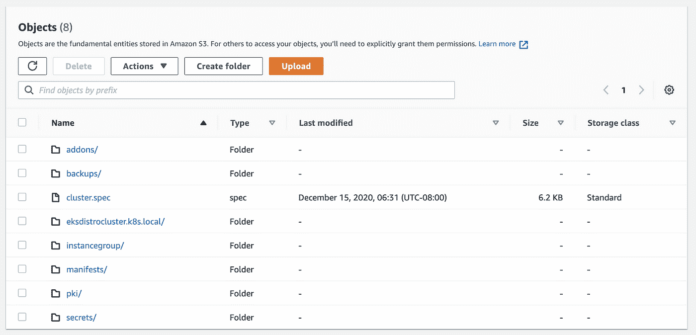

Kops —国家仓库— S3

EKS-D 是亚马逊的一项投资，旨在减少使用商业 Kubernetes 发行版时采用 AWS 所带来的摩擦。除了只是一个 Kubernetes 发行版，EKS-D 还为 AWS 未来的混合云和多云服务奠定了坚实的基础。

随着 EKS-A 在 2021 年的到来，EKS-D 将在混合云环境中发挥重要作用，用户可以在任何地方使用相同的 Kubernetes 发行版，并可以选择连接到其他 AWS 服务。EKS-A 最终将成为事实上的计算环境，用于多云、混合云和边缘(如雪球)环境，使 AWS 能够有效地与市场上已经流行的同类产品竞争，如 Google Anthos 和 Azure Arc。

亚马逊 EKS 任何地方

EKS-D 的上游对齐展示了 AWS 对 Kubernetes 开源社区的持续承诺，也带来了额外的工程实力和想法。这一声明明确强调了企业将把 Kubernetes 作为跨内部和公共云的抽象来运行。