# 使用 Auth0 的 Amazon QuickSight 身份联盟

> 原文：<https://itnext.io/amazon-quicksight-identity-federation-with-auth0-2cae6a5f3a0a?source=collection_archive---------1----------------------->

## 通过第三方企业身份提供商(IdP)管理 QuickSight 用户

# 介绍

作为一名与分析客户合作的解决方案架构师，我经常被问到关于将 Amazon QuickSight 与 Active Directory 集成，或者与第三方身份提供商进行单点登录以进行用户管理的问题。

## 亚马逊 QuickSight

根据 AWS 的说法，Amazon QuickSight 是一种可扩展、无服务器、可嵌入、基于机器学习的商业智能(BI)服务。QuickSight 可让您轻松创建和发布交互式 BI 仪表盘，其中包含基于机器学习的见解。QuickSight 仪表盘可从任何设备访问，并无缝嵌入到您的应用、门户和网站中。

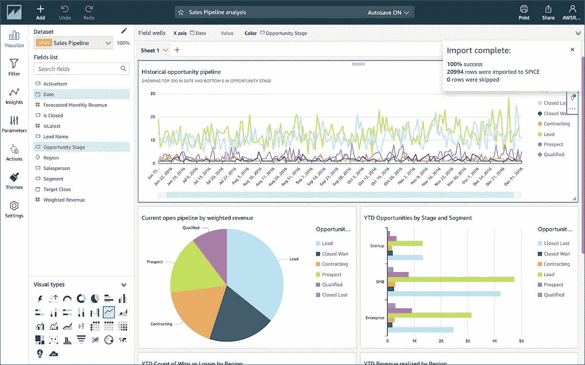

## Auth0

[Auth0](https://auth0.com/single-sign-on/) 是一个易于实现、适应性强的认证和授权平台。根据 Auth0 的说法，Auth0 的身份和管理平台提供了更好的控制、更高的安全性和易用性。[单点登录](https://auth0.com/docs/sso) (SSO)，无论是通过企业联盟、社交登录，还是用户名密码认证，据 Auth0 称，都允许用户只需登录一次，就可以使用他们被授权访问的所有应用。

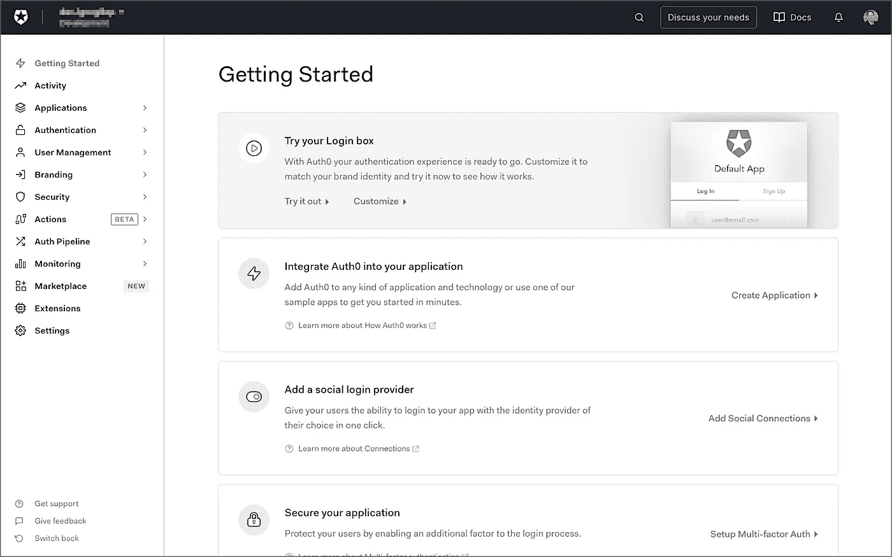

## 身份联盟

据 [AWS](https://docs.aws.amazon.com/quicksight/latest/user/external-identity-providers.html) 报道，亚马逊 QuickSight 支持标准版和企业版的身份联合。借助联合身份，您可以通过您的企业[身份提供商](https://docs.aws.amazon.com/IAM/latest/UserGuide/id_roles_providers.html) (IdP)管理用户，并使用 AWS 身份和访问管理(IAM)在用户登录 Amazon QuickSight 时对其进行身份验证。您可以使用支持[安全声明标记语言 2.0](https://aws.amazon.com/identity/saml/) (SAML 2.0)的第三方身份提供者为您的 QuickSight 用户提供简单的入职流程。这样的身份提供者包括[微软活动目录联合服务](https://docs.microsoft.com/en-us/windows-server/identity/active-directory-federation-services)(AD FS)[Okta](https://www.okta.com/)， [Ping 身份](https://www.pingidentity.com/en/software/pingfederate.html)， [Duo](https://duo.com/docs/sso-generic) ， [Azure AD](https://docs.microsoft.com/en-us/azure/active-directory/manage-apps/configure-password-single-sign-on-non-gallery-applications) ，以及 [Auth0](https://auth0.) 。

借助 identity federation，您的用户可以使用他们现有的身份凭证，一键访问他们的 Amazon QuickSight 应用程序。您还可以通过身份提供商获得身份认证的安全性优势。您可以使用现有的身份提供商控制哪些用户可以访问 Amazon QuickSight。经过身份验证的用户可以绕过 AWS 管理控制台，直接登录 QuickSight。

## 从 Amazon QuickSight 启动登录

在本文的[场景](https://docs.aws.amazon.com/quicksight/latest/user/federated-identities-sp-to-idp.html)中，用户从 Amazon QuickSight 应用程序门户启动登录过程，而没有登录到身份提供者 Auth0。用户拥有由 Auth0 管理的现有联合帐户。用户可能已经拥有或尚未拥有 QuickSight 帐户。QuickSight 向 IdP 发送身份验证请求，即 Auth0。用户成功通过身份验证后，QuickSight 会打开。

在这篇文章中，我们假设你已经注册了 Amazon QuickSight 的企业版，并选择了**使用基于角色的联盟(SSO)** ，而不是**使用活动目录**。**使用基于角色的联盟(SSO)** 选项将允许我们配置第三方 IdP 进行身份认证。

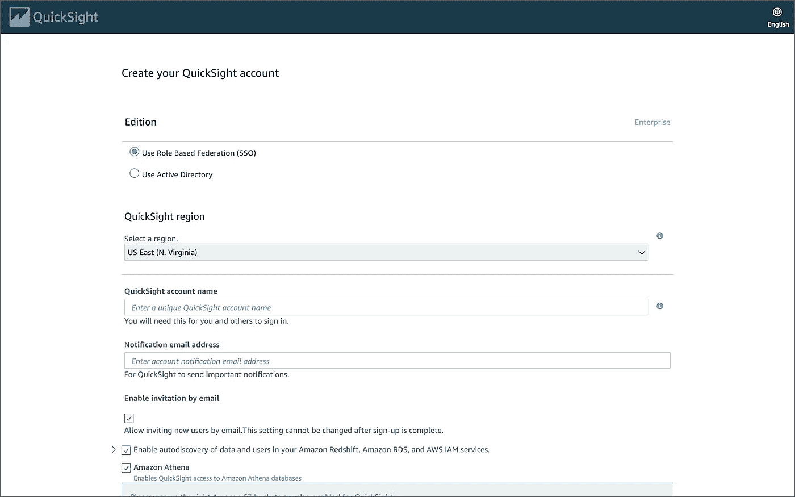

## Auth0 用户和角色

在 Auth0 的**用户管理**界面中，创建三个用户及其相关角色，代表三个 QuickSight 角色:管理员、作者和读者。出于演示目的，我选择根据这三个用户的 QuickSight 角色来命名他们:QuickSightAdmin1、QuickSightAuthor1 和 QuickSightReader1。

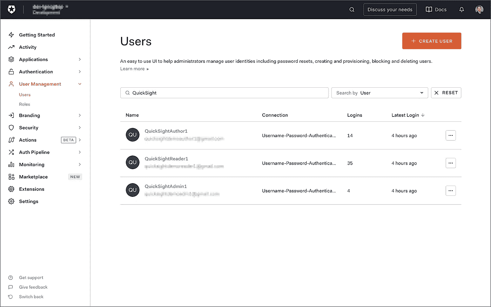

接下来，创建三个角色:QuickSight-Admin-Role、QuickSight-Author-Role 和 QuickSight-Reader-Role。角色名称是任意的，只要它们与 AWS 中的等价 IAM 角色相同(稍后在文章中创建的*)。*

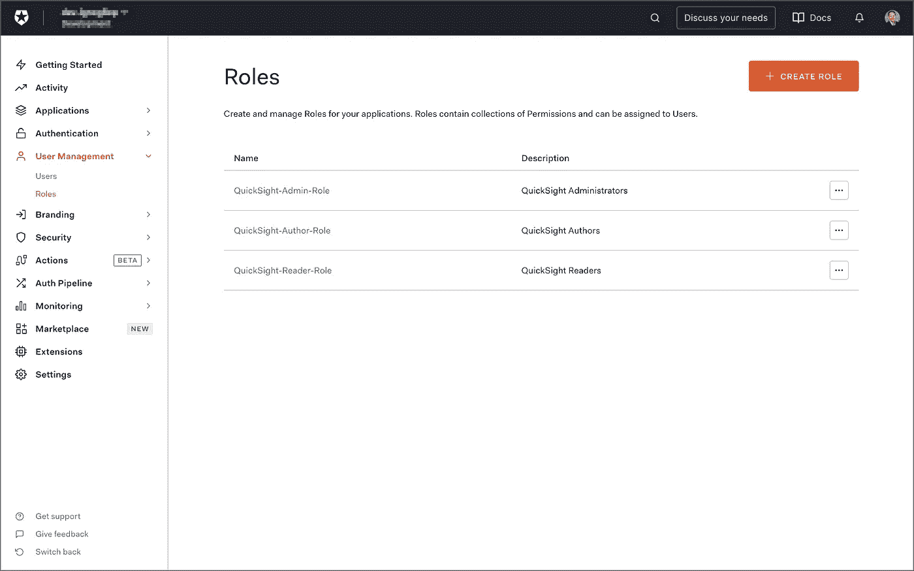

将每个用户与其对应的角色相关联，每个角色对应一个用户。例如，将 **QuickSightDemoAdmin1** 用户与 **QuickSight-Admin-Role** 角色相关联。

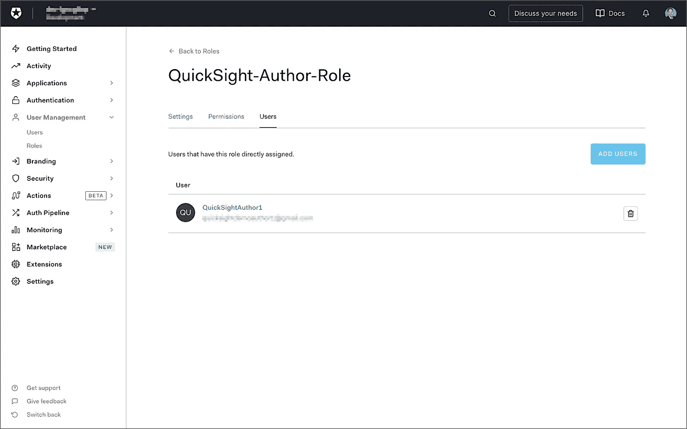

## Auth0 应用程序

接下来，在 Auth0 的**应用**界面，新建一个**常规 Web 应用**。将新应用程序命名为 **Amazon QuickSight** 。

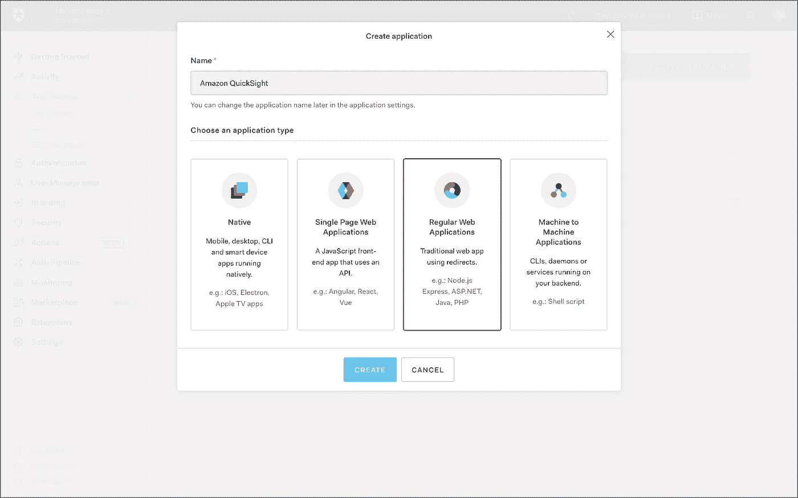

在新应用程序的**插件**选项卡上，启用 **SAML2 Web App** 选项。

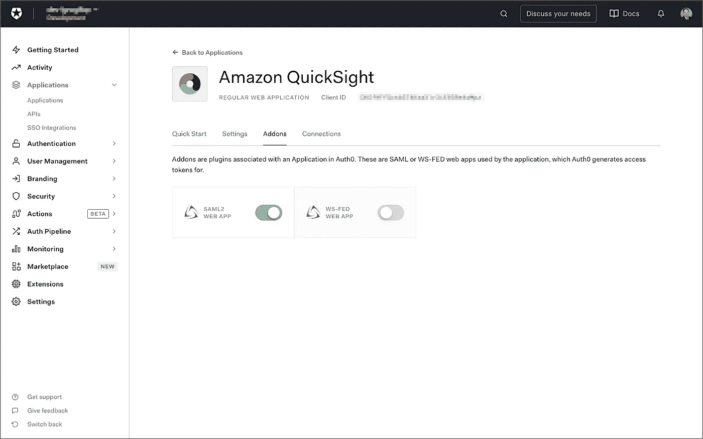

在 **SAML2 Web App** Addon 的**设置**选项卡上，将**应用回调 URL** 值设置为`https://signin.aws.amazon.com/saml`。将**设置**的 JSON blob 值更改如下:

```
{
  "audience": "urn:amazon:webservices"
}
```

最终配置应该与下面的示例相匹配。

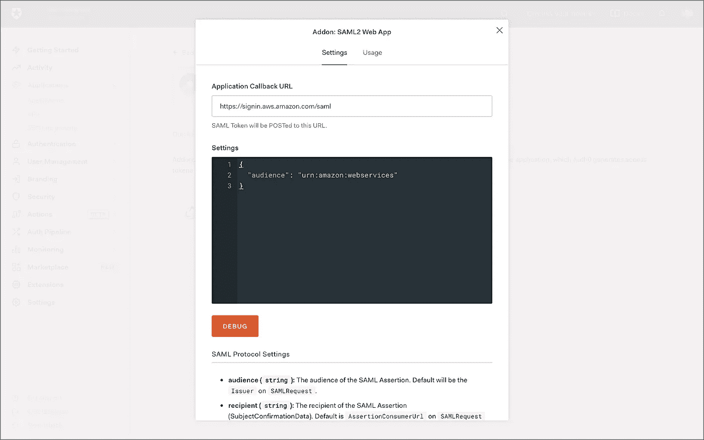

切换到**用法**选项卡。下载**身份提供者元数据** XML 文件，并记下**身份提供者登录 URL** 的值。您将需要元数据文件和 URL 来配置 QuickSight。

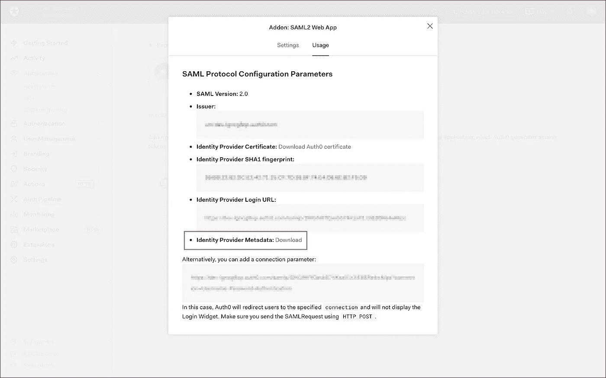

接下来，在新的**亚马逊 QuickSight** 应用程序的**连接**选项卡上，确保只有**用户名-密码-认证**被启用。

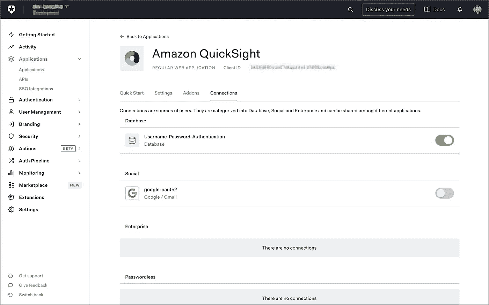

最后，在**设置**选项卡上，在**应用 URIs** 配置部分，确保**允许回调 URL**值也被设置为`[https://signin.aws.amazon.com/saml](https://signin.aws.amazon.com/saml.)` [。](https://signin.aws.amazon.com/saml.)

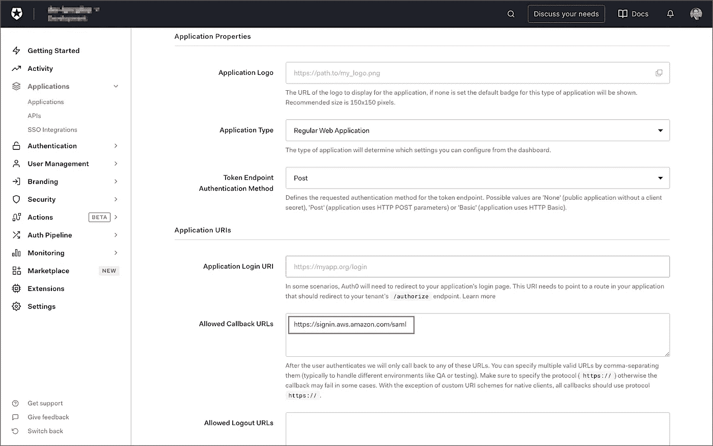

## 授权管道规则

接下来，在 Auth0 的 **Auth Pipeline Rules** 接口中，创建一个新的**空规则**。

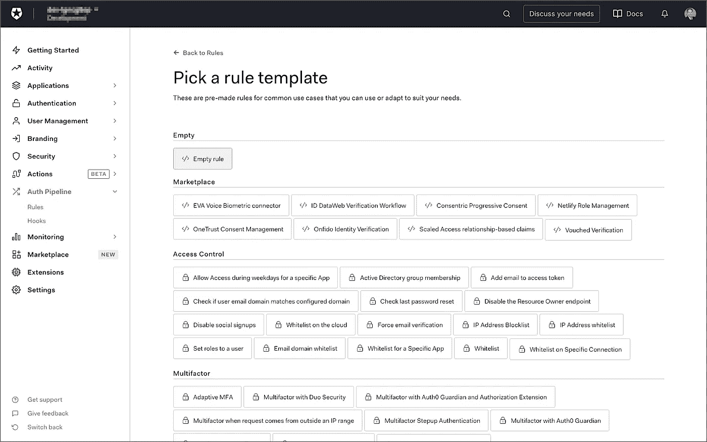

命名新规则:**更改 QuickSight SAML 配置**。

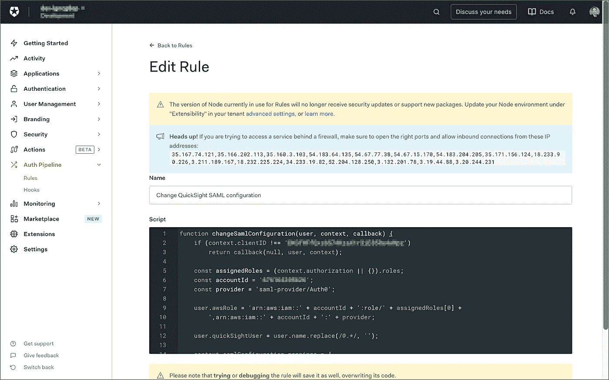

对于**脚本**字段值，使用下面的 JavaScript 代码片段。

```
function changeSamlConfiguration(user, context, callback) {
    if (context.clientID !== '**<your_web_client_id>**')
        return callback(null, user, context);const assignedRoles = (context.authorization || {}).roles;
    const accountId = '**<your_aws_account_id>**';
    const provider = 'saml-provider/Auth0';user.awsRole = 'arn:aws:iam::' + accountId + ':role/' + assignedRoles[0] +
        ',arn:aws:iam::' + accountId + ':' + provider;user.quickSightUser = user.name.replace(/@.*/, '');context.samlConfiguration.mappings = {
        'https://aws.amazon.com/SAML/Attributes/Role': 'awsRole',
        'https://aws.amazon.com/SAML/Attributes/RoleSessionName': 'quickSightUser',
    };callback(null, user, context);
}
```

用您之前创建的 **Amazon QuickSight** 常规 web 应用程序的客户端 ID 替换`<your_web_client_id>`占位符。客户端 ID 列在**应用程序**界面中，在应用程序名称旁边。此外，用您的十二位数字 AWS 帐户 Id 替换`<your_aws_account_id>`占位符。

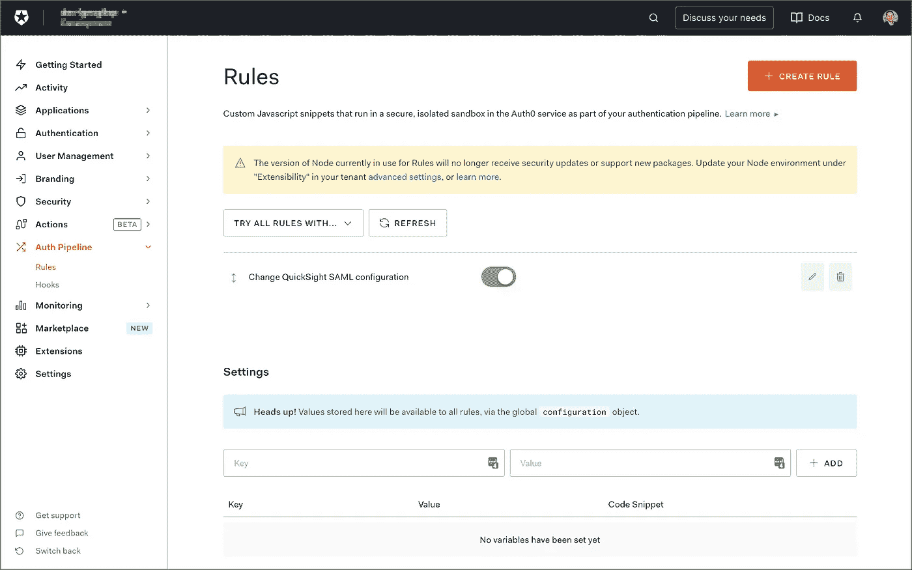

该规则将用于修改 SAML 断言，如下面的 SAML 断言片段示例所示，由 Auth0 作为身份验证过程的一部分返回。该规则将注入 IAM 角色的 Amazon 资源名称(ARN ), auth 0 用户应该与之相关联:QuickSight-Admin-Role、QuickSight-Author-Role 或 QuickSight-Reader-Role。请注意，该规则假设每个用户有一个角色。如果用户被分配了多个角色，则需要额外的逻辑。


## AWS IAM 身份提供者

回到 AWS 管理控制台，为 Auth0 添加一个 AWS IAM 身份提供者。从 IAM 控制台的**身份提供者**界面，单击**添加提供者**。对于**提供者类型**，选择 **SAML** 。命名提供者， **Auth0** 。在**元数据文档**部分点击**选择文件**。选择您之前从 Auth0 下载的元数据文档。点击**添加提供商**完成。

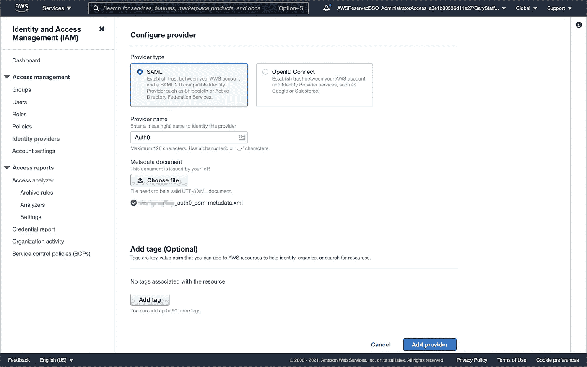

生成的 Auth0 IAM 身份提供程序应类似于以下示例。

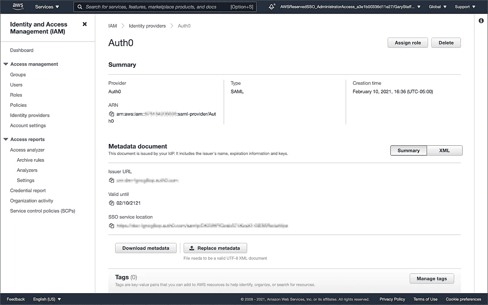

## AWS IAM 策略和角色

接下来，创建三个 AWS IAM 角色，分别对应于管理员、作者和读者这三个 QuickSight 角色。这三个角色也对应于我们之前创建的三个 Auth0 角色。Auth0 用户将在 SAML 文档中传递 Auth0 角色名称。Auth0 角色名称将对应于 IAM 角色。IAM 角色定义了 Auth0 用户对 QuickSight 拥有的权限。我们可以将许多 Auth0 用户关联到一个 Auth0 角色，并相应地关联到一个 IAM 角色。

首先，创建三个 IAM 策略:QuickSight-Admin-Policy、QuickSight-Author-Policy 和 QuickSight-Reader-Policy。这些策略都将与相应的 IAM 角色相关联。创建策略 **QuickSight-Admin-Policy** 。用您的十二位数字 AWS 帐户 Id 替换`<your_aws_account_id>`占位符。

```
{
    "Version": "2012-10-17",
    "Statement": [
        {
            "Effect": "Allow",
            "Action": "quicksight:CreateAdmin",
            "Resource": "arn:aws:quicksight::**<your_aws_account_id>**:user/${aws:userid}"
        }
    ]
}
```

然后，**快视-作者-政策**。

```
{
    "Version": "2012-10-17",
    "Statement": [
        {
            "Effect": "Allow",
            "Action": "**quicksight:CreateUser**",
            "Resource": "arn:aws:quicksight::**<your_aws_account_id>**:user/${aws:userid}"
        }
    ]
}
```

最后，**快速浏览-读者-政策**。

```
{
    "Version": "2012-10-17",
    "Statement": [
        {
            "Effect": "Allow",
            "Action": "**quicksight:CreateReader**",
            "Resource": "arn:aws:quicksight::**<your_aws_account_id>**:user/${aws:userid}"
        }
    ]
}
```

接下来，创建三个相应的 IAM 角色，并关联相应的 IAM 策略:quick sight-Admin-Role(quick sight-Admin-Policy)、quick sight-Author-Role(quick sight-Author-Policy)和 quick sight-Reader-Role(quick sight-Reader-Policy)。

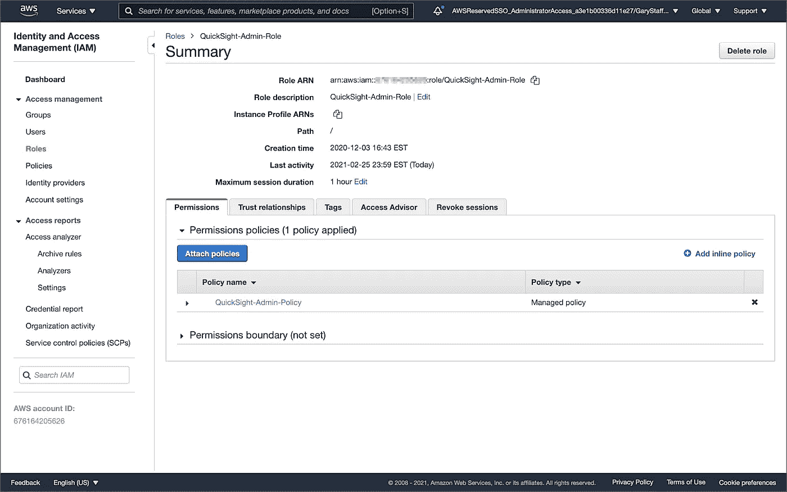

角色的**信任关系**在角色和 Auth0 IAM 身份提供者之间建立信任关系，如下所示。

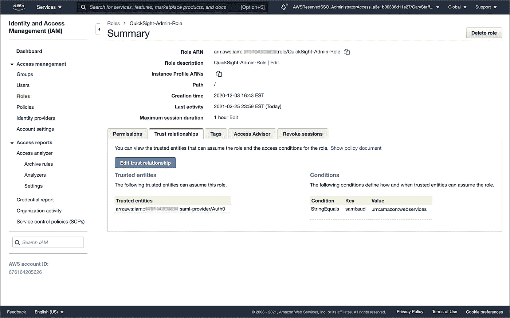

对于三个角色中的每一个，点击**编辑信任关系**并修改访问控制策略文档，如下所示。用您的十二位数字 AWS 帐户 Id 替换`<your_aws_account_id>`占位符。

```
{
  "Version": "2012-10-17",
  "Statement": [
    {
      "Effect": "Allow",
      "Principal": {
        "Federated": "arn:aws:iam::**<your_aws_account_id>**:saml-provider/Auth0"
      },
      "Action": "sts:AssumeRoleWithSAML",
      "Condition": {
        "StringEquals": {
          "saml:aud": "https://signin.aws.amazon.com/saml"
        }
      }
    }
  ]
}
```

角色的访问控制策略文档还包括一个`Condition`策略元素。根据 AWS IAM [文档](https://docs.aws.amazon.com/IAM/latest/UserGuide/id_roles_providers_create_saml_assertions.html#saml_audience-restriction)，出于安全原因，AWS 应该作为受众包含在您的 IdP 发送给 AWS 的 SAML 断言中。对于`Audience`元素的值，指定`https://signin.aws.amazon.com/saml`或`urn:amazon:webservices`。

我们可以通过将响应有效负载中的表单数据从 Base64 格式解码为 XML 来检查从 Auth0 返回的 SAML 断言。下面，我们看到 SAML 断言使用 Chrome 的开发工具来检查网络活动。

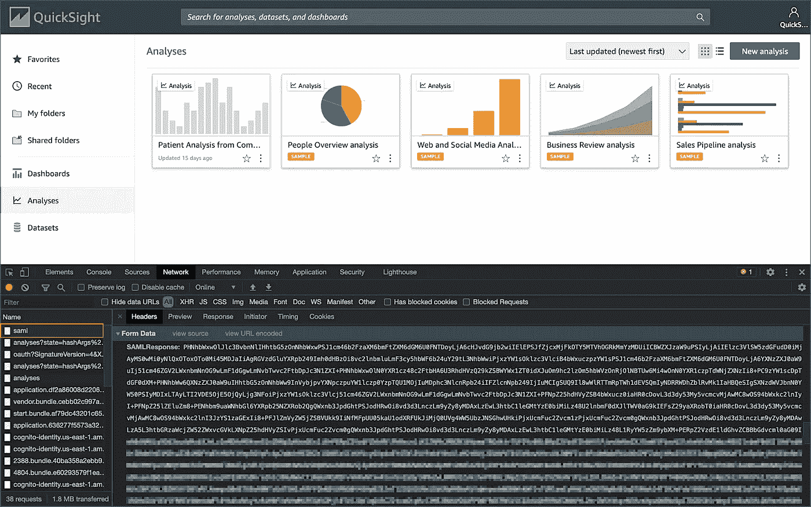

请注意，AWS IAM [文档](https://docs.aws.amazon.com/IAM/latest/UserGuide/id_roles_providers_create_saml_assertions.html#saml_audience-restriction)指出，来自 IdP 的 SAML 断言中的 SAML `AudienceRestriction`值不*映射到可以在 IAM 策略中测试的`saml:aud`上下文键。相反，`saml:aud`上下文关键字来自 SAML *接收者*属性，因为它是等同于 OIDC 观众字段的 SAML，例如，通过`accounts.google.com:aud`。这些显示在下面的 SAML 断言 XML 片段中。*


## QuickSight IdP 配置

集成 QuickSight 和 Auth0 的最后一步是用 Auth0 的特定 IdP 信息配置 QuickSight。从 QuickSight 管理界面中，选择**单点登录(SSO)** 。在上将**状态**切换到**。**

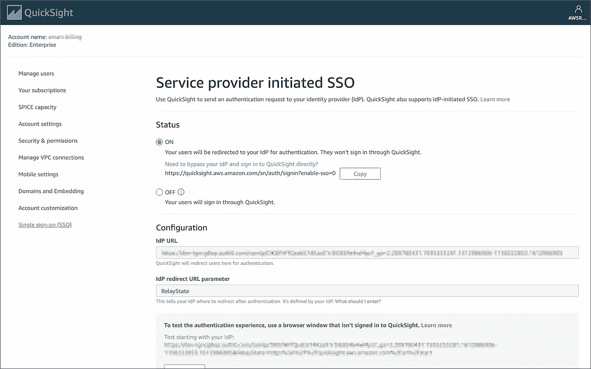

添加 **IdP URL** 值。提醒一下，这个值来自于 Auth0 Amazon QuickSight 应用程序的 **SAML2 Web App** Addon 的**用法**选项卡、**身份提供者登录 URL** 值(*见下文*)。确保复制与显示的 URL 相关联的实际链接。

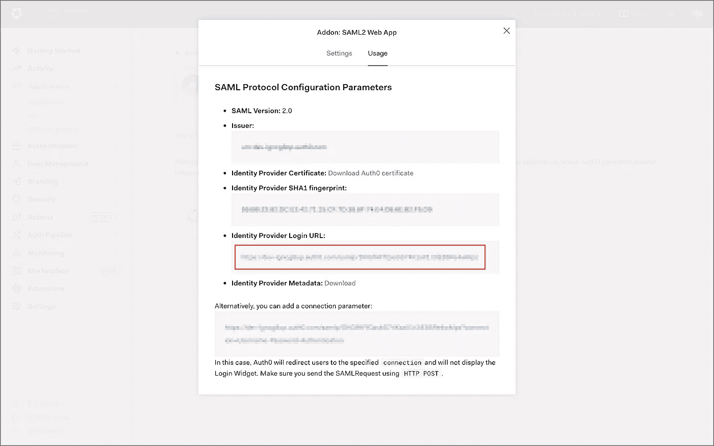

最后，对于 **IdP 重定向 URL 参数**值，使用 **RelayState** 。选择**保存**保存 IdP 配置。

## 测试身份联盟

测试集成最简单的方法是打开一个新的匿名窗口，将浏览器指向`https://quicksight.aws.amazon.com`。应该会提示您输入 QuickSight 帐户名。您在注册 QuickSight 时创建了自己的帐户名称(例如，acme-corp-sales)。

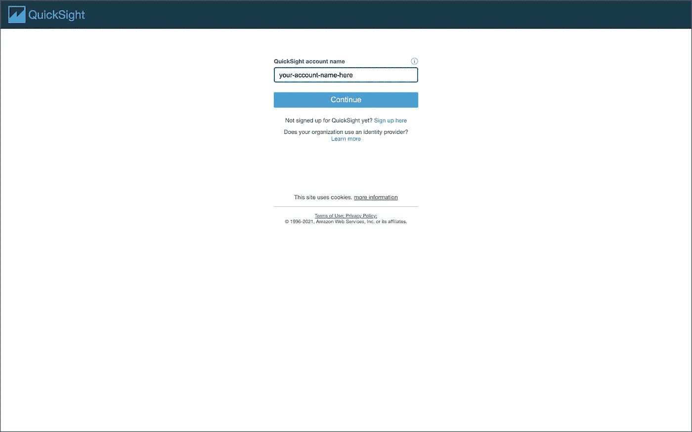

一旦您输入了您的 QuickSight 帐户名称，您将被重定向到 Auth0，并显示 Amazon QuickSight 应用程序的登录屏幕。输入三个 Auth0 用户的电子邮件地址和密码中的任意一个。

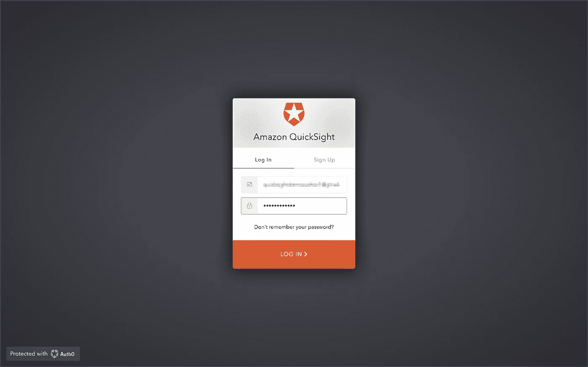

如果 Auth0 登录成功，您将被重定向回 QuickSight 应用程序门户。如果这是用户第一次登录 QuickSight，系统会提示您输入用户的电子邮件地址。使用与用户在 Auth0 中关联的相同电子邮件地址。在这种情况下，用户将向 QuickSight 进行自我注册，并与默认的*[名称空间](https://docs.aws.amazon.com/quicksight/latest/user/namespaces.html)相关联。*

*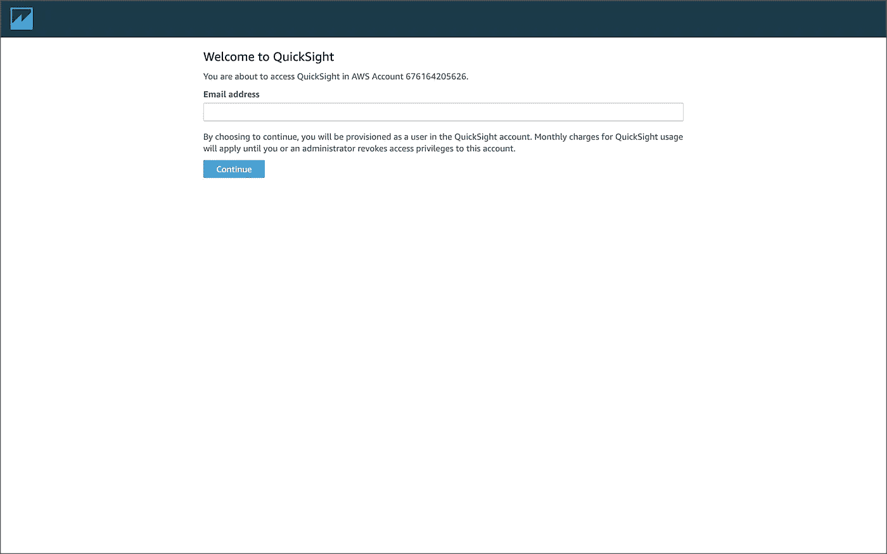*

*根据与用户相关联的 IAM 角色(读者、作者或管理员),您的 QuickSight 体验和可用功能会有所不同。*

*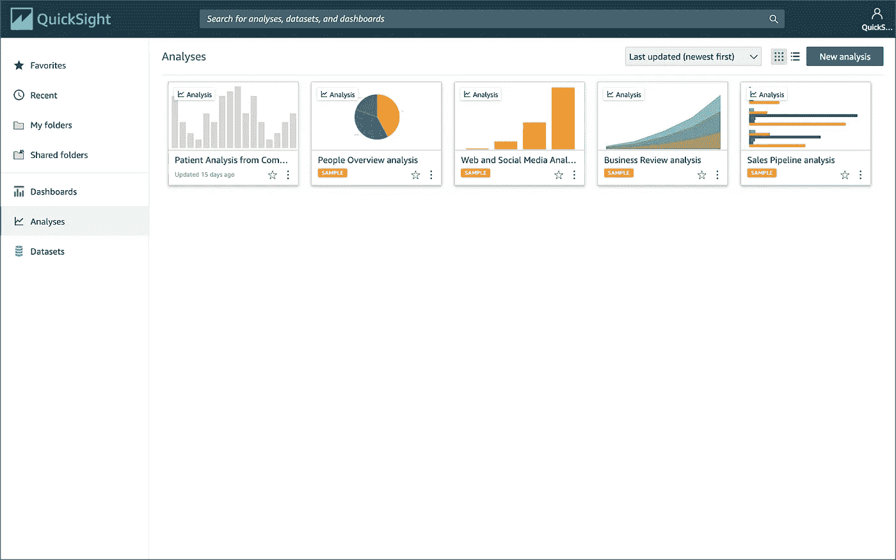*

*关闭隐名浏览器窗口，结束当前用户会话。打开一个新的匿名浏览器窗口，对剩下的两个用户重复该过程，确保每个用户都能成功登录。此外，请确保用户在 QuickSight 中的体验与相关角色(读者、作者或管理员)相匹配。*

## *用户管理*

*作为 QuickSight 管理员，重新登录 QuickSight 并打开**管理用户**界面。所有三个 Auth0 用户都应该向 QuickSight 注册，如下例所示。用户应该与正确的 IAM 角色相关联(*列 1，在正斜杠*的左边):QuickSight-Admin-Role、QuickSight-Author-Role 和 QuickSight-Reader-Role。用户还应该与正确的 QuickSight 角色相关联(*栏 3，在*下面):读者、作者或管理员。*

*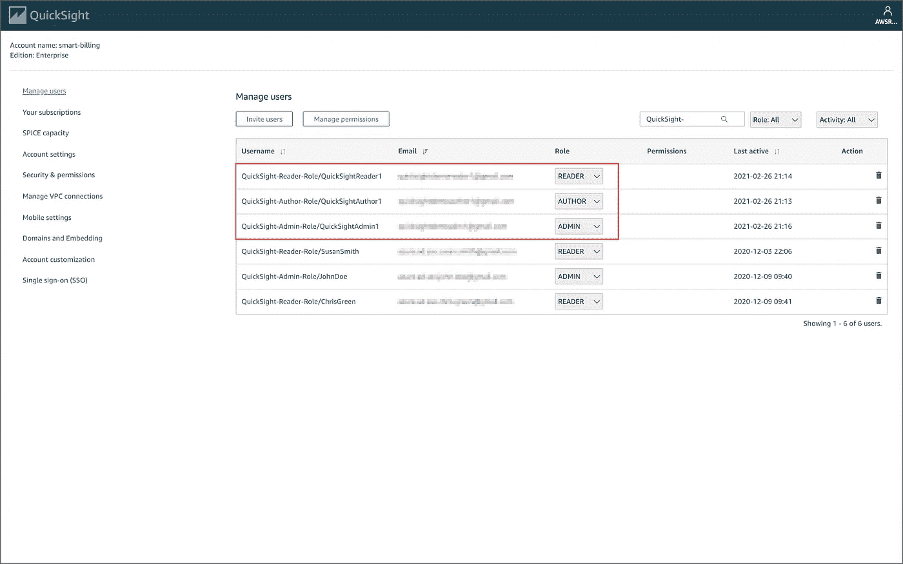*

*用户可以使用**管理权限**选项应用自定义权限。*

*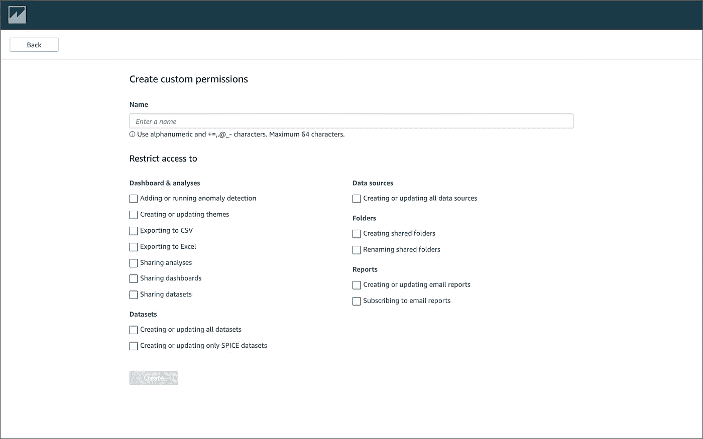*

# *结论*

*在这篇文章中，我们了解了 Amazon QuickSight 如何支持身份联合。我们学习了如何使用第三方企业身份提供商(IdP)auth 0 管理用户，以及如何使用 AWS 身份和访问管理(IAM)在用户登录 Amazon QuickSight 时对其进行身份验证。*

# *参考*

*   *AWS 文档:[从 Amazon QuickSight 启动登录](https://docs.aws.amazon.com/quicksight/latest/user/federated-identities-sp-to-idp.html)*
*   *AWS 文档:[教程:使用 Okta SSO 访问 Amazon quick sight](https://docs.aws.amazon.com/quicksight/latest/user/tutorial-okta-quicksight.html)*
*   *AWS 博客:[使用 Azure AD 启用 Amazon QuickSight 联盟](https://aws.amazon.com/blogs/big-data/enabling-amazon-quicksight-federation-with-azure-ad/)*
*   *AWS 博客:[联合 Amazon QuickSight access 和 Okta](https://aws.amazon.com/blogs/big-data/federate-amazon-quicksight-access-with-okta/)*

*本博客代表我自己的观点，不代表我的雇主亚马逊网络服务公司的观点。所有产品名称、徽标和品牌都是其各自所有者的财产。*