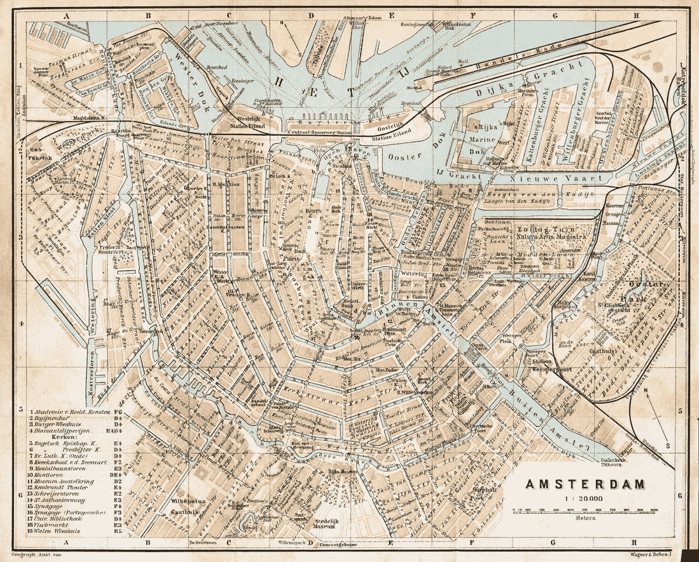

# Google Geocoder API 的替代品(在 Node.js 中)

> 原文：<https://itnext.io/an-alternative-to-google-geocoder-api-in-node-js-78728c7b9faa?source=collection_archive---------3----------------------->

阿姆斯特丹的旧地图。很美，不是吗？

昨天，我开始在 Node.js 中编写一些 web scrapers，为我的一个个人项目收集一些数据(等等)。

我必须处理的事情之一是如何将地址转换成地理位置(基本上是纬度和经度)。)

所以我开始做我们作为 Javascript 开发人员最擅长的事情:

> 嗯……那肯定有一个包装。

当然，还有:[https://www.npmjs.com/package/node-geocoder](https://www.npmjs.com/package/node-geocoder)

它的用法非常简单:

但是，由于我们使用谷歌作为提供商，当然，这些都不是免费的😅

我做了很多测试，我会触发几千个请求，因为我基本上是在网上搜集很多资源，并验证这些结果。

谷歌的地理编码器标志

[谷歌对其地理编码 API](https://developers.google.com/maps/documentation/geocoding/usage-and-billing) 上的每 1000 个请求收取 5 美元。

所以我开始寻找替代品，我发现了 OpenStreetMaps 提供的这个很好的应用程序，叫做[提名](https://nominatim.openstreetmap.org/)。 *(* [*)更多信息，点击这里*](https://wiki.openstreetmap.org/wiki/Nominatim) *)*

它实际上工作得非常好，非常快，所以我开始四处寻找他们的 API，我发现了这个关于如何使用搜索端点的非常好的文档(这几乎是我唯一需要的东西)。

所以我开始调整，想出了这个非常小的脚本，它实际上做的正是我想要的，而且它非常简单！

当我在节点服务器上运行它时，`node-fetch`是我触发 HTTP 调用的默认方式。如果你在浏览器上运行它，只要确保使用本地的`fetch`方法。(或者其他你喜欢的东西)

这个小模块非常简单，可以用任何语言轻松实现。

当然，有一些限制。这个 API 是公开的，但主要是为了支持开放的街道地图，所以请确保遵循他们的使用策略。

还有一个小亮点:

模块`node-geocoder`也提供了对命名 API 的支持。

我只是选择了自己的实现，因为这正是我所需要的一切。

因此还有另外一个教训:有时你可能不完全需要一个模块，即使它提供了你想要的。

> 你想要一根香蕉，但你得到的是一只大猩猩拿着香蕉和整个丛林。

如果你喜欢这个，请确保留下一些掌声(你可以不止一次鼓掌，真的！)

如果你想了解更多，也可以随时在 [Github](https://github.com/armand1m) 或 [Twitter](https://twitter.com/armand1m) 上联系我。

祝你今天愉快，干杯！