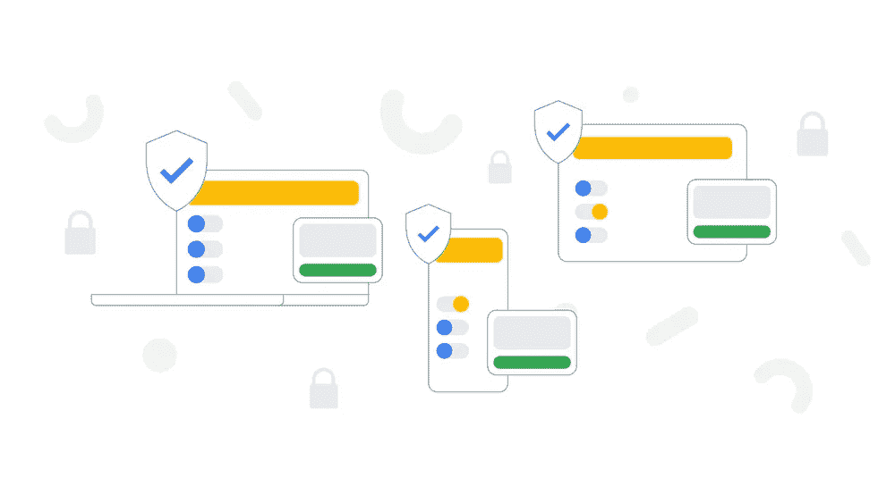

# Android AdMob 同意 UMP—EEA 中的个性化或非个性化广告

> 原文：<https://itnext.io/android-admob-consent-with-ump-personalized-or-non-personalized-ads-in-eea-3592e192ec90?source=collection_archive---------0----------------------->

很可能，如果你即将在 Google Play 上发布一款新的应用，有一个全球目标，并有集成广告，你肯定已经尝试过为欧洲经济区(EEA)的用户实施 GDPR 协议。

使用旧的 [**同意库**](https://developers.google.com/admob/android/eu-consent) ，这曾经是一个非常简单的步骤，因为用户可以选择是否同意个性化广告、非个性化广告，甚至选择为根本不看广告付费。

不幸的是，在实施指南的正上方出现了一个红色的框，传达了对这个库的反对意见，支持新的 [**用户消息平台**](https://developers.google.com/admob/ump/android/quick-start) **(UMP)** ，它符合 IAB 标准(**更新于 2022 年 2 月 28 日**)。

实施指南非常简单，但我相信，一旦您实施了该库并测试了几分钟，您会惊讶地发现**如果同意被拒绝，或者如果在同意管理阶段没有检查某些值，广告将不会被加载**。

为什么会这样？我仔细检查了帮助页面——可能我忘记了几个步骤——我对自己说，直到我读到了 **ConsentStatus。获得了更好的**字段。事实上，在它旁边写着**获得了同意，但是没有定义个性化**。

这是关键点:这是由我们的开发者来检查用户是否已经授予 [**最低要求**](https://support.google.com/admob/answer/9760862?ref_topic=10303737) 以能够查看广告，以及他是否已经选择查看个性化或非个性化的广告。

**当满足以下所有标准时，谷歌将投放广告:**

—最终用户同意谷歌:

*   在设备上存储和/或访问信息(**目的 1** )
*   创建个性化广告档案(**目的 3** )**
*   选择个性化广告(**目的 4** )**

—为 Google 建立合法利益(或同意，当出版商配置其 CMP 请求时),以:

*   选择基本广告(**目的 2** )
*   衡量广告绩效(**目的 7** )
*   运用市场研究来获得受众洞察(**目的 9** )
*   开发和改进产品(**目的 10** )

—同意供应商列表中的**谷歌广告产品**

** *个性化广告所需*

UMP 库在本地保存用户在同意对话框中给出的值(对于 Android in***shared preferences***)，因此我们可以验证它们，并了解用户是否同意查看个性化广告、非个性化广告或拒绝同意。

检查发布者是否可以首先显示广告( **Java** )

如果为假(GDPR 适用，所以如果在欧洲经济区)，你应该提示用户或接受所有，或详细解释(检查以上)检查什么，以显示至少非个性化的广告，或要求用户选择高级版本的应用程序，否则你将一无所获。

如果为真，您可以使用以下方法( **Java** )检查用户是否被授予了显示个性化广告的最低要求

最后，您知道您是否可以请求 AdMob 个性化或非个性化广告，如果**非个性化**您必须使用这个片段( **Java** )转发请求

下面所有的帮助器方法为`canShowAds()` 和`canShowPersonalizedAds()`

如果你需要 Kotlin 中的代码，这里有我用 Java 移植的方法的原作者( [Tyler V](https://stackoverflow.com/users/9473786/tyler-v) )的[链接](https://stackoverflow.com/questions/65351543/how-to-implement-ump-sdk-correctly-for-eu-consent)。

希望有帮助，别忘了鼓掌和同事们分享！