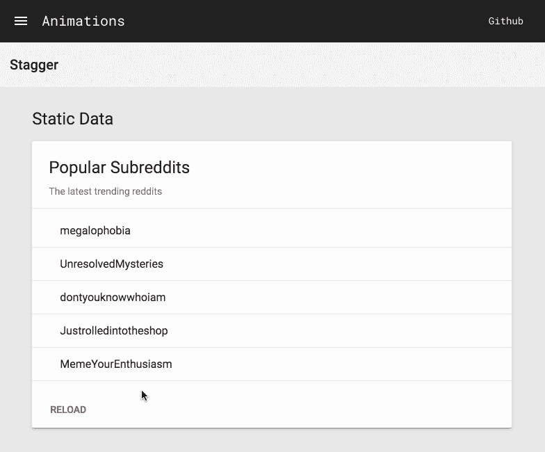

# 角度动画-在静态和异步数据上交错

> 原文：<https://itnext.io/angular-animations-stagger-over-static-and-async-data-3907c4889479?source=collection_archive---------0----------------------->

## [检查动作中的错开](https://philgetz.github.io/try-angular-animations/#/stagger)

[*点击这里在 LinkedIn*](https://www.linkedin.com/cws/share?url=https%3A%2F%2Fitnext.io%2Fangular-animations-stagger-over-static-and-async-data-3907c4889479) 上分享这篇文章

交错动画在表达数据和用户界面的状态方面非常棒，尤其是在列表和网格上。它很容易实现，可以用于静态和异步数据。我将介绍如何设置一个规则的交错动画，然后使用有角度的内置异步管道让它与 observables 一起工作。

## 交错的状态和使用

交错是角度动画的一个实验性特征。当有多个迭代项时，如列表或网格等，它提供了延迟动画的能力。当数据传入应用程序时，它创建了一个良好的用户交互，并且当前正在发展，因此本教程可能会随着时间的推移而改变。

# 角度动画的基础

包括交错在内的角度动画在组件装饰器中配置(或在一个单独的文件中配置，以具有可重复使用的动画)，并在组件模板上与“@”符号一起使用。

对于 stagger，大约有 3 个部分可以让它运行起来(可能更多，这取决于具体情况)。

1.  在组件装饰器中声明动画
2.  将带有“@”的动画添加到组件模板的父元素中
3.  使用给定的数据集制作动画

# 我们走吧

## 首先，不要忘记进口

这些是你将需要的进口货。

角度动画为交错动画导入

## 设置动画

这个动画从上到下以 15px 淡入淡出。查看一个工作演示。出于本教程的目的，我不会深入这个动画的各个方面。如果你想知道更多关于正在发生的事情，我会在另一篇博客上发表。

动画被输入到[组件装饰器](https://angular.io/api/core/Component)中，并且可以在任何地方，只要它在装饰器的边界内。

## 在模板上设置动画

交错动画应用于呈现数据的父元素。

我们在动画声明(@ symbol)上绑定一个参数，让它知道有多少元素要应用动画。

## 需要考虑的事项

根据数据传递到模板的方式，可能会有不同的实现。在这种情况下，假设这要么是静态数据，要么是从生命周期钩子(如 NgOnInit)内的组件类订阅的数据。

如果你只需要错开动画工作在刚刚描述的方法，那么就是这样！如果你已经按照教程到了这一步，你应该可以开始了。

# 与异步管道交错

在本节的范围内，我假设您对数据绑定和 RxJS 有所了解，因为我们使用的是异步管道。

如果你对 stagger 很着迷，并且想使用淘气的异步管道，你也可以这样做！

## 一个小细节

我们在使用异步管道时面临的一个问题是传递“item.length”参数。在下面的代码片段中，我们需要传递这个参数，但是它是未定义的，因为“items”是通过下面的异步管道订阅的。

不要担心！这里有一些方法可以防止未定义的错误，但仍然使用异步管道。

## 异步管道和数据绑定

第一个解决方案是利用 RxJS 操作符，比如 map。

在 RxJS 操作符中，我们将数据的长度赋给一个变量。然后，我们继续将这个变量绑定到模板上的动画属性。

## 异步管道和天然气容器

更好的方法是在 ng-container 上使用异步管道订阅一个可观察对象，然后向下传递数据。

Ng-container 是 Angular 中的一个结构指令，它不在 DOM 树中呈现。换句话说，它允许我们操作模板而不留下任何痕迹。如果你以前没有看过 [ng-container](https://angular.io/guide/structural-directives#ngcontainer) ，看看 [Angular docs](https://angular.io/guide/structural-directives#ngcontainer) 吧，因为它比以前更好地记录了。

这就是我们的 ng-container 代码的样子:

通过这种方法，我们可以直接在模板上绑定“item.length”属性，而不需要在组件上创建额外的变量。由于 ng-container，我们可以生活在异步管道订阅中，因此我们的值不会不确定。

从组件的角度来看，现在简单多了，因为我们现在需要的只是一个可观察的返回，仅此而已。

这种方法的另一个好处是我们可以减少异步管道的使用。建议这样做，以避免每次在模板中声明异步管道时重新订阅。

# 结论

交错动画对任何用户界面来说都是不错的选择，如果做得好，肯定会受到任何用户的欢迎。我希望本教程有助于说明如何使用静态和异步数据来利用交错动画。

如果你走到这一步，我想感谢你！我相信你会用你的动画和用户界面为用户提供更好的网络体验。

## 寻找投稿人！我正在开始一个基于角度动画及其使用的[项目。无论是通过想法、设计、开发、迷因、笑话，我想和你合作，让它变得很棒。](https://philgetz.github.io/try-angular-animations/#/)