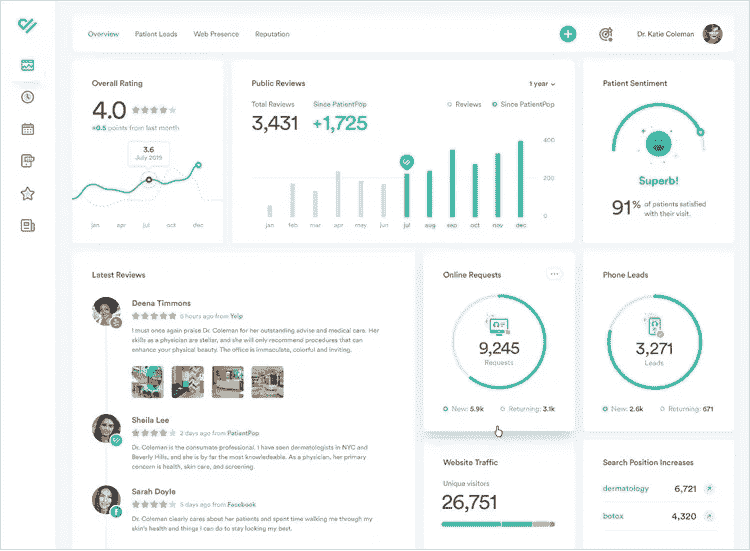

# 角形组件入口

> 原文：<https://itnext.io/angular-component-portals-28ddd860c22c?source=collection_archive---------2----------------------->


围绕 Angular Ivy 有很多谈论和宣传，它被誉为 Angular 生态系统未来许多事情的救星，这包括能够在运行时使用 import 语法惰性地加载单个组件，而不需要 NgModule 本身。

```
this.foo = await import(`./foo.component`)
 .then(({ FooComponent }) => FooComponent);
```

[Netanel Basal](https://medium.com/u/b889ae02aa26?source=post_page-----28ddd860c22c--------------------------------) 写了一篇关于这个主题的精彩文章，涵盖了延迟加载单个组件的所有细节以及如何使用它们(见下面的链接)。

> 我们到底为什么想要这个？有什么大惊小怪的？

如果拿一个典型的管理应用程序的仪表板来说。有许多不同的方面，主要是向用户显示分析数据，并且这些面板中的每一个都可以是来自各种模块的组件，但是如何按需加载这些组件，或者甚至如何由最终用户自己定制和动态加载面板。



对于这些类型的场景，通过角度路由加载仪表板是不可能的，因为仪表板将位于一条单独的路径上，这条路径被标记为 */home* 或 */dashboard* 。

> 但是，如果您可以延迟加载一个 NgModule 并实例化该模块中的任何组件，而不直接引用组件类型，会怎么样呢？

## 组件门户简介

组件门户提供了通过使用字符串标识符实例化任何组件的能力，并且组件被神奇地实例化了。也许没有魔法，但你明白我的意思。

这种模式几乎可以轻松地应用到任何现有的应用程序中。

组件门户的部分灵感来自于 [Wes](https://medium.com/u/9af1d23366c8?source=post_page-----28ddd860c22c--------------------------------) Grimes(见下面的链接),我花了一些时间将它作为公共 npm 包发布，最棒的是它甚至不需要 Angular Ivy，当前的视图引擎工作得非常好。

## 我们开始吧

首先，我们需要安装组件门户库，它负责组件注册的所有繁重工作。使用以下命令安装库:

```
npm install @codethatstack/portals
```

安装后，将`CtsPortalsModule`导入应用程序根 NgModule:

## 注册组件

像通常使用 NgModule 一样创建和注册任何组件:

下一步是向 ComponentRegistry 注册组件:

这一步很重要，这是将组件类型和 NgModule 绑定到字符串组件标识符的神奇胶水。这只注册了具体的组件类型，现在我们需要在根 NgModule 中将它缝合在一起。

## 注册门户模块

为每个将被延迟加载的 NgModule 定义一个模块标识符(moduleId)。这与延迟加载子路由使用相同的语法。

接下来使用注入令牌`PORTAL_MODULE_TOKEN`注册`PortalModules`。

## 注册门户组件

使用上面定义的字符串标识符定义每个组件，将它链接到上面的模块标识符。

通过分离出模块加载定义，这避免了为同一个 NgModule 注册多个组件时的重复。

接下来是使用注入令牌`PORTAL_COMPONENTS_TOKEN`注册`PortalComponents`。

哇，那是很多管道工程。

## 准备，就位，开始

要在应用程序中的任何地方实例化一个组件，使用指令`ctsComponentPortal`，指定组件的字符串标识符名称。

**就是这样！**模块将被加载，组件将在当前 ViewContainer 中实例化。

如果需要，您甚至可以挂钩到*激活的*和*去激活的*事件来处理任何额外的逻辑。

# 奖金

最近，Nir Kaufman 向我介绍了心灵传输的概念。这个概念非常简单。在您的应用程序中注册一个插座，然后将一个模板附加到该插座，但是对于组件门户，它将是一个组件。

在应用程序中的某个位置注册门户网站，并提供一个唯一的名称。

然后使用属性`ctsComponentPortalAttachTo`来指定组件将连接到哪个插座。

# 概括起来

通过一点魔法，一个组件可以在任何地方被实例化，只需要一个字符串标识符。

点击查看演示[。](https://codethatstack.github.io/platform/)

[](https://github.com/codethatstack/platform/blob/master/libs/portals/README.md) [## 代码堆栈/平台

### 组件门户提供了延迟加载一个 NgModule 和实例化包含在任何…

github.com](https://github.com/codethatstack/platform/blob/master/libs/portals/README.md) 

## 额外资源

[](https://netbasal.com/welcome-to-the-ivy-league-lazy-loading-components-in-angular-v9-e76f0ee2854a) [## 欢迎来到常春藤联盟:Angular v9 中的延迟加载组件

### 用 Ivy 延迟加载组件

netbasal.com](https://netbasal.com/welcome-to-the-ivy-league-lazy-loading-components-in-angular-v9-e76f0ee2854a) [](https://netbasal.com/dynamically-creating-components-with-angular-a7346f4a982d) [## 使用角度动态创建组件

### 在本文中，我们将学习如何在 Angular 中动态创建组件。

netbasal.com](https://netbasal.com/dynamically-creating-components-with-angular-a7346f4a982d) [](https://medium.com/angular-in-depth/building-an-aot-friendly-dynamic-content-outlet-in-angular-59c1a96171a) [## 在 Angular 建立一个 AOT 友好的动态内容出口

### 构建一个具有动态组件出口的特殊模块

medium.com](https://medium.com/angular-in-depth/building-an-aot-friendly-dynamic-content-outlet-in-angular-59c1a96171a) [](https://github.com/nirkaufman/teleport) [## 尼尔考夫曼/传送

### 此项目是使用 Angular CLI 版本 9.0.6 生成的。为开发服务器运行 ng serve。导航到…

github.com](https://github.com/nirkaufman/teleport)