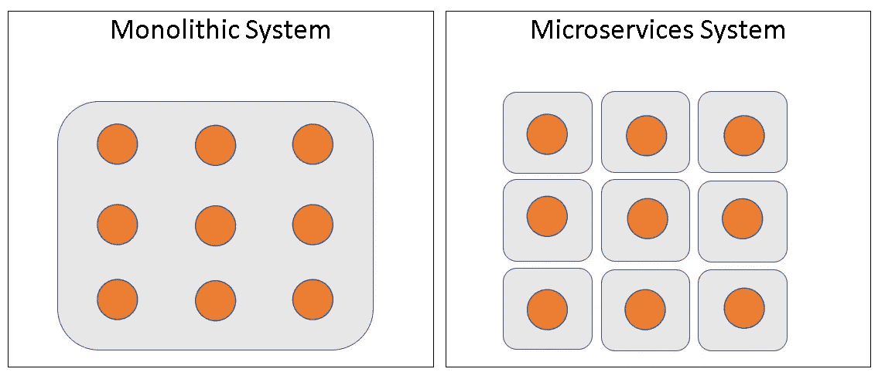
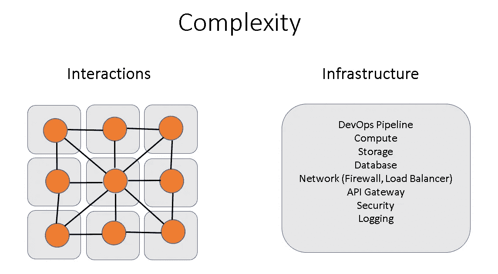
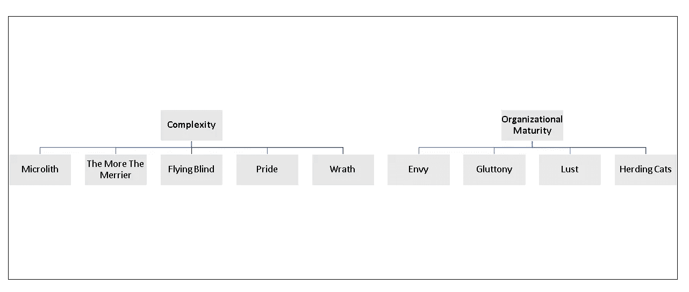

# 微服务的反模式

> 原文：<https://itnext.io/anti-patterns-of-microservices-6e802553bd46?source=collection_archive---------0----------------------->

微服务代表了分而治之的最新架构发展:将系统分解成独立的可部署服务单元，这样每个服务都有一个基于特定业务**领域**的**有界上下文**。由于亚马逊、谷歌、网飞、微软、易贝、优步和其他公司使用这种方法构建大型云规模系统的成功，微服务已经成为 IT 解决方案架构师和软件工程师的一种流行模式。这篇文章将解释使用微服务设计软件的一些历史，深入反模式解释事情为什么以及如何出错，然后讨论何时何地微服务是一个很好的选择。

# **历史:从 Mud 到微服务**

自从计算机在学术界和军队中诞生，然后成熟成为主流商业以来，单片软件系统是几十年来软件主要构建方式的共同结果。Monoliths 很难在技术上和组织上进行扩展，因为它是一个代码库、一个共享数据库、有时是一个应用程序进程、通常是一个部署单元，并且经常是一个团队。像共享库或领域模型这样的一个整体的一个小的变化可能波及到其他部分，因此需要整个系统的协调变化。如果整个 monolith 运行后台作业，或者由于在运行时加载的库而导致启动/停止时间很长，那么它的重新部署可能需要几个小时。新员工入职也很麻烦，因为消化庞大的单一代码库令人望而生畏，而且它的规模经常会使 IDE 不堪重负。此外，扩展系统通常意味着通过增加应用程序和数据库层的计算和存储硬件资源进行垂直扩展；可以水平扩展，但通常会以更高的单位 CPU 周期成本、消耗的内存字节和利用的磁盘存储为代价，因为并非所有系统组件都需要统一的资源。独石的所有这些特征导致技术变革的速度更慢、成本更高，这使得企业在一个重视创新的竞争性生态系统中面临风险。巨石的比喻是大泥球。不幸的是，诽谤仍然经常发生。

改进软件架构和设计的一些最早的原则是封装、信息隐藏、模块化和关注点分离。这些概念可以追溯到 20 世纪 60 年代末和 70 年代初，它们至今仍然存在。由于 Smalltalk、C++和 Java，面向对象语言越来越受欢迎，设计模式在 20 世纪 90 年代初出现，用于设计基于这些原始原则的可维护的面向对象软件系统。然后，基于应用中间件(如 BEA WebLogic、IBM WebSphere、Red Hat JBoss、Microsoft BizTalk 和 Tibco Rendezvous)、远程过程调用协议(如 SOAP、CORBA 和 DCOM)和面向消息的中间件，出现了 20 世纪 90 年代中期的面向服务的体系结构(SOA)运动。虽然 SOA 朝着正确的方向迈出了一步，但它过于关注中间件，一些协议(如 SOAP 和 CORBA)过于沉重和缓慢，而且服务通常仍然是相互耦合的。

在 2000 年，通过结合云计算、T2、Docker 以及对敏捷和 T4 开发运维的重新重视，微服务变得越来越可能。这些技术和流程支持架构的微服务方法。微服务*应该*是**独立的**服务，每个服务都在**有界上下文域**内，它们被*假定*做好一件事。每个服务都必须通过同步方法(例如 RESTful web)或异步方法(例如 RabbitMQ、亚马逊 SQS、Azure ServiceFabric 队列)与其他服务进行交互。可以使用最适合用例及组织的多语言技术(如语言、计算、存储、数据库)来构建服务。微服务确实有一些超越单片的理论优势，包括灵活性、部署、创新、模块化、可伸缩性和可测试性。不是将系统分解成**水平层**，而是将架构切割成**与更窄的领域和用例集相关的垂直切片**。通常不超过两个比萨饼大小的较小团队(例如，6-8 人)拥有该垂直部分，被授权独立工作，并使用构建、测试、部署和基础设施自动化来进一步缩短周期时间和提高发布可靠性；因此，组织可以从更高的总吞吐量中获益。由于每个分散的服务都可以针对其领域进行优化，因此服务可以在水平和垂直方向上进行性能扩展，并且它允许**创新**在团队之间和联邦系统内蓬勃发展。

像大多数技术架构决策一样，微服务也有需要考虑的挑战、权衡和成本。复杂性**和组织成熟度**的严峻微服务挑战**就像构造力一样浮出水面，它们不应该被低估。**

**这里的复杂性**是指需要存储、计算和传输的内在**信息**；此外，它包括端到端完成系统工作所需的组件的**交互**，以及支持这些组件所需的底层**基础设施**。虽然在采用微服务时，固有的业务信息会保留下来，不会从根本上改变，但是组件交互和基础设施元素在这种方法中会显著扩展。更多的分布式组件自然需要更多的远程过程调用、更多的编排和更多的工作流；此外，当出现问题时，还意味着需要更多的时间和工具来进行调试、跟踪和故障排除，因为事件的因果链分布在多个服务、数据存储和所有者中。初始基础设施成本也很高。考虑到每个微服务现在必须有自己的 DevOps 管道，以及用于其计算、网络、存储和数据库资源的托管设施。现在，假设需要集群、负载平衡和其他基础设施服务来进行水平扩展，人们很快意识到微服务方法只能在资源虚拟化和可编程的云中工作。尽管一些研究表明，从长远来看，基础设施总成本确实会下降，但这不会是一个容易的胜利，初始经济支出和时间应切实纳入预算和时间表。有一个经常被引用的关于保持简单的工程谚语，然而，微服务似乎颠倒了这个明智的建议，使事情变得更加复杂，特别是从基础设施和组件交互的角度来看。

微服务的基本复杂性产生了几种反模式。一个是*，其中一切都依赖于其他一切。就像单片系统中的意大利面条代码一样，微服务解决方案可以设计得很差，并受到扭曲的股和电子面筋的饺子的困扰；随着微服务数量 N 的增加，它们的组件交互可能会超线性增加，除非仔细管理依赖性并保留每个服务的有界上下文。一个相关的反模式是 ***越多越好*** 。对系统和功能分解缺乏经验会导致太多闲聊式的服务和服务蔓延；在某种程度上，当基础设施、操作和故障排除成本超过解耦和模块化的好处时，分解的回报会递减；还要注意，随着 RPC 链长度的增加，延迟会增加，性能会降低。要问的关键启发式问题是服务 A 和 B 是否与同一个有界上下文 C(空间)相关，服务 A 和 B 是否应该共同进化(时间)，以及这些服务是否应该一起部署(DevOps)。另一个与复杂性相关的反模式是 ***盲目地*** 部署微服务而没有足够的日志记录和监控。由于软件的不可见性，它已经有些神秘莫测了；微服务必须具备应用组件和基础设施资源的日志聚合和可视化；AWS(如 Cloud Watch、X-Ray)和 Azure(如 Monitor、Application Insights)等云服务提供商可以满足这一需求。最后一个与复杂性相关的模式是 ***分布式服务的骄傲和愤怒*** ，在这种模式中，由于过度自信和缺乏谦逊，服务没有经过充分的失败测试(骄傲)，然后当依赖关系不再可用时，服务就会惊人地爆炸(愤怒)。编程已经够难了，也不是无足轻重的；人们需要意识到分布式计算的谬误，这些谬误使得分布式编程更加困难。服务组件应该为不安全和不可靠的网络、非零延迟、有限带宽、多个管理员和异构拓扑做好准备。应该使用最佳实践为故障设计服务，例如超时重试和指数补偿、断路器和隔板；看看迈克尔·尼加德的精彩**发布吧！**了解更多想法和细节。*

**

*组织成熟度是支持微服务架构的另一个主要方面。开发团队需要重组，对全栈、开发运维承担更多责任，而不仅仅是向基础架构团队提交单程票。此外，微服务必须实现构建、测试和部署的自动化，以便在保持系统质量的同时缩短周期。同样，基础架构团队需要设置沙盒环境，以便开发人员可以安全地在生产环境之外进行试验，培训开发人员管理基础架构，并为整个组织的云资源中的日志、安全性和计费配置文件构建新的监控功能。最后，架构团队需要在托管、基于用例评估新技术选择以及审核微服务设计方面为开发微服务设定标准。这些工程最佳实践适用于单片电路，也很重要，但由于其复杂性，它们对微服务更为重要。*

*功能失调和不成熟的组织会产生一些反模式。一组反模式是**嫉妒*，欲望，和对闪亮玩具*的贪吃**。想象一下，一个开发人员可能阅读或听说了一些新技术 X，嫉妒其他人使用 X(嫉妒)，爱上 X(欲望)，感染 FOMO 病，然后继续在组织中寻找钉子，用他们的新锤子像 Thor(暴食)一样碾碎。这让你想起你认识的人了吗？如果没有架构团队的适当治理和协调，开发人员可能会很快超出他们独立的微服务的公认技术规范，并在其中引入有问题的细节和依赖性，这些细节和依赖性会反过来损害系统和未来参与维护的工程师。仅在一个组织中，我就目睹了几起滥用微服务的事件。在一个系统中，在一个规模适中的系统上有几十个基于 Docker 容器的服务，这在理论上是可以的；然而，这些服务不是针对有界上下文的垂直切片，而是聊天式的、耦合的和分层的，这创建了依赖链，这放大了涟漪效应，增加了延迟并极大地复杂化了调试。在另一个数据库记录少于一百万的系统上，开发人员选择了三个不同的持久存储(例如 MongoDB、PostGreSQL 和 elastic cache)；页面加载延迟很慢，有时大约为 5-7 秒，很难协调数据库备份和恢复操作，而且培训新开发人员来维护系统是一件非常痛苦的事情。*套用一句美国谚语，这是关于商业，而不是技术。*微服务不是最终目标，而是系统代表客户实现的业务成果。架构师应该选择一个同步协议(例如 HTTP、protobuf)、一个异步消息协议(例如 AMQP、SNS)和一些常见用例的持久性存储。另一个与组织变革相关的反模式是 ***羊群猫*** 。由于服务是由分散的、独立的团队开发的，因此存在协调性降低的风险，当系统工作流必须端到端地进行编排时，这是一个问题。架构师和技术项目经理也必须参与整个微服务生命周期，需要对服务设计和实现进行治理，并且应该确保服务依赖关系和 API 集成得到协调，以实现组织的长期利益。*

**

*微服务的反模式*

*软件架构是关于平衡业务领域、可用技术和组织在时间、金钱、过程和人员方面的机会和权衡，然后将所有这些约束分解成一个解决方案，该解决方案可以随着时间的推移以里程碑和片断的形式交付。在开始微服务之旅之前，软件工程团队应该按照鲍伯·马丁、Gerald Weinberg、Joel Spolsky、Andy Hunt、Kent Beck、Martin Fowler 和其他人推荐的经过时间考验的标准获得基础知识和[基础知识](https://www.joelonsoftware.com/2000/08/09/the-joel-test-12-steps-to-better-code/):雇佣优秀的工程师，给他们安静的工作环境，使用版本控制，记录直接客户的需求，拥有系统的愿景和路线图，审计系统和组件设计，编写经过同行评审和测试的干净代码，自动化系统构建和部署，以及观察某种形式的敏捷和 Scrum。一旦您的工程团队遵循这些实践并驯服了 monolithic beast 的主干和尾部，然后考虑将重要的组件提取到协同定位的服务中，用 monolithic 的其他部分试用这些服务，确认您拥有正确的功能集和粒度，然后(*并且只有到那时才*)将服务分离到不同的主机中(使用逻辑 DNS 而不是物理 IP 来允许更抽象的负载平衡 ala Route 53)，将其数据迁移到单独的持久存储中，并通过主题和队列将任何异步工作解耦，以定义真正有界的上下文。一个常见的错误是把所有事情都提前做好，但是这会产生风险，花费更长的时间，并且违背了敏捷原则，即根据优先级和价值在迭代中完成必要的工作。这些想法的最佳表述来自 Thought Works 的 Martin Fowler，他创造了“微服务溢价”这一说法，其中微服务可能有一些好处，但必须以运营复杂性和组织复杂性为代价。*

**喜欢文章吗？关注我* [*中*](https://medium.com/@bishr_tabbaa) *和* [*推特*](https://twitter.com/bishr_tabbaa) *了解更多更新。**

***参考文献***

*   *[https://medium . com/@ bishr _ tab baa/anti-patterns-of-we b-APIs-33d2a 28534 F2](https://medium.com/@bishr_tabbaa/anti-patterns-of-web-apis-33d2a28534f2)*
*   *[https://martinfowler.com/microservices/](https://martinfowler.com/microservices/)*
*   *[https://micro services . io/micro services/general/2019/01/29/more-anti-patterns . html](https://microservices.io/microservices/general/2019/01/29/more-anti-patterns.html)*
*   *[https://www . oreilly . com/ideas/micro services-anti patterns-and-陷阱](https://www.oreilly.com/ideas/microservices-antipatterns-and-pitfalls)*
*   *[http://high scalability . com/blog/2015/8/3/seven-of-the-nasties-anti-patterns-in-micro services . html](http://highscalability.com/blog/2015/8/3/seven-of-the-nastiest-anti-patterns-in-microservices.html)*
*   *[https://sdtimes.com/micro/microservices-anti-patterns/](https://sdtimes.com/micro/microservices-anti-patterns/)*
*   *[https://theburningmonk . com/2015/05/craft conf 15-从微服务中获取-反模式/](https://theburningmonk.com/2015/05/craftconf15-takeaways-from-microservice-antipatterns/)*
*   *[https://container-solutions . com/the-seven-deadly-sins-of-micro services-redux/](https://container-solutions.com/the-seven-deadly-sins-of-microservices-redux/)*
*   *[https://thenewstack . io/microservice-pricing-what-it-all-to-cost/](https://thenewstack.io/microservices-pricing-whats-it-all-going-to-cost/)*
*   *[https://adamdrake.com/enough-with-the-microservices.html](https://adamdrake.com/enough-with-the-microservices.html)*