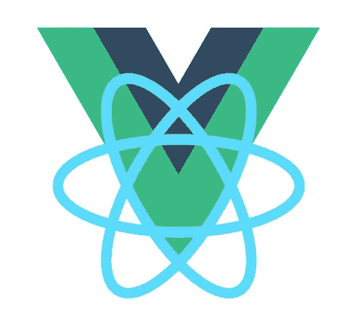

# 无论如何，这就是为什么我更喜欢 Vue 而不是 React

> 原文：<https://itnext.io/anyway-this-is-why-i-prefer-vue-over-react-ad2653595fc5?source=collection_archive---------1----------------------->

***停！*** 等一下再在评论里尖叫，大吼，侮辱我哈哈。

“又一篇比较框架/库的文章”——是的，**处理它**。

在我开始之前，要明白，这只是我更喜欢的和**而不是最好的**。
**这是一个反馈**但是，在**为什么**这个问题上，我将实事求是，而不是感情用事。

***如果你想要“长话短说”——跳到下一个粗体标题***

首先，Vue 的创造者尤雨溪最初是一名设计师(如果我没记错的话)，他为 web 开发了 Vue，包括它所隐含的一切:标记(HTML + CSS)。

另一方面，React 是为解决一家公司(脸书)的架构问题而创建的。因此，对我来说，它感觉更面向软件，而不是面向 web，这就是我不喜欢它的原因，因为，web UI 首先是:HTML + CSS。

不要误解我的意思，Vue 也解决了很多架构问题，但是我们稍后会谈到这一点。

我会把我喜欢的分成 4 类:**语法**、 **API** 、**工具、学习**。

# 句法

如前所述，Vue 是为 web 构建的 UI 库，因此语法非常简单。

## 模板

*   Vue:让你在渲染函数中使用 **HTML** 或 **JSX** 或 **createElement**
*   React:让你只使用**JSX**和 **React.createElement** 方法

网页设计师**了解 HTML & CSS** ，他们**几乎不能**搞砸一个 Vue HTML 模板，但是他们**可以很容易**搞砸一个 JSX 模板(循环、三元……)。

Vue 给了你**选择**，React 没有，这对一个**前端**库来说是悲哀的。

## 循环和条件

*   Vue:使用**特殊属性**(指令)**v-用于**和**v-如果**，**易于阅读**，正如我上面所说的，当改变标记时更难出错。
    [https://vuejs.org/v2/guide/list.html](https://vuejs.org/v2/guide/list.html)
    https://vuejs.org/v2/guide/conditional.html
*   反应过来:**阵图**和**三元**左右 **JSX** ，**难读**浅见
    [https://reactjs.org/docs/lists-and-keys.html](https://reactjs.org/docs/lists-and-keys.html)
    [https://reactjs.org/docs/conditional-rendering.html](https://reactjs.org/docs/conditional-rendering.html)

## 用标记插入现有项目

*   Vue:有一个**模板编译器**，可以像 jQuery 一样插入到现有的 DOM 中
*   React:只有一个**呈现方法**，不能插入到现有的非空 DOM

# 应用程序接口

现在让我们来谈谈这两个库的 API。
我发现 Vue 的 API 开箱即用更好，使用起来也更省时。另外，Vue **不会强迫你**用一种方式做事，它会给你**选择权**。

## 处理表单

*   Vue:有 **v-model** 到**自动**绑定**数据到输入**和**反之亦然**
*   反应过来:有 [**受控组件**](https://reactjs.org/docs/forms.html#controlled-components) ，基本上，我见鬼了

当我使用一个库/框架时，**我想避免重复的任务**，受控组件是重复的，因为你需要:添加一个监听器到你的元素，处理它的值，传递它的状态，注入它回到元素…

我懒哈哈，我不喜欢那样。反正如果**你喜欢控制**，Vue 也可以这么做，但是它给你选择**加速开发**用 **v 型**。

一切都是生产力的问题，但我不是说“**魔法**”总是好的选择。

## 组件道具

*   Vue:您可以定义和验证现成的道具
*   React:你需要一个外部库来实现，我不明白为什么，因为组件道具经常被使用(也许是为了提供选择？)

## 更新状态

*   Vue:设置一个**反应数据**，然后只需**更改它**，Vue **跟踪更改**，仅在必要时更新(如果数据已更改并在模板中使用)
*   React:你需要显式调用 **setState** 方法，没什么大不了的，但是……
    你需要**传递一个回调来使用以前的状态**和新的状态……
    组件将**重新呈现，即使状态数据没有改变** …

渲染对比(查看控制台渲染):
Vue—[【https://jsfiddle.net/darkylmnx/mq5f0txf/1/】](https://jsfiddle.net/darkylmnx/mq5f0txf/1/)
React—[**https://jsfiddle.net/darkylmnx/keupfgyr/1**](https://jsfiddle.net/darkylmnx/keupfgyr/1/)

正如您在控制台中看到的，即使状态没有改变，React 也会重新渲染(调用渲染函数和更新的钩子)。

## 过渡和动画

感谢(或者不感谢)设计师，现在网络上充斥着大多数好看网站上的动画和过渡。Vue **帮助你处理这个**开箱即用，与 React IMO(需要一个 lib)相比，这确实是一个**巨大的优势**。

[Vue 的过渡组件](https://vuejs.org/v2/guide/transitions.html)很容易使用**并且**很容易用 anime.js 之类的动画库来扩展**。它专注于为你提供钩子来插入你想要的东西或者使用 CSS 过渡和动画。**

## 开箱即用的组件通信

*   Vue:道具(+提升状态上升)**亲子**，事件**亲子**
*   React:道具(+提升状态 up) **亲子**

两者都可以使用集中的全局状态管理器，但是你需要一个第三方库。

同样，Vue 为**提升状态**混乱的场景提供了另一种选择。

## 贮藏

我不能做太多的比较，因为我没有像在 Vue 那样深入 React，但是 Vue 的缓存系统真的很棒，而且经过了优化。

*   **用于缓存数据的计算属性**
*   **v-once** 用于模板缓存(方便静态 HTML 组件)

## 需要时操作 DOM**(自定义指令)**

*   Vue: **自定义指令**和**引用**
*   反应:**参**就这样

有时你想操作 DOM 来处理与状态无关的事情，比如:给输入一个自动焦点。

Vue 的**自定义指令特性**非常方便，因为**你可以查看**那些 DOM 微操作，而不需要为此创建一个完整的组件。

可惜 React 没有对等的(自动对焦就是一个例子)
[**https://stack overflow . com/questions/28889826/React-set-focus-on-input-after-render**](https://stackoverflow.com/questions/28889826/react-set-focus-on-input-after-render)或
[**https://React js . org/docs/refs-and-the-DOM . html # adding-a-ref-to-a-DOM-element**](https://reactjs.org/docs/refs-and-the-dom.html#adding-a-ref-to-a-dom-element)

## 条件类属性绑定

*   Vue:传递一个**对象键**(作为类)和**值**(作为布尔值)来有条件地呈现 HTML 类。
    [https://vuejs.org/v2/guide/class-and-style.html](https://vuejs.org/v2/guide/class-and-style.html)
*   反应:手动处理(不难，但是费时)。
    虽然有一个 lib:[https://github.com/JedWatson/classnames](https://github.com/JedWatson/classnames)

# 工具作业

我在这里长话短说:

*   证监会:**单文件组件**，有史以来为网络做的最好的东西。
    CSS、JS & HTML 在单个文件中完成单个任务，不再需要切换文件。
*   CSS 作用域:**所有 CSS 特性**，但是**由组件**作用域

# 学问

Vue 学起来真的很快，我记得我在 2014 年去土耳其的飞机上学会了它，花了我 2 个小时完成课程。几个小时前，我在学习 React(两者都来自 laracasts.com)，我发现它很难理解，主要是因为 JSX 语法。

*   Vue:学习 API(指令是其中的一部分，最终，指令只是需要学习的新的 HTML 属性，而不是新的语言)
*   反应:学习 API，学习 JSX，这是一种新的“语言”(没什么大不了的)

JSX 和 Vue 指令都是 DSL，最终，它们只是语法糖。

# 结论

Vue 是为网络(动画)而设计的，这也是我喜欢它的原因。
React 一般是为 UI 而生的(多亏了虚拟 DOM)，它让在其他平台(移动、VR……)上使用变得很容易。

此后，Vue 增加了虚拟 DOM，有了像 **NativeScript、**这样的项目，它将有望为 web 之外的其他东西量身定制。

作为**前端 web** 开发者，我**更喜欢 Vue** 。
作为一个**跨平台**开发者，我会**选择 React** (目前)。

每个项目都需要不同的工具，在一天结束的时候，使用最适合你、你的项目、你的团队和环境(截止日期、预算……)的**。**

感谢阅读。

PS:我也相信**中国会统治世界**，所以我更喜欢遵循 Alibaba.com 备份的哈哈哈✌️🇨🇳
PS 2:如果你想学习如何创建高级组件，请查看我的课程:[https://courses . maisonfutari . com/mastering-vue-components-creating-a-ui-library-from scratch？优惠券=M](https://courses.maisonfutari.com/mastering-vue-components-creating-a-ui-library-from-scratch?coupon=PRESALE) EDIUM

**有 50%的折扣，因为你来自这个故事。**

