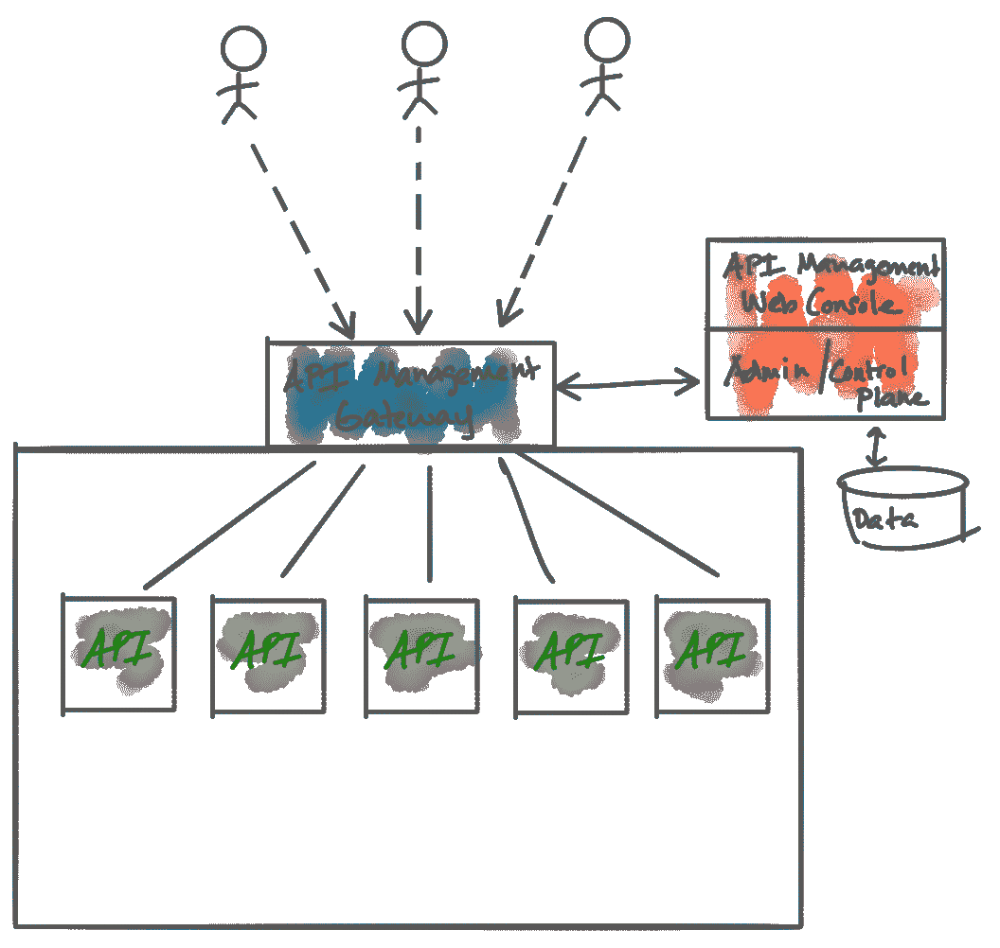
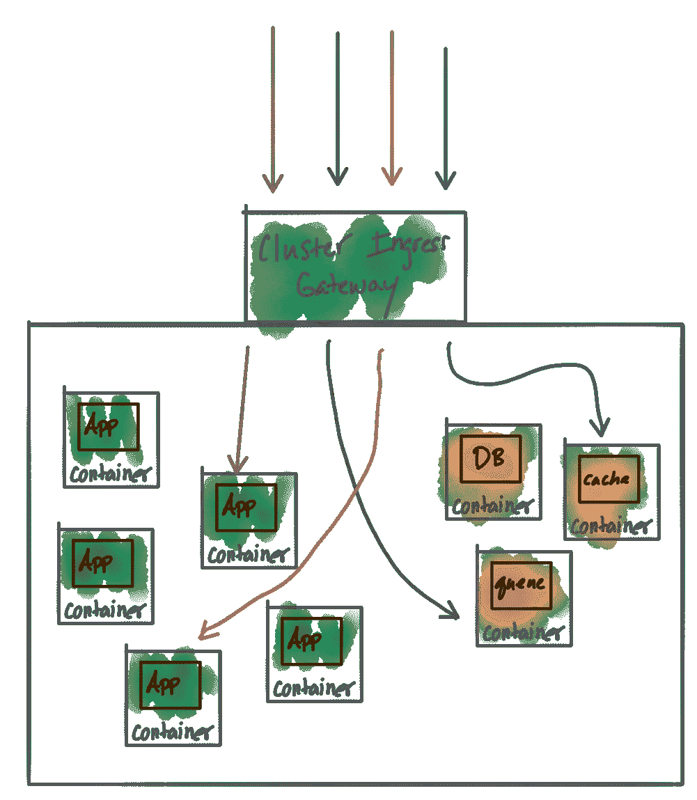
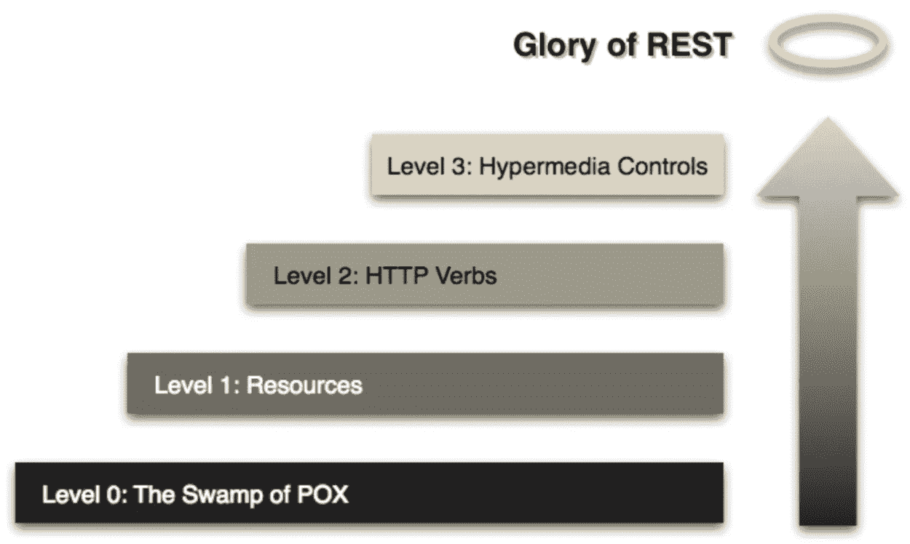
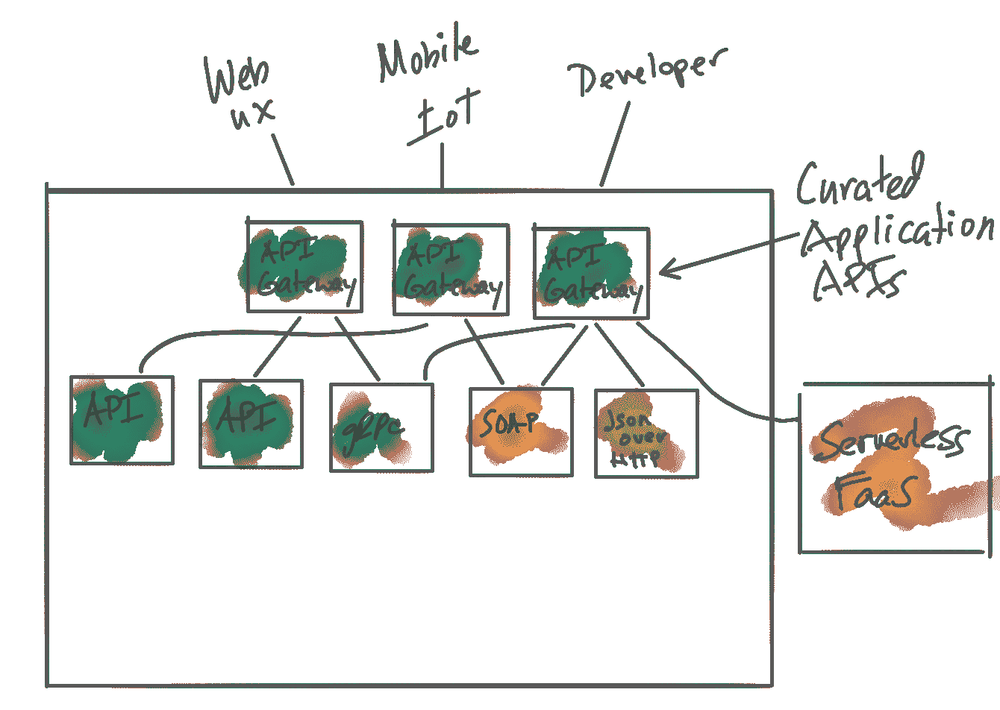
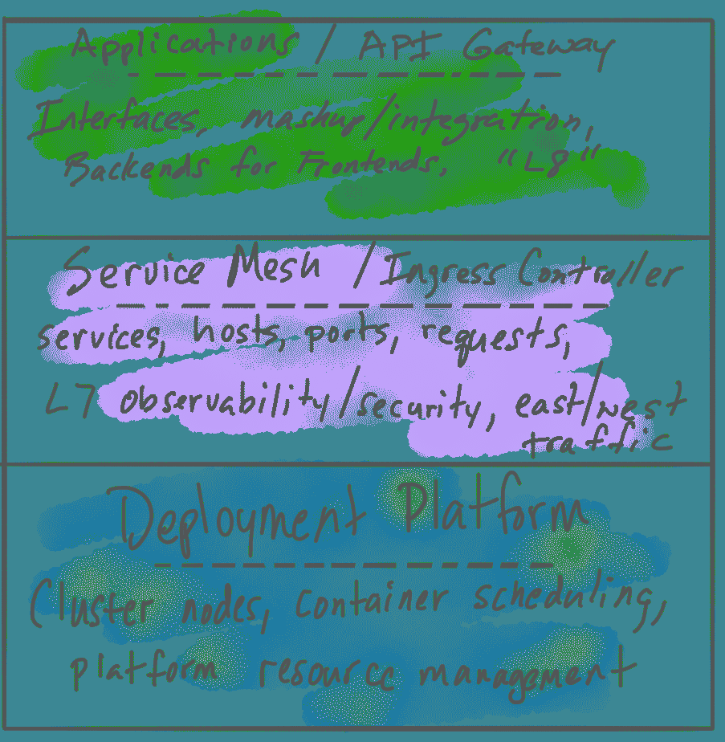

# API 网关正在经历一场身份危机

> 原文：<https://itnext.io/api-gateways-are-going-through-an-identity-crisis-e5dc3a5ab6d4?source=collection_archive---------3----------------------->

这些天来，API 网关正在经历一场身份危机。

*   它们是集中的、共享的资源，便于 API 向外部实体的公开和治理吗？
*   它们是严格控制哪些用户流量进入或离开集群的集群入口哨兵吗？
*   或者它们是某种 API 结合胶，根据客户端的类型更简洁地表达 API？
*   当然还有房间里的大象和我经常听到的一个问题:“服务网格会让 API 网关过时吗？”

随着技术的快速发展，以及行业在技术和架构模式中的快速变化，您会有理由认为“所有这些都让我头晕目眩”。在这篇文章中，我希望总结出“API 网关”的不同身份，澄清组织中的哪些团队可以使用 API 网关(他们试图解决的问题)，并重新关注首要原则。理想情况下，在本文结束时，您将更好地理解 API 基础设施在不同团队的不同级别上的作用，以及如何从每个级别中获得最大价值。

在我们开始之前，让我们先弄清楚术语 API。

明确和有目的地定义的界面，旨在通过网络调用，使软件开发人员能够以可控和舒适的方式对组织内的数据和功能进行编程访问。

这些接口抽象了实现它们的技术基础设施的细节。对于这些设计的网络端点，我们希望有一定程度的文档、使用指南、稳定性和向后兼容性。

相比之下，仅仅因为我们可以通过网络与另一个软件进行通信，并不一定意味着远程端点就是这个定义下的 API。许多系统相互通信，然而，这种通信发生得更加随意，并且以耦合和其他因素来换取即时性。

我们创建 API 来提供对部分业务的深思熟虑的抽象，以支持新的业务功能和偶然的创新。

当谈到 API 网关时，首先要谈的是 API 管理。

许多人从 API 管理的角度考虑 API 网关。这是公平的。但是让我们快速看一下这个网关到底是做什么的。

[通过 API 管理](https://en.wikipedia.org/wiki/API_management)，我们希望解决“当我们希望公开现有 API 供他人使用时”的问题，我们如何跟踪谁使用这些 API，强制执行关于谁被允许使用它们的策略，建立安全流程以验证和授权许可的使用，并构建可在设计时使用的服务目录，以促进 API 的使用并为有效的治理奠定基础。

我们希望解决“我们有这些现有的、经过管理的 API，我们希望与他人分享，但要根据我们的条款来分享它们*”的问题。*

API 管理也做了一些好事，允许用户(潜在的 API 消费者)自助服务，注册不同的 API 消费计划(想想:在给定的时间框架内，对于指定的价格点，每个端点的每个用户的呼叫数量)。我们能够*实施*这些管理功能的基础设施是*网关*，我们的 API 流量通过该网关进行传输。在这一点上，我们可以实施身份验证、速率限制、指标收集、其他策略实施等。艾尔。

利用 API 网关的 API 管理软件示例:

*   [谷歌云顶点](https://apigee.com/api-management/#/homepage)
*   [红帽 3 刻度](https://www.3scale.net/)
*   [Mulesoft](https://www.mulesoft.com/)
*   [孔](https://konghq.com/)

在这个层次上，我们考虑 API(如上所述)以及如何最好地管理和允许访问它们。我们不考虑服务器、主机、端口、容器，甚至服务(这是另一个定义不清的词，但请记住我的话！).

API 管理(以及相应的网关)通常被实现为由“平台团队”、“集成团队”或其他 API 基础设施团队拥有的严格控制的共享基础设施。

有一点需要注意:我们要小心不要让任何业务逻辑进入这一层。如前一段所述，API 管理是共享的基础设施，但是由于我们的 API 流量穿过它，它有重新创建“无所不知，无所不在”(想想企业服务总线)治理大门的趋势，我们必须通过这个大门协调对我们的服务进行更改。理论上，这听起来很棒。在实践中，这最终会成为一个组织瓶颈。更多内容请看本帖:[应用网络功能有 ESB，API 管理，现在…服务网格？](http://blog.christianposta.com/microservices/application-network-functions-with-esbs-api-management-and-now-service-mesh/)

为了构建和实现 API，我们关注代码、数据、生产力框架等等。但是，要让这些东西发挥价值，就必须对它们进行测试、部署到生产环境中并进行监控。当我们开始部署到云原生平台时，我们开始考虑部署、容器、服务、主机、端口等，并构建我们的应用程序以适应这种环境。我们可能正在精心制作工作流(CI)和管道(CD ),以利用云平台快速移动、做出更改、让客户看到它们，等等。

在这种环境中，我们可能构建和维护多个集群来托管我们的应用程序，并且需要某种方式来访问这些集群中的应用程序和服务。以库伯内特斯为例。我们可以使用一个 [Kubernetes 入口控制器](https://kubernetes.io/docs/concepts/services-networking/ingress/)来允许访问 Kubernetes 集群(集群中的其他任何东西都不能从外部访问)。通过这种方式，我们可以利用定义明确的入口点(如域/虚拟主机、端口、协议等)严格控制哪些流量可以进入(甚至离开)我们的集群。艾尔。

在这个级别，我们可能希望某种类型的[“入口网关”](https://istio.io/docs/tasks/traffic-management/ingress/)成为流量哨兵，允许请求和消息进入集群。在这个层次上，你会更多地考虑“我的集群中有这个服务，我需要集群之外的人能够调用它”。这可以是一个服务(公开一个 API)，一个现有的整体，一个 gRPC 服务，一个缓存，一个消息队列，一个数据库，等等。一些人选择称之为 API 网关，其中一些可能实际上做的不仅仅是流量入口/出口，但关键是这一级别的问题存在于集群操作级。

这些类型的入口实现的示例包括:

[特使代理](http://envoyproxy.io/)和基于它的项目包括:

*   [数据线大使](https://www.getambassador.io/)
*   [Solo.io Gloo](https://gloo.solo.io/)
*   [七边形轮廓](https://github.com/heptio/contour)

其他基于其他反向代理/负载平衡器构建:

*   [HAProxy](http://www.haproxy.org/)
*   [OpenShift 的路由器](https://docs.openshift.com/container-platform/3.9/install_config/router/index.html)(基于 HAProxy)
*   [NGINX](https://github.com/kubernetes/ingress-nginx)
*   [特拉菲克](https://traefik.io/)
*   [孔](https://github.com/Kong/kubernetes-ingress-controller)

这一级别的集群入口控制器由平台团队操作，但是这种基础设施通常与更加分散的自助式工作流相关联(正如您对云原生平台的期望)。[参见 Weaveworks 的好心人描述的“GitOps”工作流程](https://www.weave.works/blog/gitops-operations-by-pull-request)

术语“API 网关”的另一个扩展是我听到这个术语时通常想到的，也是最类似 API 网关*模式*的一个。 [Chris Richardson](https://www.chrisrichardson.net/) 在他的书《微服务模式》第八章[中很好地介绍了这种用法。我强烈推荐为这本书和其他微服务模式教育。在他的关于 API Gatway 模式的](https://microservices.io/book) [microservices.io 站点上可以看到一个更快速的浏览](https://microservices.io/patterns/apigateway.html)简而言之，API-gateway 模式是关于管理一个 API 以供不同类别的消费者更好地使用。这种监管涉及 API 间接层。你可能听到的另一个代表 API 网关模式的术语是“后端对前端”，其中“前端”可以是字面上的前端(ui)、移动客户端、物联网客户端，甚至是其他服务/应用程序开发者。

在 API Gateway 模式中，我们显式地简化了一组 API 的调用，以便为一组特定的用户、客户或消费者模拟一个“应用程序”的内聚 API。回想一下，当我们使用微服务来构建我们的系统时，“应用程序”的概念就消失了。API 网关模式有助于恢复这种观念。这里的关键是 API 网关，当它实现时，*成为*客户端和应用程序的 API，并负责与任何后端 API 和其他应用程序网络端点(不符合上述 API 定义的那些)进行通信。

与上一节中的入口控制器不同，这个 API 网关更接近于开发人员的世界观，并且不太关注向集群外公开哪些端口或服务。这个“API 网关”也不同于 API 管理世界观，在 API 管理世界观中，我们管理现有的 API。这个 API 网关混合了对后端的调用，*可能*公开 API，但也可能与不太被描述为 API 的东西对话，比如对遗留系统的 RPC 调用，用不符合“REST”漂亮外表的协议进行的调用，比如通过 HTTP、gRPC、SOAP、GraphQL、websockets 和消息队列拼凑的 JSON。这种类型的网关还可能被调用来进行消息级转换、复杂路由、网络弹性/回退以及响应的聚合。

如果你熟悉 REST APIs 的 [Richardson 成熟度模型](https://www.crummy.com/writing/speaking/2008-QCon/act3.html)，实现 API gateway 模式的 API gateway 将被调用来集成比 1-3 级实现更多的 0 级请求(以及中间的所有内容)。

[https://Martin fowler . com/articles/richardsonmaturitymodel . html](https://martinfowler.com/articles/richardsonMaturityModel.html)

这些类型的网关实现仍然需要解决诸如速率限制、认证/授权、电路中断、度量收集、流量路由等问题。这些类型的网关可以在集群边缘用作集群入口控制器，或者在集群内部用作应用程序网关。

这种 API 网关的例子包括:

*   [春云网关](http://spring.io/projects/spring-cloud-gateway)
*   [Solo.io Gloo](https://gloo.solo.io/)
*   [网飞·祖尔](https://github.com/Netflix/zuul)
*   [IBM-strong loop Loopback/micro gateway](https://strongloop.com/)

这种类型的网关也可以使用更通用的编程或集成语言/框架来构建，如:

*   [阿帕奇骆驼](https://github.com/apache/camel)
*   [弹簧集成](https://spring.io/projects/spring-integration)
*   芭蕾舞演员 io
*   [日食垂直 x](https://vertx.io/)
*   [节点 JS](https://nodejs.org/en/)

由于这种类型的 API 网关与应用程序和服务的开发密切相关，我们希望开发人员能够帮助指定 API 网关所公开的 API，理解所涉及的任何混搭逻辑，并需要能够快速测试和更改该 API 基础设施。我们还希望运营部或 SRE 对 API 网关的安全性、弹性和可观察性配置有一些看法。这一级别的基础设施还必须适应不断发展的、随需应变的、自助式开发人员工作流。再次查看 GitOps 模型，了解更多信息。

在云基础设施上运行服务架构的一部分包括在网络中构建适当级别的可观察性和控制的难度。在之前解决这个问题的迭代中，[我们使用应用程序库和有希望的开发者治理来实现这个](http://blog.christianposta.com/microservices/application-safety-and-correctness-cannot-be-offloaded-to-istio-or-any-service-mesh/)。然而，在大规模和跨多语言环境中，服务网格技术的[出现提供了一个更好的解决方案](http://blog.christianposta.com/microservices/application-safety-and-correctness-cannot-be-offloaded-to-istio-or-any-service-mesh/)。服务网格通过透明地实现以下功能，为平台及其组成服务带来了以下功能

*   服务对服务(即东西向流量)的弹性
*   安全性包括最终用户身份验证、相互 TLS、服务对服务 RBAC/ABAC
*   针对请求/秒、请求延迟、请求失败、断路事件、分布式跟踪等的黑盒服务可观察性(侧重于网络通信)
*   服务对服务的速率限制、配额实施等

敏锐的读者会意识到[似乎与 API 网关和服务网格](https://dzone.com/articles/api-gateway-vs-service-mesh)在功能上有一些重叠。服务网格的目标是通过在 L7 透明地为任何服务/应用解决这些问题。换句话说，服务网格希望融入到服务中(而不是实际编码到服务的代码中)。另一方面，API 网关位于服务网格之上的*并且与应用程序(L8？).服务网格为服务、主机、端口、协议等之间的请求流(东/西流量)带来价值。它们还可以提供基本的集群入口功能，将部分此类功能引入北/南流量。但是，这不应该与 API 网关可以为北/南流量带来的功能相混淆(如北/南到集群，北/南到一个应用程序或一组应用程序)。*

服务网格和 API 网关在某些领域功能重叠，但它们是互补的，因为它们处于不同的层次，解决不同的问题。理想的解决方案是将每个组件(API 管理、API 网关、服务网格)即插即用到您的解决方案中，并在您需要时在组件之间建立良好的边界(或者在您不需要时将它们排除在外)。同样重要的是找到这些工具的实现，这些工具[适合你的分散的开发者和操作工作流](https://developer.ibm.com/apiconnect/2018/12/10/api-management-centralized-or-decentralized/)。即使在这些不同组件的术语和身份上存在混淆，我们也应该依赖基本原则，并理解这些组件在我们的架构中的何处带来价值，以及它们如何独立存在和互补共存。

你们中的一些人可能知道我热衷于帮助人们，尤其是在云、微服务、事件驱动架构和服务网格领域。在我的公司 [Solo.io](https://www.solo.io/) ，我们正在帮助组织消除困惑，并在适当的级别成功采用 API 技术，如网关和服务网格，以及他们可以成功使用它们的速度(如果他们需要它们，更重要的是！！).我们在像 [Envoy Proxy](https://www.envoyproxy.io/) 、 [GraphQL](https://graphql.org/) 和 [Istio](https://istio.io/) 这样的技术之上，构建了像 [Gloo](https://gloo.solo.io/) 、 [Scoop](https://sqoop.solo.io/) 和 [SuperGloo](https://supergloo.solo.io/) 这样的工具，以帮助实现 API 网关功能，并用服务网格技术(如 Istio、Consul 和 Linkerd)补充 API 网关。请联系我们([@ solio _ Inc](https://twitter.com/soloio_inc)， [http://solo.io](http://www.solo.io/) )或直接联系我( [@christianposta](http://www.twitter.com/christianposta) ，[博客](http://blog.christianposta.com/))，深入了解我们的愿景以及我们的技术如何帮助您的组织。

相关阅读:

[http://blog . Christian posta . com/micro services/application-network-functions-with-esbs-API-management-and-now-service-mesh/](http://blog.christianposta.com/microservices/application-network-functions-with-esbs-api-management-and-now-service-mesh/)

*原载于 2019 年 1 月 21 日*[*medium.com*](https://medium.com/solo-io/api-gateways-are-going-through-an-identity-crisis-d1d833a313d7)*。*