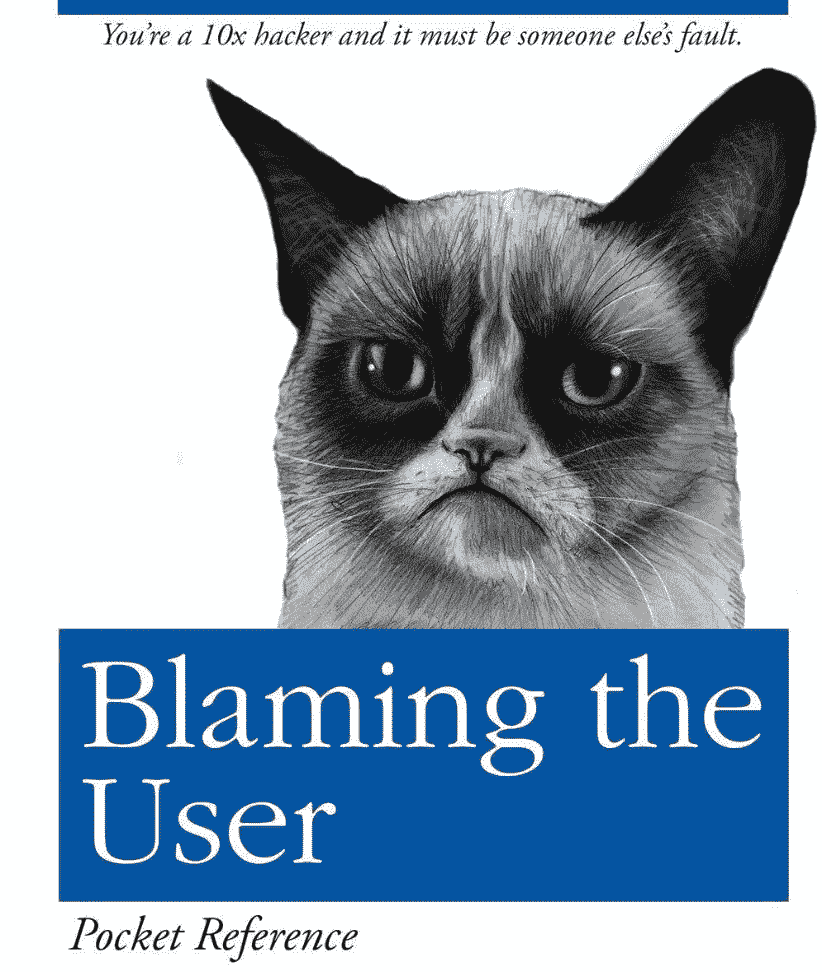
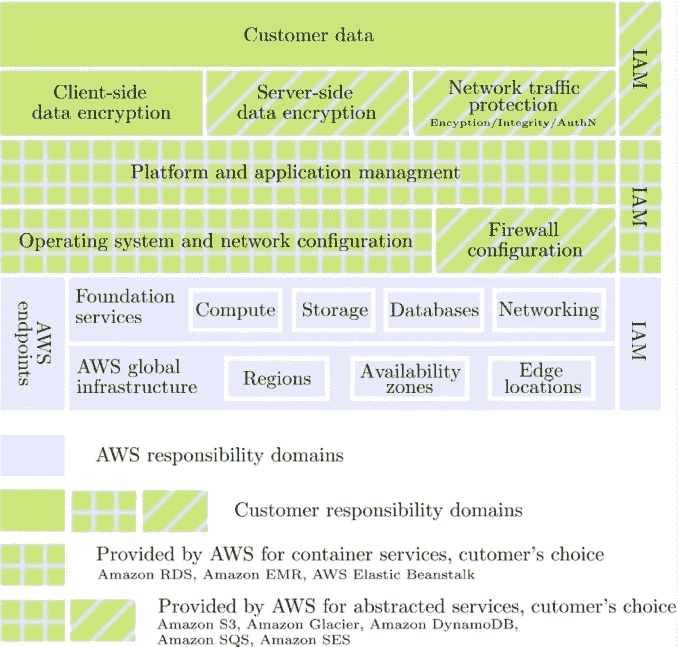
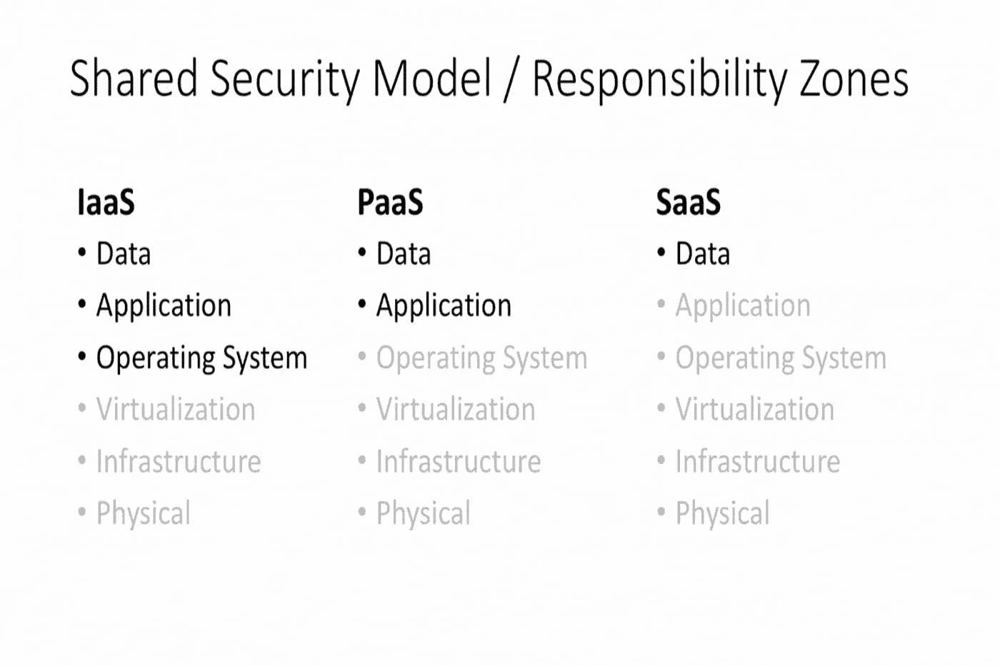
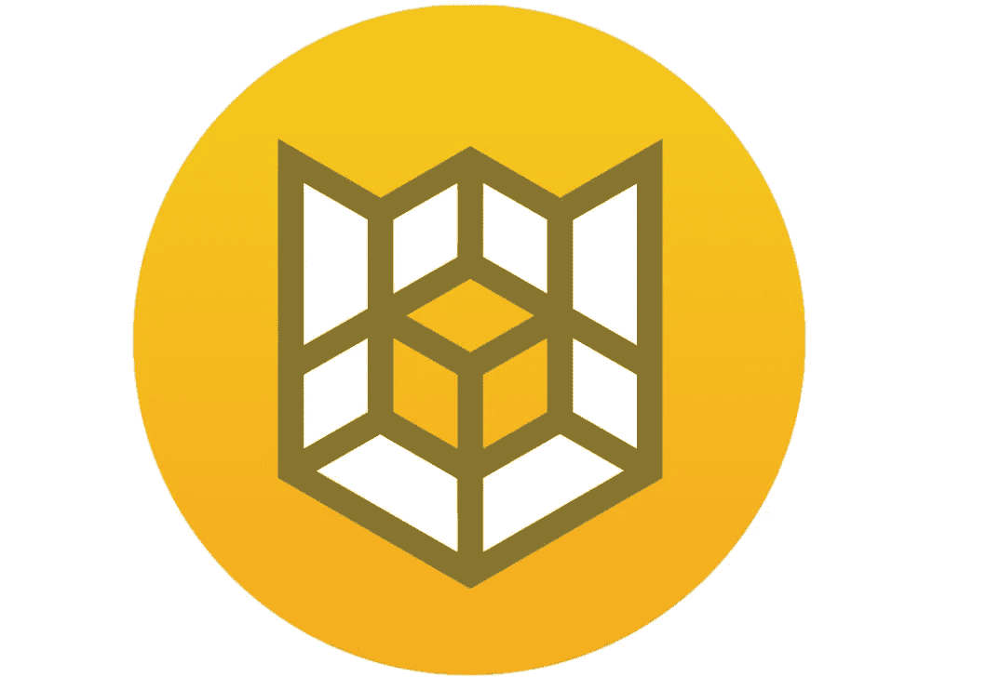
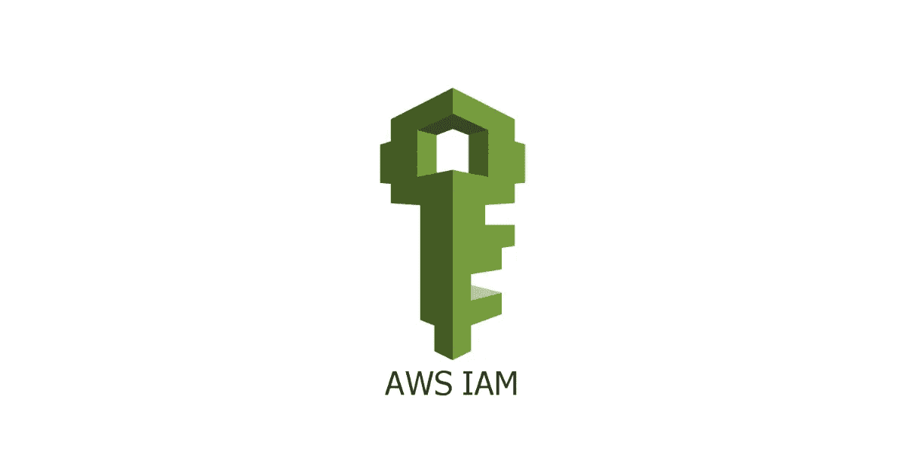
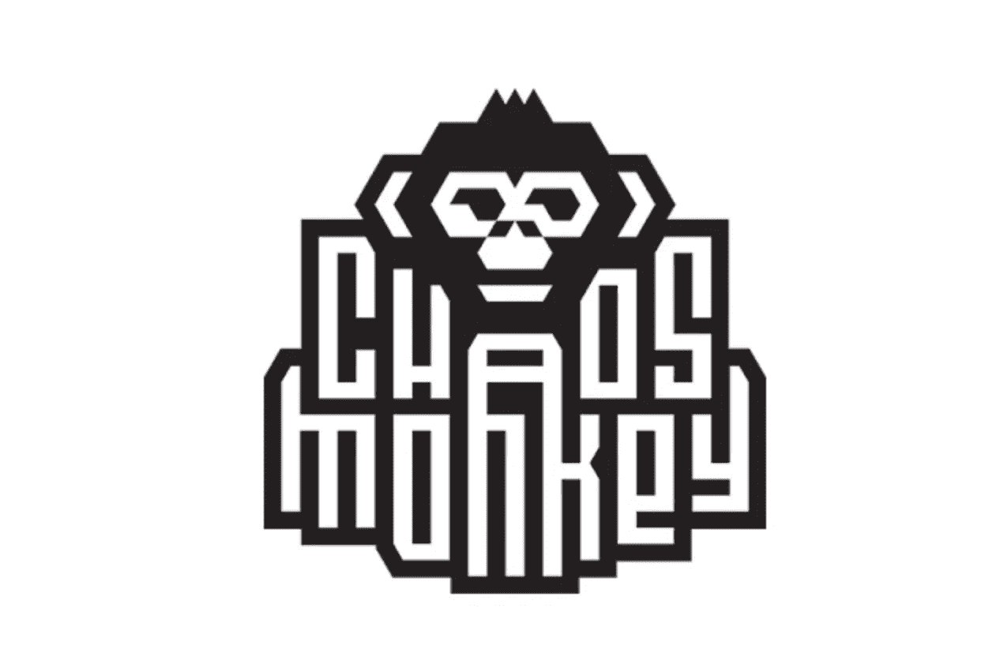
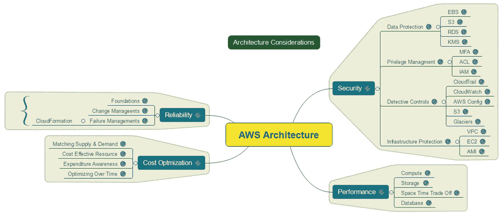
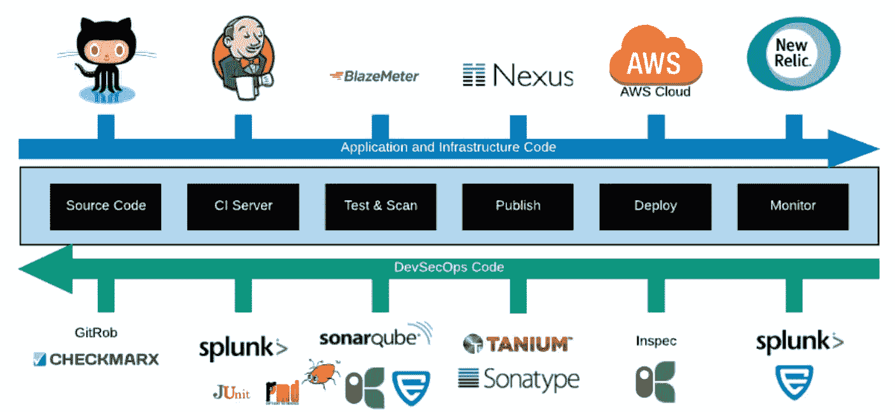
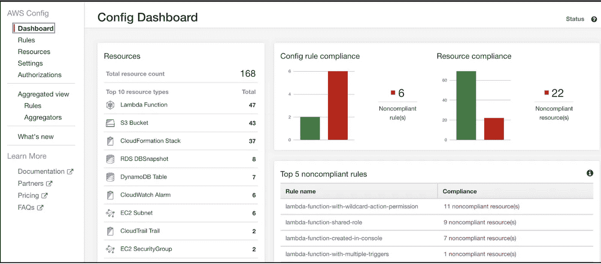

# 跨您的 AWS 客户构建安全性和治理

> 原文：<https://itnext.io/architecting-security-governance-across-your-aws-accounts-part-1-introduction-ae200624424d?source=collection_archive---------1----------------------->

## 第一部分:引言。

***注*** *: —这是一个多部分系列的第 1 部分。第二部分请点击* [***这里。***](https://medium.com/@ammar.osman.ali/architecting-security-governance-across-your-aws-accounts-part-2-incident-response-on-aws-44b1ee01f1ee)

*“安全将永远是我们的重中之重。”* —亚马逊副总裁兼首席技术官沃纳·威格尔&

> **敏捷性、成本、自主性和更快的上市时间是大多数客户将其本地工作负载迁移到云的原因——让我们想想如何将安全性转移到左边←并使其符合这些软件开发原则——安全性不应成为瓶颈，您可以使用云来保护云上的工作负载。**

# 目标受众

如果你已经使用 AWS Cloud 好几年了，我相信你能理解我在这篇文章中试图表达的观点。请与更多的观众分享你的经历。如果你正准备开始你的旅程，这是一个很好的起点，因为我将总结我多年来学到的一些实践。

我想你已经在 AWS 工作了至少一年了。因此，在本系列的这一部分，我不会详细解释本文中提到的任何 AWS 服务；相反，我将强调您应该为更好的安全架构实现的策略。本系列的其他部分将阐明实现。

在过去的两年中，我花了大量的时间与我的团队和其他云专业人员通过许多开源平台合作，试图改善 AWS 云的安全实践。虽然这在理论上听起来很简单，但在生产规模上实现它是一项非常具有挑战性的任务，需要跨各种团队和非常多样化的技术堆栈进行协作。

不要担心，因为我们会涵盖这个和即将到来的职位的所有细节。希望你能从我们的错误中吸取教训，并利用我们的成功。重要的是，请与我们分享您的经验。

有了这个方法。我们走吧，德沃普斯之路！

# 文化

[消除怪圈](https://www.oreilly.com/ideas/ironic-oreilly)

在我们开始讨论 AWS 上的安全实现之前，让我们从我们(安全人员)、我们的文化、我们的过程和思维方式开始。

“总的来说，我们辜负了客户。” —帕特·基尔辛格·赛义德，VMWare 首席执行官。

帕特对我们安全小组的评价再正确不过了。多年来，我们一直专注于威胁，而不是建设安全能力。首先，安全团队将大部分时间用于应对威胁，而不是预防威胁。

我们应该更多地讨论缩小攻击面的实现和预防机制。复杂、缓慢和团队间的冲突摧毁了许多组织。只有当您将简单性应用到您的流程中，将更多的协作精神应用到您的文化中，并将由数据支持的可靠安全原则应用到您的决策引擎中时，您才能看到事情朝着正确的方向发展。我也同意这样的观点，即安全团队资金不足，并且总是不得不争取“最佳性价比”。这让我们变得更聪明！

我们的团队必须接受挑战，共同努力实现组织的安全目标；最终，安全应该是每个人的职责。我们互相指责的时间越少，我们就越容易有效地合作。

# 分担责任模式

我可以告诉你，你想知道，从哪里开始？我知道您正在努力赶上应用程序团队，他们每天都在发布新特性或错误修复，有很多事情要担心。我知道跳到很酷的东西并通过自动化或其他方式开始执行策略很有诱惑力，但理解你作为客户的责任是你需要开始的地方，所以从分担责任模式开始，因为从长远来看，你将避免许多新手的错误。

[**AWS 共享责任模式**](https://aws.amazon.com/compliance/shared-responsibility-model/)

根据您对 AWS 计算服务(EC2、ECS/EKS 或 lambda 等)或公共云模型(IaaS、PaaS 或 SaaS)的选择，您作为客户的责任可能会发生根本变化，但我们不会在本文中详细讨论这一点，因为这可以单独成为一篇文章。

虽然从高层次来说，你应该非常 ***担心*** 保护你的数据，因为你不能将这一责任推卸给 AWS，无论你使用什么样的 AWS 服务或采用什么样的公共云模式，这都是你的义务。

T 您越是向无服务器迁移，就越不用担心补丁管理和操作系统级安全强化的噩梦。

这同样适用于您的公共云模式，您越是向 SaaS 迁移，就越不用担心基础架构的安全性。请注意，我不是在为 SaaS 辩护，我只是在陈述事实。

公共云模型

# 多账户模式

在理解了您作为客户的安全责任之后，是时候考虑大规模实现治理了。早期采用者学到的重要经验之一是:从安全和成本管理的角度来看，在单个 AWS 帐户上部署应用程序是一种危险的做法，因为它会使您的云管理流程变得复杂。

AWS 帐户体系结构

我将让您决定如何构建您的帐户，但上图说明了一个常见的模式。

你需要一个沙盒账户让你的开发者尝试新的酷的东西，每个产品都需要正式的开发、预生产和生产账户。拥有一个日志记录帐户，您可以在其中汇总所有 CloudTrail 日志、配置规则、S3 访问日志和其他安全相关数据，审计人员可能需要在发生违规时访问这些数据。

您还需要一个管理帐户，用于对其他帐户实施策略。尝试将帐单委托给一个帐单管理帐户，而不是使用您的主帐户。使用主帐户对链接帐户应用组织服务控制策略。

资源标记是一个大问题，成本控制是当今企业面临的重要问题之一。再一次，多帐户模型来拯救，因为你已经在单独的 AWS 帐户上部署了每个产品，你知道“产品团队”可以吃下整个账单，你不应该太担心他们的标记缺点事件，尽管我相信标记对于许多其他原因是必不可少的。

许多对所有应用程序使用单一帐户的 AWS 客户都经历了服务限制不断增加的痛苦。你有许多工程师在争夺有限的资源(s3 存储桶、计算机资源和其他资源)，更不用说 AWS 有一些硬限制，它们不能为你增加。

我一直最喜欢的多账户模式的好处是它提供了有限的爆炸半径。我可以确保开发团队 A 无法访问开发团队 B 的帐户，这样他们就不会破坏他们的东西。我也可以在晚上睡觉，因为我知道如果我的猫在 AWS 帐户 120 上的图像处理产品被攻破，我在其他 AWS 帐户上的其他产品不会受到影响。我想你现在看到了使用这种模式的好处:)而且它不会花费你更多的钱！AWS 帐户是免费的，直到你开始使用资源。

# 云支持

确保你尽一切努力不要无缘无故地阻止你的开发者。在允许开发人员快速行动和确保您的环境安全之间取得平衡是非常必要的。首先要确保你的开发人员知道你不是去阻止的，而是去促成的。

建立一个商定的安全基准，该基准需要在您的企业的每个帐户上，以符合您的行业特定法规。
剖析和速度对于您的业务和安全性一样重要，因此请确保您的安全实践与您的业务保持一致，以便两者和谐地协同工作，这说起来容易做起来难，因为除了所有的合规性要求之外，还需要大量的宣传、对您的产品和基础架构的理解。

# 自动化和策略代码(PaC)

[云护法](https://www.capitalone.io/)

我不知道你怎么想，但是在代码中构建安全策略并在几分钟内将它们部署到产品中的想法非常酷。您可以对您的策略进行版本控制，知道谁做了一个糟糕的合并，以及上一个好用的好版本是什么。

还记得开发人员要等五个星期才能批准防火墙请求吗？那些日子已经过去了。开发人员现在可以在几秒钟内创建安全组规则，并在不到一秒钟的时间内向世界开放端口 22。

开发人员从来不会关心你那些充斥着过时的安全策略的冗长的文档，他们从来不会去阅读它们，即使你花了宝贵的时间去更新它们，他们也永远不会去做。

那么你应该怎么做呢？如果您正在考虑自动化您的安全策略，您应该拍拍自己的肩膀。为了跟上速度，云提供您的业务；安全策略需要像您的基础设施一样灵活。您需要和您的应用程序团队一样快或一样慢。

定义 AWS、AWS 组织服务控制策略、IAM 策略和特定于服务的策略(如 KMS 密钥策略和存储桶策略)的方法有很多。

自动化实现了这种灵活性，并且编纂您的策略是不可思议的，因为您可以将您的安全策略视为您的基础设施和应用程序代码。策略可以在 git 中检查、修改、改进、重构，由多人查看，并且适用于应用程序代码的一切都可以应用于您的策略代码。

您可以使用 Lambda 和 CloudWatch events 等服务，或者利用 Cloud Custodian 等开源工具来帮助您通过自动化实现合规性。

> 关键是，自动化您的安全控制，否则就要准备好输掉这场战斗。
> 实时检测、通知和补救是非常云和人性化的。

如果您的一个开发人员在 Prd 部署期间向外界开放了一个 s3 存储桶，检测到这一点，立即通知他们您已经检测到问题并为他们修复了问题。如果你在产品投入生产两周后发现安全问题，说服制造商修复它就不是一件有趣的事情了。实时反馈通常很受欢迎，因为他们可以立即采取行动。

# 身份和访问管理

[AWS IAM](https://aws.amazon.com/iam/)

AWS IAM，AWS 安全的核心。如果你与 IAM 忍者交谈，他们会告诉你，让 AWS IAM 正确是一个游戏规则的改变者，因为在我看来这是 AWS 最强大的服务之一。

AWS IAM 使您能够定义非常细粒度的策略，帮助您轻松地设置界限和实现最小特权原则。IAM 与所有 AWS 服务集成，甚至是允许您直接在其上建立策略的服务，如 s3 和 KMS。

IAM 的关键是使用角色并承担这些角色，而不是到处都使用 API 键。此外，尽可能自动创建策略、组和角色，并为您的策略、角色和组定义明确的命名转换，以避免配置偏差。理解条件和 IAM 操作可能很棘手，但是如果您试图严格控制您的访问策略，这是必不可少的。

> 我给你的建议是，请避免单一 AWS 账户模式，这样你就可以避免分割政策。

# 数据安全

通过加密静态数据和传输中的数据来保护数据，并确保只有需要访问数据的人才能访问数据，这一点至关重要。尽管这看起来很简单，但许多组织无法理解。

我经常通过谷歌搜索 s3 桶数据泄漏来开始我的一天，并与我圈子里的人分享我的发现，以吓唬每个人。我不记得有几天没有遇到这种新闻。

我学到的经验是尽早对数据进行分类，并确保所有数据存储都有所有者。您还应该加密所有内容，并确保所有数据存储都受到保护。

KMS 是令人难以置信的，因为它为你做了所有繁重的工作，创建主密钥、数据密钥和密钥轮换都是由 AWS 为你管理的。如果你想有更多的控制权，你可以把客户的钥匙，并管理他们自己。

# 基础设施安全

由于 AWS 为您处理物理基础设施安全，您可以专注于 VPC 内 VPC 流量和资源的安全。首先，创建您的私有和公共子网，使用 VPN 或堡垒主机访问您的服务器。使用 NACLs 和安全组来限制流量是必须实施的最佳实践。

通过利用 ***不可变基础设施*** 的概念来避免使用 SSH 之类的协议，因为它本质上提供了更高的安全性。

> 不要修补实例，只需重建一个新的 AMI，不要就地更新，只需销毁并从基础映像构建。

使用 AWS [git-secrets](https://github.com/awslabs/git-secrets) 来检测意外登记到 git 存储库中的密钥。使用 EC2 角色，而不是 API 密钥，也不要忘记你的 EC2 密钥对，如果这些泄漏，请放心，你的服务器将立即挖掘比特币。

如果您使用 s3 进行静态 web 托管，我强烈建议在您的 bucket 前面加上 CloudFront 发行版，并利用 AWS origin access 身份将您的 bucket 限制在您的发行版中。这种模式对坏人隐藏了你的对象，并允许你访问安全特性，比如 AWS WAF 和 Shield，它们不能直接与 s3 一起工作。

# 弹性

[网飞混沌猴](https://netflix.github.io/chaosmonkey/)

高可用性、运营连续性、健壮性和弹性以及灾难恢复通常是使用 AWS 部署云的原因。根据 AWS 良好架构的框架，多 AZ 和多区域部署都是我们需要适应的模式。

使用 AWS 架构良好的工具等工具可以帮助您在 AWS 上部署更具弹性的工作负载。AWS 让你更容易为失败设计架构，大多数服务提供高**可用性**和**持久性**，其他服务可以被设计为更具弹性**。***AWS***建议我们建筑师牢记四大支柱；* ***安全性*** *，* ***可靠性*** *，* ***成本优化*** *，* ***性能*** *。**

**

*[**AWS 架构四大支柱**](https://aws.amazon.com/blogs/apn/the-5-pillars-of-the-aws-well-architected-framework/)*

*完成设计和实施阶段后，您可以通过引入 [**混沌工程**](https://en.wikipedia.org/wiki/Chaos_engineering) 来测试您的基础设施，并增强对基础设施的信心，还可以定义在出现故障时可以帮助您更快恢复的流程。您可以从单个节点、az 开始测试，或者取下整个区域，看看您的应用程序是如何处理的。*

# *记录和监控*

*必须启用 CloudTrail、Config 和 VPC 流日志，并将其聚合到一个日志帐户。您还应该确保在每个地区都启用了这些服务，如果有人试图禁用这些服务，您会通过自动化得到通知。*

*还应启用 AWS guardduty 和 AWS SecurityHub 两者都提供出色的监控功能。被动监控是不够的，我们应该致力于通过实时自动化对安全事件做出反应。*

# *事故响应*

*说到实时自动化，我们应该拥有一本行动手册，帮助指导我们企业中的安全专业人员和利益相关者更有效地响应安全事件。*

*不知道谁拥有数据，不知道如何处理受损的实例或事件更糟糕的是，AWS 帐户被劫持是一种可怕的情况。我们需要尽可能地自动化，但是我们也需要可以参考的明确的职责和记录的过程。我认为写这个主题会很有趣，所以我会在这里停下来，很快写一篇博文！*

# *DevSecOps*

**

*这是那些像 DevOps 一样被抛来抛去的流行语之一。DevSecops 或 SecDevOps 是在您的 CI/CD 工作流上实现安全性的实践。当代码通过所有较低环境进入生产环境时，会对其进行扫描和安全漏洞检查。*

*我们不会等到安全团队在我们的代码投入生产前的最后一分钟来祝福我们的代码，我们从安全开始，早在我们编码时就有 IDE 插件来寻找安全漏洞。使用 Docker bench 等工具以及其他可以轻松与 Jenkins 集成的工具是一个很好的起点。*

> *DevSecOps 是一种以“**每个人都对安全负责**”的心态来处理 IT 安全的方法。它包括将安全实践注入到组织的 DevOps 管道中。目标是将安全性整合到软件开发工作流程的所有*阶段。这与其前身开发模型相矛盾——DevSecOps 意味着您没有为 [SDLC](https://www.plutora.com/blog/software-development-life-cycle-making-sense-of-the-different-methodologies) 的最后阶段保存安全性。**

# *合规性验证*

**

*你有顾客的信用卡信息吗？医疗保健信息？或任何个人身份信息(PII)？当您对照特定于行业的最佳实践检查您的基础架构时，您需要了解自己的表现。*

*不遵守行业规定，不按规则办事，是做不了生意的。我们可以使用 AWS 配置规则持续审计我们的基础设施。如果我们不需要遵守其他框架，如 PCI DSS 或 HPPA，我们至少应该从 CIS 基准开始。*

***介绍完毕。感谢您花费宝贵的时间！如果你想了解更多，请点击**👏 ***这样别人就能看到了。****

*在接下来的文章中，我们将探索更高层次的复杂性！*