# 你在使用 AKS 日志分析吗？

> 原文：<https://itnext.io/are-you-using-aks-log-analytics-e0d1881dea29?source=collection_archive---------4----------------------->

如果您像许多客户一样，您可能已经在 AKS 集群中部署了 [container insights](https://learn.microsoft.com/en-us/azure/aks/monitor-aks) ，并使用它来监控各种健康和性能指标。与许多客户一样，您可能正在使用或已经尝试使用内置工作簿，并且想知道如何调整数据以更好地满足您的需求。

如果这是你，那么你可能会喜欢即将发生的事情。我们将一起进行一次小小的冒险，因此我可以向您展示如何利用这种能力，并提升您挖掘集群的使用和健康模式的能力。

> 我将在这里介绍的内容假设您已经运行了容器洞察。如果您需要了解它的使用案例，或者想要一个如何成功使用它的简化示例，请随时提出要求。

让我们直接开始吧。当您在门户中查看集群刀片时，在“monitoring”部分下，有一个日志选项。在这个部分中，有许多预先准备好的查询，您可以运行这些查询来获得各种信息。这叫做日志分析[日志分析教程——Azure Monitor |微软学习](https://learn.microsoft.com/en-us/azure/azure-monitor/logs/log-analytics-tutorial)。那里的文档给了你一个你能做什么的坚实的概述，并概述了 KQL 是使用的语言，但这些都不是可怕的上下文。

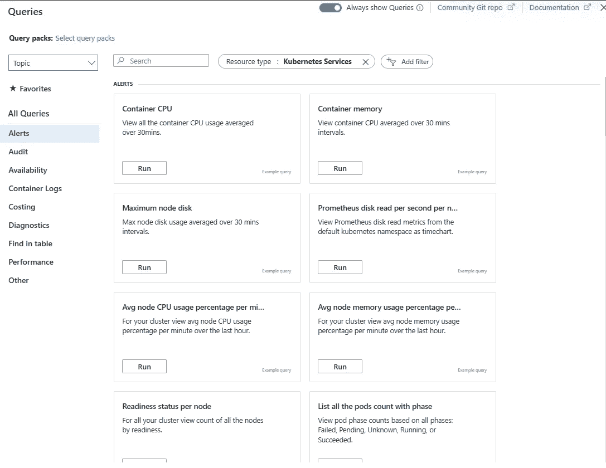

让我们以提供给我们的容器 CPU 示例为例，对其进行定制以更好地满足我们的潜在需求，然后可以在所有其他示例中使用它。

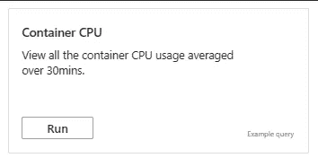

它把这个打开，然后分解。

```
// Container CPU 
// View all the container CPU usage averaged over 30mins. 
// To create an alert for this query, click '+ New alert rule'
//Select the Line chart display option: can we calculate percentage?
Perf
| where ObjectName == "K8SContainer" and CounterName == "cpuUsageNanoCores"
| summarize AvgCPUUsageNanoCores = avg(CounterValue) by bin(TimeGenerated, 30m), InstanceName, _ResourceId
```

很简单。一半只是评论，一个建议(对大多数人的需求来说这是一个糟糕的建议)和一个看起来像问题的东西…这很有趣。实际的查询让我们查看 **Perf** 表，查看某些列是否相等，然后根据我们的搜索时间范围(默认为 24 小时)汇总 30 分钟的数据。

> 这意味着我们将默认看到 24 小时内 30 分钟的摘要

我想指出的第一件事是找到这个性能表所在的位置。在查询的左侧有一个表选项，单击它。单击后，使用搜索栏，只需键入 Perf。

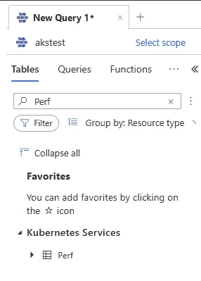

嘿-哦！现在我们知道桌子在哪里了。如果你愿意的话，点击它就可以看到里面所有的列。我注意到的一件事是评论是“选择折线图显示选项:我们能计算百分比吗？”我现在只想说技术上来说是的，但我想要不同的东西。运行查询并选择图表。默认的是堆叠柱，在这里看起来很可怕。点击右边的人字形，让我们把它改成直线。

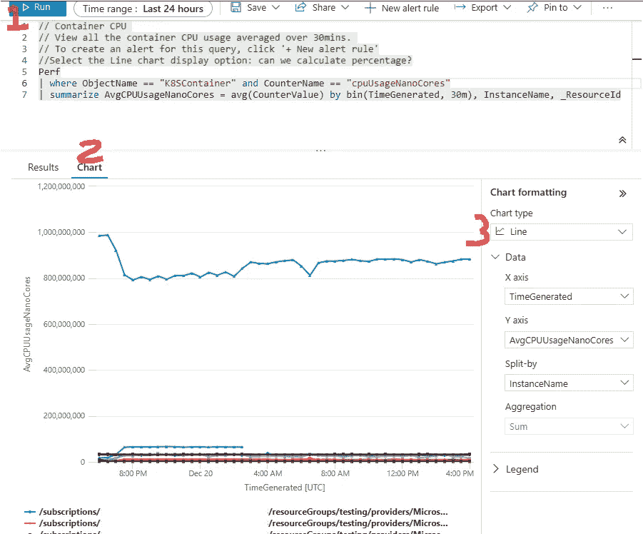

我对这个数据输出有一些问题，我们将进行更改。我不喜欢任何东西的命名方式，纳米核心价值需要有人首先知道它是什么(核心的 110 亿分之一)，然后可能做一些数学计算。首先，实例名应该是 pod 的名称。我不想看到那个大 URI。让我们改变这一点。


> 有多种方法可以实现这一点，我将快速简单地展示一下。

我想做的第一件事是验证 pod 名称的索引号。为此，我将创建一个名为 PodName 的新对象，并在“/”上拆分 InstanceName 列。我将投影 PodName 并区分它，这样我就可以看到那里有什么，并在继续之前验证索引看起来是相同的。

```
Perf
| where ObjectName == "K8SContainer" and CounterName == "cpuUsageNanoCores"
| extend PodName = split(InstanceName, '/')
| project PodName
| distinct tostring(PodName)
```

> 请注意，我将 PodName 强制转换为 string()，如果我不这样做，我会得到一个错误，即 PodName 是动态的，这很好，现在我们只是在测试。我们以后会改的。

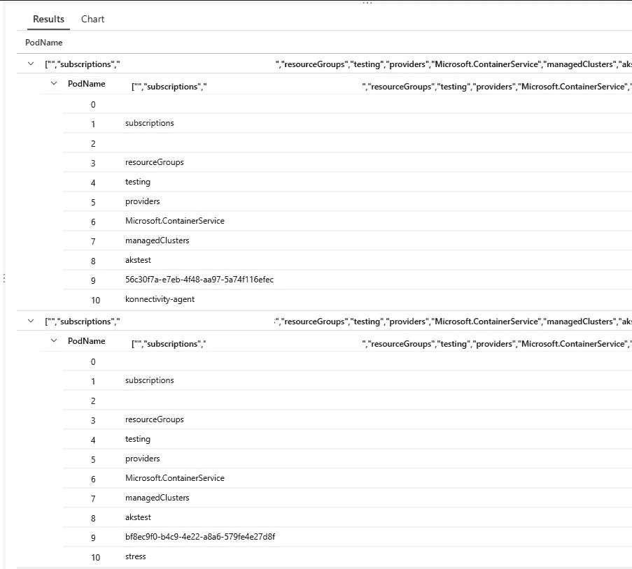

看起来 pod 名称将是索引 10。从技术上来说，我们可以调用索引 10 来完成它:

```
Perf
| where ObjectName == "K8SContainer" and CounterName == "cpuUsageNanoCores"
| extend PodName = split(InstanceName, '/')[10]
| project PodName
| distinct tostring(PodName)
```

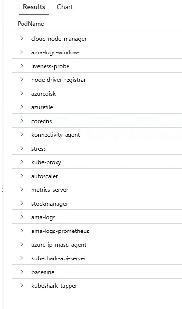

好了，放松。通过简单的拆分和对已知索引的调用，我们得到了我们所需要的。也许我们可以使用正则表达式、子串、indexof 等等，但是在这种情况下…为什么要把它复杂化呢？转到 ResourceId 列。这是为了分离可能属于可能使用相同日志分析工作区的其他集群的任何可能数据。尽管如此，我不在乎看到整个 URI，所以让我们冲洗和重复。

我们再一次让我们的伙伴 split()为我们做所有的工作，就像我们得到 pod 名称一样。不过这次我们的指数目标是 8，而不是 10。

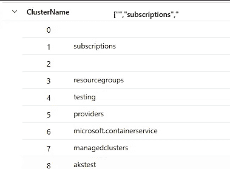

```
Perf
| where ObjectName == "K8SContainer" and CounterName == "cpuUsageNanoCores"
| extend PodName = split(InstanceName, '/')[10]
| extend ClusterName = split(_ResourceId, '/')[8]
| project PodName, ClusterName
| take 5
```

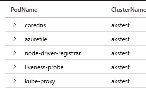

差别真大。所有浪费的空间都消失了，现在我可以很容易地阅读这些名字，而不必像某种穴居人一样永远滚动。接下来，我们想恢复之前总结，但在此之前，我们需要修复我们创建的新命名变量。默认情况下，Kusto 将使 PodName 和 ClusterName 都成为动态对象。您不能汇总动态对象。为了解决这个问题，我们可以告诉它，我们希望确保它转换为字符串。

```
| extend PodName = tostring(split(InstanceName, '/')[10])
| extend ClusterName = tostring(split(_ResourceId, '/')[8])
```

现在我们可以把总结带回来看看。

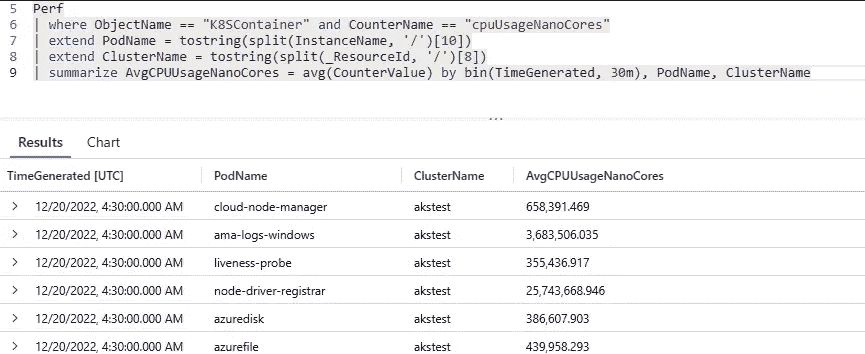

这稍微好一点。让我们来看看我们的图表，看看它如何改变了我们的视觉。

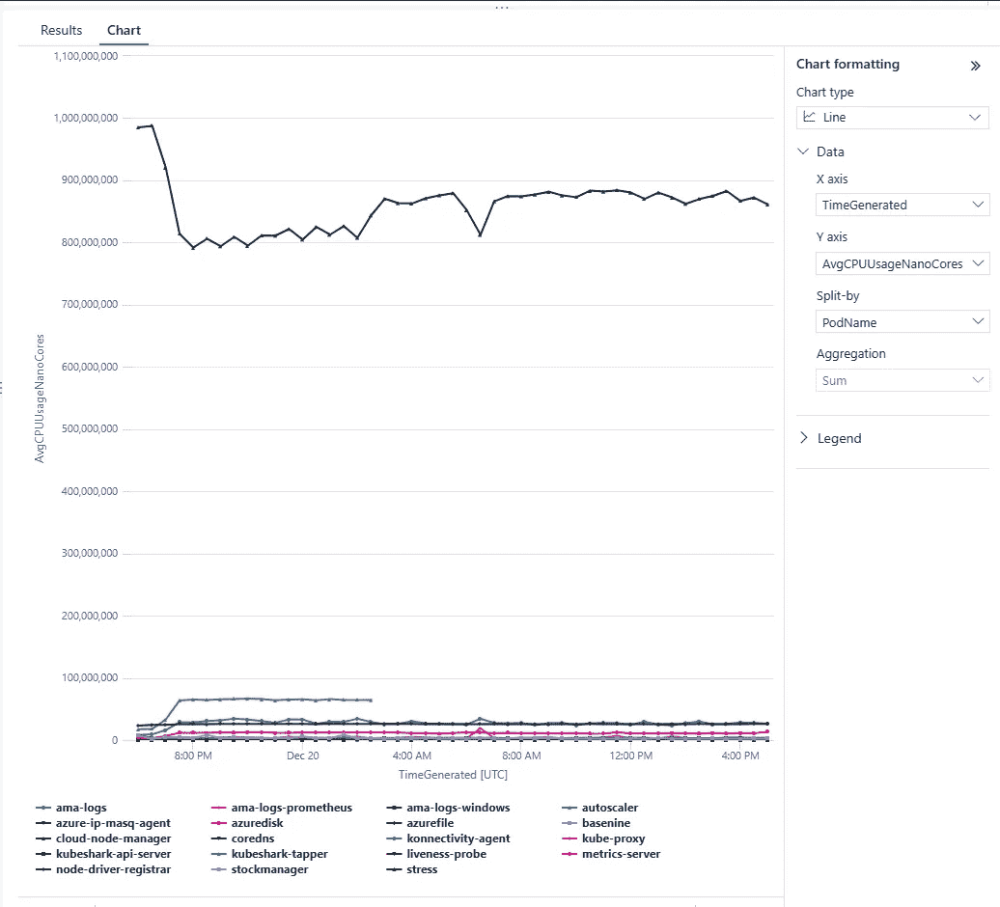

现在我可以马上看到这些名字。这在视觉上是一个很大的改进。总体来说我还是不太喜欢这个数据。我们正在查看 30 分钟内计数器值(纳米核心)的平均值。让我们再次调整我们的查询，看看这些原始数据，看看我们真正在处理什么。

```
Perf
| where ObjectName == "K8SContainer" and CounterName == "cpuUsageNanoCores"
| extend PodName = tostring(split(InstanceName, '/')[10])
| extend ClusterName = tostring(split(_ResourceId, '/')[8])
| where PodName == 'stress'
| project CounterValue
| take 50
```

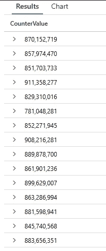

我们有很多数字，或者在这种情况下是“纳米核心”。这对我没用。纳米核心是核心的十亿分之一(是的，B ),所以除了“更大的数字=更大的压力”之外，可视化这个数字没有帮助我理解任何东西，当我们谈论数十万或数百万的大量 pod 时，我不想以这种方式考虑核心的使用。让我们看看我们是否可以换个角度来看这个问题。

如果 1 个纳米内核是内核的 1/1000000000，我们可以很容易地计算出内核的使用情况。让我们继续做那件事。我将使用我的压力舱，它正在给 CPU 施加压力，来看看这个。我将从反值中抽取一个样本，进行计算，然后去看它是否准确。

> 反值/1000000000 是我们这里的基本公式

我取的值是 918，649，861，这很简单。这大约是核心的 91%。我调试到了 pod 的主机节点上，看了一会儿 top。消费的差异和范围似乎与我看到的数据一致，所以目前我很高兴这是方向准确的。我不会用这些数据发射到太空，但我很高兴它能带我穿越海洋。


因此，让我们在查询中这样做，看看它看起来如何。添加另一个扩展，用反值/1000000000 调用它。

```
Perf
| where ObjectName == "K8SContainer" and CounterName == "cpuUsageNanoCores"
| extend PodName = tostring(split(InstanceName, '/')[10])
| extend ClusterName = tostring(split(_ResourceId, '/')[8])
| where PodName == 'stress'
| extend CoreUsage = CounterValue/1000000000
| project CounterValue, CoreUsage
| take 50
```

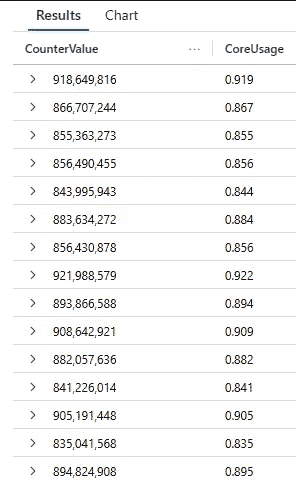

目前看起来不错。注意到我们的模式了吗？通过前两个数字很容易读出核心使用量(百万)。在这种情况下，这很简单，在其他情况下，我虚弱的大脑需要想太多，所以我会继续使用 CoreUsage。

让我们把这个联系起来，看看我们现在如何喜欢我们的数据。对 summarize 做了一些小的调整，以更改目标列和平均列本身的名称，让我们看看会得到什么。

```
Perf
| where ObjectName == "K8SContainer" and CounterName == "cpuUsageNanoCores"
| extend PodName = tostring(split(InstanceName, '/')[10])
| extend ClusterName = tostring(split(_ResourceId, '/')[8])
| extend CoreUsage = CounterValue/1000000000
| summarize AvgCPUUsageCores = avg(CoreUsage) by bin(TimeGenerated, 30m), PodName, ClusterName
```

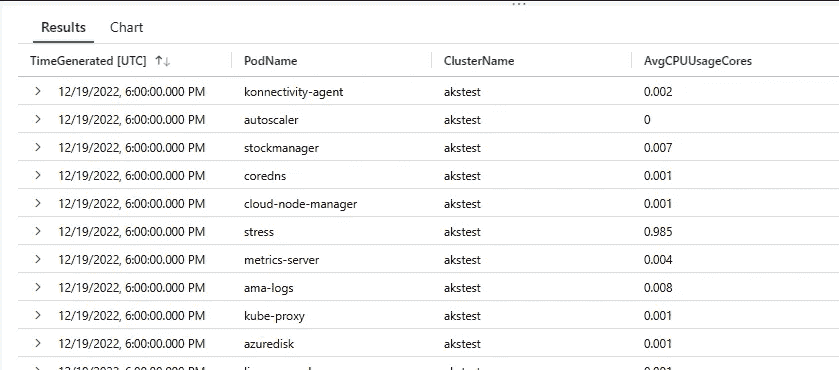

现在我们正在谈话。这里有很多低击球手。我们去看看我们的图表。这次请注意，默认的条形图实际上对我们很有用，它清楚地显示了核心级别的高消费者。

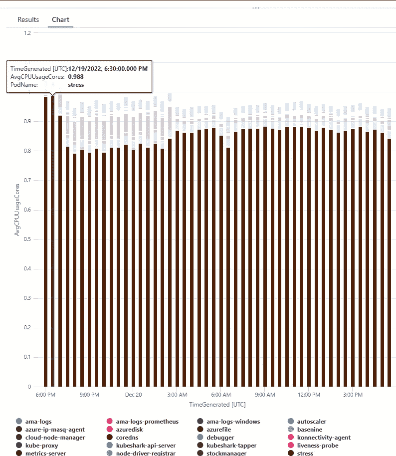

我们的折线图现在也更容易阅读了。

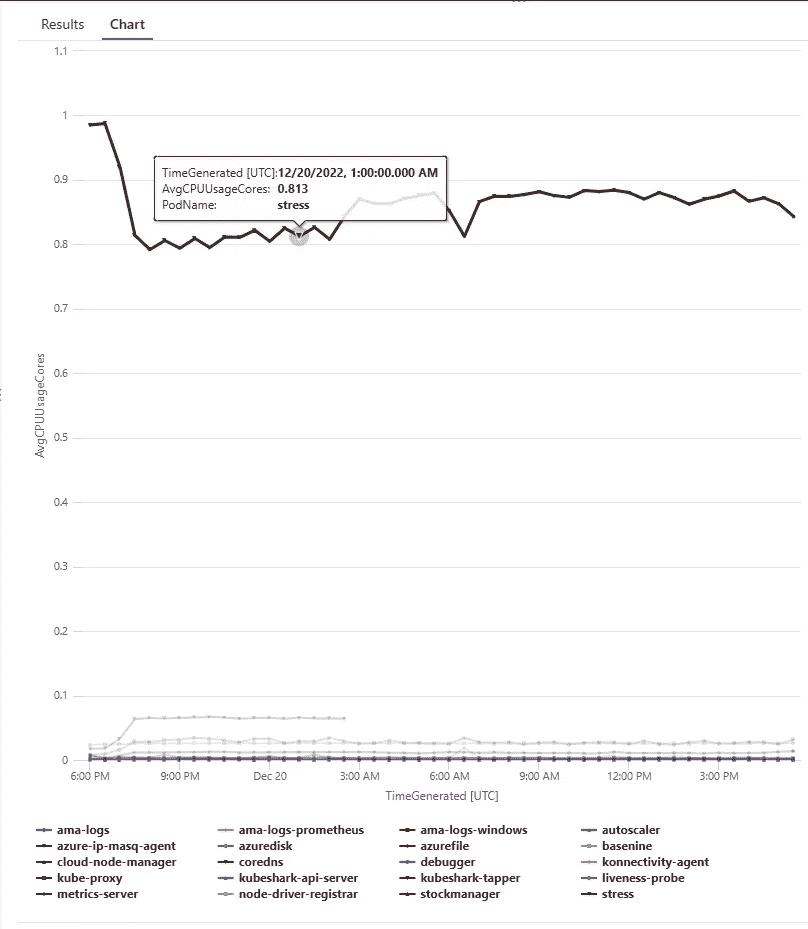

诚然，这里的视觉是澄清信息，没有什么惊人的，但我的天啊，这对人眼有影响吗？让我们来讨论一下我们得到的数据。如果您注意到每个 pod 似乎每分钟在此表中报告一次使用情况。更有可能的是，有一个采样频率发生，然后汇总。

我不知道采样频率是多少，但有一些原因很重要。首先，如果我们的问题没有持续下去呢？如果高消费是间歇性或‘随机’发生的事情呢？有了这些数据，我们能想象吗？答案是，算是吧。

如果不了解采样频率和采样时间范围内的最小/最大平均值，我们就很难突出显示许多人遭受的低水平纸张割伤。然而，你仍然可以尝试用你这里的数据来做这件事。这将很难展示，但无论如何我会尝试。我的集群没有做任何实际的事情。

首先要知道的是，我们一直使用的图表之所以有效，是因为我们总结的方式。我们是我们这个时代的宁滨，我们有库斯托正在为我们工作的 X/Y 轴数据。我们可以改变存储的时间来收紧或拓宽我们的视觉效果。为此，我希望以不同的方式限定查询的范围，以防止出现任何可视化或数据点问题，比如数据点太多。

我们通过严格限定查询的范围来控制输出。首先是控制时间范围。如果你认为你将有很多数据可能很难可视化，那就划分出较小的时间范围。不要去寻找 7 天的数据，因为你不容易看到这些数据，或者这些数据对你没有价值，尤其是当你关心性能的时候。

> 专业提示:你关心性能。有效和高效不是一回事。想想投入到某件事情中的时间。

另一种严格限定范围的方法是只寻找特定的东西。在我的例子中，我将扩展我的时间范围，但是我将把我的输出限制在 CoreUsage 等于或高于某个值的地方。再说一次，我的集群没有太多的事情发生，所以这看起来不会很惊人，但是你会明白的。

时间范围将延长至 7 天


```
Perf
| where ObjectName == "K8SContainer" and CounterName == "cpuUsageNanoCores"
| extend PodName = tostring(split(InstanceName, '/')[10])
| extend ClusterName = tostring(split(_ResourceId, '/')[8])
| extend CoreUsage = CounterValue/1000000000
| where CoreUsage >= 0.10
| summarize AvgCPUUsageCores = avg(CoreUsage) by bin(TimeGenerated, 30m), PodName, ClusterName
```

当我在寻找更多数据时，我会确保只带回基于核心使用的某些数据。有趣的是，堆叠的柱形图比线条图看起来更好看。

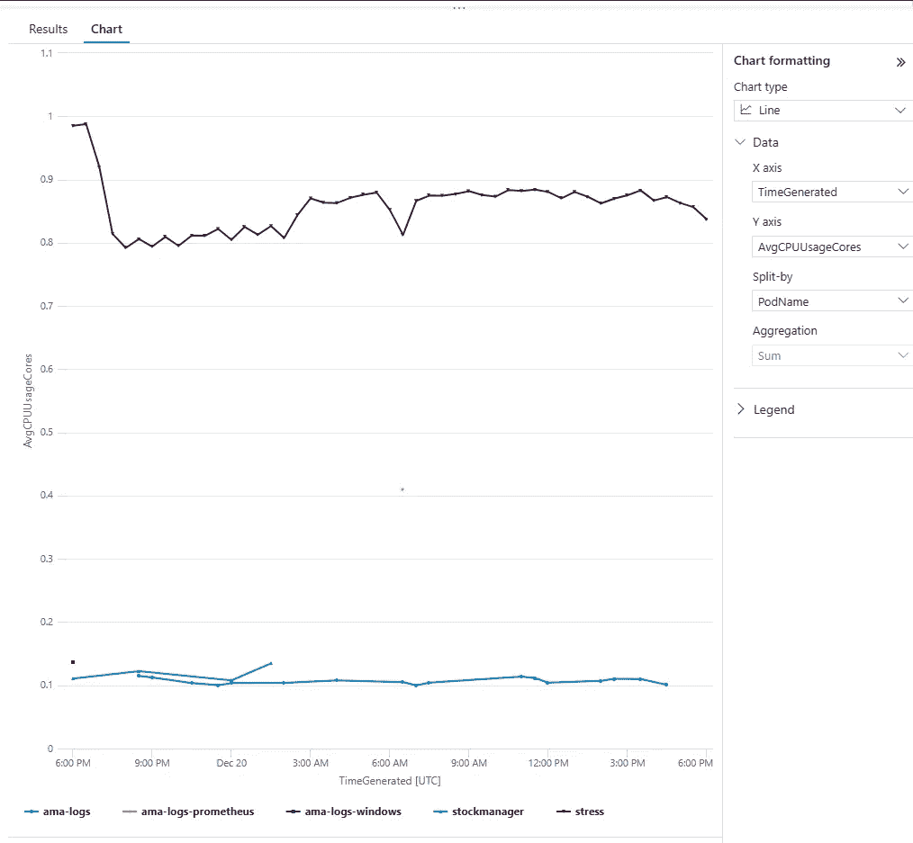

很容易看出我们的趋势，但注意到那些小亮点了吗？让我们检查一下列:

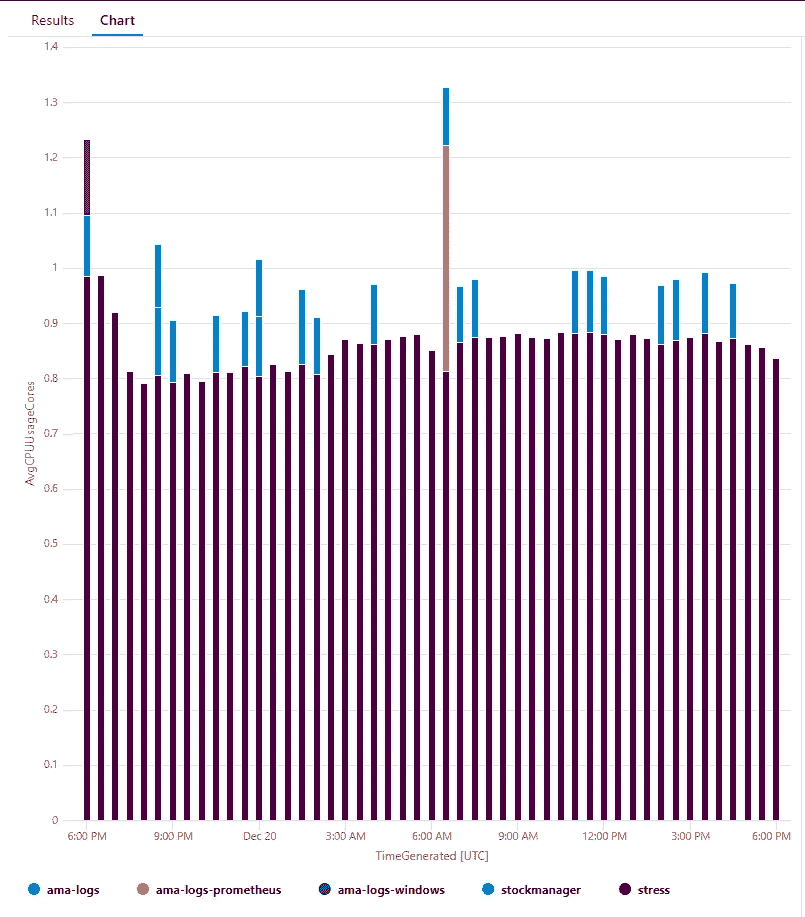

同样的数据，不同的视角，更好的理解。不要羞于改变数据的可视化方式；即使在数据层面上没有变化，故事也可能在视觉上发生变化。我们毕竟是视觉动物，不是吗？

很好，但现在我想获得更多的数据。我要把我的时间改为一分钟，因为我是一个疯狂的人。我们知道压力为我做了很多工作，我将在图表上取消选择，以便我们可以看到其他模式。我们可以立即看到数据模式没有太大变化，我的“信号”确实包含在一分钟的时间跨度内。因此，从 30 分钟到 1 分钟的变化告诉我，我们看到的其他 pod 对节点施加的压力是相当短暂的，并且没有真正的使用模式值得关注(至今)。

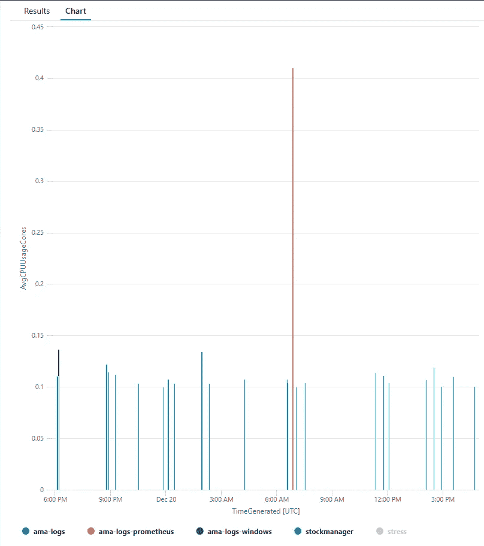

这些例子在我的集群中还不成熟，但在具有真实工作负载的实际集群中具有潜在的价值。但是你需要小心你的范围。就我而言，我根本就不应该展示压力舱。它所做的只是带回了比我需要的多得多的数据，我不得不过滤掉视觉效果。

在我们结束之前，让我们看看我刚才做的有多糟糕。首先，我用了很长的时间，其次，我把它放在尽可能低的总量中，第三，我没有排除那些无关紧要的已知模式，这些模式会使发现其他模式变得更加困难。

底部有一个查询详细信息按钮。如果我击中它，我们可以看到一些东西:


5.5 秒，1470 条记录。

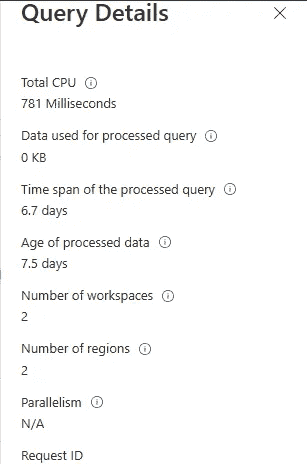

你可能看着它会想嘿，伙计，这还不算太糟。不是吗？用了 5.5 秒得到了 1470 条记录，其中大部分我都没在意，CPU 时间 781ms。那么我们如何做得更好呢？让我们对我们的查询做一点小小的调整。

```
Perf
| where ObjectName == "K8SContainer" and CounterName == "cpuUsageNanoCores"
| extend PodName = tostring(split(InstanceName, '/')[10])
| extend ClusterName = tostring(split(_ResourceId, '/')[8])
| extend CoreUsage = CounterValue/1000000000
| where CoreUsage >= 0.10
 and PodName != 'stress'
| summarize AvgCPUUsageCores = avg(CoreUsage) by bin(TimeGenerated, 1m), PodName, ClusterName
```

我告诉库斯托不要把压力包括在内。让我们现在看看。


几乎快了一秒半，只有 26 条记录。

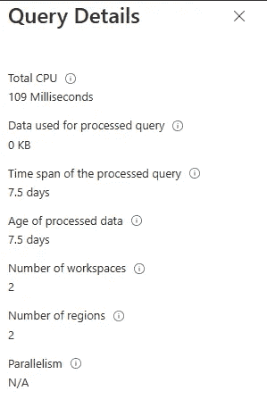

只有 109 毫秒的 CPU 时间，而其他查询需要 781 毫秒。第一个查询增加了 672 毫秒的 CPU 时间。效率更高。不仅如此，看看我们现在的数据:

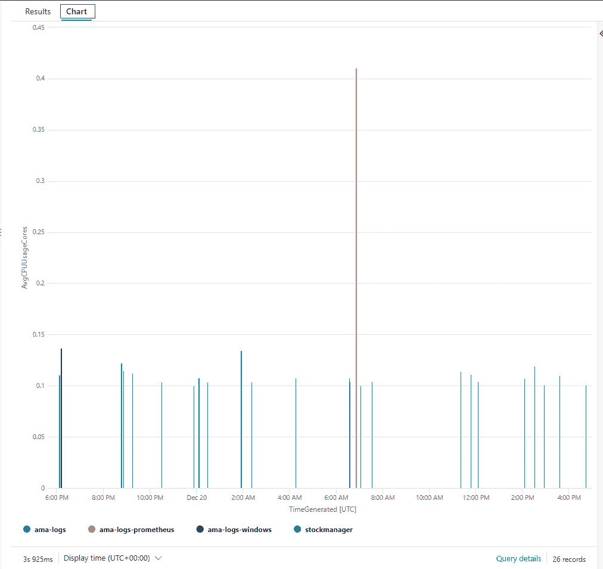

根本不需要额外的过滤。但是等等，还有呢！如果我们稍微调整一下，我们可以得到更多的改进。看一下同样的查询，但是有一点不同。

```
Perf
| where ObjectName == "K8SContainer" and CounterName == "cpuUsageNanoCores"
    and InstanceName !has 'stress'
    and CounterValue/1000000000 >= 0.10
| extend PodName = tostring(split(InstanceName, '/')[10])
| extend ClusterName = tostring(split(_ResourceId, '/')[8])
| extend CoreUsage = CounterValue/1000000000
| summarize AvgCPUUsageCores = avg(CoreUsage) by bin(TimeGenerated, 1m), PodName, ClusterName
```

注意我们在查询中上移了一些比较？我们甚至把压力舱排除在外，但是我们正在使用！有……当然这不会一样好对吗？


哦… 2.5 秒…那嗯…有意思。

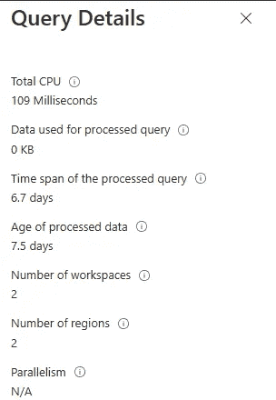

因此，我们对该查询使用了相同的 CPU 时间，但它比另一个具有完全相同数据的查询返回得更快，我们甚至使用了 has，这在技术上需要更多的处理。让我们再做一件事…让我们改变我们过滤压力的地方。

```
Perf
| where ObjectName == "K8SContainer" and CounterName == "cpuUsageNanoCores"
    and CounterValue/1000000000 >= 0.10
| extend PodName = tostring(split(InstanceName, '/')[10])
| where PodName != 'stress'
| extend ClusterName = tostring(split(_ResourceId, '/')[8])
| extend CoreUsage = CounterValue/1000000000
| summarize AvgCPUUsageCores = avg(CoreUsage) by bin(TimeGenerated, 1), PodName, ClusterName
```

现在，我们将在创建完 PodName 后立即查看。


2.2 秒…

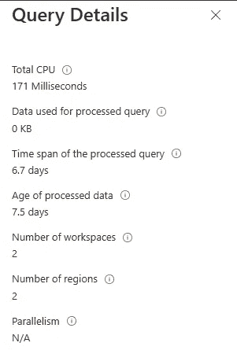

但是我们的 CPU 时间上升了？这个女巫的飞行器到底是什么？我们看到的是过滤的位置和类型会影响查询性能。更高效的查询减少了目标资源的来源压力，更快地获得您需要的内容。尝试这样的东西，努力理解如何格式化你的查询以提高效率。

我这里的数字可能与你无关。请记住，我的集群很小，没有发生任何真正的事情。如果您正在创建查询来生成警报或其他人们使用的指标，以确保您的集群是健康的、高性能的和可靠的，您希望确保您没有浪费时间。

这些文章往往让我看不懂。我也许应该开始计划我想要他们成为什么样的人，而不是边走边想点子，嗯？:).拆分和修改查询逻辑的基础知识在给出的所有示例中都是可用的。想一想作为数据消费者的你是如何想看到它的，不要羞于尝试找出如何将这种视觉变为现实。

如果你喜欢这个点击那个按钮，如果你想要别的或者更多，点击评论让我知道。