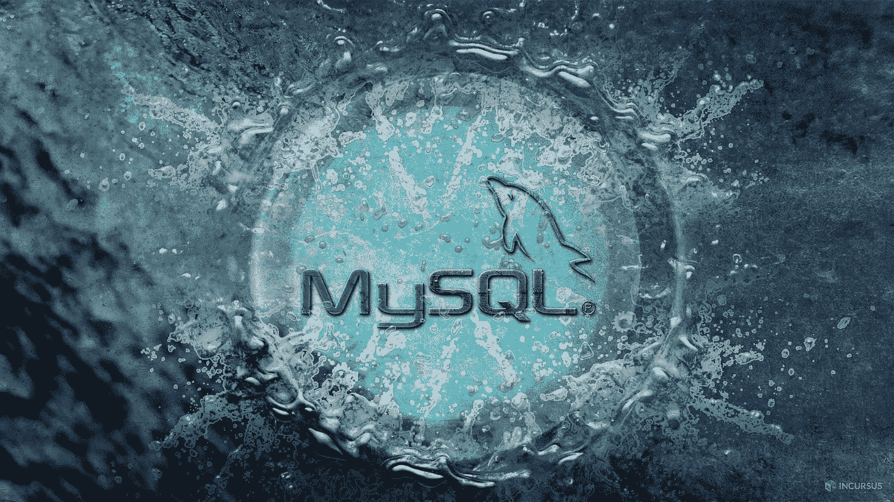

# MySQL 中分组最大查询的性能评估

> 原文：<https://itnext.io/assessing-performance-of-group-wise-max-queries-in-mysql-8d3056fb36fa?source=collection_archive---------1----------------------->

## 如何有效地在连接中找到最新的相关行



图片来源:英纳斯

# 介绍

关系数据库有时会很棘手。

我目前正在开发一个应用程序，处理我们客户拥有的一些资产。这些资产是在我们的平台上创建的，他们会不时更新一些信息。

我们以`Vehicles`为例。我有一个看起来像这样的表格结构:

```
CREATE TABLE `Vehicles` (
  `id` varchar(50) NOT NULL,
  `organizationId` varchar(50) NOT NULL,
  `plate` char(7) NOT NULL,
  `vehicleInfo` json DEFAULT NULL,
  `createdAt` timestamp NOT NULL DEFAULT CURRENT_TIMESTAMP,
  `updatedAt` timestamp NULL DEFAULT NULL ON UPDATE CURRENT_TIMESTAMP,
  PRIMARY KEY (`id`),
  UNIQUE KEY `unq_Vehicles_orgId_plate_idx` (`organizationId`,`plate`) USING BTREE,
  KEY `Vehicles_createdAt_idx` (`createdAt`),
);

CREATE TABLE `VehicleUpdates` (
  `id` varchar(50) NOT NULL,
  `organizationId` varchar(50) NOT NULL,
  `vehiclePlate` char(7) NOT NULL,
  `status` varchar(15) NOT NULL,
  `createdAt` timestamp NOT NULL DEFAULT CURRENT_TIMESTAMP,
  `updatedAt` timestamp NULL DEFAULT NULL ON UPDATE CURRENT_TIMESTAMP,
  PRIMARY KEY (`id`),
  KEY `VehicleUpdates_orgId_vhclPlt_createdAt_idx` (`organizationId`,`vehiclePlate`,`createdAt`) USING BTREE
);
```

两个表的关系是`M:N`，我可以使用`(organizationId, vehiclePlate)`找到给定车辆的所有更新。

现在，我的应用程序有了一个新的要求，即在归还车辆时，我还必须携带最新的更新信息。

经过一段时间的挖掘，我发现我的新需求有一个名字:“组级 Max”。

在撰写本文时，我的生产 MySQL 服务器正在 Amazon RDS 上运行版本`5.7.23`。`Vehicles`表有`15.832`行，`VehicleUpdates`有`271.910`行。

# 可用的解决方案

我偶然发现了瑞克·詹姆斯写的这个博客。他描述了问题，并提出了一些解决方案，考虑到他们的表现。我选了两个对我来说更有意义的。

> 公平地说，詹姆斯先生的建议只解决了我的一部分问题。我必须在另一个`LEFT JOIN`中使用它们，才能满足我的要求。

## 不相关的子查询

根据瑞克·詹姆斯的说法，这个解是`O(M)`，其中`M`是输出行数。因为我使用的是`5.7`，已经有了正确的索引，不能有重复的，所以这种方法工作得很好。

我写了一个这样的查询:

```
SELECT SQL_NO_CACHE vu1.*
    FROM VehicleUpdates AS vu1
    JOIN
      ( SELECT  vehiclePlate, organizationId, MAX(createdAt) AS createdAt
            FROM  VehicleUpdates
            where organizationId = @orgId
            GROUP BY organizationId, vehiclePlate
      ) AS vu2 USING (organizationId, vehiclePlate, createdAt);
```

这个查询的平均执行时间是`25 ms`。那似乎很有希望！

然后，我将`Vehicles`表添加到查询中，以解决我的实际问题:

```
SELECT SQL_NO_CACHE v.*, vu1.* 
FROM Vehicles AS v
LEFT JOIN (
        VehicleUpdates AS vu1
        JOIN
          ( SELECT  vehiclePlate, organizationId, MAX(createdAt) AS createdAt
                FROM  VehicleUpdates
                GROUP BY organizationId, vehiclePlate
          ) AS vu2 ON vu1.organizationId = vu2.organizationId
                and vu1.vehiclePlate = vu2.vehiclePlate
                and vu1.createdAt = vu2.createdAt
    )
        ON vu1.organizationId = v.organizationId 
            AND vu1.vehiclePlate = v.plate;
```

不幸的是，这导致平均执行时间为`2,200 ms`。对我来说完全是交易破坏者😞。

> 我永远不会在生产中运行这种全表扫描。我至少会在 organizationId 列上有一个条件，并且可能还会设置一个`LIMIT`子句。让我们试一试！

然后我继续说:

```
SELECT SQL_NO_CACHE v.*, vu1.* 
FROM Vehicles AS v
LEFT JOIN (
        VehicleUpdates AS vu1
        JOIN
          ( SELECT  vehiclePlate, organizationId, MAX(createdAt) AS createdAt
                FROM  VehicleUpdates
                GROUP BY organizationId, vehiclePlate
          ) AS vu2 ON vu1.organizationId = vu2.organizationId
                and vu1.vehiclePlate = vu2.vehiclePlate
                and vu1.createdAt = vu2.createdAt
    )
        ON vu1.organizationId = v.organizationId 
            AND vu1.vehiclePlate = v.plate
**WHERE v.organizationId = '<SOME ORGANIZATION ID>'**
LIMIT 100;
```

结果呢？🥁🥁🥁…:我的平均成绩是`320 ms`。好多了，但我的申请还是没通过😢。

我还没准备好放弃！在检查了上面查询的`EXPLAIN`的输出后，我注意到最内层的`JOIN`是使用`[range](https://dev.mysql.com/doc/refman/5.6/en/explain-output.html#jointype_range)`生成的，而所有其他的都使用了`[ref](https://dev.mysql.com/doc/refman/5.6/en/explain-output.html#jointype_ref)`。

结果是最内层的`JOIN`查询效率很低，因为它扫描了整个`VehicleUpdates`表，结果却被顶层`LEFT JOIN`中的`ON`子句过滤掉了。

由于 MySQL 引擎不会为我优化这一点，我不得不自己做，在最内层的查询中添加一个`WHERE`子句，将搜索的行数限制为只有那些具有特定`organizationId`的行:

```
SELECT SQL_NO_CACHE v.*, vu1.* 
FROM Vehicles AS v
LEFT JOIN (
        VehicleUpdates AS vu1
        JOIN
          ( SELECT  vehiclePlate, organizationId, MAX(createdAt) AS createdAt
                FROM  VehicleUpdates
                **WHERE organizationId = '<SOME ORGANIZATION ID>'**
                GROUP BY organizationId, vehiclePlate
          ) AS vu2 ON vu1.organizationId = vu2.organizationId
                and vu1.vehiclePlate = vu2.vehiclePlate
                and vu1.createdAt = vu2.createdAt
    )
        ON vu1.organizationId = v.organizationId 
            AND vu1.vehiclePlate = v.plate
WHERE v.organizationId = '<SOME ORGANIZATION ID>'
LIMIT 100;
```

这给了我平均执行时间`50 ms`。现在我们正在谈话😊！再次运行`EXPLAIN`向我展示了所有使用`ref`的连接。

然而，这个查询相当复杂。在最内层的子查询中添加一个`WHERE`子句的需要不允许我创建一个视图来简化它😔。

## 左连接方法

瑞克·詹姆斯表示，这种方法取决于`join_buffer_size`。至少在理论上，它不可能像不相关的子查询那样快。

我以这样一个查询结束:

```
SELECT  vu1.*
    FROM  VehicleUpdates AS vu1
    LEFT JOIN  VehicleUpdates AS vu2 
        ON vu1.organizationId = vu2.organizationId 
        AND vu1.vehiclePlate = vu2.vehiclePlate
        AND vu2.createdAt > vu1.createdAt
    WHERE vu2.id IS NULL;
```

平均执行时间约为`40 ms`。不如等价的不相关子查询方法好，但仍然可以接受😅。

好了，现在开始真正的问题，我得到了:

```
SELECT SQL_NO_CACHE v.*, vu1.*
FROM  Vehicles AS v
LEFT JOIN VehicleUpdates AS vu1 
    ON v.plate = vu1.vehiclePlate 
        AND v.organizationId = vu1.organizationId
LEFT JOIN  VehicleUpdates AS vu2 
    ON vu1.organizationId = vu2.organizationId 
        AND vu1.vehiclePlate = vu2.vehiclePlate
        AND vu2.createdAt > vu1.createdAt
    AND vu2.id IS NULL;
```

如果没有`LIMIT`子句，这个查询平均运行`12,000 ms`。那太多了😲😲😲！！！

好的，然后我写了实际的生产查询:

```
SELECT SQL_NO_CACHE v.*, vu1.*
FROM  Vehicles AS v
LEFT JOIN VehicleUpdates AS vu1 
    ON v.plate = vu1.vehiclePlate 
        AND v.organizationId = vu1.organizationId
LEFT JOIN  VehicleUpdates AS vu2 
    ON vu1.organizationId = vu2.organizationId 
        AND vu1.vehiclePlate = vu2.vehiclePlate
        AND vu2.createdAt > vu1.createdAt
**WHERE v.organizationId = '<SOME ORGANIZATION ID>'**
    AND vu2.id IS NULL
**LIMIT 100;**
```

结果呢？🥁🥁🥁…:我得到了与没有`Vehicles`表的查询相同的`40 ms`🎉🎉🎉！

# 结论

事实证明，`LEFT JOIN`的方法表现稍好，这与我对瑞克·詹姆斯博客文章的预期相反。

差异非常小，可能是由于统计噪声，因为我没有使用任何合适的基准工具或严格的方法。我对拥有最少和最多相关车辆的`organizationId`进行了 20 次查询，然后计算了执行时间的算术平均值。我更愿意说两者有相似的表现。

然而，我最终选择了`LEFT JOIN`方法，因为它允许我创建一个视图来简化最终的查询:

```
CREATE VIEW LatestVehicleUpdates AS
SELECT vu1.id, vu1.organizationId, vu1.vehiclePlate, vu1.status, vu1.createdAt, vu1.updatedAt
FROM VehicleUpdates AS vu1 
LEFT JOIN  VehicleUpdates AS vu2 
    ON vu1.organizationId = vu2.organizationId 
        AND vu1.vehiclePlate = vu2.vehiclePlate
        AND vu2.createdAt > vu1.createdAt
WHERE vu2.id IS NULL;
```

然后，我可以运行以下查询来解决我最初的问题:

```
SELECT v.*, lvu.*
FROM Vehicles
LEFT JOIN LatestVehicleUpdates as lvu
    ON v.organizationId = lvu.organizationId
    AND v.plate = lvu.vehiclePlate
WHERE organizationId =  '<SOME ORGANIZATION ID>'
LIMIT 100;
```

那都是乡亲们！

你喜欢你刚刚读的吗？给我买杯啤酒(如果早于下午 5 点，我可能会泡杯咖啡):

[](https://tippin.me/@hbarcelos90) [## tippin.me

### 使用闪电网络和比特币，通过网络收取小额小费和微支付的简单方法。

tippin.me](https://tippin.me/@hbarcelos90)