# 面向 JavaScript 开发人员的 AST

> 原文：<https://itnext.io/ast-for-javascript-developers-3e79aeb08343?source=collection_archive---------0----------------------->

> **TL；这篇文章是我最近在斯德哥尔摩会议上的发言。你可以在这里查看幻灯片[https://www . slide share . net/bohdaniashenko/ast-for-JavaScript-developers](https://www.slideshare.net/BohdanLiashenko/ast-for-javascript-developers)**

为什么要抽象语法树？

如果你检查任何现代项目的 devDependencies，你会看到它在过去几年中增长了多少。我们在那里有各种各样的工具:JavaScript transpiling、代码精简、CSS 预处理、eslint、appellister 等等。这些是 JavaScript 模块，我们并没有将它们发布到产品中，但是它们在我们的开发过程中扮演着非常重要的角色。所有这些工具，无论如何，都是建立在 AST 处理之上的。

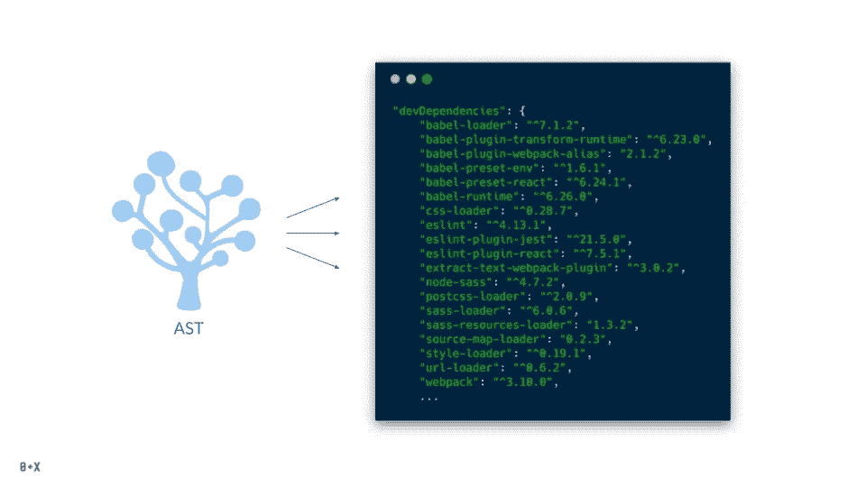

所有这些工具，无论如何，都是建立在 AST 处理之上的。

我会谈到一个计划。我们从什么是 AST 以及如何用普通代码构建它开始。然后，我们将略微涉及一些最流行的用例以及构建在 AST 处理之上的工具。并且，我计划结束谈论我的项目 js2 流程图，它将是您在使用 AST 时可以构建的很好的演示。所以，和我在一起，让我们开始吧。

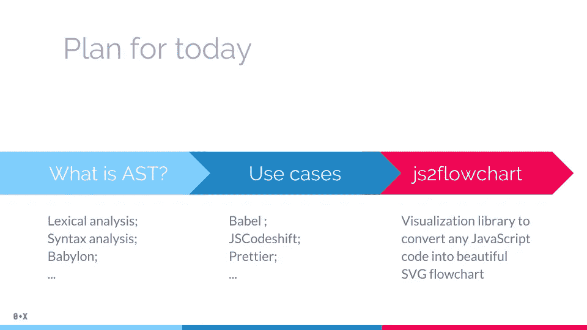

什么是抽象语法树？

> 它是一种分层的程序表示，根据编程语言的语法来表示源代码结构，每个 AST 节点对应于一个源代码项。

好吧。让我们看看例子。

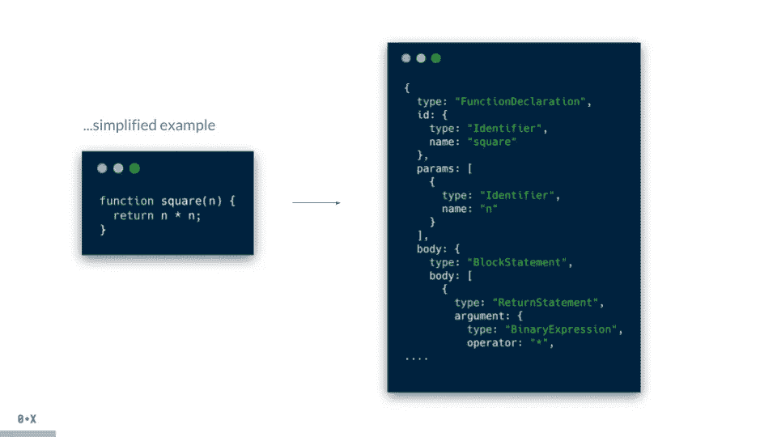

很简化。

但这是主旨。从纯文本中，我们得到了树状的数据结构。代码中的项与树中的节点匹配。

如何从明码中获取 AST？我们知道编译器已经在这么做了。让我们检查一个普通的编译器。

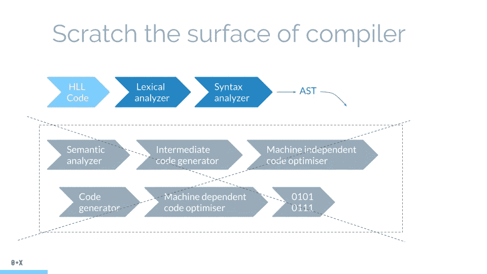

幸运的是，我们不需要经历它的所有阶段，将高级语言代码转换成比特。我们只对词法和句法分析感兴趣。这两个步骤在从代码生成 AST 的过程中起主要作用。

第一步。词法分析器，也称为扫描器，它读取字符流(我们的代码)，并使用定义的规则将它们组合成令牌。此外，它还会删除空白字符、注释等。最后，整个代码串将被分割成一个令牌列表。

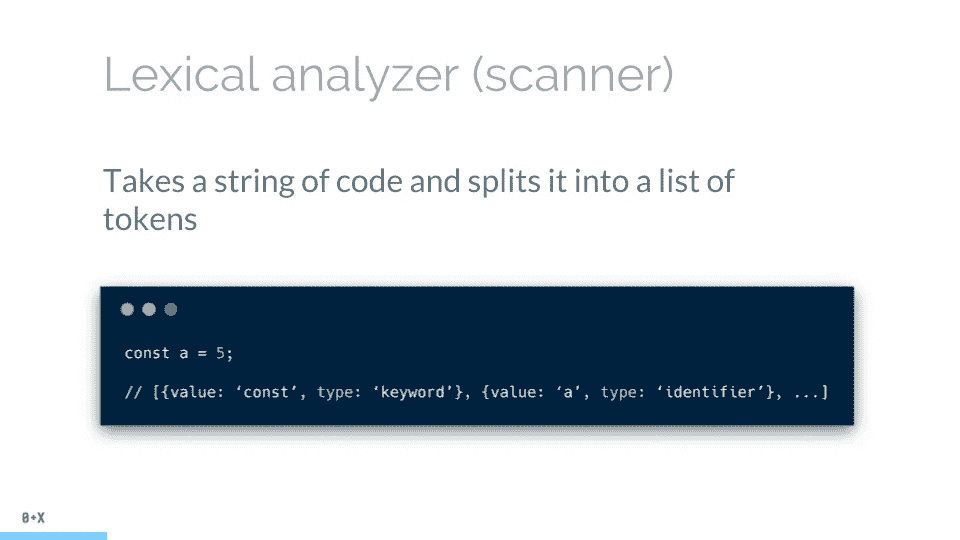

当词法分析器读取源代码时，它逐字母扫描代码；当它遇到一个空格、操作符或特殊符号时，它决定一个单词是完整的。

第二步。语法分析器，也称为解析器，将在词法分析后获取一个普通的标记列表，并将其转换为树表示，验证语言语法并在发生语法错误时抛出语法错误。

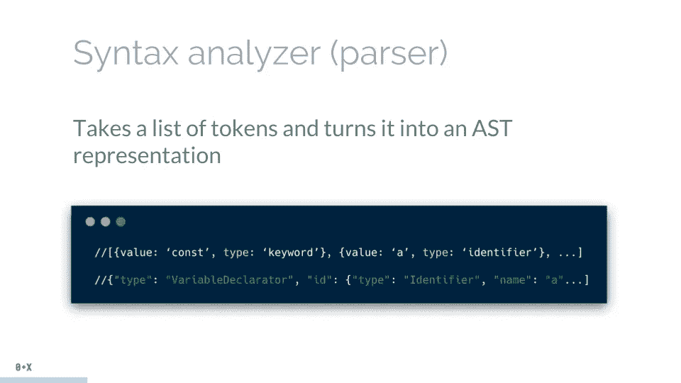

在生成树的时候，一些解析器省略了不必要的标记(比如多余的括号),所以他们创建了“抽象语法树”——虽然不是 100%的代码匹配，但足以知道如何处理它。另一方面，完全覆盖所有代码结构的分析器生成称为“具体语法树”的树。

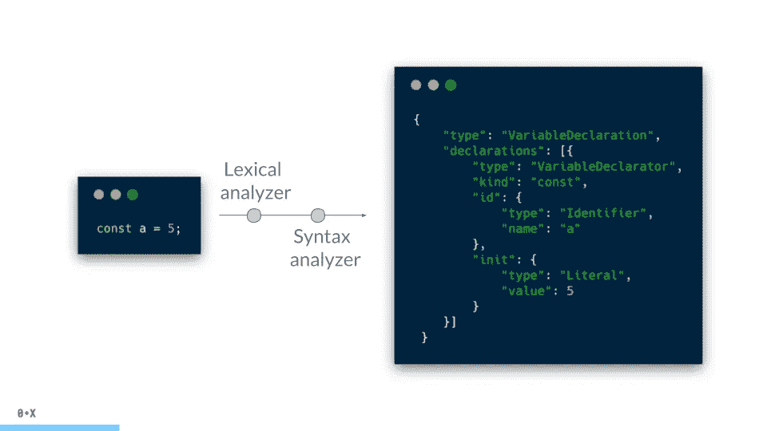

我们最后得到的。

想了解更多关于编译器的知识吗？

超级小编译器。可以从这个回购开始。这是一个用 JavaScript 编写的编译器所有主要部分的超级简化的例子。它有大约 200 行实际代码，背后的想法是将 Lisp 编译成 C 语言。所有代码都包含注释和解释。

[https://github.com/jamiebuilds/the-super-tiny-compiler](https://github.com/jamiebuilds/the-super-tiny-compiler)

LangSandbox。还有一个不错的项目要检查。它说明了如何构建编程语言。有一个如何做到这一点的文章或书籍(如果你喜欢的话)的列表。所以，它走得更远了一点，因为在这里你可以编写你的语言，编译成 C/字节码，然后执行，而不是把 Lisp 编译成 C(就像上一个例子那样)。

https://github.com/ftomassetti/LangSandbox

我可以用图书馆吗？当然，有很多图书馆。你可以访问一个探索者，挑选一个你喜欢的。有一个 live editor，您可以在其中使用 AST 解析器。除了 JavaScript 之外，它还包含许多其他语言。

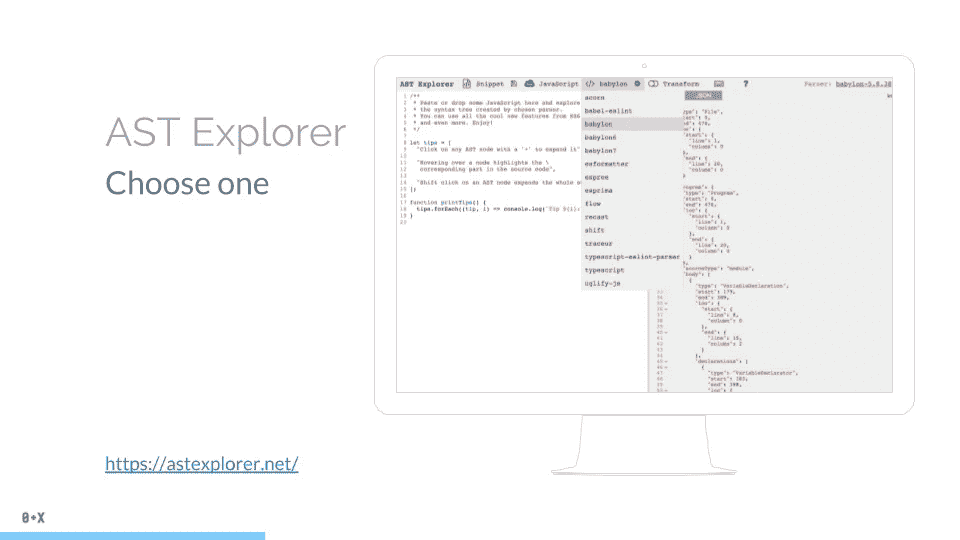

【https://astexplorer.net/ 

我想特别强调其中的一个，我认为是非常好的一个，叫做巴比伦。

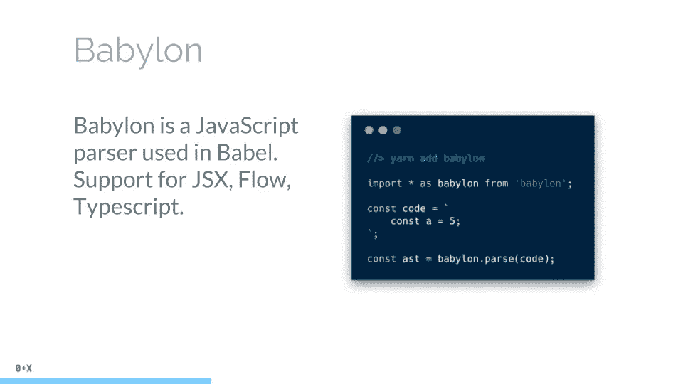

用在巴别塔里，也许是它流行的一个原因。因为它是由 Babel project 支持的，所以你可以预期它会一直更新新的 JS 特性，这是我们在过去几年中经常看到的。所以，当我们得到下一个东西，像“异步迭代”(无论什么)，这个解析器不会告诉你“意外的令牌”。此外，它有一个相当好的 API，并且易于使用。

好了，现在你知道如何为代码生成 AST 了。让我们转到现实生活中的用例。

我想谈的第一个用例是代码转换，当然还有 Babel。

> Babel 不是一个“支持 ES6 的工具”。嗯，是的，但它远不止是关于什么的。

许多人将 Babel 与 ES6/7/8 特性的支持联系在一起。事实上，这也是我们经常使用它的原因。但它只是一组插件。我们也可以用它来缩小代码，进行与 React 相关的语法转换(比如 JSX)，流插件等等。

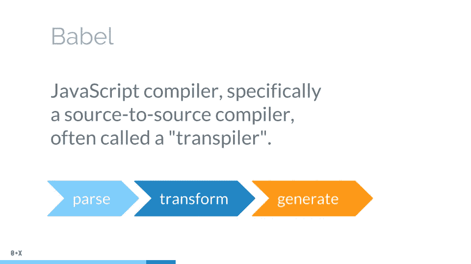

Babel 是一个 JS 编译器。在高层次上，它有 3 个运行代码的阶段:解析、转换和生成。你给 Babel 一些 JavaScript 代码，它修改代码并重新生成新代码。它是如何修改代码的？没错。它构建 AST，遍历它，基于应用的插件修改它，然后从修改后的 AST 生成新代码。

让我们在一个简单的代码示例中看到这一点。

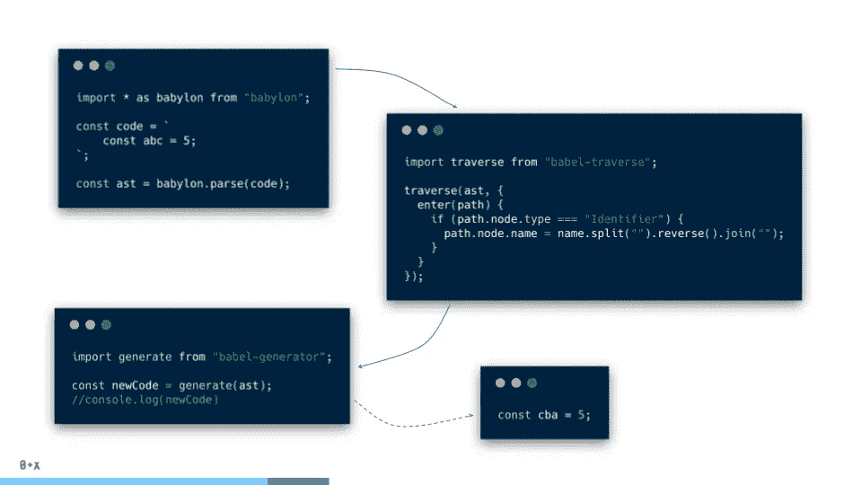

正如我之前提到的，Babel 使用 Babylon，所以，我们首先解析代码，然后遍历 AST 并反转所有变量名。最后一步—生成代码。完成了。正如你在这里看到的，第一阶段(解析)和第三阶段(代码生成)看起来很普通，这就是你每次要做的。所以，巴别塔照顾他们，因为你唯一真正感兴趣的，是 AST 转换。

当你开发 Babel-plugin 时，你只需描述节点“访问者”,它将改变你的 AST。

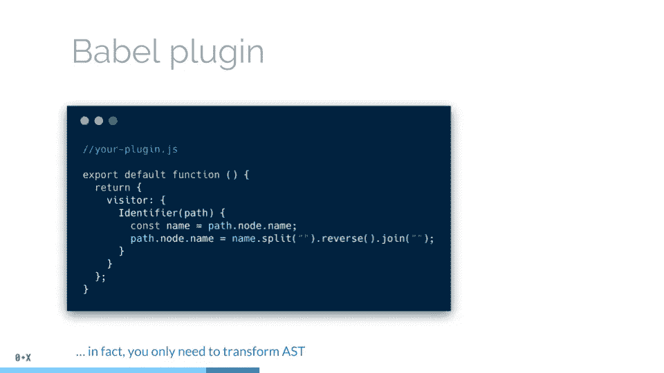

把它添加到你的 Babel 插件列表中，在你的 webpack 配置中设置 babel-loader，然后我们就可以开始了。

如果你想了解更多关于如何构建你的第一个巴别塔插件，你可以查阅巴别塔手册。

[https://github.com/jamiebuilds/babel-handbook](https://github.com/jamiebuilds/babel-handbook)

让我们继续，我想提到的下一个用例是自动化代码重构和 JSCodeshift。

比方说，你想把所有老式的匿名函数替换成短小精悍的箭头函数。

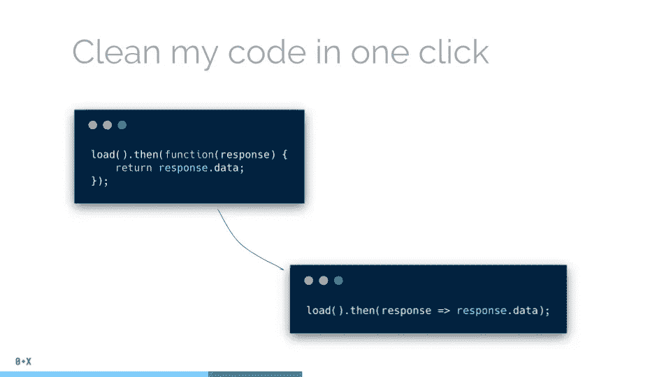

您的代码编辑器很可能无法做到这一点，因为这不是简单的查找-替换操作。这就是 jscodeshift 发挥作用的地方。

如果你听到“jscodeshift ”,你很可能会把它和“codemods”放在一起听，这在第一时间会让人感到困惑。Jscodeshift 是一个运行“codemods”的工具包。“codemod”是实际描述应该对 AST 进行什么转换的代码。所以，这个想法和巴别塔及其插件非常相似。

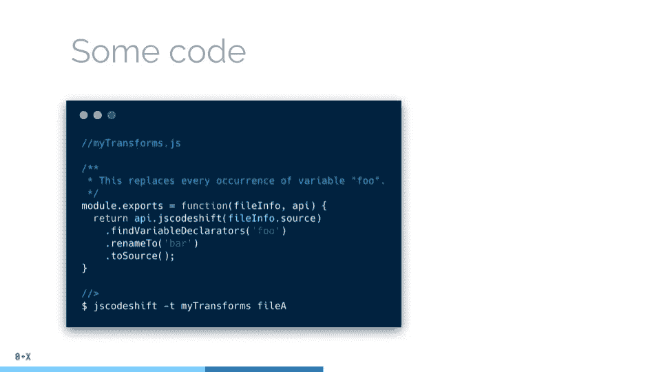

你可以看到它看起来几乎像一个巴别塔插件。

因此，如果你想创建“自动化的方法”来将你的代码库迁移到新的框架版本，这里有一条路可以走。例如，这里是 react 16 属性类型重构。

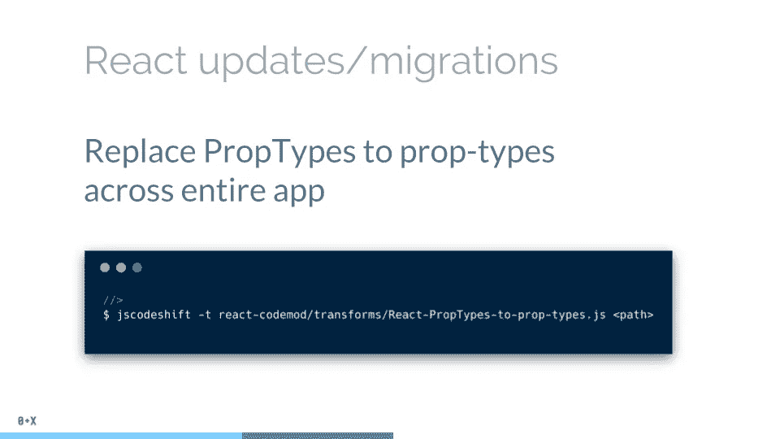

希望大家都已经迁移到 16 版本了；)

尝试一下，已经创建了许多不同的代码模式，您可以通过不手动创建来节省时间。

https://github.com/facebook/jscodeshift；【https://github.com/reactjs/react-codemod 

我想稍微提一下的最后一个用例更漂亮，因为可能每个人都使用它的日常工作。

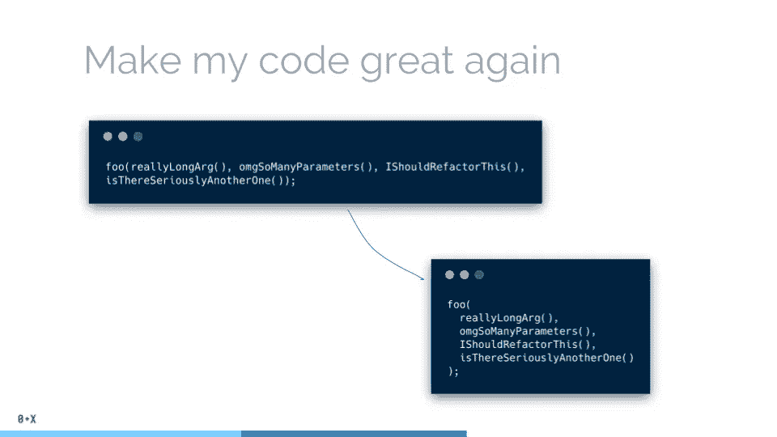

更漂亮地格式化我们的代码。它将打破长行，清理空间，括号等。所以它将代码作为输入，并将修改后的代码作为输出返回。听起来很熟悉，对吧？没错。

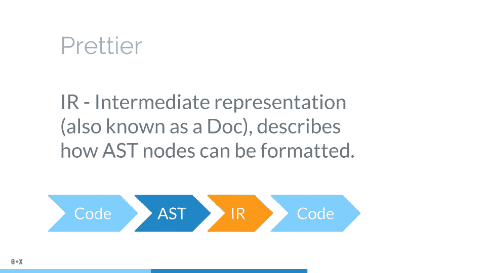

想法还是一样的。首先，获取代码并生成 AST。然后，更漂亮的魔术就要发生了。AST 将被转换为“中间表示”或“Doc”。在高层次上，AST 节点将被扩展，提供它们在格式方面如何相互关联的信息，例如，函数的参数列表应该被视为一组项目。所以如果列表很长，一行写不下，就把每个参数分成单独的一行，等等。然后，被称为“打印机”的主要算法将通过 IR 并基于整个图片决定如何格式化代码。

同样，如果你想了解漂亮印刷背后的更多理论，实际上看起来并不那么简单，有一本书可以让你深入了解。

[http://home pages . INF . ed . AC . uk/wadler/papers/appellister/appellister . pdf](http://homepages.inf.ed.ac.uk/wadler/papers/prettier/prettier.pdf)

好了，今天我想说的最后一件事是我的库 js 2 flow trade(Github 上的 4.2 k stars)。

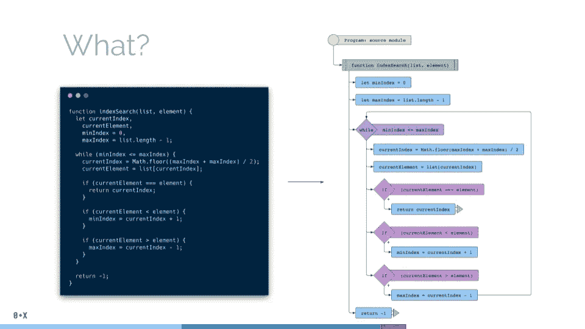

正如它的名字一样，它接受 JS 代码并生成 SVG 流程图。

这是一个很好的例子，因为它告诉你，当你有了 AST 代码表示，你可以做任何你想做的事情。没有必要把它放回代码串中，你可以画出它的流程图，无论你想要什么。

用例是什么？您可以通过流程图解释/记录您的代码，通过视觉理解学习其他代码，为任何用有效的 JS 语法简单描述的过程创建流程图。

现在尝试的最简单的方法是——使用 live editor。

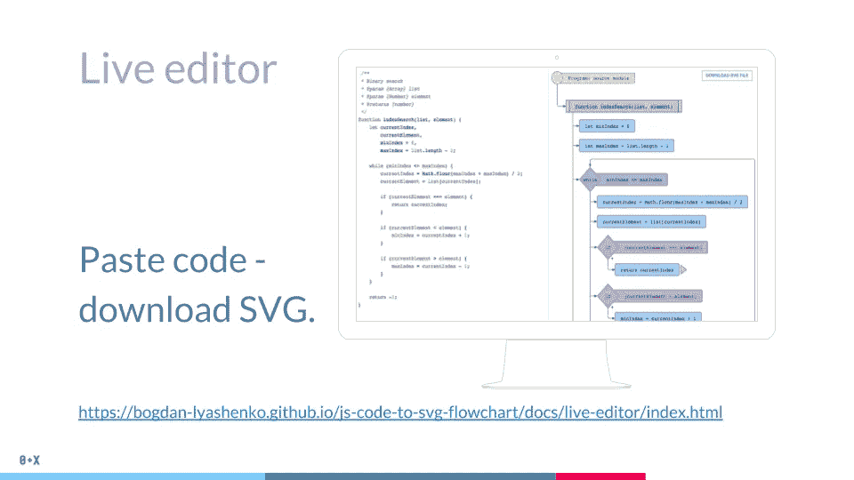

[https://bogdan-lyashenko . github . io/js-code-to-SVG-flow trade/docs/live-editor/index . html](https://bogdan-lyashenko.github.io/js-code-to-svg-flowchart/docs/live-editor/index.html)

试试看。此外，您可以从代码中使用它，或者，它也有 CLI，所以您可以只从每个文件指向您想要生成的 SVG 文件。此外，还有 VS 代码扩展(readme 中的链接)。

那么，它还能做什么呢？首先，除了生成所有代码的大方案之外，你还可以指定方案应该有多详细的抽象层次。

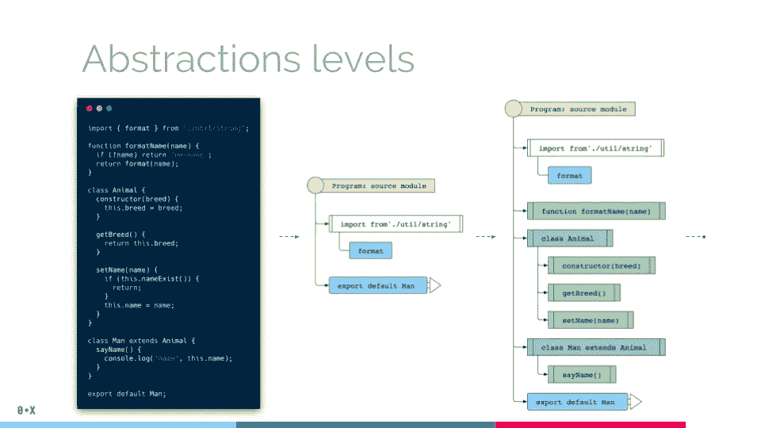

这意味着，例如，你可以只画出模块输出的内容，或者只画出类定义，或者函数定义和它们的调用。然后，您可以生成一个演示文稿，其中每张幻灯片都更深入地探究细节。

还有一大堆方便的工具可以帮助你修改树。例如，你可以在这里看到。“forEach”方法调用，这只是方法调用，但我们可以指定它们应该被视为循环，因为我们知道 forEach 是一个循环，所以，让我们立即将其渲染为一个循环。

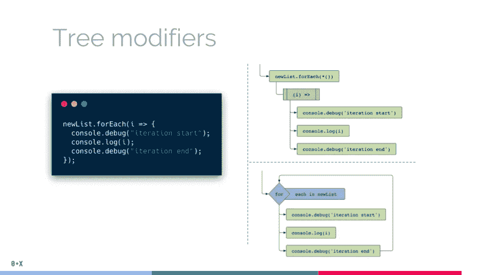

好吧，它是如何工作的？

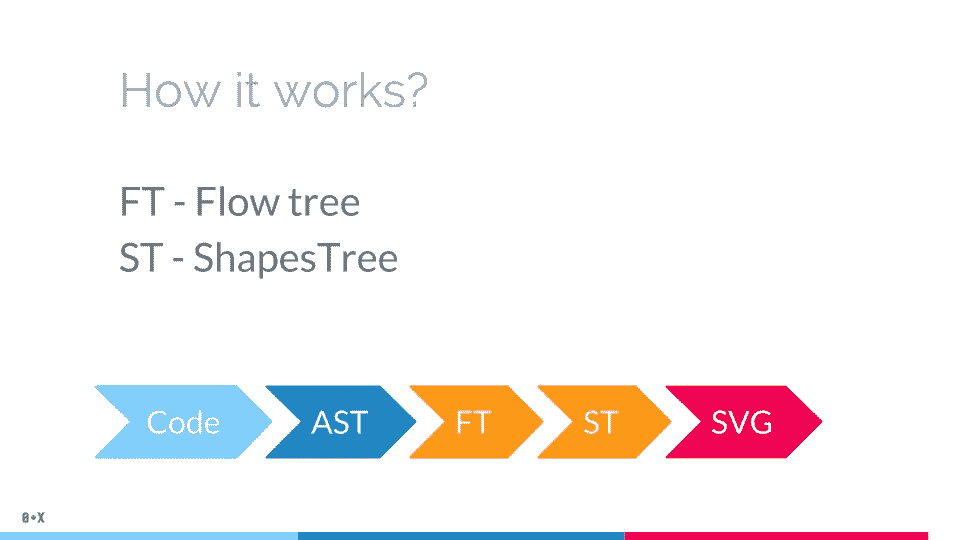

首先，将代码解析到 AST，然后，我们遍历 AST 并生成另一棵树，我称之为 FlowTree。它省略了许多小的、不重要的标记，但是把关键块放在一起，比如函数、循环、条件等等。之后，我们遍历 FlowTree 并从中创建 ShapesTree。ShapesTree 的每个节点都包含关于其视觉类型、定位、树中的连接等信息。最后一步，我们遍历所有的形状，并为每个形状生成 SVG 表示，将所有形状组合成一个 SVG 文件。

查看一下[https://github . com/波格丹一世-利亚申科/js-code-to-SVG-流程图](https://github.com/Bogdan-Lyashenko/js-code-to-svg-flowchart)。

如果你喜欢这篇文章，并想了解我下一篇文章的更新，请在 twitter 上关注我 [@bliashenko](https://twitter.com/bliashenko) ！