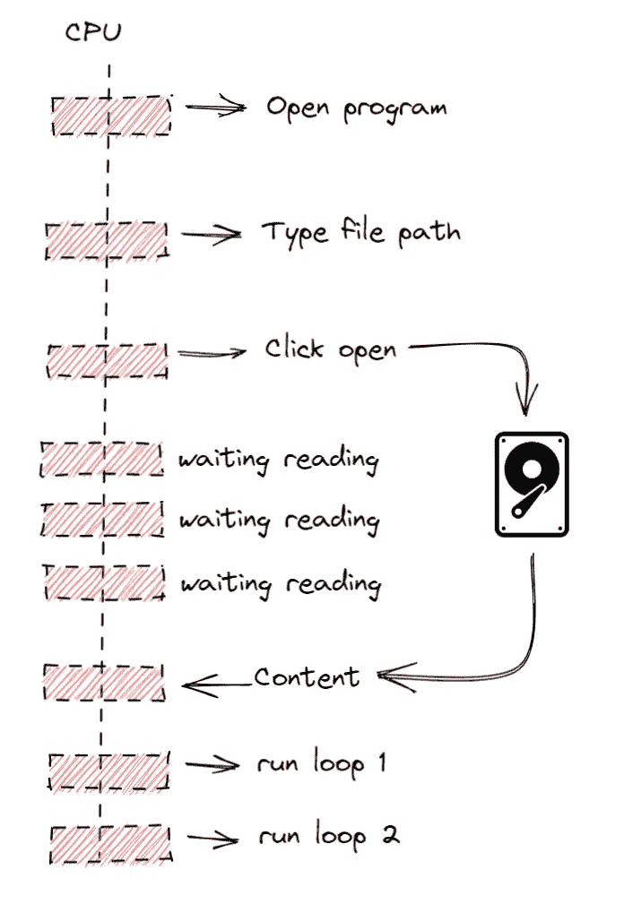
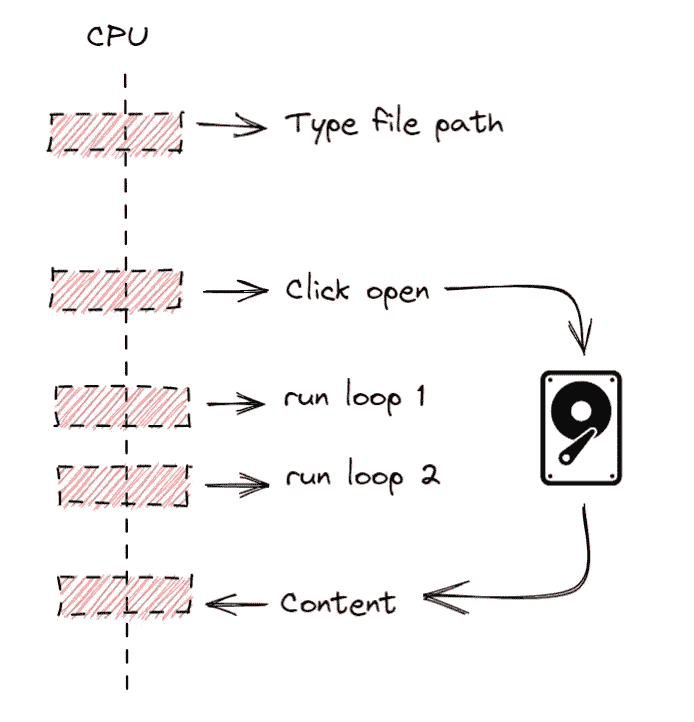

# 异步/等待—幕后发生了什么

> 原文：<https://itnext.io/async-await-what-happens-under-the-hood-eef1de0dd881?source=collection_archive---------0----------------------->

[Freepik 上 standret 的图片](https://br.freepik.com/fotos-gratis/mao-de-mecanico-verificando-e-consertando-um-carro-quebrado-na-garagem-de-servico_10521910.htm#query=car%20engine%20broken&position=1&from_view=search)

使用 Async/Await 很简单，但是这两个关键字隐藏了很多东西。为了充分理解它是如何工作的，我们必须浏览一堆概念，其中一些有点模糊，但我希望能够揭示任务、线程和并发性背后的奥秘。拿起你的咖啡，跟我来。

# **并发不是并行**

这两个主题经常被混淆，但它们是完全不同的，理解它们的区别对我们的主题是至关重要的。让我们来探究一下这些概念之间的区别。

想象一下，你有一个非常复杂的方程，可以分成两个小部分，你需要写一个程序来求解这个方程。因为方程可以分解，所以等待第 1 部分完成来触发第 2 部分的计算是没有意义的。在理想世界中，正确的做法应该是同时计算它们。但这只有在您拥有一个以上内核的处理器时才有可能，原因如下。

操作系统有我们所说的任务调度器。任务调度器的职责是为每个进程提供 CPU 时间。

进程是正在执行的程序的一个实例，每个进程被细分为线程。线程是将由调度器在给定时间执行的一组指令/代码。

当时的处理器只有一个内核，但一切似乎都在同时运行，这怎么可能呢？问题是，任务调度器在分配时间方面非常有效，时间片非常非常短，所以看起来一切都是并行运行的，但事实并非如此，它只是以非常快的速度一个接一个地运行。

好吧，我说每一片时间真的很短。如果我的指令集没有在这段时间内完成，会发生什么？

线程挂起，CPU 时间给下一个。

当发生这种情况时，可能需要释放 CPU 缓存中分配的一些变量，以便为这个新线程的变量提供空间，这会导致开销。

进程越多，这个操作发生的次数就越多。这就是当你有很多程序在运行，而只有一个内核来处理所有事情时，计算机变慢的原因之一。

通常用于管理所有这些事情的算法称为循环法，而让另一个线程执行的过程称为上下文切换。

回到我们的计算，如果我们有一个单核处理器，即使我们将计算分成两个线程，正如我们看到的，它们仍然会按顺序执行。对于真正的并行，你需要有一个以上的内核，这样每个内核就可以同时独立地执行代码(真正的)。

我解释了所有这些关于并行性的东西，以便弄清楚:**并发性不同于并行性，**它们可以一起使用，但远不是一回事。并行性是指在同一时间做多件事情，而并发性是指在别人做你正在等待的事情时，你在做别的事情。

让我们想象一下，我们有一台单核计算机，运行我们构建的 C#程序，这个程序由一个带有简单 UI 的文本文件阅读器组成。

我们启动程序。当这种情况发生时，直到我们输入一些东西，程序是空闲的，因为我们没有执行任何东西，现在我们输入值。键入的动作需要代码活动来显示我们在输入字段中键入了什么，所以在那个线程中有代码正在执行。现在，我们单击打开文件，操作系统将查找该文件，并向我们提供需要解析并显示在屏幕上的内容(以字节为单位)。

假设我们使用同步操作系统调用，我们将会得到类似下图的结果。

CPU 不会等待您的处理完成，它将继续循环过程，但我们的线程不会处理任何其他事情，直到我们获得内容的返回。

请注意，当操作系统从磁盘读取数据时，我们的线程仍在运行，但事实上，没有代码被执行，因为我们只是在等待操作系统返回内容。线程被锁定了，我们在这段 CPU 时间里什么也没做，不是很好吗？事实上，这是最糟糕的。我们的程序将对任何类型的输入(键盘或鼠标)完全没有反应，因为我们的线程正在等待响应，不能做任何其他事情。就像你看着等着水烧开，然后什么都不做，直到它发生。

如果我们使用异步计算，我们将得到下图

现在，我们的线程可以自由地处理其他事情，而不会得到操作系统的响应

事情是这样的:我们请求文件的内容，当操作系统正在寻找它时，我们释放负责调用的线程来做其他事情。当操作系统获得所有数据时，会调用一个回调，代码将继续执行，文本将显示出来。这种方法将使 UI 具有响应性，因为线程可以在等待操作系统响应的同时处理键盘输入或鼠标移动。

我们称之为异步是因为当我们等待某事发生时，我们可以做另一件事。每当我们执行一个不受 cpu 限制的进程时，使用异步编程是一个好主意。

在我们深入了解异步是如何工作的之前，让我们再多谈一点线程，更具体地说是线程池。

# **线程池**

一般来说，在. NET 进程中，线程的数量与可用的处理器内核数量直接相关，简单的一对一关系。但是如果。NET 认为系统需要更多的线程才能运行良好，它将自己创建更多的线程，这些线程将成为线程池的一部分。

ThreadPool 是一个长期存在的线程集合，可用于执行任务。将这些线程放在长期集合中的原因是为了使重用这些线程成为可能。

当属于一个线程的任务完成时，这个线程被再次放入线程池，以便在将来的执行中重用

创建一个线程是一项计算开销很大的任务，它们也需要几兆的内存，所以大量的线程和少量的线程一样糟糕，你还记得上下文切换过程吗？大量的线程相当于大量的上下文切换。这就是为什么依赖知道如何调优这些东西的线程池引擎总是好的，而不是显式地创建许多线程并期望最好的结果。

考虑一个 WebAPI，如果我们的 web 服务器只有两个内核，我们将有两个线程，但是如果我们有两个请求正在运行，并且第三个请求被触发，会发生什么呢？。NET 会注意到我们的两个线程都很忙，并将创建另一个线程来处理请求。如果我们使用异步编程，这两个线程被完全阻塞的几率会低得多，因为最耗时的进程通常与 I/O 相关，并且 I/O 操作不再阻塞现有的线程。

你可能会说，现在大多数计算机都有很多内核，通过在这些内核之间分配处理任务，它们可以处理很重的负载。实际上，它们非常强大，但是最近，我们开始越来越多地使用一种几乎依赖于单核环境的技术:容器。容器往往是单核的，在这种情况下，拥有一个大小合适的线程池是必不可少的，这使得异步编程对于应用程序的良好运行至关重要。

现在我们已经了解了线程和线程池，是时候了解任务了

# **任务**

基本上，我们可以把任务看作是要执行的一项工作。

想象一下，我们有一个部门，你和你的一个朋友负责去档案室为管理档案室的人申请一个特定的文件。你有一个主管，他与那些客户交谈，满足需求，并把它交给你。

客户 1 到了。你的主管与客户交谈，获得他们的要求，填写正式要求，当他看到你和你的朋友都在角落里时，他随机选择你们中的一个去档案室拿他需要的东西。

在这个场景中，我们有以下内容。

*   客户端是一段要求一些数据(I/O)的代码
*   管理程序是线程池，它管理线程并分派要完成的工作(任务)。
*   线索是你和你的朋友。你们是努力工作的人，是会完成既定任务的人。
*   任务是将由线程(您)执行的一项工作。在这种情况下，去档案部门询问负责文件的人。

好的一面是，线程池可以接收一堆任务，当线程可用时，任务将被分派。如果线程池有很多任务未完成，可以创建一个新的工人来加入您的团队并提高性能，但只有在值得的情况下，雇佣(创建一个新线程)才是昂贵的:)

当你从归档部门回来时，你不只是带着文档回来，你还带着你的任务需求回来。在这个需求中，您有一些数据，比如任务的 ID 及其状态。附加到这个需求的是这个任务的结果，在这种情况下，是一个文档(如果没有找到，则没有文档)。这就是为什么 Task 有一个泛型参数，它总是返回一个 Task of something(如果你期望方法返回值的话)。对于您在存档部门的研究，这是一项任务<document>。</document>

现在你把文件还给你的客户了。你所要做的就是在等候室打电话给他，因为你的客户请求了一个异步任务，它不会呆在柜台等你去拿他的文件。很快，我们将发现如何打电话给你的客户来传达他们的要求，下一位，请。

现在我们也有了任务，是时候理解异步代码的工作流程了。

# **进入异步**

让我们看看你执行的任务的内容

异步方法的响应总是一项任务

正如我们所看到的，该方法不返回字符串，而是返回一个带有可能包含内容的字符串的任务。

如果您使用 VisualStudio Intellisense 或其他类型的自动完成或提示功能，您将看到两个返回结果字符串的方法:`.Wait()`和`.Result()`。不要使用这些方法，它们是阻塞方法，您的代码不会异步运行。

如果您以异步方式执行您的工作，而归档负责人在寻找文档，您可以返回并获取一个新任务，以交付给归档部门的另一个人。使用`.Wait()`或`.Result()`意味着你要等待这个人查看整个文档，直到他找到(或找不到)文档并把它还给你。

让我们看看异步运行的方法。

`ContinueWith()`方法接收一个`Action<Task<string>>`，它将在任务完成时被触发，也就是说，当你带着正式的需求和文档回来时。

但是如果找不到文档会怎么样呢？在这种情况下，您的客户机将收到一个空响应，因为这段代码不处理异常。要处理它们，您必须手动实现它。

好吧！现在我们可以工作了，但是代码很糟糕。14 行读一个文件？不会吧。

这就是为什么 C#团队在 C# 5 中实现了`async/await`关键字。在下面的例子中，我们不再只是打印结果，我们实际上得到它并返回它。使用旧的异步方式来制作这样的东西真的很难，因为我们会遇到很多同步问题。使用新的做事方式，我们的代码会变成这样。

好多了，对吧？注意，方法签名从`public Task<string>`变成了`public **async** Task<string>`，现在在`return`语句后面有了`await`关键字。为什么会这样？因为现在引擎盖下发生了很多事情，这就是我们现在将要看到的。

# 异步/等待—打开发动机罩

这里我将使用一个名为 ILSpy 的反编译器。这个工具可以读取 IL 代码，并使它对我们来说更具可读性。

下面是这段代码的同步版本

这

变成了这个

同样的事情。没有区别。

现在我们来看看异步版本。

这

变成了这个

哇！我们的方法变成了一个结构？是的，它变成了一个结构体，里面充满了东西。

让我们深究一下，了解一下到底发生了什么

首先，注意你的结构实现了`IAsyncStateMachine`接口，该接口公开了两个方法`MoveNext()`和`SetStateMachine`。我们很快会谈到那些方法，但是首先，我们需要描述什么是状态机。

状态机是一种表示逻辑电路及其状态的数学模型，它被事件静音，可以按一定的顺序从一种状态进入另一种状态。

这里的状态机用于设置任务的状态。

*   第 9 行我们声明了一个 TaskAwaiter <t>属性，该属性将保存一个表示等待任务结束的对象。*注意，这是在结构根级别声明的。*</t>
*   第 69 行:我们创建一个新的状态机。
*   第 70 行:表示返回任务的异步方法的构建器。还为结果提供了一个参数。请注意，泛型参数与您的任务结果类型相同。
*   第 71 行:我们将它的状态属性设置为`-1 (Created)`。这个数字将决定任务是否完成
*   第 72 行:这个`Start()`方法将调用我们的`MoveNext()`方法，该方法将实际运行我们的代码。
*   第 13 行:将`num`变量设置为我们的状态机状态，这里是`-1 (Created)`
*   第 17 行:我们声明一个 TaskAwaiter <t>属性，该属性将保存一个对象，该对象表示等待任务结束。它和第 9 行是一样的，但是现在它是一个方法级变量</t>
*   第 18 行:我们检查`num`和`0 (Awaiting)`是否不同。开始时，它总是不同的，因为我们在第 71 行声明它为`-1 (Created)`。`if`语句中的这个块将触发我们的异步代码。
*   第 20 行:我们触发了 read file 语句，并将其属性赋予了`awaiter`变量。
*   第 21 行:我们立即检查任务是否已经完成。如果要做的工作执行得非常快，那么它将自动转到第 35 行，并将我们的结果变量设置为该任务的结果
*   第 44 行:我们用操作的结果设置状态机结果内容。
*   第 73 行:获取构建器的内容并返回已执行的任务。如果事情执行得很快，我们在这里完成了我们的执行。
*   第 23 行:如果任务没有完成，那么我们将状态设置为`0 (Awaiting)`，很快你就会明白为什么了。
*   第 24 行:我们将`awaiter`局部变量归属于`<u>__1`变量。这很重要，因为下一步。
*   第 25 行:调用了`AwaitUnsafeOnCompleted`方法。这里我们有一点要谈。

注意，该方法接收两个参数`awaiter`和结构本身。注意它们是通过引用传递的，为什么？因为两者都是结构，而结构都是值类型。这意味着，当我们将这些属性传递给另一个方法时，必须复制它们的整个值，因为这些是大对象，这可能会影响性能，所以它们通过引用传递，以避免在这方面出现任何问题。`AwaitUnsafeOnCompleted`也需要访问同一个实例才能继续。

一旦异步操作完成，方法将负责调用我们的方法。这就是为什么我们将`this`作为第二个参数传递，它还会将`awaiter`状态更改为`Completed`。

现在操作已经完成，再次调用了`MoveNext()`。现在，第 18 行的`if`将不被满足，因为我们在上一次调用中将这个值设置为第 23 行的`0 (Awaiting)`。代码将直接转到第 29 行。

*   第 31 行:我们将内部变量`awaiter`设置为操作的结果
*   第 32 行:我们重置了`<>u__1`变量，它最终会有一个值，但是任务属性将为空。
*   第 33 行:我们将状态机的状态重置为初始值。
*   第 37 行:如果发生了异常，我们将处理它。我们将状态设置为`-2 (Completed)`并设置异常，然后我们返回而不设置结果。
*   第 43 行:我们将状态设置为`-2 (Completed).`
*   第 44 行:我们用操作的结果设置状态机构建器的内容。
*   第 73 行:获取构建器的内容并返回已执行的任务

# **包装东西**

任务、线程和线程池是真正值得理解的主题，它们是如何工作的，以便能够改进您的代码，特别是线程，在线程中，一个简单的错误可能会导致具有巨大性能问题和难以维护的代码。

另一方面，Async/await 不需要太多的专业知识，也不需要对其内部机制有深入的了解，但是这里面隐藏了很多东西。我们简要了解了它是如何工作的，但是还有很多事情要做，如果你想的话，我可以写第二部分，深入研究异步齿轮

如果你有关于这个主题的问题，请留下评论，我会尽力回答你。

下期文章再见:)