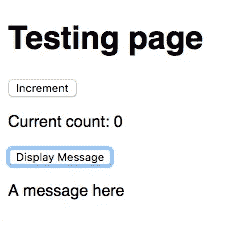
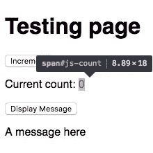
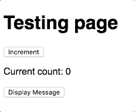
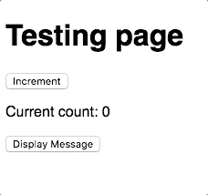

# 使用木偶师自动化点击测试

> 原文：<https://itnext.io/automate-click-through-testing-with-puppeteer-2e80bc3391dc?source=collection_archive---------1----------------------->

测试是软件开发的基本步骤之一。然而，测试，尤其是通过应用程序点击的手动测试，是一项我们经常回避的乏味工作。但不一定非要这样。随着过去几年优秀工具的出现，我们现在有了在构建过程中自动化点击测试所需要的东西。在这篇文章中，我们将看看为什么手动或点击测试是重要的，以及如何将这个乏味和麻烦的任务变成一个有趣的任务来推动我们的开发。

不安的读者可以直接进入这篇文章附带的回购。

# 为什么我们需要手动 QA

从开发者的角度来看；测试和 QA，尤其是手动 QA 看起来像是不合理的负担，阻碍了我们的开发速度。虽然开发人员社区作为一个整体，以及大多数管理人员社区，正在慢慢恢复他们的理智，并看到为用户编写经过良好测试并能正常工作的代码比增加一个功能更有价值，但我们仍然不赞成将手动 QA 作为一个路障。

> *手动测试运行经常会变成路障。*

但是人工 QA 真的不是我们面临的问题。这是我们使用它的方式。最初，人工质量保证来自于这样一种认识，即在将网站交付给客户之前，确实应该有人点击完成的网站，以确保它确实可以工作。你可以对你的产品进行单元测试，用户和现实世界总是可以打破它。因此，我们尽力模拟真实世界的场景和使用人工 QA 的用户。

在 DevOps 运动中，我们意识到发布小块代码并经常这样做可以大大减少我们发布的 bug 数量，使我们的公司更有能力对用户需求和市场需求做出反应，并为我们自己创造一个良好的工作环境。在实现高发布速度的过程中，手动 QA 往往是一个很大的难点。因为不管出于什么原因，我们的组织需要对每个版本进行完整的人工 QA 运行。这诱使我们囤积特性，以便 QA 可以一次处理尽可能多的东西(如果你读过 Phoenix 项目，这是我们经常做的热处理)。我们完全忽略了正是这一点使得我们很难跟踪几十个提交中的哪一个引入了 bug，并且通过这样做，我们通常会阻止开发几天，只是为了让一个发布发生。我们发明了复杂的程序，比如一周的代码冻结，来创建一个“稳定的测试环境”,但实际上，它往往是不稳定的。

> *编程和其他行业一样需要质量保证。*

尽管如此，和其他行业一样，我们也需要人工 QA。但现在是转移焦点的时候了。当我们看其他学科时，我们总是会看到手动 QA，有一个人控制一切都是正确的，这很容易让人放心。在很长一段时间内，它们比机器更灵活，更像真实世界的用户。但是你看到质量保证发生在离开传统生产链的每一件成品上吗？当然不是，那会是浪费时间！当我们制造汽车时，我们不需要检查每一辆车。我们经常取出一个，以确保过程顺利进行，并相信其余的工作是一样的。

这也是我们希望在软件开发中实现的操作模式。我们发布一个版本，然后制作几十个(甚至可能每天)。每隔一段时间，就会有人手动验证一个版本，这样，我们相信其余的工作会和这个一样好，因为我们信任我们的过程。

# 建立信任

但是我们现在没有这种信任。经常有很多公司被部署出现严重错误的经历吓到了。不幸的是，他们引入了繁琐的程序，旨在防患于未然，而实际上这些程序会适得其反，拖慢公司的发展。我们有责任重建这种信任，并减轻他们目前承受的人工 QA 负担。我们可以通过自动化 QA 手动完成的流程来实现这一点。

> 为了从我们现在所处的位置到达我们想要的位置，这不会被手动 QA 运行和一天多次发布所阻碍，我们需要投资于自动化测试以及在组织内建立信任，相信我们的代码做了它应该做的事情。

今天，我们将在这条道路上向前迈出一大步，实现网站点击测试的自动化。

# 简单的 web 应用程序

对于今天的测试，我们将看看下面的网站，这是一个简单的计数器应用程序。我们将能够点击一个“增量”按钮来将计数增加 1。此外，我们将提供一个按钮来显示以前没有看到的消息，只是为了添加更多的动态行为供我们测试。

这是网站的代码:

正如你所看到的，我们有显示计数和一些按钮的 HTML。然后我们在底部添加了一些内嵌的 JavaScript 来实现逻辑。我们希望该页面能够:

1.  当我们参观它的时候展示。
2.  单击“增量”按钮时，增加显示的计数。
3.  按下“显示消息”按钮时显示消息对话框。

传统上，我们现在需要手动点击。我们会把网站放在某个地方，或者在本地运行一个 web 服务器来查看。然后我们会检查它是否能打开，并逐一检查需求。让我们让计算机为我们做这件事。

# 工具

我们将使用 [Jest](https://jestjs.io/) ，一个“令人愉快的 JavaScript 测试”框架作为我们的测试框架。但是您也可以使用任何提供断言的东西。当我们在这里使用 Jest 时，我们将以某种方式讨论事情，以便我们也可以将它们应用到其他工具。

木偶师将是我们自动化浏览器和与之互动的工具。由 Chromium 团队编写的木偶师提供了一个与 [DevTools 协议](https://chromedevtools.github.io/devtools-protocol/)的接口，可以与任何支持它的浏览器结合使用。我们将使用与它捆绑在一起的 Chromium 版本。

在这篇文章中，Jest 在版本 *23.6.0* 中与木偶师 *1.11.0* 一起使用。

除此之外，我们将使用[实时服务器](https://github.com/tapio/live-server/)作为本地 web 服务器。使用本地 web 服务器使我们独立于所使用的框架。我们将能够使用这种方法测试任何网站，因为无论你如何开发你的网站，无论是 React、Angular、Vue 还是其他年度框架，最终，你都会得到一个普通的旧网站。使用这种方法，我们可以测试它们。

我还决定在我的代码中使用 ES6 模块语法，并包含 Babel 来使用`import`。

将所有这些融入你的项目`npm i --save jest puppeteer live-server`。

# 测试环境设置

现在我们已经准备好了工具带，是时候开始测试了。

前面我们说过，在进行手动测试之前，我们将在某个地方托管网站或运行本地 web 服务器，我们最好在运行测试之前在测试套件中这样做。

在这里，我们记住了 Puppeteer 管理的浏览器以及一个系统进程，它通过将它们定义为顶级变量来运行我们所有测试的 web 服务器。现在，我们告诉 Puppeteer 启动一个浏览器，我们可以在其中观看正在运行的测试。我们也使用`slowMo`来降低浏览器的速度，稍后我们会让它成为可选的，但是第一次尝试的时候看到事情发生总是很好的。

遗憾的是，我们找不到一个好的可以编程管理的 web 服务器解决方案，并且 live-server 有一个关于编程关闭的公开问题(参见[问题 196](https://github.com/tapio/live-server/issues/196) )，因此我们需要将它作为子进程运行。这基本上就像在进行测试之前在另一个终端中运行命令`live-server --port=8282 --no-browser`。我们保留了一个引用，以便以后可以关闭服务器。

`beforeAll`是一个将在任何测试运行之前执行一次的块。因此，这是一个完美的地方，我们的一般设置。在这里，我们使用 Puppeteer 启动一个浏览器，并在使用它运行我们的测试之前等待它完成。

当然，我们不能忘记在所有测试完成后关闭所有这些。因为 Jest 提供了将运行一次的`afterAll`，毕竟测试已经完成。这是关闭浏览器和网络服务器的最佳位置。

当我们为所有测试启动和停止浏览器和 web 服务器时，我们希望为每个单独的测试创建一个干净的新标签。我们可以通过使用`beforeEach`并在`afterEach`进行清理来实现这一点。我们还将添加一个`let page`，在这里我们也可以记住浏览器，这样我们的测试就可以访问它。

这将为每个测试打开一个新的页面，并且总是存储在我们的测试可以访问的同一个名为`page`的变量中。并不是说对于你项目中的测试套件，你可能想也可能不想这样做。对于我们的网站来说，总是从头开始很好，我们可以通过简单地为每个测试打开一个新页面来实现这一点。

您可能已经注意到代码中广泛使用了`await`。我们将继续看到，与浏览器通信的所有操作本质上都是异步的。如果你不熟悉这种语法，Mozilla 有很棒的关于 [async](https://developer.mozilla.org/en-US/docs/Web/JavaScript/Reference/Statements/async_function) 和[waiting](https://developer.mozilla.org/en-US/docs/Web/JavaScript/Reference/Operators/await)的文档。

# 测试站点

现在终于到了编写我们的第一个测试的时候了！

我们将使用`it`块，按照“它应该……”的约定来包装所有的测试在一个`describe`块内。简单回顾一下:这背后的想法是描述应用程序被测试的部分以及它应该做什么。我们的目标是得到描述性的测试，精确地告诉我们什么被破坏了，如果他们失败的话。

正如我们在手动测试中所做的那样，我们将首先确保我们能看到网站。为此，我们将检查标题是否存在。我们还可以检查标题中是否有特定的文本，但对我们来说，只要有任何标题就足够了。

这个测试导航到我们想要测试的页面，在上面找到所有的`<h1>`元素，并期望在页面上找到一个 h1 元素。我们也决定在这里截图。这使得检查测试过程中的错误或调试测试变得更加容易。

祝贺您，您的第一个测试已经就绪，是时候运行它了。为此，我们将遵循节点约定，并向我们的`package.json`添加一个测试脚本。`"test": "jest"`对我们会起作用。现在你可以运行`npm test`了，一个浏览器会打开并截图。只要确保你有一个名为`screens`的文件夹，可以保存截图。

# 选择元素

上面验证了数字 *0* ，这是我们在测试过程中想要检查的三件事情。接下来是计数器本身和显示的消息。

1.  当我们参观✅时，它会向我们展示。
2.  单击“增量”按钮时，增加显示的计数。
3.  按下“显示消息”按钮时显示消息对话框。

对于计数器，我们将希望检查它是否从 0 开始，然后在我们单击一个按钮后它是否递增。检查初始值很简单，只需获取显示计数的``元素的内容。

我们再次访问页面并截取屏幕截图，但这一次我们还提取了计数器的初始值。木偶师提供了许多与页面交互的方法。这里我们使用了`$eval`,它接受一个用于在页面上运行`querySelect`的元素选择器，并作为第二个参数接受一个函数，该函数将找到的元素作为它的输入。传递给`$eval`的函数在页面的上下文中进行计算，其结果成为`$eval`的返回值。你可以在[官方文档](https://github.com/GoogleChrome/puppeteer/blob/v1.11.0/docs/api.md)中查找完整的 API。

这里我们找到一个由`[data-test="count-output"]`标识的元素，然后将它的`.innerHTML`转换成一个整数并返回。这暴露了自动化点击测试的一个关键部分。我们的测试需要找到与之交互和运行测试的元素。你也可以通过在网站上搜索某个文本来解决这个问题，但是对于文本频繁变化的网站以及输出，我们需要一种不同的方式来选择它们。

一个很好的方法就是自定义`data-*`属性。自定义数据属性不会干扰 web 开发的其余部分。它们在这里正是为了某个元素需要某些特定信息的情况，否则无法提供这些信息。

两种选择是类和 id。虽然类不应该是唯一的，因此不能用来选择一个事物，但是 id 已经有了其他的含义。它们可能已经被使用了，并且是您不希望耦合到您的测试过程中的东西，因为这将阻止您在应用程序开发中充分利用它们。因此，我们在这里使用数据属性来识别测试感兴趣的元素。

# 与元素交互

一旦我们可以在页面上找到元素，我们也可以与它们交互，例如，单击一个按钮来增加我们的计数器。

在这里，我们获得了初始计数值，并验证了我们的预期，即单击“increment”按钮将使该值增加 1。使用`page.$`我们可以得到一个 [ElementHandle](https://pptr.dev/#?product=Puppeteer&version=v1.11.0&show=api-class-elementhandle) ，它为我们提供了一些方便的功能来与选中的元素进行交互，比如用`.click()`来点击它。

在这篇博文的 [repo 中，您可以找到另一个对计数器进行多次递增的测试。](https://github.com/HoverBaum/jest-puppeteer-website-testing)

这样，我们就可以从测试列表中检查出另一个项目。

1.  当我们参观✅时，它会向我们展示。
2.  当我们点击“增量”按钮时，✅增加显示的计数。
3.  按下“显示消息”按钮时显示消息对话框。

# 动态 DOM 内容

我们现在剩下的是动态添加到页面中的元素，我们也可以测试这些元素，就像我们示例网站中的消息一样。为此，我们只需执行将元素添加到页面的操作，然后查找它。

这一次，我们没有使用 Puppeteers build 来支持点击事件，而是使用了一段 JavaScript 代码，在我们的页面上下文中评估点击按钮`e => e.click()`。同样，您可以在页面的上下文中传递任何要评估的代码。

这已经让我们在测试网站方面走得很远了。不要忘记，当测试你的实际站点时，你可以通过直接发送请求到你的后台来获得很多快捷方式，而不是一直通过你的 UI 来做所有的事情。在这样做之前，花点时间思考一下你想测试什么，并尽最大努力将测试彼此分离。一次测试失败不应该导致所有其他测试都失败。理想情况下，您希望一个测试自己失败，以方便找到问题。接下来，通过直接调用(或使用模拟后端)来自后端的测试来设置(或播种)数据和状态通常是好的。这样，即使在为当前测试失败的列表创建项目时，您也可以验证列表的显示。

1.  当我们参观✅时，它会向我们展示。
2.  当我们点击“增量”按钮时，✅增加显示的计数。
3.  当按下“显示消息”按钮时，✅显示一个消息对话框。

恭喜，所有测试都是绿色的！

# 使可视化成为可选的

早先我们硬编码显示一个延迟的浏览器来观察我们的测试发生。因为我们并不总是想这样做，所以让我们把它改为依赖于一个环境变量`SHOW_BROWSER`。有些情况下，我们可能不想得到可视化，特别是包括构建和部署我们的应用程序的管道，这些应用程序通常运行在我们不关心可视化而关心速度的系统上。

我们将简单地检查环境中是否包含一个名为`SHOW_BROWSER`的变量，并根据它来决定是否显示浏览器。现在要看到浏览器，你可以运行`env SHOW_BROWSER=t npm test`来用浏览器运行测试。你可以用任何你想要的东西代替`t`，只要`SHOW_BROWSER`有任何价值。您甚至可以将它转换成 npm 脚本`"test:visual": "env SHOW_BROWSER=t npm test`并运行`npm run test:visual`来使用它。

# 局限性和良好的测试

与每一种方法一样，这种自动点击测试并不是万能的，它有一些限制。例如，木偶戏基本上只能在 Chrome 上运行。但是正如我们之前讨论的，自动化点击测试不应该取代人工 QA 运行，而是应该帮助他们。一旦我们实现了快速的开发迭代，这将给我们带来更少的错误，只要我们在所有浏览器中进行定期检查，在一个浏览器中为每个构建进行测试就可以了。总是假设开发人员在多种浏览器中检查他们的代码😉

您可能会发现在测试中引入超时很有帮助。您会注意到何时使用它们，因为当默认超时不够长时，测试会失败，只需将您想要的超时作为第二个参数传递给`it()`。

# 包扎

我们的目标达到了，我们开始使用 Jest 和木偶师测试网站。我们看了一下自动化点击测试在软件开发的大环境中的位置，然后继续编写我们的第一个测试用例。用我们完成的代码检查[回购。](https://github.com/HoverBaum/jest-puppeteer-website-testing)

现在出去，自动化你所有的测试🚀

下一集:使用 Cypress 可视化调试自动化测试的自动化测试(即将推出)

延伸阅读:

*   https://github.com/HoverBaum/jest-puppeteer-website-testing
*   【https://jestjs.io/ 
*   [https://pptr.dev/](https://pptr.dev/)

最初发表于:[hoverbaum.net](https://hoverbaum.net/2019/01/29/Automate-click-through-testing-with-Puppeteer/)