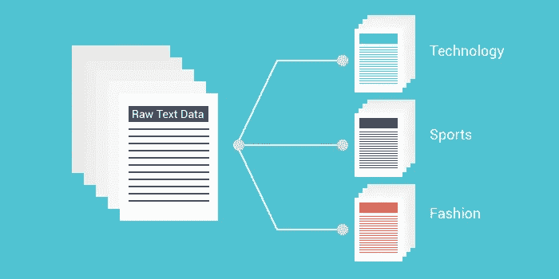
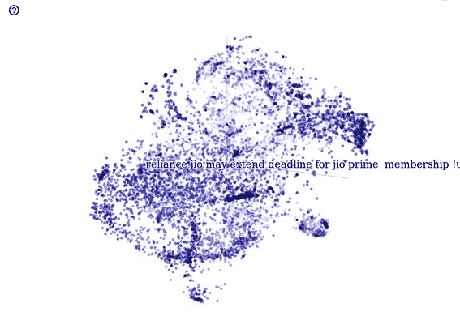
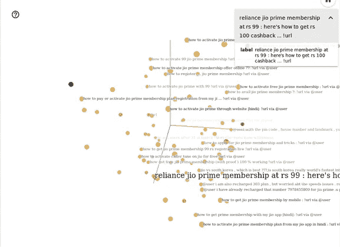
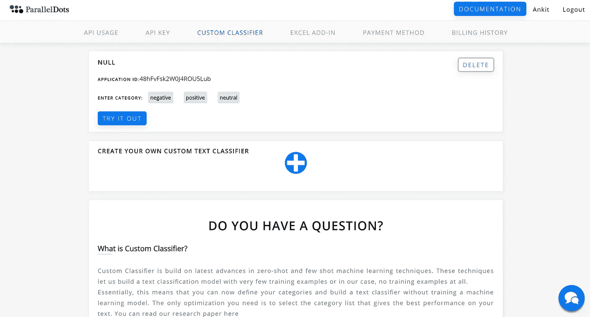

# 使用机器学习的自动文本分类

> 原文：<https://itnext.io/automated-text-classification-using-machine-learning-98dbe7f5e133?source=collection_archive---------5----------------------->

[*点击这里在 LinkedIn* 上分享这篇文章](https://www.linkedin.com/cws/share?url=https%3A%2F%2Fitnext.io%2Fautomated-text-classification-using-machine-learning-98dbe7f5e133)

数字化改变了我们处理和分析信息的方式。在线信息的可用性呈指数级增长。从网页到电子邮件，科学期刊、电子书、学习内容、新闻和社交媒体都充满了文本数据。其理念是快速创建、分析和报告信息。这是自动文本分类逐步升级的时候。

文本分类是将文本智能分类成类别。而且，使用机器学习来自动化这些任务，只会使整个过程超级快速和高效。人工智能和机器学习可以说是最近获得动力的最有益的技术。他们到处都能找到应用。正如杰夫·贝索斯在年度股东信中所说，

> *在过去的几十年里，计算机已经广泛地实现了自动化任务，程序员可以用清晰的规则和算法来描述这些任务。现代机器学习技术现在允许我们在描述精确规则更加困难的任务中做同样的事情。*
> 
> *–杰夫·贝索斯*

特别谈到自动文本分类，我们已经写了关于它背后的技术和它的应用。我们正在更新我们的文本分类器。在这篇文章中，我们将讨论与我们的自动文本分类 API 相关的技术、应用、定制和分段。

文本数据的[意图](https://www.paralleldots.com/intent-analysis)、[情感](https://www.paralleldots.com/emotion-detection)和[情感分析](https://www.paralleldots.com/sentiment-analysis)是文本分类的一些最重要的部分。这些用例在机器智能爱好者中引起了巨大的反响。我们为每个类别开发了单独的分类器，因为它们的研究本身就是一个巨大的课题。文本分类器可以对各种文本数据集进行操作。您可以使用标记数据训练分类器，也可以对原始的非结构化文本进行操作。这两个类别本身都有许多应用。

# 监督文本分类

定义分类类别后，文本的监督分类就完成了。它的工作原理是训练和测试。我们将标记的数据提供给机器学习算法进行处理。该算法在标记的数据集上训练，并给出期望的输出(预定义的类别)。在测试阶段，算法被输入未观察到的数据，并根据训练阶段将它们分类。

电子邮件的垃圾邮件过滤是监督分类的一个例子。收到的电子邮件会根据其内容自动分类。语言检测、意图、情感和[情感分析](https://www.paralleldots.com/sentiment-analysis)都基于监督系统。它可以用于特殊的用例，例如通过分析数百万条在线信息来识别紧急情况。这是大海捞针的问题。我们提出了智能公共交通[系统](http://blog.paralleldots.com/technology/artificial-intelligence-can-make-public-transportation-safer/)来识别这些情况。为了在数以百万计的在线对话中识别紧急情况，必须以高精度训练分类器。它需要特殊的损失函数，在训练时进行采样，以及建立一个多分类器堆栈等方法来解决这个问题，每个分类器都细化前一个分类器的结果。

*智能应急响应系统*

监督分类基本上就是让计算机模仿人类。给定算法一组标记/分类的文本(也称为训练集)，基于这些文本，它们生成 AI 模型，当进一步给定新的未标记文本时，这些模型可以自动对它们进行分类。我们的几个[API](https://www.paralleldots.com/text-analysis-apis)，是用监督系统开发的。[文本分类器](https://www.paralleldots.com/text-analysis-apis#text-classification)目前被训练用于一组通用的 150 个类别。

# 无监督文本分类

无监督分类是在不提供外部信息的情况下完成的。在这里，算法试图发现数据中的自然结构。请注意，自然结构可能不完全是人类认为的逻辑划分。该算法在数据点中寻找相似的模式和结构，并将它们分组到聚类中。数据的分类是基于形成的聚类来完成的。以网络搜索为例。该算法基于搜索词进行聚类，并将它们作为结果呈现给用户。

每个数据点都嵌入到超空间中，你可以在 TensorBoard 上看到它们。下图基于我们对印度电信公司 Reliance Jio 的 twitter 研究。

*超空间中的个体数据点*

进行数据探索是为了基于文本相似性找到相似的数据点。这些相似的数据点形成了最近邻的聚类。下图显示了推文*“99 卢比的 reliance jio prime 会员资格:以下是如何获得 100 卢比返现……”的最近邻居*。

*聚类:具有文本相似性的数据点*

如你所见，附带的推文与标注的类似。这个集群是相似推文的一个类别。在从文本数据中获得洞察力时，无监督分类非常方便。它是高度可定制的，因为不需要标记。它可以对任何文本数据进行操作，而无需对其进行训练和标记。因此，无监督分类是语言不可知的。

如你所见，附带的推文与标注的类似。这个集群是相似推文的一个类别。在从文本数据中获得洞察力时，无监督分类非常方便。它是高度可定制的，因为不需要标记。它可以对任何文本数据进行操作，而无需对其进行训练和标记。因此，无监督分类是语言不可知的。

# 自定义文本分类

很多时候，使用机器学习的最大障碍是数据集的不可用性。有许多人想用人工智能对数据进行分类，但这需要制作一个数据集，这就产生了类似于鸡生蛋还是鸡生蛋的问题。自定义文本分类是在没有任何数据集的情况下构建自己的文本分类器的最佳方式之一。

在 ParallelDots 的最新[研究工作](https://paralleldots.xyz/Zero-Shot-Learning-for-Text-Classification)中，我们提出了一种对文本进行零射击学习的方法，其中一种经过训练的算法可以在大型嘈杂的数据集上学习句子及其类别之间的关系，从而推广到新的类别甚至新的数据集。我们称这种模式为“一次训练，随处测试”。我们还提出了多种神经网络算法，可以利用这种训练方法并在不同的数据集上获得良好的结果。对于学习关系的任务，最好的方法是使用 LSTM 模型。这个想法是，如果一个人可以在句子和类之间建立“隶属”的概念模型，这些知识对于看不见的类甚至看不见的数据集都是有用的。

# 如何构建自定义文本分类器？

要构建你自己的定制文本分类器，你需要首先[注册](https://www.paralleldots.com/sign-up)一个 ParallelDots 账户，然后[登录](https://user.apis.paralleldots.com/login)到你的仪表盘。

您可以通过单击仪表板中的“+”图标来创建您的第一个分类器。接下来，定义一些您想要对数据进行分类的类别。请注意，为了获得最佳结果，请保持您的类别互斥。

您可以通过分析文本样本来检查分类的准确性，并在发布之前尽可能调整您的类别列表。一旦发布了类别，您将获得一个应用程序 id，它将允许您使用定制的分类器 API。

考虑到数据标记和准备可能是一个限制，自定义分类器可以是一个很好的工具来建立一个文本分类器，而不需要太多的投资。我们还相信，这将降低构建实用的机器学习模型的门槛，这些模型可以应用于各个行业，解决各种各样的用例。

作为一个人工智能研究小组，我们正在不断开发前沿技术，以使流程更简单、更快速。文本分类就是这样一种技术，在未来有着巨大的潜力。随着越来越多的信息被倾倒在互联网上，由智能机器算法来轻松地分析和表示这些信息。机器智能的未来无疑是令人兴奋的，订阅我们的时事通讯，在你的收件箱里获得更多这样的信息。

[parallel dots AI API](https://www.paralleldots.com/)，是由 [ParallelDots Inc](https://paralleldots.xyz/) 提供的深度学习支持的 web 服务，可以理解大量的非结构化文本和视觉内容，为您的产品提供支持。你可以查看我们的一些文本分析[API](https://www.paralleldots.com/text-analysis-apis)并通过填写此处的表格[联系我们或者给我们 apis@paralleldots.com 写信。](https://www.paralleldots.com/contact-us)