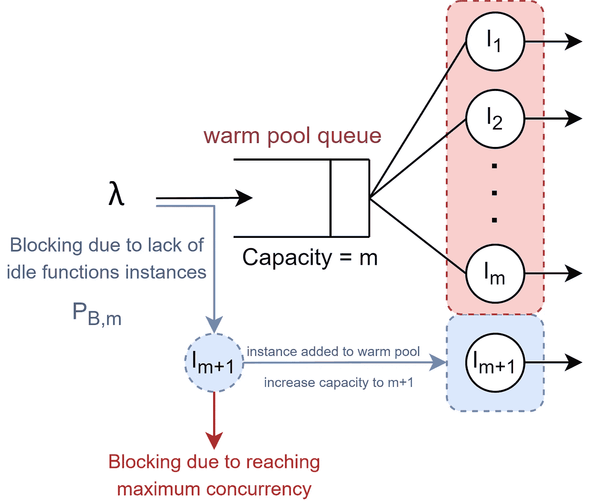
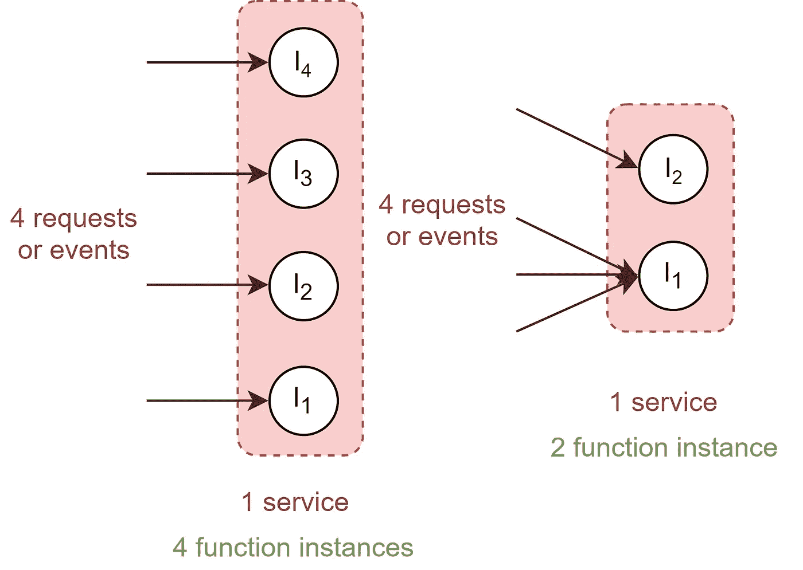

# 您应该了解的无服务器计算中的自动缩放模式

> 原文：<https://itnext.io/autoscaling-patterns-in-serverless-computing-you-should-know-about-9d8c5d00d324?source=collection_archive---------0----------------------->

[廷杰伤害律师事务所](https://unsplash.com/@tingeyinjurylawfirm?utm_source=medium&utm_medium=referral)在 [Unsplash](https://unsplash.com?utm_source=medium&utm_medium=referral) 上的照片

由 AWS Lambda 开创的无服务器计算是云服务的最新典范。如今，几乎所有大型云提供商公司都在提供功能即服务(FaaS)产品，这些产品向开发人员承诺由提供商对服务进行全面管理。目前的一些 Faas 产品包括 AWS Lambda、Google Cloud Functions、Google Cloud Run、Azure Functions 和 IBM Cloud Functions。还有其他主要运行在 Kubernetes 上的开源替代软件，如 OpenFaaS、IronFunctions、Apache OpenWhisk、Kubeless、裂变、OpenLambda 和 Knative。

在这篇文章中，我将介绍在不同的无服务器计算服务中使用的三种不同的自动缩放模式，这可能有助于您决定哪一种最适合您计划开始的项目😉。

# 自动缩放

由 FaaS 产品中的提供商处理的操作的一个关键方面是服务的自动扩展。当我们说一个服务“austoscales”时，我们通常是指当自动生成或由用户生成的流量随着时间的推移而变化时，分配给该服务的资源量(CPU/RAM/IO/…)会相应地改变以适应。

这样，基于云的软件产品可以管理他们的云账单，同时保持他们网站的可用性和响应能力。在自动缩放成为可能之前，公司需要为服务器提供足够的资源，以处理发送到其网站的最大流量峰值，同时一直为此付费。

在将您的服务部署到 FaaS 产品时，您将自动扩展任务(以及许多其他操作任务)委托给了云提供商。然而，由于生活并不完美，所有系统都有权衡和限制，您可能需要了解您的云提供商是如何在幕后管理任务的。**如果你继续读下去，我希望你能学到这些。**

FaaS 的自动缩放通常包含两个动作:放大和缩小。当您将您的功能部署到一个服务(例如，AWS Lambda)时，您的功能将被部署到“功能实例”中的数据中心，这些数据中心基本上是微型服务器，上面有您的代码。当您发送的流量超过系统当前的处理能力时，将会发生一个扩展事件，创建新的函数实例来并行处理传入的请求。相反，当输入流量低于当前系统容量时，将发生扩大事件，导致一些功能实例的终止。

# 自动缩放模式

自动缩放模式实际上是系统触发那些缩放事件所遵循的策略(准则)。在我迄今为止见过的最流行的无服务器计算平台中，通常有三种自动缩放模式:1)按请求缩放(你可能在别处看到不同的名称，但这是我在论文中使用的名称😊);2)并发值缩放；3)基于指标的扩展。现在，让我们更深入地了解它们的工作原理。

# 1.按请求缩放自动缩放

在按请求扩展自动扩展模式中，横向扩展是如何发生的。新功能实例的创建是由于在到达热池时缺少空闲实例而发生的冷启动事件的结果。

对于像 AWS Lambda、IBM Cloud Functions、Azure Functions 和 Google Cloud Functions(不是 Google Cloud Run，但我们稍后会讲到)这样的公共 FaaS 产品，这是事实上的自动伸缩模式(也是最难做对的模式)，此外还有 Apache OpenWhisk(也就是[开源](https://openwhisk.apache.org/))。

在这种自动扩展模式中，系统是完全反应式的，它需要能够快速反应，这就是为什么它是最难做对的。在这里，当您将应用程序部署到云中时，为了节省成本，提供商不会运行您的函数的任何实例。相反，它会一直等到您的服务请求(或任何类型的触发器)出现。然后，系统会快速地创建一个函数实例并下载你的代码，然后它才会处理这个请求。这通常被称为 [**冷启动**](https://mikhail.io/serverless/coldstarts/define/) ，这就是在这些无服务器平台中如何处理*向外扩展*事件。这个过程通常需要一些时间(从几百毫秒到几十秒)，因此会导致服务质量下降(如响应时间)。

为了避免对每个请求都执行这个过程，无服务器平台不会在处理完请求后立即终止这个新创建的实例。相反，在终止该实例之前，它将保持该实例一段时间(这里称为*终止超时*)，从而导致*放大*事件。如果在终止前出现另一个服务请求，系统会将请求路由到 *warm* 实例，从而节省一些宝贵的延迟和计算成本。

这种自动伸缩模式与其他模式(我们将在后面讨论)的一个关键区别是，这里没有对传入请求进行排队。相反，系统要么为新请求分配一个热实例，要么创建一个新实例(导致冷启动)。因此，每个请求将经历的等待时间有上限，这是处理冷启动请求所花费的最长时间；而不是在请求队列中等待很长时间(甚至可能是几分钟)才能得到处理。

# 2.并发值自动缩放

并发值对所需函数实例数量的影响。左侧服务的并发值为 1，而右侧服务的并发值为 3。更多信息，请查看 GCP 的文档。

在并发值自动缩放模式中，每个函数实例可以并发接收多个请求。在这种模式中，用户指定允许同时进入实例的请求的最大数量，当达到该数量时，新的请求导致冷启动，从而创建新的功能实例。上图显示了用户设置的最大并发值的效果。

这种自动伸缩模式可能看起来像是按请求伸缩自动伸缩的超类，当最大并发值设置为 1 时，它们可能会收敛到相同的并发模式。然而，这两种自动缩放模式之间存在根本差异，这使得我们将它们划分为不同的类别。首先，并发值自动伸缩允许在共享队列中对传入请求进行排队，但在按请求伸缩自动伸缩中不涉及排队。此外，按请求扩展与传入请求同步发生，这意味着当没有空闲实例可用时，创建新功能实例的事件会在接收到新请求之后发生。然而，并发值自动缩放平台基于在整个稳定和紧急窗口中测量的平均并发值，以固定间隔(在当前实现中为 2 秒)执行异步缩放。

这种自动缩放模式的例子有 Google Cloud Run 和 Knative serving 的一些配置。

这种自动缩放模式的例子有 Google Cloud Run 和 Knative serving 的一些配置。

# 3.基于指标的自动缩放

这是部署到云的一般微服务中最常见的自动伸缩模式。在这种模式中，系统试图将 CPU、内存使用、吞吐量或延迟等指标保持在预定义的范围内。大多数本地和开源无服务器计算平台，如 OpenFaaS、Kubeless 和裂变，以及一些托管平台，如 AWS Fargate 和 Azure Container 实例，都使用这些自动伸缩模式。这些示例中的大多数使用内置于 Kubernetes 中的水平 Pod Autoscaler (HPA ),这是将微服务部署到云的事实上的标准。

与其他两种自动扩展模式相比，这种模式在响应突发工作负载方面具有最差的延迟，但可以在高传入请求率的服务中实现更好的资源利用率和成本。

# 结论

无服务器计算的承诺是，开发者只需要提供代码，操作工作由提供者完成。然而，当前一代的无服务器计算平台还远非完美。因此，开发人员需要了解底层结构，以便能够为他们打算在平台上部署的服务交付所需的质量。

在本文中，我们回顾了当前无服务器计算平台中最常见的自动伸缩模式，这是无服务器最重要的操作成果和承诺之一。了解了这些自动伸缩模式以及哪些平台使用它们，我希望您能够为部署工作负载做出更好的决策。如果你想更多地了解无服务器计算平台如何工作，以及如何预测它们在不同工作负载下的性能和成本，请查看[我关于无服务器计算平台性能建模的论文](https://bit.ly/2TpgVhq)或尝试[互动模型](https://bit.ly/3mflHuw)。

# 参考

*   [无服务器计算平台的性能建模](https://research.nima-dev.com/publication/mahmoudi-2020-tccserverless/) ( [交互模型](https://nima-dev.com/serverless-performance-modeling/)，[预印本](https://pacs.eecs.yorku.ca/pubs/pdf/mahmoudi2020tccserverless.pdf))
*   [SimFaaS:无服务器性能模拟器](https://github.com/pacslab/simfaas) ( [文档](https://simfaas.readthedocs.io/en/latest/))
*   [时间性能建模](https://research.nima-dev.com/publication/mahmoudi-2020-tempperf/)
*   [我的研究页面](https://research.nima-dev.com/)
*   [关于我们实验室(约克大学 PACS 实验室)的信息](https://pacs.eecs.yorku.ca/)

# 关于我

我是阿尔伯塔大学的博士生，约克大学的客座研究员，塞内卡学院的兼职讲师。我日复一日地研究无服务器计算平台，试图找到提高其性能、可靠性、能耗等的方法。，使用分析或数据驱动的方法(对“我要么使用数学要么使用机器学习来建模无服务器计算平台”的花哨说法)。我在这里写的是我在研究期间对一些无服务器计算平台的深入了解，以及它们的自动伸缩模式文档的简要汇编。

如果你想更多地了解我，可以看看我的[网站](https://nima-dev.com/)。