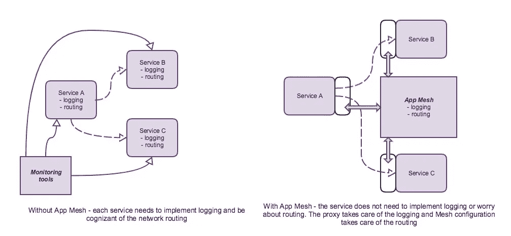
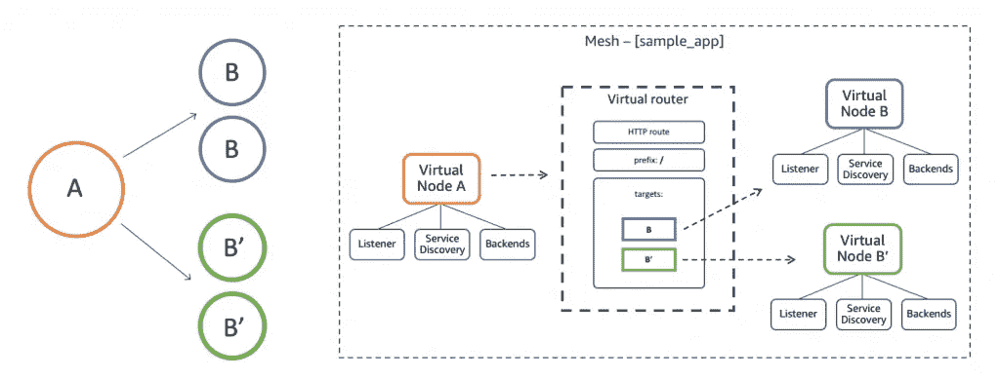

# AWS App Mesh —大获全胜！

> 原文：<https://itnext.io/aws-app-mesh-a-big-win-d3e55f5f0ca8?source=collection_archive---------2----------------------->

AWS 最近在 2019 年峰会期间发布了一款新的服务应用 Mesh，引起了全球开发者的浓厚兴趣。这项服务是亚马逊在向市场交付产品/功能时高度以客户为中心的一个很好的例子。除此之外，使用该服务不收取额外费用！:-)

随着云的出现，微服务的重要性大大增加。在微服务架构中，大型整体代码库/架构被分解成更小、更独立的模块。这些独立的模块负责高度定义的离散任务，它们使用 API 相互通信。举几个例子，微服务架构最显著的优势如下:

*   作为微服务构建的软件可以分解为多个组件服务，这样每个服务都可以独立部署和重新部署，而不会影响应用程序的完整性。
*   更好的故障隔离；如果一个微服务失败，其他微服务将继续工作。
*   不同服务的代码可以用不同的语言编写，并在不同的存储库中维护。
*   更好、更包容的 CI-CD 流；每个服务都可以在自己独立的管道中构建和部署，而不会影响其他服务。
*   提高组织内各个开发团队的自主性，因为每个服务都可以独立地构建和管理。这导致了更快的交付，因为协调工作大大减少了。

尽管这些好处听起来很酷，但在高度分布式的微服务架构中，复杂性呈指数级增长。这些服务的管理不当是一个问题，就像在从单一应用程序转换的初始阶段所面临的问题一样。App Mesh 旨在从一开始就解决这些问题。

[AWS 应用网格](https://aws.amazon.com/app-mesh/)是一个托管服务网格(一个服务网格，驻留在其中的服务之间的网络流量的逻辑边界)控制平面。它使用服务发现命名提供应用程序级网络支持，标准化您如何跨多种类型的计算基础架构 EC2、ECS、Fargate、Kubernetes 控制和监控您的服务。App Mesh 使用特使代理。现在，你必须使用应用网格[特使容器映像](https://docs.aws.amazon.com/app-mesh/latest/userguide/envoy.html)，直到特使项目团队[合并支持应用网格的变更](https://github.com/aws/aws-app-mesh-roadmap/issues/10)。

AWS 应用程序网格使用特使边车代理

随着应用程序中服务数量的增长，查明错误的确切位置、在失败后重新路由流量以及安全地部署代码更改变得越来越困难。以前，这需要您将监控和控制逻辑直接构建到代码中，并在每次发生变化时重新部署服务。让我们来了解一下 App Mesh 的优势，以及它如何应对这些重要挑战。

# **测井**

您可以配置 App Mesh 来记录进出您服务的流量。*虚拟节点*可以配置为指示 Envoy 将 HTTP 访问日志转储到实例上的某个位置。您的应用程序中的一个代理可以从那里提取日志以导出到选择的目的地，这可以是一个日志存储和处理服务，如使用标准 Docker 日志驱动程序的 CloudWatch Logs(如 [awslogs](https://docs.docker.com/config/containers/logging/awslogs/) )。这确保了所有的服务，不管它们的实现如何，都有一个非常一致的日志记录机制。

在没有 App Mesh 的情况下，如果您希望在分布式微服务架构的开发过程中确保一致的日志记录，您必须确保所有开发团队使用相同的 SDK。比如说，你不同的开发团队想用 Java，C++，Golang。但是，假设您选择的日志 SDK 不支持 Golang，那么基本上要么您不能使用该 SDK，要么希望使用 Golang 的开发团队必须选择不同的编程语言。除此之外，您还需要确保每个应用程序以一致的方式生成和转储日志。这很重要，因为您可以适当地使用监控工具来轮询流、配置事件等。使用 App Mesh，应用程序不必担心生成访问日志，因此节省了开发生命周期中的管理和维护开销。

# 交通控制

使用 App Mesh，您首先创建一个网格，它现在是您部署的服务的基础架构。您可以配置网状网络来控制服务东西向流量的路由。App Mesh 允许您将服务配置为直接相互连接，而不需要应用程序内的代码或使用负载平衡器。当每个服务启动时，其代理会连接到 App Mesh，并接收有关网格中其他服务位置的配置数据。您可以使用 App Mesh 中的控件来动态更新服务之间的流量路由，而无需更改您的应用程序代码。

在没有 App Mesh 的情况下，服务和它们与之通信的端点的信息是紧密耦合的。端点在服务启动时初始化，为了动态更新，您需要在服务中实现 API 来实现这一点。在有许多服务的环境中，这变得非常复杂，对于管理 canary 部署来说也是如此。使用 App Mesh，服务不需要知道任何端点，因为所有流量控制平面配置都由 Mesh 处理。

在 [AWS 博客](https://aws.amazon.com/blogs/compute/introducing-aws-app-mesh-service-mesh-for-microservices-on-aws/)上有一个简化的高级示例，它很好地描述了服务的网状部署。

AWS 博客中的 AWS 应用网格示例

# 负载平衡

App Mesh *虚拟路由器*允许你用指定的权重配置目标端点。虚拟路由器处理网状网络中一个或多个虚拟服务的流量。创建虚拟路由器后，您可以为虚拟路由器创建和关联路由，将传入请求定向到不同的*虚拟节点*。当您想要在生产环境中测试一个新的服务部署时，这个特性对于 canary 部署特别有用。对于新的服务，您可以从较低的权重开始，一旦您有了信心，您就可以更新目标以删除旧的服务。由于 App Mesh 使用 Envoy，因此可以更新控制平面策略配置来动态更改路由，否则很难做到这一点。

# 能见度

由于使用 App Mesh，流量通过 Envoy 代理传播，因此您可以使用日志记录机制以非常一致的方式查看端到端的流量。使用虚拟节点配置，可以将 HTTP 访问日志配置为在实例上选择的位置进行转储。然后，可以使用选择的方法将这些日志推送到选择的目的地。通过利用兼容的 AWS 服务 CloudWatch 和 X-Ray，您可以充分利用这一点。

例如，假设您正在准备新的部署，并希望查看流量中网状网络配置变化的效果。如果您更新虚拟路由器目标，您将能够使用 X 射线看到您的更改几乎立即更新流量。这对于快速了解您的部署进展非常有帮助。同样，如果没有 App Mesh，实现这一点并非不可能，但这项服务使部署和可视化变得非常容易。

Apps Mesh 目前只能管理内部东西向流量，不能用于管理外部南北向流量。为了管理*南北入口*，您可以结合使用[和 API 网关](https://github.com/aws/aws-app-mesh-examples/tree/master/examples/apps/colorapp)来处理认证、边缘路由等。而服务网格提供对微服务架构的细粒度控制。对于*南北出口*，您必须将目的地[出口端点建模为虚拟节点](https://github.com/aws/aws-app-mesh-roadmap/issues/2)，并将其设置为网格中现有节点的后端。

想到的一个明显的问题是 ***潜伏期呢？*** 我们现在又多了一个组件，它与每个服务一起运行，用于传入和传出流量。当然有延迟，但是有很多好处抵消了成本。App Mesh 支持“只”关注应用代码，无需担心基础设施和路由。除此之外，增加的延迟相当小。启用任何类型的日志记录或跟踪/工具本身也会增加一些延迟。因此，总体而言，影响不会很大。除此之外，由于您只需为核心基础设施付费，因此您可以免费获得该服务的所有好处。

尽管就其本身而言，这是一个巨大的胜利，但就第一手评估而言，我有以下几个问题，我认为这些问题会非常有用:

*   与 AWS Lambda 集成
*   基于 HTTP 头和 cookie 的目标路由
*   支持更多地区:-)