# AWS 应用网格—针对在 AWS 上运行的微服务的服务网格

> 原文：<https://itnext.io/aws-app-mesh-service-mesh-for-microservices-running-on-aws-3f667f005d6a?source=collection_archive---------3----------------------->

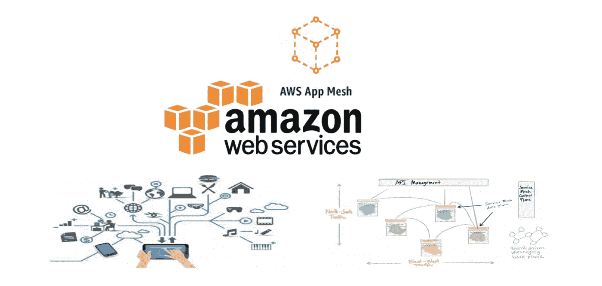

**AWS 的服务网格—应用网格**

在过去的几年中,“服务网格”的概念变得越来越流行，可供选择的方法也越来越多。有多个服务网格开源项目:Istio、Linkerd、Envoy 和 Conduit，它们可以部署在任何 Kubernetes 环境中。 [AWS App Mesh](https://aws.amazon.com/blogs/compute/introducing-aws-app-mesh-service-mesh-for-microservices-on-aws/) 可以与运行在[亚马逊弹性容器服务(亚马逊 ECS)](https://aws.amazon.com/ecs) 、[亚马逊弹性容器服务的 Kubernetes(亚马逊 EKS)](https://aws.amazon.com/eks) 和运行在亚马逊 EC2 的 [Kubernetes](https://aws.amazon.com/kubernetes) 上的微服务一起使用。其他解决方案和 App Mesh 之间的显著区别在于，AWS 管理控制平面，用户只需通过微服务部署数据平面，就可以将任何应用程序附加到网格。

它的功能和集成仍在开发中，可以在预览版中使用。App Mesh 为 AWS 上运行的微服务建立和管理服务网格。为此，App Mesh 在每个微服务容器旁边运行开源特使代理，并配置代理来处理进出每个容器的所有通信。

AWS App Mesh 的核心是一个使用 [Envoy 代理](https://www.envoyproxy.io/)的解决方案。它运行在第 3 层，但具有理解 HTTP、HTTPS、GRPC 和其它更高层协议的智能。它被写来做一件事，代理，并做好这一点。要大规模使用 Envoy(数百或数千个连接)，需要一个实体来管理 Envoy，这就是 App Mesh 所扮演的角色。App Mesh 可以与 AWS 中的任何计算服务一起使用(ECS、EKS、EC2)。理论上，任何可以与特使管理层对话的服务都可以集成，但这取决于集成。

# 应用网状架构

在将 Istio 或 Linkerd 用于服务网格的一般情况下，用户必须管理控制平面和数据平面。借助 App，网格数据平面部署在应用程序中，而控制平面对用户隐藏，由 Amazon 管理。与任何其他 AWS 托管服务一样，App Mesh 控制平面通过 CLI 和 SDK 公开。

任何服务网格架构都包括一个控制平面:控制流量的策略和配置集。它是决策实施方式和数据平面背后的“如何”:使用上面列出的功能(路由、负载平衡、安全等),数据(网络数据包)进出微服务所执行的实际操作。).由于 AWS 对用户屏蔽了控制平面组件，因此下面是必须由用户配置的数据平面组件。

# 成分

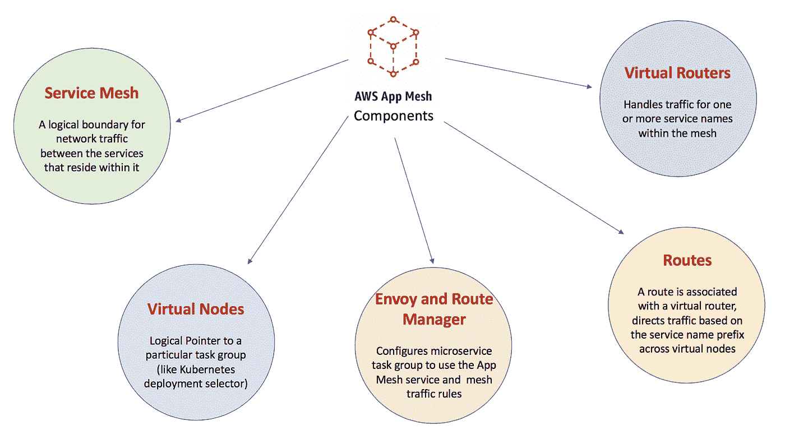

**AWS 服务网格组件**

要将 ECS/EKS 上的微服务与 App Mesh 集成，应在微服务部署工件中添加额外的容器，其中包括作为边车部署的 Envoy 代理容器。这些额外的容器拦截流量，并根据应用网格控制平面应用的策略对其进行控制。

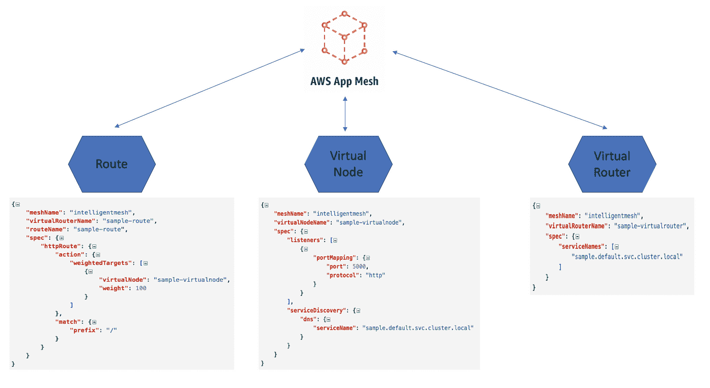

**服务网格组件**

# 应用网格对象

以一个经典的多层微服务为例，它包含多个版本的应用程序。以下 ColerApp 包括:

*   colorgateway:查询 *colorteller* 服务
*   colorteller:返回基于环境变量的颜色
*   TesterService:简单的服务，只查询 *colorgateway* 并将结果记录在日志文件中

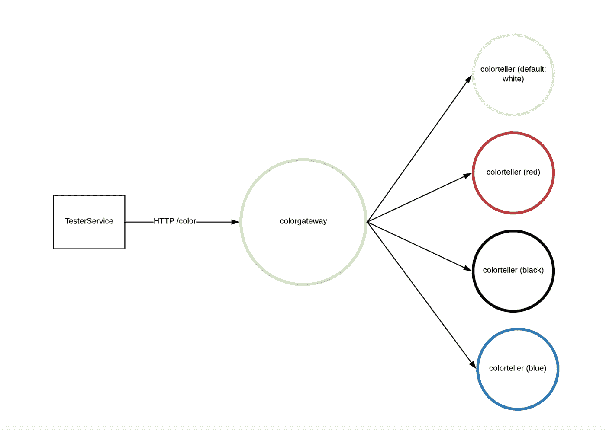

**应用网格对象**

除了微服务应用之外，应用堆栈中还嵌入了两个容器，即:Envoy (sidecar 代理，用于将所有 web 流量发送到应用容器)和 proxy-init(sidecar 容器，用于管理路由器配置),用于将微服务粘合到应用网格。

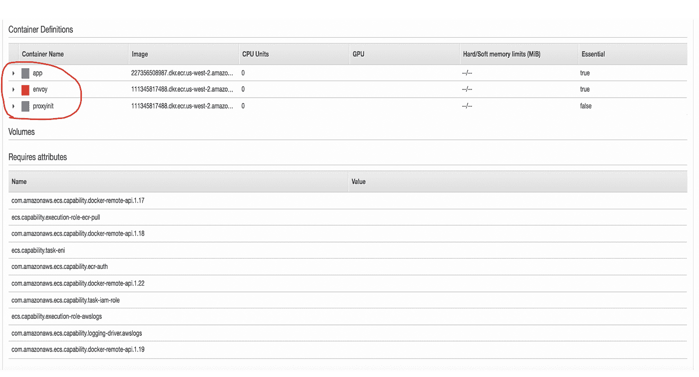

**集装箱定义— AWS**

要控制流向此特定应用的流量，应用网格数据平面需要使用 AWS 应用网格 CLI 在应用网格控制平面上创建以下对象:

1.  服务网

**列出网格**

2.到 colorgateway 和 colorteller 的虚拟路由器

**列出虚拟路由器**

3.每个特定服务/应用程序的虚拟节点

**列出虚拟节点**

4.通过特定虚拟路由器路由到特定服务

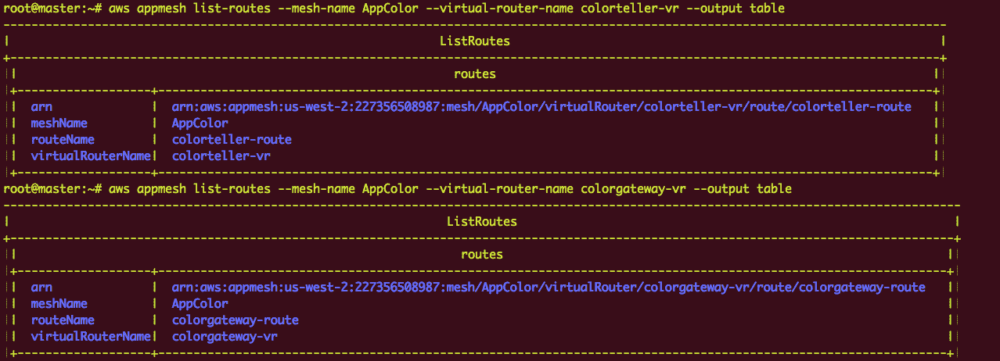

**列出路线**

# AWS Elastic Kubernetes 服务上的应用程序网格(EKS)

App Mesh 通过向 Kubernetes PodSpec 添加特使代理图像来与 EKS 合作。App Mesh 将指标、日志和跟踪导出到所提供的特使引导配置中指定的端点。App Mesh 提供了一个 API 来配置启用 Mesh 的微服务之间的流量路由、断路、重试和其他控制。

# 流动

以上面提到的 ColorApp 为例，下面简单介绍了将 EKS 上运行的微服务与 app mesh 集成的步骤:

1.  如上所示，创建一个名为 AppColor 的网格对象
2.  一个 EKS 控制平面连同工人被创建如下所示:

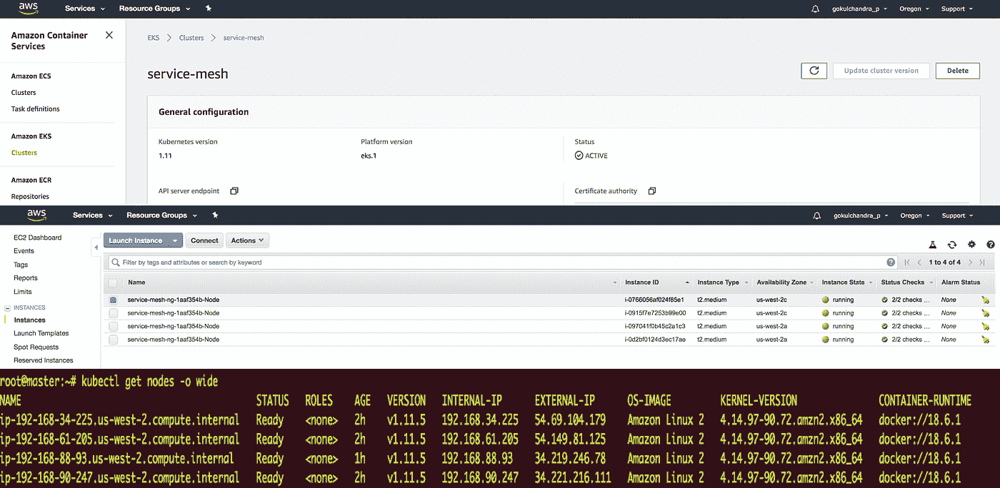

**AWS —服务网格**

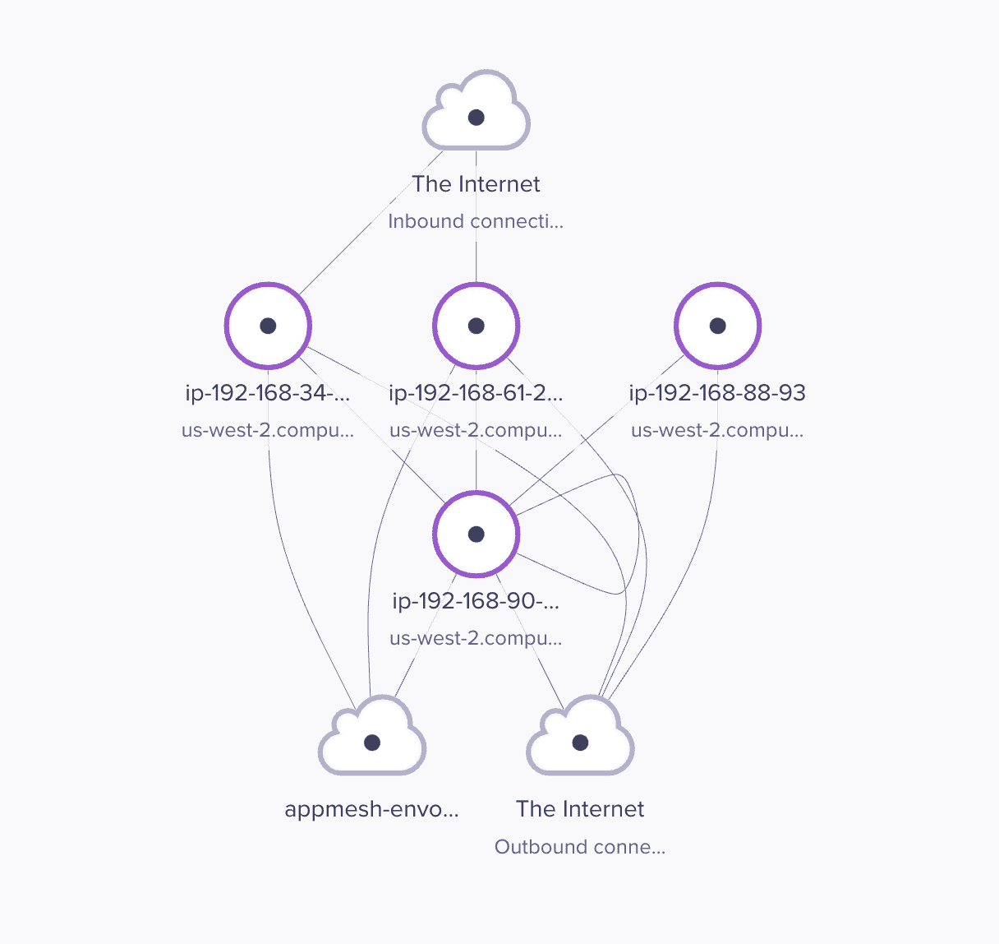

**Kubernetes 上的 Appmesh 用 Weaveworks 可视化—编织范围**

用户可以使用类似“ [Weave Scope](https://github.com/weaveworks/scope) ”的工具:Docker 和 Kubernetes 的可视化和监控工具。它提供了对您的应用程序以及整个基础架构的自上而下的视图，并允许您在将分布式容器化应用程序部署到云提供商时，实时诊断该应用程序的任何问题。

3.ColorApp 应用程序与工作负载清单中配置的 proxy-init 和 envoy 一起部署

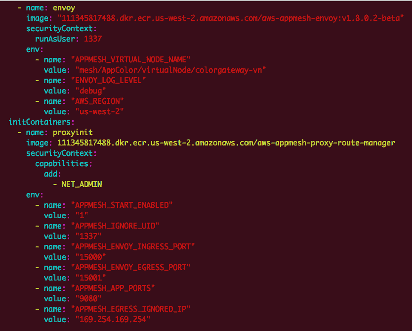

应用程序部署清单

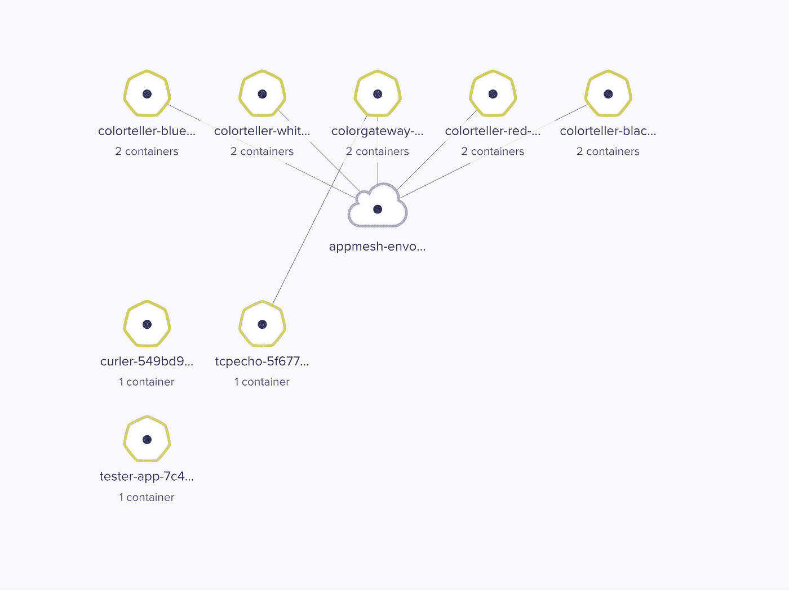

**EKS Kubernetes 上的示例应用—用 Weaveworks 可视化—编织范围**

每个 Pod 将构成一个特使和代理初始化容器:

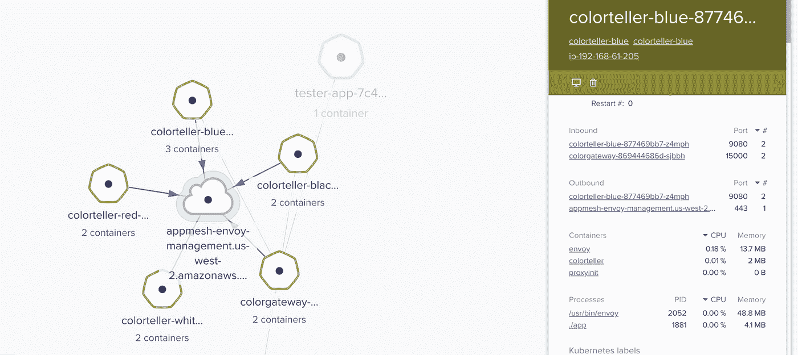

**Appmesh-Envoy 交互—用 Weaveworks 可视化— Weave 范围**

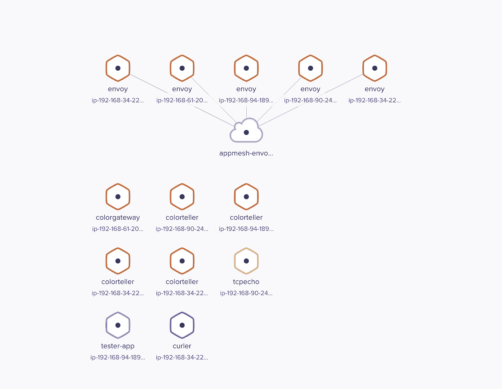

**示例应用程序容器—用 Weaveworks 可视化—编织范围**

部署上一节中提到的虚拟节点、路由器和路由:

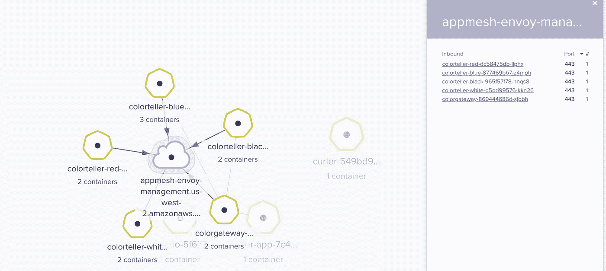

**虚拟节点和规则—用 Weaveworks 可视化—编织范围**

4.由于应用程序网格具有到 ColorApp 的特定服务的所需虚拟节点和路由，因此不同的规则可作为路由应用:

*   100%流量到 Colorteller-White 槽 colorteller-white-virtual_node 和 colorteller-virtual_router:

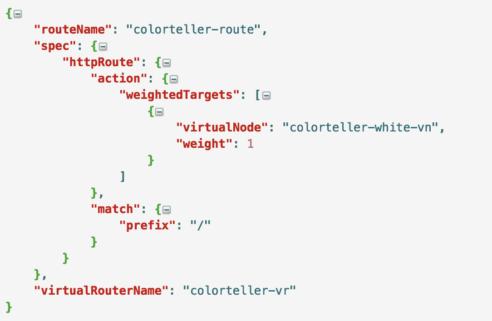

配置路线

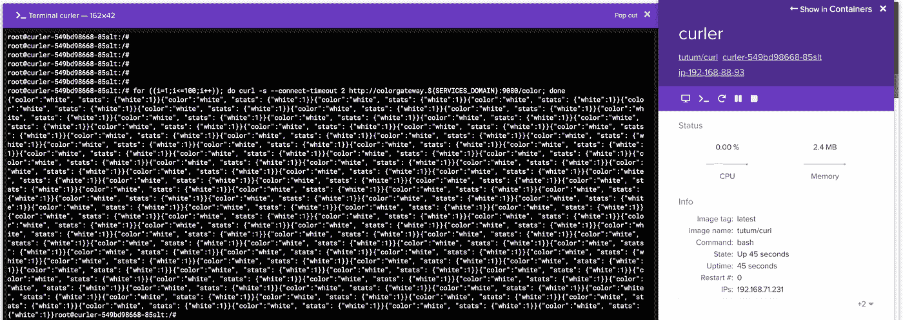

**Curl 到上面创建的服务—测试金丝雀流—使用 Weaveworks 的 Pod 管理—编织范围**

如上所述，使用 AWS 应用程序网格应用的金丝雀流已经到位，它控制着到白色版本的整个流量。

*   在蓝色和黑色之间划分流量(典型的金丝雀场景)

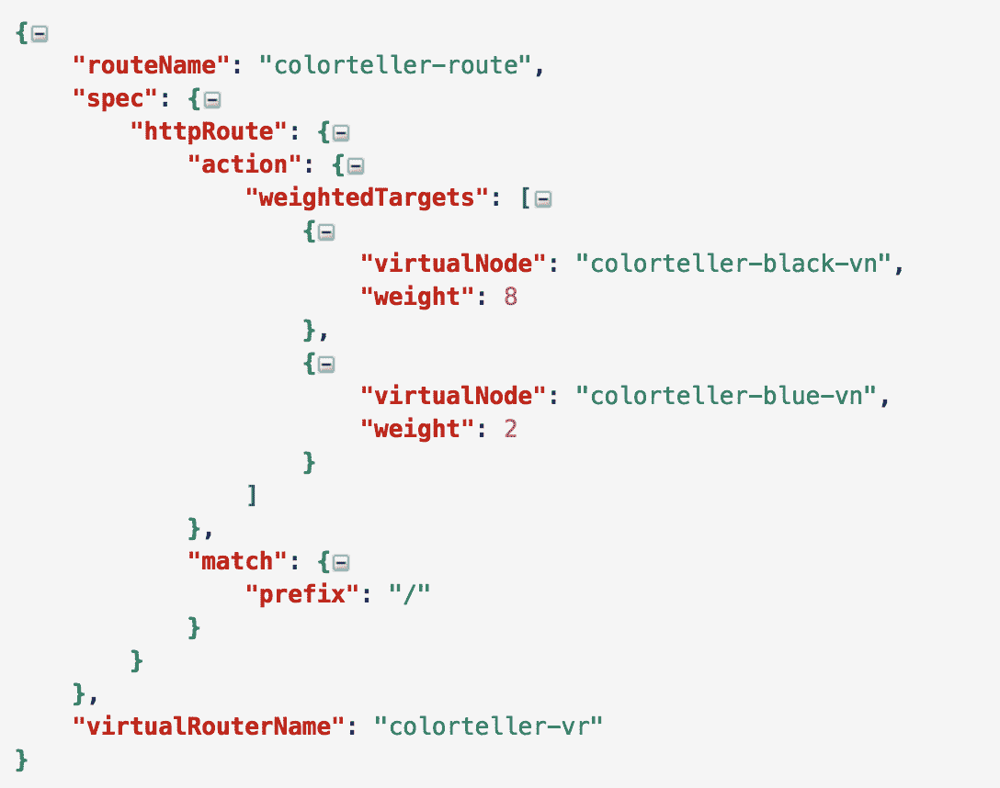

权重配置—路线规则

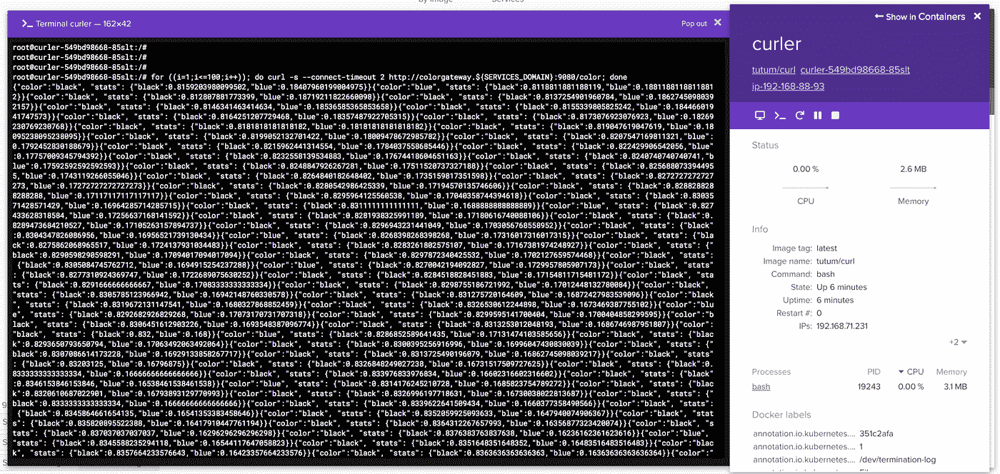

**测试重量—金丝雀规则—使用 Weaveworks 的 Pod 管理—编织范围**

如上所示，蓝色和黑色之间具有不同权重的金丝雀流由 AWS 应用网格执行，其中服务网格控制平面完全由 AWS 管理。实现下面显示的规则所需的底层配置是无缝的

Appmesh 规则

# AWS 弹性容器服务(ECS)上的应用网格

App Mesh 为 Amazon ECS 管理的应用程序提供了新的通信、观察和管理功能。将特使代理映像添加到 ECS 任务定义中，使 App Mesh 能够管理特使配置，从而为 ECS 上的微服务提供服务网格功能。

# 流动

以上面提到的 ColorApp 为例，将微服务与 app mesh 集成的步骤如下所示:

1.  如下所示，创建了一个由 3 个节点组成的群集来为 ECS 提供服务:

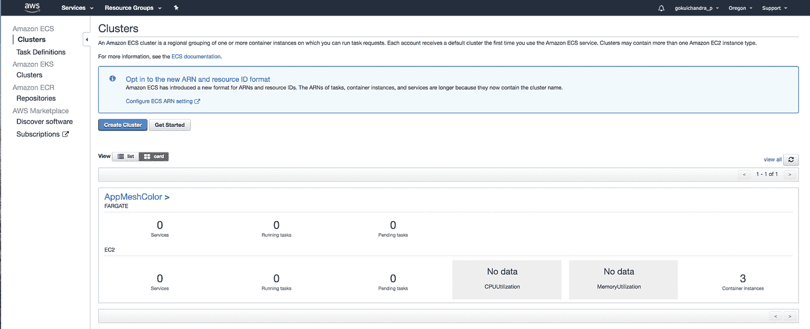

ECS — Appmesh

2.微服务的所有服务都部署到上面创建的 ECS 集群中:

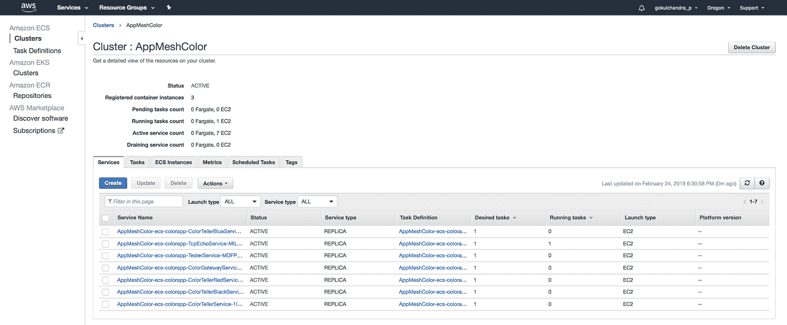

ECS 集群— Appmesh

3.每个服务任务定义包括两个额外的容器(envoy 和 proxy-init)以及 app 容器。

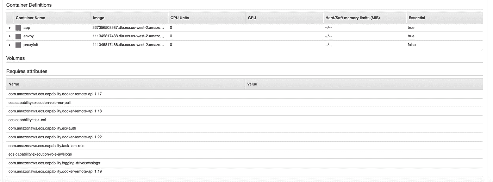

容器定义— ECS

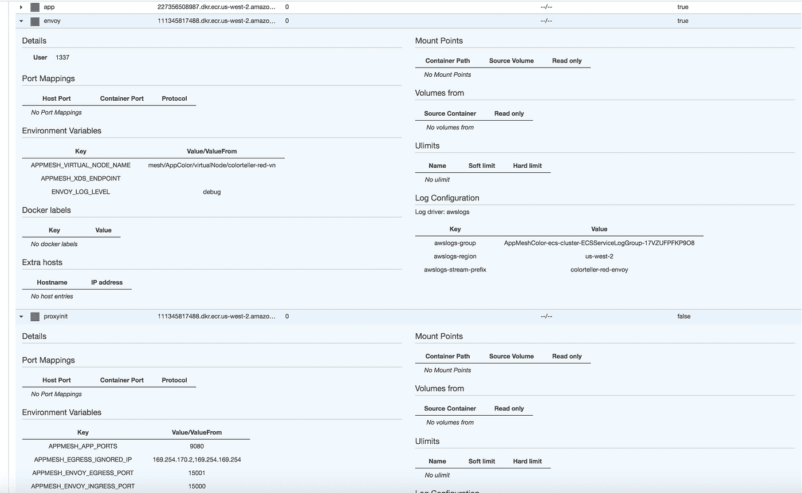

特使配置— ECS

4.在应用当前网格规则(不包含任何特定权重参数)的情况下，所有流量被直接发送到 colorteller-virtual_node，该节点在服务下的端点之间平均分配流量。

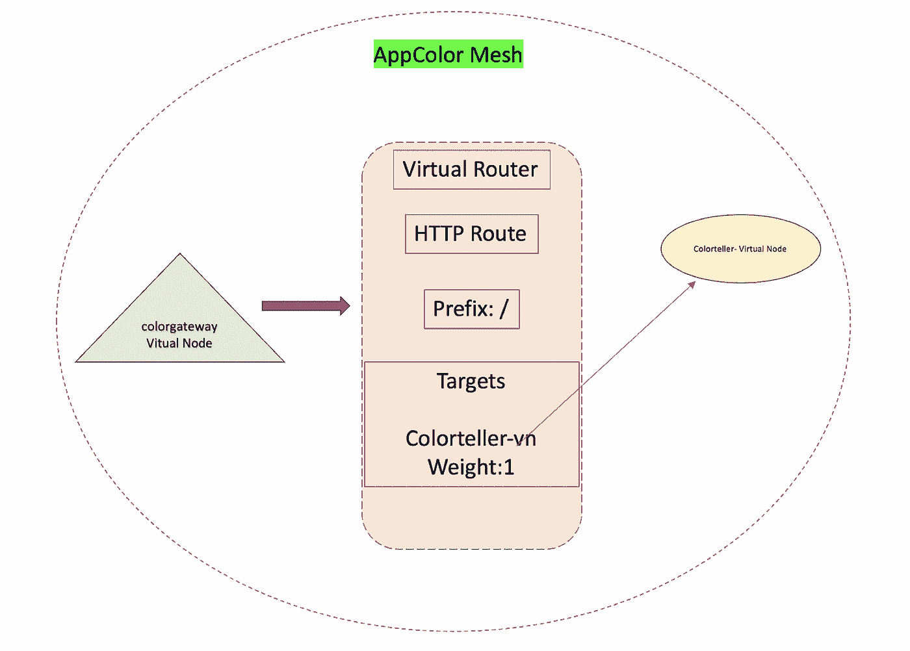

配置— Appmesh

5.将一个样本金丝雀流规则应用到网格中，可以在应用程序版本之间实现定向/加权流，这会改变下面显示的模式

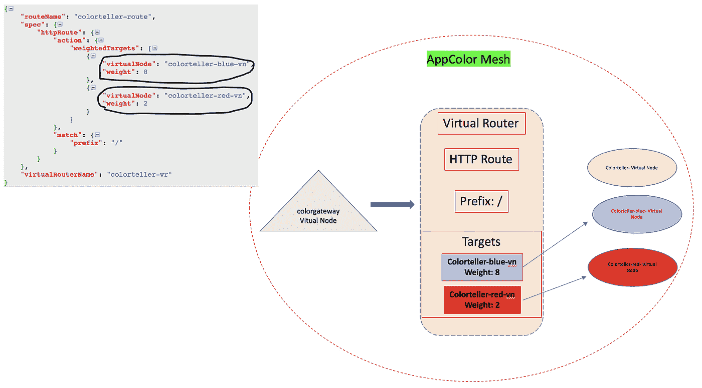

金丝雀流量配置

6.有了金丝雀规则，流量将根据提供的权重参数进行分配，回复将仅来自蓝色和红色

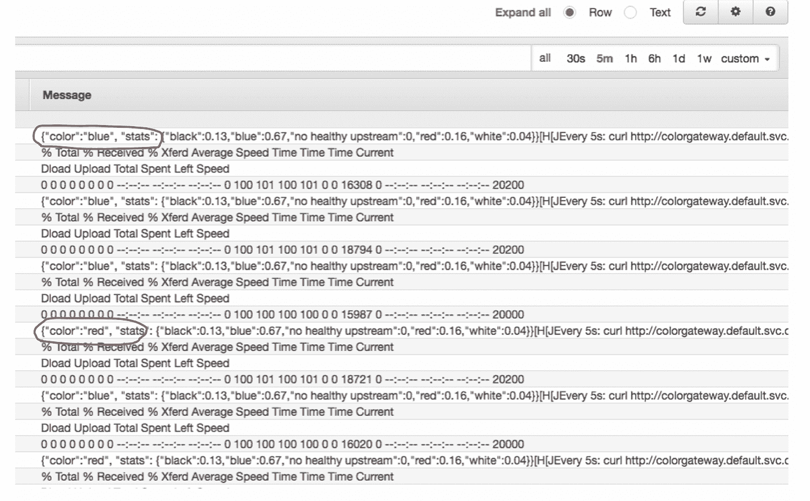

金丝雀在行动

App Mesh 可以在同一个微服务的多个版本之间进行切换，无需任何停机时间。通过改变路由器的规则，流量几乎可以立即从一个版本转移到另一个版本。可以密切监视参与同一个网格的微服务的延迟、错误率、跟踪和调试信息。这种遥测数据可以传输到 CloudWatch、X-Ray 和其他第三方监控解决方案。应用网格作为跨多个 AWS 平台的服务网格的统一平台带来了:

*   通过将通信管理逻辑从应用程序代码和库卸载到可配置的基础设施中来简化操作。
*   通过对整个应用程序的服务级别日志、指标和跟踪的端到端可见性，减少故障排除所需的时间。
*   通过动态配置到新应用程序版本的路由，轻松推出新代码。
*   通过自定义路由规则确保高可用性，这些规则有助于确保每项服务在部署过程中、出现故障后以及随着用户应用程序的扩展而高度可用。
*   使用一组 API 管理所有服务到服务的流量，而不管服务是如何实现的。

总之，AWS App Mesh 是对 AWS 构建模块和微服务架构的一个很好的补充。由于该项目仍在发展中，并有一个积极的路线图，用户可以期待 App Mesh 在未来扩展其对许多其他 AWS 内部服务的支持。