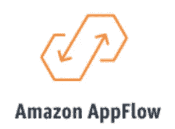
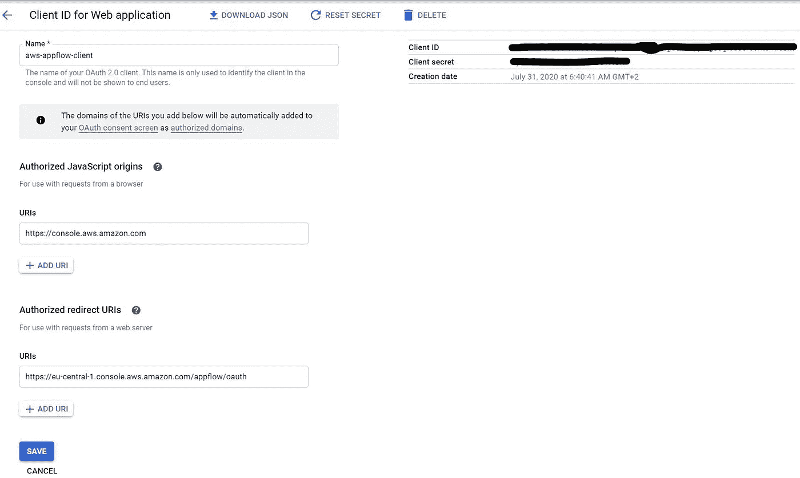
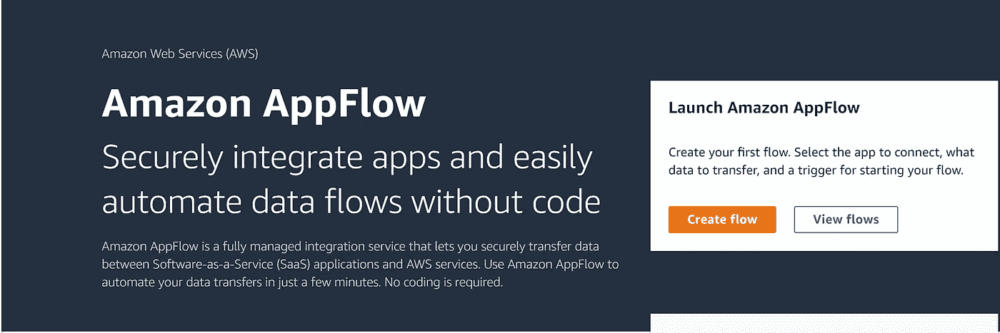
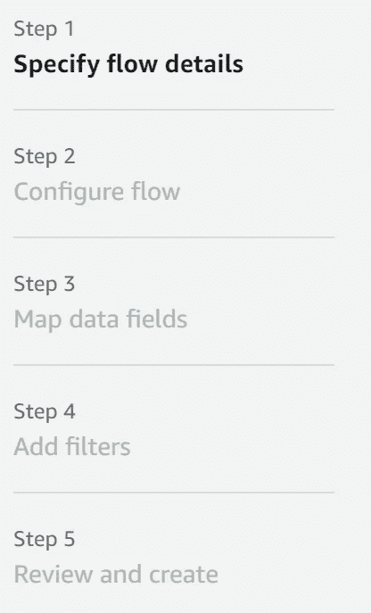
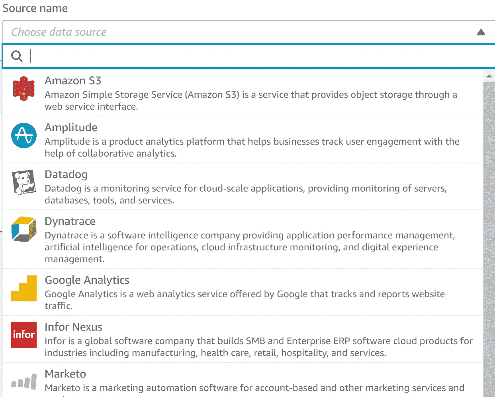
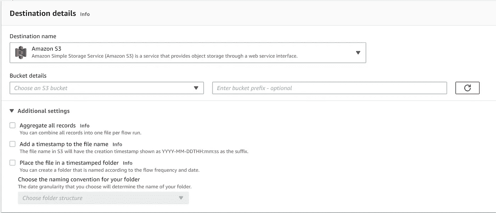
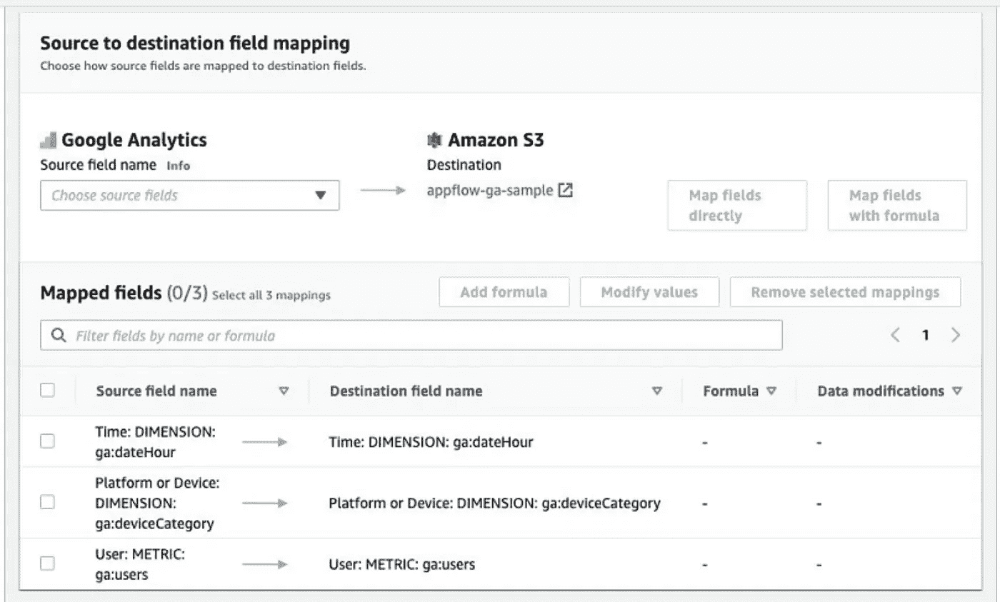
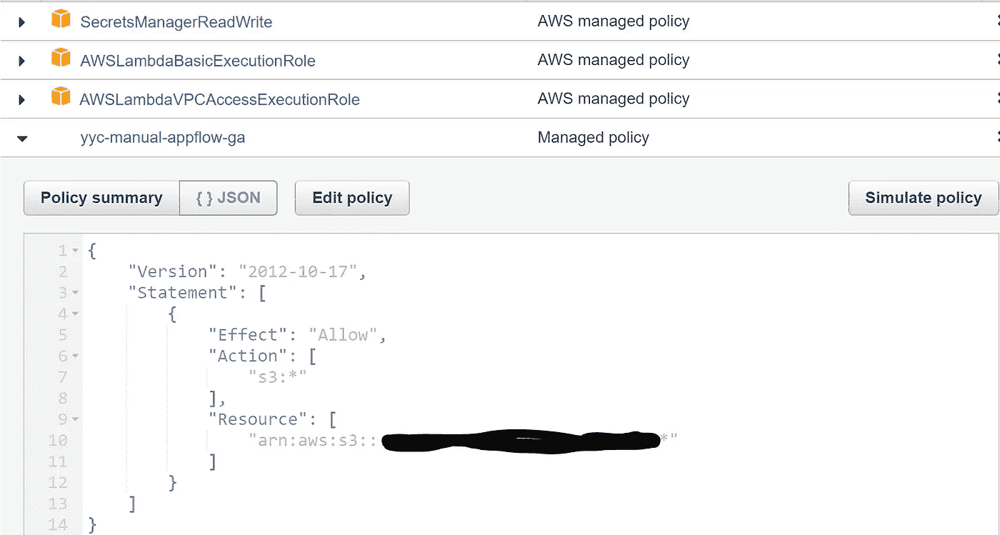
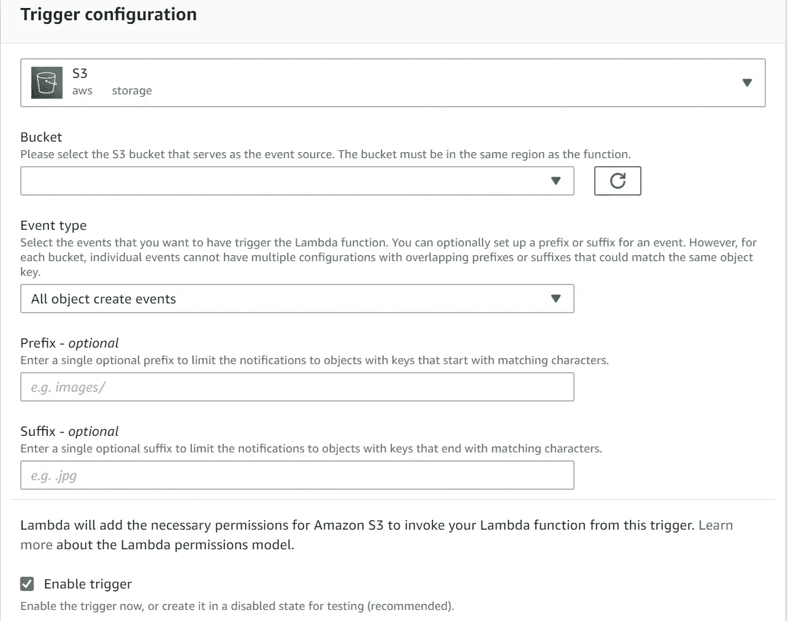

# Aws AppFlow:解锁您的 SaaS 数据

> 原文：<https://itnext.io/aws-appflow-unlock-your-saas-data-d3308cc99c7f?source=collection_archive---------4----------------------->



SaaS 行业在过去几年里有了巨大的增长，但是伴随着这种增长而来的是一个越来越棘手的问题，那就是如何分析这些数据。

大多数 SaaS 解决方案都有自己的“分析”插件，在大多数情况下价值不菲，但仍在各自为政(在 SaaS 解决方案中，你通常无法上传自己的数据)。那么，我们如何打破筒仓呢？通过在一个位置获取所有数据。

但是我们如何做到这一点呢？我们将从头开始编写所有代码，还是着眼于云提供商提供的服务世界？在大多数情况下，讨论的是交付速度与程序员的可用性。在你从头开始之前，对服务质量保持客观是一种健康的做法。所以，让我们看看 AppFlow 到底是一个牛逼的工具还是一个彻头彻尾的灾难。

# AWS AppFlow:简介

AWS AppFlow 是一项相对较新的服务，于 2020 年 4 月 22 日推出，用于将 SaaS 数据导入 AWS 平台。

亚马逊在下图中描述了 AWS AppFlow 的完整架构。


AppFlow 架构

总结一下，你有一个源，你可以对字段做一些操作，然后你把它写到目的地。看起来很简单，对吗？在接下来的部分中，我们将使用一个真实的例子来突出这个建筑图的不同部分。

# AWS 中的谷歌分析数据

在接下来的章节中，我们将设计一个用例，从 Google Analytics 获取数据并将其写入 AWS RDS。

## 设置对 Google 的访问

在我们真正做一些事情之前，我们需要一个谷歌云的用户帐户，以便能够与他们的 API 进行交互。所以让我们先设置一下(说明来自 AWS 文档页面)。

```
1\. On the Google API Console ([https://console.developers.google.com](https://console.developers.google.com/)), choose Library.
2\. Enter analytics in the search field.
3\. Choose Google Analytics API.
4\. Choose Google Analytics Reporting API listed in the search results.
5\. Choose ENABLE and return to the main page.
6\. Choose OAuth consent screen.
7\. Create a new Internal app (if you’re using your personal account, choose External).
8\. Add com as Authorized domains.
9\. Choose Add scope.
10\. Choose Save.
11\. Choose Credentials.
12\. Add OAuth client ID credentials.
13\. Choose Web application.
14\. Enter [https://console.aws.amazon.com/](https://console.aws.amazon.com/) as an authorized JavaScript origins URL.
15\. Enter [https://AWSREGION.console.aws.amazon.com/appflow/oauth](https://AWSREGION.console.aws.amazon.com/appflow/oauth) as an authorized redirect URL. (Replace AWSREGION with the Region you’re working in.)
16\. Choose Save.
```

这意味着当您完成后，该帐户将如下所示。



OAuth Google

## 设置您的第一个 AppFlow

有了我们的证书，我们就可以开始使用 AWS 了。登录您的 AWS 帐户，从服务中选择“AppFlow”。



介绍屏幕应用程序流

在简介屏幕上，按“创建流程”。在左侧，您将看到您需要浏览 5 个步骤。



左侧面板—侧面导航

在步骤 1 中，我们唯一需要提供的是流的名称。所以，输入一个有意义的名字。现在，我们将把其他字段留空。


流程名称—流程详细信息

如果完成，请按页面底部的“下一步”进入第 2 步。在第 2 步中，我们将定义要读取的数据源。你可以看到有相当多的服务可用，但由于我们将重点放在“谷歌分析”，从下拉菜单中选择“谷歌分析”。



源选择

接下来，我们需要指定一个有效的连接。如果您从未指定连接，您将只能获得创建新连接的选项。一旦指定了一个连接，它就可以被重用，并将作为下拉列表的一部分出现。


一旦您按下“创建新连接”，您将需要指定一个“客户端 ID”和一个“客户端密码”。你可以在你的谷歌证书页面找到这些。一旦输入，按继续，谷歌现在将尝试验证连接。一旦连接通过验证，它将显示在连接字段中。

接下来，我们选择对象，它始终是报告。


在选择报告之后，我们基本上需要从一个特定的视图或者从所有的报告中提取数据。您在这里选择的是特定于用例的。要么选择特定视图，要么选择“所有网站数据”。


最后，我们到达目的地端点，它只能是 S3。选择一个 S3 桶(或快速创建一个，然后返回到此屏幕)。如果您愿意，可以指定一个 bucket 前缀来对数据进行分组(可以使用名为“raw”的前缀来表示这是来自源的原始数据)。请注意，一旦您选择了 S3 时段，将会出现“流量触发器”窗口。我们将保留这些设置的默认值。



在附加设置中，您有一些您可能想使用或不想使用的选项。我建议现在选中“汇总所有记录”(是的，我有一个隐藏的议程选择这个选项)。

完成后，请按下一步。

第三步是有趣的地方。在这里，我们将定义要用于报告的指标和维度。我的建议是，在这里你选择什么完全取决于你自己，从小处着手，然后一步步努力。

选择“源字段名称”后，您可以按“直接映射字段”按钮来自动生成目标字段名称。



如果您对所选字段满意，请按下一步转到第 4 步。在第 4 步中，我们可以向数据中添加过滤器，但现在让我们跳过这一步，继续第 5 步。如果您对步骤 5 中的概述感到满意，请点击“创建流程”。

## 数据输出

在我们继续之前，让我们看看数据结构将会是什么样子。点击选择您的流程，然后点击“运行流程”。这可能需要一段时间，具体取决于数据大小，如果流成功，它将生成一个到在 S3 生成的文件的链接。

让我们来看看这个文件的内容(我将只展示我的文件的一小部分，根据您选择的维度和度量，您的文件可能看起来有所不同)。

```
{
  "reports": [
    {
      "columnHeader": {
        "dimensions": [
          "ga:date",
          "ga:deviceCategory",
          "ga:mobileDeviceInfo",
          "ga:browser",
          "ga:eventCategory",
          "ga:eventAction"
        ],
        "metricHeader": {
          "metricHeaderEntries": [
            {
              "name": "ga:users",
              "type": "INTEGER"
            },
            {
              "name": "ga:newUsers",
              "type": "INTEGER"
            }
          ]
        }
      },
      "data": {
        "rows": [
          {
            "dimensions": [
              "20200724",
              "mobile",
              "(not set)",
              "Chrome",
              "Outbound links",
```

很好，一个 JSON 结构化文件，但是如果您想要表格格式的数据呢？毕竟，这些数据将由企业进行分析，所以把这个文件交给他们只会让他们回到你的办公桌前，请求帮助加载数据。

有几种方法可以实现数据转换，但我们将把数据加载到 PostgreSql 实例中，使业务更容易查询数据或在其上使用报告工具。

## AWS Lambda 来救援了

如果你不知道 AWS Lambda 是什么，我建议你看看这里的。一个简短的解释是，AWS Lambda 是一个无服务器的解决方案，让您在最长 15 分钟的时间内运行代码。lambda 函数可以以多种方式触发，但对于我们的解决方案，我们将在每次在 S3 存储桶上生成文件时触发该函数，我们已经在 AppFlow 流中将该存储桶定义为目标。

所以，让我们开始编码吧。

我们的程序需要做几件事:

*   阅读 JSON 文件
*   以通用方式创建表格格式
*   将数据写入 RDS

我们将突出代码的某些部分，对于整个解决方案，你可以访问我的 [github](https://github.com/Ycallaer/lambda-appflow-ga) repo。

为了理解我们需要处理哪个文件，我们需要从触发的事件中提取桶名和对象键。一旦我们有了这些信息，我们就可以唯一地识别文件。

```
bucket_name = event['Records'][0]['s3']['bucket']['name']
object_key = urllib.parse.unquote_plus(event['Records'][0]['s3']['object']['key'])
```

一旦我们加载了 JSON 文件，我们就可以将文件转换成表格格式。为了实现这一点，我们需要列名和指标名，AWS 在 JSON 中提供了这些名称。

```
cols = [r for r in jsonf[0]['reports'][0]['columnHeader']['dimensions']]...metrics = [r['name'] for r in jsonf[0]['reports'][0]['columnHeader']['metricHeader']['metricHeaderEntries']]
```

接下来我们将开始提取数据。

```
data_rows = [r for r in jsonf[list_index]['reports'][0]['data']['rows']]
```

在这里，我们将构建一个 dictionary 对象，它将维度/指标名称作为一个键，对于值，我们将构建一个包含该维度/指标的所有相关值的列表。这样做的好处是，最终我们可以从整个 dictionary 对象创建一个 pandas 数据帧。

```
pd_result = pd.DataFrame.from_dict(dim_result_dict)
```

好了，pd_result 现在包含了表格格式的所有数据。从这里开始，将数据写入数据库非常简单。dataframe 具有“to_sql”方法，如果指定了有效的连接，该方法允许我们立即写入数据库。

```
from sqlalchemy import create_engine...pd_result.to_sql(name=db_tmp_table, con=db.create_engine(), index=False, if_exists='replace')
```

我们使用 sqlalchemy 库来构建一个有效的数据库连接。数据现在在数据库中。

## 部署 lambda

虽然这篇文章并不打算作为 AWS Lambda 的练习，但我将快速触及如何成功部署 Lambda 功能的一些要点。

您可以编写整个部署的脚本(我建议您这样做，因为您不可避免地需要重新部署来修复错误)或者手动设置它。

在开始之前，我们需要一个 IAM 角色，它为 lambda 函数提供必要的执行权限，所以让我们转到 IAM → Roles，并创建一个附加了以下策略的新角色。



IAM 角色 Lambda 配置

托管策略是您需要添加的一个策略，以便为 lambda 提供对用于存储结果的 S3 存储桶的完全访问权限。

另外，我添加了 secrets manager 权限，但是在本例中，我们没有将数据库凭证存储在 secrets manager 中。在生产中，您需要使用 secrets manager。

接下来，我运行脚本“packager.sh ”,它是解决方案 repo 的一部分，以压缩解决方案并将整个解决方案上传到 AWS Lambda。如果你想手动操作，那就看你的了。

我们完事了吗？几乎，您需要导航到您的 AWS Lambda 函数并添加一个 S3 触发器，从触发器配置中，您将需要从 AppFlow 中选择被用作目标的 bucket。



每次一个对象被写入 S3，lambda 函数就会触发并执行。

对于那些完全不熟悉 AWS lambda 的人来说，为了让 Lambda 函数与数据库交互，Lambda 函数需要与数据库在同一个 VPC 中。这超出了本练习的范围，但是您可以在这里找到文档。

## 运行并查看数据

好了，我们终于完成了，可以看数据了。从 AppFlow 手动触发你的工作流，过一会儿你会得到一个消息，输出是在 S3 上生成的。

现在前往 AWS Cloudwatch，让我们看看日志记录说了些什么


AWS Lambda 的 Cloudwatch

如您所见，数据被成功转换并写入数据库。

# AWS AppFlow:陷阱、错误和缺失

在开发解决方案时，我确实遇到了一些问题。这些问题都不是主要障碍，但需要具体的解决方案。

这是我发现的问题的总结。

## 问题 1:没有自动化

这与其说是一个问题，不如说是一个烦恼。因为这项服务太新了，所以无法通过 CLI 或 Terraform 创建流。有一个 github 请求开放纳入 AWS CLI 的这项服务，但我们将不得不耐心等待。

## 问题 2:维度和指标-请求失败

在测试时，我随机选择了一些维度和指标，并尝试运行我的流程。然而，Google 对哪些维度可以与哪些指标相结合施加了限制(查看[浏览器](https://ga-dev-tools.appspot.com/dimensions-metrics-explorer/)中所有可用的解决方案)，这导致了以下结果


AWS 代码 400

需要注意的是，AWS 不会验证您创建的是有效还是无效的组合。因此，如果您看到此错误，请检查您的指标/维度组合。

## 问题 3:聚合多个文件中的数据→ JSONDecodeError

谷歌分析与分页一起工作，这意味着如果你超过 1000 条记录，一个新的文件将被创建，包含下一组结果。当我们选中“聚合所有数据”时，AWS 会将多个文件合并为一个文件。很棒吧？

然而，当我得到 1054 条记录的结果时，我的代码中突然出现了以下问题。


我很困惑，因为我的原始代码确实在较小的数据集上工作，所以我查看了该文件，发现 AWS 从多个文件中取出所有 JSON 对象，然后一个接一个地写入它们，使得最终文件包含一个无效的 JSON 对象。所以我需要扩展我的代码来做一些“查找-替换”

```
raw_object = s3_client.get_object(Bucket=bucket_name, Key=object_key)raw_data = json.loads('[' + raw_object['Body'].read().decode('utf-8').replace('}\n{', '},{') + ']')
```

现在我们有了一个有效的 JSON 对象。

## 问题 4:无效的对象键

如前所述，AWS Lambda 事件包含桶名和对象键(基本上是文件的完整路径)。然而，在开始时，我是用下面的代码行读取对象键的

```
object_key = event['Records'][0]['s3']['object']['key']
```

要了解为什么这不起作用，您需要查看文件。该文件包含由“:”分隔的时间，导致对非 ascii 字符的解析。如果您只是读取对象键，它将返回一个不同于实际文件位置的值。要重建原始文件名，可以使用“urllib.parse”库。

```
import urllib.parse...object_key = urllib.parse.unquote_plus(event['Records'][0]['s3']['object']['key'])
```

# AWS 应用程序流:结论

虽然我只测试了一个连接源，但这似乎是一个经过深思熟虑的服务。这是我的简单分类:

积极的一面

*   与谷歌云轻松集成
*   针对特定来源的详细记录的设置
*   这些步骤让你很容易理解你在做什么
*   它不需要太多的技术知识，所以你可以把它交给一个商业人士
*   与其他 AWS 服务的良好集成
*   不同的源集成不需要编码

负面影响

*   没有部署 AppFlow 的自动化(在撰写本文时)
*   Google Analytics 中没有验证指标/维度组合
*   只有一个目标可用(现成的 RDS 更好)
*   仍然需要一些编码来创建表格数据或用 Athena 设置
*   如果 AWS 将多个文件聚合成 1 个，为什么要创建无效的 JSON 对象？

工程的数量大大减少了，如果你的 lambda 函数足够通用，你甚至可以把这个工具给企业(以及他们需要做什么的小指南)。观察这项服务在未来如何发展将会很有趣。

希望你喜欢这篇文章。