# 适用于 LoRaWAN、AWS 物联网分析和 Amazon QuickSight 的 AWS 物联网核心

> 原文：<https://itnext.io/aws-iot-core-for-lorawan-amazon-iot-analytics-and-amazon-quicksight-8387a73d056a?source=collection_archive---------3----------------------->

## 使用最近发布的面向 LoRaWAN 的 AWS 物联网核心，通过 LoRaWAN 网关和设备监控室内空气质量

在下面的帖子中，我们将学习如何使用私有的 LoRaWAN 传感器设备网络监测室内空气质量(IAQ)。这些设备使用新发布的 AWS 物联网核心 LoRaWAN 服务，通过 LoRaWAN 网关向 AWS 传输其传感器遥测数据。然后，我们将使用 AWS 物联网分析和亚马逊 QuickSight 来分析和可视化传感器数据。


显示 IAQ 传感器数据的亚马逊 QuickSight 仪表盘

# 介绍

2020 年 12 月 15 日，AWS [宣布](https://aws.amazon.com/about-aws/whats-new/2020/12/introducing-aws-iot-core-lorawan/)支持 Semtech 的低功耗、远程广域网(LoRaWAN)连接。LoRaWAN 设备和网关现在可以使用[用于 LoRaWAN 的 AWS 物联网核心](https://aws.amazon.com/iot-core/lorawan/)连接到 AWS 物联网核心。AWS IoT Core for LoRaWAN 是一项完全托管的功能，支持客户将使用 LoRaWAN 协议的无线设备与 AWS 云连接起来。使用 AWS 物联网核心，客户现在可以通过[安全地](https://docs.aws.amazon.com/iot/latest/developerguide/connect-iot-lorawan-security.html#connect-iot-lorawan-security-devices)将他们的 LoRaWAN 设备和网关连接到 AWS 云来建立私有的 LoRaWAN 网络——而无需开发或操作 [LoRaWAN 网络服务器](https://lora-alliance.org/lora_products/lorawan-network-server/) (LNS)。

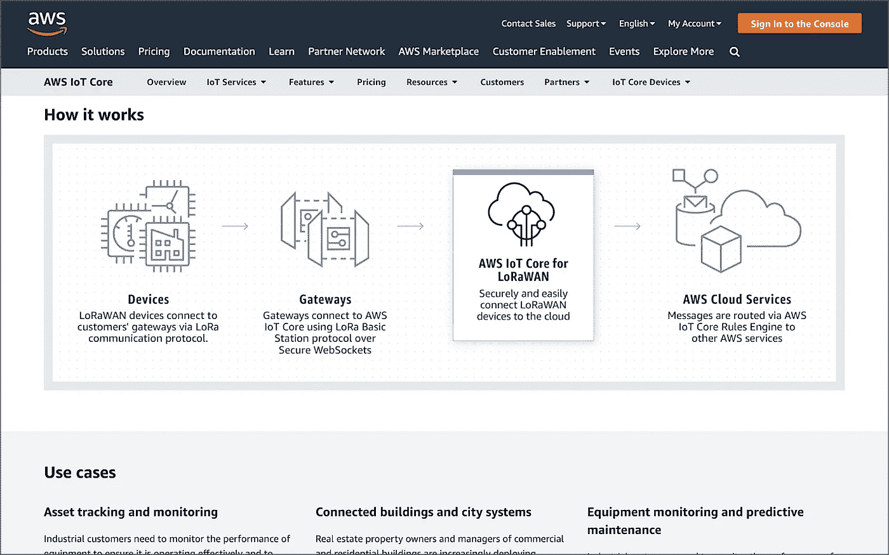

LoRaWAN 网站的 AWS 物联网核心

[LoRa 联盟](https://lora-alliance.org/about-lorawan/)将 LoRaWAN 规范描述为一种低功耗、广域(LPWA)网络协议，旨在将电池供电的“东西”无线连接到地区、国家或全球网络中的互联网，并以双向通信、端到端安全性、移动性和本地化服务等关键物联网(IoT)需求为目标。LoRaWAN 规范定义了设备到基础设施(LoRa)物理层参数和(LoRaWAN)协议，提供了制造商之间的无缝互操作性。

根据[维基百科](https://en.wikipedia.org/wiki/LoRa)，LoRa(远程)是一种专有的低功耗广域网调制技术。它基于从线性调频扩频(CSS)技术衍生而来的扩频调制技术。由法国格勒诺布尔的 Cycleo 公司开发，被 LoRa 联盟的创始成员 Semtech 公司收购，并获得专利。

## AWS 认证的硬件

随着 AWS 物联网核心 for LoRaWAN 的发布，AWS 发布了在 [AWS 合作伙伴设备目录](https://devices.amazonaws.com/)中找到的合格网关列表。该目录帮助客户发现与 AWS 服务配合使用的合格硬件，以帮助构建和交付成功的物联网解决方案。面向 LoRaWAN 的 AWS 物联网核心支持名为 [LoRa Basics Station](https://lora-developers.semtech.com/resources/tools/lora-basics/lora-basics-for-gateways/) 的开源网关-LNS 协议软件，这是一个 LoRa 数据包转发器的实现。AWS 物联网核心 LoRaWAN 网关认证计划使客户能够采购符合所需 LoRa 基础站规范的预测试 LoRaWAN 网关和开发人员套件。

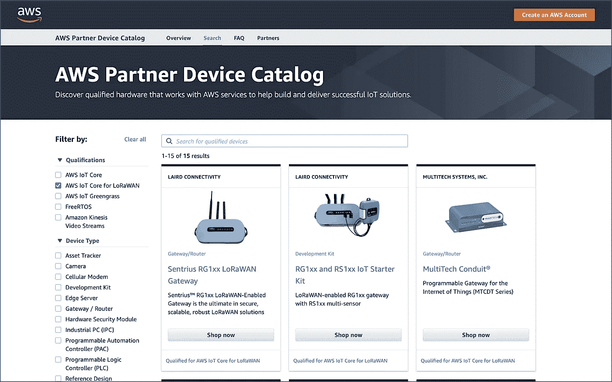

AWS 合作伙伴设备目录

## 洛拉万网关

在这篇文章中，我们将使用布劳万通信公司生产的符合 AWS 标准的 LoRaWAN 兼容 [MiniHub Pro](https://devices.amazonaws.com/detail/a3G0h000007dlLPEAY/MiniHub-Pro) 网关。售价 109 美元的 MiniHub Pro 是一款低成本网关，它使用 [LoRa Basics Station](https://doc.sm.tc/station/) 将从 LoRaWAN 设备(上行链路)接收的 RF 数据包转发到 LoRaWAN 网络服务器(LNS)，这是 LoRaWAN 服务的 AWS 物联网核心的一部分。MiniHub Pro 基于微控制器的实时操作系统 [FreeRTOS](https://www.freertos.org/) 。

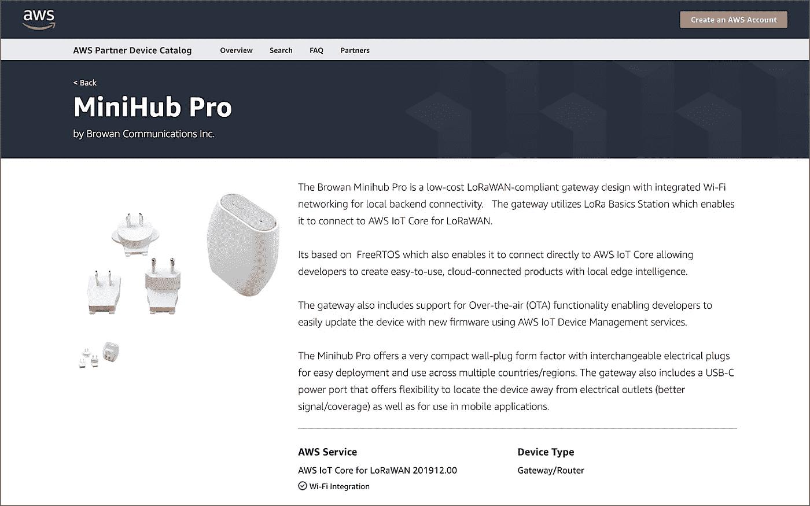

符合 AWS 标准、符合 LoRaWAN 标准的 MiniHub Pro 网关

## 劳拉旺设备公司

除了网关之外，我们还将使用一套两个型号为 TBHV110 915 Mhz [的健康家庭传感器 IAQ](https://www.browan.com/product/healthy-home-sensor-iaq/detail) ( *又名 Tabs Healthy Home* )，也是由 Browan Communications Inc .制造的。根据 Browan 的说法，健康家庭传感器利用 LoRaWAN 连接( [LoRaWAN 1.0.3](https://lora-alliance.org/resource_hub/lorawan-specification-v1-0-3/) )来传递周围环境的温度、相对湿度、挥发性有机化合物(VOC)水平和室内空气质量(IAQ)。健康家庭传感器每个传感器的价格是 60 美元。这篇文章中使用的网关和两个设备是从[Cal-Chip Connected Devices](https://www.calchipconnect.com/)购买的，总零售成本为 229 美元，外加税和运费。

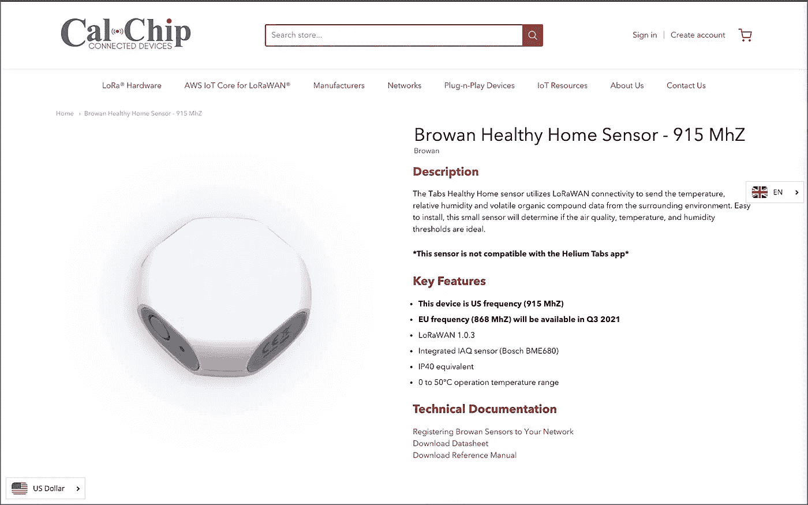

Cal-Chip Connected Devices 提供的健康家庭传感器 IAQ

## IAQ 指数

健康家庭传感器确定 IAQ 指数，读数在 0-500 之间，表示一般空气质量。根据美国疾病预防控制中心的说法，监测和保持良好的室内空气质量和适当的通风对减少新冠肺炎潜在的空气传播至关重要。

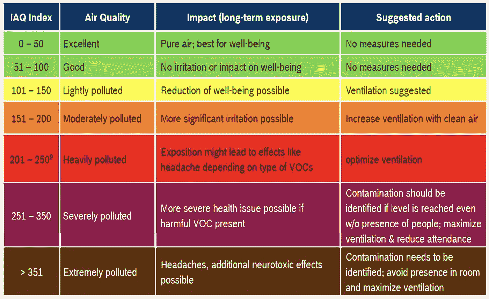

图表由布朗健康家庭传感器(IAQ)参考指南提供

# 源代码

这篇文章的源代码可以在 [GitHub](https://github.com/garystafford/lorawan-iot-core-demo) 上找到。使用下面的命令来`git clone`项目的本地副本。

```
git clone --branch main --single-branch --depth 1 \
    [https://github.com/garystafford/lorawan-iot-core-demo.git](https://github.com/garystafford/lorawan-iot-core-demo.git)
```

Lambda 函数及其相关的 AWS 资源使用 [AWS 无服务器应用程序模型](https://aws.amazon.com/serverless/sam/) (SAM)进行部署。本演示中使用的主要 AWS 资源显示在下面的体系结构图中。


这篇文章演示的架构

# 添加网关和设备

结合制造商的产品手册， [AWS 文档](https://docs.aws.amazon.com/iot/latest/developerguide/connect-iot-lorawan.html)将指导您使用 AWS 物联网核心为 LoRaWAN 添加 LoRaWAN 网关和设备。在 AWS 上添加网关和设备是简单明了的，只要您有制造商或零售商提供的适当的 GatewayEUI、DevEUI、AppEUI(又名 JoinEUI)和 AppKey。


为 LoRaWAN 向 AWS 物联网核心添加 LoRaWAN 设备

## 空中激活(OTAA)

在这篇文章中，网关和传感器设备使用[无线激活](https://www.thethingsindustries.com/docs/devices/abp-vs-otaa/#otaa) (OTAA)连接到 LoRaWAN 的 AWS 物联网核心。根据[物联网](https://www.thethingsindustries.com/docs/devices/abp-vs-otaa/#why-is-otaa-better-than-abp)和 [AWS](https://iotwireless.workshop.aws/300_device/050_key_concepts/170_activation.html) ，OTAA 优于[个性化激活](https://www.thethingsindustries.com/docs/devices/abp-vs-otaa/#abp) (ABP)，因为它更安全。使用 OTAA 时，临时会话密钥是在每次激活时从根密钥中派生出来的。ABP 使用静态密钥，不太安全，如果用例没有明确要求，就不应该使用。

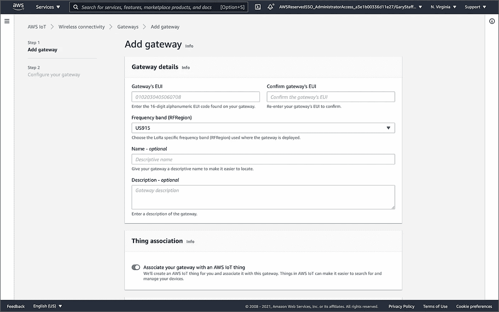

为 LoRaWAN 向 AWS 物联网核心添加 LoRaWAN 网关

LoRaWAN 网关被添加到 LoRaWAN 的 AWS 物联网核心。然后，使用从物联网核心接收的信息在本地配置网关。使用 MiniHub Pro，您可以启用 [FreeRTOS 空中更新](https://docs.aws.amazon.com/freertos/latest/userguide/freertos-ota-dev.html)和[配置和更新服务器](https://docs.aws.amazon.com/iot/latest/developerguide/connect-to-iot.html#iot-lorawan-endpoint-intro) (CUPS)。

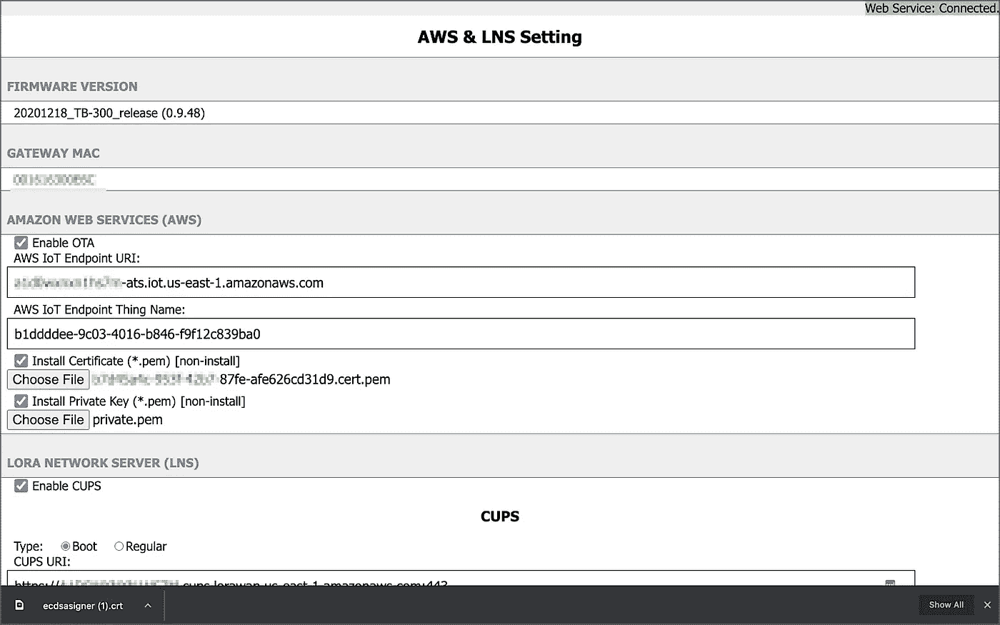

为无线(OTA)更新配置 MiniHub Pro 网关

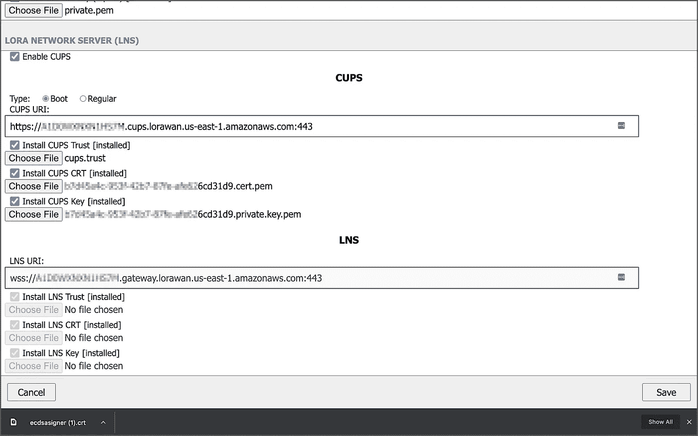

为配置和更新服务器(CUPS)配置 MiniHub Pro 网关

在下面，我们看到 MiniHub Pro 网关已成功添加到物联网核心，并通过该连接与作为 LoRaWAN 网络服务器(LNS)的 LoRaWAN 的 AWS 物联网核心交换了上行链路帧(RF 数据包)。

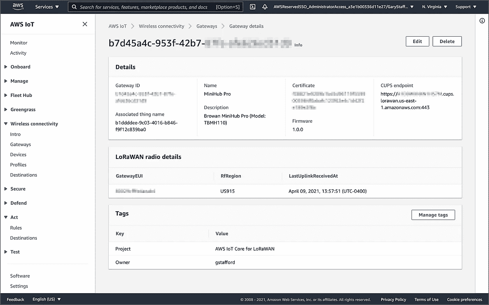

为 LoRaWAN 的 AWS 物联网核心添加了 MiniHub Pro 网关

然后，我们以类似的方式添加两个健康的家庭传感器设备。


为 LoRaWAN 向 AWS 物联网核心添加 LoRaWAN 设备

下面，我们看到两个健康家庭传感器设备中的一个已经成功连接到 LoRaWAN 的 AWS 物联网核心，并且还通过 MiniHub Pro 网关传输了上行链路帧。

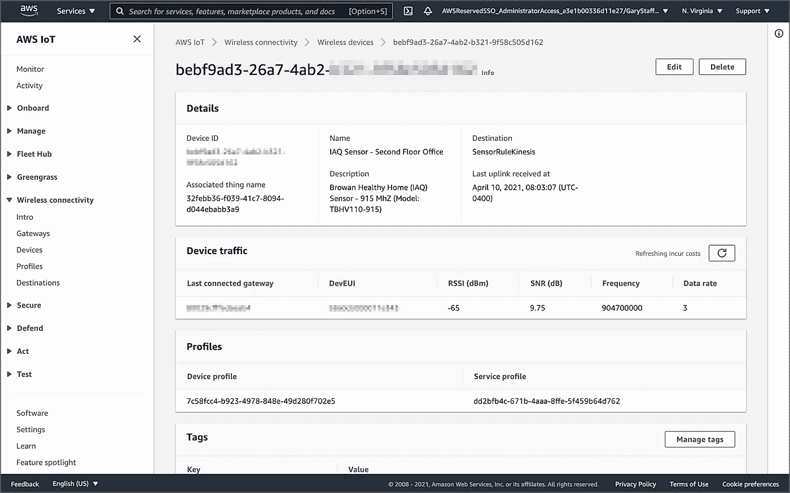

健康家庭传感器加入 AWS 物联网核心

# 物联网目的地

从网关接收来自设备的消息，并使用目的地将其路由到物联网规则。根据 [AWS](https://docs.aws.amazon.com/iot/latest/developerguide/connect-iot-lorawan-create-destinations.html) 的说法，目的地描述了处理来自无线设备的数据的 AWS 物联网规则，以便 AWS 物联网服务可以使用这些数据。许多设备可以共享一个目的地。

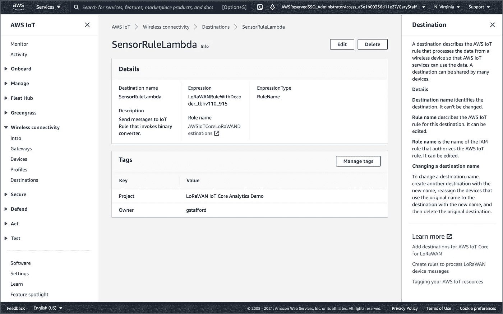

AWS 物联网核心无线连接目的地将设备连接到物联网规则

# 物联网规则

根据 [AWS](https://docs.aws.amazon.com/iot/latest/developerguide/connect-iot-lorawan-destination-rules.html) 的说法，物联网规则告诉 AWS 物联网在收到来自你的设备的消息时该做什么。规则从消息中提取数据，使用消息数据评估表达式，并在满足规则条件时调用一个或多个操作。

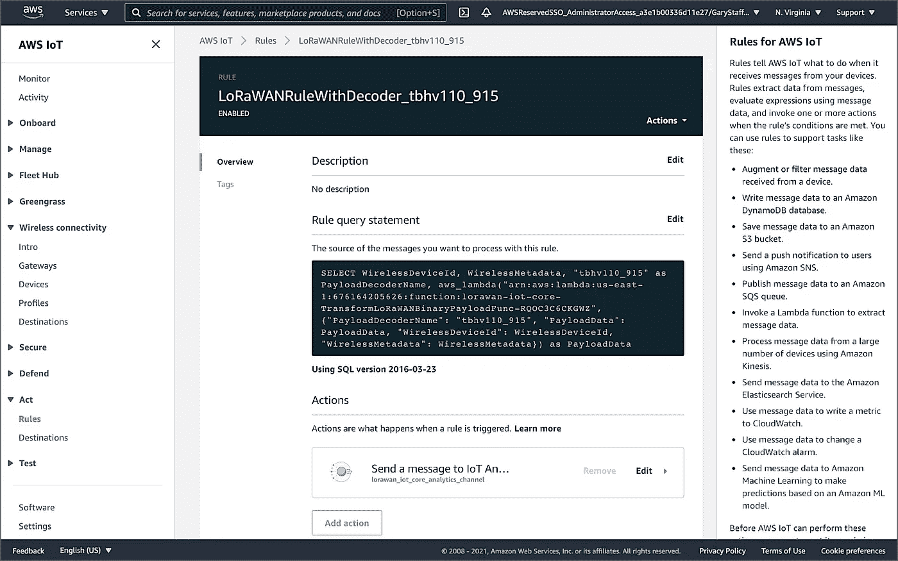

物联网规则，转换 base64 编码的二进制设备消息，并将其传递给物联网分析

使用 AWS IoT Core for LoRaWAN，设备的消息是 base64 编码的二进制消息。IoT 规则的查询语句是一个 SQL 语句，用于确定将哪些消息转发给操作。在 LoRaWAN 的例子中，查询语句包含对 AWS Lambda 函数的内联调用。该函数接受许多输入参数。它对 base64 编码的消息进行解码，对二进制消息进行解码和翻译，并用结果构建一个 Python 字典。最后，字典被序列化为 JSON 并返回给 IoT 规则。

物联网规则查询语句

## 健康家庭传感器信息

LoRa 在北美使用 915 MHz 的免执照亚千兆赫无线电频率。健康家庭传感器设备使用 LoRaWAN 1.0.3 规范通过该无线电频率传输二进制消息。健康家庭传感器设备向 MiniHub Pro 网关发送的二进制消息的有效载荷长度为 11 个字节，如下所示:


图表由布朗健康家庭传感器(IAQ)参考指南提供

在传输之前，设备使用 [AES128 CTR 模式](https://cryptobook.nakov.com/symmetric-key-ciphers/cipher-block-modes#ctr-counter-block-mode)对包含传感器数据的二进制消息进行加密。LoRaWAN 的 AWS 物联网核心解密二进制消息，然后将解密的二进制消息有效负载编码为 base64 字符串。

AWS IoT Core 为 LoRaWAN 提供的最终 JSON 格式消息 IoT 规则包含设备的 base64 编码二进制消息(PayloadData)，以及有关源 LoRaWAN 设备和传输消息的 LoRaWAN 网关的附加信息。

IoT 规则的查询语句调用 Lambda 函数来解码和转换 base64 编码的二进制消息。Lambda 调用正确的解码器，该解码器包含解码二进制消息的每个字节的逻辑。AWS 开发了物联网规则解码器[λ](https://github.com/aws-samples/aws-iot-core-lorawan/blob/main/transform_binary_payload/src-iotrule-transformation/app.py)以及[几个二进制消息有效载荷解码器](https://github.com/aws-samples/aws-iot-core-lorawan/tree/main/transform_binary_payload/src-payload-decoders/python)，可在 [GitHub](https://github.com/aws-samples/aws-iot-core-lorawan/tree/main/transform_binary_payload) 上免费获得，包括:

*   浏览器标签对象定位器
*   德拉吉诺 LHT65，LGT92，LSE01，LBT1，LDS01
*   公理 W1
*   埃尔西斯
*   全球卫星 LT-100
*   NAS 脉冲读取器 UM3080

由于 ASW 没有在提供的解码器列表中包括 Browan Healthy Home 传感器设备，因此我使用设备的[产品手册](https://lora-alliance.org/wp-content/uploads/2020/05/RM_IAQ-Sensor_20200205_v2_with-downlink.pdf)中详述的消息有效载荷信息创建了一个新的基于 Python 的解码器。

解码器首先解码 base64 编码的二进制消息有效负载。

```
# base64 encoded binary message
AAs0LNsCAQB/ADM=

# base64 decoded 11-byte binary message
00000000 00001011 00110100 00101100 11011011 00000010 00000001 00000000 01111111 00000000 00110011# as hexadecimal
00 0b 34 2c db 02 01 00 7f 00 33# as decimal
0 11 52 44 219 2 1 0 127 0 51
```

然后，解码器逐位处理二进制消息有效载荷的每个字节，并应用任何附加逻辑来导出最终传感器值。解码 base64 编码的二进制消息有效负载，并将其放回原始消息中，我们得到以下消息结构:

# 物联网规则操作

由规则查询返回并由 Lambda 函数处理的消息被传递给一个 [AWS IoT 规则动作](https://docs.aws.amazon.com/iot/latest/developerguide/iot-rule-actions.html)。AWS IoT 规则操作指定触发规则时要执行的操作。此规则的操作向 AWS IoT 分析渠道发送消息。


AWS 物联网规则查询语句和物联网分析操作

# AWS 物联网分析

根据 [AWS](https://aws.amazon.com/iot-analytics/) 的说法，物联网分析是一种完全托管的服务，可以轻松运行和操作海量物联网数据的复杂分析。物联网分析由五个主要组件组成:渠道、管道、数据存储、数据集和笔记本。

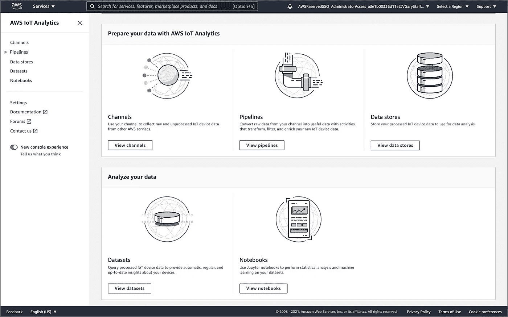

AWS 物联网分析管理控制台

物联网规则向物联网分析[频道](https://docs.aws.amazon.com/iotanalytics/latest/userguide/create-channel.html)发送消息。通道将数据发布到[管道](https://docs.aws.amazon.com/iotanalytics/latest/userguide/create-pipeline.html)。管道消耗来自通道的消息，并使您能够在将消息存储到[数据存储](https://docs.aws.amazon.com/iotanalytics/latest/userguide/create-data-store.html)之前对其进行处理和过滤。数据存储接收并存储消息。通过创建 SQL [数据集](https://docs.aws.amazon.com/iotanalytics/latest/userguide/create-dataset.html)或容器数据集，可以从数据存储中检索数据。SQL 数据集包含针对数据存储执行的 SQL 查询。根据[文档](https://docs.aws.amazon.com/iotanalytics/latest/userguide/sql-support.html)，亚马逊 Athena 和亚马逊物联网分析的 SQL 表达式都是基于 PrestoDB 的。

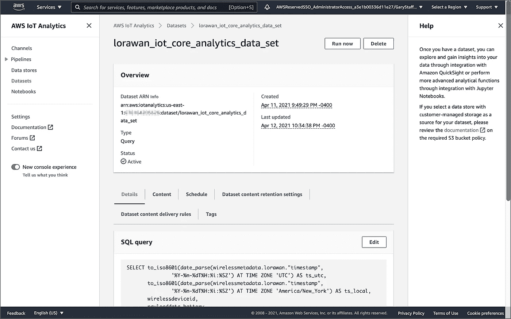

AWS 物联网分析数据集

我编写的 SQL 查询是针对健康家庭传感器设备收集的数据的。在 Amazon QuickSight 中，我们将使用这个数据集来构建一个 IAQ 监控仪表板。

# 亚马逊 QuickSight

据 [AWS](https://aws.amazon.com/quicksight/) 称，亚马逊 QuickSight 是一个可扩展的、无服务器的、可嵌入的、基于机器学习的商业智能(BI)服务，专为云构建。QuickSight 可让您轻松创建和发布交互式 BI 仪表盘，其中包含基于机器学习的见解。AWS 物联网分析提供[与亚马逊 quick sight](https://docs.aws.amazon.com/iotanalytics/latest/userguide/data-visualization.html#visualization-quicksight)的直接集成。

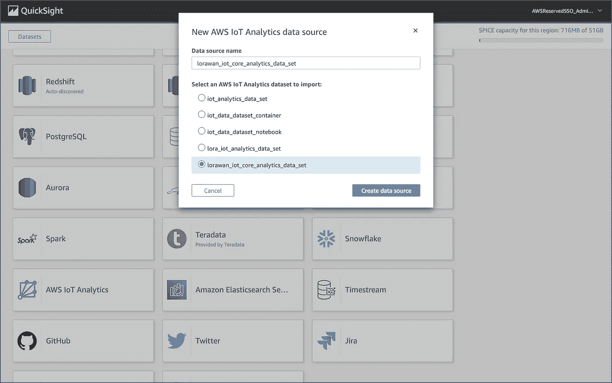

使用“AWS 物联网分析”数据源，我们可以通过导入在上一步中构建的物联网分析数据集来构建 QuickSight 数据集。在 QuickSight 中，我们可以预览数据、更改字段类型、应用过滤器、添加计算字段(如`sensor_location`)以及根据需要排除字段。

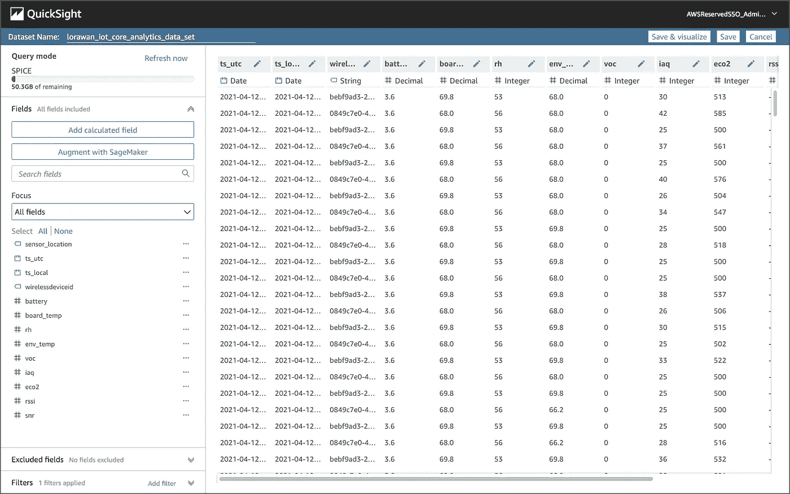

然后，最终数据被保存(*缓存*)在 [SPICE](https://docs.aws.amazon.com/quicksight/latest/user/spice.html) 中，这是 QuickSight 的超快速并行内存计算引擎。

用于分析的最终数据

使用这个数据集，我们可以构建一个快速分析。该分析将使用各种视觉类型来显示传感器数据，如温度、相对湿度、挥发性有机化合物(VOC)水平、室内空气质量(IAQ)、传感器设备的电池电量，以及网关的 SNR(信噪比)和 RSSI(接收信号强度指示)。

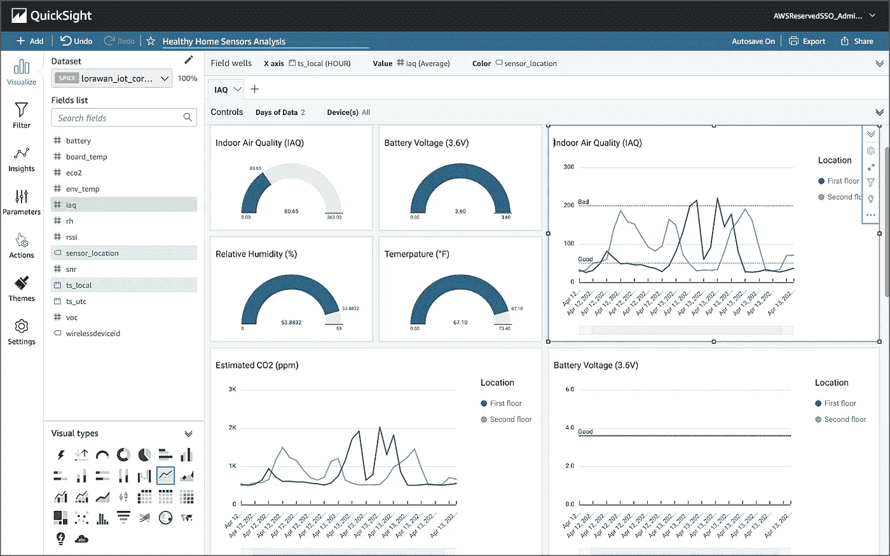

使用物联网分析 IAQ 数据集构建亚马逊 QuickSight 分析

然后，我们可以安全地与数据消费者共享我们构建的分析，作为 QuickSight [仪表盘](https://docs.aws.amazon.com/quicksight/latest/user/working-with-dashboards.html)，可通过网络浏览器或使用[亚马逊 QuickSight 移动应用](https://docs.aws.amazon.com/quicksight/latest/user/using-quicksight-mobile.html)访问。


显示 IAQ 传感器数据的亚马逊 QuickSight 仪表盘

下面，我们将看到 QuickSight 如何在一天内可视化多个传感器位置的室内空气质量数据。在此视图中，传感器数据以五分钟为增量进行捕获和显示。视觉包含指示好的和坏的 IAQ 阈值的参考线。通过分析结果，我们可以快速了解外部和内部环境条件、HVAC 系统、空气过滤装置、通过门窗的外部通风以及人类活动如何影响住宅不同区域一天中的 IAQ。

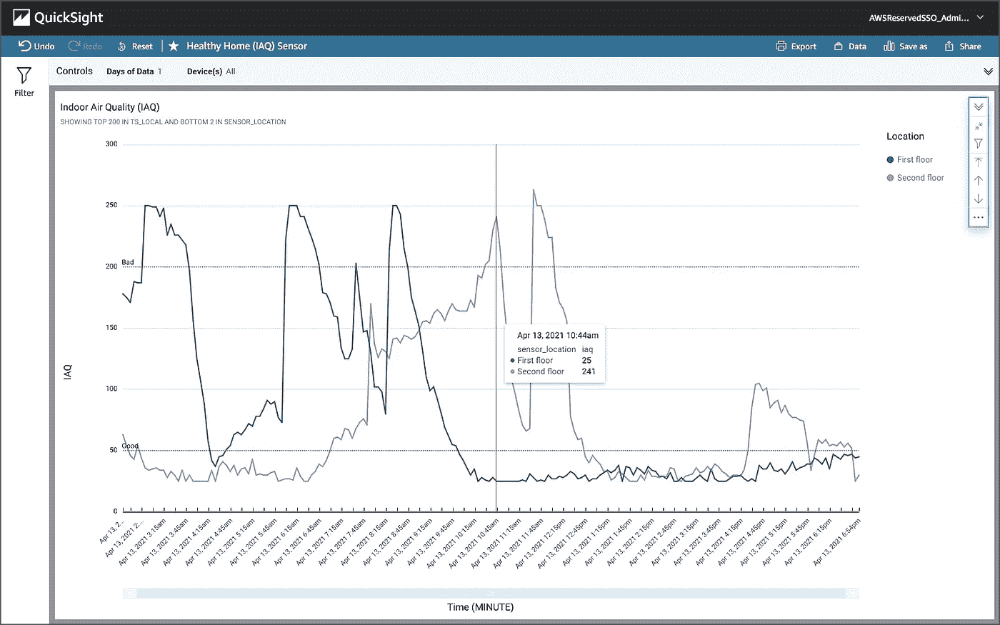

# 结论

在这篇文章中，我们了解到使用新发布的 AWS IoT Core for LoRaWAN service，从 LoRaWAN 设备和网关激活、配置和开始收集传感器遥测数据是多么容易。我们观察到 AWS 物联网核心、物联网分析和亚马逊 QuickSight 的无缝集成，以转换、存储和可视化传感器数据。扩展此示例以添加基于传感器数据的通知和自动补救，对于 [AWS 物联网事件](https://aws.amazon.com/iot-events/)等服务来说同样简单。

# 参考

*   [劳拉旺的 AWS 物联网核心文档](https://docs.aws.amazon.com/iot/latest/developerguide/connect-iot-lorawan.html)
*   [劳拉旺车间 AWS 物联网核心](https://iotwireless.workshop.aws/) ( *强烈推荐！*)
*   [Semtech 的 LoRa 开发者门户](https://lora-developers.semtech.com/)
*   [LoRa 基础站 2.0.5 文件](https://lora-developers.semtech.com/resources/tools/lora-basics/lora-basics-for-gateways/)
*   [布朗健康家庭传感器(IAQ)参考手册](https://lora-alliance.org/wp-content/uploads/2020/05/RM_IAQ-Sensor_20200205_v2_with-downlink.pdf)
*   [Browan AWS MiniHub Pro 入门指南](https://www.browan.com/download/xvX/stream)

本博客代表我自己的观点，不代表我的雇主亚马逊网络服务公司(AWS)的观点。所有产品名称、徽标和品牌都是其各自所有者的财产。