# AWS: VPC 流量日志 CloudWatch Logs Insights 概述和示例

> 原文：<https://itnext.io/aws-vpc-flow-logs-an-overview-and-example-with-cloudwatch-logs-insights-894b02a03199?source=collection_archive---------2----------------------->

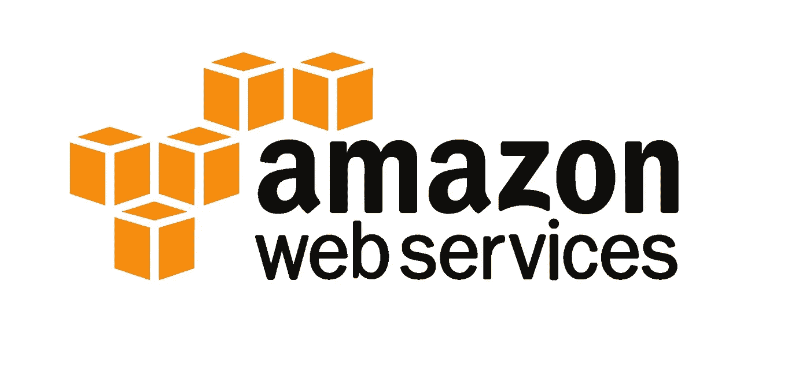

AWS VPC 流量日志允许您记录 VPC 中网络接口之间的流量信息。此外，这些日志可以存储在 AWS S3 中或发送到 AWS CloudWatch 日志，而启用流量日志记录不会以任何方式影响网络接口的性能。

让我们简要回顾一下基本概念和可用设置，并为 VPC 设置流日志，将数据传输到 CloduWatch 日志进行分析。

*   [VPC 流量日志概述](https://rtfm.co.ua/en/aws-vpc-flow-logs-an-overview-and-example-with-cloudwatch-logs-insights/#VPC_Flow_Logs_overview)
*   [VPC 流量日志用例](https://rtfm.co.ua/en/aws-vpc-flow-logs-an-overview-and-example-with-cloudwatch-logs-insights/#VPC_Flow_Logs_use_cases)
*   [流量日志记录—字段](https://rtfm.co.ua/en/aws-vpc-flow-logs-an-overview-and-example-with-cloudwatch-logs-insights/#Flow_Log_record_-_fields)
*   [VPC 流量测井的局限性](https://rtfm.co.ua/en/aws-vpc-flow-logs-an-overview-and-example-with-cloudwatch-logs-insights/#VPC_Flow_Logs_Limitations)
*   [创建 VPC 流量日志](https://rtfm.co.ua/en/aws-vpc-flow-logs-an-overview-and-example-with-cloudwatch-logs-insights/#Create_VPC_Flow_Log)
*   [云观察日志日志组](https://rtfm.co.ua/en/aws-vpc-flow-logs-an-overview-and-example-with-cloudwatch-logs-insights/#CloudWatch_Logs_Log_Group)
*   [IAM 策略和 IAM 角色](https://rtfm.co.ua/en/aws-vpc-flow-logs-an-overview-and-example-with-cloudwatch-logs-insights/#IAM_Policy_and_IAM_Role)
*   [VPC —启用流量日志](https://rtfm.co.ua/en/aws-vpc-flow-logs-an-overview-and-example-with-cloudwatch-logs-insights/#VPC_-_enabling_Flow_Logs)
*   [CloudWatch 日志洞察](https://rtfm.co.ua/en/aws-vpc-flow-logs-an-overview-and-example-with-cloudwatch-logs-insights/#CloudWatch_Logs_Insights)
*   [VPC 流量日志—自定义格式](https://rtfm.co.ua/en/aws-vpc-flow-logs-an-overview-and-example-with-cloudwatch-logs-insights/#VPC_Flow_Log_-_Custom_format)
*   [流量日志自定义格式，以及 CloudWatch 日志见解](https://rtfm.co.ua/en/aws-vpc-flow-logs-an-overview-and-example-with-cloudwatch-logs-insights/#Flow_Log_Custom_format_and_CloudWatch_Logs_Insights)
*   [日志洞察示例](https://rtfm.co.ua/en/aws-vpc-flow-logs-an-overview-and-example-with-cloudwatch-logs-insights/#Logs_Insights_examples)
*   [有用链接](https://rtfm.co.ua/en/aws-vpc-flow-logs-an-overview-and-example-with-cloudwatch-logs-insights/#Useful_links)
*   [VPC 流量日志](https://rtfm.co.ua/en/aws-vpc-flow-logs-an-overview-and-example-with-cloudwatch-logs-insights/#VPC_Flow_Logs)
*   [云观察日志](https://rtfm.co.ua/en/aws-vpc-flow-logs-an-overview-and-example-with-cloudwatch-logs-insights/#CloudWatch_Logs)

# VPC 流量测井概述

可以为整个 VPC、子网或外部表面启用日志。如果为整个 VPC 启用，将为 VPC 的所有接口启用日志记录。

可以使用流日志的服务:

*   弹性负载平衡
*   亚马逊 RDS
*   亚马逊弹性缓存
*   亚马逊红移
*   亚马逊工作区
*   NAT 网关
*   中转网关

数据被记录为 [*流日志记录*](https://docs.aws.amazon.com/vpc/latest/userguide/flow-logs.html#flow-log-records) ，并使用带有预定义字段的记录。

## VPC 流量日志用例

使用流日志可以跟踪什么？

*   安全组/网络访问列表规则—被阻止的请求将被标记为拒绝
*   我们实现的内容为我们记录了日志——了解 VPC 和服务之间的流量，以便了解谁消耗了最多的流量、在哪里消耗了多少跨 AZ 流量等等
*   监控系统的远程登录—监控端口 22 (SSH)、3389 (RDP)
*   端口扫描跟踪

## 流量日志记录—字段

日志中的每个条目都是关于聚合间隔期间收到的 IP 流量的数据，并且是一行，其中的字段由空格分隔，每个字段都包含关于数据传输的信息，例如，源 IP、目标 IP 和协议。

默认情况下，使用以下格式:

```
${version} ${account-id} ${interface-id} ${srcaddr} ${dstaddr} ${srcport} ${dstport} ${protocol} ${packets} ${bytes} ${start} ${end} ${action} ${log-status}
```

参见[文档](https://docs.aws.amazon.com/vpc/latest/userguide/flow-logs.html#flow-log-records)中的*可用字段*表，版本 2 列中的所有内容都包含在默认格式中。

当创建流日志时，我们可以使用*默认的*格式，或者创建我们自己的格式——我们将在下面考虑:

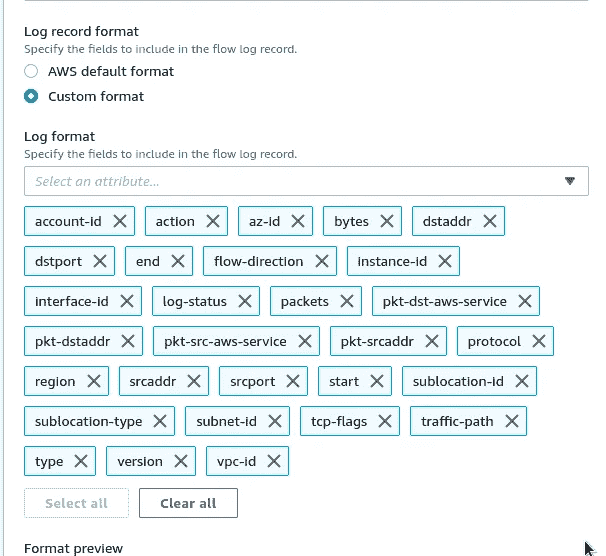

## VPC 流量测井限制

*   不能与 EC2-Classic 实例一起使用
*   您不能为 VPC peering 创建日志，如果它们导致不同帐户的 VPC
*   创建日志后，您不能更改其配置或记录格式

此外，请记住:

*   Amazon DNS 的记录不会被记录，但如果使用您自己的 DNS，则会被写入
*   不记录进出地址 169.254.169.254 以获取 [EC2 实例元数据](https://docs.aws.amazon.com/AWSEC2/latest/UserGuide/ec2-instance-metadata.html)的流量
*   不会记录 EC2 网络接口和 AWS 网络负载平衡器接口之间的流量

参见[流量测井限制](https://docs.aws.amazon.com/vpc/latest/userguide/flow-logs.html#flow-logs-limitations)中的所有限制。

# 创建 VPC 流量日志

要创建流日志，我们需要指定:

*   我们将写入其日志的资源— VPC、子网或特定网络接口
*   我们记录的流量类型(接受的流量、拒绝的流量或所有流量)
*   以及我们将数据写入何处——写入 S3 存储桶，还是写入 CloudWatch 日志

现在，让我们看看 CloudWatch 日志会发生什么，下次我们将尝试在 [Kibana](https://rtfm.co.ua/en/elastic-stack-an-overview-and-elk-installation-on-ubuntu-20-04/) 中可视化。

## 云观察日志日志组

创建日志组:

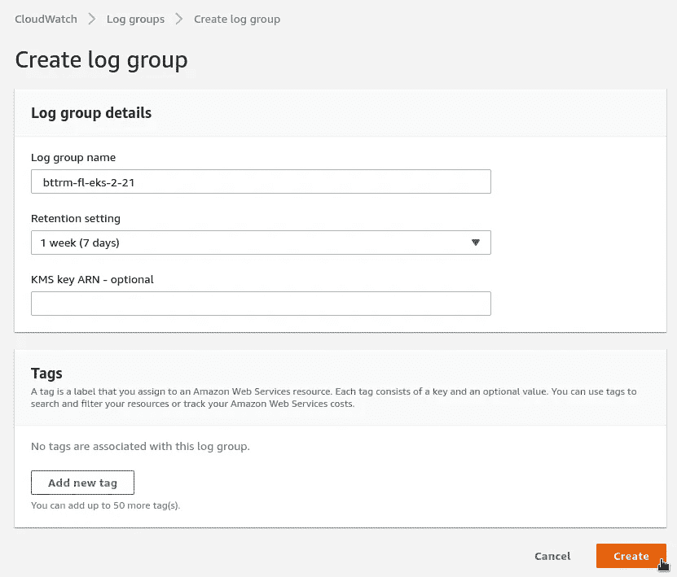

## IAM 策略和 IAM 角色

为了让流日志服务能够写入我们的 CloudWatch，我们需要配置它的访问权限。

转到 AWS IAM，创建 IAM 策略和 IAM 角色。

从 IAM 策略开始:


添加规则:

```
{
  "Version": "2012-10-17",
  "Statement": [
    {
      "Action": [
        "logs:CreateLogGroup",
        "logs:CreateLogStream",
        "logs:PutLogEvents",
        "logs:DescribeLogGroups",
        "logs:DescribeLogStreams"
      ],
      "Effect": "Allow",
      "Resource": "*"
    }
  ]
}
```

保存:

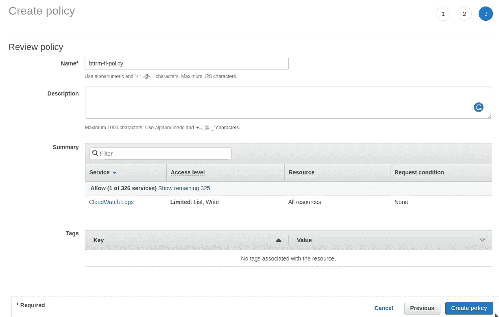

现在，创建一个 IAM 角色。

转到 IAM 角色，创建一个新角色，类型为 EC2:

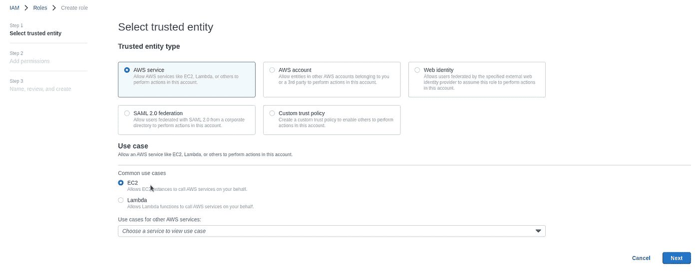

找到我们在上面创建的策略，并附加它:


设置其名称，保存:

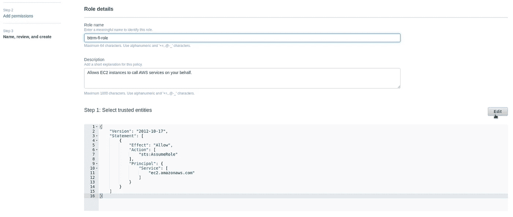

转到*角色信任关系*(参见 [AWS: IAM AssumeRole — описание，примеры](https://rtfm.co.ua/aws-iam-assumerole-opisanie-primery/) )，编辑它—为`Service`字段设置*vpc-flow-logs.amazonaws.com*:

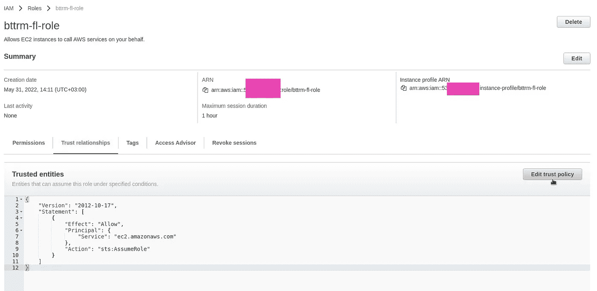

设置:

```
{
  "Version": "2012-10-17",
  "Statement": [
    {
      "Sid": "",
      "Effect": "Allow",
      "Principal": {
        "Service": "vpc-flow-logs.amazonaws.com"
      },
      "Action": "sts:AssumeRole"
    }
  ]
}
```

保存:

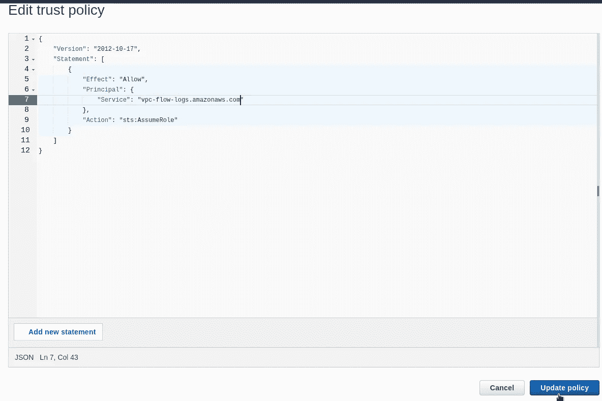

## VPC-启用流量日志

最后，转到 VPC 启用日志—点击*流日志>创建*:

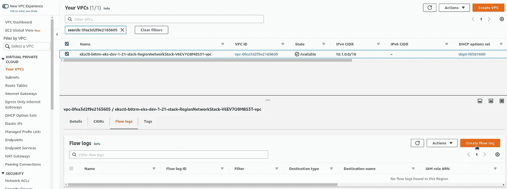

设置其名称，*过滤器*，*间隔*:

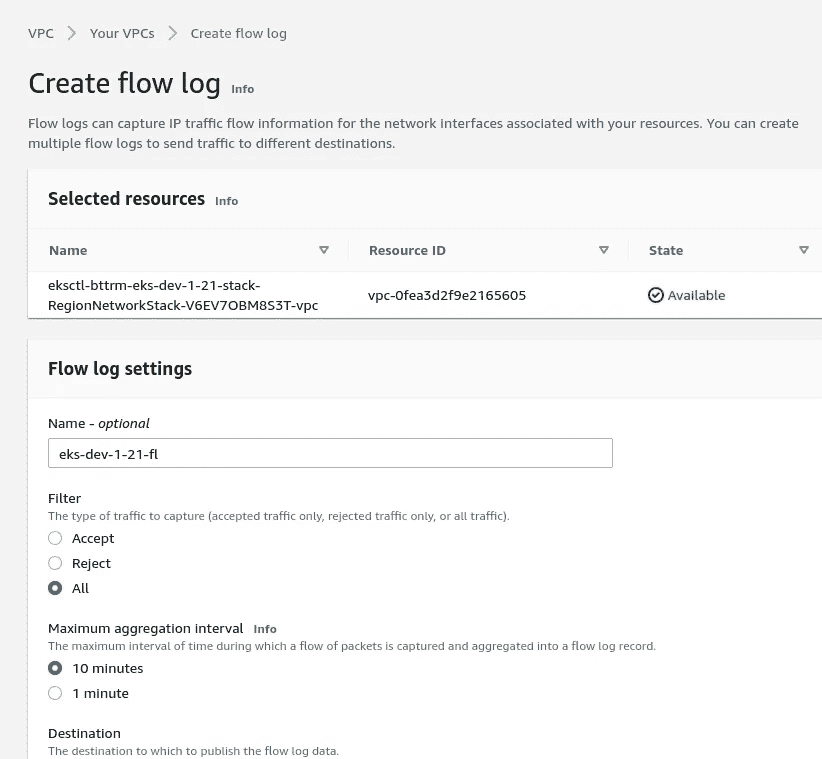

在*目的地*选择了 CloudWatch 日志，指定日志组和 IAM 角色:

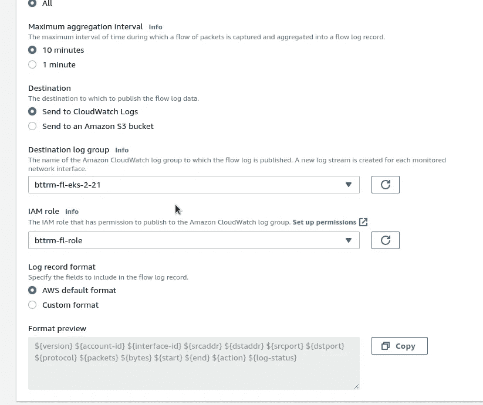

格式—保留默认的*。*

*检查*状态*:*

*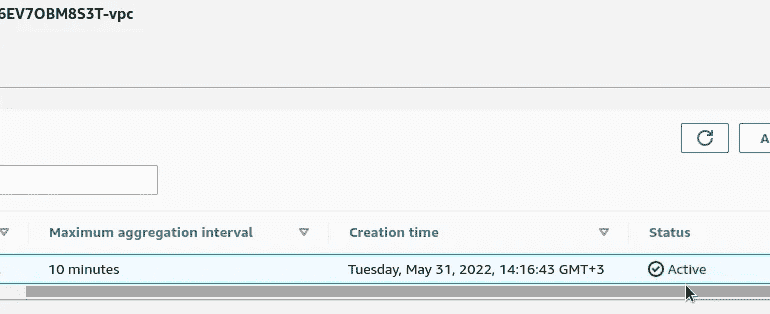*

*几分钟后，我们将看到我们的数据:*

*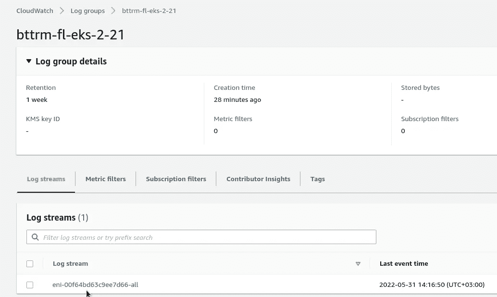*

*在日志组中，您可以找到由弹性网络接口命名的第一个流，数据就是从该流中获取的:*

**

# *CloudWatch 日志洞察*

*让我们快速浏览一下 CloudWatch 日志洞察。*

*点击*查询*得到一些提示:*

*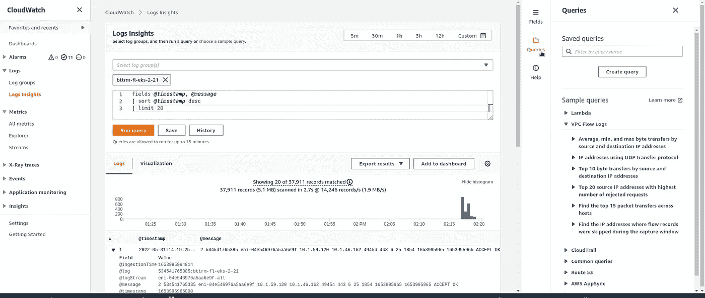*

*例如，要查找为大多数数据包提供服务的前 15 台主机:*

*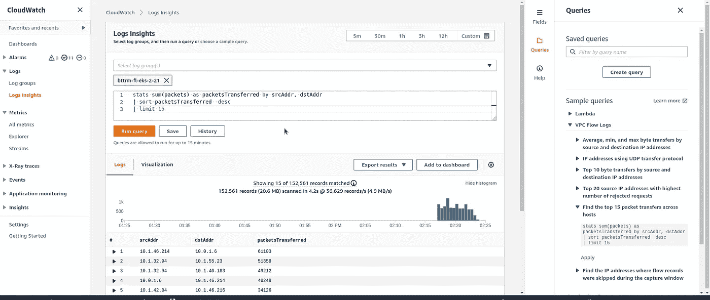*

*或者通过传输的数据量:*

```
*stats sum(bytes) as BytesSent by srcAddr, dstAddr
| sort BytesSent desc*
```

*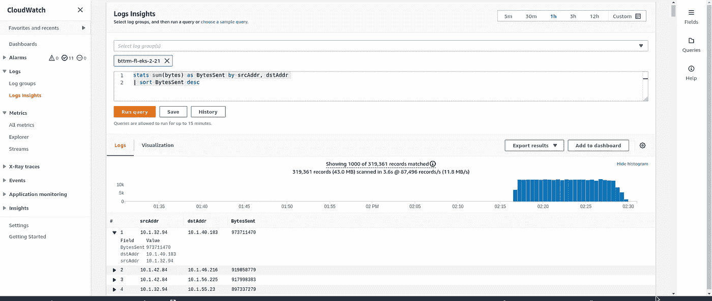*

*好的，很好。但是其他形式呢？*

*例如，我希望看到一个请求方向(出口/入口)和一个`pkt-dstaddr`字段的值。*

# *VPC 流量测井—自定义格式*

*更多信息参见[流量日志记录示例](https://docs.aws.amazon.com/vpc/latest/userguide/flow-logs-records-examples.html)。*

*现在，我们可以设置以下格式:*

```
*region vpc-id az-id subnet-id instance-id interface-id flow-direction srcaddr dstaddr srcport dstport pkt-srcaddr pkt-dstaddr pkt-src-aws-service pkt-dst-aws-service traffic-path packets bytes action*
```

*在 CloudWatch 日志中创建新的日志组，将其命名为*Bt trm-eks-dev-1–21-VPC-fl-custom*，不要忘记保留:*

*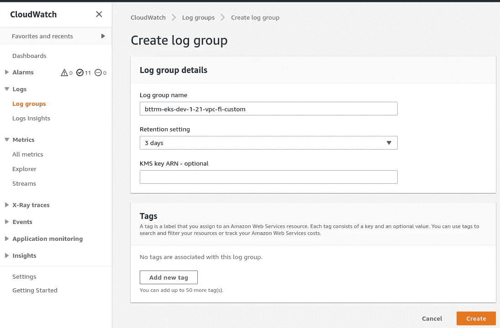*

*回到 VPC，创建一个新的流日志，并将其命名为*Bt trm-eks-dev-1–21-VPC-fl-custom*:*

*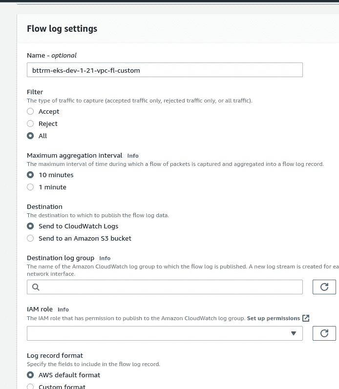*

*选择了*自定义格式*和字段，这是我们想看到的。这样做时，请考虑您将在此处指定的字段顺序将用于对日志中的记录进行排序。*

*即，如果第一个字段是“*区域*”——那么在最终日志中，它也将被设置为第一个字段:*

*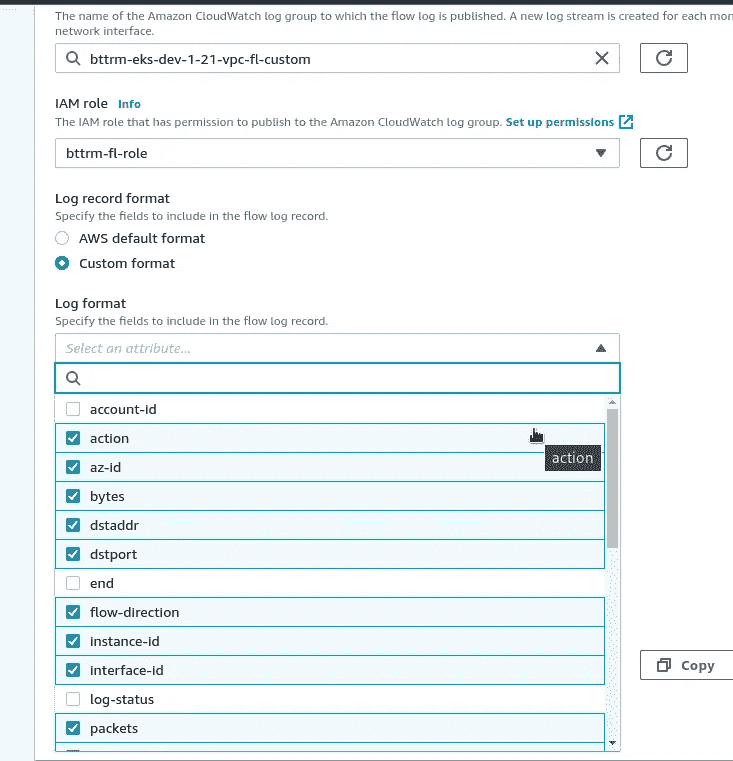*

*结果是:*

```
*${region} ${vpc-id} ${az-id} ${subnet-id} ${instance-id} ${interface-id} ${flow-direction} ${srcaddr} ${dstaddr} ${srcport} ${dstport} ${pkt-srcaddr} ${pkt-dstaddr} ${pkt-src-aws-service} ${pkt-dst-aws-service} ${traffic-path} ${packets} ${bytes} ${action}*
```

*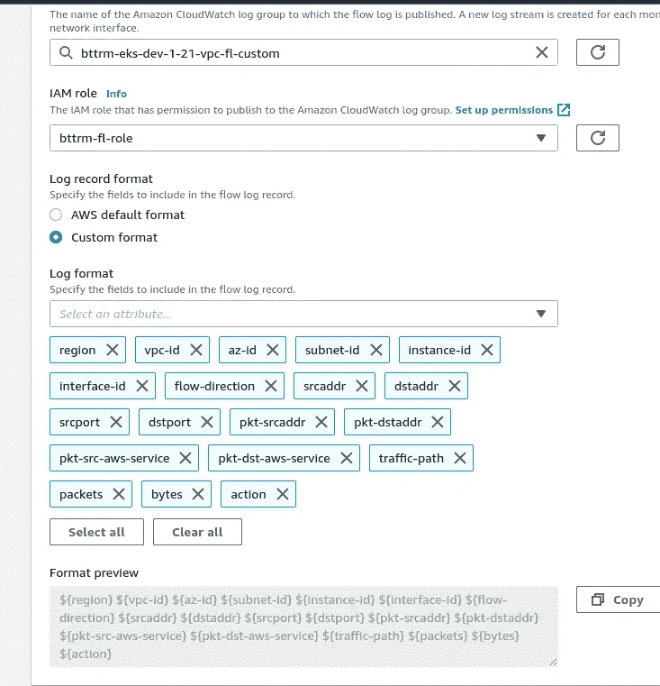*

## *流量日志自定义格式，以及 CloudWatch 日志洞察*

*但是，如果我们现在转到 CloudWatch Logs Insights，并尝试以前使用的任何查询，我们将不会获得我们已经设置的字段*

*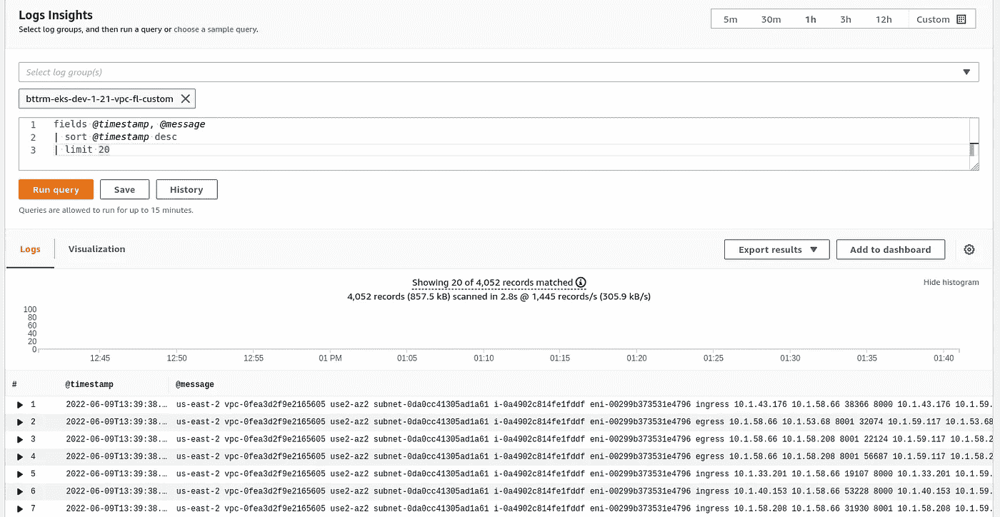*

*因此，我们可以看到数据，但我们如何将它拆分到字段中呢？*

*在我们的项目中，我不认为我们会大量使用 CloudWatch 日志，最有可能的是数据将被发送到一个 S3 桶，然后到(logz.io)，因此，我不会在这里详细深入，但让我们看看操作的原理——它将在以后对 ELK 的工作中派上用场。*

*默认情况下，CloudWatch 日志会创建几个我们可以在请求中使用的元字段:*

*   *`@message`:“原始”数据——文本中的全部信息*
*   *`@timestamp`:事件发生的时间*
*   *`@logStream`:一条蜿蜒的小溪的名字*

*对于查看字段的自定义格式，我们需要使用`[parse](https://docs.aws.amazon.com/AmazonCloudWatch/latest/logs/CWL_QuerySyntax.html)`并将`@message`传递给它，这样它将根据我们指定的字段解析内容:*

```
*parse @message "* * * * * * * * * * * * * * * * * * *" 
| as region, vpc_id, az_id, subnet_id, instance_id, interface_id, 
| flow_direction, srcaddr, dstaddr, srcport, dstport, 
| pkt_srcaddr, pkt_dstaddr, pkt_src_aws_service, pkt_dst_aws_service, 
| traffic_path, packets, bytes, action 
| sort start desc*
```

*这里，`@message`中的星号“`*`”的个数必须相同，和我们设置的很多字段一样- `${vpc-id}` и т.д。*

*此外，字段名称不得包含破折号。也就是我们要吃的`${vpc-id}`名为`vpc_id`(或者`vpcID` -随你便)。*

*检查:*

*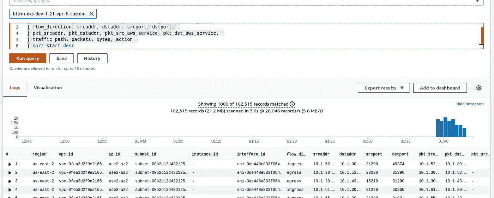*

*哇！现在，我们得到了所有的田地。*

*除了`parse`，我们还可以使用`filter`、`display`、`stats`。查看 [CloudWatch 日志中的所有洞察查询语法](https://docs.aws.amazon.com/AmazonCloudWatch/latest/logs/CWL_QuerySyntax.html)。*

## *日志洞察示例*

*让我们尝试进行几个查询，例如，获取被安全组/网络访问列表阻止的所有请求，它们将被标记为*拒绝。**

*让我们看看之前的查询:*

```
*parse @message "* * * * * * * * * * * * * * * * * * * * * *" 
| as start, end, region, vpc_id, az_id, subnet_id, instance_id, interface_id, 
| flow_direction, srcaddr, dstaddr, srcport, dstport, protocol, 
| pkt_srcaddr, pkt_dstaddr, pkt_src_aws_service, pkt_dst_aws_service, 
| traffic_path, packets, bytes, action*
```

*在那里加上:*

*   *`filter action="REJECT"`*
*   *`stats count(action) as redjects by srcaddr`*
*   *`sort redjects desc`*

*这里:*

*   *通过应用于数据包的操作进行过滤—选择所有被拒绝的*
*   **通过*动作*字段统计事件数量，通过源的 IP 地址选择，并显示在 *redjects* 列**
*   **并按*对象*排序**

**因此，现在完整的查询将是:**

```
**parse @message "* * * * * * * * * * * * * * * * * * *" 
| as region, vpc_id, az_id, subnet_id, instance_id, interface_id, 
| flow_direction, srcaddr, dstaddr, srcport, dstport, 
| pkt_srcaddr, pkt_dstaddr, pkt_src_aws_service, pkt_dst_aws_service, 
| traffic_path, packets, bytes, action 
| filter action="REJECT" 
| stats count(action) as redjects by srcaddr 
| sort redjects desc**
```

**其结果是:**

**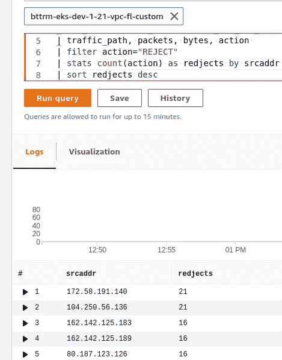**

**我们也可以使用负过滤器，并结合使用`and` / `or`操作符。**

**例如，要从输出中删除以 *162.142.125* 开始的所有 IP—添加过滤器`filter (srcaddr not like "162.142.125.")`:**

```
**...
| filter action="REJECT"
| filter (srcaddr not like "162.142.125.")
| stats count(action) as redjects by srcaddr
| sort redjects desc**
```

**参见[样本查询](https://docs.aws.amazon.com/AmazonCloudWatch/latest/logs/CWL_QuerySyntax-examples.html)。**

**并添加一个过滤器来只选择传入的请求—`flow_direction`=*ingress*:**

```
**...
| filter action="REJECT"
| filter (srcaddr not like "162.142.125.") and (flow_direction like "ingress")
| stats count(action) as redjects by flow_direction, srcaddr, dstaddr, pkt_srcaddr, pkt_dstaddr
| sort redjects desc**
```

**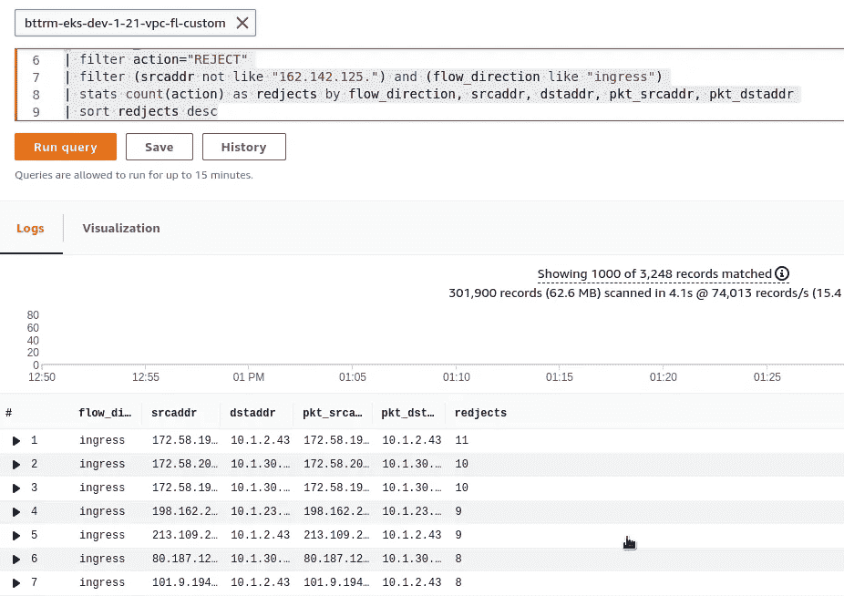**

**现在，当安全组或 VPC 网络访问列表规则起作用时，我们得到了被拒绝的请求的顶部。**

**让我们看看`dstaddr`中的 IP 是什么——谁是最终目的地？**

**转到 E *C2 >网络接口*，通过私有 IP 找到:**

****

**找到“*弹性 IP 地址所有者*”:**

**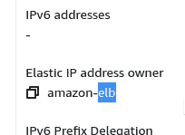**

**好的，这是其中一个负载平衡器。**

**如果在 AWS 中找不到一个 IP，它可能是一个 [Kubernetes 端点](https://rtfm.co.ua/en/kubernetes-what-is-endpoints/)，请使用:**

**kubectl 获取端点—所有名称空间| grep 10.1.55.140**

**开发-IOs-检查-翻译-ns IOs-检查-翻译-后端-svc 10.1.55.140:3000 58d**

**开发-IOs-检查-转换-ns IOs-检查-转换-前端-svc 10.1.55.140:80 58d**

**其实就这些了。**

# **有用的链接**

## **VPC 流量测井**

*   **[用弹性代理收集亚马逊 VPC 流量日志](https://docs.elastic.co/en/integrations/aws/vpcflow)—поляипрочеедлякибаны.**
*   **[流量日志记录示例](https://docs.aws.amazon.com/vpc/latest/userguide/flow-logs-records-examples.html)**

## **CloudWatch 日志**

*   **[AWS 安全日志基础— VPC 流量日志](https://panther.com/cyber-explained/aws-security-logging-vpc-flow-logs/)—пиимерcloud watch 日志с Athena**
*   **[使用 Logs Insight 分析查询并可视化 AWS Cloudwatch 日志](https://dheeraj3choudhary.com/analyze-query-and-visualize-aws-cloudwatch-logs-using-logs-insight) — прмиеры запросов в Cloudwatch 日志**
*   **[如何通过向您的 VPC 流量日志添加安全组 id 来可视化和优化您的网络安全](https://aws.amazon.com/blogs/security/how-to-visualize-and-refine-your-networks-security-by-adding-security-group-ids-to-your-vpc-flow-logs/)**
*   **[在图形中可视化测井数据](https://docs.aws.amazon.com/AmazonCloudWatch/latest/logs/CWL_Insights-Visualizing-Log-Data.html)**
*   **[像专家一样分析 CloudWatch 日志](https://marbot.io/blog/analyze-cloudwatch-logs-like-a-pro.html)**
*   **[过滤、解析 AWS CloudWatch Logs Insights 中的&组日志数据](https://harishkm.in/2020/06/25/filter-parse-group-log-data-in-aws-cloudwatch-logs-insights/)**
*   **[如何使用 CloudWatch Logs Insights 分析定制的 VPC 流量日志？](https://aws.amazon.com/ru/premiumsupport/knowledge-center/cloudwatch-vpc-flow-logs/) — ещё примеры**
*   **[如何在我的 VPC 流量日志中使用 CloudWatch Logs Insights 查询？](https://aws.amazon.com/ru/premiumsupport/knowledge-center/vpc-flow-logs-and-cloudwatch-logs-insights/)**
*   **[CloudWatch 日志洞察查询语法](https://docs.aws.amazon.com/AmazonCloudWatch/latest/logs/CWL_QuerySyntax.html)**
*   **[使用 AWS CloudWatch Logs Insights 对网络问题进行分类](https://www.cloudreach.com/en/technical-blog/networking-issues-cloudwatch-logs-insights/)**

***最初发表于* [*RTFM: Linux、DevOps 和系统管理*](https://rtfm.co.ua/en/aws-vpc-flow-logs-an-overview-and-example-with-cloudwatch-logs-insights/) *。***