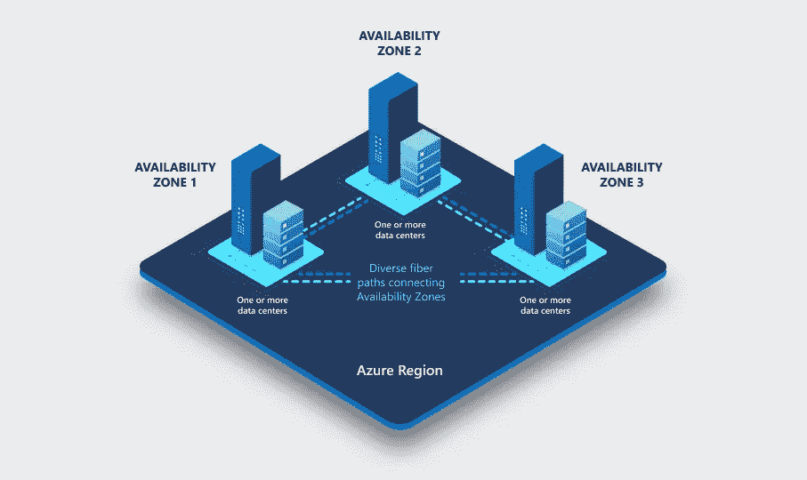
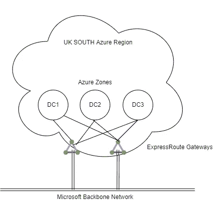
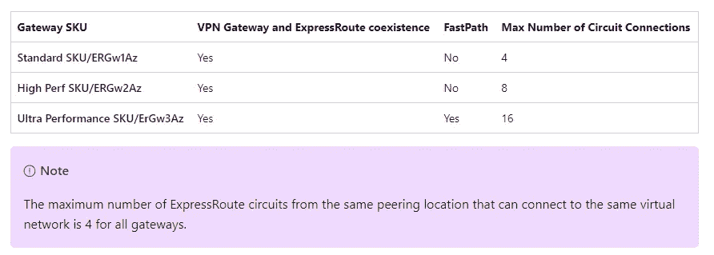
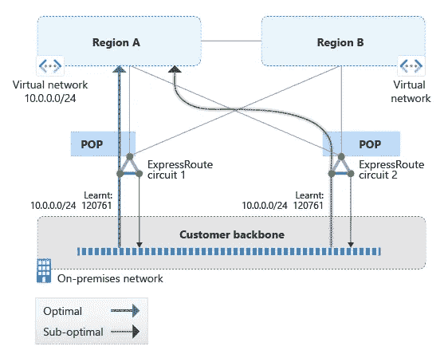
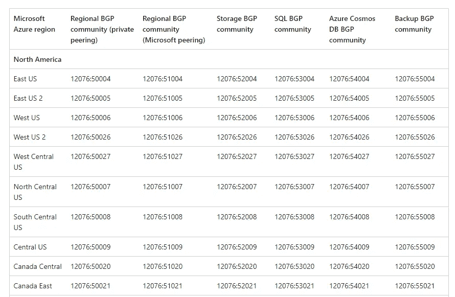
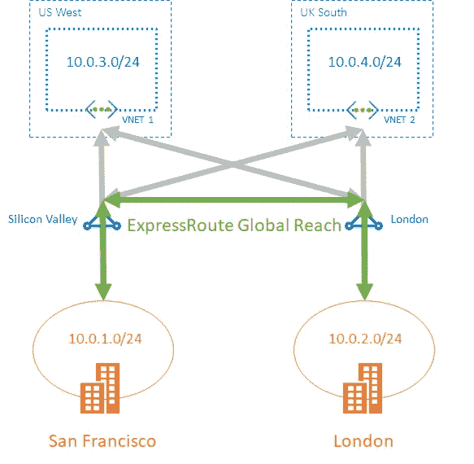
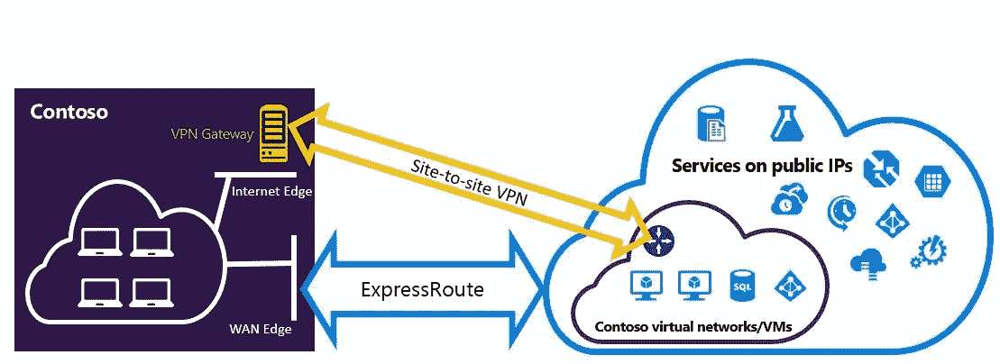
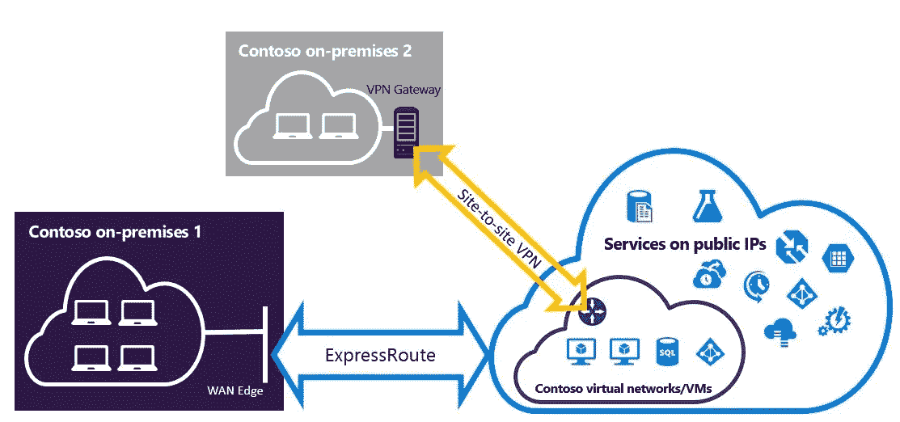

# Azure ExpressRoute 解释道

> 原文：<https://itnext.io/azure-expressroute-explained-9ad644f3c4af?source=collection_archive---------3----------------------->

## 深入了解 Azure ExpressRoute

在本文中，我们将解释 Azure ExpressRoute。首先，我们将了解 ExpressRoute 如何实现到 Microsoft 主干网络的专用连接，然后讨论可用的 SKU 和不同类型的 ExpressRoute 产品，以及如何实现弹性。这是你想知道但不敢问的一切！

***更新！*** *我非常高兴地提到，这篇文章由微软* *于 16/12/22 在其 TechNet 英国网站上进行了专题报道，并在其 TechNet 时事通讯 22/12/22 的主要文章中进行了专题报道！感谢克里斯·沃尔登和克莱尔·史密斯让这一切成为现实！*

*目录:*

*   Azure 网络和主干网
*   SKU
*   直达高速公路
*   快速路线快速路径
*   主动主动
*   对等类型
*   Expressroute 全球覆盖
*   专用 HSM 的 ExpressRoute 网关
*   共存的 ExpressRoute 和 VPN
*   为私有对等网络启用 IPv6 支持

美国宇航局在 [Unsplash](https://unsplash.com?utm_source=medium&utm_medium=referral) 拍摄的照片

# Azure 网络和主干网

微软有一个巨大的全球低延迟骨干网络，连接到多个可供 Azure 区域使用的快速路由网关。这些 Azure 区域每个都由多个连接到快速路由网关的数据中心(或区域)组成。由于主干网络上的多个网关连接到每个 Azure 数据中心，这形成了到每个 Azure 区域的高弹性连接。下图对此进行了更清楚的解释:

[https://learn . Microsoft . com/en-us/azure/可靠性/可用性-区域-概述](https://learn.microsoft.com/en-us/azure/reliability/availability-zones-overview)

在 Azure 区域内，存在多个连接到微软主干网的服务，例如，像虚拟机这样的 IaaS 服务、像 Azure App Services 这样的 PaaS 服务以及像 Office 365 这样的 SaaS 产品，它们位于微软云中而不是 Azure 中的特定区域，但仍然连接到微软主干网。

主干网络还延伸到“边缘节点”。“边缘”上的服务包括像 Azure Front Door 和 Azure CDN 这样的全球服务。边缘节点位于运营商中立的设施中，不同的运营商也可以连接到该设施(想想美国电话电报公司、威瑞森、沃达丰、英国电信等)。)，它有效地连接并形成了互联网。这就是 Azure 区域连接到互联网的方式。

在主干网上还有对等点(或“与我见面”位置),便于与客户网络的专用连接。这些是安全的运营商中立的位置，包括许多路由器，形成了“微软企业边缘”(或 MSEE)。合作伙伴和服务提供商也有与 MSEE 互连的路由器，以形成两者之间的连接。任何新的 Azure 区域都将有一个位于附近的对等点，但这不会是 Azure 区域的一部分。

最后，在客户网络中，以物理位置为例，光纤将由服务提供商铺设到办公室，并使用路由器连接到客户网络。MPLS 网络(任意对任意)也可以连接到服务提供商对等点。

当创建一个连接时，实际上创建了两个连接用于恢复。创建 2 个 BGP 会话来交换路由。2 台客户路由器连接到 2 台服务提供商路由器，后者连接到 MSEE 路由器，后者再连接到 Azure。任何用于内部虚拟局域网的 802.1q 标签都被去除，因为虚拟局域网不能扩展到 Azure。

# SKU

连接到主干并不会把你连接到一个特定的 Azure 区域。它将你连接到全球主干网络。您可以访问的区域由您选择的 ExpressRoute 连接的 SKU(或电路类型)控制。

## **SKU 当地**

这允许您只与对等点的本地区域(即最近的 Azure 区域)对话。例如，如果我将本地网络连接到英国南 Azure 地区的伦敦对等点，这没问题，但我无法连接到英国西部或美国东部 Azure 地区。

一些对等点没有可用的本地 SKU，例如达拉斯、亚特兰大。要找出哪些对等点有可用的本地 SKU 以及它们与哪个 Azure 区域对齐，您可以查看下面列出对等位置的页面:

 [## 位置和连接提供商:Azure ExpressRoute

### 本文中的表格提供了高速公路地理覆盖范围和位置、高速公路…

learn.microsoft.com](https://learn.microsoft.com/en-us/azure/expressroute/expressroute-locations-providers) 

## **标准 SKU**

这允许您连接到对等点区域内的任何地理政治区域。例如，如果我将本地网络连接到英国南部或英国西部 Azure 地区的伦敦对等点，这就可以了，但我无法连接到美国东部地区。

## **特级 SKU**

这允许您连接到对等点区域之外的其他区域。例如，如果我将内部网络连接到伦敦对等点，它可以连接到美国东蔚蓝地区。

使用 ExpressRoute，入口是免费的。出口计量。还有一种未计量的 SKU，价格要高得多。

## 虚拟网络网关 SKU

根据性能，VNet 网关有不同的 SKU，使用速度、数据包数量和每秒连接数等指标。

[https://learn . Microsoft . com/en-us/azure/express route/express route-about-virtual-network-gateways](https://learn.microsoft.com/en-us/azure/expressroute/expressroute-about-virtual-network-gateways)

# 直达高速公路

ExpressRoute direct 是需要更高带宽连接的客户的一个选项。它提供双 100 Gbps 或 10 Gbps 连接，支持大规模主动/主动连接。它通过将内部路由器直接连接到 MSEE 路由器(不通过服务提供商)来实现这一点，直接连接到路由器上的 2 个端口。在对等位置，这意味着有一个直接到 MSEE 路由器端口的物理(第 1 层)连接。

ExpressRoute Direct 的一个优点是能够使用媒体访问控制安全性(MACsec)。这允许您在需要时加密路由器之间的流量，因此流量在数据在对等位置内传输到 MSEE 路由器的任何物理电缆上都是加密的。

 [## Azure ExpressRoute:配置 MACsec

### 本文帮助您配置 MACsec 以保护您的边缘路由器和微软的边缘路由器之间的连接…

learn.microsoft.com](https://learn.microsoft.com/en-us/azure/expressroute/expressroute-howto-macsec) 

然后可以根据需要通过连接创建电路(例如，如果我有一个 100Gbps 的 ExpressRoute 直连，我可以将其分成 2 个 50Gbps 连接、4 个 25Gbps 连接或 1 个 50Gpbs 和 2 个 25Gbps 连接)。

# 快速路线快速路径

快速通道只能通过*超高性能*虚拟网络网关 SKU 打开。这将使流量绕过 VNet 网关，从而允许更快的连接绕过可能导致瓶颈的网关。例如，如果我有一个 100Gps 连接，而我的网关只支持 10Gps，我就不能将全部 100Gbps 的数据传输到我的 VNet 中。快速路径解决了这个问题，同时还减少了延迟。

# 主动主动

ExpressRoute 连接是主动-主动的，这意味着您有两个活动连接。如果您有 1Gbps 的连接，由于 ExpressRoute 的主动-主动特性，您实际上有 2Gbps。

# 对等类型

一旦建立了快速路由，我们需要创建快速路由电路。每个电路都有一个服务密钥或 S 密钥。

在 ExpressRoute 上可以使用 3 种类型的对等。

**私有对等**用于连接到你在 Azure 的私有 IP 空间。为此，您需要在本地网络中设置 2 个 x /30 专用 IP 地址范围(您也可以使用公共 IP 范围，但建议使用专用范围，以免不必要地浪费公共地址)。

在您的 Azure 订阅中，需要在其自己的子网中创建类型为“ExpressRoute”的 VNet 网关。最小子网大小为/28。如果您还想将网关用于 VPN 连接，并将 ExpressRoute 用于备份，则建议使用/27。稍后会详细介绍。

一些依赖于 Azure 区域的网关可能跨越可用性区域，或者可能使用单个区域。例如，英国南部网关跨越 3 个可用性区域，而英国西部网关只有一个区域。

一旦在 Azure 门户中创建了电路，您就可以获得电路的资源 ID 并生成一个授权 ID(服务密钥或 S-Key)。随着 SKU 的增大，电路上允许更多的连接。通过使用 VNet 对等和中心辐射模型将多个 VNet 连接到中央 VNet 网关，可以将它们连接到电路，而不是为每个 VNet 创建单独的 VNet 网关和电路。这也避免了使用多个 VNet 网关所产生的成本。入站流量将通过 VNet 网关，出站流量不会，因为它需要与其他 IP 地址对话，并且它还将用于使 Azure 能够学习获取 BGP 路由。

**微软对等**(用于连接不在 Azure VNet 内的 SaaS 服务，如 Office 365 或公共地址空间中的那些服务)。Office365 是为通过互联网工作而设计的，因此一般不建议启用，除非在特殊情况下。您必须拥有 Expressroute Premium 才能使用此功能。在您启用此功能之前，Microsoft 团队还必须将您列入白名单。要实现这一点，您需要验证/29 范围的公共 ip 地址空间的所有权。这将被分成 2x /30 范围，为 2 个连接中的每一个提供 2 个可用的 IP。在内部本地网络上，流量将需要使用一个单独的公共 IP 范围，该范围不会向互联网公布，以避免不对称路由(即流量通过 ExpressRoute 发送到 Azure，并通过互联网返回，很可能会被您的防火墙阻止)。

您的网络有一个称为自治系统号(ASN)的标识符，需要公开注册。但是，与 IP 地址一样，也有一些专用 ASN 供内部使用，例如 64512–65514 和 65521–65534 也可以使用。微软将 AS 12076 用于 Azure 公共、Azure 私有和微软对等。微软保留 65515 到 65520 的 ASN 供内部使用。支持 16 位和 32 位 ASN 号码。

为了将 Microsoft 服务的使用限制在必需的范围内，还可以通过 Azure 门户创建一个路由过滤器，以便只允许某些服务或特定地区的服务通过 ExpressRoute 传播。路线过滤器可以链接到快速路线线路。ExpressRoute 电路在 Azure 订阅中创建。当启用时，路由过滤器将应用于任何 ExpressRoute 电路，无论 Azure 电路在哪个订阅中。

在后台，每个地区的每个 Azure 服务都将有一个特定的 IP 地址分组和一个 [BGP 社区](https://learn.microsoft.com/en-us/azure/expressroute/bgp-communities)。BGP 团体是用团体值标记的 IP 前缀的分组。路由过滤器限制了可以通过快速路由访问的服务，因为只有某些路由会通过 BGP 团体进行广告。

当讨论具有多个 Expressroute 的多区域设置时，路由过滤器和 BGP 社区的使用特别有用，因为您可以定制哪个 express route 电路将学习到特定区域的路由，并使用这些来配置路径，以避免流量通过您的内部网络路由到 Azure 的次优路径。

[https://learn . Microsoft . com/en-us/azure/express route/BGP-communities](https://learn.microsoft.com/en-us/azure/expressroute/bgp-communities)

可以在此处查找可用的 BGP 社区:

 [## Azure ExpressRoute:路由要求

### 若要使用 ExpressRoute 连接到 Microsoft 云服务，您需要设置和管理路由。一些连接性…

learn.microsoft.com](https://learn.microsoft.com/en-us/azure/expressroute/expressroute-routing) 

[https://learn . Microsoft . com/en-us/azure/express route/express route-routing](https://learn.microsoft.com/en-us/azure/expressroute/expressroute-routing)

如果您有一个公开注册的 ASN，AS 路径前置也可以用于在 Microsoft 对等中正确路由流量。因为您的网络有一个 ASN 号，所以在广告您的 IP 范围时，假装添加了两次相同的 ASN 号，使其看起来像一个较长的路由，迫使流量使用较短的路由。当有多个 ExpressRoute 电路连接到同一个网关时，这很有用。例如，如果我的 ASN 号是 1234，并且我在电路一上的网络范围是 192.168.1.0，这是最佳路由，那么我的路由将显示为 1234 192.168.1.0。使用路径预先计划，我可以在辅助电路上添加另一条路由 1234 1234 192.168.1.0，有效地告诉路由表有 2 跳，这比第一条路由更长。

您还可以在每个电路上配置权重来手动引导流量。在多个电路连接到同一个网关的情况下，可以给一个电路分配优先级 100，给另一个电路分配优先级 10。将首先使用编号较大的那个。如果优先级为 100 的电路出现故障或不可用，将使用优先级为 10 的电路。

对于从本地路由器到 Azure VNets 的路由，应该使用路由器上的本地首选项。到 Azure 地址空间的路由将被分配一个优先级值，类似于 ExpressRoute 电路上的权重。

**公共对等**已停止(之前用于连接微软服务)。如果您有这种类型的安装，它还没有被删除。

微软和私有对等可以一起打开，也可以单独打开。

# Expressroute 全球覆盖

全球覆盖支持通过微软主干网在两个本地位置之间建立连接。这可以作为本地位置之间现有连接的冗余，并补充您现有的 WAN 设置。

[https://learn . Microsoft . com/en-us/azure/express route/express route-global-reach](https://learn.microsoft.com/en-us/azure/expressroute/expressroute-global-reach)

# *专用 HSM 的 ExpressRoute 网关*

这些是必需的，因为专用 HSM 是位于 Azure 数据中心的完全隔离的物理设备。需要网关将它们连接到微软主干网。

# 共存的 ExpressRoute 和 VPN

您可能需要创建一个 VPN 连接作为备份，以防 ExpressRoute 出现故障。此连接仅适用于链接到 Azure 私有对等路径的虚拟网络。对于可通过 Azure Microsoft 对等访问的服务，没有基于 VPN 的故障转移解决方案。

[https://learn . Microsoft . com/en-us/azure/express route/how-to-configure-coexisting-gateway-portal](https://learn.microsoft.com/en-us/azure/expressroute/how-to-configure-coexisting-gateway-portal)

您也可以配置站点到站点 VPN 来连接到没有通过 ExpressRoute 连接的站点。

[https://learn . Microsoft . com/en-us/azure/express route/how-to-configure-coexisting-gateway-portal](https://learn.microsoft.com/en-us/azure/expressroute/how-to-configure-coexisting-gateway-portal)

在设置之前，需要了解一些限制。不支持双栈 VNet 中的共存。如果您使用 ExpressRoute IPv6 支持和双栈 ExpressRoute 网关，则无法与 VPN 网关共存。

在您继续为您的 VPN 连接在同一子网中创建另一个 VNet 网关之前，您的 VNet 中的网关子网的大小也必须大于/27。

如果网关被创建为与 ExpressRoute 网关共存，请选择除基本之外的任何 SKU，并且 VpnType 必须基于*route*。

如果 ExpressRoute 处于活动状态，它将始终被选为首选路径，但是如果它失败，流量可以通过 VPN 连接进行路由。应该为相同的行为设置内部路由，以避免不对称路由。

请注意，每个虚拟网络网关都有每小时的计算成本，以及出口数据传输的成本，因此即使没有使用，也仍然会产生成本。价格基于您在创建虚拟网络网关时指定的网关 SKU。

配置步骤可在此处找到:

 [## 配置 ExpressRoute 和 S2S VPN 共存连接:Azure PowerShell

### 本文帮助您配置共存的快速路由和站点到站点 VPN 连接。有能力…

learn.microsoft.com](https://learn.microsoft.com/en-us/azure/expressroute/expressroute-howto-coexist-resource-manager) 

有关 VPN 网关 SKU 的更多详细信息，请点击此处:

 [## 关于 Azure VPN 网关

### VPN 网关通过公共网络在 Azure 虚拟网络和本地位置之间发送加密流量…

learn.microsoft.com](https://learn.microsoft.com/en-gb/azure/vpn-gateway/vpn-gateway-about-vpngateways) 

# 为私有对等网络启用 IPv6 支持

要在 ExpressRoute 上启用 IPv6 支持，请确保在创建新的虚拟网络网关之前，*首先向您的虚拟网络和网关子网添加 IPv6 地址空间。*

您需要为您的主链路和辅助链路提供一对/126 IPv6 子网。在每个子网中，您将为路由器分配第一个可用的 IP 地址，因为 Microsoft 为其路由器使用第二个可用的 IP 地址。

这里是完整的配置说明:

 [## Azure ExpressRoute:使用 Azure 门户添加 IPv6 支持

### 本文描述了如何添加 IPv6 支持，以便使用 Azure 通过 ExpressRoute 连接到 Azure 中的资源…

learn.microsoft.com](https://learn.microsoft.com/en-us/azure/expressroute/expressroute-howto-add-ipv6-portal) 

# 摘要

在本文中，我们深入研究了 ExpressRoute，包括它在后台如何工作，以及可用的选项。

要了解更多信息，请查看 John Saville 在 Azure ExpressRoute 上的精彩解释(我曾用它来帮助撰写本文。)

点击此处查看更多官方 ExpressRoute 文档:

 [## 快速路线文件

### 了解快速路线

learn.microsoft.com](https://learn.microsoft.com/en-us/azure/expressroute/) 

干杯！🍻

 [## Jack Roper 正在 Azure、Azure DevOps、Terraform、Kubernetes 和 Cloud tech 上写博客！

### 希望我的博客能帮到你，你会喜欢它的内容！我真的很喜欢写技术内容和分享…

www.buymeacoffee.com](https://www.buymeacoffee.com/jackwesleyroper)