# 使用带 Minio 的 K10 和 Kanister(变异 Web 挂钩)备份和恢复 K8s

> 原文：<https://itnext.io/backup-and-restore-of-k8s-using-k10-and-kanister-mutating-web-hooks-with-minio-a1511a79638e?source=collection_archive---------3----------------------->

如果您偶然发现在 Kubernetes 上寻找备份和恢复容器化有状态工作负载的方法，那么我希望您不会失望。在你深入研究这个之前，需要注意的是这是一个特定的用例，而不是一个典型的用例，这就是我写这个博客的原因。

在这里，我将向您展示如何部署一个简单的有状态 MySQL POD 部署和注入一些数据，并通过截图和命令向您展示使用 [Kasten](https://www.kasten.io/) 和 [Kanister](https://kanister.io/) 的复杂性和细节，这将帮助您了解它是如何工作的，并像 DIY 一样亲自尝试。

我强烈推荐你看看我的[早期博客](https://medium.com/@Sandeepkallazhi/velero-backup-restore-for-k8s-stateful-applications-managed-by-operators-8fd9c732ffcc)，关于使用 Velero 备份和恢复运行在 Kubernetes 上的应用程序。

Velero 和 Kasten 在 Kubernetes 应用程序的备份和恢复领域的工作方式存在显著差异。我不想提供这些区别是什么或它们的利弊，因为我想这会给读者带来偏见。

在继续阅读之前，您应该知道的一件事是，Kasten K10 平台是专有的，并附带许可证，尽管对于较小的部署来说是免费的，并且它们有不同的定价。但是 Kanister 是 Kasten 的开源项目(就像 Velero(heptio ark)是 VMware 的开源项目一样)

**什么是变异网页钩子？**

为了理解这一点，你需要理解“动态准入控制”以及它在 Kubernetes 中是什么。

*准入控制器是一段代码，它在对象持久化之前，但在请求被认证和授权之后，拦截对 Kubernetes API 服务器的请求。[……]准入控制器可能是“验证”、“突变”或两者兼有。变异的控制器可以修改它们接纳的对象；验证控制器可能不会。[……]如果任一阶段的任何控制器拒绝请求，整个请求将立即被拒绝，并向最终用户返回一个错误。*


K8s 接纳控制流

Kubernetes 中的许多高级功能需要启用准入控制器，以便正确支持该功能。因此，没有正确配置许可控制器的 Kubernetes API 服务器是一个不完整的服务器，不会支持您期望的所有特性。这里有一个准入控制器列表，许多 Kubernetes 固有的特性都是由准入控制器完成的。


Webhooks

这里使用的是 MutatingAdmissionWebhook 和 ValidatingAdmissionWebhook。如果你想了解更多关于 MutatingAdmissionWebhook 的信息，亚历克斯·莱恩哈特写了一篇关于这个话题的博客[。](https://medium.com/ovni/writing-a-very-basic-kubernetes-mutating-admission-webhook-398dbbcb63ec)

MutatingAdmissionWebhook 有不同的用例，其中之一是将 Sidecar 注入到您的工作负载或应用程序中。K10 实现了一个变异的 Webhook 服务器，它通过在创建工作负载时向工作负载中注入一个 Kanister sidecar 来变异工作负载对象([阅读更多..](https://docs.kasten.io/latest/install/generic.html))

我使用的 Kubernetes 集群是 [IBM 云 IKS](https://www.ibm.com/in-en/cloud/container-service) ，我的工作负载在这个托管服务平台上运行。截至目前，IKS 使用的底层存储提供商不支持 K10，因此克服这一限制的途径是使用通用备份，这需要向您的工作负载 POD 添加一个 sidecar 容器，并为您的应用程序部署添加注释。

现在，让我们开始部署 K10 和所有必要的依赖项。在部署 K10 之前，需要运行特定的先决条件脚本。我们将使用 Helm 部署 K10，同时请参考 K10 文档，了解有关先决条件和步骤的更多详细信息。

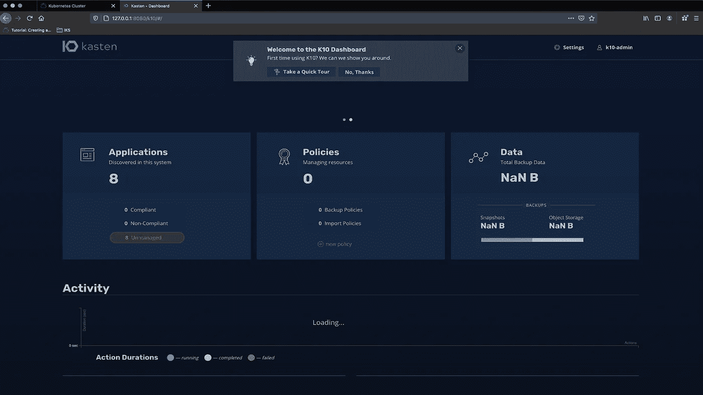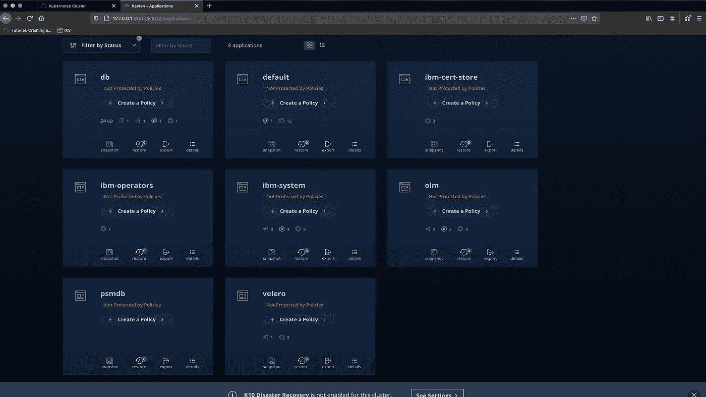

K10 仪表板

K10 部署在自己的命名空间中，并附带了如下所示的所有组件

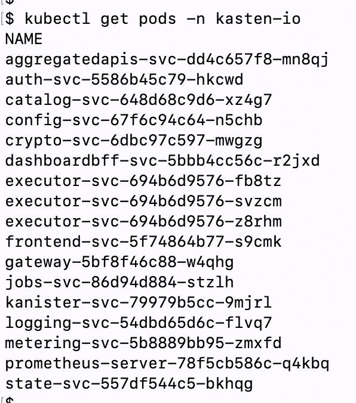

卡斯滕-木卫一吊舱

下一步将是为 K10 设置位置配置文件。位置配置文件只是备份存储目标。它支持主要的云对象存储解决方案，也支持任何其他 S3 兼容存储。我正在使用 Minio 实例进行备份。

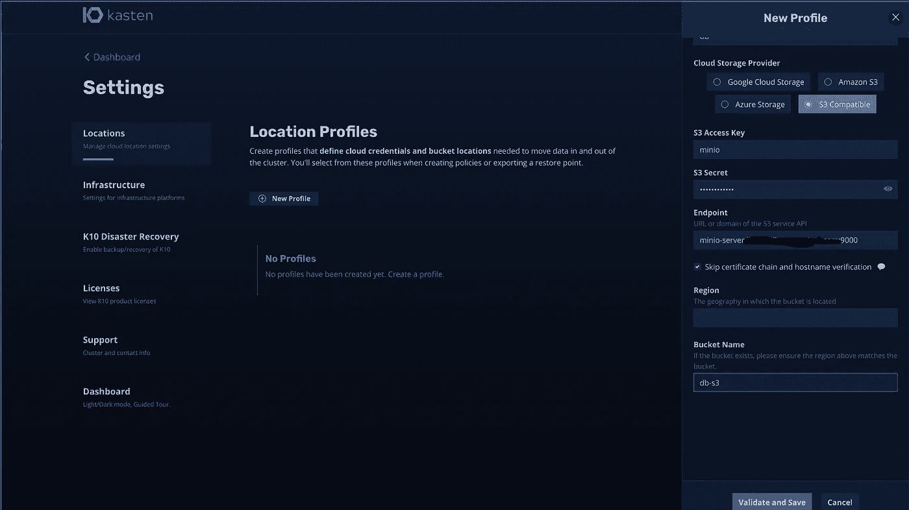

我已经为 Kasten 配置了新的 Minio bucket(名为 *db-s3* )和 Minio 凭证(密钥和秘密)，如下所示

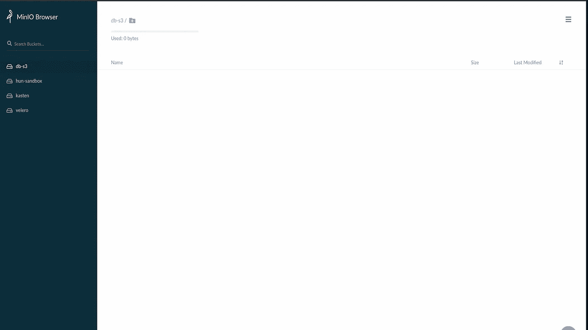

我应该提一下 Kasten 与 [Velero](https://medium.com/@Sandeepkallazhi/velero-backup-restore-for-k8s-stateful-applications-managed-by-operators-8fd9c732ffcc) 提供的非常显著的不同之处，那就是能够为备份目标存储创建多个配置文件。这让你有多个 S3 兼容或云对象存储，如 AWS S3 或 GCP/Azure 对象存储。根据应用程序需求和 Kubernetes 架构，在多个租户使用一个 Kubernetes 集群的情况下，我可以看到这个用例支持多个不同的首选项。

Kasten 还发现作为集群一部分的应用程序，并自动提取与每个应用程序相关的所有元数据信息和对象，如 its、持久卷、机密、配置映射、服务等。它还为您提供了每个命名空间的直观形象，并列出是否定义了备份策略，以及这些策略是否保护了应用程序。这提供了一个很好的视图，并提供了 Kubernetes 工作负载的可见性。

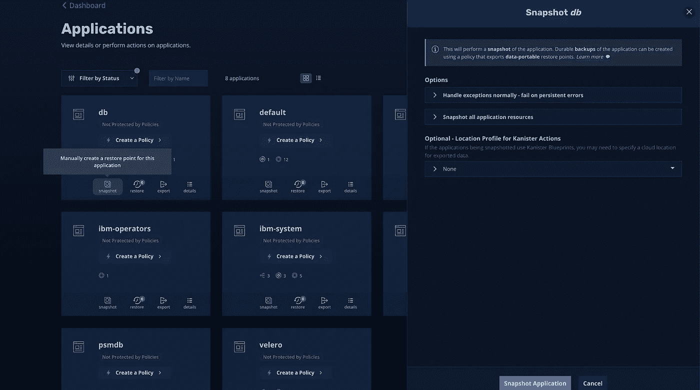

它使您能够执行手动快照或创建策略，然后针对需要保护的应用程序或命名空间运行策略。在上面的图像中，你可以看到我正在尝试手动抓图，它为我提供了选择，要么拍摄整个应用程序的快照，要么只在应用程序中指定特定的标签。

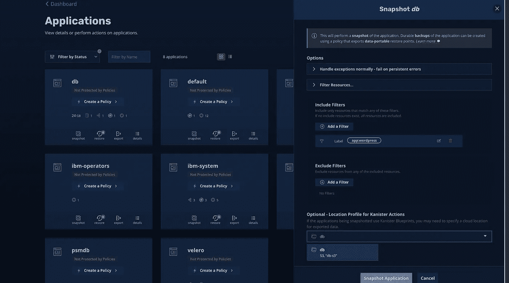

上图显示了我如何从所有发现的标签中选择一个标签，当我在下拉菜单中列出它时，它会显示出来。这非常有用，可以使创建备份策略更加简单，我唯一需要做的就是使用一个有意义的名称标签作为我所有 Kubernetes 应用程序部署 yaml 的标签。

## 使用持久卷创建 MySQL 部署

下面你可以看到一个典型的 MySQL 部署和相关的持久卷。请注意，就绪部分显示 1/1，这意味着副本仅为 1。这是正常的，因为我已经将 MySQL 的副本设置为只有 1，但是我们将在本文后面更详细地研究这个问题。


我将创建一些虚拟数据库，并将一些样本数据注入到数据库中的持久存储中，然后模拟数据是否位于映射到此 POD 的持久存储卷中。

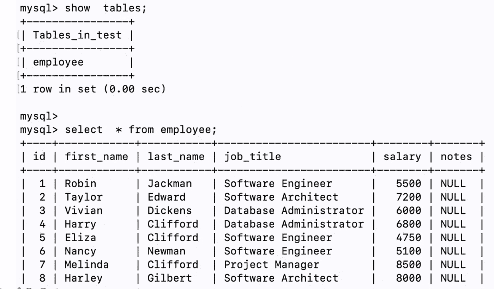

## 边车喷射

在博客的前面，我们谈到了变异的 Webhook 及其意义。变异的 webhook 是一个 Kubernetes 准入控制，我们在这里与 Kasten 一起使用，用于注入 Kanister sidecar 容器，该容器需要进行一般备份。我重申，使用 sidecar 容器的原因是为了装载需要保护的应用程序的数据量。

现在可以使用 Helm upgrade 或使用普通的 Kubernetes 资源部署 sidecar 容器，并在清单中对它们进行必要的修改。在这里，当我使用头盔安装 K10 时，我将继续使用头盔添加 Kanister 边车容器。运行以下命令来完成这项工作。

```
helm upgrade k10 kasten/k10 --namespace=kasten-io -f k10_val.yaml \
--set injectKanisterSidecar.enabled=true \
--set-string injectKanisterSidecar.namespaceSelector.matchLabels.name=mysql
```

在您运行上面的 Helm 命令之后，一个 sidecar 容器会随着您需要保护的工作负载 POD 一起创建。如果您仔细观察如下所示的命令(它的第二部分)。

```
--set-string injectKanisterSidecar.namespaceSelector.matchLabels.k10/injectKanisterSidecar=true
```

这是为了使用 namespaceSelector 选择一个名称空间，它包含您想要保护的应用程序或工作负载。在我的例子中，它是名为 mysql 的名称空间，我在该名称空间中部署了 MySql 部署。现在，我们通常不标记我们创建的名称空间，但我们在这里这样做是必要的，因为我们使用标签来让 Helm 知道要保护哪个名称空间。参见下面的命名空间“mysql”的 json 文件。

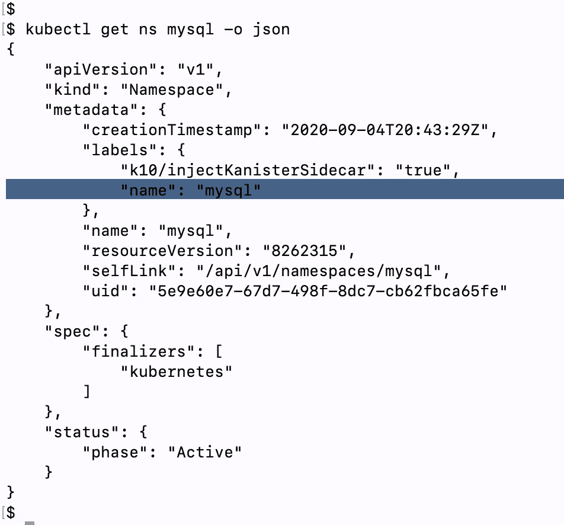

您也可以选择使用 Helm 升级中的以下命令，使用 objectSelector 来保护特定的 POD/工作负荷。

```
--set-string injectKanisterSidecar.objectSelector.matchLabels.key=value
```

现在，这个 Helm 升级设置为在名称空间“mysql”中添加一个 sidecar 容器，并对该名称空间中的工作负载或 POD 进行注释。

在下图中，看看我的 MySQL 部署，注意 yaml 文件中的选定行，您可以看到注释:*k10.kasten.io/forcegenericbackup: " true "*

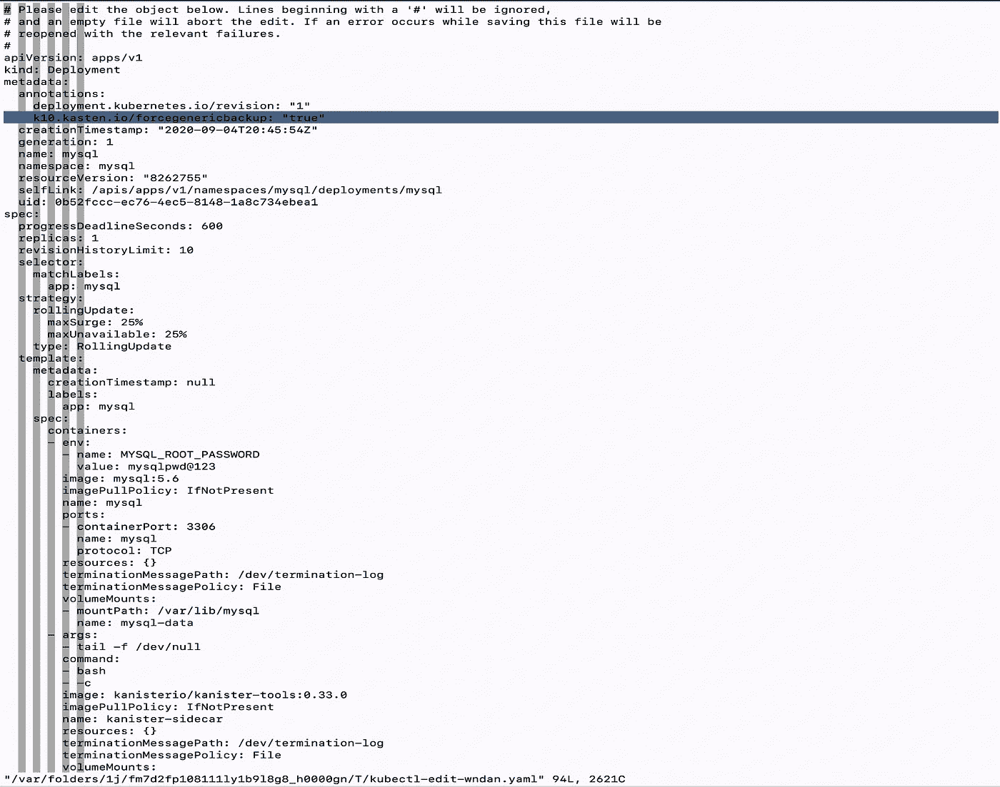

kubectl 编辑部署 mysql -n mysql


mysql 部署和 POD

请看上图，仔细注意“就绪”部分，您会看到它显示为 2/2，这意味着 MySQL pod 中有两个容器。如果你记得在前面的章节中，我们只有一个 MySQL 容器，因为我的副本只有一个。在头盔升级后，边车容器被添加到同一个容器中。

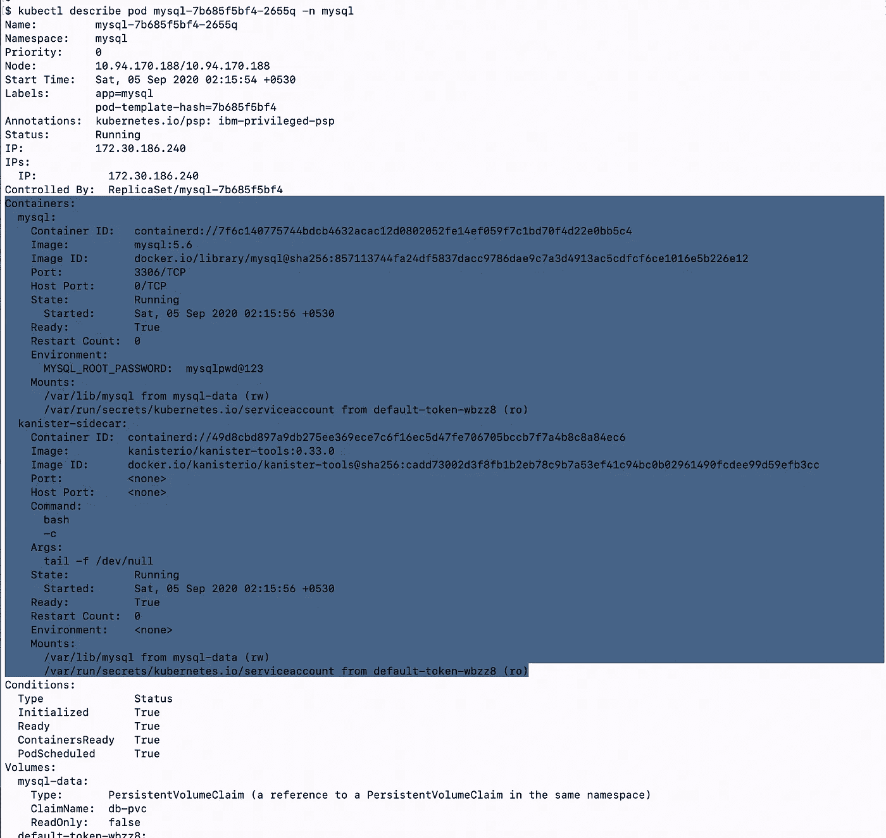

请参见上面的图像，这是 POD 描述的输出，您可以看到两个容器，一个是实际工作负载 MySQL，另一个是 Kanister sidecar 容器。还要记下卷装载，您将看到 sidecar 容器装载点与 MySQL 容器的装载点完全相同，这是启用我们之前讨论的通用备份所需的装载点。

我应该说，并不是所有的应用程序部署都喜欢这种使用边柜容器进行备份的方式，但是当我们遇到这样的场景，底层存储提供商不支持 Kasten 时，K10 会采用这种方法来解决这个问题。

## 创建备份策略

现在，让我们在 K10 中创建一个备份策略并运行它。

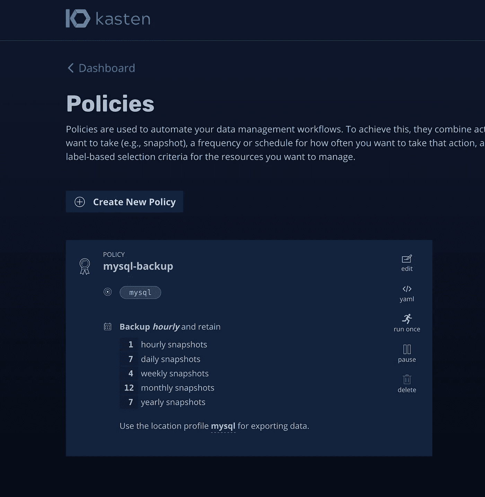

备份策略

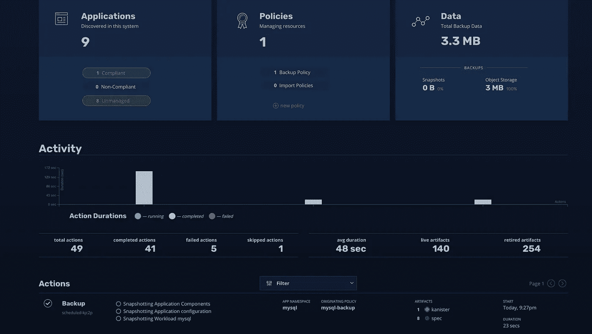

操作表示备份成功

在上面的图片中，您可以看到我已经创建并运行了一个备份策略。在创建策略时，您可以调整不同的参数，K10 页面已经详细介绍了这些参数是如何完成的，所以我不打算在此展示。

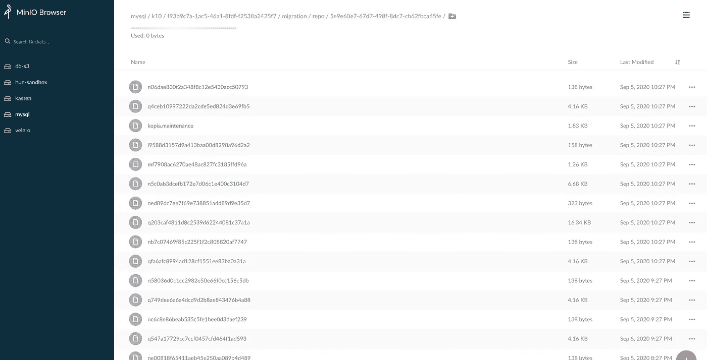

上图显示了我通过“位置配置文件”配置的 Minio 存储桶中的备份。

## 删除工作负荷命名空间并恢复

参见下图，有两个屏幕叠加在一起，一个在左侧显示应用程序卡中的 9，另一个是 Compliant，即命名空间 mysql 中的 MySQl 应用程序。现在看右边的屏幕，终端显示名称空间“mysql”被删除，卡中的应用程序数量减少到 8 个。

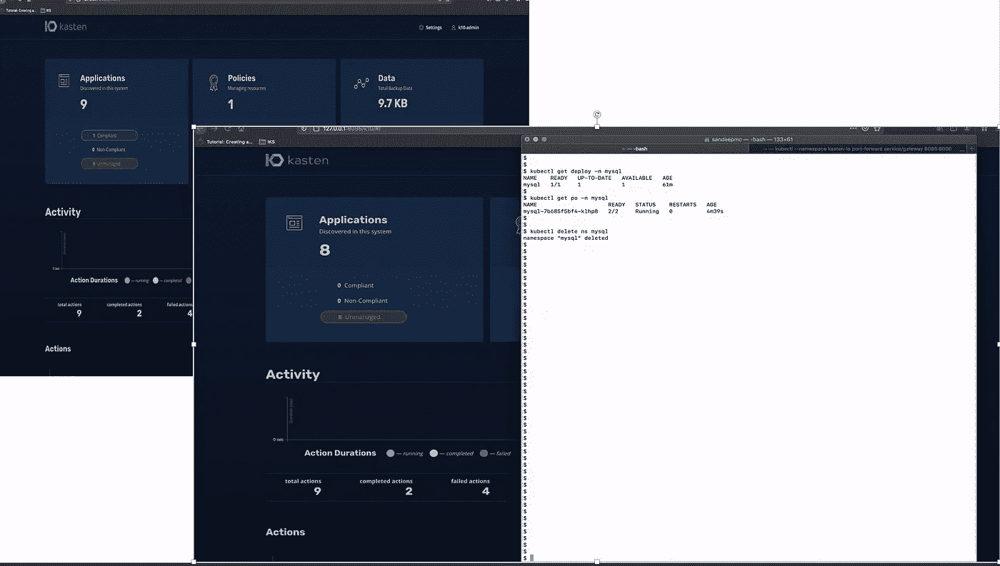

如果您还记得，我已经选择将名称空间作为一个整体进行注释，因此如果该名称空间中有其他 pod，那么所有 pod 都将受到保护。在这个例子中，我没有另一个 POD，但是我会稍后尝试添加一个，然后回来编辑博客。目前它只是 MySQL 的一个工作负载 POD。

## 从 Minio 恢复 MySQL

下图显示了从还原点开始的逐步恢复，在本例中，我只进行了一次备份，因此只有一个还原点。

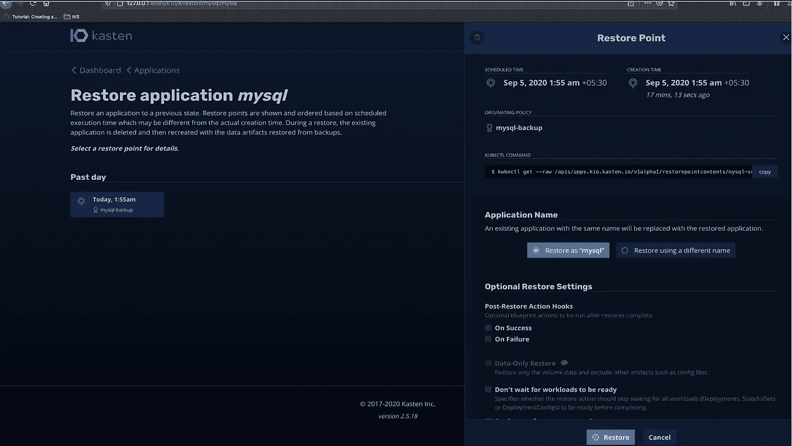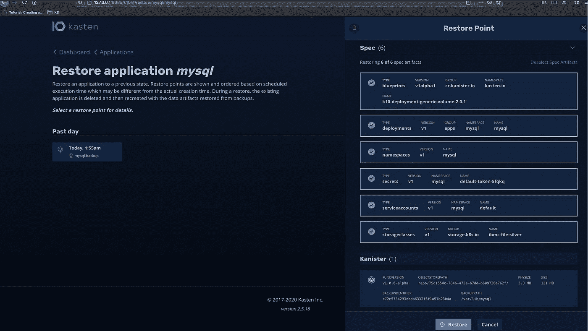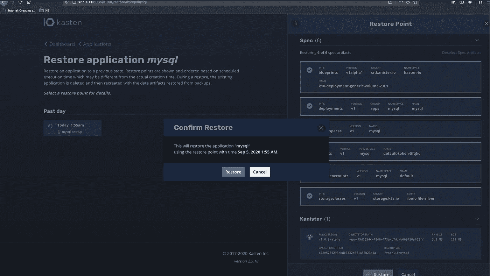

仔细查看规范部分，找到所有要恢复的资源。它列出了蓝图(kanister)、部署、名称空间、机密、服务帐户、存储类。此外，在最后一个图像中，仔细查看 Kanister 部分，它显示了 MySQL 的确切备份路径，这是我最初创建 MySQL 部署时的确切挂载卷路径。

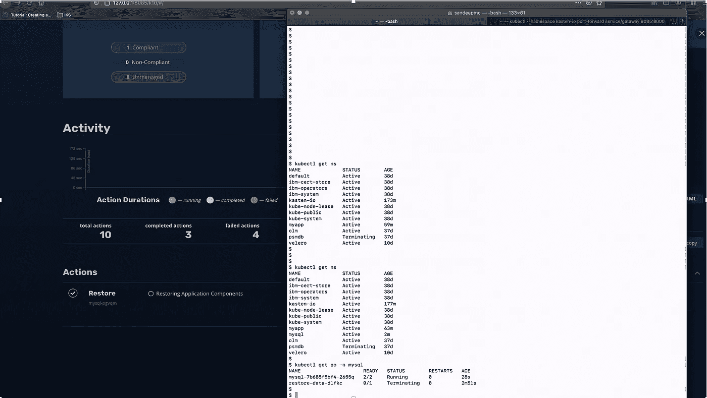

现在，我们可以看到 MySQL pod 正在部署，并注意到有一个恢复数据 pod，它是在恢复过程中创建的，在恢复完成后会被撕掉。

现在，我们应该验证出现的 POD 是否具有从备份中恢复的持久数据。让我们通过检查 mysql 数据库并运行一些 MySQL 查询来进行验证。

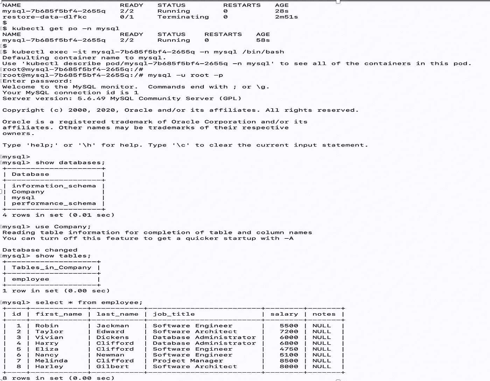

我们进入 POD 并运行 mysql query，发现数据库和表完好无损，并且已经从备份中恢复。

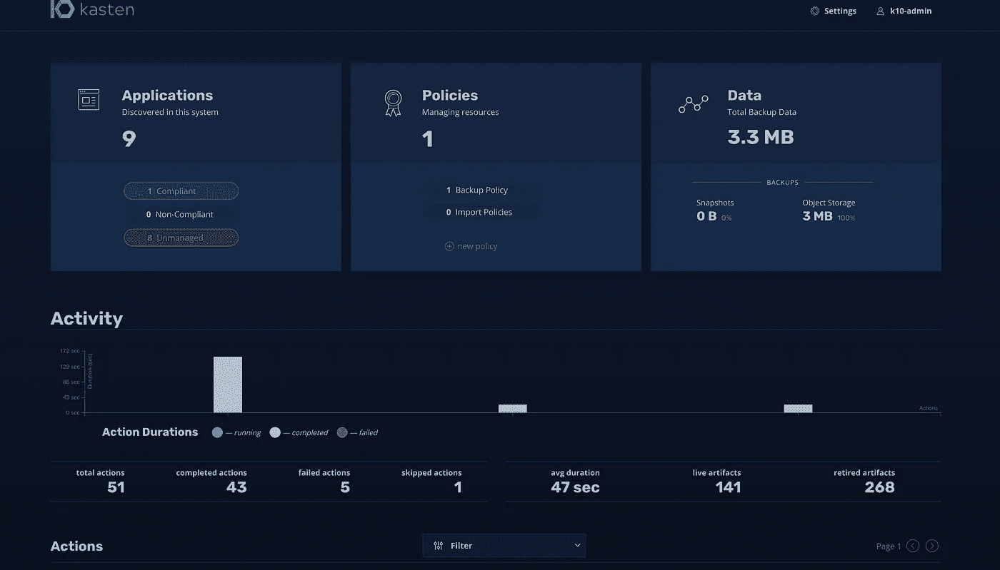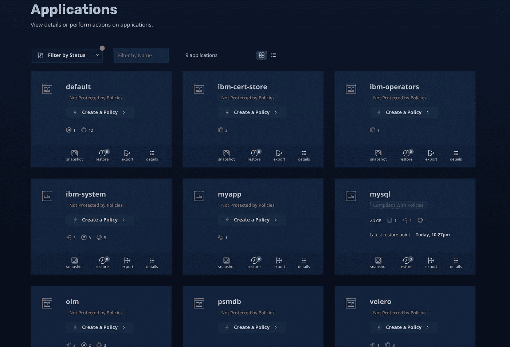

上面的图片显示 MySQL 被列在应用程序中并且是兼容的，这意味着它受到 K10 的保护。现在，我们可以继续指定更好的备份策略和保留时间，以及特定于我们需要的解决方案的其他重要参数。

最后，我想指出，Kasten 是备份和恢复 Kubernetes 上运行的应用程序或工作负载的绝佳解决方案。但是也有警告、问题和限制。在这篇文章中，我的重点是展示当底层存储提供商不支持像 Kasten 这样的解决方案时，Kubernetes 的应用程序或名称空间备份。在这个解决方案中，我们使用 Kanister 的功能将 sidecar 注入到工作负载中，并使用 Kasten 的功能创建策略和恢复有状态的 MySQL 应用程序。

## 结论

我一直在为 Kubernetes 上运行的工作负载的备份和恢复用例研究和构建测试平台。与传统的仅备份/恢复卷不同，我主要关注应用程序特定的使用情形。应用感知备份和恢复可以更好地了解 Kubernetes 中托管的应用的需求和复杂性。

我在这个领域的重点和工作是 Velero 和 Kasten，我期待着做更多的架构，具体的用例，并与社区分享我学到的东西。如果你想看我做什么，想和我聊天，就找我发关于 Kubernetes，开源，Linux [@sandeepkallazhi](https://twitter.com/sandeepkallazhi) ，DM 开放的微博。

下次博客前，再见，注意安全！

干杯！