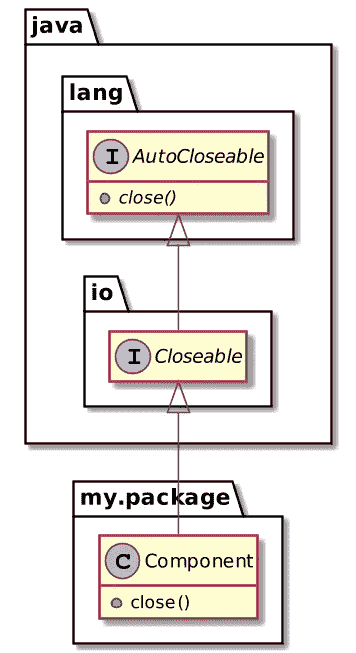

# 用 Kotlin 美化第三方 API

> 原文：<https://itnext.io/beautify-third-party-api-kotlin-d77992847256?source=collection_archive---------6----------------------->


Scala 推广了“给我的库拉皮条”的模式:

> *这只是一个花哨的表达，指的是使用隐式转换来补充库的能力。*
> 
> *—* [*在 Scala 中拉皮条我的库模式*](https://www.baeldung.com/scala/pimp-my-library-pattern)

科特林确实提供了同样的能力。但是，它是通过*扩展函数*来实现的。虽然生成的字节码类似于 Java 的静态方法，但开发人员的体验与向现有类型添加函数是一样的。

不过，这种方法有局限性。不能更新类型层次结构。

假设一个库提供了一个具有开放/关闭生命周期的组件。组件在你实例化它时打开，但是你需要确保在使用后关闭它，*例如*，一个文件，一个流，等等。

在 Java 7 之前，您实际上必须显式关闭组件:

```
Component component;
try {
    component = new Component();
    // Use component
} finally {
    component.close();
}
```

Java 7 引入了 *try-with-resource* 语句，这样您就可以编写如下代码:

```
try (Component component = new Component()) {
    // Use component
}                                                // 1
```

1.  `Component`在生成的`finally`块中关闭

但是，`Component`必须实现`AutoCloseable`。



科特林在`Closeable`上提供了`use()`扩展功能。因此，我们可以用一个简单的函数调用来代替 try-with-resource 语句:

```
Component().use {
  // Use component as it
}                                                // 1
```

1.  `Component`在`finally`块中关闭

话虽如此，想象一下上面的库既没有实现`Closeable`也没有实现`AutoCloseable`。我们不能使用`use()`。科特林代表团来救援了！

委托模式在面向对象语言中很普遍:

> *在委托中，一个对象通过委托给第二个对象来处理一个请求(*委托*)。该委托是一个辅助对象，但是*具有原始上下文*。对于委托的语言级支持，这是通过让委托中的* `*self*` *引用原始(发送)对象，而不是委托(接收对象)来隐式完成的。在委托模式中，这是通过将原始对象作为方法的参数显式传递给委托来实现的。*
> 
> *—* [*百科*](https://en.wikipedia.org/wiki/Delegation_pattern)

在 Java 中实现委托模式需要编写大量样板代码。原始类的方法越多，就越无聊:

```
interface class Component {
    void a();
    void b();
    void c();
}public class CloseableComponent extends Component implements Closeable { private final Component component; public CloseableComponent(Component component) {
        this.component = component;
    } void a() { component.a(); }
    void b() { component.b(); }
    void c() { component.c(); }
    public void close() {}
}
```

Kotlin 通过关键字`by`支持现成的委托模式。人们可以将上面的代码重写为:

```
interface Component {
    fun a() {}
    fun b() {}
    fun c() {}
}class CloseableComponent(component: Component) :
           Component by component, Closeable {                  // 1
    override fun close() {}
}
```

1.  将`a()`、`b()`和`c()`的所有呼叫委托给底层`component`

我们终于可以写出想要的代码了:

```
CloseableComponent(RealComponent()).use {
    // Use component as it
}
```

更好的是，它与第三方代码一起使用，通过这种方法来改进外部库。

锦上添花的是，还可以从一个 *try-with-resource* Java 语句中调用代码:

```
try (CloseableComponent component =
                      new CloseableComponent(new RealComponent())) {
    // Use component
}
```

正如我上面写的，你也可以用 Java 来做。然而，一般来说，为了实现委托而需要编写的大量样板代码是一个很大的障碍。科特林让它变得轻而易举。

我们错过了使代码更容易编写的最后一步。我们如何得到`CloseableComponent`？让我们在`Component`上创建一个扩展函数:

```
fun Component.toCloseable() = CloseableComponent(this)
```

现在，用法很流畅:

```
RealComponent().toCloseable().use {
    // Use component
}
```

在这篇文章中，我们看到了如何改进第三方库提供的 API。我们通过结合 Kotlin 扩展函数和委托来实现它。

**更进一步:**

*   [扩展不同语言的第三方 API](https://blog.frankel.ch/extending-third-party-apis/)
*   [扩展功能](https://kotlinlang.org/docs/extensions.html#extension-functions)
*   [资源尝试声明](https://docs.oracle.com/javase/tutorial/essential/exceptions/tryResourceClose.html)
*   [科特林的用法](https://kotlinlang.org/api/latest/jvm/stdlib/kotlin.io/use.html)
*   [委托模式](https://en.wikipedia.org/wiki/Delegation_pattern)
*   [科特林的代表团](https://kotlinlang.org/docs/delegation.html)

*原载于* [*一个 Java 极客*](https://blog.frankel.ch/beautify-third-party-api-kotlin/)*2021 年 12 月 19 日*