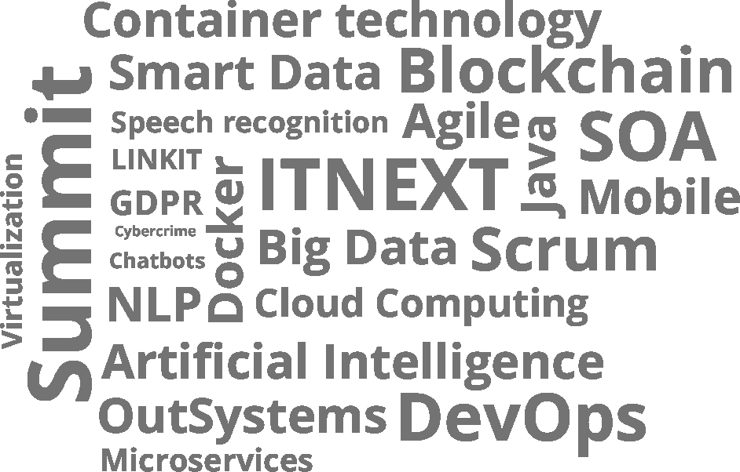

# 利用高性能报告充分发挥大数据的潜力

> 原文：<https://itnext.io/benut-het-volledige-potentieel-van-big-data-met-behulp-van-krachtige-rapportages-1c27ca0b121e?source=collection_archive---------0----------------------->

> [*单击此处将本文分为 LinkedIn*](https://www.linkedin.com/cws/share?url=https%3A%2F%2Fitnext.io%2Fbenut-het-volledige-potentieel-van-big-data-met-behulp-van-krachtige-rapportages-1c27ca0b121e)

这是智能数据系列中的第五篇文章。系列中的其他文章如下所示:

> *#1、* [关注更多数据或更智能地使用现有数据？大数据与智能数据](/focussen-op-meer-data-of-slimmer-gebruik-van-bestaande-data-big-data-vs-smart-data-5b9a306c873f)
> 
> #2、[智能数据以](/smart-data-begint-met-een-strategie-9b5ade9062c1?source=user_profile---------3----------------)策略开始
> 
> # 3:[数据只是数据。从指标和智能问题中获得战略优势](/data-is-slechts-data-behaal-strategisch-voordeel-met-metrics-en-smart-questions-580a87c22887)
> 
> # 4:[通过分析将数据转换为有意义的洞察力 t13](/transformeren-van-data-naar-betekenisvolle-inzichten-met-behulp-van-analyse-697772d6ddbf?source=user_profile---------1----------------)

在大数据和分析中，无论企业的位置、规模和运营部门如何，都隐藏着巨大的潜力。但是，即使你从建立一个[战略开始，制定一个](/smart-data-begint-met-een-strategie-9b5ade9062c1)[指标](/data-is-slechts-data-behaal-strategisch-voordeel-met-metrics-en-smart-questions-580a87c22887)，这将有助于回答[智能问题](/data-is-slechts-data-behaal-strategisch-voordeel-met-metrics-en-smart-questions-580a87c22887)，甚至是随后的[分析。本文的第五篇文章，在以《T10》的《T8》智能数据模型《T9》为基础的系列中，讲述了《报告结果》的“r”。](/transformeren-van-data-naar-betekenisvolle-inzichten-met-behulp-van-analyse-697772d6ddbf)

# **数据可视化**

当然，大数据和分析要比无聊的报告酷得多，但报告是这个过程中的一个关键部分。重要的是，要让人们以正确的形式获得正确的信息，以便他们能够在正确的时间做出正确的决定。因为只有当目标受众能够理解信息和所获得的洞察力时，应用 analytics 才是有价值的。

传统上，报告使用不同类型的表格和图表。最常见的是:

> 条形图:为了便于比较不同的值
> 
> 折线图:时间相关资料的理想选择
> 
> 饼图:常用于表示百分比
> 
> 散点图:说明两组数据之间的相关性

在表格和图表中显示数据不仅可以访问数据并使其有意义，而且可以直接显示关系。但是，使用这种传统的数据可视化方法，您可能能够获得所需的洞察力，但技术发展带来了新的优势。

# **数据可视化 2.0**

幸运的是，随着新的数据和分析形式的出现，报告也带来了一个很有希望的 make，以便充分利用数据的潜力。最新的可视化工具(通常是开源的)不仅可以提供引人注目的输出，还可以更好、更快、更准确地解释信息。

尽管有许多(新的)功能，但视觉化永远不会成为目标。漂亮的图表还是有意义的。现在的挑战是如何将信息打包，让它讲一个故事。当今，数据可视化工具和功能层出不穷，以下是一些示例:

## 显示地图

地图本身就具有很强的视觉显示能力，但是，例如，通过添加有关地图的其他信息，可以获得更多的视图。[polymap](http://polymaps.org/)是一个免费的 JavaScript 库，用于创建动态交互式地图，使用跨多个地图的功能。 [Google Maps](https://enterprise.google.com/intl/nl/maps/products/mapsapi.html) 还提供了一些 API，这些 API 供开发人员用于类似用途。

## 显示文字

如果您要检视不需要详细说明的文字，「word clouds」是绝佳的解决方案。有数十个免费程式可协助您将文字转换为这种视觉化的格式。响应时间越长，用户就越容易了解他们对产品、服务、品牌、组织等的看法。

drawing ext . io 上最常见的标签的摘要—在 word-cloud 或 tagcloud 中，显示单词在数据集中出现的次数。

## 查看数据

数据的显示方式与数据本身的显示方式相同。将根据数据类型确定显示此数据的理想格式。一种方法是使用“T4”【d3.js”，这是一个 JavaScript 库，使用 HTML、SVG 和 CSS 实现数据文档的生命周期。

## 表现出行为和情绪

表现行为和情绪的能力越来越多。越来越多的组织使用软件来分析访问者在网站上的单击行为。[疯狂鸡蛋](https://www.crazyegg.com/)之类的工具可以帮助您了解网站的“热”和“冷”部分。它显示单击的位置和次数、访问者滚动的次数以及他们离开特定页面的时间。在我的[上一篇文章" T3 "中，我曾经谈到情绪分析的可能性越来越多。新技术使我们能够分析“说话的方式”。](/transformeren-van-data-naar-betekenisvolle-inzichten-met-behulp-van-analyse-697772d6ddbf)

# **如何改进数据可视化？**

当你想让数据自言自语时，你必须把它转换成一种普遍理解的形式。提供明亮鲜艳的色彩、高解析度影像、引人入胜的影像，以及有趣的标题。这种策略已被各大报纸和杂志广泛使用，但现在也越来越多地用于向决策者展示数据。另一种趋势是在信息图表中显示数据，这是一种信息和图像的混合形式。例如，巴黎、伦敦和纽约等城市的地铁线的视觉表现法。

趋势是数据量不断增长的结果，因此寻求能够快速有效地表示和解释这些数据的功能。这就是为什么信息技术具有在有限的空间中显示各种信息的特点。当 [Apache Hadoop](/happy-10th-birthday-apache-hadoop-6509842d89ff) 和越来越多的[其他技术](https://itnext.io/tagged/big-data)表现为支持大数据和分析的后端时，数据可视化侧重于大数据和分析的前端。收集后端数据，然后将其转换为可以分析的格式，但当前面临的挑战仍然是如何将分析结果转换为有价值的信息。这样，管理层就可以正确地解释信息，并最终做出决策。

# **7 成功呈现数据的提示**

我想以《T0》一书中所述的 7 个技巧来结束本文。仅仅因为您可以很好地可视化数据并使用数十种不同的图表类型，并不意味着您必须实际使用所有这些功能。成功报告结果的 7 个秘诀，可有效地将统计资料和分析的资料转换为相关的见解:

1.正确识别目标受众

2.根据决策权调整资料视觉化

3.请给我一个明确的标题

4.把数据可视化和你的策略联系起来

5.仔细选择图表类型

6.使用标题突出显示重要组件

7.添加简短的说明和/或说明