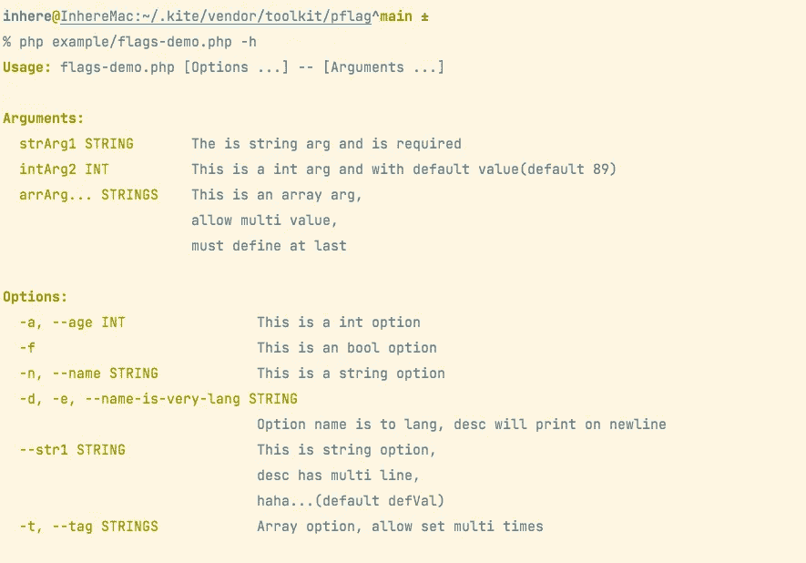

# pflag —更好地解析 PHP 中的命令行标志

> 原文：<https://itnext.io/better-parse-command-line-flags-in-php-1ae17c439e51?source=collection_archive---------7----------------------->

[](https://github.com/php-toolkit/pflag) [## GitHub - php-toolkit/pflag:通用 php 命令行标志解析库

### 通用 PHP 命令行标志解析库。通过在…上创建帐户，为 php-toolkit/pflag 开发做出贡献

github.com](https://github.com/php-toolkit/pflag) 

[toolkit/pflag](https://github.com/php-toolkit/pflag) 是一个通用的 PHP 命令行标志解析库

# 特征

*   通用 CLI 选项和参数解析器。
*   支持设定值数据类型(`int,string,bool,array`)，会自动格式化输入值。
*   支持为选项/参数设置默认值。
*   支持从环境变量读取标志值。
*   需要支持集选项/参数。
*   支持为检查输入值设置验证器。
*   支持自动渲染美丽的帮助信息。

标志参数:

*   支持名为 arguemnt 的绑定
*   支持定义数组参数

标志选项:

*   支持长选项。`--long` `--long value`
*   支持短选项`-s -a value`，允许设置多个短名称。
*   支持定义数组选项
*   `--tag php --tag go`会得到`tag: [php, go]`

# 安装

设计者

```
composer require toolkit/pflag
```

# 标志用法

标志—是 cli 标志(选项和参数)解析器和管理器。

> *示例代码请参见*[*example/flags-demo . PHP*](https://github.com/php-toolkit/pflag/blob/main/example/flags-demo.php)

# 创建标志

```
use Toolkit\PFlag\Flags;require dirname(__DIR__) . '/test/bootstrap.php';$flags = $_SERVER['argv'];
// NOTICE: must shift first element.
$scriptFile = array_shift($flags);$fs = Flags::new();
// can with some config
$fs->setScriptFile($scriptFile);
/** @see Flags::$settings */
$fs->setSettings([
    'descNlOnOptLen' => 26
]);// ...
```

# 定义选项

添加标志选项定义的示例:

```
use Toolkit\PFlag\Flag\Option;
use Toolkit\PFlag\FlagType;
use Toolkit\PFlag\Validator\EnumValidator;// add options
// - quick add
$fs->addOpt('age', 'a', 'this is a int option', FlagType::INT);// - use string rule
$fs->addOptByRule('name,n', 'string;this is a string option;true');// -- add multi option at once.
$fs->addOptsByRules([
    'tag,t' => 'strings;array option, allow set multi times',
    'f'     => 'bool;this is an bool option',
]);// - use array rule
/** @see Flags::DEFINE_ITEM for array rule */
$fs->addOptByRule('name-is-very-lang', [
    'type'   => FlagType::STRING,
    'desc'   => 'option name is to lang, desc will print on newline',
    'shorts' => ['d','e','f'],
    // TIP: add validator limit input value.
    'validator' => EnumValidator::new(['one', 'two', 'three']),
]);// - use Option
$opt = Option::new('str1', "this is  string option, \ndesc has multi line, \nhaha...");
$opt->setDefault('defVal');
$fs->addOption($opt);
```

# 定义参数

```
*/**
 * Add an argument
 *
 ** ***@param*** *string $name
 ** ***@param*** *string $desc
 ** ***@param*** *string $type The argument data type. default is: string. {****@see*** *FlagType}
 ** ***@param*** *bool   $required
 ** ***@param*** *mixed  $default
 ** ***@param*** *array  $moreInfo
 *
 ** ***@psalm-param*** *array{helpType: string} $moreInfo
 *
 ** ***@return*** *self
 */* public function addArg*(* string $name,
    string $desc,
    string $type = '',
    bool $required = false,
    $default = null,
    array $moreInfo = *[]
)*
```

添加标志参数的示例定义:

```
use Toolkit\PFlag\Flag\Argument;
use Toolkit\PFlag\FlagType;// add arguments
// - quick add
$fs->addArg('strArg1', 'the is string arg and is required', 'string', true);// - use string rule
$fs->addArgByRule('intArg2', 'int;this is a int arg and with default value;no;89');// - use Argument object
$arg = Argument::new('arrArg');
// OR $arg->setType(FlagType::ARRAY);
$arg->setType(FlagType::STRINGS);
$arg->setDesc("this is an array arg,\n allow multi value,\n must define at last");$fs->addArgument($arg);
```

# 解析输入

```
use Toolkit\PFlag\Flags;
use Toolkit\PFlag\FlagType;// ...if (!$fs->parse($flags)) {
    // on render help
    return;
}vdump($fs->getOpts(), $fs->getArgs());
```

**显示帮助**

在终端中运行:

```
$ php example/flags-demo.php --help
```

输出:



**运行演示**:

```
$ php example/flags-demo.php --name inhere --age 99 --tag go -t php -t java -d one -f arg0 80 arr0 arr1
```

输出:

```
array(6) {
  ["str1"]=> string(6) "defVal"
  ["name"]=> string(6) "inhere"
  ["age"]=> int(99)
  ["tag"]=> array(3) {
    [0]=> string(2) "go"
    [1]=> string(3) "php"
    [2]=> string(4) "java"
  }
  ["name-is-very-lang"]=> string(3) "one"
  ["f"]=> bool(true)
}
array(3) {
  [0]=> string(4) "arg0"
  [1]=> int(80)
  [2]=> array(2) {
    [0]=> string(4) "arr0"
    [1]=> string(4) "arr1"
  }
}
```

# 获得价值

> 获取标志值非常简单，可以使用方法 getOpt(string $ name)getArg($ nameOrIndex)。将通过定义类型自动格式化输入值。

选择

```
$force = $fs->getOpt('f'); // bool(true)
$age  = $fs->getOpt('age'); // int(99)
$name = $fs->getOpt('name'); // string(inhere)
$tags = $fs->getOpt('tags'); // array{"php", "go", "java"}
```

争论

```
$arg0 = $fs->getArg(0); // string(arg0)
// get an array arg
$arrArg = $fs->getArg(1); // array{"arr0", "arr1"}
// get value by name
$arrArg = $fs->getArg('arrArg'); // array{"arr0", "arr1"}
```

# 标志规则

选项/参数规则。使用规则可以快速定义一个选项或参数。

*   字符串值是规则(`type;desc;required;default;shorts`)。
*   数组被定义项`SFlags::DEFINE_ITEM`
*   支持的类型见`FlagType::*`

```
$rules = [
     // v: only value, as name and use default type FlagType::STRING
     // k-v: key is name, value can be string|array
     'long,s',
     // name => rule
     'long,s' => 'int',
     'f'      => 'bool',
     'long'   => FlagType::STRING,
     'tags'   => 'array', // can also: ints, strings
     'name'   => 'type;the description message;required;default', // with desc, default, required
]
```

对于选项

*   选项允许设置短裤

> *提示:名称* `*long,s*` *— long 为选项名称。剩下的是短名字。*

对于参数

*   无别名/简称
*   数组值只允许最后定义

定义项目

常量`Flags::DEFINE_ITEM`:

```
public const DEFINE_ITEM = [
    'name'      => '',
    'desc'      => '',
    'type'      => FlagType::STRING,
    'helpType'  => '', // use for render help
    // 'index'    => 0, // only for argument
    'required'  => false,
    'default'   => null,
    'shorts'    => [], // only for option
    // value validator
    'validator' => null,
    // 'category' => null
];
```

# 定制设置

# 解析设置

```
// -------------------- settings for parse option ------------------ /**
     * Stop parse option on found first argument.
     *
     * - Useful for support multi commands. eg: `top --opt ... sub --opt ...`
     *
     * @var bool
     */
    protected $stopOnFistArg = true; /**
     * Skip on found undefined option.
     *
     * - FALSE will throw FlagException error.
     * - TRUE  will skip it and collect as raw arg, then continue parse next.
     *
     * @var bool
     */
    protected $skipOnUndefined = false; // -------------------- settings for parse argument ------------ /**
     * Whether auto bind remaining args after option parsed
     *
     * @var bool
     */
    protected $autoBindArgs = true; /**
     * Strict match args number.
     * if exist unbind args, will throw FlagException
     *
     * @var bool
     */
    protected $strictMatchArgs = false;
```

# 渲染帮助的设置

支持渲染帮助的一些设置

```
// -------------------- settings for built-in render help ---------- /**
     * Auto render help on provide '-h', '--help'
     *
     * @var bool
     */
    protected $autoRenderHelp = true; /**
     * Show flag data type on render help.
     *
     * if False:
     *
     * -o, --opt    Option desc
     *
     * if True:
     *
     * -o, --opt STRING   Option desc
     *
     * @var bool
     */
    protected $showTypeOnHelp = true; /**
     * Will call it on before print help message
     *
     * @var callable
     */
    private $beforePrintHelp;
```

*   自定义帮助消息呈现器

```
$fs->setHelpRenderer(function (\Toolkit\PFlag\FlagsParser $fs) {
    // render help messages
});
```

# 单元测试

```
phpunit --debug
```

覆盖测试:

```
phpdbg -qrr $(which phpunit) --coverage-text
```

[](https://github.com/php-toolkit/pflag) [## GitHub - php-toolkit/pflag:通用 php 命令行标志解析库

### 通用 PHP 命令行标志解析库。通过在…上创建帐户，为 php-toolkit/pflag 开发做出贡献

github.com](https://github.com/php-toolkit/pflag)