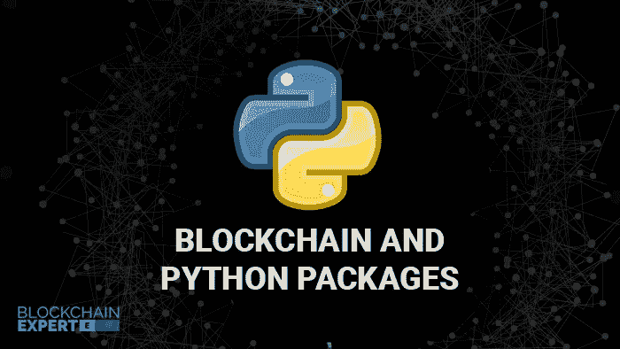

# 区块链和 Python 包

> 原文：<https://itnext.io/blockchain-and-python-packages-3afca119d8ae?source=collection_archive---------2----------------------->

区块链的公共账本 API‘block chain . info’支持 Python 2 和 python 3。“blockchain.info”包中有 7 个模块。

区块链和 Python 包

区块链可以简单定义为分布在互联网上的账本，用于存储交易细节。它还可以用于跟踪网络中的资产。

区块链的应用与日俱增。一些应用包括智能合同、加密货币、医疗保健应用、治理解决方案、IOT 等。通过使用 Python，我们可以开发所有这些应用程序。Python 是一种高级语言，与区块链‘block chain . info’包的 public ledger API 交互。区块链的 [python 包描述如下。](http://www.blockchainexpert.uk/blog/python-packages-for-blockchain)

' blockchain.info '中支持 Python 2 和 python 3，包中有 7 个模块，分别是:

*   blockexplorer ( [文档](https://github.com/blockchain/api-v1-client-python/blob/master/docs/blockexplorer.md))([API/区块链 _api](https://blockchain.info/api/blockchain_api) )
*   create wallet([docs](https://github.com/blockchain/api-v1-client-python/blob/master/docs/createwallet.md))([API/create _ wallet](https://blockchain.info/api/create_wallet))
*   汇率([文档](https://github.com/blockchain/api-v1-client-python/blob/master/docs/exchangerates.md))([API/exchange _ rates _ API](https://blockchain.info/api/exchange_rates_api))
*   pushtx ( [文档](https://github.com/blockchain/api-v1-client-python/blob/master/docs/pushtx.md) ) ( [pushtx](https://blockchain.info/pushtx) )
*   v2 . receive([docs](https://github.com/blockchain/api-v1-client-python/blob/master/docs/receive.md))([API/API _ receive](https://blockchain.info/api/api_receive))
*   统计([文档](https://github.com/blockchain/api-v1-client-python/blob/master/docs/statistics.md) ) ( [api/charts_api](https://blockchain.info/api/charts_api) )
*   钱包([文档](https://github.com/blockchain/api-v1-client-python/blob/master/docs/wallet.md))([API/区块链 _ 钱包 _api](https://blockchain.info/api/blockchain_wallet_api) )

1.  **blockexplorer**

为了执行区块链操作，它有 10 个内置函数:

*   get_block()
*   get_tx()
*   获取地址()
*   get_block_height()
*   get_xpub()
*   get_multi_address()
*   get_unspent_outputs()
*   get_latest_block()
*   get_unconfirmed_text()
*   获取 _ 块()

**2。创建钱包模块**

对于金融交易，我们需要一个数字钱包，与数字钱包相关的基本操作都由这个模块管理。要使用“创建钱包”和“钱包”模块，我们必须运行一个 [service-my-wallet-v3](https://github.com/blockchain/service-my-wallet-v3) 的实例。为了创建 wallet，我们还需要一个' [api_code](https://api.blockchain.info/customer/signup) '。createwallet 模块中唯一可用的函数是' create_wallet()'。

**3。汇率模块**

数字货币兑换由该模块管理。它的两个内置功能是:

*   `**get_ticker**`

此方法返回“货币”对象的字典。

*   `**to_btc**`

调用此方法将任何货币转换为其等价的比特币价值。

**4。pushtx 模块**

事务广播由该模块管理。它包含一个函数(pushtx ),如果交易被误报，它将返回一个异常。

**5。v2 .接收模块**

[区块链接收支付 API V2](https://blockchain.info/api/api_receive) 是接收自动化比特币支付的最快方式。使用此模块实现相同的功能。使用的功能有:

*   `**receive**`

此方法用于生成转发地址。它返回一个“ReceiveResponse”对象。

*   `**callback-log**`

获取为特定回调 URL 执行的回调列表。该方法将返回“LogEntry”对象的列表。

**6。统计模块**

这用于获取完整的区块链统计数据。我们在这个模块中使用函数“get”。

**7。钱包模块**

为了创建一个数字钱包，我们使用 createwallet 模块。它具有以下内置功能:

*   派遣
*   发送 _ 多条
*   获取 _ 余额
*   列表地址
*   获取地址
*   新地址
*   存档地址
*   取消存档 _ 地址

欲了解完整详细的信息(**包括使用源代码的示例**)请访问[区块链专家](http://www.blockchainexpert.uk/)

*原载于 2017 年 11 月 28 日*[*medium.com*](https://medium.com/blockchainexpert-blog/blockchain-and-python-packages-b6bf11e7bafb)*。*