# 使用 Angular 和 Firebase 构建生产就绪 PWA

> 原文：<https://itnext.io/build-a-production-ready-pwa-with-angular-and-firebase-8f2a69824fcc?source=collection_archive---------0----------------------->

Angular 为开发人员提供了一套很棒的工具，可以帮助他们轻松地开始开发应用程序。在引入 schematics 之后，Angular 团队将他们的游戏进行得更深入。

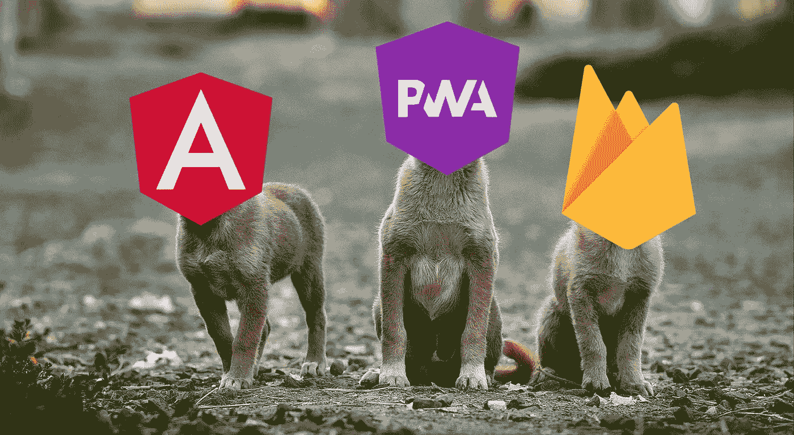

安诺尔·查菲克在 [Unsplash](https://unsplash.com/@anoirchafik?utm_source=unsplash&utm_medium=referral&utm_content=creditCopyText) 上拍摄的照片

作为一名进步的网络应用布道者，我最喜欢的 ng 图表之一是 [@angular/pwa](https://www.npmjs.com/package/@angular/pwa) ，这并不奇怪。该示意图为您的 PWA 开发之旅提供了一个良好的开端。然而，你需要在你的应用上做更多的工作，以便在多个移动平台上为你的用户创造最佳体验。

本教程将介绍如何构建、优化和托管您的 PWA，以便在生产环境中提供类似本机的应用体验。它为最佳实践和平台优化提供了指南。除此之外，你的 PWA 也会得分💯在遵循了本文中描述的指南和提示之后，在 [Lighthouse](https://developers.google.com/web/tools/lighthouse/) PWA 上进行审计。

## 在继续之前，请记住这是一个教程，您可能想要跟踪您的进展。我主持的国际研讨会的内容与本文几乎相同。这就是为什么我在 [GitHub](https://github.com/onderceylan/pwa-workshop-angular-firebase) 上为车间材料创建了一个 repo。如果你愿意的话，你可以自己远程参加研讨会👇

[](https://github.com/onderceylan/pwa-workshop-angular-firebase) [## onderceylan/pwa-workshop-angular-firebase

### 欢迎来到基于 Angular、Ionic 和 Firebase 构建生产就绪的渐进式 Web 应用的研讨会。这个…

github.com](https://github.com/onderceylan/pwa-workshop-angular-firebase) 

如果你喜欢工作坊，我很欣赏你在 [GitHub](https://github.com/onderceylan/pwa-workshop-angular-firebase) 上的星。开始了。

# 1.将@angular/pwa 原理图添加到角度应用程序

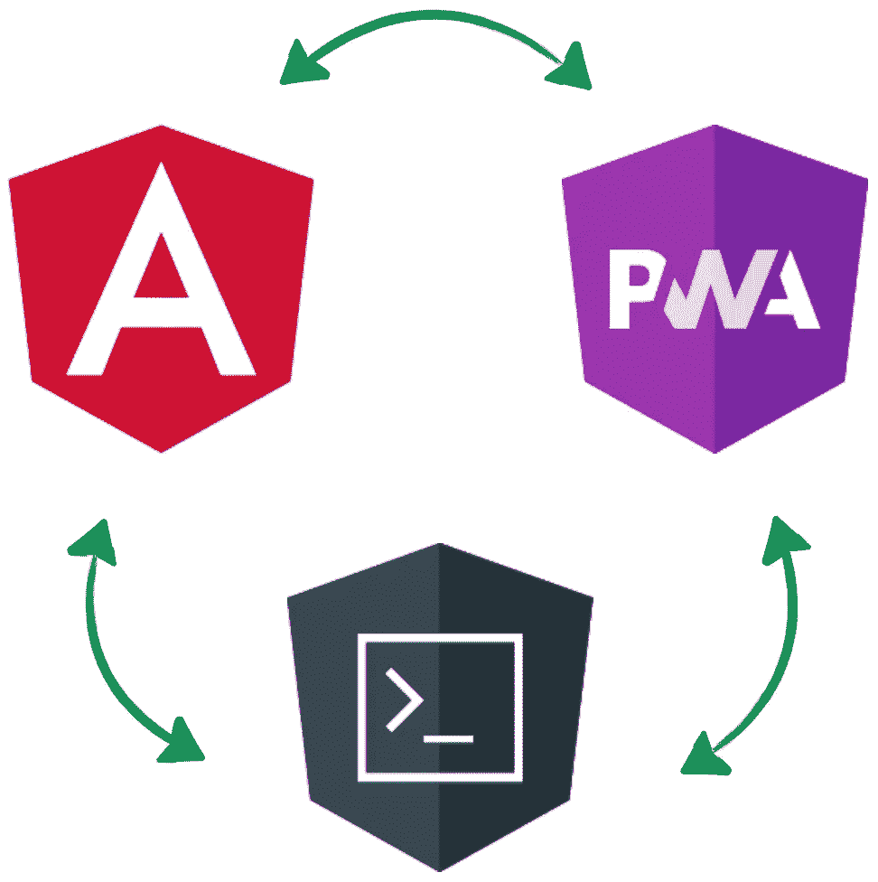

你需要做的第一件事——在你全新或现有的 Angular 应用上构建一个渐进式 Web 应用——是将 *@angular/pwa* 原理图添加到你的应用中。

您只需在 Angular CLI 上运行 *add* 命令即可。

```
ng add @angular/pwa
```

> 💡提示— [在您的 Angular 项目中使用“npx ng”命令](https://blog.npmjs.org/post/162869356040/introducing-npx-an-npm-package-runner)，而无需在您的系统上安装 global @angular/cli 软件包。

添加 *@angular/pwa* schematic 将在您的项目上创建以下文件，我们稍后将深入研究这些文件。

```
ngsw-config.json
src/assets/icons/icon-128x128.png
src/assets/icons/icon-144x144.png
src/assets/icons/icon-152x152.png
src/assets/icons/icon-192x192.png
src/assets/icons/icon-384x384.png
src/assets/icons/icon-512x512.png
src/assets/icons/icon-72x72.png
src/assets/icons/icon-96x96.png
src/manifest.json
```

它还会相应地调整您的`angular.json`、`index.html`和`app.module.ts`文件。

# 2.更改 Web 应用程序清单文件— manifest.json

> [web 应用程序清单](http://web app manifest)是一个简单的 JSON 文件，它告诉浏览器关于您的 web 应用程序，以及当它“安装”在用户的移动设备或桌面上时应该如何运行。Chrome 需要一个清单来显示[添加到主屏幕提示](https://developers.google.com/web/fundamentals/app-install-banners/)。
> 
> 一个典型的清单文件包括关于应用程序的信息`name`、它应该使用的`icons`、它启动时应该开始的`start_url`等等。
> 
> — [谷歌开发者门户网站上的 Web 应用清单](https://developers.google.com/web/fundamentals/web-app-manifest/)

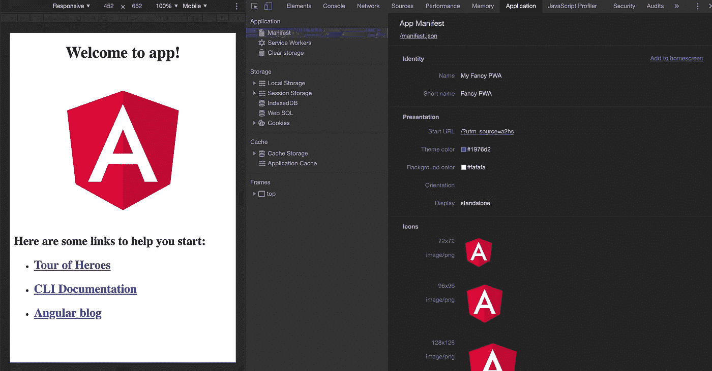

使用 Chrome DevTools 的应用程序标签来检查你的应用程序的 manifest.json 文件

## 2.1 添加描述

我在由 *@angular/pwa* 原理图生成的 manifest.json 文件上看到的改进点之一是增加了*描述*字段。描述字段在 [W3C Web App 清单规范](https://www.w3.org/TR/appmanifest/)和 [MDN](https://developer.mozilla.org/en-US/docs/Web/Manifest) 上都有记录。

```
{
  "description": "My Fancy PWA is a dummy Angular app which demonstrates a PWA's behaviour on different platforms."
}
```

## 2.2 跟踪起始 url

在 manifest.json 文件的 *start_url* 字段的末尾添加一个查询字符串也是一个很好的做法，可以跟踪你安装的应用程序从用户主屏幕启动的频率。

```
{
  "start_url": "/?utm_source=a2hs"
}
```

> 💡提示——提供名称、描述和至少 512 x 512 像素的应用程序图标将有助于您的应用程序在微软商店上被[自动索引和打包。](https://docs.microsoft.com/en-us/microsoft-edge/progressive-web-apps/microsoft-store#automatic-pwa-importing-with-bing)

我在其中一个 pwa 上使用的完整 manifest.json 文件的示例

# 3.显示 A2HS 指南

谷歌 Chrome 自动检测 Android 系统上的 PWA，如果该网站满足[添加到主屏幕标准](https://developers.google.com/web/fundamentals/app-install-banners/#criteria)，它会向用户显示[安装横幅或迷你信息栏](https://developers.google.com/web/updates/2018/06/a2hs-updates)，允许他们将其添加到主屏幕。

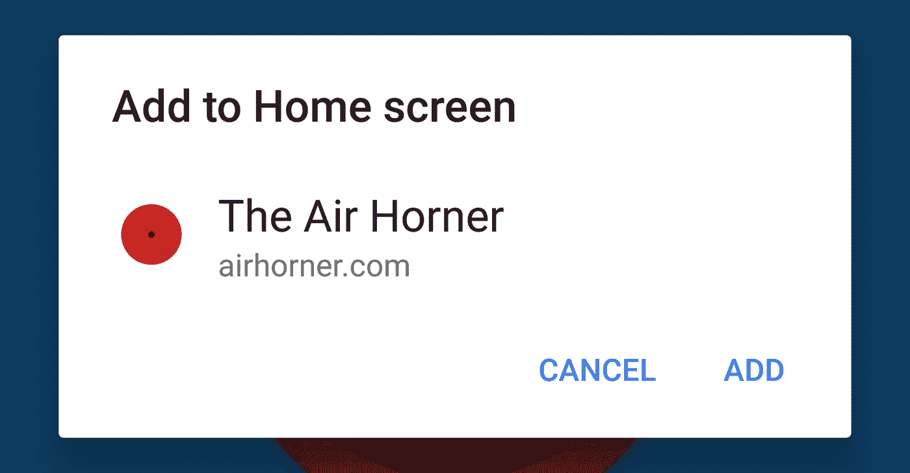

Android 上的添加到主屏幕对话框

> 💡提示— **当你的 manifest.json 中的 short_name** 字段被添加到主屏幕时，它将代表你的 PWA 的名称。另外，**名称**字段将用于 Android 上 [*添加到主屏幕*提示](https://developers.google.com/web/fundamentals/app-install-banners/)！

iOS 上没有这样的功能。但是，幸运的是，我们可以构建自己的 UX 来引导用户点击所需的*按钮*来帮助他们将你的应用添加到他们的主屏幕上。

它可以是一个很好的旧弹出窗口；

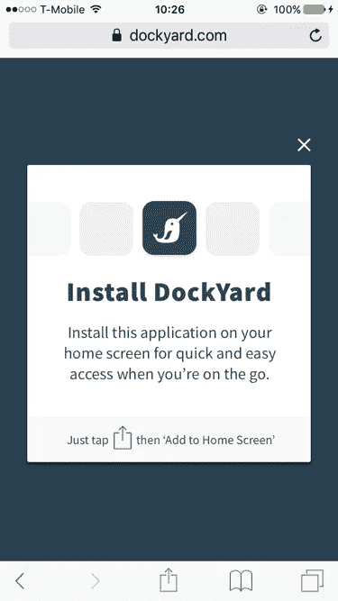

一个引导用户的弹出窗口—来源:[https://dock yard . com/blog/2017/09/27/inspiring-pwa-installation-on-IOs](https://dockyard.com/blog/2017/09/27/encouraging-pwa-installation-on-ios)

或者，甚至更好；一个迷你信息栏，模仿 Chrome 在 Android 平台上的行为，创建跨平台的统一体验。

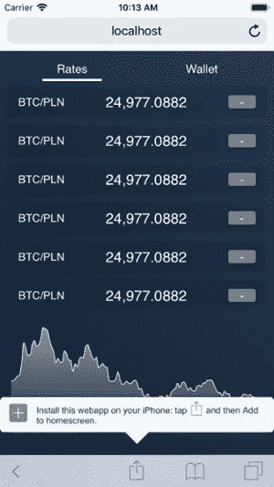

类似指南的迷你信息栏—来源:[https://www . net guru . com/code stories/little-tips-that-will-make-your-pwa-on-IOs-feel-like-native](https://www.netguru.com/codestories/few-tips-that-will-make-your-pwa-on-ios-feel-like-native)

例如，我在我的一个 pwa 上使用了一些代码来介绍这种行为。

```
**import** { get, set } **from** 'idb-keyval';
**import** { ToastController } **from** '@ionic/angular';**async** showIosInstallBanner() {
  // Detects if device is on iOS
  **const** isIos = () => {
    **const** userAgent = window.navigator.userAgent.toLowerCase();
    **return** /iphone|ipad|ipod/.test(userAgent);
  }; // Detects if device is in standalone mode
  **const** isInStandaloneMode = () => ('standalone' **in** window.navigator) && window.navigator.standalone;

  // Show the banner once
  **const** isBannerShown = **await** get('isBannerShown');

  // Checks if it should display install popup notification
  **if** (isIos() && !isInStandaloneMode() && isBannerShown === **undefined**) {
    **const** toast = **await this**.toastController.create({
      showCloseButton: **true**,
      closeButtonText: 'OK',
      cssClass: 'custom-toast',
      position: 'bottom',
      message: `To install the app, tap "Share" icon below and select "Add to Home Screen".`,
    });
    toast.present();
    set('isBannerShown', **true**);
  }
}
```

# 4.为平台优化添加元标签

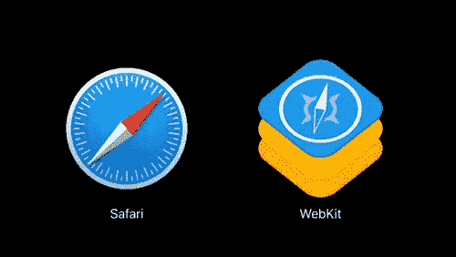

WebKit 是 Safari、Mail、App Store 以及 macOS、iOS 和 Linux 上的许多其他应用程序使用的[网络浏览器引擎](https://webkit.org/project)—[https://webkit.org/](https://webkit.org/)

尽管许多浏览器采用了 [Web 应用清单规范](https://w3c.github.io/manifest/)，但是 WebKit(特别是 iOS 上的 Mobile Safari)目前使用定制的非标准跟踪元标签实现。

正因为如此，苹果的 iOS 不会像谷歌的 Android 那样基于应用程序的清单文件自动为 PWA 创建闪屏或应用程序图标。这阻止了您的 PWA 提供类似本机应用程序的体验。

> 💡提示——关注 WebKit 特性状态，以跟踪 web 标准的实现进度。比如说；一旦 Web 应用清单规范在 WebKit 上实现，您将不再需要使用定制的 meta 标签。在这里跟踪进度:【https://webkit.org/status/#?search=manifest】T2

幸运的是，有一个解决方法可以在 iOS 平台上配置你的 PWA 的应用程序图标、闪屏和状态栏。解决方法是在应用程序的 index.html 文件中添加自定义元标签！

## 4.1 为 iOS 上的应用图标添加元标签

如上所述，iOS 无法识别您放在清单文件中的应用程序图标。这就是为什么你需要在你的 index.html 文件中添加元标签来优化你的 iOS 应用程序及其图标。

以下示例演示了如何为最常见的 iOS 设备指定各种大小:

```
<link rel="apple-touch-icon" href="touch-icon-iphone.png"><link rel="apple-touch-icon" sizes="152x152" href="touch-icon-ipad.png"><link rel="apple-touch-icon" sizes="180x180" href="touch-icon-iphone-retina.png"><link rel="apple-touch-icon" sizes="167x167" href="touch-icon-ipad-retina.png">
```

你可以在苹果的 [Safari 网页内容指南](https://developer.apple.com/library/archive/documentation/AppleApplications/Reference/SafariWebContent/ConfiguringWebApplications/ConfiguringWebApplications.html)上阅读更多关于这个话题的内容。

## 4.2 为 iOS 上的闪屏添加 meta 标签

为了将闪屏添加到 iOS 上的 PWA 中，您必须添加一个 meta 标签，指出特定分辨率的图像。如果 meta 标签中图像的大小与设备的分辨率匹配，iOS 会将图像显示为闪屏。

苹果使用一个名为`apple-touch-startup-image`的 rel 自定义链接来支持添加到 iOS 主屏幕的应用程序的闪屏，正如你在这里看到的。你还需要设置`apple-mobile-web-app-capable` meta 来支持闪屏。

```
<meta name="apple-mobile-web-app-capable" content="yes">
<link rel="apple-touch-startup-image" href="/launch.png">
```

您需要为不同的设备创建不同大小的静态图像。以下是设备及其分辨率的列表:

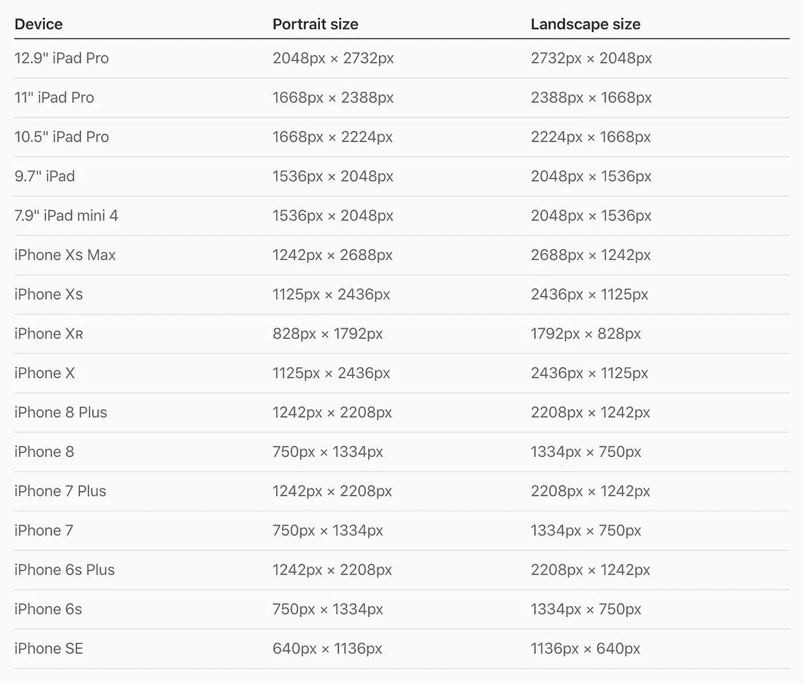

静态启动屏幕图像— [苹果人机界面指南](https://developer.apple.com/design/human-interface-guidelines/ios/icons-and-images/launch-screen/)

这是我在 PWAs index.html 文件中的一些元标签的示例:

```
<link href="/assets/splash/iphone5_splash.png" media="(device-width: 320px) and (device-height: 568px) and (-webkit-device-pixel-ratio: 2)" rel="apple-touch-startup-image"><link href="/assets/splash/iphone6_splash.png" media="(device-width: 375px) and (device-height: 667px) and (-webkit-device-pixel-ratio: 2)" rel="apple-touch-startup-image"><link href="/assets/splash/iphonex_splash.png" media="(device-width: 375px) and (device-height: 812px) and (-webkit-device-pixel-ratio: 3)" rel="apple-touch-startup-image">
```

> 💡提示——使用自动化工具来生成图像及其相应的 html 代码。这里有一个开源库，我就是为此而建的:[https://github.com/onderceylan/pwa-asset-generator](https://github.com/onderceylan/pwa-asset-generator)

```
npx pwa-asset-generator https://github.com/onderceylan/pwa-asset-generator/blob/master/static/logo.png -b "linear-gradient(to right, #fa709a 0%, #fee140 100%)"
```

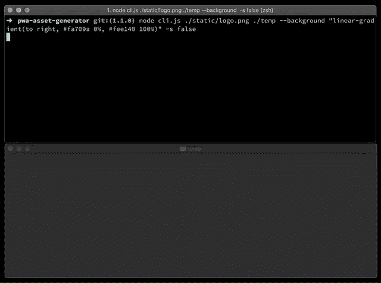

通过 **pwa-asset-generator** 自动生成闪屏和图标图像以及相应的 HTML 标签

## 4.3 为 iOS 上的状态栏添加元标签

您可以通过在 index.html 文件中使用`apple-mobile-web-app-status-bar-style` meta 标签来定制您的 PWA 的 iOS 状态栏。除非您为 PWA 指定全屏模式(也称为独立模式),否则这个 meta 标记没有任何作用。

```
<meta name="apple-mobile-web-app-status-bar-style" content="white">
```


*状态栏的视图；* ***黑色半透明*** *，* ***白色*** *，* ***黑色***

苹果只支持 meta 标签的`content`属性的 3 个选项，没有进一步定制的可能性。选项包括:

*   `white` —显示带有黑色文本和符号的白色状态栏。`default`值和`white`有同样的效果，但是我*更喜欢白色。*因为`default`是非默认行为，所以不会那么混乱！🤯
*   `black` —显示黑色状态栏和白色文本及符号。当 meta 标签不存在时，这是 iOS 上 PWA 的默认行为。
*   `black-translucent` —显示白色文本和符号，状态栏使用与应用程序主体元素相同的背景色。

## 4.4 社交分享的元标签

渐进式网络应用程序本质上是可以通过网络访问的。这意味着您可以在社交媒体或即时消息服务上分享您的 PWA 链接。

为了方便那些在网络上分享你的应用的用户，我建议通过在你的 PWA 中添加[Open Graph Protocol meta tags](http://ogp.me/)来创建一个不错的应用预览。

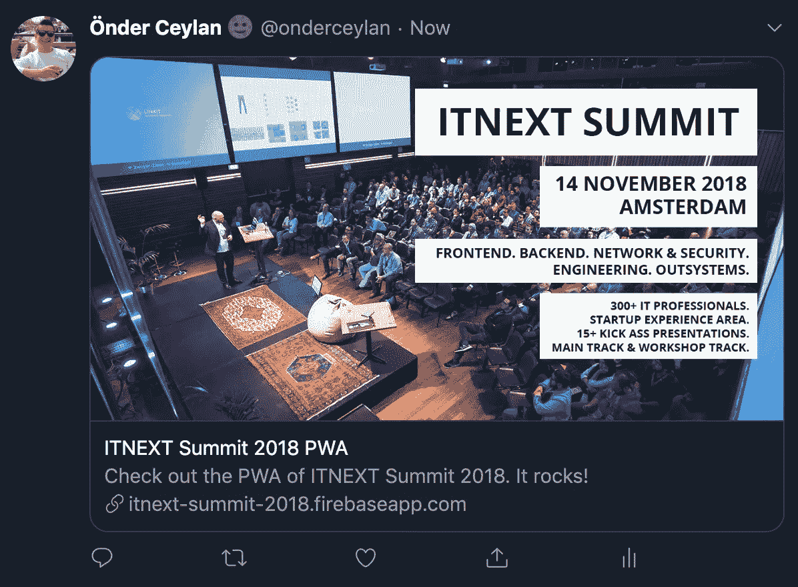

您的应用程序在 Twitter 上的链接预览，带有提供的 Open Graph 元标签

以下是提供良好用户体验所需的元标签的示例:

```
<meta property="og:title" content="ITNEXT Summit 2018 PWA">
<meta property="og:description" content="Check out the PWA of ITNEXT Summit 2018\. It rocks!">
<meta property="og:image" content="https://itnext-summit-2018.firebaseapp.com/assets/img/social-share.png">
<meta property="og:url" content="https://itnext-summit-2018.firebaseapp.com">
<meta name="twitter:card" content="summary_large_image">
```

此外，您可以对 PWA 进行更多的优化，以定制 iOS 上的用户体验。

请访问 Safari HTML reference 获取 Apple 特定元标签的完整列表:[https://developer . Apple . com/library/archive/documentation/Apple applications/Reference/Safari HTML ref/Articles/meta tags . HTML](https://developer.apple.com/library/archive/documentation/AppleApplications/Reference/SafariHTMLRef/Articles/MetaTags.html)

除了使用 meta 标签，一些额外的优化可以通过简单的 CSS 调整来完成。如；

*   禁用选择
*   禁用高亮显示
*   禁用标注
*   启用标签效果

点击此处了解更多信息:

[](https://dev.to/oskarlarsson/designing-native-like-progressive-web-apps-for-ios-510o) [## 为 iOS 设计类似原生的渐进式网络应用

### 渐进式 Web 应用程序(PWA)的主要特征之一是应用程序相似性。虽然你的应用程序技术上运行在…

开发到](https://dev.to/oskarlarsson/designing-native-like-progressive-web-apps-for-ios-510o) 

# 5.配置 ngsw-config . JSON-Angular 维修工人

当您添加@angular/pwa 原理图时，angular 的 ServiceWorkerModule 被注入到您的`app.module.ts`文件中。该模块注册您自动生成的服务工作者文件— ngsw-worker.js，该文件是在生产构建期间由 ng cli 构建的。

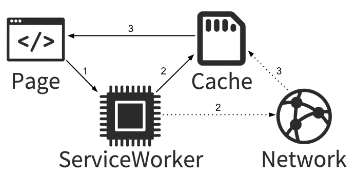

您可以参考[维修工人配置的角度文档](https://angular.io/guide/service-worker-config)来了解您的配置的设计和可能选项。

## 5.1 数据组

> 与资产资源不同，数据请求不随应用程序一起版本化。它们根据手动配置的策略进行缓存，这些策略对于 API 请求和其他数据依赖等情况更有用。

这里我想强调的是数据资源的缓存策略。Angular service worker 的设计考虑到了简洁性，因此它提供了两种缓存策略。

## 缓存策略:性能

> 适合不经常变动的资源；例如，用户头像图像。— [角度文件](https://angular.io/guide/service-worker-config#strategy)

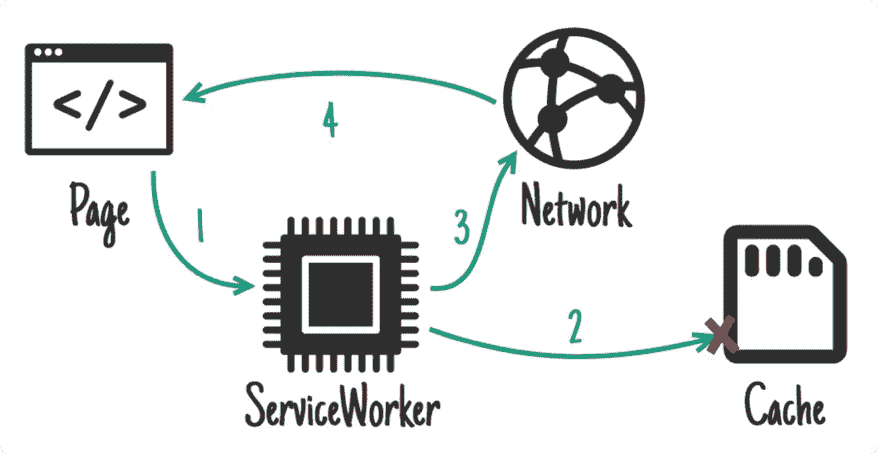

性能是高速缓存优先的战略

> 默认设置为`performance`，优化响应速度。如果资源存在于缓存中，则使用缓存的版本。根据`maxAge`，这允许一些陈旧，以换取更好的性能。这适用于不经常变化的资源；例如，用户头像图像。

## 缓存策略:新鲜度

> 对经常变化的资源有用；例如，帐户余额。— [角度文件](https://angular.io/guide/service-worker-config#strategy)

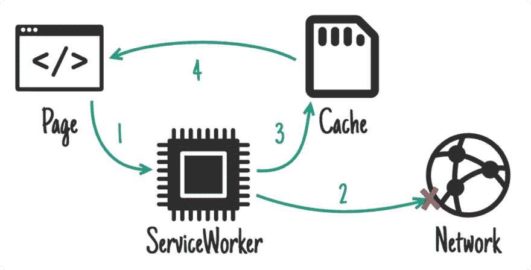

新鲜是网络第一的战略

> `freshness`优化数据流通，优先从网络获取请求的数据。根据`timeout`的说法，只有当网络超时时，请求才会回到缓存中。

```
"dataGroups": [
    {
      "name": "from-api",
      "version": 2,
      "urls": ["/data/data.json"], // or ["/dashboard", "/user"]
      "cacheConfig": {
        "strategy": "performance",
        "maxSize": 10,
        "maxAge": "1h",
        "timeout": "3s"
      }
    }
  ]
```

在上面的示例中，来自 API 的数据或接收到的静态 json 文件将使用刷新策略进行缓存，最多 10 次响应，最大缓存时间为 1 小时，超时时间为 3 秒，之后结果将退回到缓存中。*新鲜度*是一种**网络优先策略**，或者，您可以使用*性能*作为**缓存优先策略**的策略。

> 💡提示—当您的数据源以向后不兼容的方式更新时，增加数据组中的版本字段以使您的数据资源缓存无效。新版本的应用程序可能与旧的数据格式不兼容。

## 5.2 资产组

> 资产是属于应用程序版本的资源，会随应用程序一起更新。它们可以包括从页面来源加载的资源，以及从 cdn 和其他外部 URL 加载的第三方资源。

根据缓存它们的策略，您可以在每个资产组上引入`lazy`或`prefetch`策略。服务工作者配置上的资源接受与许多文件匹配的[类 glob 模式](https://angular.io/guide/service-worker-config#glob-patterns)，比如；

```
"assetGroups": [
    {
      "name": "shell",
      "installMode": "prefetch",
      "updateMode": "prefetch",
      "resources": {
        "files": [
          "/favicon.ico",
          "/index.html",
          "/*.css",
          "/vendor.*.js",
          "/main.*.js",
          "/polyfills.*.js",
          "/runtime.*.js",
          "/*.js",
          "!/*-sw.js"
        ]
      }
    },
    {
      "name": "assets",
      "installMode": "lazy",
      "updateMode": "prefetch",
      "resources": {
        "files": [
          "/assets/**",
          "/svg/**"
        ],
        "urls": [
          "[https://fonts.googleapis.com/**](https://fonts.googleapis.com/**)"
        ]
      }
    }
  ]
```

对于已经在缓存中的资源，当发现新版本的应用程序时，`updateMode`决定缓存行为。根据`updateMode`更新组中自上一版本以来发生变化的任何资源。当您的应用程序有新的服务人员版本时，Angular service worker 将自动处理您的资产更新。

> 💡提示——当你使用缓存策略时，你必须排除那些你想保持新鲜的资源。例如您的应用程序可能使用的附加服务工作者文件。

以下完整的 ngsw-config.json 文件示例演示了资产组、数据组、应用程序数据和用于排除其他服务人员的 glob:

# 6.为静态资产配置 angular.json

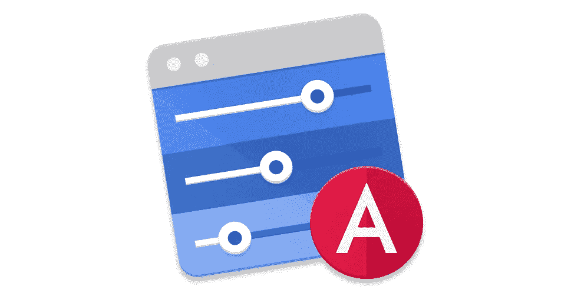

Angular 控制台徽标，Angular CLI 的 GUI—[https://angularconsole.com](https://angularconsole.com/)

使用 Angular 构建 PWA 时，需要注意的最重要的一点是静态资产的配置。您需要了解您的构建配置及其在生产构建中的输出，以便正确地缓存和服务您的静态资源。

将@angular/pwa 原理图添加到您的 angular 应用程序会自动将`manifest.json`文件注册到您在`angular.json`配置上的静态资源配置中。但是如果您在根上使用额外的文件，比如`robots.txt`、`browserconfig.xml`，或者一个定制的图标集，那么您需要将这些文件添加到您的构建配置中。

添加@angular/pwa 原理图后，这是您的`angular.json`文件上的默认资产配置:

```
"assets": [
  "src/favicon.ico",
  "src/assets",
  "src/manifest.json"
]
```

当你添加静态文件到你的根目录，或者引入一个外部插件时，你可能想要扩展这个配置。在我们的例子中，更有趣的是，您可能想在自动生成的`ngsw-worker.js`的基础上向您的应用程序引入一个额外的服务人员。

这是我的一个 pwa 在`angular.json`上的资产配置示例:

```
"assets": [
  "src/manifest.json",
  "src/robots.txt",
  "src/browserconfig.xml",
  "src/favicon.ico",
  {
    "glob": "**/*",
    "input": "src/assets",
    "output": "assets"
  },
  {
    "glob": "**/*.svg",
    "input": "node_modules/@ionic/angular/dist/ionic/svg",
    "output": "./svg"
  },
  {
    "glob": "**/*-sw.js",
    "input": "src/app/sw",
    "output": "/"
  },
  {
    "glob": "**/idb-keyval-iife.min.js",
    "input": "node_modules/idb-keyval/dist/",
    "output": "/"
  }
]
```

# 7.延伸角形服务工作者

截至 2019 年 2 月，Angular service worker-aka ngsw 不支持另一个服务工作者的组成。这意味着你不能扩展棱角分明的服务人员的默认行为，并为其添加你的特色。

您可以尝试并编辑自动生成的`ngsw-worker.js`服务人员文件，但是每次您为生产构建应用程序时，Angular 都会根据您在`ngsw-config.json`上的配置覆盖该文件。

如果你计划做的比 Angular service worker 提供给你的更多，这个架构可能会引入一个问题。不过不用担心，有一个很好的解决方法可以解决这个问题。

## 介绍您自己的服务人员文件

你可以引入一个新的服务人员文件，比如说将`main-sw.js`导入到你的 Angular 应用中，并将自动生成的 ngsw *导入到你的新服务人员*中。

假设您将 sw 文件配置为复制到 apps 根文件夹，请参考“为静态资产配置 angular.json”一章中的`"**/*-sw.js"` glob，您的 worker 上的以下 [importScripts](https://developer.mozilla.org/en-US/docs/Web/API/WorkerGlobalScope/importScripts) 导入应该可以解决。

在 src/app/sw 文件夹中创建一个新的`main-sw.js`文件，内容如下:

```
importScripts('ngsw-worker.js'); // automatically generated ngsw
importScripts('messaging-sw.js'); // custom service worker #1
importScripts('notifications-sw.js'); // custom service worker #2
```

在引入您自己的服务工作者包装器之后，您必须更改您的`app.module.ts`文件上的服务工作者引用。

```
ServiceWorkerModule.register('**/main-sw.js**', { enabled: environment.production })
```

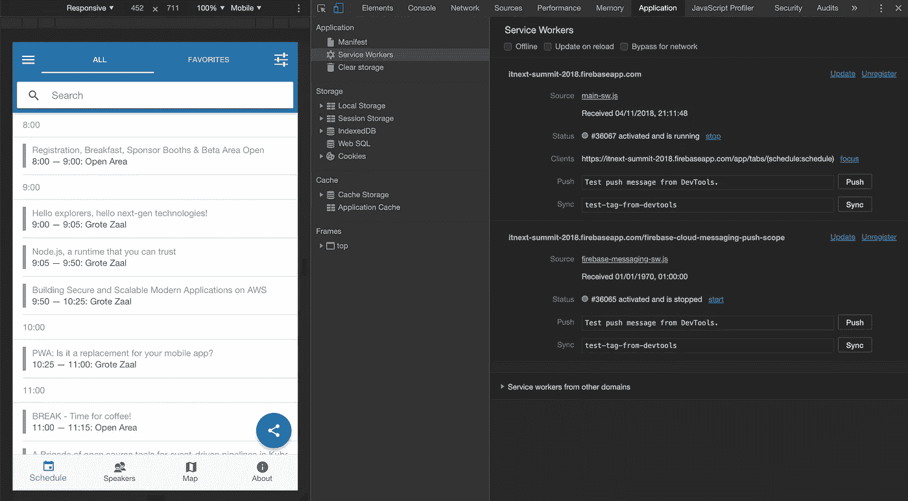

使用 Chrome DevTools 的应用程序选项卡来检查应用程序的服务人员。ITNEXT 2018 大会 PWA 扩展服务工作者演示—[https://itnext-summit-2018.firebaseapp.com](https://itnext-summit-2018.firebaseapp.com)

> 💡提示—默认情况下，为生产环境启用服务人员。Angular 推荐[为生产而构建，并运行 http-server](https://angular.io/guide/service-worker-getting-started) 来测试你的应用的服务人员。

# 8.更新您的 PWA

服务人员是渐进式 Web 应用程序的骨干。而且，更新 PWA 总是从其服务人员开始。浏览器定期检查客户端应用程序的附加服务工作器的字节差异，并且一旦服务工作器文件被更新，浏览器自动初始化更新过程。

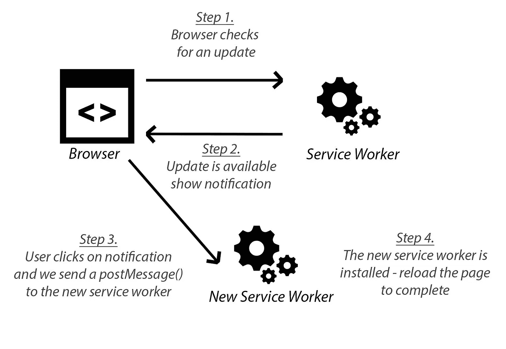

来源:[https://dean Hume . com/displaying-a-new-version-available-progressive-we b-app/](https://deanhume.com/displaying-a-new-version-available-progressive-web-app/)

## 8.1 应用程序版本和更新检查

> 在 Angular 服务人员的上下文中，“版本”是代表 Angular 应用程序的特定构建的资源的集合。每当部署应用程序的新版本时，服务人员都会将该版本视为应用程序的新版本。即使只更新了一个文件，也是如此。在任何给定时间，服务人员的缓存中可能有多个版本的应用程序，并且服务人员可能会同时为它们提供服务。
> 
> 每次用户打开或刷新应用程序时，Angular service worker 都会通过查找对`ngsw.json`清单的更新来检查应用程序的更新。该清单文件代表 Angular 构建的“版本”,以及与 ngsw-config 文件相关联的所有文件。如果发现更新，它会自动下载并缓存，并在下次加载应用程序时提供。
> 
> — [角度文件](https://angular.io/guide/service-worker-devops)

ngsw.json 清单文件，表示 Angular PWA 的构建版本

阅读更多关于 ngsw 应用程序更新的信息:[https://angular.io/guide/service-worker-devops](https://angular.io/guide/service-worker-devops)

## 8.2 ngsw-config . JSON 上的 AppData

ngsw-config.json 文件中的`appData`字段使您能够传递描述该应用程序特定版本的任何数据(您想要的)。`[SwUpdate](https://angular.io/api/service-worker/SwUpdate)`服务将该数据包含在更新通知中。许多应用程序利用这个字段来提供一些额外的信息，以显示任何弹出窗口，通知用户有可用的更新。

```
"index": "/index.html",
"**appData**": {
  "version": "1.1.0",
  "changelog": "Added better resource caching"
}
```

## 8.3 软件更新服务

Angular 通过自己的名为`[SwUpdate](https://angular.io/api/service-worker/SwUpdate)`的服务从*@ angular/service-worker*模块处理其服务工作者更新。您可以订阅此服务上的 *UpdateAvailableEvent* 和 *UpdateActivatedEvent* 事件，以获得服务人员更新的通知。

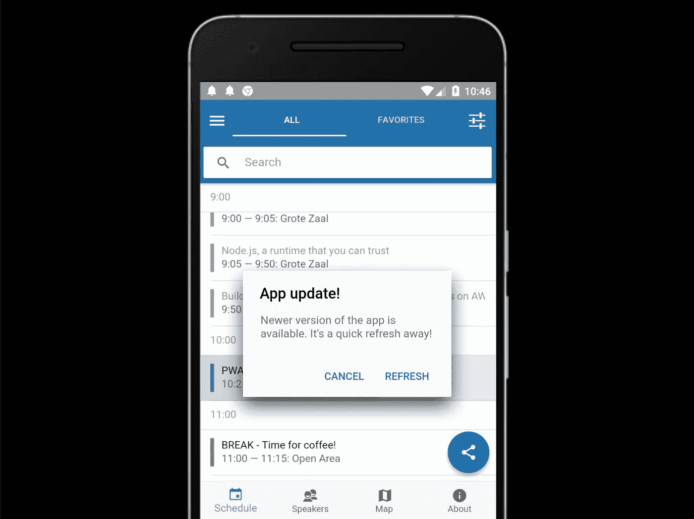

ITNEXT 2018 大会 PWA，app 更新演示—参见 https://github.com/LINKIT-Group/itnext-summit-app[上的源代码](https://github.com/LINKIT-Group/itnext-summit-app)

以下示例演示了一个用户提示，当新的服务工作程序版本可用时，将显示该提示。通过这样做，我们为用户提供了一个立即应用更新的选项。

```
**import** { SwUpdate } **from** '@angular/service-worker';
@Component({
  selector: 'app-root',
  templateUrl: './app.component.html',
})
**export class** AppComponent **implements** OnInit {ngOnInit() {
  **if** (**this**.swUpdate.isEnabled) {
    **this**.swUpdate.available.subscribe(**async** () => {
      **const** alert = **await this**.alertController.create({
        header: `App update!`,
        message: `Newer version of the app is available. It's a quick refresh away!`,
        buttons: [
          {
            text: 'Cancel',
            role: 'cancel',
            cssClass: 'secondary',
          }, {
            text: 'Refresh',
            handler: () => {
              window.location.reload();
            },
          },
        ],
      });

      **await** alert.present();
    });
  }
}
```

请注意，您不必提供这种手动更新功能。当所有客户端或附属页面断开时，浏览器会自动更新服务人员。但是，为了方便您的用户，我建议您提供这种即时更新选项。

> 💡提示—浏览器会自动检查附加的主服务工作器文件的字节差异，如果您扩展了 ngsw，该文件将是 main-sw.js。您应该确保您可能导入到主要服务人员的其他 sw 文件没有被缓存。这将在下一章的 Firebase 主机配置中详细解释。

# 9.在 Firebase 上托管您的应用

Firebase 是围绕简单性构建的。为您的应用程序设置主机和配置部署非常容易。

一旦你登录到 [Firebase 控制台](https://console.firebase.google.com)，你就可以点击*添加项目*按钮，并根据你的喜好*填写下面的表格。*

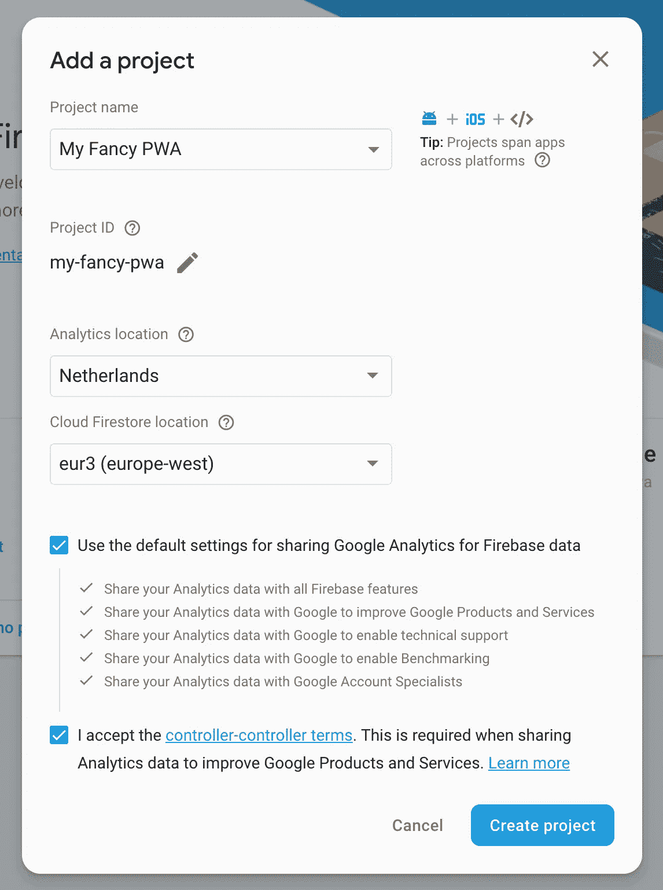

在 Firebase 上为您的应用程序创建新项目

使用 Firebase 服务最简单的方法是通过控制台使用 Firebase CLI。要在命令行上访问 Firebase CLI，请运行以下命令之一:

```
npm i -g firebase-tools 
npx firebase // or use npx to avoid global installation
```

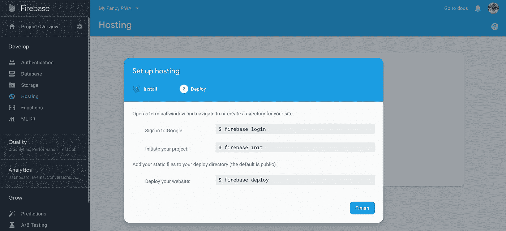

在 Firebase 上设置主机

创建项目后，导航到开发类别下的*托管*选项卡。单击“完成”以使您的项目在 CLI 上可用。

## 正在初始化 Firebase 配置

您可以通过 Firebase CLI 简单地执行 3 个命令，将您的 PWA 部署到 Firebase；*登录*、*初始化*和*部署*。我们现在只使用 Firebase 的托管服务。为了做到这一点，你应该在你的项目根上执行`firebase init`，然后用*空格键*检查并按下*回车*。


在项目中初始化 Firebase 的选项

在下一步，它将显示您现有的项目给你设置一个主机。选择*【创建新项目】*选项，为您的应用程序创建一个默认项目。之后，像下面这样回答步骤；

*   您想将什么用作您的公共目录？ `dist/my-pwa` —这是在*输出路径*下的 angular.json 文件中配置的生产构建的路径。
*   *配置为单页 app(将所有网址改写为/index.html)* ？`y`
*   *文件 dist/my-pwa/index.html 已经存在。覆盖？*

作为这个设置的输出，Firebase CLI 在您的项目根目录下创建两个文件:`firebase.json`和`.firebaserc`

# 10.为您的 PWA 配置 Firebase 主机

可以通过项目中的`firebase.json`文件在 Firebase 上配置你的主机。您可以在下面看到 Firebase CLI 为您的项目创建的默认配置；

```
{
  "hosting": {
    "public": "dist/my-pwa",
    "ignore": [
      "firebase.json",
      "**/.*",
      "**/node_modules/**"
    ],
    "rewrites": [
      {
        "source": "**",
        "destination": "/index.html"
      }
    ]
  }
}
```

了解这种配置的几个要点很重要。

*   因为 Angular 是一个 SPA(单页应用程序)，你必须像上面一样配置 rewrite 来将所有的源代码指向你的 index.html 文件。
*   在任何情况下都不要部署任何保存您的凭证**的文件**。密钥、机密以及依赖于您指出的公共文件夹的配置文件中的此类机密信息可能会立即暴露给外界。确保忽略公共文件夹中的任何配置文件，否则。

关注我们环境中的一个重大安全问题

## 10.1 为缓存添加自定义 HTTP 头

Firebase 主机配置允许你为你的项目添加定制的 HTTP 头。

这种配置对于您的 PWA 尤其重要，因为您可能希望缓存静态资产并对其进行 gzip 压缩，以提高应用程序的加载性能。较长缓存生存期可以加快对页面的重复访问。

> 当浏览器请求资源时，提供资源的服务器可以告诉浏览器它应该临时存储或**缓存**资源多长时间。对于对该资源的任何后续请求，浏览器使用其本地副本，而不是去网络获取它。— [谷歌开发者门户的缓存政策](https://developers.google.com/web/tools/lighthouse/audits/cache-policy)

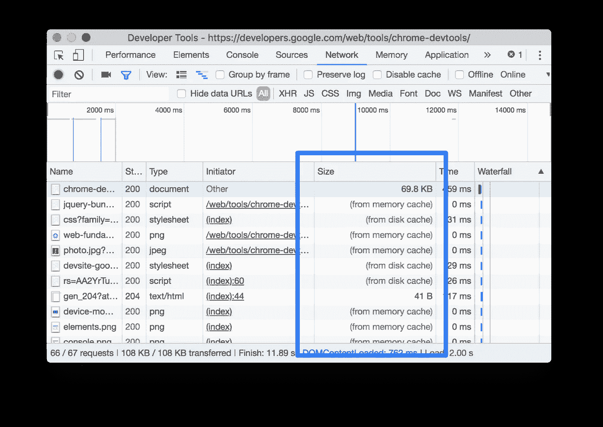

验证 Chrome DevTools 中的缓存响应—[Google 开发者门户上的缓存策略](https://developers.google.com/web/tools/lighthouse/audits/cache-policy)

由于 Angular 在文件名中使用哈希后缀来创建静态资源，所以您可以通过添加*Cache-Control*HTTP header*来为这些资源引入长缓存生存期。*当你这么做的时候，你也应该考虑[让你的缓存](https://developers.google.com/web/fundamentals/performance/optimizing-content-efficiency/http-caching#invalidating_and_updating_cached_responses) *失效。*然而*，Angular 应用*并不需要使静态资源的缓存无效，因为 Angular 的构建系统会在资源文件名更新时自动改变其后缀哈希。

此外，Firebase 自动用 gzip 压缩静态资源，并返回一个带有*内容编码* gzip 头的响应。但是我还是想放一个显式的标题，让它的意图清晰可见。


启用供应商区块的 Angular 的生产构建输出。也演示了文件名中的散列。

> 💡提示—将 vendorChunk 引入到 Angular 应用的生产构建配置中—请参见 angular.json 中的 vendor chunk 选项。这将有助于您的 PWA 缓存策略，因为您很可能不会过于频繁地更新供应商库。

下面的示例演示了添加长缓存生存期和提供压缩的静态资源；

```
{
  "headers": [
  {
    "source": "**/*.@(js|css)",
    "headers": [
      {
        "key": "Cache-Control",
        "value": "max-age=31536000"
      },
      {
        "key": "Content-Encoding",
        "value": "gzip"
      }
    ]
  }
}
```

您可能已经注意到，Firebase 配置接受源文件的[类 glob 模式](https://firebase.google.com/docs/hosting/full-config#glob_pattern_matching)。

## 10.2 保持额外服务人员文件的新鲜

如果您对所有的 js 和 css 文件使用上面的这种缓存配置，那么您必须为您的附加服务工作者文件创建一个例外规则。这里有一个*无缓存*异常的例子；

```
{
  "headers": [
  {
    "source": "**/*-sw.js",
    "headers": [
      {
        "key": "Cache-Control",
        "value": "no-cache"
      }
    ]
  }
}
```

这条规则将确保我们所有与文件名模式 ***/*-sw.js* 匹配的服务人员文件保持新鲜。

## 10.3 添加带有链接头的 HTTP/2 服务器推送

HTTP/2 目前支持所有的`*.firebaseapp.com`流量，要在 Firebase 主机上使用 HTTP/2，您不需要做任何事情！如果用户的浏览器支持，它将自动提供服务。点击此处了解更多信息:

[](https://firebase.googleblog.com/2016/09/http2-comes-to-firebase-hosting.html) [## HTTP/2 来到 Firebase 托管

### 谷歌移动开发平台 Firebase 的官方博客

firebase.googleblog.com](https://firebase.googleblog.com/2016/09/http2-comes-to-firebase-hosting.html) 

但是，您可能希望手动将 HTTP/2 服务器推送引入到您的应用程序中。通过使用[链接头](https://w3c.github.io/preload/#server-push-http-2)，Firebase hosting 引入了对 HTTP/2 服务器推送的实验性支持。服务器推送允许服务器在发出初始请求时自动发送附加资源的内容。服务器推送的一个常见用途是在加载页面时发送相关的静态资源，比如 JavaScript 和 CSS 文件。

您需要将链接头添加到您的`firebase.json`配置文件中，并指出您的静态资源的路径，以便在 Firebase 主机上配置服务器推送。这里有一个例子:

```
{
  "headers": [
    {
      "source": "/",
      "headers": [{"key": "Link", "value": "</js/app.js>;rel=preload;as=script,</css/app.css>;rel=preload;as=style"}]
    },
    {
      "source": "/users/*",
      "headers": [{"key": "Link", "value": "</js/app.js>;rel=preload;as=script,</css/app.css>;rel=preload;as=style;nopush,</css/users.css>;rel=preload;as=style"}]
    }
  ]
}
```

## 10.4 基本主机配置示例

以下示例展示了我的一个 pwa 的配置示例。我推荐你阅读 Firebase 上托管配置的[文档，让你了解所有可能的配置选项。](https://firebase.google.com/docs/hosting/full-config)

我在其中一个 pwa 上使用的完整 firebase.json 配置文件示例

# 11.将你的 PWA 部署到 Firebase

将应用部署到 Firebase 非常简单。只需通过 Firebase CLI 在您的项目根目录中执行`firebase deploy`，您就可以开始了！

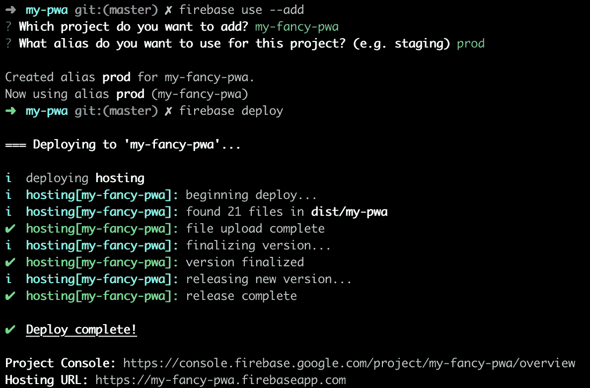

如果您还没有完成，您可能需要添加一个项目

# 12.使用 Lighthouse 审核您的 PWA

Lighthouse 是一款[开源](https://github.com/GoogleChrome/lighthouse)，用于提高网页质量的自动化工具。你可以在任何网页上运行它，无论是公开的还是需要认证的。它对性能、可访问性、渐进式网络应用等进行审计。


审计 PWA 可以在在线审计运行器、Chrome DevTools 和通过 [Lighthouse CLI](https://developers.google.com/web/tools/lighthouse/#cli) 完成。

## 12.1 使用在线审计运行程序

您可以运行 Lighthouse 审计，方法是导航到下面的链接，并输入您想要运行审计的应用程序的 URL。

[](https://developers.google.com/web/tools/lighthouse/run) [## 试试 Lighthouse |开发者工具| Google 开发者

### 对任何地点运行灯塔。

developers.google.com](https://developers.google.com/web/tools/lighthouse/run) 

## 12.2 使用 Chrome 开发工具

一旦您按照本文的提示配置了 PWA，并使用推荐的配置将您的应用程序部署到 firebase，您的应用程序就可以接受审计了。你可以[在 Chrome DevTools](https://developers.google.com/web/tools/lighthouse/#devtools) 上运行一个审计，看到 Progressive Web App 审计的分数是 100。

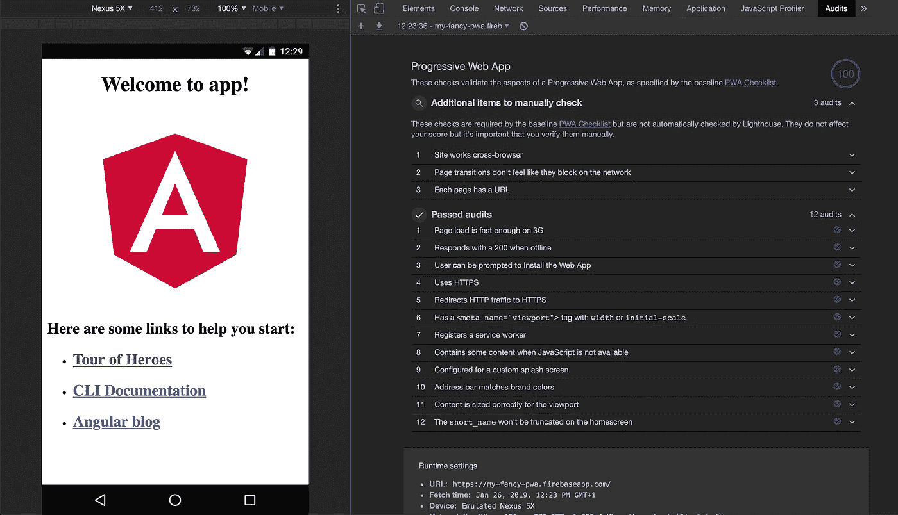

💯Lighthouse PWA 审计得分— Chrome DevTools 审计

## 12.3 使用 Lighthouse CLI

Lighthouse 的审计可以通过 Lighthouse CLI 在您的持续集成环境中自动进行。这将确保您的任何更改都不会影响您设置的任何审核的分数[—参见 Lighthouse 回归中的 CLI 选项](https://github.com/GoogleChrome/lighthouse#cli-options)。

> 💡提示-您可以比较当前和以前审计的 Lighthouse 报告，以确保您的更改不会对您的应用程序产生影响。

下面的命令将执行一个 headless Chrome 并根据 url 运行审计，然后显示一个报告。

```
npx lighthouse [https://my-fancy-pwa.firebaseapp.com](https://my-fancy-pwa.firebaseapp.com) --chrome-flags="--headless" --view
```

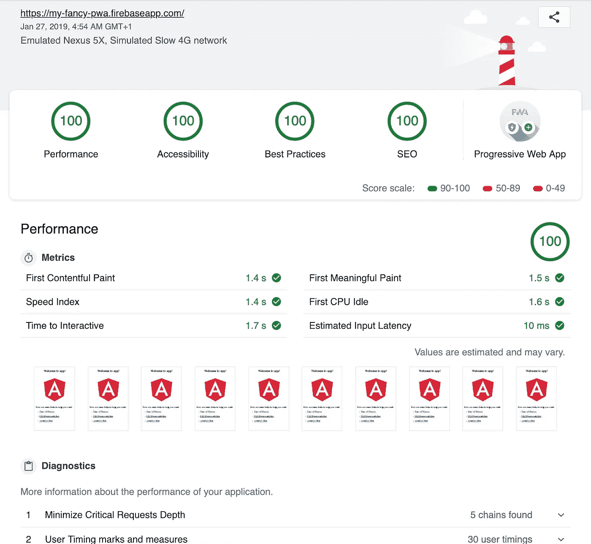

Lighthouse CLI 报告，以 html 格式查看

> 💡提示—在您的生产应用程序上执行夜间回归，以根据更新的 PWA 审核来监控它，这将有助于您与未来的 PWA 最佳实践保持一致，因为审核列表会及时更新。

# 你的 PWA 还有什么？

随着网络不断增长的力量，你可以向网络应用程序中引入的任何东西都是你的 PWA 的一个选项。请务必查看 iOS 的 [WebKit 功能状态](https://webkit.org/status)和 Android 平台兼容性的 [Chrome 平台状态](https://www.chromestatus.com)，以了解您想要调整的功能和 Web APIs。

在 iOS 11.3 首个测试版发布一年后，苹果近日发布了 iOS 12.2 首个测试版。这是引入 PWA 支持以来的第一个版本，其中有相当好的改进——将 PWA 的最大问题集中在 iOS 上。点击此处了解更多信息:

[](https://medium.com/@firt/pwas-on-ios-12-2-beta-the-good-the-bad-and-the-not-sure-yet-if-good-a37b6fa6afbf) [## iOS 12.2 beta 上的 PWAs:好的、坏的和“还不确定是否好”

### 一年前，2018 年 1 月，苹果公司以其对渐进式 Web 应用技术的早期支持让所有人感到惊讶…

medium.com](https://medium.com/@firt/pwas-on-ios-12-2-beta-the-good-the-bad-and-the-not-sure-yet-if-good-a37b6fa6afbf) 

此外，只需在手机或桌面浏览器上浏览[https://whatwebcando . today](https://whatwebcando.today)和[https://tomayac.github.io/pwa-feature-detector/](https://tomayac.github.io/pwa-feature-detector/)，就能从浏览器的功能中获得灵感。

如果你想给你的 PWA 添加推送通知功能，你可以遵循我的同事 [Ural](https://medium.com/u/b4ee91751c76?source=post_page-----8f2a69824fcc--------------------------------) 下面的指南。

[](/push-notification-with-angular-net-core-a2280d18eda1) [## 用角度&推送通知。网络核心

### 所以，你想随时戳用户(如果他们接受)从你的 web 应用。在这里，我想解释一下…

itnext.io](/push-notification-with-angular-net-core-a2280d18eda1) 

关注我的 [**Twitter**](https://twitter.com/onderceylan) 以获得更多类似本文的提示。

如果你觉得这篇文章有用，请不要忘记**鼓掌**和**关注**。此外，请随意撰写关于您的 PWA 发展历程的评论。我很想听听这一切！