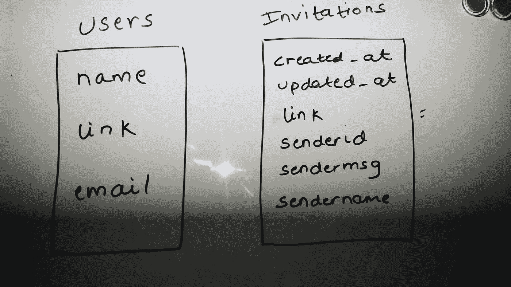

# 在 Node-Express 和 Postgres 中建立一个查询系统

> 原文：<https://itnext.io/build-a-referral-system-in-node-express-and-postgres-da56fa4913d4?source=collection_archive---------3----------------------->


[图像来源](https://medium.com/buttercloud-labs/how-to-build-a-referral-program-to-encourage-word-of-mouth-marketing-b77ff30f07d9)

口碑是当今最有效的营销策略之一。我们每天都看到许多公司利用推荐计划进行有针对性的促销和营销。但是这些推荐项目是如何建立的呢？背后的逻辑是什么？今天，我们将通过建立一个我们自己简单而完整的查询系统来回答这些问题。

但是让我们先看看这个应用程序吧！这就对了，伙计:点击那个-【https://invitation-system.herokuapp.com/ 

你可以在这里看到资源库:【https://github.com/akshar07/invitation-system】T4

酷！这就是我们将要建造的:

我们将有 2 个应用程序:

*   应用程序接口
*   Web 客户端

Web 客户端将有两个视图:

*   一个**仪表板**认证用户能够发送邀请到一个电子邮件地址的消息，并列出所有邀请及其状态(可见或不可见)
*   **收件人查看邀请的**，他可以看到邀请消息和发件人信息

该 API 将创建一个邀请发送者，接收者和每个邀请将通过唯一的网址访问。

我们将使用以下组件来构建它:

*   节点快递服务器
*   Postgres 数据库
*   用于发送电子邮件的节点电子邮件程序
*   用于社交认证的 passportJS


**我们开始吧**

1.  初始化新项目:

```
npm init --y
```

在 package.json 中添加以下依赖项:

```
npm install
```

一旦安装，我们将开始在我们的后端工作。

**设置 Postgres:**



我们将有两个表——一个用于存储已验证的**用户**和所需信息，另一个用于存储用户发送的所有**邀请**。我们还将维护一个时间戳，让发件人知道他们的邀请是否被查看。

**脸书认证:**

我假设你有 facebook 开发人员帐户和一个应用程序设置。如果没有，有大量的资源介绍如何设置 fb 应用程序进行开发。也就是说，让我们看看我们如何处理用户注册/用 passport JS facebook 策略登录。

我们正在做一些重要的事情:

1.  一旦我们从 facebook 取回数据，我们首先检查用户是否已经在我们的系统中。
2.  如果用户在那里，只需调用 done 方法就可以将用户导航到主页
3.  如果用户不存在，将他添加到我们的数据库中，并调用完成
4.  我们还检查我们的 generateid 函数是否没有生成带连字符的字符串，因为这将导致我们进一步的逻辑出现问题。

**首页:**

主页视图:

我们将保持用户仪表板非常简单:

好了，让我们在应用程序中添加邀请功能。我们将让用户输入任何电子邮件 id 来发送邀请，并附上一条消息。我们的 Invite 函数如下:

在这里，我们只是收集所有的数据，并将其发布到我们的服务器，在那里我们将实际上添加邀请到我们的数据库，并发送电子邮件给期望的人。

我们首先提取请求数据，并将其插入到数据库中。然后，我们使用 send email 功能向输入的电子邮件地址发送电子邮件，稍后我们将对此进行探讨。我们还将使用当前时间更新此邀请的 created_at 值。

发送电子邮件功能

这里我们使用 nodemailer 一个发送电子邮件的 npm 模块。为了安全起见，将您的 gmail 电子邮件和密码作为环境变量添加到您的服务器中。我们将使用我们的邀请码和接收者邀请码来格式化邀请字符串，以便当用户点击链接时，我们可以很容易地从数据库中获取特定的邀请。

```
*let* clientUrl = `https://invitation-system.herokuapp.com/invite/${_from}-${_link}`;
```

**注意:更改您的 gmail 帐户设置以允许不太安全的应用程序，以便 nodemailer 可以代表您发送邮件。**

现在在我们的主页视图中，我们有一个空列表来显示所有用户的邀请和他们的状态。让我们填充这个列表:

我们只需将我们唯一的邀请码作为查询参数发送给服务器，就可以获得所有发送的邀请。在服务器端，我们用我们的邀请码查询邀请表，并传回结果。

太好了！现在，我们只需点击一下，就可以看到我们所有的邀请及其状态。到目前为止一切顺利。

现在我们必须创建收件人视图。我们将有一个不同的路线。如果您还记得，我们格式化了邀请 url，以便在收件人点击它时从我们的数据库中获取特定的邀请。我们现在将分离两个邀请代码，并查询邀请表以获得准确的邀请数据。

这里我们还做了一件更重要的事情，那就是当接收者点击链接时，用当前时间戳更新邀请表中 updated_at 列的值。因此，我们可以在主主页面板上看到接收者是否看到我们的链接的状态。然后，我们将数据发送回我们的前端，并显示邀请的详细信息。

我们做到了！做那只狼，在街上发出那些邀请…

我希望你喜欢这篇文章。请在评论区留下你的反馈，如果你喜欢，别忘了鼓掌。

PS:点击下面的鼓掌按钮，其实你也可以像狮子座一样鼓掌。试试看！