# 使用 AWS Lambda 函数和 Netlify 构建一个无服务器应用程序

> 原文：<https://itnext.io/build-a-server-less-application-using-aws-lambda-functions-with-netlify-525b8326ce77?source=collection_archive---------6----------------------->

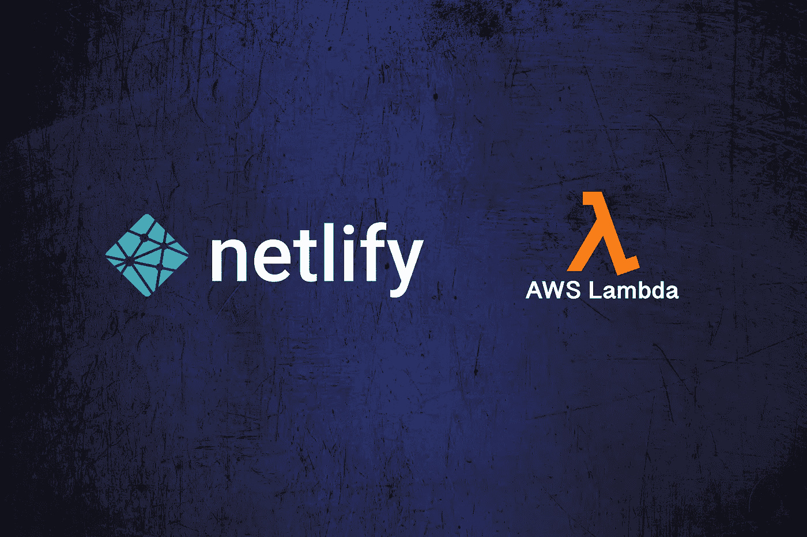

能够在无需管理服务器的情况下运行服务器端任务，让您可以更少地担心基础架构和可伸缩性，更多地关注应用程序本身。但是没有服务器你怎么运行服务器端的任务呢？嗯，有一个服务器运行这些任务。但是你不管理那个服务器！像 **AWS** 、 **GCP** 、 **Azure** 等云提供商。动态地负责服务器的分配和供应。此外，**功能即服务** ( **FaaS** )是一个允许开发者通过功能利用无服务器计算的概念。有趣的是，服务器端代码运行在使用**事件**触发的容器中。基本上，您所要做的就是在云上部署一个功能，它可以根据您的应用程序/客户端的请求独立运行，而不必维护一个完整的 **REST** 服务器并担心可伸缩性。这些函数通常被称为**λ函数**。然而，需要注意的是，无服务器架构的一切都是无状态的。

# 为什么是 Netlify？

许多 **FaaS** 像 **AWS Lambda** 设置起来非常复杂，非常适合大规模应用。 **Netlify** 使用由 **AWS** 驱动的 **Lambda 函数**，但是为我们简化并自动化了大部分过程。Netlify 提供的设置 Lambda 函数的便利为我们打开了一个可能性的世界。

# 概观

我们将构建一个**无服务器** web 应用程序，允许用户使用**[**send grid API**](https://github.com/sendgrid/sendgrid-nodejs/tree/master/packages/mail)发送自定义电子邮件。将我们的 **API 密钥**暴露给客户端是一个安全问题。然而，我们将使用 Lambda 函数向 [**Sendgrid API**](https://github.com/sendgrid/sendgrid-nodejs/tree/master/packages/mail) 发出发送电子邮件的请求，而不是必须设置和管理一个完整的后端服务器来对客户端隐藏应用程序逻辑。我们将使用**普通 Javascript** 和 **HTML** 和 **CSS** 来设置我们的客户端，并使用 **NodeJS** 来设置我们的 Lambda 函数。在本地测试了我们的 Lambda 函数之后，我们将把它们部署到 Netlify 上的客户端。我们还将使用免费的 SSL 证书为我们的无服务器应用程序设置一个自定义域。**

# **创建 Sendgrid 帐户并创建 API 密钥**

**请注意，如果您已经有了一个 Sendgrid 帐户和一个 API 密匙，请随意跳到 Git 设置。**

**您可以在这里 创建您的免费 Sendgrid 帐户 [**。**](https://sendgrid.com)**

## **创建 API 密钥**

**成功登录后，进入侧边栏设置选项下的 API Keys 部分。选择右上角的**创建 API 密钥**选项。**

**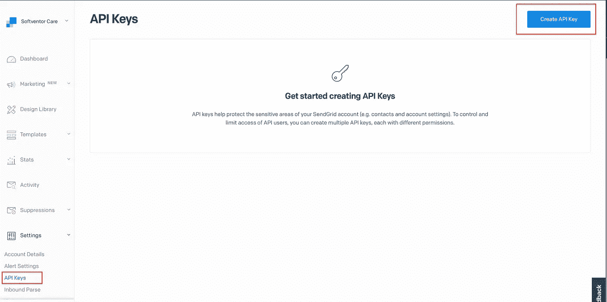**

**创建发送网格 API 密钥**

**给你的 API 密匙一个名字，并允许完全访问。然后选择**创建&视图**。**

**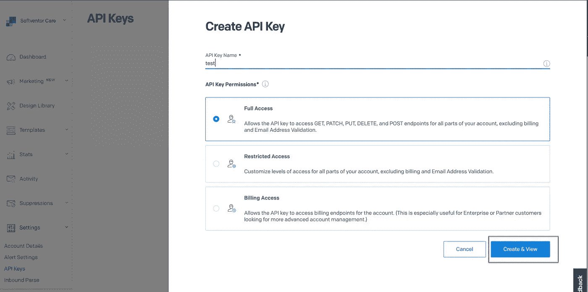**

**然后将显示您的 API 密钥。不要忘记拷贝并保存在某个地方。我们将在稍后配置 lambda 函数来发送电子邮件时使用它。**

# **在 Github 上创建本地 Git 回购和远程 Git 回购**

**在 **Github** 上创建了存储库之后，在您的终端上的一个单独的文件夹中运行以下命令，**

```
git init
touch README.md 
touch .gitignore
echo node_modules > .gitignore
git add README.md .gitignore
git commit -m "first commit"
git remote add origin YOUR_GITHUB_REPO_HTTPS_URL
git push -u origin master
```

**我们创建一个本地 repo，创建一个 **README.md** 文件，创建一个**。gitignore** 文件忽略**节点模块**文件夹，我们将在设置好 **NodeJS** 项目后创建该文件夹，添加并提交我们的更改，然后推送到 Github 上的远程存储库。**

# **NodeJS 设置**

**在同一个文件夹中，运行 **npm init** 来设置你的 NodeJS 项目。**

**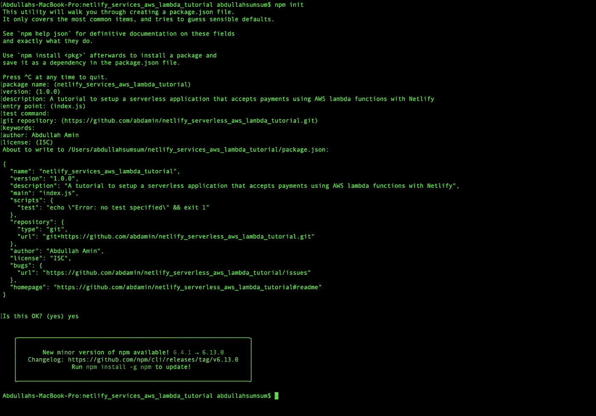**

## **项目相关性**

**我们将使用一组与 **NodeJS** 的依赖关系来配置我们的 Lambda 函数。从您的目录在终端中运行以下命令，**

```
npm i netlify-lambda @sendgrid/mail
```

**netlify-lambda 是一个命令行工具，它将帮助我们构建和服务我们的 lambda 函数。你可以在这里 查看它的文档 [**。而且， **@sendgrid/mail** 包将允许我们使用**](https://github.com/netlify/netlify-lambda) **[**Sendgrid API**](https://github.com/sendgrid/sendgrid-nodejs/tree/master/packages/mail) 发送邮件。****

## **在 package.json 中设置服务和构建脚本**

**用以下脚本替换 **package.json** 中的现有脚本，这样我们就可以**服务**和**构建**我们的 lambda 函数，**

```
"lambda-serve": "netlify-lambda serve functions"
"lambda-build": "netlify-lambda build functions"
```

**package.json**

**注意' **functions'** 是我们根文件夹中包含 lambda 函数的文件夹的名称。**

# **设置 Lambda 函数**

**从终端在项目的根目录下运行以下命令，**

```
mkdir functions
```

**如前所述， **functions** 是包含 lambda 函数的文件夹，文件夹中的每个文件都包含独立无状态 lambda 函数的代码。**

## **设置 **netlify.toml** 文件**

**我们还需要项目根目录中的 **netlify.toml** 文件。**

**netlify.toml**

**注意，这是根据 [**Netlify 文档**](https://docs.netlify.com/functions/build-with-javascript/#format) 完成的。 **functions** 变量值被设置为构建文件夹的名称，在我们的例子中命名为 **lambda** 。**

## **Netlify Lambda 函数如何工作的快速概述**

**下面是每个函数的格式，**

```
exports.handler = function(event, context, callback) {
    // your server-side code....

    //return successful (no error) response with body "Hello, World"
    callback(null, {
    statusCode: 200,
    body: "Hello, World"
    });
}
```

**每个保存 lambda 函数的 JS 文件必须导出一个**处理程序**，如上所述。调用无服务器功能时，Netlify 提供**事件**和**上下文**参数。然而，我们提供可选的**回调**参数。**

**当调用无服务器端点时，函数接收到**事件**对象。调用时关于应用程序上下文的信息，例如包含用户数据的 **JSON Web 令牌(JWT)** 包含在**上下文**参数中。**

****回调**用于返回对触发事件的响应，可以是错误或成功的响应对象。回调包含两个参数。第一个参数包含错误对象(如果有的话)，否则为 null，第二个参数包含响应对象。**

**想了解更多，推荐你看一下 [**Netlify 文档**](https://docs.netlify.com/functions/build-with-javascript/#format) 。**

## **设置发送电子邮件的 Lambda 函数**

**我们将在 functions 文件夹中创建一个文件**sendmeil . js**，该文件配置我们的 lambda 函数，当客户端触发时，该函数将通过与[**send grid API**](https://github.com/sendgrid/sendgrid-nodejs/tree/master/packages/mail)**通信来发送电子邮件。****

```
**touch ./functions/sendEmail.js**
```

****然后，我们将使用相同的结构来定义我们的 lambda 函数，如上面概述中所解释的。由于我们将使用用户在事件正文中提供的电子邮件地址和文本发送电子邮件，我们知道这将是一个 **POST** 请求。****

## ****仅服务于 POST 请求的错误检查****

****首先，我们需要添加一些错误检查来确保我们的函数只服务于带有 **POST** 请求**的事件。下面是我们函数的样子，******

****您可以通过在终端上运行项目目录中的以下命令来测试这个 lambda 函数，****

```
**npm run lambda-serve**
```

********

****这将在项目的根目录下创建一个名为 **lambda** 的构建文件夹，其中将包含我们的 lambda 函数的构建版本。同样，这个命令允许我们在**端口 9000 上提供我们的 lambda 函数。**因此，如果我们向**localhost:9000/send email**发出一个 **POST** 请求，我们将得到一个成功的响应。此外，由于我们增加了错误检查，我们的功能将只由一个 **POST** 请求触发。您可以使用 [**PostMan**](https://www.getpostman.com) 测试功能如下:****

****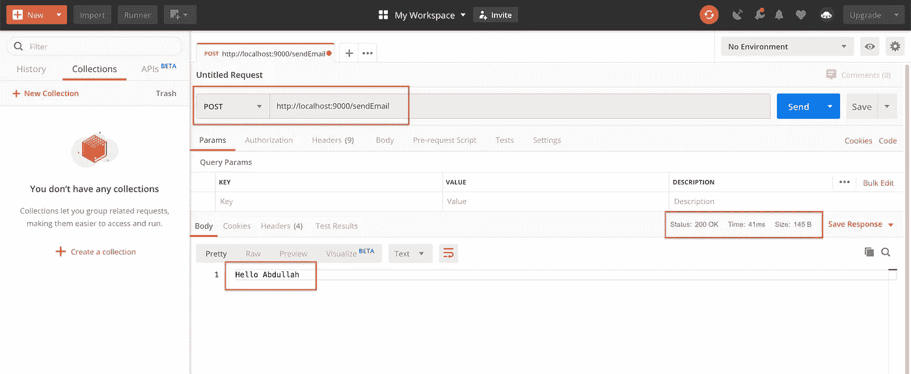****

****成功的发布请求****

****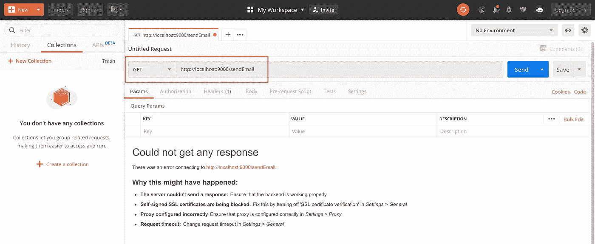****

****不成功的获取请求****

## ****将 Sendgrid API 与 Lambda 函数集成****

****我们现在将导入之前安装的 sendgrid npm 包。我们还将配置我们的函数来接受具有以下主体的事件，****

```
**{
 "to": TO_EMAIL_ADDRESS,
 "subject": SUBJECT_OF_EMAIL,
 "message": EMAIL_BODY
}**
```

******注意**错误检查和输入验证超出了本教程的范围，所以我们假设事件总是由有效的主体输入触发。****

****还要注意的是，为了这个教程，我们将使用**test@example.com**作为**发件人**的电子邮件地址。我们在 lambda 函数中创建的 email 对象将包含**到**的电子邮件地址、**发件人**的电子邮件地址、**主题**和**消息。**不要忘记使用 **JSON.parse()** 解析来自**事件主体**的传入数据，并使用 **JSON.stringify()将响应中的 JS 对象转换为 JSON 字符串。******

****此外，我们需要将下面的头添加到我们的函数回调调用中，以确保当我们与客户一起测试 lambda 函数时，不会遇到与 **CORS** 相关的问题。****

```
**//to enable cors on local development when we test our clientheaders: { "Access-Control-Allow-Origin": "*", "Access-Control-Allow-Headers": "Origin, X-Requested-With, Content-Type, Accept"}**
```

****下面是我们的 lambda 函数的样子，****

## ****邮递员测试****

****如前所述，我们将发送一个 POST 请求到**localhost:9000/send email******

****然而，现在我们将向请求传递一个主体，当函数被触发时，事件将包含该主体。我们将从 **PostMan** 向我们的请求传递**原始 JSON 数据**，如下所示:****

****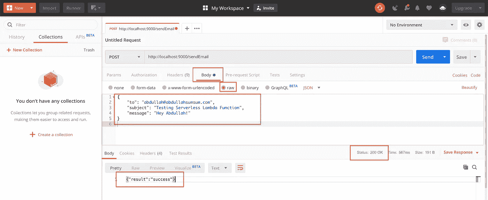****

****我们收到以下关于成功的 JSON 响应，****

```
**{"result": "success"}**
```

****如果您的输入有效，您应该会在收件箱中看到带有正确发件人电子邮件地址、主题和邮件正文的电子邮件。****

# ****客户端****

****如前所述，我们将使用普通 Javascript 构建我们的客户端。此外，我们将使用[**Twitter Bootstrap 4**](https://getbootstrap.com/docs/4.0/getting-started/introduction/)来设计我们的标记。****

## ****设置 HTML 文件****

****在你的项目根目录下创建一个 HTML 文件，命名为**index.html**。****

****不要忘记在你的 HTML 文件头中添加引导 4 **CDN** 。****

```
**<linkrel="stylesheet"href="https://maxcdn.bootstrapcdn.com/bootstrap/4.0.0/css/bootstrap.min.css"integrity="sha384-Gn5384xqQ1aoWXA+058RXPxPg6fy4IWvTNh0E263XmFcJlSAwiGgFAW/dAiS6JXm"crossorigin="anonymous"/>**
```

****下面的完整标记对您来说应该非常直观。主体内部的所有东西都被包装在一个引导容器组件中。在容器内部有两行，每一行有一个全尺寸 12 宽度的列。第一列包含一个 **h1 标签**，第二列包含表单。我还添加了几个引导类来对表单进行一些样式设计。你可以随意设计自己的风格。在表单之后是一个 **p** **标签**，它将包含我们的 lambda 函数在提交时返回的表单提交反馈。一些元素已经被分配了一个 **id** ，这在 JS 文件中会很有用。不要忘记在主体的末尾添加一个**脚本标签**来链接 Javascript 和标记。****

```
**<script src=”./js/main.js”></script>**
```

****最终的**index.htm**l 文件如下:****

## ****设置 Javascript 文件****

****在根目录下新建一个文件夹，命名为 **js** 。另外，在 **js** 文件夹中创建一个新的 Javascript 文件，并将其命名为 **main.js.******

****JS 文件看起来也应该非常简单。****

****首先，我们的 JS 文件包含了一个 URL 常量，赋值为[**http://localhost:9000/sendmail**](http://localhost:9000/sendEmail.)**。注意**在 Netlify 上部署我们的无服务器应用程序之前，我们将更改这个 URL。****

****我们还有一个**异步**函数 **sendEmail(url，data)** ，它使用 **fetch API** 向给定的 url 发出 **POST** 请求，并返回一个**承诺。******

****此外，我们还选择表单元素和其他相关元素来提交数据并显示相关的服务器端反馈。****

## ****测试客户端****

****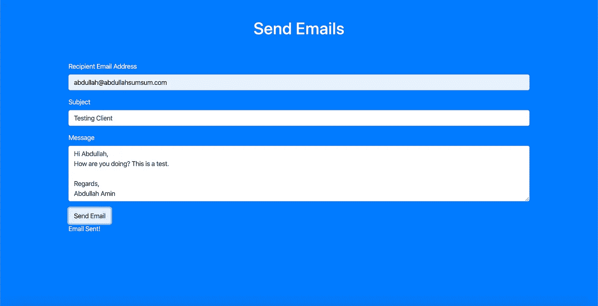****

****在用各种有效的输入测试了客户端之后，我确信我们的客户端和 lambda 函数正在工作，电子邮件正在发送。部署时间到了！****

# ****在 Netlify 上部署无服务器应用程序****

## ****创建网络帐户****

****如果你还没有这样做，你可以在这里 创建一个免费账户 [**。请注意，我们将使用 Github 存储库在 Netlify 上进行部署。**](https://www.netlify.com)****

## ****将函数文件夹添加到。gitignore****

****由于我们将只部署名为 **lambda、**的构建文件夹，我们还可以将 **functions** 文件夹添加到**中。gitignore** 文件。这就是我们的**。gitignore** 文件应该是这样的，****

```
**node_modulesfunctions**
```

## ****从函数文件夹中删除 API 键****

****我们希望能够从环境变量中访问我们的 API 键，我们将从 Netlify 仪表板中配置这些环境变量。将设置 API 键的那一行更改为:****

```
**sgMail.setApiKey(process.env.API_KEY);**
```

## ****更改客户端 URL/端点****

****在 **main.js、**文件中，我们使用[**http://localhost:9000/sendmail**](http://localhost:9000/sendEmail)**作为我们的 URL。这只是为了在本地测试我们的 lambda 函数。在部署之前，我们必须将其更改为以下内容，******

```
****/.netlify/functions/sendEmail****
```

## ******推送至 Github******

```
****git add .git commit -m "Ready to Deploy"git push -u origin master****
```

## ******网络生活仪表板******

******从您的仪表板中选择**来自 Git 的新站点**选项。******

****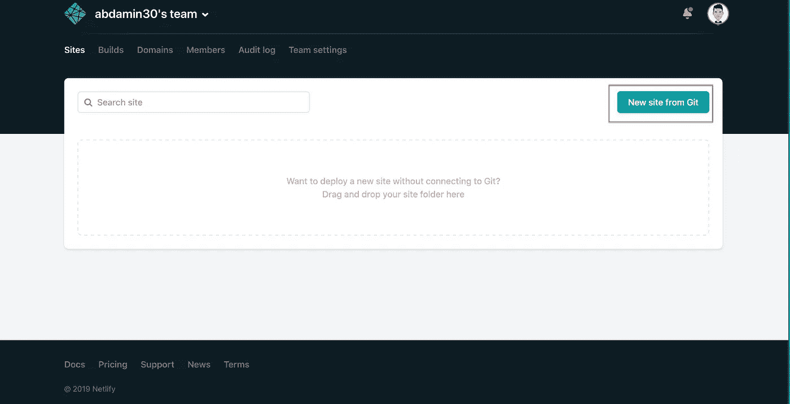****

****选择 **Github** 作为您的 Git 提供者。****

****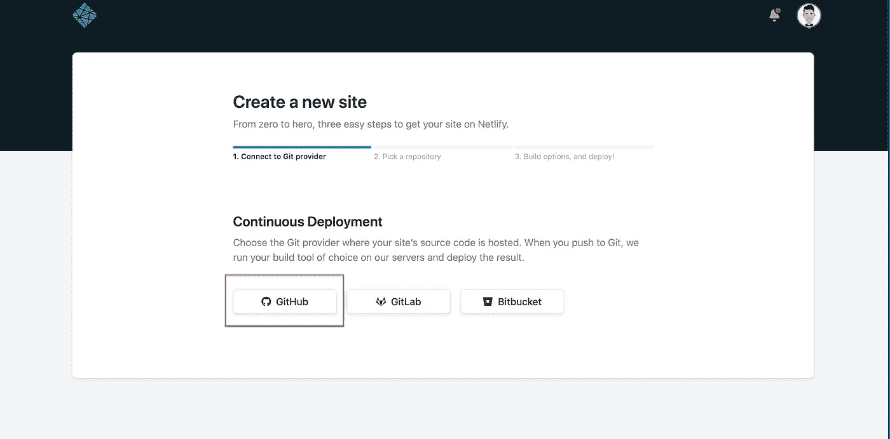****

****搜索并选择您的存储库。****

****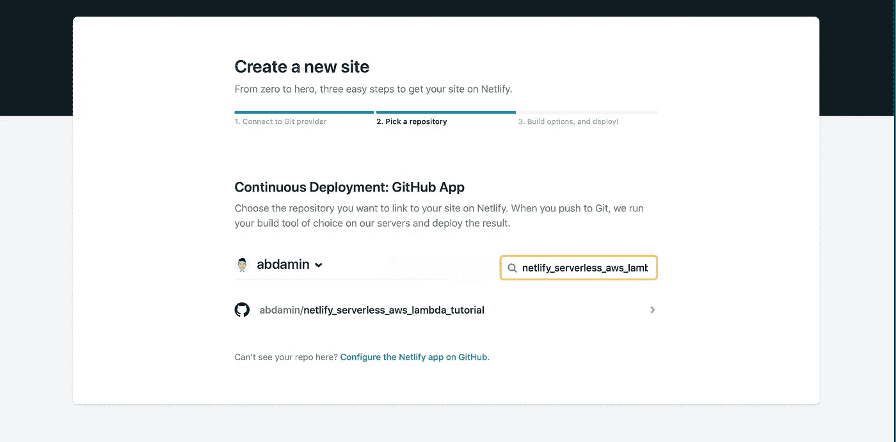****

****要部署的分支:**主******

****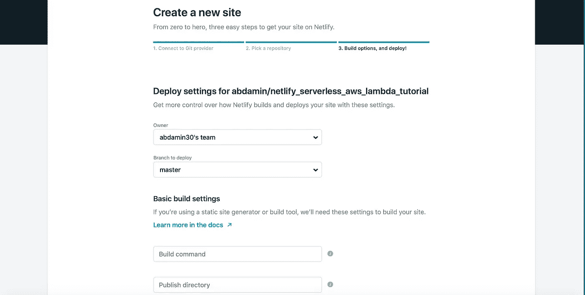****

****在高级构建设置下，添加您的 Sendgrid API 密钥并选择**部署站点。******

****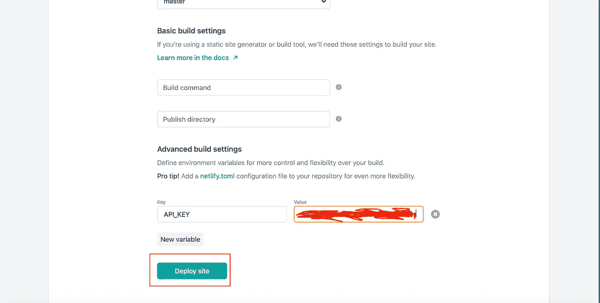****

****部署后，Netlify 还将在**netlify.com**下为我们的应用程序生成一个子域。****

****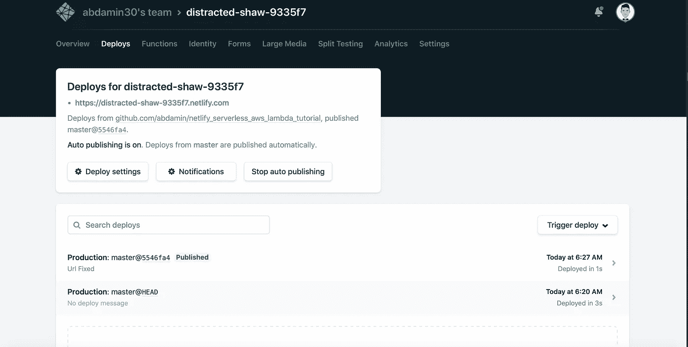********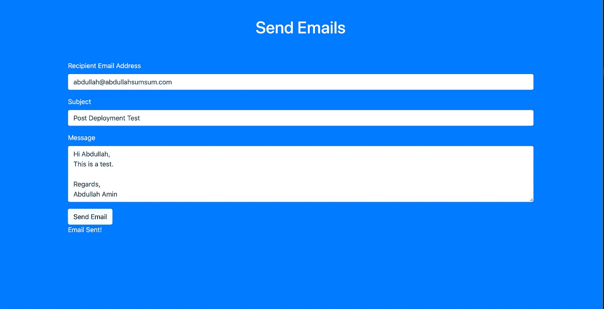****

****Netlify 将管理运行我们的 lambda 函数的服务器，我们不必担心可伸缩性。哦耶**！******

# ****自定义域和 SSL****

****我个人更喜欢用 [**作为我的域名注册商。您还可以使用此**](https://www.shareasale.com/r.cfm?u=2198460&m=46483&b=518798) **[**链接**](https://shareasale.com/r.cfm?b=1407373&u=2198460&m=46483&urllink=&afftrack=) 获得 [**独家优惠:顶级域名最高可享受 80%的折扣，同时享受免费 Whois 隐私**](https://shareasale.com/r.cfm?b=1407373&u=2198460&m=46483&urllink=&afftrack=) **！********

**但是，您可以使用任何注册服务商来遵循本指南。**

## **向 Netlify 应用程序添加自定义域**

**从您部署的应用程序的仪表板中选择**域设置**。**

**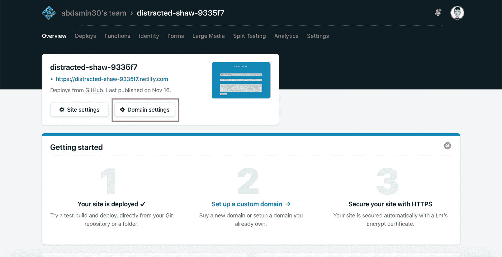**

**选择**添加自定义域。****

**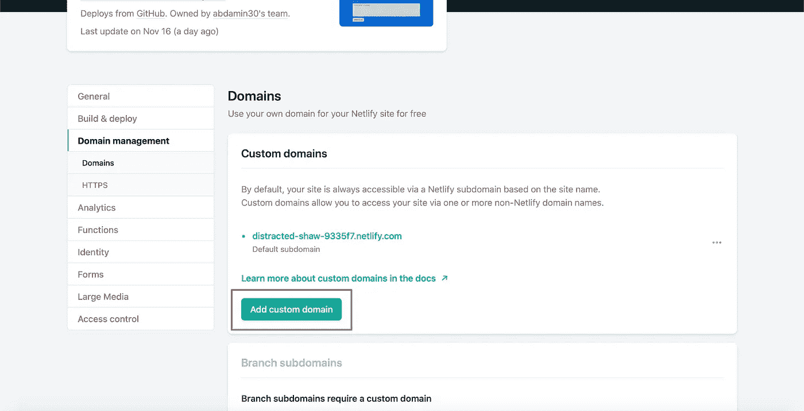**

**键入您的自定义域名并选择**验证。****

**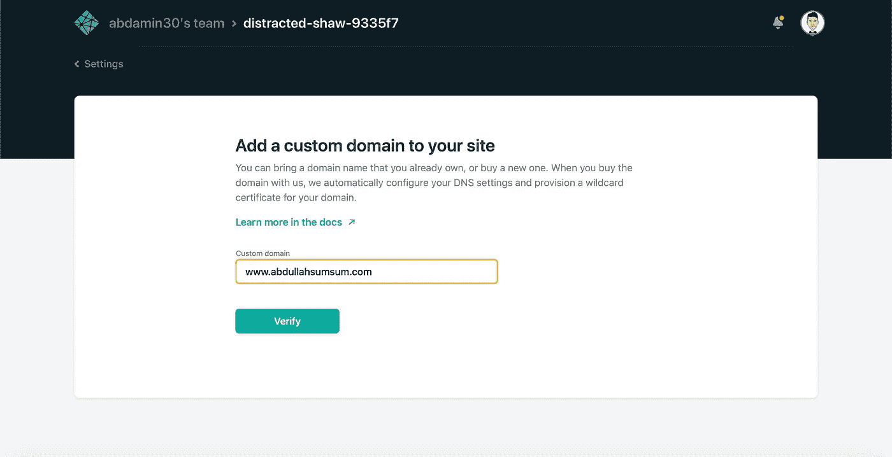**

**选择**检查 DNS 配置。****

****

**为了验证我们的 DNS，我们需要向我们的域名 DNS 添加记录。**

*   **CName 记录:将 **www** 指向**distracted-shaw-9335f7.netlify.com。****
*   **一条记录:将 **@** 指向**104.198.14.52****

**请注意， **www** 和 **@** (根域)指向的值可能因您的域而异。**

**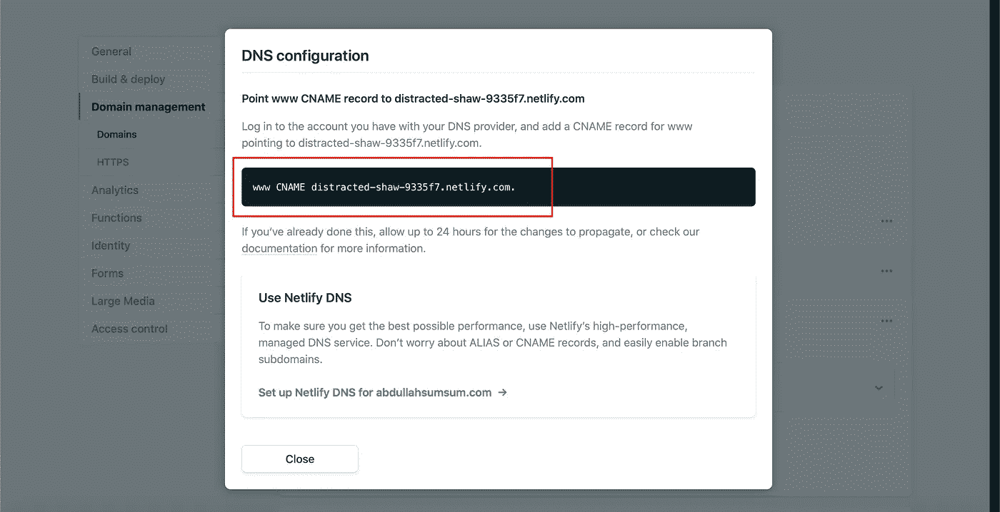****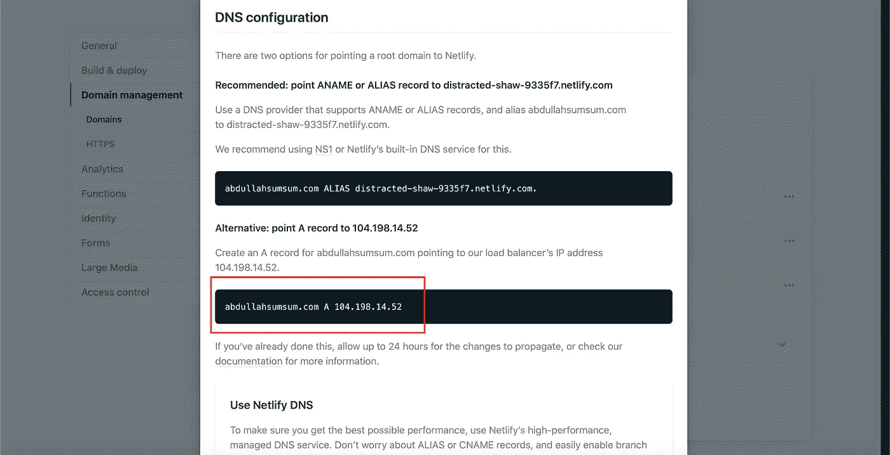**

## **配置域注册商**

**如前所述，我个人更喜欢使用 [**NameCheap**](https://www.shareasale.com/r.cfm?u=2198460&m=46483&b=518798) 作为我的域名注册商。如果你正在使用 Namecheap，你可以使用这个 [**链接**](https://www.shareasale.com/u.cfm?d=491929&m=46483&u=2198460) 来访问他们的 [**最新促销优惠**](https://www.shareasale.com/u.cfm?d=491929&m=46483&u=2198460) 。但是，您可以使用任何注册服务商来遵循本指南。**

**现在我们需要将 **CName** 和 **A** 记录添加到我们的域中。**

**在您的[**name priest**](https://www.shareasale.com/r.cfm?u=2198460&m=46483&b=518798)**仪表盘上，为相应的域选择**管理**。****

****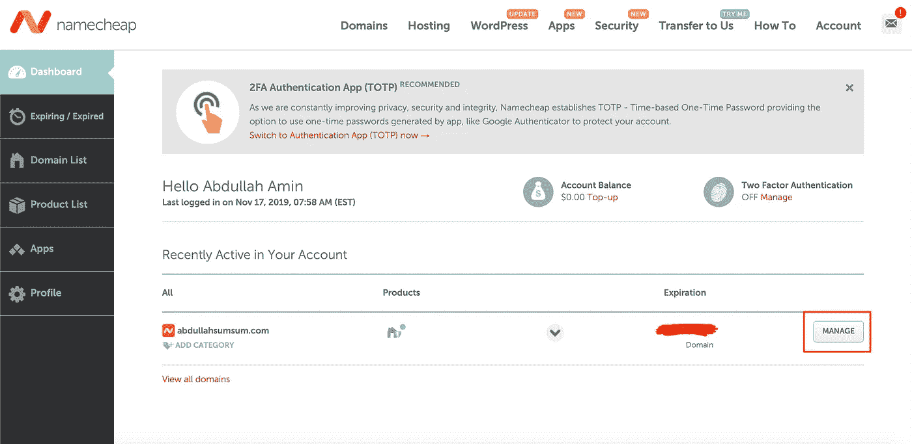****

****选择**高级 DNS。******

****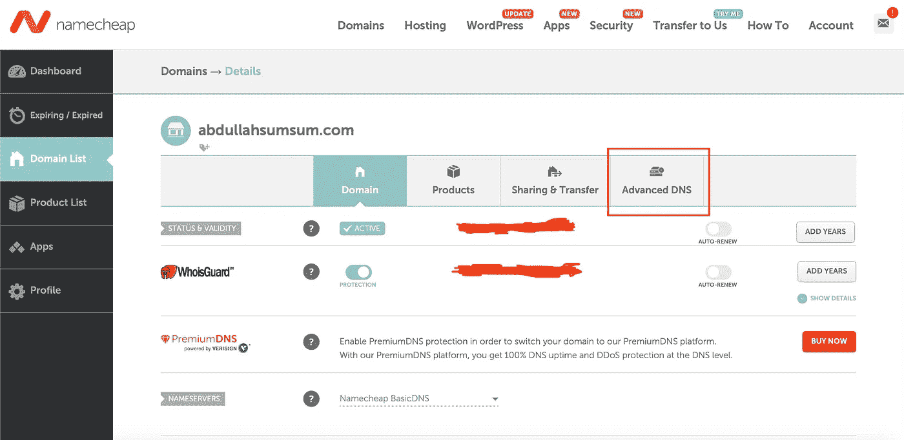****

****添加您的 **CName** 和 **A** 记录**和**并保存更改。****

********

****请注意，传播更改可能需要 48 小时。然而，这通常需要 5-10 分钟。****

****现在，您应该能够在您的 Netlify 的域设置中看到 DNS 配置已经过验证，并且应该能够使用您的自定义域名访问您的应用程序！****

****但是，我们仍然需要配置 Netlify 提供的免费 SSL 证书。****

****在域设置页面上，向下滚动并选择 **HTTPS** 部分下的**验证 DNS 配置**。****

****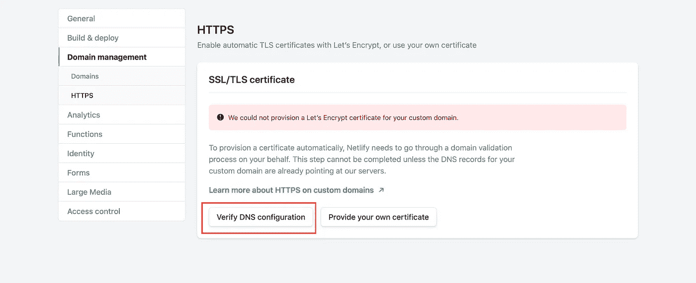****

# ****结论****

****值得注意的是，我们在本教程中仅仅触及了皮毛，还有更多**无服务器架构**可以提供！这是[**链接**](https://github.com/abdamin/netlify_serverless_aws_lambda_tutorial) 到 **Github 库**的链接，带有我们应用的完整代码。****

****如果您有任何问题，请随时发表评论。此外，如果这帮助了你，请喜欢并与他人分享。我定期发表与 web 开发相关的文章。考虑 [**在此输入您的电子邮件**](https://abdullahsumsum.com/subscribe) 以了解与 web 开发相关的最新文章和教程。你也可以找到更多关于我在 abdullahsumsum.com 做的事情****